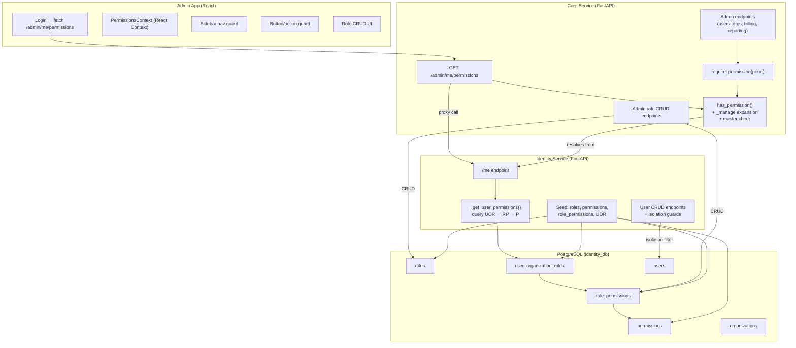

# Design Document: Admin Granular Roles & Permissions

## Overview

This feature replaces the hardcoded `["*.*"]` wildcard permission bypass for system admin users with a proper RBAC system that resolves permissions from the database. System admin roles are scoped to the master organization using the existing `Role`, `Permission`, `RolePermission`, and `UserOrganizationRole` models. Permissions follow a `system_admin.{domain}_{action}` naming convention with CRUD-level granularity across four domains (users, organizations, billing, reporting), plus a `_manage` shorthand and a `system_admin.master` super-permission.

The changes span three layers:
1. **Identity Service** — Remove the `*.*` override in `dependencies.py`, add a `/me` permissions resolution path that queries actual role-permission mappings, seed default system admin roles/permissions, and enforce isolation so org-level users cannot see or modify system admin users.
2. **Core Service** — Replace the `*.*` bypass in `dependencies.py` and `require_permission`, update `has_permission` to understand `_manage` expansion and `system_admin.master`, apply granular `require_permission` guards on every admin endpoint, and expose a `GET /admin/me/permissions` endpoint.
3. **Admin App (Frontend)** — Fetch permissions on login, conditionally render nav items and action buttons, filter `USER_TYPE_OPTIONS` and `ROLE_OPTIONS` based on the current user's permissions, and add role CRUD UI for Super Admins.

## Architecture



## Components and Interfaces

### 1. Permission Resolution (Identity Service)

**File:** `identity-service/app/dependencies.py`

Current behavior: `if user.user_type == UserType.SYSTEM_ADMIN: permissions = ["*.*"]`

New behavior: For system admin users, call `_get_user_permissions(db, user.id)` the same way as org users. The existing function already queries `UserOrganizationRole → RolePermission → Permission` and returns permission codes. No special-casing needed — the system admin's UOR record points to the master org and a system admin role, so the query naturally returns the correct permissions.

**File:** `identity-service/app/api/v1/endpoints/auth.py` (`/me` endpoint)

The `/me` endpoint already returns `current_user.permissions`. Once the dependency stops overriding with `["*.*"]`, it will return the real permission list.

### 2. Permission Resolution (Core Service)

**File:** `core-service/app/dependencies.py`

Current behavior: `if user_type == "system_admin": return CurrentUser(..., permissions=["*.*"])`

New behavior: For system admin users, call `_get_user_org_and_permissions(token)` which hits identity-service `/me`. The `/me` endpoint now returns real permissions, so core-service gets the actual list. The `organization_id` for system admins will be the master org ID.

### 3. Enhanced `has_permission` (Core Service)

**File:** `core-service/app/dependencies.py`

Updated logic:

```python
def has_permission(permissions: list[str], required_permission: str) -> bool:
    if not permissions or not required_permission:
        return False
    # Exact match
    if required_permission in permissions:
        return True
    # system_admin.master grants all system_admin.* permissions
    if required_permission.startswith("system_admin.") and "system_admin.master" in permissions:
        return True
    # _manage expansion: system_admin.users_manage grants system_admin.users_{read,create,update,delete}
    if "." in required_permission:
        resource, _, action = required_permission.partition(".")
        if "_" in action:
            domain = action.rsplit("_", 1)[0]  # e.g. "users" from "users_read"
            manage_perm = f"{resource}.{domain}_manage"
            if manage_perm in permissions:
                return True
    # Resource wildcard: resource.* grants resource.anything
    if "." in required_permission:
        resource, _, _ = required_permission.partition(".")
        if f"{resource}.*" in permissions:
            return True
    return False
```

### 4. Updated `require_permission` (Core Service)

**File:** `core-service/app/dependencies.py`

Remove the system admin bypass (`if current_user.user_type == "system_admin": return current_user`). Instead, rely entirely on `has_permission` which now understands `system_admin.master` and `_manage`.

### 5. Granular Endpoint Guards (Core Service)

**File:** `core-service/app/api/v1/endpoints/admin/users.py`

Replace `require_admin` with specific `require_permission` calls:

| Endpoint | HTTP Method | Permission Required |
|----------|-------------|-------------------|
| `POST /admin/users` | POST | `system_admin.users_create` |
| `GET /admin/users` | GET | `system_admin.users_read` |
| `GET /admin/users/{id}` | GET | `system_admin.users_read` |
| `PATCH /admin/users/{id}` | PATCH | `system_admin.users_update` |
| `DELETE /admin/users/{id}` | DELETE | `system_admin.users_delete` |

Similar pattern for organizations, billing, and reporting endpoints.

### 6. System Admin User Isolation (Identity Service)

**File:** `identity-service/app/api/v1/endpoints/users.py`

- `list_users`: Add filter `.filter(User.user_type != UserType.SYSTEM_ADMIN)` when the caller is not a system admin.
- `get_user`: Return 404 if target user is `system_admin` and caller is not.
- `create_user` / `update_user`: Reject `user_type=system_admin` unless caller holds `system_admin.master`.

### 7. Permissions API Endpoint (Core Service)

**New endpoint:** `GET /admin/me/permissions`

```python
@router.get("/me/permissions")
async def get_my_admin_permissions(
    current_user: CurrentUser = Depends(require_admin),
) -> dict:
    return {
        "user_id": str(current_user.id),
        "user_type": current_user.user_type,
        "permissions": current_user.permissions,
    }
```

### 8. System Admin Role CRUD Endpoints (Core Service)

**New router:** `core-service/app/api/v1/endpoints/admin/roles.py`

| Endpoint | Method | Permission | Description |
|----------|--------|-----------|-------------|
| `GET /admin/roles` | GET | `system_admin.master` | List system admin roles with permissions |
| `POST /admin/roles` | POST | `system_admin.master` | Create role with permission links |
| `PATCH /admin/roles/{id}` | PATCH | `system_admin.master` | Update role name/permissions |
| `DELETE /admin/roles/{id}` | DELETE | `system_admin.master` | Delete role and RolePermission records |
| `GET /admin/permissions` | GET | `system_admin.master` | List all available system admin permissions |

These endpoints proxy to identity-service or query the identity DB directly (same pattern as existing admin endpoints).

### 9. Frontend Permission Context (Admin App)

**New file:** `apps/admin/src/app/contexts/PermissionsContext.tsx`

On login, fetch `GET /admin/me/permissions` and store in React Context. Expose a `hasPermission(code: string): boolean` helper that checks exact match, `_manage` expansion, and `system_admin.master`.

### 10. Frontend Conditional Rendering

**Sidebar navigation:** Hide nav items based on domain permissions:
- "Users" → requires any `system_admin.users_*`
- "Organizations" → requires any `system_admin.organizations_*`
- "Billing" → requires any `system_admin.billing_*`
- "Reports" → requires any `system_admin.reporting_*`

**Action buttons:** Hide create/edit/delete buttons based on specific CRUD permissions.

**User type / role options:** In `CreateUserModal` and `UserDetailModal`, filter `USER_TYPE_OPTIONS` and `ROLE_OPTIONS` to exclude `system_admin` values unless the current user holds `system_admin.master`.

### 11. Role Assignment UI (Admin App)

In the user creation flow for system admin users, add a role selection step:
1. Fetch `GET /admin/roles` to get available system admin roles.
2. Display roles as selectable cards/radio buttons.
3. On role selection, display associated permissions as read-only checkboxes.
4. Allow selecting multiple roles.
5. Submit role IDs alongside user creation payload.

### 12. Seed Script (Identity Service)

**File:** `identity-service/app/services/seed_service.py` (or equivalent)

Idempotent seed that creates:
1. System admin permission records (21 total: 4 domains × 5 perms + 1 master).
2. Default roles linked to permissions via `RolePermission`:
   - "Super Admin" → `system_admin.master`
   - "System User Manager" → `system_admin.users_{read,create,update,delete}`
   - "System Org Manager" → `system_admin.organizations_{read,create,update,delete}`
   - "System Billing Manager" → `system_admin.billing_{read,create,update,delete}`
   - "System Reports Viewer" → `system_admin.reporting_read`
3. Assign "Super Admin" role to the first existing `system_admin` user via `UserOrganizationRole` (scoped to master org).

Uses `INSERT ... ON CONFLICT DO NOTHING` or check-before-insert for idempotency.

## Data Models

### Permission Records (New Seed Data)

No schema changes needed. The existing `Permission` model supports the new permission codes:

| code | resource | action | module |
|------|----------|--------|--------|
| `system_admin.master` | `all` | `manage` | `system_admin` |
| `system_admin.users_read` | `user` | `read` | `system_admin` |
| `system_admin.users_create` | `user` | `create` | `system_admin` |
| `system_admin.users_update` | `user` | `update` | `system_admin` |
| `system_admin.users_delete` | `user` | `delete` | `system_admin` |
| `system_admin.users_manage` | `user` | `manage` | `system_admin` |
| `system_admin.organizations_read` | `organization` | `read` | `system_admin` |
| `system_admin.organizations_create` | `organization` | `create` | `system_admin` |
| `system_admin.organizations_update` | `organization` | `update` | `system_admin` |
| `system_admin.organizations_delete` | `organization` | `delete` | `system_admin` |
| `system_admin.organizations_manage` | `organization` | `manage` | `system_admin` |
| `system_admin.billing_read` | `billing` | `read` | `system_admin` |
| `system_admin.billing_create` | `billing` | `create` | `system_admin` |
| `system_admin.billing_update` | `billing` | `update` | `system_admin` |
| `system_admin.billing_delete` | `billing` | `delete` | `system_admin` |
| `system_admin.billing_manage` | `billing` | `manage` | `system_admin` |
| `system_admin.reporting_read` | `reporting` | `read` | `system_admin` |
| `system_admin.reporting_create` | `reporting` | `create` | `system_admin` |
| `system_admin.reporting_update` | `reporting` | `update` | `system_admin` |
| `system_admin.reporting_delete` | `reporting` | `delete` | `system_admin` |
| `system_admin.reporting_manage` | `reporting` | `manage` | `system_admin` |

### Role Records (New Seed Data)

| name | code | is_system | organization_id |
|------|------|-----------|----------------|
| Super Admin | `super_admin` | `true` | `<master_org_id>` |
| System User Manager | `system_user_manager` | `true` | `<master_org_id>` |
| System Org Manager | `system_org_manager` | `true` | `<master_org_id>` |
| System Billing Manager | `system_billing_manager` | `true` | `<master_org_id>` |
| System Reports Viewer | `system_reports_viewer` | `true` | `<master_org_id>` |

### Authorization Constants Update

**File:** `core-service/app/core/authorization.py`

Replace the coarse-grained constants with CRUD-level ones:

```python
# System Admin — Users domain
SYSTEM_ADMIN_USERS_READ = "system_admin.users_read"
SYSTEM_ADMIN_USERS_CREATE = "system_admin.users_create"
SYSTEM_ADMIN_USERS_UPDATE = "system_admin.users_update"
SYSTEM_ADMIN_USERS_DELETE = "system_admin.users_delete"
SYSTEM_ADMIN_USERS_MANAGE = "system_admin.users_manage"

# System Admin — Organizations domain
SYSTEM_ADMIN_ORGANIZATIONS_READ = "system_admin.organizations_read"
SYSTEM_ADMIN_ORGANIZATIONS_CREATE = "system_admin.organizations_create"
SYSTEM_ADMIN_ORGANIZATIONS_UPDATE = "system_admin.organizations_update"
SYSTEM_ADMIN_ORGANIZATIONS_DELETE = "system_admin.organizations_delete"
SYSTEM_ADMIN_ORGANIZATIONS_MANAGE = "system_admin.organizations_manage"

# System Admin — Billing domain
SYSTEM_ADMIN_BILLING_READ = "system_admin.billing_read"
SYSTEM_ADMIN_BILLING_CREATE = "system_admin.billing_create"
SYSTEM_ADMIN_BILLING_UPDATE = "system_admin.billing_update"
SYSTEM_ADMIN_BILLING_DELETE = "system_admin.billing_delete"
SYSTEM_ADMIN_BILLING_MANAGE = "system_admin.billing_manage"

# System Admin — Reporting domain
SYSTEM_ADMIN_REPORTING_READ = "system_admin.reporting_read"
SYSTEM_ADMIN_REPORTING_CREATE = "system_admin.reporting_create"
SYSTEM_ADMIN_REPORTING_UPDATE = "system_admin.reporting_update"
SYSTEM_ADMIN_REPORTING_DELETE = "system_admin.reporting_delete"
SYSTEM_ADMIN_REPORTING_MANAGE = "system_admin.reporting_manage"

# System Admin — Master (super permission)
SYSTEM_ADMIN_MASTER = "system_admin.master"
```

### Frontend Permission Types

```typescript
// apps/admin/src/app/types/permissions.ts
export const SYSTEM_ADMIN_PERMISSIONS = {
  MASTER: 'system_admin.master',
  USERS_READ: 'system_admin.users_read',
  USERS_CREATE: 'system_admin.users_create',
  USERS_UPDATE: 'system_admin.users_update',
  USERS_DELETE: 'system_admin.users_delete',
  USERS_MANAGE: 'system_admin.users_manage',
  ORGANIZATIONS_READ: 'system_admin.organizations_read',
  ORGANIZATIONS_CREATE: 'system_admin.organizations_create',
  ORGANIZATIONS_UPDATE: 'system_admin.organizations_update',
  ORGANIZATIONS_DELETE: 'system_admin.organizations_delete',
  ORGANIZATIONS_MANAGE: 'system_admin.organizations_manage',
  BILLING_READ: 'system_admin.billing_read',
  BILLING_CREATE: 'system_admin.billing_create',
  BILLING_UPDATE: 'system_admin.billing_update',
  BILLING_DELETE: 'system_admin.billing_delete',
  BILLING_MANAGE: 'system_admin.billing_manage',
  REPORTING_READ: 'system_admin.reporting_read',
  REPORTING_CREATE: 'system_admin.reporting_create',
  REPORTING_UPDATE: 'system_admin.reporting_update',
  REPORTING_DELETE: 'system_admin.reporting_delete',
  REPORTING_MANAGE: 'system_admin.reporting_manage',
} as const;

export type SystemAdminPermission = typeof SYSTEM_ADMIN_PERMISSIONS[keyof typeof SYSTEM_ADMIN_PERMISSIONS];

export function hasPermission(
  userPermissions: string[],
  required: string
): boolean {
  if (userPermissions.includes('system_admin.master')) return true;
  if (userPermissions.includes(required)) return true;
  // _manage expansion
  const match = required.match(/^system_admin\.(\w+)_(read|create|update|delete)$/);
  if (match) {
    const managePerm = `system_admin.${match[1]}_manage`;
    if (userPermissions.includes(managePerm)) return true;
  }
  return false;
}

export function hasAnyPermissionForDomain(
  userPermissions: string[],
  domain: string
): boolean {
  if (userPermissions.includes('system_admin.master')) return true;
  return userPermissions.some(p => p.startsWith(`system_admin.${domain}_`));
}
```

