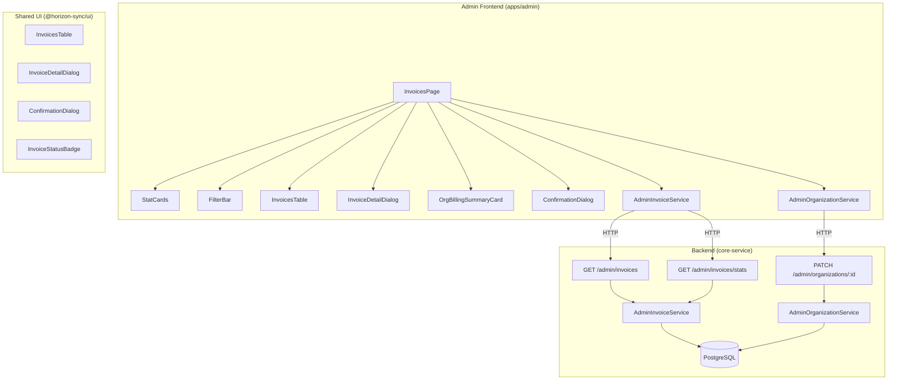

# Design Document: Admin Invoice & Organization Management

## Overview

This feature adds an Invoice Management page to the admin portal (`apps/admin`) that enables system_admin users to view, filter, and manage invoices across all organizations. It includes overdue invoice statistics, per-organization billing summaries, and the ability to suspend/reactivate organizations with overdue invoices.

The design reuses existing shared UI components from `@horizon-sync/ui` (InvoicesTable, InvoiceDetailDialog, ConfirmationDialog, InvoiceStatusBadge) and follows the established admin page pattern (stat cards → filters → DataTable → modals) seen in UsersPage and OrganizationsPage.

### Key Design Decisions

1. **Reuse over rebuild**: The shared InvoicesTable already has columns, actions, sorting, and pagination. We extend it with an organization name column rather than building a new table.
2. **Single new backend endpoint**: Only `/api/v1/admin/invoices/stats` is new. The existing `/api/v1/admin/invoices` endpoint already supports org/status/date filtering.
3. **ConfirmationDialog reuse**: The same ConfirmationDialog used for "Mark as Paid" in InvoiceManagement.tsx is reused for suspend/reactivate actions.
4. **Consistent page structure**: The InvoicesPage follows the exact same layout as UsersPage and OrganizationsPage — header, stat cards, filter bar, DataTable, modals.

## Architecture



### Data Flow

1. **Page Load**: InvoicesPage fetches invoice list + stats in parallel via `useInvoices` and `useInvoiceStats` hooks
2. **Filtering**: Filter changes reset pagination to page 1 and re-fetch from `/api/v1/admin/invoices`
3. **Detail View**: Clicking "View" fetches full invoice detail via `/api/v1/admin/invoices/{id}`
4. **Org Filter**: Selecting an organization shows the OrgBillingSummaryCard with stats scoped to that org
5. **Suspend/Reactivate**: ConfirmationDialog triggers PATCH to `/api/v1/admin/organizations/{id}` with `{ status: "suspended" | "active" }`

## Components and Interfaces

### Frontend Components

#### 1. InvoicesPage (`apps/admin/src/app/pages/InvoicesPage.tsx`)

The main page component. Follows the same pattern as UsersPage and OrganizationsPage.

**State Management:**
- `search`, `statusFilter`, `orgFilter`, `dateFrom`, `dateTo` — filter state
- `page`, `pageSize` — pagination state
- `selectedInvoice` — for detail dialog
- `suspendOrgId`, `suspendAction` — for ConfirmationDialog
- `tableInstance` — for DataTableViewOptions

**Hooks Used:**
- `useInvoices(filters)` — fetches paginated invoice list
- `useInvoiceStats(orgFilter)` — fetches stat card data
- `useOrganizations()` — populates org dropdown filter

#### 2. StatCards (inline in InvoicesPage)

Four stat cards matching the Dashboard/Users/Orgs pattern:
- Total Invoices (FileText icon, slate bg)
- Overdue Invoices (AlertTriangle icon, red bg)
- Total Outstanding (DollarSign icon, amber bg)
- Total Overdue Amount (DollarSign icon, red bg)

#### 3. OrgBillingSummaryCard (inline in InvoicesPage)

Conditionally rendered when an organization filter is selected. Shows:
- Organization name, total invoices, overdue count, total outstanding
- "Suspend Organization" or "Reactivate Organization" button based on org status

#### 4. Shared Components (from @horizon-sync/ui)

| Component | Usage | Customization |
|-----------|-------|---------------|
| `InvoicesTable` | Main data table | Extended with organization_name column |
| `InvoiceDetailDialog` | Invoice detail modal | Org name/ID added above content |
| `ConfirmationDialog` | Suspend/reactivate confirmation | Dynamic title, description, confirmLabel |
| `InvoiceStatusBadge` | Status display in table and detail | No changes needed |
| `SearchInput` | Search filter | Same as Users/Orgs pages |
| `Select` | Status/org dropdowns | Same as Users/Orgs pages |
| `DataTableViewOptions` | Column visibility | Same as Users/Orgs pages |

### Frontend Services

#### AdminInvoiceService (`apps/admin/src/app/services/admin-invoice.service.ts`)

New service class following the same pattern as `AdminOrganizationService`:

```typescript
class AdminInvoiceService {
  static async list(filters?: AdminInvoiceFilters): Promise<AdminInvoiceListResponse>;
  static async getById(id: string): Promise<AdminInvoiceDetailResponse>;
  static async getStats(organizationId?: string): Promise<AdminInvoiceStatsResponse>;
}
```

Uses `environment.apiCoreUrl` for base URL, `useUserStore` for auth token, same `request<T>` helper pattern.

### React Query Hooks

```typescript
// hooks/useInvoices.ts
function useInvoices(filters: AdminInvoiceFilters): UseQueryResult<AdminInvoiceListResponse>;

// hooks/useInvoiceStats.ts
function useInvoiceStats(organizationId?: string): UseQueryResult<AdminInvoiceStatsResponse>;

// hooks/useInvoice.ts (detail)
function useInvoice(id: string): UseQueryResult<AdminInvoiceDetailResponse>;
```

### Backend Components

#### Stats Endpoint (`GET /api/v1/admin/invoices/stats`)

New endpoint added to the existing `admin/invoices.py` router:

```python
@router.get("/stats")
async def get_invoice_stats(
    organization_id: UUID | None = Query(None),
    db: Session = Depends(get_db),
    _current_user: CurrentUser = Depends(require_admin),
) -> AdminInvoiceStatsResponse:
    service = AdminInvoiceService(db)
    return service.get_stats(organization_id=organization_id)
```

#### AdminInvoiceService.get_stats()

New method on the existing service:

```python
def get_stats(self, organization_id: UUID | None = None) -> AdminInvoiceStatsResponse:
    # SQL aggregation query:
    # - COUNT(*) as total_invoices
    # - COUNT(*) WHERE due_date < NOW() AND status IN ('pending', 'partial') as overdue_invoices
    # - SUM(outstanding_amount) as total_outstanding
    # - SUM(outstanding_amount) WHERE overdue as total_overdue_amount
    # Optional WHERE organization_id = :org_id
```

## Data Models

### Frontend Types (`apps/admin/src/app/types/invoice.types.ts`)

```typescript
export interface AdminInvoiceListItem {
  id: string;
  organization_id: string;
  organization_name: string | null;
  invoice_no: string;
  invoice_type: 'sales' | 'purchase';
  party_id: string;
  party_name: string | null;
  party_code: string | null;
  status: string;
  posting_date: string;
  due_date: string | null;
  grand_total: number;
  outstanding_amount: number | null;
  created_at: string;
}

export interface AdminInvoiceListResponse {
  invoices: AdminInvoiceListItem[];
  pagination: PaginationMeta;
}

export interface AdminInvoiceFilters {
  search?: string;
  organization_id?: string;
  status?: string;
  date_from?: string;
  date_to?: string;
  page?: number;
  page_size?: number;
}

export interface AdminInvoiceStatsResponse {
  total_invoices: number;
  overdue_invoices: number;
  total_outstanding: number;
  total_overdue_amount: number;
}

// Re-uses Invoice type from @horizon-sync/ui for detail view
export type AdminInvoiceDetailResponse = Invoice & {
  organization_name: string | null;
};
```

### Backend Schema (`AdminInvoiceStatsResponse`)

```python
class AdminInvoiceStatsResponse(BaseModel):
    total_invoices: int
    overdue_invoices: int
    total_outstanding: Decimal
    total_overdue_amount: Decimal
```

### Database

No new tables or migrations required. The stats endpoint queries the existing `invoices` table with aggregation functions. The organization status update uses the existing `organizations` table.

**Overdue calculation**: An invoice is considered overdue when `due_date < current_date AND status IN ('pending', 'partial')`.

## Correctness Properties

*A property is a characteristic or behavior that should hold true across all valid executions of a system — essentially, a formal statement about what the system should do. Properties serve as the bridge between human-readable specifications and machine-verifiable correctness guarantees.*

### Property 1: Invoice row contains all required fields

*For any* admin invoice list item, the rendered table row should contain the invoice number, organization name, party name, invoice type, posting date, due date, status, grand total, and outstanding amount.

**Validates: Requirements 1.2**

### Property 2: Search filter returns matching invoices

*For any* search query string, all invoices returned by the list endpoint should have either an invoice_no or party_name that contains the search string (case-insensitive).

**Validates: Requirements 2.1**

### Property 3: Organization filter scopes results

*For any* selected organization_id, all invoices returned by the list endpoint should have an organization_id matching the selected filter value.

**Validates: Requirements 2.2**

### Property 4: Date range filter scopes results

*For any* date range (date_from, date_to), all invoices returned by the list endpoint should have a posting_date that falls within the specified range (inclusive).

**Validates: Requirements 2.4**

### Property 5: Filter change resets pagination

*For any* filter state change (search, status, organization, or date range), the pagination should reset to page 1.

**Validates: Requirements 2.5**

### Property 6: Invoice detail shows organization context

*For any* invoice with an associated organization, the detail view should display both the organization name and organization ID.

**Validates: Requirements 3.3**

### Property 7: Overdue classification

*For any* invoice, it is classified as overdue if and only if its due_date is earlier than the current date AND its status is "pending" or "partial". This classification applies consistently in both the backend stats calculation and the frontend status badge rendering.

**Validates: Requirements 4.3, 7.3**

### Property 8: Org billing summary shows correct data when filtered

*For any* organization selected in the filter, the billing summary card should display the organization name, total invoice count, overdue count, and total outstanding amount that match the stats endpoint response scoped to that organization.

**Validates: Requirements 5.1**

### Property 9: Action button reflects organization status

*For any* organization displayed in the billing summary card, if the organization status is "active" (or any non-suspended status) and it has overdue invoices, the action button should read "Suspend Organization". If the organization status is "suspended", the action button should read "Reactivate Organization".

**Validates: Requirements 6.1, 6.7**

### Property 10: Organization status toggle sends correct status

*For any* organization, when the system_admin confirms a suspend action, the PATCH request should set status to "suspended". When the system_admin confirms a reactivate action, the PATCH request should set status to "active".

**Validates: Requirements 6.4, 6.9**

### Property 11: Stats endpoint returns correct aggregates

*For any* set of invoices in the database, the stats endpoint should return: total_invoices equal to the count of all invoices, overdue_invoices equal to the count of invoices where due_date < now AND status IN ('pending', 'partial'), total_outstanding equal to the sum of outstanding_amount across all invoices, and total_overdue_amount equal to the sum of outstanding_amount for overdue invoices only.

**Validates: Requirements 7.1**

### Property 12: Stats endpoint respects organization scoping

*For any* organization_id parameter, the stats endpoint should only aggregate invoices belonging to that organization. The total_invoices, overdue_invoices, total_outstanding, and total_overdue_amount should all be scoped to that single organization.

**Validates: Requirements 7.2**

## Requirement 9: Overdue Payment Reminder Email

### Component Usage

The `SendInvoiceEmailDialog` from `@horizon-sync/ui` is reused directly. It already provides:
- Email form with `to`, `subject`, `body` fields
- Invoice summary display (invoice number, customer, amount)
- Client-side validation (required fields, email format)
- `onSend(invoiceId, emailData)` callback

The InvoicesPage will:
1. Track `selectedInvoiceIds` state for multi-select (checkbox column in InvoicesTable)
2. Track `reminderInvoice` state for the currently open SendInvoiceEmailDialog
3. Show a "Send Reminder" button in the action bar, enabled only when selected invoices are all overdue
4. Pre-populate the email fields with overdue-specific content before opening the dialog

### Pre-populated Email Template

```
Subject: "Payment Reminder: Invoice {invoice_no} — Overdue by {days_overdue} days"

Body:
Dear {party_name},

This is a reminder that invoice {invoice_no} for {currency} {grand_total} was due on {due_date} and is now {days_overdue} days overdue.

Outstanding amount: {currency} {outstanding_amount}

Please arrange payment at your earliest convenience.

Best regards
```

`days_overdue` is calculated on the frontend as `Math.floor((Date.now() - new Date(invoice.due_date).getTime()) / 86400000)`.

### Backend Endpoint

#### `POST /api/v1/admin/invoices/{invoice_id}/send-reminder`

Added to the existing `admin/invoices.py` router.

```python
@router.post("/{invoice_id}/send-reminder")
async def send_reminder(
    invoice_id: UUID,
    body: SendReminderRequest,
    db: Session = Depends(get_db),
    current_user: CurrentUser = Depends(require_admin),
) -> dict:
    service = AdminInvoiceService(db)
    return await service.send_reminder(invoice_id, body, current_user.id)
```

#### Request Schema (`SendReminderRequest`)

```python
class SendReminderRequest(BaseModel):
    to: EmailStr
    subject: str
    body: str
```

#### `AdminInvoiceService.send_reminder()`

```python
async def send_reminder(self, invoice_id: UUID, email_data: SendReminderRequest, user_id: UUID) -> dict:
    inv = self.db.query(Invoice).filter(Invoice.id == invoice_id).first()
    if not inv:
        raise HTTPException(404, "Invoice not found")

    # Validate overdue: due_date < today AND status in ('pending', 'partial')
    from datetime import date
    if inv.due_date is None or inv.due_date >= date.today() or inv.status not in ('pending', 'partial'):
        raise HTTPException(400, "Invoice is not overdue")

    # Send via CommunicationService
    comm_service = CommunicationService(self.db)
    result = await comm_service.send_email(
        to=email_data.to,
        subject=email_data.subject,
        message=email_data.body,
        organization_id=inv.organization_id,
        user_id=user_id,
        doc_type="invoice",
        doc_id=str(inv.id),
        doc_no=inv.invoice_no,
    )
    return {"invoice_id": str(inv.id), "status": "reminder_sent", "communication": result}
```

### Data Flow

```
1. Admin selects overdue invoices → clicks "Send Reminder"
2. For single invoice: opens SendInvoiceEmailDialog with pre-populated fields
3. Admin reviews/edits email → clicks "Send Email"
4. Frontend calls POST /api/v1/admin/invoices/{id}/send-reminder with { to, subject, body }
5. Backend validates invoice is overdue → sends email via CommunicationService → returns success
6. Frontend shows success toast, closes dialog
7. For multiple invoices: repeats steps 2-6 sequentially for each invoice
```

### Correctness Properties for Requirement 9

### Property 13: Reminder email pre-population contains overdue details

*For any* overdue invoice (due_date < today AND status in ('pending', 'partial')), the pre-populated email subject should contain the invoice number and days overdue, and the pre-populated email body should contain the invoice number, grand total, due date, days overdue, and outstanding amount.

**Validates: Requirements 9.2, 9.3, 9.4**

### Property 14: Send reminder endpoint rejects non-overdue invoices

*For any* invoice where due_date >= today OR status is not in ('pending', 'partial'), the POST /api/v1/admin/invoices/{id}/send-reminder endpoint should return a 400 error with message "Invoice is not overdue".

**Validates: Requirements 9.6, 9.7**

### Property 15: Send reminder button enabled only for overdue selection

*For any* set of selected invoices, the "Send Reminder" button should be enabled if and only if all selected invoices are overdue (due_date < today AND status in ('pending', 'partial')).

**Validates: Requirements 9.1**

## Error Handling

### Frontend Error Handling

| Scenario | Handling |
|----------|----------|
| Invoice list fetch fails | Display error card with message (same pattern as InvoiceManagement.tsx) |
| Stats fetch fails | Show stat cards with "—" or 0 values, no crash |
| Invoice detail fetch fails | Show error state in dialog |
| Suspend/reactivate API fails | Display error toast with failure reason (Req 6.5) |
| Suspend/reactivate API succeeds | Display success toast, refresh invoice list (Req 6.6) |
| Send reminder API fails | Display error toast with failure reason (Req 9.9) |
| Send reminder API succeeds | Display success toast, close SendInvoiceEmailDialog (Req 9.8) |
| Network timeout | React Query retry (1 retry configured in QueryClient) |
| 401 Unauthorized | AdminGuard redirects to /login |

### Backend Error Handling

| Scenario | Response |
|----------|----------|
| Invalid organization_id format | 422 Validation Error |
| Organization not found for stats | Return zero counts (empty result, not 404) |
| Invalid date range parameters | 422 Validation Error |
| Invoice not overdue for reminder | 400 Bad Request: "Invoice is not overdue" |
| Database connection failure | 500 Internal Server Error |

## Testing Strategy

### Property-Based Testing

**Library**: [fast-check](https://github.com/dubzzz/fast-check) for TypeScript frontend tests, [Hypothesis](https://hypothesis.readthedocs.io/) for Python backend tests.

**Configuration**: Minimum 100 iterations per property test.

Each property test must reference its design document property with a tag comment:
```
// Feature: admin-invoice-org-management, Property {N}: {property_text}
```

**Frontend Property Tests:**
- Property 2: Generate random search strings, verify all returned invoices match
- Property 3: Generate random org IDs, verify all returned invoices belong to that org
- Property 4: Generate random date ranges, verify all returned invoices fall within range
- Property 5: Generate random filter state changes, verify page resets to 1
- Property 7 (frontend): Generate random invoices with various due_dates and statuses, verify overdue classification
- Property 9: Generate random org statuses, verify correct button label
- Property 10: Generate random suspend/reactivate actions, verify correct PATCH payload

**Backend Property Tests (Hypothesis):**
- Property 7 (backend): Generate random invoice datasets, verify overdue classification logic
- Property 11: Generate random invoice datasets, verify stats aggregation matches manual calculation
- Property 12: Generate random invoices across multiple orgs, verify stats scoping

### Unit Tests

Unit tests complement property tests by covering specific examples and edge cases:

**Frontend Unit Tests:**
- InvoicesPage renders with stat cards, filters, and table (Req 1.1)
- Default page size is 20 (Req 1.4)
- Status dropdown contains all expected options (Req 2.3)
- Clicking "View" opens InvoiceDetailDialog (Req 3.1)
- Stat cards display four metrics (Req 4.1)
- Org billing summary card hidden when no org filter (Req 5.3)
- Suspend confirmation dialog shows correct text (Req 6.2, 6.3)
- Reactivate confirmation dialog shows correct text (Req 6.8)
- Success toast shown after suspension (Req 6.6)
- Error toast shown on API failure (Req 6.5)

**Backend Unit Tests:**
- Stats endpoint returns correct shape with no invoices
- Stats endpoint with org_id filter returns scoped results
- Overdue calculation with edge case: due_date = today (not overdue)
- Overdue calculation with edge case: due_date = yesterday, status = "paid" (not overdue)
- Stats endpoint with non-existent org_id returns zero counts
