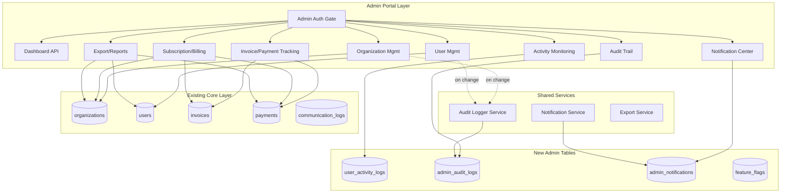
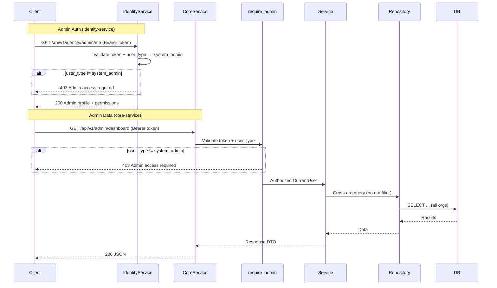
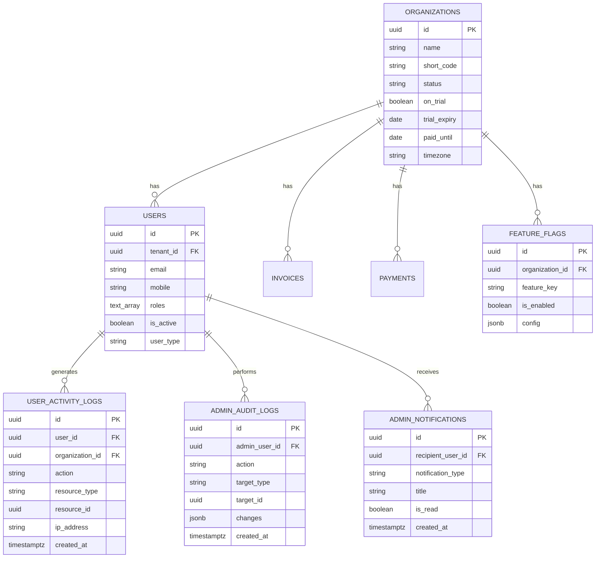

# Design Document: Admin Portal

## Overview

The Admin Portal is a super-admin management layer built on top of the existing FastAPI + PostgreSQL ERP platform. It provides cross-organization visibility and control for system administrators, covering organization management, user management, billing/subscription tracking, invoice/payment oversight, activity monitoring, audit logging, notifications, and data export.

### Key Design Principles

1. **Leverage Existing Infrastructure**: Reuse existing models (organizations, users, invoices, payments, communication_logs) for read operations; add new tables only for admin-specific data (activity logs, audit logs, notifications, feature flags).
2. **Admin Role Gate**: All admin endpoints are protected by a `require_admin` dependency that validates `user_type == "system_admin"` — bypassing per-resource RBAC checks.
3. **Cross-Org Queries**: Admin repositories query without `organization_id` filters, unlike org-scoped repositories that always filter by `current_user.organization_id`.
4. **Layered Architecture**: Follow the established Models → Repositories → Services → Endpoints pattern.
5. **Step-by-Step Delivery**: Each requirement produces backend implementation + a frontend steering document in `.kiro/steering/`.

### Admin Scope Model

```
┌─────────────────────────────────────────────────┐
│                  system_admin                    │
│  - Cross-org access to ALL data                 │
│  - Bypasses require_permission checks           │
│  - Can create/update/suspend organizations      │
│  - Can manage users across all orgs             │
│  - Accesses /api/v1/admin/* endpoints           │
├─────────────────────────────────────────────────┤
│                   org_admin                      │
│  - Scoped to single organization                │
│  - Uses standard RBAC (require_permission)      │
│  - Manages users within own org only            │
│  - Accesses /api/v1/* endpoints (non-admin)     │
└─────────────────────────────────────────────────┘
```

## Architecture

### System Components



### Request Flow



### Endpoint Mounting Structure

Admin auth endpoints live in `identity-service`, all other admin endpoints live in `core-service`:

```
# identity-service
/api/v1/identity/admin/
├── me                          # Admin profile (identity-service)

# core-service
/api/v1/admin/
├── dashboard/overview          # Dashboard metrics
├── organizations/              # CRUD + search + filter
│   └── {id}/billing            # Billing details
├── users/                      # Cross-org user list + CRUD
├── invoices/                   # Cross-org invoice list
├── payments/                   # Cross-org payment list
├── activity-logs/              # User activity logs
│   └── users/{id}/login-history
├── subscriptions/
│   ├── overview                # Trial/paid/expired counts
│   ├── expiring                # Expiring soon
│   └── overdue                 # Overdue billing
├── audit-logs/                 # Admin audit trail
├── notifications/              # Notification center
│   ├── unread-count
│   └── mark-all-read
├── export/
│   ├── organizations           # CSV/PDF export
│   ├── users
│   └── payments
├── feature-flags/              # Per-org feature flags (nice-to-have)
└── health                      # System health (nice-to-have)
```

## Components and Interfaces

### Admin Auth Dependency

Since authentication and login features live in `identity-service`, the `require_admin` dependency and admin auth endpoints (`/admin/me`) are implemented in `identity-service`. The `core-service` gets its own `require_admin` dependency that validates the `user_type` from the token (same pattern as existing `require_permission`).

#### Identity Service — `require_admin` + `/admin/me`

```python
# identity-service/app/dependencies.py (addition)

async def require_admin(
    current_user: CurrentUser = Depends(get_current_active_user),
) -> CurrentUser:
    """Require system_admin user_type for admin portal endpoints."""
    if current_user.user_type != UserType.SYSTEM_ADMIN:
        raise HTTPException(
            status_code=status.HTTP_403_FORBIDDEN,
            detail="Admin access required",
        )
    return current_user
```

The identity-service hosts the `/api/v1/identity/admin/me` endpoint that returns the admin profile with permissions. This is the authoritative source for admin identity.

#### Core Service — `require_admin` (token-based)

```python
# core-service/app/dependencies.py (addition)

async def require_admin(
    current_user: CurrentUser = Depends(get_current_user),
) -> CurrentUser:
    """Require system_admin user_type for admin portal endpoints."""
    if current_user.user_type != "system_admin":
        raise HTTPException(
            status_code=status.HTTP_403_FORBIDDEN,
            detail="Admin access required",
        )
    return current_user
```

The core-service `require_admin` validates `user_type` from the JWT token payload (already available via `get_current_user`). All admin data-management endpoints (dashboard, org CRUD, invoices, etc.) use this dependency.

### Admin Dashboard Endpoints

```
GET  /api/v1/admin/dashboard/overview?date_from=&date_to=
```

Response schema:

```python
class DashboardOverview(BaseModel):
    organizations: OrgMetrics        # total, active, on_trial
    users: UserMetrics               # total, active
    revenue: RevenueMetrics          # total_invoiced, total_outstanding, total_received
    recent_activity: list[ActivityLogItem]  # last 10 entries
```

### Organization Management Endpoints

```
POST   /api/v1/admin/organizations
GET    /api/v1/admin/organizations?search=&status=&page=&page_size=
GET    /api/v1/admin/organizations/{id}
PATCH  /api/v1/admin/organizations/{id}
GET    /api/v1/admin/organizations/{id}/billing
```

Key behaviors:

- POST creates a new org, returns 201. Duplicate `short_code` → 409.
- GET list returns paginated results with user_count, invoice_count, payment_total summaries.
- PATCH to status="SUSPENDED" cascades `is_active=false` to all org users.
- GET billing returns trial/paid status + financial summary.

### User Management Endpoints

```
POST   /api/v1/admin/users
GET    /api/v1/admin/users?organization_id=&search=&is_active=&page=&page_size=
GET    /api/v1/admin/users/{id}
PATCH  /api/v1/admin/users/{id}
```

Key behaviors:

- GET list joins users with organizations to include `organization_name`.
- PATCH supports updating `roles`, `is_active`. Role changes and activation/deactivation trigger audit logs.
- POST creates user in specified org. Duplicate email → 409.
- Supported roles: `system_admin`, `org_admin`, `user`.

### Invoice & Payment Tracking Endpoints

```
GET    /api/v1/admin/invoices?organization_id=&status=&date_from=&date_to=&page=&page_size=
GET    /api/v1/admin/invoices/{id}
POST   /api/v1/admin/invoices
POST   /api/v1/admin/invoices/{id}/send
GET    /api/v1/admin/payments?organization_id=&status=&page=&page_size=
```

Key behaviors:

- Cross-org queries — no `organization_id` filter by default.
- Invoice detail includes line items + payment history.
- Invoice send triggers communication_log entry and status update to "pending".

### Activity Monitoring Endpoints

```
GET    /api/v1/admin/activity-logs?user_id=&organization_id=&action=&date_from=&date_to=&page=&page_size=
GET    /api/v1/admin/activity-logs/users/{user_id}/login-history
```

### Subscription & Billing Endpoints

```
GET    /api/v1/admin/subscriptions/overview
GET    /api/v1/admin/subscriptions/expiring?days_ahead=30
GET    /api/v1/admin/subscriptions/overdue
```

### Audit Trail Endpoints

```
GET    /api/v1/admin/audit-logs?admin_user_id=&target_type=&target_id=&date_from=&date_to=&page=&page_size=
```

### Notification Center Endpoints

```
GET    /api/v1/admin/notifications?is_read=&page=&page_size=
GET    /api/v1/admin/notifications/unread-count
PATCH  /api/v1/admin/notifications/{id}/read
POST   /api/v1/admin/notifications/mark-all-read
```

### Export Endpoints

```
GET    /api/v1/admin/export/organizations?format=csv|pdf&organization_id=&date_from=&date_to=
GET    /api/v1/admin/export/users?format=csv&organization_id=&date_from=&date_to=
GET    /api/v1/admin/export/payments?format=csv&organization_id=&date_from=&date_to=
```

All export responses set `Content-Disposition: attachment; filename="{report}_{date}.{format}"` and cap at 50,000 rows.

### Service Layer Design

Each admin feature follows the same service pattern:

```python
class AdminOrganizationService:
    def __init__(self, db: Session):
        self.db = db
        self.repo = AdminOrganizationRepository(db)
        self.audit_service = AdminAuditService(db)

    def list_organizations(self, filters, pagination) -> tuple[list, int]:
        return self.repo.list_with_filters(filters, pagination)

    def get_organization(self, org_id: UUID) -> Organization:
        org = self.repo.get_by_id(org_id)
        if not org:
            raise HTTPException(404, "Organization not found")
        return org

    def update_organization(self, org_id, data, admin_user) -> Organization:
        org = self.get_organization(org_id)
        old_values = {field: getattr(org, field) for field in data.dict(exclude_unset=True)}
        updated = self.repo.update(org, data)
        # Cascade suspend
        if data.status == "SUSPENDED":
            self.repo.deactivate_all_users(org_id)
        # Audit log
        self.audit_service.log(admin_user.id, "update", "organization", org_id, old_values, data.dict())
        return updated
```

### Audit Logger Service

A shared service used by all admin write operations:

```python
class AdminAuditService:
    def __init__(self, db: Session):
        self.db = db

    def log(self, admin_user_id, action, target_type, target_id, old_values=None, new_values=None, ip_address=None):
        entry = AdminAuditLog(
            admin_user_id=admin_user_id,
            action=action,
            target_type=target_type,
            target_id=target_id,
            changes={"old": old_values, "new": new_values},
            ip_address=ip_address,
        )
        self.db.add(entry)
        self.db.flush()
```

### Notification Service

Triggered by system events (payment completed, trial expiring, user locked, invoice overdue):

```python
class AdminNotificationService:
    def __init__(self, db: Session):
        self.db = db

    def notify_all_admins(self, notification_type, title, message, reference_type=None, reference_id=None):
        # Query all system_admin users
        admins = self.db.query(User).filter(User.user_type == "system_admin").all()
        for admin in admins:
            notif = AdminNotification(
                recipient_user_id=admin.id,
                notification_type=notification_type,
                title=title,
                message=message,
                reference_type=reference_type,
                reference_id=reference_id,
            )
            self.db.add(notif)
        self.db.flush()
```

## Data Models

### New Tables

#### user_activity_logs

```sql
CREATE TABLE user_activity_logs (
    id              UUID PRIMARY KEY DEFAULT gen_random_uuid(),
    user_id         UUID NOT NULL REFERENCES users(id),
    organization_id UUID NOT NULL REFERENCES organizations(id),
    action          VARCHAR(50) NOT NULL,  -- login, logout, login_failed, page_view, data_create, data_update, data_delete
    resource_type   VARCHAR(100),
    resource_id     UUID,
    ip_address      VARCHAR(45),
    user_agent      TEXT,
    metadata        JSONB,
    created_at      TIMESTAMPTZ DEFAULT now()
);
CREATE INDEX idx_activity_logs_user ON user_activity_logs(user_id);
CREATE INDEX idx_activity_logs_org ON user_activity_logs(organization_id);
CREATE INDEX idx_activity_logs_action ON user_activity_logs(action);
CREATE INDEX idx_activity_logs_created ON user_activity_logs(created_at);
```

#### admin_audit_logs

```sql
CREATE TABLE admin_audit_logs (
    id              UUID PRIMARY KEY DEFAULT gen_random_uuid(),
    admin_user_id   UUID NOT NULL REFERENCES users(id),
    action          VARCHAR(50) NOT NULL,  -- create, update, delete, suspend, activate, role_change
    target_type     VARCHAR(50) NOT NULL,  -- organization, user, invoice, payment, setting
    target_id       UUID NOT NULL,
    changes         JSONB,                 -- {old: {...}, new: {...}}
    ip_address      VARCHAR(45),
    created_at      TIMESTAMPTZ DEFAULT now()
);
CREATE INDEX idx_audit_logs_admin ON admin_audit_logs(admin_user_id);
CREATE INDEX idx_audit_logs_target ON admin_audit_logs(target_type, target_id);
CREATE INDEX idx_audit_logs_created ON admin_audit_logs(created_at);
```

#### admin_notifications

```sql
CREATE TABLE admin_notifications (
    id                UUID PRIMARY KEY DEFAULT gen_random_uuid(),
    recipient_user_id UUID NOT NULL REFERENCES users(id),
    notification_type VARCHAR(50) NOT NULL,  -- payment_received, trial_expiring, user_locked, invoice_overdue, org_suspended
    title             VARCHAR(255) NOT NULL,
    message           TEXT,
    reference_type    VARCHAR(50),
    reference_id      UUID,
    is_read           BOOLEAN DEFAULT FALSE,
    read_at           TIMESTAMPTZ,
    created_at        TIMESTAMPTZ DEFAULT now()
);
CREATE INDEX idx_notifications_recipient ON admin_notifications(recipient_user_id);
CREATE INDEX idx_notifications_unread ON admin_notifications(recipient_user_id, is_read) WHERE is_read = FALSE;
CREATE INDEX idx_notifications_created ON admin_notifications(created_at);
```

#### feature_flags (Nice-to-Have)

```sql
CREATE TABLE feature_flags (
    id              UUID PRIMARY KEY DEFAULT gen_random_uuid(),
    organization_id UUID NOT NULL REFERENCES organizations(id),
    feature_key     VARCHAR(100) NOT NULL,
    is_enabled      BOOLEAN DEFAULT FALSE,
    config          JSONB,
    created_at      TIMESTAMPTZ DEFAULT now(),
    updated_at      TIMESTAMPTZ DEFAULT now(),
    CONSTRAINT unique_org_feature UNIQUE (organization_id, feature_key)
);
CREATE INDEX idx_feature_flags_org ON feature_flags(organization_id);
```

### Existing Tables Used (Read-Only from Admin)

| Table                | Admin Usage                                 |
| -------------------- | ------------------------------------------- |
| `organizations`      | CRUD + subscription/billing queries         |
| `users`              | Cross-org list, role management, activation |
| `invoices`           | Cross-org listing, detail with line items   |
| `payments`           | Cross-org listing, revenue metrics          |
| `communication_logs` | Invoice send tracking                       |

### Entity Relationships



### SQLAlchemy Model Examples

```python
# core-service/app/models/admin.py

class UserActivityLog(Base):
    __tablename__ = "user_activity_logs"

    id = Column(UUID(as_uuid=True), primary_key=True, default=uuid.uuid4)
    user_id = Column(UUID(as_uuid=True), ForeignKey("users.id"), nullable=False, index=True)
    organization_id = Column(UUID(as_uuid=True), ForeignKey("organizations.id"), nullable=False, index=True)
    action = Column(String(50), nullable=False)
    resource_type = Column(String(100), nullable=True)
    resource_id = Column(UUID(as_uuid=True), nullable=True)
    ip_address = Column(String(45), nullable=True)
    user_agent = Column(Text, nullable=True)
    metadata_ = Column("metadata", JSONB, nullable=True)
    created_at = Column(DateTime(timezone=True), default=lambda: datetime.now(UTC))


class AdminAuditLog(Base):
    __tablename__ = "admin_audit_logs"

    id = Column(UUID(as_uuid=True), primary_key=True, default=uuid.uuid4)
    admin_user_id = Column(UUID(as_uuid=True), ForeignKey("users.id"), nullable=False, index=True)
    action = Column(String(50), nullable=False)
    target_type = Column(String(50), nullable=False)
    target_id = Column(UUID(as_uuid=True), nullable=False)
    changes = Column(JSONB, nullable=True)
    ip_address = Column(String(45), nullable=True)
    created_at = Column(DateTime(timezone=True), default=lambda: datetime.now(UTC))


class AdminNotification(Base):
    __tablename__ = "admin_notifications"

    id = Column(UUID(as_uuid=True), primary_key=True, default=uuid.uuid4)
    recipient_user_id = Column(UUID(as_uuid=True), ForeignKey("users.id"), nullable=False, index=True)
    notification_type = Column(String(50), nullable=False)
    title = Column(String(255), nullable=False)
    message = Column(Text, nullable=True)
    reference_type = Column(String(50), nullable=True)
    reference_id = Column(UUID(as_uuid=True), nullable=True)
    is_read = Column(Boolean, default=False)
    read_at = Column(DateTime(timezone=True), nullable=True)
    created_at = Column(DateTime(timezone=True), default=lambda: datetime.now(UTC))


class FeatureFlag(Base):
    __tablename__ = "feature_flags"

    id = Column(UUID(as_uuid=True), primary_key=True, default=uuid.uuid4)
    organization_id = Column(UUID(as_uuid=True), ForeignKey("organizations.id"), nullable=False, index=True)
    feature_key = Column(String(100), nullable=False)
    is_enabled = Column(Boolean, default=False)
    config = Column(JSONB, nullable=True)
    created_at = Column(DateTime(timezone=True), default=lambda: datetime.now(UTC))
    updated_at = Column(DateTime(timezone=True), default=lambda: datetime.now(UTC), onupdate=lambda: datetime.now(UTC))
```

## Correctness Properties

_A property is a characteristic or behavior that should hold true across all valid executions of a system — essentially, a formal statement about what the system should do. Properties serve as the bridge between human-readable specifications and machine-verifiable correctness guarantees._

### Property 1: Admin gate rejects non-admin users and accepts admin users

_For any_ user with `user_type != "system_admin"`, calling the `require_admin` dependency should raise a 403 error. _For any_ user with `user_type == "system_admin"`, the dependency should return the user unchanged.

**Validates: Requirements 1.3, 1.4, 1.5**

### Property 2: Admin /me endpoint returns complete profile

_For any_ authenticated system_admin user, the `/admin/me` endpoint response should contain all required fields: `id`, `email`, `user_type`, `organization_id`, and `permissions`, and each field should match the user's actual data.

**Validates: Requirements 1.6**

### Property 3: Dashboard metrics match database aggregations

_For any_ set of organizations, users, invoices, and payments in the database, the dashboard overview endpoint should return: org counts (total, active, on_trial) matching `COUNT(*)` with appropriate filters, user counts (total, active) matching actual user records, and revenue metrics (total_invoiced, total_outstanding, total_received) matching `SUM()` of the relevant fields.

**Validates: Requirements 2.1, 2.2, 2.3**

### Property 4: Dashboard date range filtering

_For any_ date range (`date_from`, `date_to`) and set of invoices/payments/activity logs, the dashboard overview should only include records whose relevant date field falls within the specified range.

**Validates: Requirements 2.5**

### Property 5: Dashboard recent activity ordering

_For any_ set of activity log entries, the dashboard should return at most 10 entries sorted by `created_at` descending, and the first entry should have the most recent `created_at`.

**Validates: Requirements 2.4**

### Property 6: Organization creation round-trip

_For any_ valid organization data (name, short_code, industry, timezone, status), creating an organization and then retrieving it by ID should return a record with all input fields preserved.

**Validates: Requirements 3.1**

### Property 7: Organization list filtering correctness

_For any_ search term, all organizations returned by the list endpoint with that search parameter should have `name` or `short_code` containing the term (case-insensitive). _For any_ status filter, all returned organizations should have the specified status.

**Validates: Requirements 3.2, 3.3, 3.4**

### Property 8: Organization detail includes correct summary counts

_For any_ organization with N users, M invoices, and payment total P, the single-organization detail endpoint should return `user_count == N`, `invoice_count == M`, and `payment_total == P`.

**Validates: Requirements 3.5**

### Property 9: Organization partial update preserves unmodified fields

_For any_ organization and any subset of updatable fields, a PATCH request should change only the provided fields and leave all other fields unchanged.

**Validates: Requirements 3.6**

### Property 10: Organization suspension cascades to users

_For any_ organization with N users (some active, some inactive), changing the organization status to "SUSPENDED" should result in all N users having `is_active = false`.

**Validates: Requirements 3.7**

### Property 11: Duplicate short_code rejection

_For any_ existing organization with short_code S, attempting to create another organization with the same short_code S should return a 409 status.

**Validates: Requirements 3.8**

### Property 12: Cross-org user list filtering correctness

_For any_ `organization_id` filter, all returned users should have `tenant_id` equal to that organization. _For any_ search term, all returned users should have `email` or `mobile` containing the term (case-insensitive). _For any_ `is_active` filter, all returned users should match the specified active status.

**Validates: Requirements 4.1, 4.2, 4.3, 4.4**

### Property 13: User role update replaces roles array

_For any_ user and any valid roles array, patching the user's roles should result in the user's roles exactly matching the provided array (not appending).

**Validates: Requirements 4.6**

### Property 14: User activation round-trip

_For any_ user, deactivating (setting `is_active = false`) and then reactivating (setting `is_active = true`) should result in the user being active again with all other fields unchanged.

**Validates: Requirements 4.7, 4.8**

### Property 15: User creation round-trip with org assignment

_For any_ valid user data (email, organization_id, roles, password), creating a user and then retrieving it should return a record with `email`, `roles`, and `tenant_id` matching the input, and `is_active = true`.

**Validates: Requirements 4.9**

### Property 16: Duplicate email rejection

_For any_ existing user with email E, attempting to create another user with the same email E should return a 409 status.

**Validates: Requirements 4.10**

### Property 17: Role validation

_For any_ role value not in the set {`system_admin`, `org_admin`, `user`}, attempting to assign it to a user should be rejected. _For any_ role in the allowed set, assignment should succeed.

**Validates: Requirements 4.12**

### Property 18: Invoice list cross-org filtering

_For any_ `organization_id` filter, all returned invoices should belong to that organization. _For any_ status filter, all returned invoices should have the specified status. _For any_ date range, all returned invoices should have `posting_date` within the range.

**Validates: Requirements 5.1, 5.2, 5.3, 5.4**

### Property 19: Invoice detail includes line items and payments

_For any_ invoice with N line items and M associated payments, the detail endpoint should return exactly N line items and M payment records.

**Validates: Requirements 5.5**

### Property 20: Invoice send creates communication log and updates status

_For any_ invoice in a sendable state, sending it should create a communication_log entry with the invoice's party email and update the invoice status to "pending".

**Validates: Requirements 5.7**

### Property 21: Payment list cross-org filtering

_For any_ `organization_id` filter, all returned payments should belong to that organization. _For any_ status filter, all returned payments should have the specified status.

**Validates: Requirements 5.8, 5.9, 5.10**

### Property 22: Activity log creation on login events

_For any_ successful login, an activity log entry with action "login" should be created with the user's IP address and user agent. _For any_ failed login, an entry with action "login_failed" should be created.

**Validates: Requirements 6.2, 6.3**

### Property 23: Activity log filtering and sorting

_For any_ combination of filters (user_id, organization_id, action, date range), all returned activity logs should match all applied filters. The results should always be sorted by `created_at` descending.

**Validates: Requirements 6.4, 6.5, 6.6, 6.7, 6.8**

### Property 24: Login history returns only login events for specified user

_For any_ user, the login history endpoint should return only activity log entries with action in {"login", "login_failed"} for that specific user, sorted by `created_at` descending.

**Validates: Requirements 6.9**

### Property 25: Subscription overview counts match database state

_For any_ set of organizations, the subscription overview should return counts where: `on_trial_count` equals organizations with `on_trial = true` and `trial_expiry >= now`, `active_paid_count` equals organizations with `on_trial = false` and `paid_until >= now`, `expired_trial_count` equals organizations with `on_trial = true` and `trial_expiry < now`, and `overdue_count` equals organizations with `on_trial = false` and `paid_until < now`.

**Validates: Requirements 7.1**

### Property 26: Expiring organizations filtering

_For any_ `days_ahead` value, all returned organizations should have `trial_expiry` or `paid_until` falling between now and now + days_ahead days. No organization outside this window should be included.

**Validates: Requirements 7.2**

### Property 27: Overdue organizations filtering and sorting

_For any_ set of organizations, the overdue endpoint should return only those with `paid_until < now` and `on_trial = false`, sorted by `paid_until` ascending.

**Validates: Requirements 7.3**

### Property 28: Billing update side effects

_For any_ organization, updating `paid_until` should also set `on_trial = false`. Extending trial (updating `trial_expiry`) should set `on_trial = true`.

**Validates: Requirements 7.4, 7.5**

### Property 29: Organization billing detail aggregation

_For any_ organization, the billing detail endpoint should return `total_invoiced` equal to the sum of `grand_total` for all invoices in that org, `total_paid` equal to the sum of `amount` for completed payments, and `outstanding` equal to `total_invoiced - total_paid`.

**Validates: Requirements 7.6**

### Property 30: Admin write operations create audit logs

_For any_ admin create, update, or delete operation on an organization or user, an audit log entry should be created with the correct `admin_user_id`, `action`, `target_type`, `target_id`, and `changes` containing old and new values.

**Validates: Requirements 8.2, 8.3**

### Property 31: Audit log filtering and sorting

_For any_ combination of filters (admin_user_id, target_type, target_id, date range), all returned audit logs should match all applied filters. Results should always be sorted by `created_at` descending.

**Validates: Requirements 8.4, 8.5, 8.6, 8.7, 8.8**

### Property 32: System event notifications reach all admins

_For any_ system event (payment completed, trial expiring, user locked, invoice overdue), a notification should be created for every user with `user_type = "system_admin"`. The notification should have the correct `notification_type` and reference fields.

**Validates: Requirements 9.2, 9.3, 9.4, 9.5**

### Property 33: Notification list scoped to requesting admin

_For any_ admin user, the notifications endpoint should return only notifications where `recipient_user_id` matches the requesting user. When filtered by `is_read=false`, only unread notifications should be returned. Results should be sorted by `created_at` descending.

**Validates: Requirements 9.6, 9.7**

### Property 34: Mark notification as read sets fields correctly

_For any_ unread notification, marking it as read should set `is_read = true` and `read_at` to a timestamp that is >= the time of the request.

**Validates: Requirements 9.8**

### Property 35: Mark all notifications as read

_For any_ admin user with N unread notifications, the mark-all-read endpoint should result in 0 unread notifications for that user. All previously unread notifications should now have `is_read = true`.

**Validates: Requirements 9.9**

### Property 36: Unread notification count accuracy

_For any_ admin user, the unread count endpoint should return a number equal to the actual count of notifications where `recipient_user_id` matches and `is_read = false`.

**Validates: Requirements 9.10**

### Property 37: CSV export round-trip

_For any_ set of organizations (or users, or payments), exporting to CSV and parsing the CSV back should produce records matching the original data for all specified columns.

**Validates: Requirements 10.1, 10.2, 10.3**

### Property 38: Export filtering by organization and date range

_For any_ export request with an `organization_id` filter, all rows in the exported file should belong to that organization. _For any_ date range filter, all rows should fall within the range.

**Validates: Requirements 10.4, 10.5**

### Property 39: Export Content-Disposition header format

_For any_ export request, the response should include a `Content-Disposition` header matching the pattern `attachment; filename="{report_name}_{date}.{format}"`.

**Validates: Requirements 10.7**

### Property 40: Feature flag toggle round-trip

_For any_ feature flag, toggling `is_enabled` from true to false (or vice versa) and then reading it back should reflect the new value.

**Validates: Requirements 15.3**

### Property 41: Feature flag gate dependency

_For any_ organization with a feature flag set to `is_enabled = false`, the `check_feature_flag` dependency should block access. When `is_enabled = true`, it should allow access.

**Validates: Requirements 15.4**

### Property 42: Bulk user operations

_For any_ list of user IDs (up to 100), bulk deactivate should set all to `is_active = false`, and bulk activate should set all to `is_active = true`. The count of updated users should equal the number of valid IDs in the request. An audit log entry should be created for each affected user.

**Validates: Requirements 13.1, 13.2, 13.4**

## Error Handling

### Error Categories

The admin portal follows the existing error handling patterns in the codebase, with admin-specific additions:

#### 1. Authentication Errors (HTTP 401)

Raised when no token or an invalid token is provided:

```python
# Existing pattern from dependencies.py
raise HTTPException(
    status_code=status.HTTP_401_UNAUTHORIZED,
    detail="Invalid authentication credentials",
    headers={"WWW-Authenticate": "Bearer"},
)
```

#### 2. Authorization Errors (HTTP 403)

Raised when a valid user lacks admin privileges:

```python
# New require_admin dependency
raise HTTPException(
    status_code=status.HTTP_403_FORBIDDEN,
    detail="Admin access required",
)
```

#### 3. Not Found Errors (HTTP 404)

Raised when a referenced entity doesn't exist:

```python
raise HTTPException(
    status_code=status.HTTP_404_NOT_FOUND,
    detail="Organization not found",
)
```

Applies to: organization by ID, user by ID, invoice by ID, notification by ID.

#### 4. Conflict Errors (HTTP 409)

Raised when a uniqueness constraint is violated:

```python
raise HTTPException(
    status_code=status.HTTP_409_CONFLICT,
    detail="Organization with this short_code already exists",
)
```

Applies to: duplicate `short_code` on organizations, duplicate `email` on users.

#### 5. Validation Errors (HTTP 422)

Raised when input data fails validation (handled by FastAPI/Pydantic automatically):

```python
# Pydantic validation errors return 422 with field-level details
{
    "detail": [
        {
            "loc": ["body", "name"],
            "msg": "field required",
            "type": "value_error.missing"
        }
    ]
}
```

Custom validation for: invalid role values, bulk operation exceeding 100 IDs, invalid date ranges, export row limit exceeded.

#### 6. Service Unavailable (HTTP 503)

Raised when identity-service is unreachable (existing pattern):

```python
raise HTTPException(
    status_code=status.HTTP_503_SERVICE_UNAVAILABLE,
    detail="Identity service unavailable",
)
```

### Error Handling Strategy

1. **Validation first**: All input validation occurs before database operations via Pydantic schemas.
2. **Repository-level exceptions**: Repositories raise domain-specific exceptions (e.g., `OrganizationNotFound`), services catch and convert to HTTP exceptions.
3. **Audit on success only**: Audit log entries are created only after successful operations, within the same database transaction.
4. **Graceful degradation**: Dashboard metrics that fail to compute (e.g., identity-service down) return partial results with error indicators rather than failing the entire request.
5. **Export safety**: Export endpoints enforce a 50,000 row cap and return 422 if the result set exceeds this limit.

## Testing Strategy

### Dual Testing Approach

The admin portal uses both unit tests and property-based tests for comprehensive coverage:

- **Unit tests**: Verify specific examples, edge cases (404 for missing entities, 409 for duplicates, 403 for non-admin users), and integration points (identity-service calls, communication_log creation).
- **Property tests**: Verify universal properties across randomized inputs (filtering correctness, aggregation accuracy, round-trip consistency, audit log creation).

### Property-Based Testing Configuration

- **Library**: [Hypothesis](https://hypothesis.readthedocs.io/) (already in use — `.hypothesis/` directory exists in the project)
- **Minimum iterations**: 100 per property test
- **Tag format**: `# Feature: admin-portal, Property {number}: {property_text}`
- **Each correctness property maps to exactly one property-based test**

### Test Organization

```
identity-service/tests/
├── admin/
│   ├── test_admin_auth.py              # Properties 1-2

core-service/tests/
├── admin/
│   ├── test_admin_auth.py              # Property 1 (core-service require_admin)
│   ├── test_admin_dashboard.py         # Properties 3-5
│   ├── test_admin_organizations.py     # Properties 6-11
│   ├── test_admin_users.py             # Properties 12-17
│   ├── test_admin_invoices.py          # Properties 18-20
│   ├── test_admin_payments.py          # Property 21
│   ├── test_admin_activity_logs.py     # Properties 22-24
│   ├── test_admin_subscriptions.py     # Properties 25-29
│   ├── test_admin_audit_logs.py        # Properties 30-31
│   ├── test_admin_notifications.py     # Properties 32-36
│   ├── test_admin_export.py            # Properties 37-39
│   ├── test_admin_feature_flags.py     # Properties 40-41
│   └── test_admin_bulk_operations.py   # Property 42
```

### Hypothesis Strategy Examples

```python
from hypothesis import given, settings, strategies as st

# Strategy for generating organization data
org_strategy = st.fixed_dictionaries({
    "name": st.text(min_size=1, max_size=256),
    "short_code": st.text(min_size=1, max_size=50, alphabet=st.characters(whitelist_categories=("L", "N"))),
    "status": st.sampled_from(["ACTIVE", "SUSPENDED", "INACTIVE"]),
    "timezone": st.sampled_from(["UTC", "US/Eastern", "Asia/Kolkata"]),
})

# Strategy for generating user data
user_strategy = st.fixed_dictionaries({
    "email": st.emails(),
    "roles": st.lists(st.sampled_from(["system_admin", "org_admin", "user"]), min_size=1, max_size=3),
    "is_active": st.booleans(),
})

# Example property test
@settings(max_examples=100)
@given(org_data=org_strategy)
def test_organization_creation_round_trip(org_data, admin_client, db_session):
    """Feature: admin-portal, Property 6: Organization creation round-trip"""
    response = admin_client.post("/api/v1/admin/organizations", json=org_data)
    assert response.status_code == 201
    created = response.json()

    get_response = admin_client.get(f"/api/v1/admin/organizations/{created['id']}")
    assert get_response.status_code == 200
    retrieved = get_response.json()

    assert retrieved["name"] == org_data["name"]
    assert retrieved["short_code"] == org_data["short_code"]
    assert retrieved["status"] == org_data["status"]
```

### Unit Test Focus Areas

- **Auth edge cases**: Missing token, expired token, non-admin user_type values
- **404 scenarios**: Non-existent org ID, user ID, invoice ID, notification ID
- **409 scenarios**: Duplicate short_code, duplicate email
- **Cascade behavior**: Org suspension deactivates all users
- **Notification triggers**: Payment completed, trial expiring, user locked, invoice overdue
- **Export limits**: Verify 50,000 row cap, Content-Disposition header format
- **Date range edge cases**: Same day range, reversed dates, null dates
