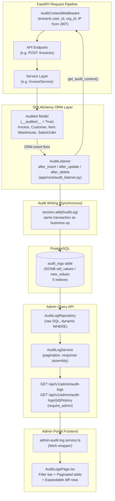
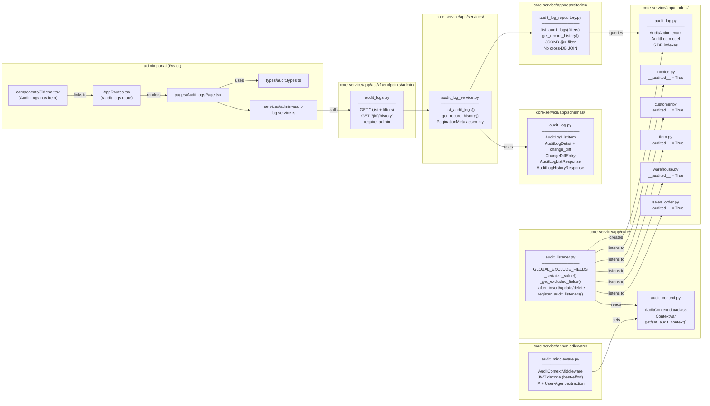
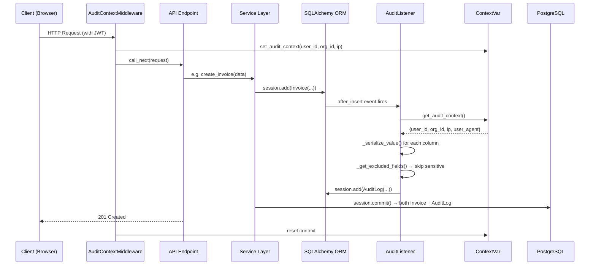
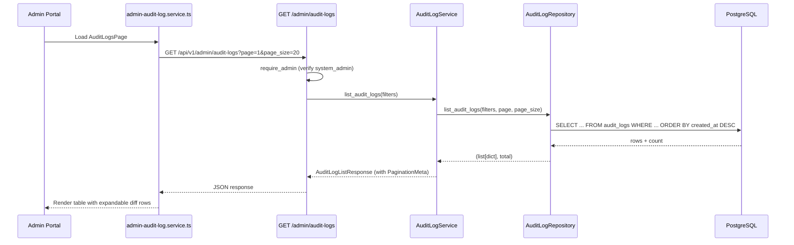
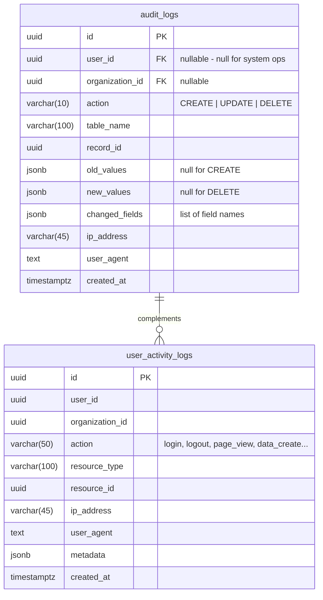

# Design Document: Audit Trail & Activity Log

## Overview

This design describes the implementation of automated, field-level change tracking for the Horizon Sync ERP system. The feature introduces an `AuditLog` model that captures granular before/after snapshots of every data mutation (Create, Update, Delete) via SQLAlchemy ORM event listeners. It complements the existing `UserActivityLog` (high-level actions) by recording exactly which fields changed, their old and new values, and who made the change.

The system consists of four layers (MVP implementation):

1. **Data Layer** — `AuditLog` SQLAlchemy model with JSONB columns for old/new values
2. **Listener Layer** — SQLAlchemy `after_insert`/`after_update`/`after_delete` event hooks with opt-in via `__audited__ = True`
3. **Context Layer** — `contextvars.ContextVar` middleware to propagate user_id, organization_id, and ip_address into event handlers
4. **API Layer** — Admin cross-org REST endpoints (`/api/v1/admin/audit-logs`) with `require_admin`
5. **Frontend Layer** — Admin portal `AuditLogsPage` with filterable table and expandable diff view

Write mode is synchronous (same-transaction). Async mode and org-scoped API are deferred to the extended version.

## High-Level Architecture (MVP — as implemented)



## Low-Level Component Diagram (MVP — as implemented)



### Key Design Decisions

| Decision | Choice | Rationale |
|---|---|---|
| Tracking granularity | Field-level diffs via `get_history()` | Complements existing `UserActivityLog` (high-level); enables precise "what changed" queries |
| Opt-in mechanism | `__audited__ = True` class attribute | Avoids tracking internal/system tables; explicit is better than implicit |
| Sensitive field masking | `__audit_exclude__` + global defaults | Union of model-level and global lists; fields are omitted entirely, not masked |
| Default write mode | Synchronous (same transaction) | Guarantees audit integrity for low-to-moderate volume; async is opt-in |
| Async backend | `AuditQueueBackend` interface | `InProcessQueueBackend` for single-replica; future `RedisQueueBackend` for multi-replica |
| User context propagation | `contextvars.ContextVar` | Thread-safe, works with SQLAlchemy event handlers outside request scope |
| Dual API access | Org-scoped + Admin cross-org | Matches existing pattern (`require_permission` vs `require_admin`) |
| Pagination | Offset-based with `PaginationMeta` | Consistent with existing codebase pattern; cursor-based can be added later for very large datasets |

## Data Flow Sequence (MVP — Write Path)



## Data Flow Sequence (MVP — Read Path)



## Components and Interfaces

### 1. AuditLog Model (`app/models/audit_log.py`)

```python
class AuditAction(str, enum.Enum):
    CREATE = "CREATE"
    UPDATE = "UPDATE"
    DELETE = "DELETE"

class AuditLog(Base):
    __tablename__ = "audit_logs"

    id = Column(UUID(as_uuid=True), primary_key=True, default=uuid.uuid4)
    user_id = Column(UUID(as_uuid=True), nullable=True, index=True)
    organization_id = Column(UUID(as_uuid=True), nullable=True, index=True)
    action = Column(String(10), nullable=False)
    table_name = Column(String(100), nullable=False)
    record_id = Column(UUID(as_uuid=True), nullable=False)
    old_values = Column(JSONB, nullable=True)
    new_values = Column(JSONB, nullable=True)
    changed_fields = Column(JSONB, nullable=True)  # list of field names
    ip_address = Column(String(45), nullable=True)
    user_agent = Column(Text, nullable=True)
    created_at = Column(DateTime(timezone=True), default=lambda: datetime.now(UTC))

    __table_args__ = (
        Index("idx_audit_table_record", "table_name", "record_id"),
        Index("idx_audit_action", "action"),
        Index("idx_audit_created_at", "created_at"),
    )
```

### 2. Audit Context (`app/core/audit_context.py`)

```python
import contextvars
from dataclasses import dataclass

@dataclass
class AuditContext:
    user_id: str | None = None
    organization_id: str | None = None
    ip_address: str | None = None
    user_agent: str | None = None

_audit_context_var: contextvars.ContextVar[AuditContext] = contextvars.ContextVar(
    "audit_context", default=AuditContext()
)

def get_audit_context() -> AuditContext:
    return _audit_context_var.get()

def set_audit_context(ctx: AuditContext) -> contextvars.Token:
    return _audit_context_var.set(ctx)
```

### 3. Audit Context Middleware (`app/middleware/audit_middleware.py`)

A FastAPI middleware that extracts user context from the authenticated request and stores it in the `ContextVar`. Runs before the endpoint handler so that SQLAlchemy event listeners can access it.

```python
class AuditContextMiddleware(BaseHTTPMiddleware):
    async def dispatch(self, request: Request, call_next):
        # Extract user_id, org_id from JWT token (if present)
        # Extract ip_address from X-Forwarded-For or client.host
        ctx = AuditContext(
            user_id=...,
            organization_id=...,
            ip_address=...,
            user_agent=request.headers.get("user-agent"),
        )
        token = set_audit_context(ctx)
        try:
            response = await call_next(request)
            return response
        finally:
            _audit_context_var.reset(token)
```

### 4. Audit Listener (`app/core/audit_listener.py`)

Registers SQLAlchemy `after_insert`, `after_update`, `after_delete` event listeners on models that have `__audited__ = True`.

Key responsibilities:
- Compute field diffs using `sqlalchemy.orm.attributes.get_history()`
- Serialize values to JSON-safe types (UUID → str, datetime → ISO, Decimal → float, Enum → .value)
- Exclude fields in `__audit_exclude__` and global defaults
- Handle serialization errors gracefully (`"[unserializable]"`)
- Write audit entry synchronously (default) or queue for async

```python
GLOBAL_EXCLUDE_FIELDS = {"password", "password_hash", "api_key", "secret_key", "token", "refresh_token"}

def _get_excluded_fields(model_class) -> set[str]:
    model_exclude = getattr(model_class, "__audit_exclude__", set())
    return GLOBAL_EXCLUDE_FIELDS | set(model_exclude)

def _serialize_value(value) -> Any:
    """Convert value to JSON-safe representation."""
    if value is None:
        return None
    if isinstance(value, uuid.UUID):
        return str(value)
    if isinstance(value, datetime):
        return value.isoformat()
    if isinstance(value, Decimal):
        return float(value)
    if isinstance(value, enum.Enum):
        return value.value
    # ... fallback to str() with [unserializable] on error

def register_audit_listeners():
    """Called at app startup to attach listeners to all __audited__ models."""
    for mapper in Base.registry.mappers:
        cls = mapper.class_
        if getattr(cls, "__audited__", False):
            event.listen(cls, "after_insert", _after_insert)
            event.listen(cls, "after_update", _after_update)
            event.listen(cls, "after_delete", _after_delete)
```

### 5. Audit Writer Interface (`app/core/audit_writer.py`)

```python
from abc import ABC, abstractmethod

class AuditQueueBackend(ABC):
    @abstractmethod
    async def enqueue(self, entry: dict) -> None: ...

    @abstractmethod
    async def start(self) -> None: ...

    @abstractmethod
    async def stop(self) -> None: ...

class SynchronousAuditWriter:
    """Writes audit entries in the same DB transaction (default)."""
    def write(self, db: Session, entry: dict) -> None:
        audit_log = AuditLog(**entry)
        db.add(audit_log)
        # No flush/commit — piggybacks on the caller's transaction

class InProcessQueueBackend(AuditQueueBackend):
    """asyncio.Queue-based backend for single-replica async mode."""
    def __init__(self, flush_interval: float = 1.0, batch_size: int = 50):
        self._queue = asyncio.Queue()
        self._flush_interval = flush_interval
        self._batch_size = batch_size
        self._task: asyncio.Task | None = None

    async def enqueue(self, entry: dict) -> None:
        await self._queue.put(entry)

    async def start(self) -> None:
        self._task = asyncio.create_task(self._flush_loop())

    async def stop(self) -> None:
        # Drain remaining entries, cancel task
        ...

    async def _flush_loop(self) -> None:
        # Collect up to batch_size entries or wait flush_interval, then bulk insert
        ...
```

### 6. Pydantic Schemas (`app/schemas/audit_log.py`)

```python
class AuditLogListItem(BaseModel):
    id: UUID
    user_id: UUID | None
    organization_id: UUID | None
    action: str
    table_name: str
    record_id: UUID
    old_values: dict | None
    new_values: dict | None
    changed_fields: list[str] | None
    ip_address: str | None
    created_at: datetime
    user_email: str | None = None

class ChangeDiffEntry(BaseModel):
    field: str
    old_value: Any
    new_value: Any

class AuditLogDetail(AuditLogListItem):
    change_diff: list[ChangeDiffEntry] | None = None

    @model_validator(mode="after")
    def compute_diff(self):
        if self.old_values and self.new_values and self.changed_fields:
            self.change_diff = [
                ChangeDiffEntry(
                    field=f,
                    old_value=self.old_values.get(f),
                    new_value=self.new_values.get(f),
                )
                for f in self.changed_fields
            ]
        return self

class AuditLogListResponse(BaseModel):
    audit_logs: list[AuditLogListItem]
    pagination: PaginationMeta

class AuditLogHistoryResponse(BaseModel):
    record_id: UUID
    table_name: str
    history: list[AuditLogDetail]
    pagination: PaginationMeta
```

### 7. API Endpoints

#### Org-Scoped (`app/api/v1/endpoints/audit_logs.py`)

| Method | Path | Auth | Description |
|---|---|---|---|
| GET | `/api/v1/audit-logs` | `require_permission("audit.read")` | Paginated list filtered by org_id + optional filters |
| GET | `/api/v1/audit-logs/{record_id}/history` | `require_permission("audit.read")` | Full change history for a record |

#### Admin Cross-Org (`app/api/v1/endpoints/admin/audit_logs.py`)

| Method | Path | Auth | Description |
|---|---|---|---|
| GET | `/api/v1/admin/audit-logs` | `require_admin` | Cross-org paginated list with optional org_id filter |
| GET | `/api/v1/admin/audit-logs/{record_id}/history` | `require_admin` | Cross-org record history |

### 8. Service & Repository

**AuditLogRepository** (`app/repositories/audit_log_repository.py`):
- `list_audit_logs(filters, page, page_size)` — builds dynamic WHERE clause, joins to `users` for `user_email`
- `get_record_history(table_name, record_id, org_id, page, page_size)` — ordered by `created_at DESC`

**AuditLogService** (`app/services/audit_log_service.py`):
- `list_audit_logs(...)` — delegates to repository, assembles `AuditLogListResponse`
- `get_record_history(...)` — delegates to repository, assembles `AuditLogHistoryResponse`

### 9. Frontend: AuditTimeline Component

Location: `horizon-sync/libs/shared/ui/src/components/audit/AuditTimeline.tsx`

```typescript
interface AuditTimelineProps {
  recordId: string;
  tableName: string;
  apiBasePath?: string; // defaults to "/api/v1/audit-logs"
}
```

The component:
- Fetches `GET /api/v1/audit-logs/{recordId}/history?table_name={tableName}`
- Renders a vertical timeline with action badges (Create/Update/Delete), timestamps, user emails
- Expandable UPDATE nodes show field-level diffs (old → new)
- "Load More" button for pagination

### 10. Configuration

New settings in `app/config.py`:

```python
# Audit Trail
audit_async_enabled: bool = False
audit_flush_interval: float = 1.0
audit_batch_size: int = 50
```

### 11. Alembic Migration

A new migration creates the `audit_logs` table with all columns and indexes. Partitioning by `created_at` (monthly range) is documented as a future DBA operation — the initial migration creates a standard table with a `created_at` index.

## Data Models



### Relationship to Existing Models

- `audit_logs.user_id` references `users.id` (identity-service DB) — no FK constraint, joined via raw SQL
- `audit_logs.organization_id` references `organizations.id` (identity-service DB) — no FK constraint
- `audit_logs.table_name` + `audit_logs.record_id` is a polymorphic reference to any audited table row
- `UserActivityLog` continues to track high-level actions; `AuditLog` tracks field-level changes

### JSONB Column Structures

**old_values / new_values:**
```json
{
  "name": "Acme Corp",
  "status": "active",
  "credit_limit": 50000.0,
  "updated_at": "2024-01-15T10:30:00+00:00"
}
```

**changed_fields:**
```json
["name", "credit_limit"]
```


## Correctness Properties

*A property is a characteristic or behavior that should hold true across all valid executions of a system — essentially, a formal statement about what the system should do. Properties serve as the bridge between human-readable specifications and machine-verifiable correctness guarantees.*

### Property 1: Diff computation correctness

*For any* audited model instance and any subset of its columns being modified, the `changed_fields` list in the resulting `AuditLog` entry SHALL contain exactly the column names whose values differ between `old_values` and `new_values`, and no others.

**Validates: Requirements 1.4, 2.2**

### Property 2: CREATE action produces null old_values and full new_values

*For any* audited model instance, when a CREATE action is recorded, `old_values` SHALL be null and `new_values` SHALL contain all non-excluded column values of the new record as JSON-safe representations.

**Validates: Requirements 1.5**

### Property 3: DELETE action produces full old_values and null new_values

*For any* audited model instance, when a DELETE action is recorded, `old_values` SHALL contain all non-excluded column values of the deleted record as JSON-safe representations and `new_values` SHALL be null.

**Validates: Requirements 1.6**

### Property 4: Value serialization produces JSON-safe output

*For any* column value of type UUID, datetime, Decimal, or Enum, the `_serialize_value` function SHALL produce a JSON-serializable output that preserves the semantic value (UUID → string, datetime → ISO string, Decimal → float, Enum → .value).

**Validates: Requirements 2.3**

### Property 5: Sensitive field exclusion

*For any* audited model with a set of fields declared in `__audit_exclude__` and/or present in the global default exclusion list, the union of both sets SHALL be excluded from both `old_values` and `new_values` in every resulting `AuditLog` entry.

**Validates: Requirements 3.1, 3.2, 3.4**

### Property 6: Organization-scoped query isolation

*For any* set of audit log entries spanning multiple organizations, a query executed through the org-scoped API (`/api/v1/audit-logs`) SHALL return only entries whose `organization_id` matches the authenticated user's organization, regardless of filter parameters.

**Validates: Requirements 5.5**

### Property 7: Query filter correctness

*For any* combination of filter parameters (`table_name`, `record_id`, `user_id`, `action`, `date_from`, `date_to`, `changed_field`), the query results SHALL contain only entries that match ALL provided filters simultaneously.

**Validates: Requirements 5.1, 5.3**

### Property 8: Record history ordering

*For any* record with multiple audit log entries, the history endpoint SHALL return entries ordered by `created_at` descending (most recent first).

**Validates: Requirements 5.2**

### Property 9: Change diff schema computation

*For any* `AuditLogDetail` instance with non-null `old_values`, `new_values`, and `changed_fields`, the computed `change_diff` list SHALL contain exactly one `ChangeDiffEntry` per field in `changed_fields`, with `old_value` and `new_value` matching the corresponding values from `old_values` and `new_values`.

**Validates: Requirements 6.2**

## Error Handling

| Scenario | Behavior |
|---|---|
| Serialization error on a column value | Log warning, substitute `"[unserializable]"`, do NOT fail the transaction |
| No user context available (system operation) | Record `user_id` as null; audit entry is still created |
| Audit listener exception (unexpected) | Log error, do NOT propagate to caller — audit failure must not break business operations |
| Async queue full (`InProcessQueueBackend`) | Log warning, drop the entry (best-effort); configurable via `maxsize` on `asyncio.Queue` |
| Async flush failure (DB write error) | Log error, re-enqueue entries for retry (up to 3 attempts), then drop with error log |
| Invalid filter parameters on API | Return 422 Unprocessable Entity via FastAPI's built-in validation |
| Unauthorized access (missing permission) | Return 403 Forbidden via `require_permission("audit.read")` or `require_admin` |
| Record not found for history endpoint | Return empty history list with pagination showing 0 total items (not 404) |
| Database connection failure during audit write | In sync mode: transaction rolls back (audit + business op together). In async mode: entries are lost for that batch |

## Testing Strategy

### Unit Tests

- **Model structure**: Verify `AuditLog` has all required columns, types, and indexes
- **Serialization**: Test `_serialize_value()` with each type (UUID, datetime, Decimal, Enum, None, unserializable)
- **Exclusion logic**: Test `_get_excluded_fields()` with various `__audit_exclude__` + global defaults
- **Schema validation**: Test `AuditLogDetail.compute_diff()` with various old/new/changed_fields combos
- **Opt-in mechanism**: Verify models without `__audited__ = True` are not tracked

### Property-Based Tests (Hypothesis)

Library: **Hypothesis** (Python property-based testing)

Each property test runs a minimum of **100 iterations**.

| Property | Test Description | Tag |
|---|---|---|
| Property 1 | Generate random dicts for old/new values, verify changed_fields = set of differing keys | `Feature: audit-trail-activity-log, Property 1: Diff computation correctness` |
| Property 2 | Generate random model field dicts, verify CREATE produces null old_values and complete new_values | `Feature: audit-trail-activity-log, Property 2: CREATE action snapshot` |
| Property 3 | Generate random model field dicts, verify DELETE produces complete old_values and null new_values | `Feature: audit-trail-activity-log, Property 3: DELETE action snapshot` |
| Property 4 | Generate random UUIDs, datetimes, Decimals, Enums, verify output is JSON-serializable | `Feature: audit-trail-activity-log, Property 4: Value serialization` |
| Property 5 | Generate random field sets for exclusion, verify excluded fields absent from snapshots | `Feature: audit-trail-activity-log, Property 5: Sensitive field exclusion` |
| Property 6 | Generate multi-org audit entries, query as specific org, verify all results match org_id | `Feature: audit-trail-activity-log, Property 6: Org-scoped query isolation` |
| Property 7 | Generate audit entries with varied attributes, apply random filter combos, verify all results match | `Feature: audit-trail-activity-log, Property 7: Query filter correctness` |
| Property 8 | Generate audit entries with random timestamps for a record, verify history is DESC ordered | `Feature: audit-trail-activity-log, Property 8: Record history ordering` |
| Property 9 | Generate random old_values/new_values/changed_fields, verify change_diff entries match | `Feature: audit-trail-activity-log, Property 9: Change diff computation` |

### Integration Tests

- **Listener registration**: Verify `register_audit_listeners()` attaches to all `__audited__` models
- **Same-transaction write**: Insert a model, verify audit entry exists before commit
- **Context propagation**: Send authenticated request, verify audit entry has correct user_id/org_id/ip
- **Async mode**: Enable async, perform mutation, verify audit entry appears after flush interval
- **API authorization**: Verify 403 for missing `audit.read` permission and non-admin users on admin endpoints
- **API pagination**: Verify PaginationMeta fields are correct across multiple pages

### Frontend Tests

- **AuditTimeline rendering**: Verify component renders timeline nodes with correct action badges, timestamps, and user emails
- **Diff expansion**: Verify UPDATE nodes expand to show field-level diffs
- **Load More**: Verify pagination loads additional entries
- **Empty state**: Verify component handles records with no audit history gracefully
