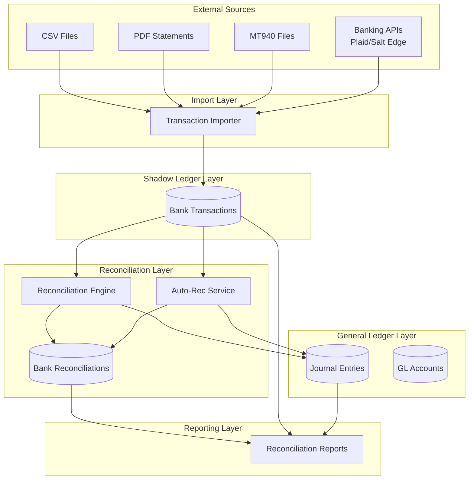
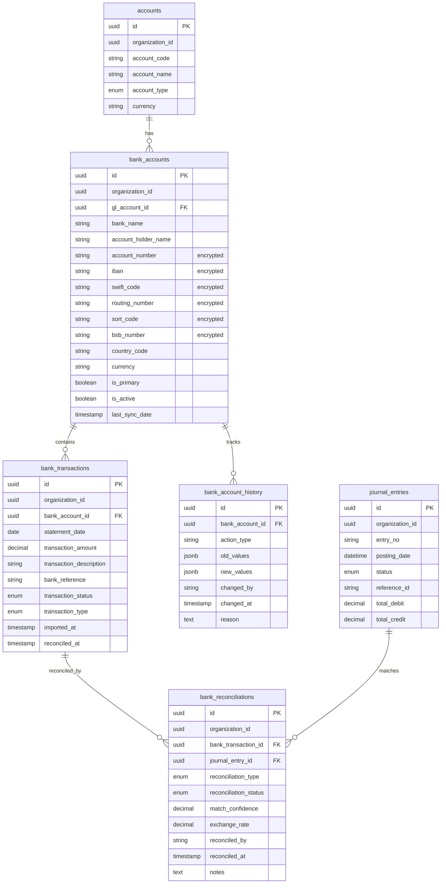

# Design Document: Bank Integration Module

## Overview

The Bank Integration module implements a comprehensive banking layer for the ERP system, connecting the Chart of Accounts with real-world banking operations. The design follows the Shadow Ledger architectural pattern, where bank transactions exist in a separate staging layer before reconciliation with the General Ledger.

### Key Design Principles

1. **Shadow Ledger Pattern**: Bank transactions remain isolated from the GL until explicitly reconciled, maintaining data integrity and providing a clear audit trail
2. **Multi-Country Support**: Flexible validation framework supporting US, EU, UK, Australia, and India banking standards
3. **Reconciliation-First**: Multiple reconciliation strategies (exact match, fuzzy match, many-to-one) to handle diverse business scenarios
4. **Security by Design**: Encryption at rest for sensitive banking data with field-level masking
5. **API-Ready Architecture**: Extensible service layer prepared for Plaid and Salt Edge integration
6. **Audit Compliance**: Complete history tracking for all banking operations

### System Context

The Bank Integration module extends the existing ERP system components:
- **Chart of Accounts**: GL accounts of type "Bank" can be linked to bank accounts
- **Journal Entries**: Existing accounting entries that will be matched with bank transactions
- **Payment System**: Payments create journal entries that need reconciliation with bank deposits
- **Multi-Currency**: Supports organizations operating in multiple currencies

### Technology Stack

- **Backend**: Python with SQLAlchemy ORM
- **Database**: PostgreSQL with JSONB support for flexible metadata
- **Encryption**: AES-256 for sensitive fields (account numbers, IBAN, routing numbers)
- **File Processing**: CSV parsing, PDF text extraction, MT940 SWIFT format parsing
- **Future APIs**: Plaid (US/Canada), Salt Edge (EU/Global)

## Architecture

### High-Level Architecture



### Data Flow

1. **Import Flow**: External sources → Transaction Importer → Bank Transactions (Shadow Ledger)
2. **Reconciliation Flow**: Bank Transactions + Journal Entries → Reconciliation Engine → Bank Reconciliations
3. **Reporting Flow**: Bank Transactions + Reconciliations + Journal Entries → Reports

### Three-Layer Architecture

The system maintains three distinct data layers:

1. **Raw Layer (Shadow Ledger)**: `bank_transactions` table stores imported data exactly as received
2. **Reconciliation Layer**: `bank_reconciliations` table links bank transactions to journal entries
3. **Final Layer (General Ledger)**: `journal_entries` table contains the authoritative accounting records

This separation ensures:
- Bank data integrity (no modification of imported transactions)
- Clear audit trail (all reconciliation actions tracked)
- Flexibility (undo reconciliations without data loss)
- Reporting accuracy (separate bank balance vs GL balance calculations)

## Components and Interfaces

### 1. Bank Account Manager

**Responsibility**: Manage bank account lifecycle, validation, and security

**Key Methods**:
```python
class BankAccountManager:
    def create_bank_account(
        self,
        organization_id: UUID,
        gl_account_id: UUID,
        bank_details: BankAccountCreate,
        created_by: str
    ) -> BankAccount
    
    def create_default_bank_account(
        self,
        organization_id: UUID,
        organization_currency: str,
        created_by: str,
        skip_on_error: bool = True
    ) -> Optional[BankAccount]
    
    def update_bank_account(
        self,
        bank_account_id: UUID,
        updates: BankAccountUpdate,
        updated_by: str
    ) -> BankAccount
    
    def deactivate_bank_account(
        self,
        bank_account_id: UUID,
        reason: str,
        updated_by: str
    ) -> BankAccount
    
    def get_bank_account_history(
        self,
        bank_account_id: UUID
    ) -> List[BankAccountHistory]
    
    def mask_sensitive_fields(
        self,
        bank_account: BankAccount
    ) -> BankAccountDisplay
```

**Security Features**:
- Encrypts sensitive fields before database storage
- Provides masked display methods (last 4 digits only)
- Logs all access to sensitive fields
- Requires elevated permissions for full unmasked view

### 2. Country Validator

**Responsibility**: Validate banking information based on country-specific rules

**Configuration Structure**:
```python
COUNTRY_BANKING_RULES = {
    "US": {
        "required_fields": ["routing_number", "account_number"],
        "patterns": {
            "routing_number": r"^\d{9}$"
        }
    },
    "GB": {
        "required_fields": ["sort_code", "account_number"],
        "patterns": {
            "sort_code": r"^\d{2}-\d{2}-\d{2}$"
        }
    },
    "DE": {  # Example EU country
        "required_fields": ["iban", "swift_code"],
        "patterns": {
            "iban": r"^[A-Z]{2}\d{2}[A-Z0-9]{11,30}$",
            "swift_code": r"^[A-Z]{6}[A-Z0-9]{2}([A-Z0-9]{3})?$"
        }
    },
    "IN": {
        "required_fields": ["ifsc_code", "account_number"],
        "patterns": {
            "ifsc_code": r"^[A-Z]{4}0[A-Z0-9]{6}$"
        }
    },
    "AU": {
        "required_fields": ["bsb_number", "account_number"],
        "patterns": {
            "bsb_number": r"^\d{3}-\d{3}$"
        }
    }
}
```

**Key Methods**:
```python
class CountryValidator:
    def validate_banking_info(
        self,
        country_code: str,
        banking_details: Dict[str, Any]
    ) -> ValidationResult
    
    def get_required_fields(
        self,
        country_code: str
    ) -> List[str]
    
    def get_field_patterns(
        self,
        country_code: str
    ) -> Dict[str, str]
```

### 3. Transaction Importer

**Responsibility**: Import bank transactions from multiple file formats

**Supported Formats**:
- CSV (comma-separated values)
- PDF (bank statement text extraction)
- MT940 (SWIFT standard format)

**Key Methods**:
```python
class TransactionImporter:
    def import_csv(
        self,
        bank_account_id: UUID,
        file_content: bytes,
        organization_id: UUID
    ) -> ImportResult
    
    def import_pdf(
        self,
        bank_account_id: UUID,
        file_content: bytes,
        organization_id: UUID
    ) -> ImportResult
    
    def import_mt940(
        self,
        bank_account_id: UUID,
        file_content: str,
        organization_id: UUID
    ) -> ImportResult
    
    def detect_duplicates(
        self,
        bank_account_id: UUID,
        transactions: List[BankTransactionImport]
    ) -> List[DuplicateMatch]
    
    def validate_transaction_data(
        self,
        transaction: BankTransactionImport
    ) -> ValidationResult
```

**CSV Format Specification**:
```csv
date,amount,description,reference,type
2024-01-15,1500.00,Customer Payment - INV-001,TXN-12345,credit
2024-01-16,-250.50,Office Supplies,TXN-12346,debit
```

**MT940 Parsing Strategy**:
- Parse `:60F:` for opening balance
- Parse `:61:` for transaction statements
- Parse `:86:` for transaction details
- Parse `:62F:` for closing balance
- Validate balance calculations

**PDF Parsing Strategy**:
- Extract text using PDF library (PyPDF2 or pdfplumber)
- Use regex patterns to identify transaction rows
- Support common bank statement formats (configurable patterns)
- Handle multi-page statements
- Fallback to manual entry if parsing fails

### 4. Reconciliation Engine

**Responsibility**: Match bank transactions with journal entries

**Reconciliation Types**:
1. **Manual**: User explicitly links transactions
2. **Auto-Exact**: System matches on amount, date, and reference
3. **Auto-Fuzzy**: System suggests matches with confidence scores
4. **Many-to-One**: Multiple journal entries match one bank transaction

**Key Methods**:
```python
class ReconciliationEngine:
    def create_manual_match(
        self,
        bank_transaction_id: UUID,
        journal_entry_ids: List[UUID],
        reconciled_by: str,
        notes: Optional[str] = None
    ) -> List[BankReconciliation]
    
    def confirm_suggested_match(
        self,
        reconciliation_id: UUID,
        confirmed_by: str
    ) -> BankReconciliation
    
    def reject_suggested_match(
        self,
        reconciliation_id: UUID,
        rejected_by: str,
        reason: str
    ) -> BankReconciliation
    
    def undo_reconciliation(
        self,
        reconciliation_id: UUID,
        undone_by: str,
        reason: str
    ) -> BankReconciliation
    
    def get_unreconciled_transactions(
        self,
        bank_account_id: UUID,
        date_from: date,
        date_to: date
    ) -> List[BankTransaction]
    
    def get_unreconciled_journal_entries(
        self,
        gl_account_id: UUID,
        date_from: date,
        date_to: date
    ) -> List[JournalEntry]
    
    def calculate_reconciliation_difference(
        self,
        bank_balance: Decimal,
        gl_balance: Decimal
    ) -> Decimal
```

### 5. Auto-Reconciliation Service

**Responsibility**: Automatically match transactions using algorithms

**Matching Algorithms**:

**Exact Match Algorithm**:
```python
def find_exact_matches(
    bank_transaction: BankTransaction,
    journal_entries: List[JournalEntry]
) -> Optional[JournalEntry]:
    """
    Match criteria:
    1. Amount matches exactly
    2. Date matches exactly
    3. Reference matches exactly
    """
    for je in journal_entries:
        if (je.amount == bank_transaction.amount and
            je.posting_date == bank_transaction.statement_date and
            je.reference_id == bank_transaction.bank_reference):
            return je
    return None
```

**Fuzzy Match Algorithm**:
```python
def find_fuzzy_matches(
    bank_transaction: BankTransaction,
    journal_entries: List[JournalEntry]
) -> List[Tuple[JournalEntry, float]]:
    """
    Match criteria with confidence scoring:
    - Amount match (exact): +0.5
    - Date within 3 days: +0.3
    - Reference partial match: +0.2
    
    Minimum confidence: 0.7
    """
    matches = []
    for je in journal_entries:
        confidence = 0.0
        
        # Amount match (required)
        if je.amount == bank_transaction.amount:
            confidence += 0.5
        else:
            continue  # Skip if amount doesn't match
        
        # Date proximity
        date_diff = abs((je.posting_date - bank_transaction.statement_date).days)
        if date_diff == 0:
            confidence += 0.3
        elif date_diff <= 3:
            confidence += 0.2
        
        # Reference similarity
        if bank_transaction.bank_reference and je.reference_id:
            if bank_transaction.bank_reference in je.reference_id or \
               je.reference_id in bank_transaction.bank_reference:
                confidence += 0.2
        
        if confidence >= 0.7:
            matches.append((je, confidence))
    
    return sorted(matches, key=lambda x: x[1], reverse=True)
```

**Many-to-One Detection**:
```python
def find_many_to_one_matches(
    bank_transaction: BankTransaction,
    journal_entries: List[JournalEntry],
    date_tolerance_days: int = 7
) -> Optional[List[JournalEntry]]:
    """
    Find combinations of journal entries that sum to bank transaction amount
    within a date range.
    """
    # Filter entries within date range
    date_from = bank_transaction.statement_date - timedelta(days=date_tolerance_days)
    date_to = bank_transaction.statement_date + timedelta(days=date_tolerance_days)
    
    candidates = [
        je for je in journal_entries
        if date_from <= je.posting_date <= date_to
    ]
    
    # Find subset sum matching bank transaction amount
    matches = find_subset_sum(
        candidates,
        bank_transaction.amount,
        tolerance=Decimal('0.01')
    )
    
    return matches if matches else None
```

**Key Methods**:
```python
class AutoReconciliationService:
    def run_auto_reconciliation(
        self,
        bank_account_id: UUID,
        date_from: date,
        date_to: date
    ) -> AutoReconciliationResult
    
    def find_exact_matches(
        self,
        bank_transaction: BankTransaction,
        journal_entries: List[JournalEntry]
    ) -> Optional[JournalEntry]
    
    def find_fuzzy_matches(
        self,
        bank_transaction: BankTransaction,
        journal_entries: List[JournalEntry]
    ) -> List[Tuple[JournalEntry, float]]
    
    def find_many_to_one_matches(
        self,
        bank_transaction: BankTransaction,
        journal_entries: List[JournalEntry]
    ) -> Optional[List[JournalEntry]]
```

### 6. Banking API Service (Stub)

**Responsibility**: Interface for future banking API integrations

**Provider Interface**:
```python
class BankingAPIProvider(ABC):
    @abstractmethod
    def authenticate(
        self,
        credentials: Dict[str, str]
    ) -> AuthenticationResult
    
    @abstractmethod
    def fetch_transactions(
        self,
        account_id: str,
        date_from: date,
        date_to: date
    ) -> List[BankTransaction]
    
    @abstractmethod
    def fetch_balance(
        self,
        account_id: str
    ) -> AccountBalance
```

**Plaid Provider Stub**:
```python
class PlaidProvider(BankingAPIProvider):
    """
    Stub implementation for Plaid API (US/Canada)
    Credentials: client_id, secret, access_token
    """
    def authenticate(self, credentials: Dict[str, str]) -> AuthenticationResult:
        # TODO: Implement Plaid OAuth flow
        raise NotImplementedError("Plaid integration pending")
    
    def fetch_transactions(
        self,
        account_id: str,
        date_from: date,
        date_to: date
    ) -> List[BankTransaction]:
        # TODO: Call Plaid /transactions/get endpoint
        raise NotImplementedError("Plaid integration pending")
    
    def fetch_balance(self, account_id: str) -> AccountBalance:
        # TODO: Call Plaid /accounts/balance/get endpoint
        raise NotImplementedError("Plaid integration pending")
```

**Salt Edge Provider Stub**:
```python
class SaltEdgeProvider(BankingAPIProvider):
    """
    Stub implementation for Salt Edge API (EU/Global)
    Credentials: app_id, secret, customer_id
    """
    def authenticate(self, credentials: Dict[str, str]) -> AuthenticationResult:
        # TODO: Implement Salt Edge authentication
        raise NotImplementedError("Salt Edge integration pending")
    
    def fetch_transactions(
        self,
        account_id: str,
        date_from: date,
        date_to: date
    ) -> List[BankTransaction]:
        # TODO: Call Salt Edge transactions endpoint
        raise NotImplementedError("Salt Edge integration pending")
    
    def fetch_balance(self, account_id: str) -> AccountBalance:
        # TODO: Call Salt Edge accounts endpoint
        raise NotImplementedError("Salt Edge integration pending")
```

### 7. Encryption Service

**Responsibility**: Encrypt and decrypt sensitive banking fields

**Implementation**:
```python
from cryptography.fernet import Fernet
from cryptography.hazmat.primitives import hashes
from cryptography.hazmat.primitives.kdf.pbkdf2 import PBKDF2

class EncryptionService:
    def __init__(self, master_key: str):
        # Derive encryption key from master key
        kdf = PBKDF2(
            algorithm=hashes.SHA256(),
            length=32,
            salt=b'banking_salt',  # Should be from config
            iterations=100000,
        )
        key = base64.urlsafe_b64encode(kdf.derive(master_key.encode()))
        self.cipher = Fernet(key)
    
    def encrypt_field(self, plaintext: str) -> str:
        """Encrypt a field value"""
        if not plaintext:
            return ""
        encrypted = self.cipher.encrypt(plaintext.encode())
        return base64.b64encode(encrypted).decode()
    
    def decrypt_field(self, ciphertext: str) -> str:
        """Decrypt a field value"""
        if not ciphertext:
            return ""
        encrypted = base64.b64decode(ciphertext.encode())
        decrypted = self.cipher.decrypt(encrypted)
        return decrypted.decode()
    
    def mask_account_number(self, account_number: str) -> str:
        """Show only last 4 digits"""
        if len(account_number) <= 4:
            return "*" * len(account_number)
        return "*" * (len(account_number) - 4) + account_number[-4:]
    
    def mask_iban(self, iban: str) -> str:
        """Show first 4 and last 4 characters"""
        if len(iban) <= 8:
            return "*" * len(iban)
        return iban[:4] + "*" * (len(iban) - 8) + iban[-4:]
```

**Encrypted Fields**:
- `account_number`
- `iban`
- `routing_number`
- `swift_code`
- `ifsc_code`
- `sort_code`
- `bsb_number`

**Key Management**:
- Master encryption key stored in environment variables (not in database)
- Key rotation strategy: re-encrypt all fields with new key
- Audit log for all encryption/decryption operations

## Data Models

### Database Schema



### Table Definitions

#### bank_accounts
```sql
CREATE TABLE bank_accounts (
    id UUID PRIMARY KEY DEFAULT gen_random_uuid(),
    organization_id UUID NOT NULL,
    gl_account_id UUID NOT NULL REFERENCES accounts(id) ON DELETE CASCADE,
    
    -- Banking details (encrypted at application level)
    bank_name VARCHAR(100) NOT NULL,
    account_holder_name VARCHAR(200) NOT NULL,
    account_number VARCHAR(50) NOT NULL,  -- encrypted
    iban VARCHAR(34),  -- encrypted
    swift_code VARCHAR(11),  -- encrypted
    routing_number VARCHAR(20),  -- encrypted (US)
    branch_name VARCHAR(100),
    branch_code VARCHAR(20),
    sort_code VARCHAR(10),  -- encrypted (UK)
    bsb_number VARCHAR(10),  -- encrypted (AU)
    ifsc_code VARCHAR(11),  -- encrypted (IN)
    
    -- Metadata
    country_code VARCHAR(2) NOT NULL,
    currency VARCHAR(3) NOT NULL,
    account_type VARCHAR(50),
    account_purpose VARCHAR(50),
    is_primary BOOLEAN NOT NULL DEFAULT FALSE,
    is_active BOOLEAN NOT NULL DEFAULT TRUE,
    
    -- Banking features
    online_banking_enabled BOOLEAN DEFAULT FALSE,
    mobile_banking_enabled BOOLEAN DEFAULT FALSE,
    wire_transfer_enabled BOOLEAN DEFAULT FALSE,
    ach_enabled BOOLEAN DEFAULT FALSE,
    
    -- Limits
    daily_transfer_limit NUMERIC(15, 2),
    monthly_transfer_limit NUMERIC(15, 2),
    requires_dual_approval BOOLEAN DEFAULT FALSE,
    
    -- API integration
    bank_api_enabled BOOLEAN DEFAULT FALSE,
    bank_api_credentials_id UUID,
    last_sync_date TIMESTAMP WITH TIME ZONE,
    sync_frequency VARCHAR(20) DEFAULT 'manual',
    
    -- Audit
    created_by VARCHAR(100) NOT NULL,
    created_at TIMESTAMP WITH TIME ZONE NOT NULL DEFAULT NOW(),
    updated_by VARCHAR(100) NOT NULL,
    updated_at TIMESTAMP WITH TIME ZONE NOT NULL DEFAULT NOW(),
    
    CONSTRAINT unique_iban_per_org UNIQUE (organization_id, iban)
);

CREATE INDEX idx_bank_accounts_org ON bank_accounts(organization_id);
CREATE INDEX idx_bank_accounts_gl_account ON bank_accounts(gl_account_id);
CREATE INDEX idx_bank_accounts_active ON bank_accounts(is_active) WHERE is_active = TRUE;
```

#### bank_transactions
```sql
CREATE TABLE bank_transactions (
    id UUID PRIMARY KEY DEFAULT gen_random_uuid(),
    organization_id UUID NOT NULL,
    bank_account_id UUID NOT NULL REFERENCES bank_accounts(id) ON DELETE CASCADE,
    
    -- Transaction details
    statement_date DATE NOT NULL,
    transaction_amount NUMERIC(15, 2) NOT NULL,
    transaction_description VARCHAR(500),
    bank_reference VARCHAR(100),
    transaction_status VARCHAR(20) NOT NULL DEFAULT 'pending',  -- pending, cleared, reconciled, void
    transaction_type VARCHAR(10) NOT NULL,  -- debit, credit
    
    -- Import metadata
    imported_at TIMESTAMP WITH TIME ZONE NOT NULL DEFAULT NOW(),
    import_source VARCHAR(50),  -- csv, pdf, mt940, api
    import_batch_id UUID,
    
    -- Reconciliation tracking
    reconciled_at TIMESTAMP WITH TIME ZONE,
    is_duplicate BOOLEAN DEFAULT FALSE,
    
    -- Additional data
    extra_data JSONB,
    
    CONSTRAINT chk_transaction_status CHECK (transaction_status IN ('pending', 'cleared', 'reconciled', 'void')),
    CONSTRAINT chk_transaction_type CHECK (transaction_type IN ('debit', 'credit'))
);

CREATE INDEX idx_bank_transactions_org ON bank_transactions(organization_id);
CREATE INDEX idx_bank_transactions_account ON bank_transactions(bank_account_id);
CREATE INDEX idx_bank_transactions_date ON bank_transactions(statement_date);
CREATE INDEX idx_bank_transactions_status ON bank_transactions(transaction_status);
CREATE INDEX idx_bank_transactions_unreconciled ON bank_transactions(bank_account_id, transaction_status) 
    WHERE transaction_status = 'cleared';
CREATE INDEX idx_bank_transactions_reference ON bank_transactions(bank_reference);
```

#### bank_reconciliations
```sql
CREATE TABLE bank_reconciliations (
    id UUID PRIMARY KEY DEFAULT gen_random_uuid(),
    organization_id UUID NOT NULL,
    bank_transaction_id UUID NOT NULL REFERENCES bank_transactions(id) ON DELETE CASCADE,
    journal_entry_id UUID NOT NULL REFERENCES journal_entries(id) ON DELETE CASCADE,
    
    -- Reconciliation metadata
    reconciliation_type VARCHAR(20) NOT NULL,  -- manual, auto_exact, auto_fuzzy, many_to_one
    reconciliation_status VARCHAR(20) NOT NULL DEFAULT 'suggested',  -- suggested, confirmed, rejected
    match_confidence NUMERIC(3, 2),  -- 0.00 to 1.00
    
    -- Multi-currency support
    exchange_rate NUMERIC(15, 6),
    converted_amount NUMERIC(15, 2),
    
    -- Audit
    reconciled_by VARCHAR(100),
    reconciled_at TIMESTAMP WITH TIME ZONE,
    notes TEXT,
    
    -- Undo tracking
    is_active BOOLEAN DEFAULT TRUE,
    undone_by VARCHAR(100),
    undone_at TIMESTAMP WITH TIME ZONE,
    undo_reason TEXT,
    
    CONSTRAINT chk_reconciliation_type CHECK (reconciliation_type IN ('manual', 'auto_exact', 'auto_fuzzy', 'many_to_one')),
    CONSTRAINT chk_reconciliation_status CHECK (reconciliation_status IN ('suggested', 'confirmed', 'rejected')),
    CONSTRAINT chk_match_confidence CHECK (match_confidence >= 0 AND match_confidence <= 1)
);

CREATE INDEX idx_bank_reconciliations_org ON bank_reconciliations(organization_id);
CREATE INDEX idx_bank_reconciliations_transaction ON bank_reconciliations(bank_transaction_id);
CREATE INDEX idx_bank_reconciliations_journal ON bank_reconciliations(journal_entry_id);
CREATE INDEX idx_bank_reconciliations_status ON bank_reconciliations(reconciliation_status);
CREATE INDEX idx_bank_reconciliations_active ON bank_reconciliations(is_active) WHERE is_active = TRUE;

-- Allow multiple journal entries to one bank transaction (many-to-one)
-- But prevent duplicate reconciliations
CREATE UNIQUE INDEX idx_bank_reconciliations_unique_active 
    ON bank_reconciliations(bank_transaction_id, journal_entry_id) 
    WHERE is_active = TRUE;
```

#### bank_account_history
```sql
CREATE TABLE bank_account_history (
    id UUID PRIMARY KEY DEFAULT gen_random_uuid(),
    bank_account_id UUID NOT NULL REFERENCES bank_accounts(id) ON DELETE CASCADE,
    
    -- Change tracking
    action_type VARCHAR(50) NOT NULL,  -- created, updated, activated, deactivated
    old_values JSONB,
    new_values JSONB,
    
    -- Audit
    changed_by VARCHAR(100) NOT NULL,
    changed_at TIMESTAMP WITH TIME ZONE NOT NULL DEFAULT NOW(),
    reason TEXT,
    
    CONSTRAINT chk_action_type CHECK (action_type IN ('created', 'updated', 'activated', 'deactivated'))
);

CREATE INDEX idx_bank_account_history_account ON bank_account_history(bank_account_id);
CREATE INDEX idx_bank_account_history_date ON bank_account_history(changed_at);
```

### Data Model Relationships

1. **accounts → bank_accounts**: One-to-Many
   - A GL account of type "Bank" can have multiple bank accounts
   - Supports multiple bank accounts for one GL account (e.g., checking and savings)

2. **bank_accounts → bank_transactions**: One-to-Many
   - Each bank account has many transactions
   - Transactions are isolated per bank account

3. **bank_transactions → bank_reconciliations**: One-to-Many
   - One bank transaction can have multiple reconciliation records (for many-to-one scenarios)
   - Only one active reconciliation per transaction-journal pair

4. **journal_entries → bank_reconciliations**: One-to-Many
   - One journal entry can be reconciled with multiple bank transactions
   - Supports split scenarios

5. **bank_accounts → bank_account_history**: One-to-Many
   - Complete audit trail for all bank account changes
   - Immutable history records

### Multi-Currency Considerations

**Currency Storage**:
- Bank accounts store transactions in their native currency
- Journal entries use organization base currency
- Reconciliations store exchange rate and converted amount

**Exchange Rate Handling**:
```python
def reconcile_with_currency_conversion(
    bank_transaction: BankTransaction,
    journal_entry: JournalEntry,
    exchange_rate: Decimal
) -> BankReconciliation:
    """
    Reconcile transactions in different currencies
    """
    converted_amount = bank_transaction.transaction_amount * exchange_rate
    tolerance = Decimal('0.01')
    
    if abs(converted_amount - journal_entry.amount) <= tolerance:
        return create_reconciliation(
            bank_transaction=bank_transaction,
            journal_entry=journal_entry,
            exchange_rate=exchange_rate,
            converted_amount=converted_amount
        )
    else:
        raise ValueError(
            f"Converted amount {converted_amount} does not match "
            f"journal entry amount {journal_entry.amount}"
        )
```


## Correctness Properties

A property is a characteristic or behavior that should hold true across all valid executions of a system—essentially, a formal statement about what the system should do. Properties serve as the bridge between human-readable specifications and machine-verifiable correctness guarantees.

### Property Reflection

After analyzing all acceptance criteria, I identified the following redundancies and consolidations:

**Redundancy Analysis**:
1. Requirements 1.2, 1.3, 1.4, 1.5 all test different aspects of default bank account creation - these can be combined into one comprehensive property
2. Requirements 7.4, 7.5, 7.6, 7.7, 7.8 all test different fields set during manual reconciliation - these can be combined
3. Requirements 8.5, 8.6, 8.7, 8.8, 8.9 all test different aspects of exact match reconciliation - these can be combined
4. Requirements 10.5, 10.6, 10.7, 10.8 all test different aspects of many-to-one reconciliation creation - these can be combined
5. Requirements 17.2, 17.3, 17.4, 17.5 all test different fields updated during undo - these can be combined
6. Requirements 18.1-18.4 all test history record creation for different actions - these can be combined into one property
7. Requirements 18.5, 18.6, 18.7, 18.8 all test different fields in history records - these can be combined
8. Country validation requirements (5.1-5.8) can be consolidated into country-specific properties
9. CSV validation requirements (11.3-11.6) can be consolidated into one validation property
10. Encryption requirements (15.1-15.4) can be consolidated into one encryption property

**Consolidated Properties**: After reflection, 80+ testable criteria have been consolidated into 35 unique properties that provide comprehensive validation coverage without redundancy.

### Property 1: Default Bank Account Creation

For any organization with a currency, when a default bank account is created, it shall be linked to a GL account of type "Bank", have is_primary set to true, have is_active set to true, and use the organization's currency.

**Validates: Requirements 1.2, 1.3, 1.4, 1.5**

### Property 2: Default Bank Account Creation Failure Handling

For any organization, if default bank account creation fails, the organization creation shall still succeed.

**Validates: Requirements 1.7**

### Property 3: US Banking Validation

For any bank account data with country_code "US", the Country_Validator shall require routing_number matching pattern `^\d{9}$` and require account_number to be present.

**Validates: Requirements 5.1, 5.2**

### Property 4: EU Banking Validation

For any bank account data with an EU country code, the Country_Validator shall require iban matching pattern `^[A-Z]{2}\d{2}[A-Z0-9]{11,30}$` and require swift_code to be present.

**Validates: Requirements 5.3, 5.4**

### Property 5: India Banking Validation

For any bank account data with country_code "IN", the Country_Validator shall require ifsc_code matching pattern `^[A-Z]{4}0[A-Z0-9]{6}$` and require account_number to be present.

**Validates: Requirements 5.5, 5.6**

### Property 6: UK Banking Validation

For any bank account data with country_code "GB", the Country_Validator shall require sort_code matching pattern `^\d{2}-\d{2}-\d{2}$`.

**Validates: Requirements 5.7**

### Property 7: Australia Banking Validation

For any bank account data with country_code "AU", the Country_Validator shall require bsb_number matching pattern `^\d{3}-\d{3}$`.

**Validates: Requirements 5.8**

### Property 8: Validation Error Messages

For any invalid banking data, when validation fails, the Country_Validator shall return a descriptive error message indicating the missing or invalid field.

**Validates: Requirements 5.9**

### Property 9: Manual Reconciliation Creation

For any unreconciled bank transaction and journal entry, when a user creates a manual match, the system shall create a reconciliation record with reconciliation_type "manual", reconciliation_status "confirmed", update the bank transaction status to "reconciled", set reconciled_at to current timestamp, and store the user identifier in reconciled_by.

**Validates: Requirements 7.3, 7.4, 7.5, 7.6, 7.7, 7.8**

### Property 10: Prevent Double Reconciliation

For any bank transaction that is already reconciled, attempting to reconcile it again shall fail.

**Validates: Requirements 7.10**

### Property 11: Auto-Reconciliation Filtering

For any bank account, when the Auto_Rec_Service runs, it shall only process bank transactions with status "cleared" and reconciled_at is null.

**Validates: Requirements 8.1**

### Property 12: Exact Match Reconciliation

For any bank transaction and journal entry where transaction_amount equals journal entry amount, statement_date equals posting_date, and bank_reference equals reference_id, the Auto_Rec_Service shall create a reconciliation with reconciliation_type "auto_exact", match_confidence 1.0, reconciliation_status "confirmed", update bank transaction status to "reconciled", and set reconciled_at to current timestamp.

**Validates: Requirements 8.2, 8.3, 8.4, 8.5, 8.6, 8.7, 8.8, 8.9**

### Property 13: Fuzzy Match Confidence Calculation (Date + Amount)

For any bank transaction and journal entry where transaction_amount equals journal entry amount exactly and statement_date is within 3 days of posting_date, the Auto_Rec_Service shall calculate match_confidence as 0.8.

**Validates: Requirements 9.2, 9.3, 9.5**

### Property 14: Fuzzy Match Confidence Calculation (Date + Amount + Reference)

For any bank transaction and journal entry where transaction_amount equals journal entry amount exactly, statement_date is within 3 days of posting_date, and bank_reference has a partial match with reference_id, the Auto_Rec_Service shall calculate match_confidence as 0.95.

**Validates: Requirements 9.2, 9.3, 9.4, 9.6**

### Property 15: Fuzzy Match Status

For any fuzzy match found by Auto_Rec_Service, the reconciliation shall have reconciliation_type "auto_fuzzy", reconciliation_status "suggested", and the bank transaction status shall remain unchanged.

**Validates: Requirements 9.7, 9.8, 9.9**

### Property 16: Many-to-One Sum Calculation

For any set of journal entries, when calculating the sum for many-to-one reconciliation, the sum shall equal the total of all selected journal entry amounts.

**Validates: Requirements 10.2**

### Property 17: Many-to-One Amount Matching

For any bank transaction and set of journal entries, when the sum of journal entry amounts equals the bank transaction amount, the Reconciliation_Engine shall allow many-to-one reconciliation; when the sum does not equal the amount, reconciliation shall be prevented.

**Validates: Requirements 10.3, 10.4**

### Property 18: Many-to-One Reconciliation Creation

For any confirmed many-to-one match with N journal entries, the system shall create N reconciliation records, each with reconciliation_type "many_to_one", reconciliation_status "confirmed", and update the bank transaction status to "reconciled".

**Validates: Requirements 10.5, 10.6, 10.7, 10.8**

### Property 19: Many-to-One Auto-Detection

For any bank transaction, the Auto_Rec_Service shall detect potential many-to-one matches when the sum of multiple journal entries within a 7-day date range equals the bank transaction amount.

**Validates: Requirements 10.10**

### Property 20: CSV Column Validation

For any CSV file uploaded, the Transaction_Importer shall validate that all required columns (date, amount, description, reference, type) are present.

**Validates: Requirements 11.3**

### Property 21: CSV Data Validation

For any CSV file uploaded, the Transaction_Importer shall validate that date values are in ISO 8601 format (YYYY-MM-DD), amount values are numeric with up to 2 decimal places, and type values are either "debit" or "credit".

**Validates: Requirements 11.4, 11.5, 11.6**

### Property 22: Import Status Assignment

For any valid transaction data imported (CSV, PDF, or MT940), the Transaction_Importer shall create bank transaction records with status "cleared".

**Validates: Requirements 11.11**

### Property 23: Import Validation Error Reporting

For any import with validation failures, the Transaction_Importer shall return error messages indicating which rows and columns have errors.

**Validates: Requirements 11.12**

### Property 24: Duplicate Transaction Detection

For any transaction being imported, the Transaction_Importer shall check for existing transactions with the same bank_account_id, statement_date, transaction_amount, and bank_reference; when all match, the transaction shall be classified as a duplicate.

**Validates: Requirements 11.13, 20.1, 20.2, 20.3**

### Property 25: Duplicate Transaction Handling

For any duplicate transaction detected during import, the Transaction_Importer shall skip importing the transaction and include it in the duplicate count of the import summary.

**Validates: Requirements 11.14, 11.15, 20.4, 20.6**

### Property 26: Force Import Duplicate Flagging

For any duplicate transaction imported with force flag confirmed, the Transaction_Importer shall create the transaction with is_duplicate flag set to true.

**Validates: Requirements 20.8**

### Property 27: MT940 Parsing Round-Trip

For any valid MT940 file content, parsing the MT940 data and then formatting it back to MT940 should preserve the transaction data (amounts, dates, descriptions, references).

**Validates: Requirements 12.1-12.11**

### Property 28: Shadow Ledger Isolation

For any bank transaction imported, the system shall store it in the bank_transactions table without creating any journal entries or posting to GL accounts.

**Validates: Requirements 14.1, 14.2**

### Property 29: Reconciliation Linking (Not Creation)

For any confirmed reconciliation match, the system shall link the bank transaction to an existing journal entry without modifying the journal entry.

**Validates: Requirements 14.3, 14.4**

### Property 30: Reconciliation Status Update

For any confirmed reconciliation match, the system shall update the bank transaction status to "reconciled".

**Validates: Requirements 14.5**

### Property 31: Balance Calculation Separation

For any bank account, the system shall calculate bank balance from bank_transactions independently from GL balance calculated from journal_entries, and the unreconciled amount shall equal the difference between these balances.

**Validates: Requirements 14.8, 14.9**

### Property 32: Reconciled Transaction Deletion Prevention

For any bank transaction with status "reconciled", deletion attempts shall be prevented.

**Validates: Requirements 14.10**

### Property 33: Sensitive Field Encryption

For any bank account, the fields account_number, iban, routing_number, and swift_code shall be encrypted before storage in the database.

**Validates: Requirements 15.1, 15.2, 15.3, 15.4**

### Property 34: Account Number Masking

For any account_number, when displayed, the system shall show only the last 4 digits (or all asterisks if length ≤ 4).

**Validates: Requirements 15.7**

### Property 35: IBAN Masking

For any IBAN, when displayed, the system shall show only the first 4 and last 4 characters with asterisks in between (or all asterisks if length ≤ 8).

**Validates: Requirements 15.8**

### Property 36: Reconciliation Undo State Reversion

For any confirmed reconciliation, when undone, the system shall update the reconciliation status to "rejected", update the bank transaction status back to "cleared", set reconciled_at to null, set reconciled_by to null, and preserve the reconciliation record (not delete it).

**Validates: Requirements 17.2, 17.3, 17.4, 17.5, 17.6**

### Property 37: Reconciliation Undo Time Restriction

For any reconciliation older than 90 days, undo attempts without elevated permissions shall be prevented.

**Validates: Requirements 17.9**

### Property 38: Bank Account History Creation

For any bank account operation (created, updated, activated, deactivated), the system shall create a bank_account_history record with the corresponding action_type.

**Validates: Requirements 18.1, 18.2, 18.3, 18.4**

### Property 39: Bank Account History Content

For any bank account history record, it shall store old_values as a JSON object, new_values as a JSON object, changed_by as the user identifier, and changed_at as the timestamp.

**Validates: Requirements 18.5, 18.6, 18.7, 18.8**

### Property 40: Bank Account History Immutability

For any bank account history record, deletion or modification attempts shall be prevented.

**Validates: Requirements 18.10**

### Property 41: Transaction Currency Inheritance

For any bank transaction imported, the transaction shall be stored in the currency of the associated bank account.

**Validates: Requirements 19.2**

### Property 42: Cross-Currency Reconciliation Exchange Rate Requirement

For any bank transaction and journal entry in different currencies, reconciliation shall require an exchange_rate parameter.

**Validates: Requirements 19.3**

### Property 43: Currency Conversion Calculation

For any cross-currency reconciliation with an exchange_rate provided, the system shall calculate converted_amount as transaction_amount × exchange_rate.

**Validates: Requirements 19.4**

### Property 44: Currency Conversion Tolerance Matching

For any cross-currency reconciliation, when the converted amount matches the journal entry amount within 0.01 tolerance, reconciliation shall be allowed; otherwise it shall be prevented.

**Validates: Requirements 19.5**

### Property 45: Exchange Rate Persistence

For any cross-currency reconciliation, the exchange_rate used shall be stored in the reconciliation record.

**Validates: Requirements 19.6**

## Error Handling

### Error Categories

1. **Validation Errors**: Invalid banking information, malformed import files, incorrect data formats
2. **Business Rule Violations**: Duplicate reconciliations, reconciling already-reconciled transactions, sum mismatches in many-to-one
3. **Data Integrity Errors**: Missing GL accounts, orphaned transactions, constraint violations
4. **Security Errors**: Encryption failures, unauthorized access to sensitive fields
5. **External Service Errors**: Banking API failures, PDF parsing failures, network timeouts

### Error Handling Strategy

**Validation Errors**:
```python
class BankingValidationError(Exception):
    def __init__(self, field: str, message: str, country_code: str):
        self.field = field
        self.message = message
        self.country_code = country_code
        super().__init__(f"{country_code} validation failed for {field}: {message}")

# Usage
if not re.match(r'^\d{9}$', routing_number):
    raise BankingValidationError(
        field="routing_number",
        message="Must be exactly 9 digits",
        country_code="US"
    )
```

**Business Rule Violations**:
```python
class ReconciliationError(Exception):
    pass

class AlreadyReconciledError(ReconciliationError):
    def __init__(self, transaction_id: UUID):
        self.transaction_id = transaction_id
        super().__init__(f"Transaction {transaction_id} is already reconciled")

class AmountMismatchError(ReconciliationError):
    def __init__(self, expected: Decimal, actual: Decimal):
        self.expected = expected
        self.actual = actual
        self.difference = abs(expected - actual)
        super().__init__(
            f"Amount mismatch: expected {expected}, got {actual}, "
            f"difference {self.difference}"
        )
```

**Import Errors**:
```python
class ImportError(Exception):
    pass

class CSVFormatError(ImportError):
    def __init__(self, missing_columns: List[str]):
        self.missing_columns = missing_columns
        super().__init__(f"Missing required columns: {', '.join(missing_columns)}")

class CSVDataError(ImportError):
    def __init__(self, row: int, column: str, value: str, expected: str):
        self.row = row
        self.column = column
        self.value = value
        self.expected = expected
        super().__init__(
            f"Row {row}, column '{column}': invalid value '{value}', "
            f"expected {expected}"
        )

class PDFParsingError(ImportError):
    def __init__(self, reason: str):
        super().__init__(f"PDF parsing failed: {reason}")
```

**Encryption Errors**:
```python
class EncryptionError(Exception):
    pass

class EncryptionKeyError(EncryptionError):
    def __init__(self):
        super().__init__("Encryption key not configured or invalid")

class DecryptionError(EncryptionError):
    def __init__(self, field: str):
        super().__init__(f"Failed to decrypt field: {field}")
```

### Error Recovery Strategies

1. **Graceful Degradation**: If default bank account creation fails, allow organization creation to proceed
2. **Partial Success**: Import transactions that pass validation, report errors for failed rows
3. **Retry Logic**: For transient API failures, implement exponential backoff
4. **Audit Trail**: Log all errors with context for debugging and compliance
5. **User Feedback**: Provide clear, actionable error messages with specific field information

### Transaction Rollback

All database operations that modify multiple tables (e.g., creating reconciliations) must be wrapped in transactions:

```python
async def create_manual_reconciliation(
    db: Session,
    bank_transaction_id: UUID,
    journal_entry_id: UUID,
    reconciled_by: str
) -> BankReconciliation:
    try:
        async with db.begin():
            # Check if already reconciled
            existing = await check_existing_reconciliation(db, bank_transaction_id)
            if existing:
                raise AlreadyReconciledError(bank_transaction_id)
            
            # Create reconciliation
            reconciliation = BankReconciliation(
                bank_transaction_id=bank_transaction_id,
                journal_entry_id=journal_entry_id,
                reconciliation_type="manual",
                reconciliation_status="confirmed",
                reconciled_by=reconciled_by,
                reconciled_at=datetime.now(UTC)
            )
            db.add(reconciliation)
            
            # Update transaction status
            transaction = await db.get(BankTransaction, bank_transaction_id)
            transaction.transaction_status = "reconciled"
            transaction.reconciled_at = datetime.now(UTC)
            
            await db.commit()
            return reconciliation
    except Exception as e:
        await db.rollback()
        logger.error(f"Reconciliation failed: {e}")
        raise
```

## Testing Strategy

### Dual Testing Approach

The Bank Integration module requires both unit testing and property-based testing to ensure comprehensive coverage:

**Unit Tests**: Focus on specific examples, edge cases, and integration points
- Test specific country validation examples (US routing number "123456789", invalid "12345")
- Test CSV import with sample files
- Test reconciliation with specific transaction pairs
- Test error conditions (missing fields, invalid formats)
- Test encryption/decryption with known values
- Test API stub interfaces

**Property-Based Tests**: Verify universal properties across all inputs
- Generate random bank account data for each country and verify validation
- Generate random transaction amounts and dates for reconciliation matching
- Generate random CSV data and verify import behavior
- Generate random encryption inputs and verify round-trip
- Generate random many-to-one combinations and verify sum calculations

### Property-Based Testing Configuration

**Framework**: Use `hypothesis` for Python property-based testing

**Configuration**:
```python
from hypothesis import given, settings, strategies as st

# Configure for minimum 100 iterations per test
@settings(max_examples=100, deadline=None)
@given(
    organization_id=st.uuids(),
    currency=st.sampled_from(['USD', 'EUR', 'GBP', 'INR', 'AUD'])
)
def test_default_bank_account_creation(organization_id, currency):
    """
    Feature: bank-integration, Property 1: Default Bank Account Creation
    
    For any organization with a currency, when a default bank account is created,
    it shall be linked to a GL account of type "Bank", have is_primary set to true,
    have is_active set to true, and use the organization's currency.
    """
    # Test implementation
    pass
```

**Test Tagging**: Each property test must reference its design document property:
```python
# Feature: bank-integration, Property 12: Exact Match Reconciliation
# Feature: bank-integration, Property 24: Duplicate Transaction Detection
# Feature: bank-integration, Property 27: MT940 Parsing Round-Trip
```

### Test Data Generators

**Bank Account Generator**:
```python
@st.composite
def bank_account_data(draw, country_code=None):
    if country_code is None:
        country_code = draw(st.sampled_from(['US', 'GB', 'DE', 'IN', 'AU']))
    
    data = {
        'bank_name': draw(st.text(min_size=1, max_size=100)),
        'account_holder_name': draw(st.text(min_size=1, max_size=200)),
        'country_code': country_code,
        'currency': draw(st.sampled_from(['USD', 'EUR', 'GBP', 'INR', 'AUD']))
    }
    
    if country_code == 'US':
        data['routing_number'] = draw(st.from_regex(r'\d{9}', fullmatch=True))
        data['account_number'] = draw(st.text(min_size=1, max_size=20))
    elif country_code == 'GB':
        data['sort_code'] = draw(st.from_regex(r'\d{2}-\d{2}-\d{2}', fullmatch=True))
        data['account_number'] = draw(st.text(min_size=1, max_size=20))
    elif country_code in ['DE', 'FR', 'IT']:  # EU countries
        data['iban'] = draw(st.from_regex(r'[A-Z]{2}\d{2}[A-Z0-9]{11,30}', fullmatch=True))
        data['swift_code'] = draw(st.from_regex(r'[A-Z]{6}[A-Z0-9]{2}([A-Z0-9]{3})?', fullmatch=True))
    elif country_code == 'IN':
        data['ifsc_code'] = draw(st.from_regex(r'[A-Z]{4}0[A-Z0-9]{6}', fullmatch=True))
        data['account_number'] = draw(st.text(min_size=1, max_size=20))
    elif country_code == 'AU':
        data['bsb_number'] = draw(st.from_regex(r'\d{3}-\d{3}', fullmatch=True))
        data['account_number'] = draw(st.text(min_size=1, max_size=20))
    
    return data
```

**Transaction Generator**:
```python
@st.composite
def bank_transaction_data(draw):
    return {
        'statement_date': draw(st.dates(min_value=date(2020, 1, 1))),
        'transaction_amount': draw(st.decimals(
            min_value=Decimal('0.01'),
            max_value=Decimal('999999.99'),
            places=2
        )),
        'transaction_description': draw(st.text(min_size=1, max_size=500)),
        'bank_reference': draw(st.text(min_size=1, max_size=100)),
        'transaction_type': draw(st.sampled_from(['debit', 'credit']))
    }
```

**CSV Generator**:
```python
@st.composite
def csv_content(draw, num_rows=None):
    if num_rows is None:
        num_rows = draw(st.integers(min_value=1, max_value=100))
    
    rows = []
    for _ in range(num_rows):
        row = {
            'date': draw(st.dates(min_value=date(2020, 1, 1))).isoformat(),
            'amount': str(draw(st.decimals(
                min_value=Decimal('0.01'),
                max_value=Decimal('999999.99'),
                places=2
            ))),
            'description': draw(st.text(min_size=1, max_size=100)),
            'reference': draw(st.text(min_size=1, max_size=50)),
            'type': draw(st.sampled_from(['debit', 'credit']))
        }
        rows.append(row)
    
    # Convert to CSV string
    import csv
    import io
    output = io.StringIO()
    writer = csv.DictWriter(output, fieldnames=['date', 'amount', 'description', 'reference', 'type'])
    writer.writeheader()
    writer.writerows(rows)
    return output.getvalue()
```

### Unit Test Examples

**Country Validation Tests**:
```python
def test_us_routing_number_valid():
    """Test US routing number validation with valid input"""
    validator = CountryValidator()
    result = validator.validate_banking_info('US', {
        'routing_number': '123456789',
        'account_number': '1234567890'
    })
    assert result.is_valid

def test_us_routing_number_invalid():
    """Test US routing number validation with invalid input"""
    validator = CountryValidator()
    result = validator.validate_banking_info('US', {
        'routing_number': '12345',  # Too short
        'account_number': '1234567890'
    })
    assert not result.is_valid
    assert 'routing_number' in result.errors
```

**Reconciliation Tests**:
```python
def test_exact_match_reconciliation():
    """Test exact match reconciliation with matching transaction and journal entry"""
    transaction = create_test_transaction(
        amount=Decimal('1500.00'),
        date=date(2024, 1, 15),
        reference='TXN-12345'
    )
    journal_entry = create_test_journal_entry(
        amount=Decimal('1500.00'),
        date=date(2024, 1, 15),
        reference='TXN-12345'
    )
    
    service = AutoReconciliationService()
    match = service.find_exact_matches(transaction, [journal_entry])
    
    assert match is not None
    assert match.id == journal_entry.id

def test_many_to_one_sum_calculation():
    """Test many-to-one reconciliation sum calculation"""
    entries = [
        create_test_journal_entry(amount=Decimal('100.00')),
        create_test_journal_entry(amount=Decimal('200.00')),
        create_test_journal_entry(amount=Decimal('300.00'))
    ]
    
    engine = ReconciliationEngine()
    total = engine.calculate_sum(entries)
    
    assert total == Decimal('600.00')
```

**Import Tests**:
```python
def test_csv_import_valid():
    """Test CSV import with valid data"""
    csv_content = """date,amount,description,reference,type
2024-01-15,1500.00,Customer Payment,TXN-001,credit
2024-01-16,250.50,Office Supplies,TXN-002,debit"""
    
    importer = TransactionImporter()
    result = importer.import_csv(bank_account_id, csv_content.encode(), org_id)
    
    assert result.imported_count == 2
    assert result.failed_count == 0

def test_csv_import_missing_columns():
    """Test CSV import with missing required columns"""
    csv_content = """date,amount,description
2024-01-15,1500.00,Customer Payment"""
    
    importer = TransactionImporter()
    with pytest.raises(CSVFormatError) as exc:
        importer.import_csv(bank_account_id, csv_content.encode(), org_id)
    
    assert 'reference' in exc.value.missing_columns
    assert 'type' in exc.value.missing_columns
```

**Encryption Tests**:
```python
def test_encryption_round_trip():
    """Test encryption and decryption preserves data"""
    service = EncryptionService(master_key='test-key-12345')
    original = '1234567890'
    
    encrypted = service.encrypt_field(original)
    decrypted = service.decrypt_field(encrypted)
    
    assert decrypted == original
    assert encrypted != original

def test_account_number_masking():
    """Test account number masking shows only last 4 digits"""
    service = EncryptionService(master_key='test-key-12345')
    account_number = '1234567890'
    
    masked = service.mask_account_number(account_number)
    
    assert masked == '******7890'
    assert len(masked) == len(account_number)
```

### Integration Tests

**End-to-End Reconciliation Flow**:
```python
async def test_full_reconciliation_flow():
    """Test complete flow from import to reconciliation"""
    # 1. Create bank account
    bank_account = await create_bank_account(...)
    
    # 2. Import transactions
    csv_data = create_test_csv()
    import_result = await import_csv(bank_account.id, csv_data)
    assert import_result.imported_count > 0
    
    # 3. Create journal entries
    journal_entry = await create_journal_entry(...)
    
    # 4. Run auto-reconciliation
    auto_result = await run_auto_reconciliation(bank_account.id)
    assert auto_result.exact_matches > 0
    
    # 5. Verify reconciliation
    transaction = await get_transaction(import_result.transaction_ids[0])
    assert transaction.transaction_status == 'reconciled'
    
    # 6. Test undo
    await undo_reconciliation(transaction.id, user_id='test-user')
    transaction = await get_transaction(transaction.id)
    assert transaction.transaction_status == 'cleared'
```

### Test Coverage Goals

- Unit test coverage: 80% minimum
- Property test coverage: All 45 correctness properties
- Integration test coverage: All major workflows (import, reconcile, undo, report)
- Edge case coverage: Empty files, malformed data, boundary values, concurrent operations

### Continuous Testing

- Run unit tests on every commit
- Run property tests (100 iterations) on every pull request
- Run integration tests on staging environment before deployment
- Monitor test execution time and optimize slow tests
- Track flaky tests and investigate root causes

