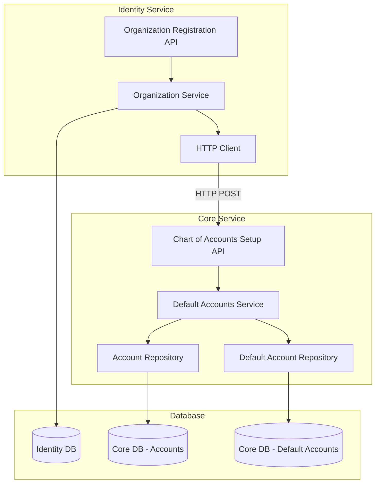
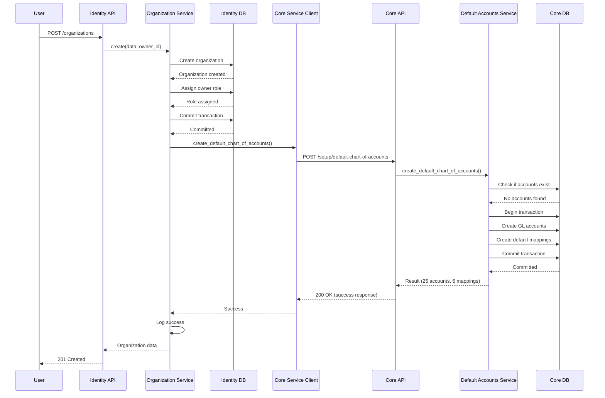
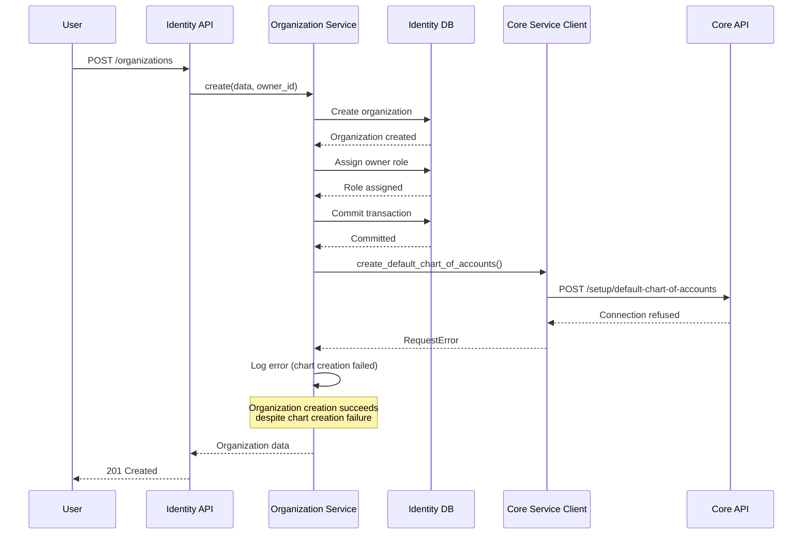
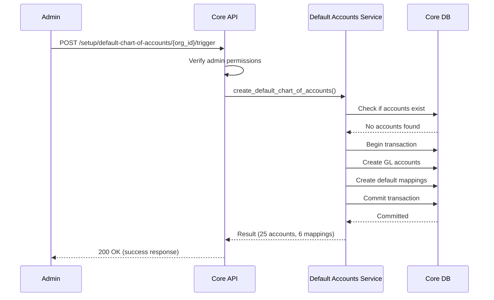
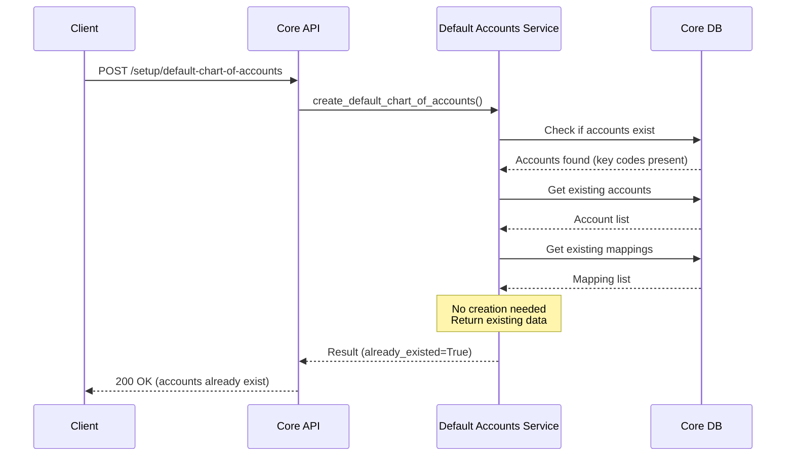

# Design Document: Default Chart of Accounts Setup

## Overview

This feature implements automatic creation of a standard chart of accounts when an organization is registered in the system. The design ensures that new organizations have a complete, ready-to-use accounting structure immediately after registration, enabling users to perform banking operations, create invoices, and manage financial transactions without manual account setup.

The solution involves service-to-service communication between the Identity Service (which handles organization registration) and the Core Service (which manages accounting data). The design prioritizes reliability, idempotency, and graceful error handling to ensure that organization registration succeeds even if chart of accounts creation encounters issues.

### Key Design Goals

1. **Zero Manual Setup**: Users can immediately link bank accounts and perform accounting operations after registration
2. **Standard Compliance**: Default accounts follow generally accepted accounting principles (GAAP) structure
3. **Service Reliability**: Organization registration succeeds independently of chart of accounts creation
4. **Idempotency**: Multiple creation attempts don't create duplicate accounts
5. **Extensibility**: Users can customize the default structure after creation
6. **Audit Trail**: Complete logging of creation events for troubleshooting and compliance

## Architecture

### System Components



### Communication Flow

The system uses asynchronous HTTP communication between services:

1. **Organization Creation**: Identity Service creates organization record
2. **Service Notification**: Identity Service calls Core Service via HTTP POST
3. **Chart Creation**: Core Service creates default accounts and mappings
4. **Response Handling**: Identity Service logs success/failure but doesn't block registration
5. **Manual Trigger**: Admin endpoint available for retry if initial creation fails

### Service Integration Pattern

**Fire-and-Forget with Logging**:
- Identity Service doesn't wait for chart creation to complete organization registration
- Failures are logged but don't prevent organization creation
- Manual trigger endpoint allows recovery from failures
- Idempotency ensures safe retries

## Components and Interfaces

### 1. Identity Service Components

#### HTTP Client Service

```python
# app/services/core_service_client.py

class CoreServiceClient:
    """HTTP client for communicating with Core Service"""
    
    def __init__(self, base_url: str, timeout: int = 10):
        self.base_url = base_url
        self.timeout = timeout
    
    async def create_default_chart_of_accounts(
        self,
        organization_id: UUID,
        currency: str,
        created_by: str
    ) -> dict:
        """
        Trigger default chart of accounts creation in Core Service
        
        Args:
            organization_id: UUID of the organization
            currency: ISO currency code (e.g., "USD")
            created_by: User identifier who created the organization
            
        Returns:
            dict: Response from Core Service with creation status
            
        Raises:
            httpx.RequestError: If request fails
            httpx.HTTPStatusError: If response status is error
        """
```

#### Modified Organization Service

```python
# app/services/organization_service.py

class OrganizationService:
    def __init__(self, db: Session, core_client: CoreServiceClient):
        self.db = db
        self.repo = OrganizationRepository(db)
        self.core_client = core_client
    
    async def create(self, data: dict, owner_id: UUID) -> dict:
        """
        Create organization and trigger default chart of accounts creation
        
        Steps:
        1. Create organization record in Identity DB
        2. Assign owner role to creating user
        3. Commit transaction
        4. Trigger chart of accounts creation (non-blocking)
        5. Log result but don't fail if chart creation fails
        """
```

### 2. Core Service Components

#### Default Chart of Accounts API

```python
# app/api/v1/endpoints/chart_of_accounts_setup.py

@router.post("/setup/default-chart-of-accounts")
async def create_default_chart_of_accounts(
    request: DefaultChartSetupRequest,
    db: Session = Depends(get_db)
) -> DefaultChartSetupResponse:
    """
    Create default chart of accounts for an organization
    
    This endpoint is idempotent - calling it multiple times for the same
    organization will not create duplicate accounts.
    
    Request Body:
        - organization_id: UUID of the organization
        - currency: ISO currency code (default: "USD")
        - created_by: User identifier
        
    Returns:
        - success: boolean
        - accounts_created: number of accounts created
        - mappings_created: number of default account mappings created
        - message: status message
    """

@router.post("/setup/default-chart-of-accounts/{organization_id}/trigger")
async def trigger_default_chart_creation(
    organization_id: UUID,
    request: ManualTriggerRequest,
    db: Session = Depends(get_db),
    current_user: dict = Depends(require_admin_permission)
) -> DefaultChartSetupResponse:
    """
    Manually trigger default chart of accounts creation
    
    This endpoint allows administrators to manually create the default
    chart of accounts for organizations where automatic creation failed.
    
    Requires: Admin permissions
    """
```

#### Default Chart Setup Service

**Note**: The existing `DefaultAccountService` handles transaction type mappings. We'll create a new `DefaultChartSetupService` specifically for creating the default chart structure.

```python
# app/services/default_chart_setup_service.py

class DefaultChartSetupService:
    """Service for creating default chart of accounts structure"""
    
    def __init__(self, db: Session):
        self.db = db
        self.account_repo = AccountRepository(db)
        self.chart_service = ChartOfAccountService(db)
        self.default_account_service = DefaultAccountService(db)
    
    def create_default_chart_of_accounts(
        self,
        organization_id: UUID,
        currency: str,
        created_by: str
    ) -> DefaultChartResult:
        """
        Create default chart of accounts with idempotency
        
        Steps:
        1. Check if default accounts already exist
        2. If exists, return existing accounts (idempotent)
        3. Begin transaction
        4. Create default GL accounts using ChartOfAccountService
        5. Create default account mappings using DefaultAccountService
        6. Commit transaction
        7. Log creation event
        8. Return result
        
        Returns:
            DefaultChartResult with accounts and mappings created
        """
    
    def get_default_account_structure(self) -> list[AccountTemplate]:
        """
        Get the standard default account structure
        
        Returns list of account templates with:
        - account_code
        - account_name
        - account_type
        - parent_code (for hierarchical structure)
        - is_group
        - is_posting_account
        - description
        """
    
    def create_default_mappings(
        self,
        organization_id: UUID,
        accounts: dict[str, UUID]
    ) -> list[DefaultAccount]:
        """
        Create default account mappings for transaction types
        
        Uses existing DefaultAccountService.set_default_account() method
        
        Args:
            organization_id: Organization UUID
            accounts: Mapping of account_code to account_id
            
        Returns:
            List of created DefaultAccount mappings
        """
```

### 3. Repository Layer

**Note**: The existing `AccountRepository` already has most methods we need. We'll add a few helper methods for default chart setup.

#### Account Repository Extensions

```python
# app/repositories/chart_of_account_repository.py

class AccountRepository:
    # Existing methods: create, get_by_id, get_by_code, update, delete, list_all, etc.
    
    def check_default_accounts_exist(
        self,
        organization_id: UUID
    ) -> bool:
        """
        Check if default accounts already exist for organization
        
        Returns True if organization has any accounts with standard
        default account codes (1000-5999 range)
        """
        key_codes = ["1000", "2000", "3000", "4000", "5000"]
        
        result = self.db.query(Account).filter(
            Account.organization_id == organization_id,
            Account.account_code.in_(key_codes)
        ).first()
        
        return result is not None
    
    def get_accounts_by_codes(
        self,
        organization_id: UUID,
        account_codes: list[str]
    ) -> dict[str, Account]:
        """
        Get accounts by their codes
        
        Returns:
            Dictionary mapping account_code to Account object
        """
        accounts = self.db.query(Account).filter(
            Account.organization_id == organization_id,
            Account.account_code.in_(account_codes)
        ).all()
        
        return {acc.account_code: acc for acc in accounts}
```

**Note**: We'll use the existing `DefaultAccountService` for creating mappings, so no new repository methods needed for default accounts.

## Data Models

### Default Account Structure

The system creates a standard chart of accounts following this structure:

```
ASSETS (1000-1999)
├── Current Assets (1000-1499)
│   ├── Cash and Bank Accounts (1000)
│   ├── Accounts Receivable (1200)
│   ├── Inventory (1300)
│   └── Prepaid Expenses (1400)
└── Fixed Assets (1500-1999)
    ├── Property and Equipment (1500)
    └── Accumulated Depreciation (1600)

LIABILITIES (2000-2999)
├── Current Liabilities (2000-2499)
│   ├── Accounts Payable (2000)
│   ├── Accrued Expenses (2100)
│   └── Short-term Debt (2200)
└── Long-term Liabilities (2500-2999)
    └── Long-term Debt (2500)

EQUITY (3000-3999)
├── Owner's Equity (3000)
├── Retained Earnings (3100)
└── Current Year Earnings (3200)

REVENUE (4000-4999)
├── Sales Revenue (4000)
├── Service Revenue (4100)
└── Other Income (4900)

EXPENSE (5000-5999)
├── Cost of Goods Sold (5000)
├── Operating Expenses (5100)
├── Salaries and Wages (5200)
├── Rent Expense (5300)
└── Utilities Expense (5400)
```

### Account Template Structure

```python
@dataclass
class AccountTemplate:
    account_code: str
    account_name: str
    account_type: AccountType
    parent_code: Optional[str] = None
    is_group: bool = False
    is_posting_account: bool = True
    description: Optional[str] = None
    level: int = 1
```

### Default Account Mappings

```python
DEFAULT_MAPPINGS = {
    # Payment-related mappings
    "payment_cash": {
        "transaction_type": "payment",
        "scenario": "cash",
        "account_code": "1000"  # Cash and Bank Accounts
    },
    "payment_bank": {
        "transaction_type": "payment",
        "scenario": "bank",
        "account_code": "1000"  # Cash and Bank Accounts
    },
    
    # Receivables
    "accounts_receivable": {
        "transaction_type": "sales_invoice",
        "scenario": "receivable",
        "account_code": "1200"  # Accounts Receivable
    },
    
    # Payables
    "accounts_payable": {
        "transaction_type": "purchase_invoice",
        "scenario": "payable",
        "account_code": "2000"  # Accounts Payable
    },
    
    # Revenue
    "sales_revenue": {
        "transaction_type": "sales_invoice",
        "scenario": "revenue",
        "account_code": "4000"  # Sales Revenue
    },
    
    # Expenses
    "purchase_expense": {
        "transaction_type": "purchase_invoice",
        "scenario": "expense",
        "account_code": "5100"  # Operating Expenses
    }
}
```

### Request/Response Schemas

```python
# app/schemas/chart_of_accounts_setup.py

class DefaultChartSetupRequest(BaseModel):
    organization_id: UUID
    currency: str = "USD"
    created_by: str
    
    @field_validator('currency')
    def validate_currency(cls, v):
        if len(v) != 3 or not v.isupper():
            raise ValueError('Currency must be 3-letter ISO code')
        return v

class DefaultChartSetupResponse(BaseModel):
    success: bool
    organization_id: UUID
    accounts_created: int
    mappings_created: int
    message: str
    errors: Optional[list[str]] = None

class ManualTriggerRequest(BaseModel):
    currency: str = "USD"
    force_recreate: bool = False  # If True, recreate even if accounts exist
    
class DefaultChartResult(BaseModel):
    accounts: list[Account]
    mappings: list[DefaultAccount]
    already_existed: bool
```


## Error Handling

### Error Categories and Strategies

#### 1. Service Communication Errors

**Scenario**: Identity Service cannot reach Core Service

**Strategy**: Log and Continue
```python
try:
    await core_client.create_default_chart_of_accounts(
        organization_id=org.id,
        currency=org.base_currency,
        created_by=str(owner_id)
    )
    logger.info(f"Default chart of accounts created for org {org.id}")
except httpx.RequestError as e:
    logger.error(
        f"Failed to create default chart for org {org.id}: {e}",
        extra={
            "organization_id": str(org.id),
            "error_type": "service_communication",
            "error": str(e)
        }
    )
    # Don't raise - organization creation should succeed
except httpx.HTTPStatusError as e:
    logger.error(
        f"Core service returned error for org {org.id}: {e.response.status_code}",
        extra={
            "organization_id": str(org.id),
            "status_code": e.response.status_code,
            "response_body": e.response.text
        }
    )
```

**Recovery**: Manual trigger endpoint available for administrators

#### 2. Database Transaction Errors

**Scenario**: Account creation fails mid-transaction

**Strategy**: Rollback and Return Error
```python
async def create_default_chart_of_accounts(
    self,
    organization_id: UUID,
    currency: str,
    created_by: str
) -> DefaultChartResult:
    try:
        async with self.db.begin():
            # Create accounts
            accounts = await self._create_accounts(
                organization_id, currency, created_by
            )
            
            # Create mappings
            mappings = await self._create_mappings(
                organization_id, accounts
            )
            
            # Transaction commits automatically if no exception
            
        return DefaultChartResult(
            accounts=accounts,
            mappings=mappings,
            already_existed=False
        )
    except IntegrityError as e:
        logger.error(f"Database integrity error: {e}")
        raise ChartCreationException(
            "Failed to create chart of accounts due to data conflict"
        )
    except Exception as e:
        logger.error(f"Unexpected error creating chart: {e}")
        raise ChartCreationException(
            "Failed to create chart of accounts"
        )
```

**Recovery**: Transaction automatically rolls back; safe to retry

#### 3. Duplicate Account Code Errors

**Scenario**: Account code already exists (race condition or retry)

**Strategy**: Check Before Create (Idempotency)
```python
async def create_default_chart_of_accounts(
    self,
    organization_id: UUID,
    currency: str,
    created_by: str
) -> DefaultChartResult:
    # Check if default accounts already exist
    existing = await self.account_repo.check_default_accounts_exist(
        organization_id
    )
    
    if existing:
        logger.info(f"Default accounts already exist for org {organization_id}")
        accounts = await self.account_repo.get_accounts_by_codes(
            organization_id,
            [t.account_code for t in self.get_default_account_structure()]
        )
        mappings = await self.default_account_repo.get_mappings_for_organization(
            organization_id
        )
        return DefaultChartResult(
            accounts=list(accounts.values()),
            mappings=mappings,
            already_existed=True
        )
    
    # Proceed with creation...
```

#### 4. Parent Account Not Found Errors

**Scenario**: Hierarchical account creation fails due to missing parent

**Strategy**: Create in Dependency Order
```python
async def _create_accounts(
    self,
    organization_id: UUID,
    currency: str,
    created_by: str
) -> list[Account]:
    templates = self.get_default_account_structure()
    
    # Sort by level to ensure parents are created first
    templates.sort(key=lambda t: t.level)
    
    created_accounts = {}
    
    for template in templates:
        parent_id = None
        if template.parent_code:
            parent_account = created_accounts.get(template.parent_code)
            if not parent_account:
                raise ChartCreationException(
                    f"Parent account {template.parent_code} not found"
                )
            parent_id = parent_account.id
        
        account = await self.account_repo.create_account({
            "organization_id": organization_id,
            "account_code": template.account_code,
            "account_name": template.account_name,
            "account_type": template.account_type,
            "parent_account_id": parent_id,
            "level": template.level,
            "is_group": template.is_group,
            "is_posting_account": template.is_posting_account,
            "currency": currency,
            "status": AccountStatus.ACTIVE,
            "created_by": created_by,
            "updated_by": created_by,
            "description": template.description
        })
        
        created_accounts[template.account_code] = account
    
    return list(created_accounts.values())
```

#### 5. Currency Validation Errors

**Scenario**: Invalid currency code provided

**Strategy**: Validate and Use Default
```python
def _validate_currency(self, currency: str) -> str:
    """Validate currency code and return valid code or default"""
    if not currency or len(currency) != 3:
        logger.warning(f"Invalid currency '{currency}', using USD")
        return "USD"
    
    # Optional: Check against CurrencyMaster table
    # For now, accept any 3-letter uppercase code
    return currency.upper()
```

### Error Response Format

```python
class ChartCreationException(Exception):
    """Exception raised when chart of accounts creation fails"""
    pass

# API Error Response
{
    "success": false,
    "organization_id": "uuid",
    "accounts_created": 0,
    "mappings_created": 0,
    "message": "Failed to create default chart of accounts",
    "errors": [
        "Database integrity error: duplicate account code",
        "Parent account 1000 not found for account 1010"
    ]
}
```

### Retry Strategy

**Exponential Backoff for Service Communication**:
```python
async def create_with_retry(
    self,
    organization_id: UUID,
    currency: str,
    created_by: str,
    max_retries: int = 3
) -> Optional[dict]:
    """Attempt to create chart with exponential backoff"""
    for attempt in range(max_retries):
        try:
            response = await self.core_client.create_default_chart_of_accounts(
                organization_id, currency, created_by
            )
            return response
        except httpx.RequestError as e:
            if attempt < max_retries - 1:
                wait_time = 2 ** attempt  # 1s, 2s, 4s
                logger.warning(
                    f"Attempt {attempt + 1} failed, retrying in {wait_time}s"
                )
                await asyncio.sleep(wait_time)
            else:
                logger.error(f"All {max_retries} attempts failed")
                return None
```

## Idempotency Mechanisms

### 1. Existence Check

Before creating any accounts, check if default accounts already exist:

```python
async def check_default_accounts_exist(
    self,
    organization_id: UUID
) -> bool:
    """
    Check if organization has default accounts
    
    Strategy: Check for presence of key account codes (1000, 2000, 3000, 4000, 5000)
    """
    key_codes = ["1000", "2000", "3000", "4000", "5000"]
    
    result = await self.db.execute(
        select(Account)
        .where(
            Account.organization_id == organization_id,
            Account.account_code.in_(key_codes)
        )
        .limit(1)
    )
    
    return result.scalar_one_or_none() is not None
```

### 2. Unique Constraint Enforcement

Database-level constraints prevent duplicates:

```sql
-- Existing constraint in accounts table
CONSTRAINT unique_account_code_per_org 
    UNIQUE (organization_id, account_code)

-- Existing constraint in default_accounts table
CONSTRAINT uq_default_accounts_org_type_scenario 
    UNIQUE (organization_id, transaction_type, scenario)
```

### 3. Idempotent API Design

The API returns success even if accounts already exist:

```python
@router.post("/setup/default-chart-of-accounts")
async def create_default_chart_of_accounts(
    request: DefaultChartSetupRequest,
    db: AsyncSession = Depends(get_db)
) -> DefaultChartSetupResponse:
    service = DefaultAccountsService(db)
    
    result = await service.create_default_chart_of_accounts(
        organization_id=request.organization_id,
        currency=request.currency,
        created_by=request.created_by
    )
    
    if result.already_existed:
        return DefaultChartSetupResponse(
            success=True,
            organization_id=request.organization_id,
            accounts_created=0,
            mappings_created=0,
            message="Default chart of accounts already exists"
        )
    
    return DefaultChartSetupResponse(
        success=True,
        organization_id=request.organization_id,
        accounts_created=len(result.accounts),
        mappings_created=len(result.mappings),
        message="Default chart of accounts created successfully"
    )
```

### 4. Manual Trigger with Force Option

Administrators can force recreation if needed:

```python
@router.post("/setup/default-chart-of-accounts/{organization_id}/trigger")
async def trigger_default_chart_creation(
    organization_id: UUID,
    request: ManualTriggerRequest,
    db: AsyncSession = Depends(get_db),
    current_user: dict = Depends(require_admin_permission)
) -> DefaultChartSetupResponse:
    service = DefaultAccountsService(db)
    
    if request.force_recreate:
        # Delete existing default accounts first
        await service.delete_default_accounts(organization_id)
    
    result = await service.create_default_chart_of_accounts(
        organization_id=organization_id,
        currency=request.currency,
        created_by=current_user["user_id"]
    )
    
    # Return response...
```

## Currency Handling

### Currency Source Priority

1. **Organization Base Currency**: Use `base_currency` from organization record
2. **Request Parameter**: Allow override via API request
3. **System Default**: Fall back to "USD" if not specified

### Currency Validation

```python
class CurrencyValidator:
    """Validate currency codes against system configuration"""
    
    async def validate_currency(
        self,
        currency: str,
        db: AsyncSession
    ) -> str:
        """
        Validate currency code
        
        Steps:
        1. Check format (3 uppercase letters)
        2. Optionally check against CurrencyMaster table
        3. Return validated code or raise exception
        """
        if not currency or len(currency) != 3:
            raise ValueError(f"Invalid currency code: {currency}")
        
        currency = currency.upper()
        
        # Optional: Check if currency exists in CurrencyMaster
        result = await db.execute(
            select(CurrencyMaster)
            .where(CurrencyMaster.currency_code == currency)
        )
        currency_master = result.scalar_one_or_none()
        
        if not currency_master:
            logger.warning(
                f"Currency {currency} not found in CurrencyMaster, "
                "but allowing creation"
            )
        
        return currency
```

### Multi-Currency Considerations

- All accounts in the default chart use the same currency (organization's base currency)
- Users can create additional accounts in different currencies after initial setup
- Default account mappings are currency-agnostic (they reference accounts by ID)

### Currency in Account Creation

```python
async def _create_accounts(
    self,
    organization_id: UUID,
    currency: str,
    created_by: str
) -> list[Account]:
    # Validate currency
    validated_currency = await self.currency_validator.validate_currency(
        currency, self.db
    )
    
    # Create all accounts with the same currency
    for template in templates:
        account = await self.account_repo.create_account({
            # ... other fields ...
            "currency": validated_currency,
            # ... other fields ...
        })
```

## Audit Logging

### Logging Strategy

The system maintains comprehensive audit logs at multiple levels:

#### 1. Application Logs

**Organization Service (Identity Service)**:
```python
logger.info(
    "Creating default chart of accounts",
    extra={
        "organization_id": str(org.id),
        "currency": org.base_currency,
        "owner_id": str(owner_id),
        "event": "chart_creation_initiated"
    }
)

logger.info(
    "Default chart of accounts created successfully",
    extra={
        "organization_id": str(org.id),
        "accounts_created": response["accounts_created"],
        "mappings_created": response["mappings_created"],
        "event": "chart_creation_completed"
    }
)

logger.error(
    "Failed to create default chart of accounts",
    extra={
        "organization_id": str(org.id),
        "error": str(e),
        "error_type": type(e).__name__,
        "event": "chart_creation_failed"
    }
)
```

**Default Accounts Service (Core Service)**:
```python
logger.info(
    "Starting default chart creation",
    extra={
        "organization_id": str(organization_id),
        "currency": currency,
        "created_by": created_by,
        "event": "chart_creation_started"
    }
)

logger.info(
    "Default chart creation completed",
    extra={
        "organization_id": str(organization_id),
        "accounts_created": len(accounts),
        "mappings_created": len(mappings),
        "duration_ms": duration,
        "event": "chart_creation_success"
    }
)
```

#### 2. Database Audit Fields

All created accounts include audit fields:

```python
{
    "created_by": "user_id or 'system'",
    "updated_by": "user_id or 'system'",
    "created_at": "2024-01-15T10:30:00Z",
    "updated_at": "2024-01-15T10:30:00Z"
}
```

#### 3. Account Audit Log Table

Leverage existing `AccountAuditLog` table for detailed tracking:

```python
async def _log_account_creation(
    self,
    account: Account,
    created_by: str
) -> None:
    """Log account creation to audit table"""
    audit_log = AccountAuditLog(
        account_id=account.id,
        organization_id=account.organization_id,
        action=AuditAction.CREATE,
        user_id=created_by,
        changes={
            "account_code": account.account_code,
            "account_name": account.account_name,
            "account_type": account.account_type.value,
            "currency": account.currency,
            "status": account.status.value,
            "source": "default_chart_setup"
        },
        timestamp=datetime.now(UTC)
    )
    self.db.add(audit_log)
```

#### 4. Structured Logging Format

Use structured logging for easy querying:

```python
import structlog

logger = structlog.get_logger()

logger.info(
    "default_chart_created",
    organization_id=str(organization_id),
    accounts_created=len(accounts),
    mappings_created=len(mappings),
    currency=currency,
    created_by=created_by,
    duration_seconds=duration,
    timestamp=datetime.now(UTC).isoformat()
)
```

### Audit Query Examples

**Find all chart creation events**:
```python
# Application logs query (assuming structured logging to database)
SELECT * FROM application_logs
WHERE event = 'chart_creation_completed'
ORDER BY timestamp DESC;
```

**Find failed chart creations**:
```python
SELECT * FROM application_logs
WHERE event = 'chart_creation_failed'
AND timestamp > NOW() - INTERVAL '7 days'
ORDER BY timestamp DESC;
```

**Find accounts created during default setup**:
```python
SELECT a.*, aal.*
FROM accounts a
JOIN account_audit_logs aal ON a.id = aal.account_id
WHERE aal.action = 'CREATE'
AND aal.changes->>'source' = 'default_chart_setup'
AND a.organization_id = :organization_id;
```

### Monitoring and Alerting

**Key Metrics to Track**:
- Chart creation success rate
- Chart creation duration
- Failed creation attempts by organization
- Organizations without default accounts

**Alert Conditions**:
- Chart creation failure rate > 5%
- Chart creation duration > 10 seconds
- Organization created without default accounts (after 1 hour)


## Correctness Properties

A property is a characteristic or behavior that should hold true across all valid executions of a system—essentially, a formal statement about what the system should do. Properties serve as the bridge between human-readable specifications and machine-verifiable correctness guarantees.

### Property Reflection

After analyzing all acceptance criteria, the following redundancies were identified and consolidated:

- **Requirements 1.3, 3.1, 3.2**: All specify that a suitable ASSET account for bank linking must exist. Consolidated into Property 2.
- **Requirements 1.6, 8.1**: Both specify that accounts use organization's currency. Consolidated into Property 5.
- **Requirements 1.4, 9.1**: Both specify unique account codes. Consolidated into Property 3.
- **Requirements 1.1, 5.1**: Both specify service integration trigger. Consolidated into Property 1.
- **Requirements 2.1-2.5, 4.3-4.4**: Specific account and mapping existence checks are better tested as examples rather than properties.

### Property 1: Service Integration Trigger

For any organization created in the Identity Service, the Core Service should receive a request to create the default chart of accounts containing the organization_id and currency.

**Validates: Requirements 1.1, 5.1, 5.3**

### Property 2: Complete Account Type Coverage

For any organization with a default chart of accounts, the chart should contain at least one GL account of each account type (ASSET, LIABILITY, EQUITY, REVENUE, EXPENSE), and at least one ASSET account suitable for bank account linking.

**Validates: Requirements 1.2, 1.3, 3.1, 3.2**

### Property 3: Account Code Uniqueness

For any organization, all GL accounts in the default chart should have unique account codes within that organization.

**Validates: Requirements 1.4, 9.1**

### Property 4: Active Status Invariant

For any organization, all GL accounts created as part of the default chart should have status set to ACTIVE.

**Validates: Requirements 1.5**

### Property 5: Currency Consistency

For any organization with a default chart of accounts, all GL accounts in that chart should use the same currency, which should match the organization's specified currency (or USD if not specified).

**Validates: Requirements 1.6, 8.1, 8.3**

### Property 6: Hierarchical Integrity

For any GL account in a default chart that has a parent_account_id, the referenced parent account should exist in the same organization and should be marked as a group account (is_group = true).

**Validates: Requirements 2.6**

### Property 7: Default Mappings Creation

For any organization with a default chart of accounts, default account mappings should be created for payment transaction types, and each mapping should reference a valid GL account that exists in the organization's chart.

**Validates: Requirements 4.1, 4.2**

### Property 8: Service Communication Error Handling

For any organization creation attempt where the Core Service fails or is unavailable, the Identity Service should complete the organization creation successfully and log the chart creation failure with organization details.

**Validates: Requirements 5.2, 6.3**

### Property 9: Service Response Format

For any successful default chart creation, the Core Service should return a response containing success status, organization_id, accounts_created count, and mappings_created count.

**Validates: Requirements 5.4**

### Property 10: Idempotency

For any organization, calling the default chart creation endpoint multiple times should not create duplicate GL accounts or default account mappings.

**Validates: Requirements 6.1**

### Property 11: Transaction Atomicity

For any default chart creation attempt that fails partially, all GL accounts and default account mappings created during that attempt should be rolled back, leaving no partial data in the database.

**Validates: Requirements 6.2**

### Property 12: Account Code Numbering Scheme

For any GL account in a default chart, the account code should follow the standard numbering scheme: 1000-1999 for ASSET accounts, 2000-2999 for LIABILITY accounts, 3000-3999 for EQUITY accounts, 4000-4999 for REVENUE accounts, and 5000-5999 for EXPENSE accounts.

**Validates: Requirements 9.2**

### Property 13: Audit Logging

For any default chart creation event, the system should create log entries containing the timestamp, organization_id, and the identifier of the service or user that triggered the creation.

**Validates: Requirements 10.1, 10.3**

### Property 14: Timestamp Population

For any GL account created as part of a default chart, the account should have both created_at and updated_at timestamps populated with valid datetime values.

**Validates: Requirements 10.2**

## Testing Strategy

### Dual Testing Approach

The testing strategy employs both unit tests and property-based tests to ensure comprehensive coverage:

**Unit Tests** focus on:
- Specific examples of default account structures (Requirements 2.1-2.5)
- Specific default account mappings (Requirements 4.3-4.4)
- Manual trigger endpoint functionality (Requirement 6.4)
- Edge cases like missing currency defaulting to USD (Requirement 8.2)
- Error response formats and status codes
- Integration between services with mocked HTTP clients

**Property-Based Tests** focus on:
- Universal properties that hold across all organizations and currencies
- Idempotency across multiple invocations
- Transaction atomicity under failure conditions
- Data integrity constraints (uniqueness, referential integrity)
- Invariants (all accounts active, currency consistency, code uniqueness)

### Property-Based Testing Configuration

**Framework**: Use `hypothesis` for Python property-based testing

**Configuration**:
- Minimum 100 iterations per property test
- Each test tagged with feature name and property reference
- Tag format: `# Feature: default-chart-of-accounts-setup, Property {number}: {property_text}`

**Example Test Structure**:

```python
from hypothesis import given, strategies as st
import pytest

@given(
    organization_id=st.uuids(),
    currency=st.sampled_from(['USD', 'EUR', 'GBP', 'JPY', 'CAD'])
)
@pytest.mark.property_test
def test_property_5_currency_consistency(
    organization_id,
    currency,
    db_session,
    default_accounts_service
):
    """
    Feature: default-chart-of-accounts-setup
    Property 5: Currency Consistency
    
    For any organization with a default chart of accounts, all GL accounts
    in that chart should use the same currency.
    """
    # Create default chart
    result = await default_accounts_service.create_default_chart_of_accounts(
        organization_id=organization_id,
        currency=currency,
        created_by="test_user"
    )
    
    # Verify all accounts have the same currency
    currencies = {account.currency for account in result.accounts}
    assert len(currencies) == 1, "All accounts should have the same currency"
    assert currencies.pop() == currency, f"All accounts should use {currency}"
```

### Test Organization

```
tests/
├── unit/
│   ├── test_default_accounts_service.py
│   ├── test_account_repository.py
│   ├── test_default_account_repository.py
│   ├── test_core_service_client.py
│   └── test_chart_setup_api.py
├── integration/
│   ├── test_service_communication.py
│   ├── test_organization_creation_flow.py
│   └── test_manual_trigger_endpoint.py
└── property/
    ├── test_properties_chart_creation.py
    ├── test_properties_idempotency.py
    ├── test_properties_data_integrity.py
    └── test_properties_error_handling.py
```

### Key Test Scenarios

**Unit Test Examples**:
1. Default chart includes Cash and Bank Accounts (1000)
2. Default chart includes Accounts Receivable (1200)
3. Default chart includes Accounts Payable (2000)
4. Default mappings include accounts_receivable mapping
5. Default mappings include accounts_payable mapping
6. Manual trigger endpoint returns 201 on success
7. Missing currency defaults to USD
8. Invalid currency code raises validation error

**Property Test Examples**:
1. All five account types present (Property 2)
2. No duplicate account codes (Property 3)
3. All accounts have ACTIVE status (Property 4)
4. All accounts use same currency (Property 5)
5. Parent accounts exist and are groups (Property 6)
6. Multiple calls don't create duplicates (Property 10)
7. Partial failure rolls back completely (Property 11)
8. Account codes follow numbering scheme (Property 12)

**Integration Test Examples**:
1. Organization creation triggers chart creation
2. Chart creation failure doesn't block organization creation
3. Manual trigger works for existing organizations
4. Service communication includes required fields

### Test Data Generators

For property-based tests, use these generators:

```python
from hypothesis import strategies as st

# Organization ID generator
organization_ids = st.uuids()

# Currency generator (common currencies)
currencies = st.sampled_from(['USD', 'EUR', 'GBP', 'JPY', 'CAD', 'AUD', 'CHF'])

# User ID generator
user_ids = st.text(min_size=1, max_size=50, alphabet=st.characters(
    whitelist_categories=('Lu', 'Ll', 'Nd'),
    blacklist_characters='\x00'
))

# Account code generator (valid format)
account_codes = st.text(
    min_size=4,
    max_size=10,
    alphabet=st.characters(whitelist_categories=('Nd',))
)

# Account type generator
account_types = st.sampled_from([
    AccountType.ASSET,
    AccountType.LIABILITY,
    AccountType.EQUITY,
    AccountType.REVENUE,
    AccountType.EXPENSE
])
```

### Mocking Strategy

For service communication tests:

```python
from unittest.mock import AsyncMock, patch

@pytest.fixture
def mock_core_service_client():
    """Mock Core Service HTTP client"""
    client = AsyncMock()
    client.create_default_chart_of_accounts.return_value = {
        "success": True,
        "organization_id": "test-org-id",
        "accounts_created": 25,
        "mappings_created": 6,
        "message": "Default chart created successfully"
    }
    return client

@pytest.fixture
def mock_core_service_unavailable():
    """Mock Core Service being unavailable"""
    client = AsyncMock()
    client.create_default_chart_of_accounts.side_effect = httpx.RequestError(
        "Connection refused"
    )
    return client
```

### Coverage Goals

- **Unit Test Coverage**: Minimum 90% code coverage
- **Property Test Coverage**: All 14 properties must have corresponding tests
- **Integration Test Coverage**: All service communication paths tested
- **Edge Case Coverage**: Currency defaults, error conditions, idempotency

### Continuous Integration

Tests should run in CI/CD pipeline:

```yaml
# .github/workflows/test.yml
test:
  steps:
    - name: Run unit tests
      run: pytest tests/unit/ -v --cov=app --cov-report=xml
    
    - name: Run property tests
      run: pytest tests/property/ -v --hypothesis-show-statistics
    
    - name: Run integration tests
      run: pytest tests/integration/ -v
    
    - name: Check coverage
      run: |
        coverage report --fail-under=90
```


## Implementation Details

### Sequence Diagrams

#### Successful Organization Creation with Chart Setup



#### Organization Creation with Core Service Failure



#### Manual Trigger for Existing Organization



#### Idempotent Call (Accounts Already Exist)



### Configuration

#### Environment Variables

**Identity Service**:
```bash
# Core Service connection
CORE_SERVICE_URL=http://core-service:8000
CORE_SERVICE_TIMEOUT=10

# Feature flags
ENABLE_AUTO_CHART_CREATION=true
CHART_CREATION_RETRY_ATTEMPTS=3
```

**Core Service**:
```bash
# Default chart configuration
DEFAULT_CURRENCY=USD
DEFAULT_CHART_ENABLED=true

# Account code ranges
ASSET_CODE_RANGE_START=1000
ASSET_CODE_RANGE_END=1999
LIABILITY_CODE_RANGE_START=2000
LIABILITY_CODE_RANGE_END=2999
EQUITY_CODE_RANGE_START=3000
EQUITY_CODE_RANGE_END=3999
REVENUE_CODE_RANGE_START=4000
REVENUE_CODE_RANGE_END=4999
EXPENSE_CODE_RANGE_START=5000
EXPENSE_CODE_RANGE_END=5999
```

#### Feature Flags

```python
# app/config.py

class Settings(BaseSettings):
    # Chart creation settings
    enable_auto_chart_creation: bool = True
    chart_creation_retry_attempts: int = 3
    chart_creation_timeout: int = 10
    
    # Core service connection
    core_service_url: str
    core_service_timeout: int = 10
    
    # Default values
    default_currency: str = "USD"
```

### Database Migrations

#### Core Service Migration

```python
# alembic/versions/xxx_add_default_chart_setup.py

"""Add default chart setup support

Revision ID: xxx
Revises: yyy
Create Date: 2024-01-15 10:00:00.000000

"""
from alembic import op
import sqlalchemy as sa

def upgrade():
    # No schema changes needed - using existing tables:
    # - accounts (already exists)
    # - default_accounts (already exists)
    
    # Add index for faster default account checks
    op.create_index(
        'idx_accounts_org_code_lookup',
        'accounts',
        ['organization_id', 'account_code'],
        unique=False
    )
    
    # Add index for default account mappings
    op.create_index(
        'idx_default_accounts_org_lookup',
        'default_accounts',
        ['organization_id', 'transaction_type'],
        unique=False
    )

def downgrade():
    op.drop_index('idx_default_accounts_org_lookup', 'default_accounts')
    op.drop_index('idx_accounts_org_code_lookup', 'accounts')
```

### API Documentation

#### Core Service Endpoints

**POST /api/v1/setup/default-chart-of-accounts**

Create default chart of accounts for an organization.

Request:
```json
{
  "organization_id": "550e8400-e29b-41d4-a716-446655440000",
  "currency": "USD",
  "created_by": "user_123"
}
```

Response (Success):
```json
{
  "success": true,
  "organization_id": "550e8400-e29b-41d4-a716-446655440000",
  "accounts_created": 25,
  "mappings_created": 6,
  "message": "Default chart of accounts created successfully"
}
```

Response (Already Exists):
```json
{
  "success": true,
  "organization_id": "550e8400-e29b-41d4-a716-446655440000",
  "accounts_created": 0,
  "mappings_created": 0,
  "message": "Default chart of accounts already exists"
}
```

Response (Error):
```json
{
  "success": false,
  "organization_id": "550e8400-e29b-41d4-a716-446655440000",
  "accounts_created": 0,
  "mappings_created": 0,
  "message": "Failed to create default chart of accounts",
  "errors": [
    "Database integrity error: duplicate account code"
  ]
}
```

**POST /api/v1/setup/default-chart-of-accounts/{organization_id}/trigger**

Manually trigger default chart creation (admin only).

Request:
```json
{
  "currency": "EUR",
  "force_recreate": false
}
```

Response: Same as above

### Performance Considerations

#### Bulk Operations

Use bulk insert operations to minimize database round trips:

```python
async def _create_accounts_bulk(
    self,
    templates: list[AccountTemplate],
    organization_id: UUID,
    currency: str,
    created_by: str
) -> list[Account]:
    """Create accounts in bulk for better performance"""
    
    # Prepare all account data
    account_data = []
    for template in templates:
        account_data.append({
            "id": uuid.uuid4(),
            "organization_id": organization_id,
            "account_code": template.account_code,
            "account_name": template.account_name,
            "account_type": template.account_type,
            "level": template.level,
            "is_group": template.is_group,
            "is_posting_account": template.is_posting_account,
            "currency": currency,
            "status": AccountStatus.ACTIVE,
            "created_by": created_by,
            "updated_by": created_by,
            "description": template.description
        })
    
    # Bulk insert
    stmt = insert(Account).values(account_data)
    await self.db.execute(stmt)
    
    return account_data
```

#### Caching

Cache the default account structure template:

```python
from functools import lru_cache

@lru_cache(maxsize=1)
def get_default_account_structure() -> list[AccountTemplate]:
    """
    Get cached default account structure
    
    This is cached because the structure is static and doesn't change
    """
    return [
        AccountTemplate(
            account_code="1000",
            account_name="Cash and Bank Accounts",
            account_type=AccountType.ASSET,
            is_group=True,
            level=1,
            description="Cash on hand and bank account balances"
        ),
        # ... rest of templates
    ]
```

#### Async Operations

Use async/await throughout for non-blocking I/O:

```python
async def create(self, data: dict, owner_id: UUID) -> dict:
    """Async organization creation"""
    # Synchronous DB operations
    org = self.repo.create(data)
    self.db.commit()
    
    # Async HTTP call (non-blocking)
    try:
        await self.core_client.create_default_chart_of_accounts(
            organization_id=org.id,
            currency=org.base_currency,
            created_by=str(owner_id)
        )
    except Exception as e:
        logger.error(f"Chart creation failed: {e}")
    
    return self._to_response(org)
```

### Security Considerations

#### Authentication and Authorization

**Identity Service**:
- Organization creation requires authenticated user
- First-time users can create their first organization
- Subsequent organizations require `org.create` permission

**Core Service**:
- Default chart creation endpoint should be internal-only (not exposed publicly)
- Manual trigger endpoint requires admin permissions
- Validate organization_id belongs to requesting user's organization

#### Input Validation

```python
class DefaultChartSetupRequest(BaseModel):
    organization_id: UUID
    currency: str = "USD"
    created_by: str
    
    @field_validator('currency')
    def validate_currency(cls, v):
        if not v or len(v) != 3:
            raise ValueError('Currency must be 3-letter ISO code')
        if not v.isupper():
            raise ValueError('Currency must be uppercase')
        # Optionally validate against known currency list
        return v
    
    @field_validator('created_by')
    def validate_created_by(cls, v):
        if not v or len(v) > 100:
            raise ValueError('created_by must be 1-100 characters')
        return v
```

#### SQL Injection Prevention

Use parameterized queries (SQLAlchemy ORM handles this):

```python
# Safe - uses parameterized query
result = await self.db.execute(
    select(Account).where(
        Account.organization_id == organization_id,
        Account.account_code.in_(key_codes)
    )
)
```

#### Rate Limiting

Implement rate limiting on manual trigger endpoint:

```python
from slowapi import Limiter
from slowapi.util import get_remote_address

limiter = Limiter(key_func=get_remote_address)

@router.post("/setup/default-chart-of-accounts/{organization_id}/trigger")
@limiter.limit("5/minute")
async def trigger_default_chart_creation(...):
    # Implementation
```

### Monitoring and Observability

#### Metrics to Track

```python
from prometheus_client import Counter, Histogram, Gauge

# Counters
chart_creation_attempts = Counter(
    'chart_creation_attempts_total',
    'Total number of chart creation attempts',
    ['status']  # success, failure, already_exists
)

chart_creation_errors = Counter(
    'chart_creation_errors_total',
    'Total number of chart creation errors',
    ['error_type']  # service_communication, database, validation
)

# Histograms
chart_creation_duration = Histogram(
    'chart_creation_duration_seconds',
    'Time taken to create default chart',
    buckets=[0.1, 0.5, 1.0, 2.0, 5.0, 10.0]
)

# Gauges
organizations_without_charts = Gauge(
    'organizations_without_default_charts',
    'Number of organizations without default charts'
)
```

#### Logging Best Practices

```python
import structlog

logger = structlog.get_logger()

# Structured logging with context
logger.info(
    "default_chart_creation_started",
    organization_id=str(organization_id),
    currency=currency,
    created_by=created_by,
    timestamp=datetime.now(UTC).isoformat()
)

# Log with metrics
with chart_creation_duration.time():
    result = await self.create_default_chart_of_accounts(...)

chart_creation_attempts.labels(
    status='success' if result.success else 'failure'
).inc()
```

#### Health Checks

```python
@router.get("/health/chart-setup")
async def chart_setup_health(db: AsyncSession = Depends(get_db)):
    """Health check for chart setup functionality"""
    try:
        # Check database connectivity
        await db.execute(select(1))
        
        # Check if default account structure is loadable
        templates = get_default_account_structure()
        
        return {
            "status": "healthy",
            "templates_loaded": len(templates),
            "timestamp": datetime.now(UTC).isoformat()
        }
    except Exception as e:
        return {
            "status": "unhealthy",
            "error": str(e),
            "timestamp": datetime.now(UTC).isoformat()
        }
```

### Deployment Considerations

#### Rollout Strategy

1. **Phase 1**: Deploy Core Service with new endpoints (backward compatible)
2. **Phase 2**: Deploy Identity Service with chart creation integration
3. **Phase 3**: Run manual trigger for existing organizations without charts
4. **Phase 4**: Monitor and adjust based on metrics

#### Backward Compatibility

- Existing organizations without default charts continue to function
- Manual trigger endpoint allows gradual rollout
- Feature flag allows disabling auto-creation if issues arise

#### Rollback Plan

If issues arise:
1. Disable auto-creation via feature flag
2. Revert Identity Service deployment
3. Existing organizations with charts are unaffected
4. Manual cleanup of partial charts if needed

### Future Enhancements

1. **Customizable Templates**: Allow organizations to choose from multiple chart templates (e.g., retail, manufacturing, services)
2. **Localization**: Provide localized account names based on organization country
3. **Industry-Specific Charts**: Pre-configured charts for specific industries
4. **Import/Export**: Allow importing custom chart structures
5. **Chart Versioning**: Track changes to default chart structure over time
6. **Async Job Processing**: Move chart creation to background job queue for better scalability

