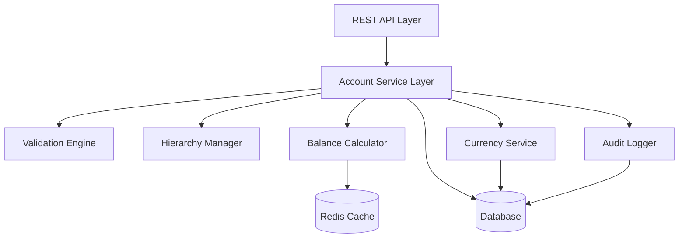
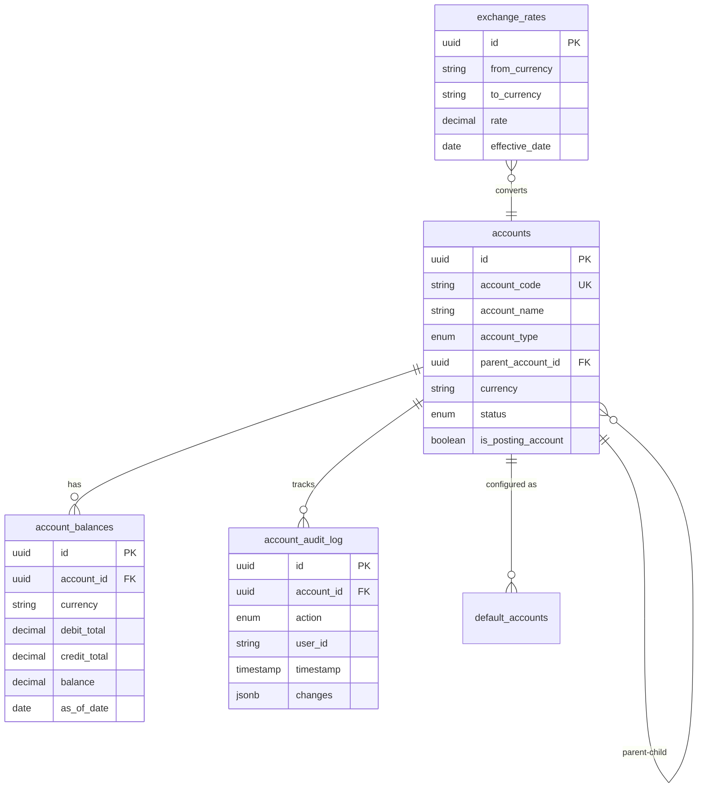

# Design Document: ERP Chart of Accounts

## Overview

The Chart of Accounts feature provides a comprehensive financial account management system for the ERP platform. It implements a hierarchical account structure supporting multiple account types, multi-currency operations, and integration with other ERP modules. The design emphasizes data integrity, audit compliance, and performance for large-scale account hierarchies.

The system is built around a core Account entity with support for:
- Hierarchical parent-child relationships with unlimited depth
- Five standard account types aligned with accounting principles
- Multi-currency support with historical exchange rate tracking
- Real-time balance calculations with caching for performance
- Comprehensive audit trails for compliance
- RESTful API for integration with inventory, sourcing, and other modules

## Architecture

### System Components



### Component Responsibilities

1. **REST API Layer**: Handles HTTP requests, authentication, and response formatting
2. **Account Service Layer**: Core business logic for account operations
3. **Validation Engine**: Enforces account rules, format validation, and data integrity
4. **Hierarchy Manager**: Manages parent-child relationships and tree operations
5. **Balance Calculator**: Computes account balances with caching for performance
6. **Currency Service**: Handles multi-currency conversions and exchange rates
7. **Audit Logger**: Records all account changes for compliance
8. **Database**: Persistent storage for accounts, transactions, and audit logs
9. **Cache**: Redis-based caching for frequently accessed balances and hierarchies

### Integration Points

The Chart of Accounts integrates with other ERP modules through:
- **Inventory Module**: Posts inventory transactions to asset and expense accounts
- **Sourcing Module**: Posts purchase orders and receipts to payables and expense accounts
- **Reporting Module**: Queries account balances and hierarchies for financial reports
- **Configuration Module**: Manages default account mappings and system settings

## Components and Interfaces

### Core Data Models

#### Account Entity

```typescript
interface Account {
  id: string;                    // UUID
  accountCode: string;           // Unique account code (e.g., "1000-01")
  accountName: string;           // Human-readable name
  accountType: AccountType;      // Asset, Liability, Equity, Revenue, Expense
  parentAccountId: string | null; // Reference to parent account
  currency: string;              // ISO 4217 currency code (e.g., "USD")
  status: AccountStatus;         // Active, Inactive, Archived
  isPostingAccount: boolean;     // Can receive direct transaction entries
  description: string;           // Optional detailed description
  createdAt: Date;
  updatedAt: Date;
  createdBy: string;
  updatedBy: string;
}

enum AccountType {
  ASSET = 'ASSET',
  LIABILITY = 'LIABILITY',
  EQUITY = 'EQUITY',
  REVENUE = 'REVENUE',
  EXPENSE = 'EXPENSE'
}

enum AccountStatus {
  ACTIVE = 'ACTIVE',
  INACTIVE = 'INACTIVE',
  ARCHIVED = 'ARCHIVED'
}
```

#### Account Balance

```typescript
interface AccountBalance {
  accountId: string;
  currency: string;
  debitTotal: number;
  creditTotal: number;
  balance: number;              // Net balance (debit - credit for assets/expenses)
  baseCurrencyBalance: number;  // Converted to base currency
  asOfDate: Date;
}
```

#### Exchange Rate

```typescript
interface ExchangeRate {
  id: string;
  fromCurrency: string;
  toCurrency: string;
  rate: number;
  effectiveDate: Date;
  createdAt: Date;
}
```

#### Audit Log Entry

```typescript
interface AuditLogEntry {
  id: string;
  accountId: string;
  action: AuditAction;          // CREATE, UPDATE, DELETE, STATUS_CHANGE
  userId: string;
  timestamp: Date;
  changes: Record<string, { oldValue: any; newValue: any }>;
  metadata: Record<string, any>;
}

enum AuditAction {
  CREATE = 'CREATE',
  UPDATE = 'UPDATE',
  DELETE = 'DELETE',
  STATUS_CHANGE = 'STATUS_CHANGE'
}
```

### Service Interfaces

#### Account Service

```typescript
interface IAccountService {
  // Account CRUD operations
  createAccount(data: CreateAccountDTO): Promise<Account>;
  updateAccount(id: string, data: UpdateAccountDTO): Promise<Account>;
  deleteAccount(id: string): Promise<void>;
  getAccount(id: string): Promise<Account>;
  
  // Account queries
  listAccounts(filters: AccountFilters): Promise<Account[]>;
  searchAccounts(query: string): Promise<Account[]>;
  getAccountHierarchy(id: string): Promise<AccountHierarchy>;
  
  // Status management
  activateAccount(id: string): Promise<Account>;
  deactivateAccount(id: string): Promise<Account>;
  archiveAccount(id: string): Promise<Account>;
  
  // Balance operations
  getAccountBalance(id: string, asOfDate?: Date): Promise<AccountBalance>;
  getAccountBalances(ids: string[], asOfDate?: Date): Promise<AccountBalance[]>;
}
```

#### Hierarchy Manager

```typescript
interface IHierarchyManager {
  // Hierarchy operations
  addChildAccount(parentId: string, childId: string): Promise<void>;
  removeChildAccount(childId: string): Promise<void>;
  moveAccount(accountId: string, newParentId: string): Promise<void>;
  
  // Hierarchy queries
  getChildren(accountId: string): Promise<Account[]>;
  getParent(accountId: string): Promise<Account | null>;
  getAncestors(accountId: string): Promise<Account[]>;
  getDescendants(accountId: string): Promise<Account[]>;
  getAccountPath(accountId: string): Promise<string[]>;
  
  // Validation
  validateHierarchy(accountId: string, parentId: string): Promise<boolean>;
  detectCircularReference(accountId: string, parentId: string): Promise<boolean>;
}
```

#### Balance Calculator

```typescript
interface IBalanceCalculator {
  // Balance calculations
  calculateBalance(accountId: string, asOfDate?: Date): Promise<AccountBalance>;
  calculateConsolidatedBalance(parentId: string, asOfDate?: Date): Promise<AccountBalance>;
  
  // Cache management
  invalidateBalanceCache(accountId: string): Promise<void>;
  refreshBalanceCache(accountId: string): Promise<void>;
}
```

#### Currency Service

```typescript
interface ICurrencyService {
  // Exchange rate operations
  getExchangeRate(fromCurrency: string, toCurrency: string, date?: Date): Promise<number>;
  setExchangeRate(fromCurrency: string, toCurrency: string, rate: number, effectiveDate: Date): Promise<ExchangeRate>;
  
  // Currency conversion
  convert(amount: number, fromCurrency: string, toCurrency: string, date?: Date): Promise<number>;
  
  // Base currency
  getBaseCurrency(): Promise<string>;
  setBaseCurrency(currency: string): Promise<void>;
}
```

#### Validation Engine

```typescript
interface IValidationEngine {
  // Account validation
  validateAccountCode(code: string): ValidationResult;
  validateAccountName(name: string): ValidationResult;
  validateAccountType(type: AccountType, parentType?: AccountType): ValidationResult;
  validateCurrency(currency: string): ValidationResult;
  validateParentAssignment(accountId: string, parentId: string): ValidationResult;
  
  // Format validation
  validateAccountCodeFormat(code: string, pattern: string): ValidationResult;
  
  // Business rule validation
  canDeleteAccount(accountId: string): Promise<ValidationResult>;
  canDeactivateAccount(accountId: string): Promise<ValidationResult>;
  canChangeAccountType(accountId: string, newType: AccountType): Promise<ValidationResult>;
}

interface ValidationResult {
  isValid: boolean;
  errors: string[];
}
```

### API Endpoints

#### Account Management

```
POST   /api/v1/accounts                    - Create account
GET    /api/v1/accounts/:id                - Get account by ID
PUT    /api/v1/accounts/:id                - Update account
DELETE /api/v1/accounts/:id                - Delete account
GET    /api/v1/accounts                    - List accounts with filters
GET    /api/v1/accounts/search             - Search accounts
```

#### Hierarchy Operations

```
GET    /api/v1/accounts/:id/hierarchy      - Get account hierarchy
GET    /api/v1/accounts/:id/children       - Get child accounts
GET    /api/v1/accounts/:id/ancestors      - Get ancestor accounts
GET    /api/v1/accounts/:id/descendants    - Get descendant accounts
PUT    /api/v1/accounts/:id/parent         - Move account to new parent
```

#### Balance Operations

```
GET    /api/v1/accounts/:id/balance        - Get account balance
POST   /api/v1/accounts/balances           - Get multiple account balances
GET    /api/v1/accounts/:id/balance/history - Get balance history
```

#### Status Management

```
PUT    /api/v1/accounts/:id/activate       - Activate account
PUT    /api/v1/accounts/:id/deactivate     - Deactivate account
PUT    /api/v1/accounts/:id/archive        - Archive account
```

#### Reporting and Export

```
GET    /api/v1/accounts/report/chart       - Generate Chart of Accounts report
GET    /api/v1/accounts/report/trial-balance - Generate trial balance
GET    /api/v1/accounts/export             - Export accounts (CSV, JSON, XLSX, PDF)
```

#### Audit Trail

```
GET    /api/v1/accounts/:id/audit-trail    - Get account audit history
```

#### Configuration

```
GET    /api/v1/accounts/config/defaults    - Get default account mappings
PUT    /api/v1/accounts/config/defaults    - Update default account mappings
GET    /api/v1/accounts/config/format      - Get account code format pattern
PUT    /api/v1/accounts/config/format      - Update account code format pattern
```

## Data Models

### Database Schema

#### accounts table

```sql
CREATE TABLE accounts (
  id UUID PRIMARY KEY DEFAULT gen_random_uuid(),
  account_code VARCHAR(50) UNIQUE NOT NULL,
  account_name VARCHAR(200) NOT NULL,
  account_type VARCHAR(20) NOT NULL CHECK (account_type IN ('ASSET', 'LIABILITY', 'EQUITY', 'REVENUE', 'EXPENSE')),
  parent_account_id UUID REFERENCES accounts(id) ON DELETE RESTRICT,
  currency VARCHAR(3) NOT NULL,
  status VARCHAR(20) NOT NULL DEFAULT 'ACTIVE' CHECK (status IN ('ACTIVE', 'INACTIVE', 'ARCHIVED')),
  is_posting_account BOOLEAN NOT NULL DEFAULT true,
  description TEXT,
  created_at TIMESTAMP NOT NULL DEFAULT NOW(),
  updated_at TIMESTAMP NOT NULL DEFAULT NOW(),
  created_by VARCHAR(100) NOT NULL,
  updated_by VARCHAR(100) NOT NULL,
  
  CONSTRAINT valid_account_code CHECK (LENGTH(account_code) > 0),
  CONSTRAINT valid_account_name CHECK (LENGTH(account_name) > 0)
);

CREATE INDEX idx_accounts_code ON accounts(account_code);
CREATE INDEX idx_accounts_type ON accounts(account_type);
CREATE INDEX idx_accounts_parent ON accounts(parent_account_id);
CREATE INDEX idx_accounts_status ON accounts(status);
CREATE INDEX idx_accounts_currency ON accounts(currency);
```

#### account_balances table

```sql
CREATE TABLE account_balances (
  id UUID PRIMARY KEY DEFAULT gen_random_uuid(),
  account_id UUID NOT NULL REFERENCES accounts(id) ON DELETE CASCADE,
  currency VARCHAR(3) NOT NULL,
  debit_total DECIMAL(19, 4) NOT NULL DEFAULT 0,
  credit_total DECIMAL(19, 4) NOT NULL DEFAULT 0,
  balance DECIMAL(19, 4) NOT NULL DEFAULT 0,
  base_currency_balance DECIMAL(19, 4) NOT NULL DEFAULT 0,
  as_of_date DATE NOT NULL,
  created_at TIMESTAMP NOT NULL DEFAULT NOW(),
  updated_at TIMESTAMP NOT NULL DEFAULT NOW(),
  
  UNIQUE(account_id, as_of_date)
);

CREATE INDEX idx_balances_account ON account_balances(account_id);
CREATE INDEX idx_balances_date ON account_balances(as_of_date);
```

#### exchange_rates table

```sql
CREATE TABLE exchange_rates (
  id UUID PRIMARY KEY DEFAULT gen_random_uuid(),
  from_currency VARCHAR(3) NOT NULL,
  to_currency VARCHAR(3) NOT NULL,
  rate DECIMAL(19, 6) NOT NULL,
  effective_date DATE NOT NULL,
  created_at TIMESTAMP NOT NULL DEFAULT NOW(),
  
  UNIQUE(from_currency, to_currency, effective_date),
  CONSTRAINT positive_rate CHECK (rate > 0)
);

CREATE INDEX idx_rates_currencies ON exchange_rates(from_currency, to_currency);
CREATE INDEX idx_rates_date ON exchange_rates(effective_date);
```

#### account_audit_log table

```sql
CREATE TABLE account_audit_log (
  id UUID PRIMARY KEY DEFAULT gen_random_uuid(),
  account_id UUID NOT NULL REFERENCES accounts(id) ON DELETE CASCADE,
  action VARCHAR(20) NOT NULL CHECK (action IN ('CREATE', 'UPDATE', 'DELETE', 'STATUS_CHANGE')),
  user_id VARCHAR(100) NOT NULL,
  timestamp TIMESTAMP NOT NULL DEFAULT NOW(),
  changes JSONB NOT NULL,
  metadata JSONB,
  
  CONSTRAINT valid_changes CHECK (jsonb_typeof(changes) = 'object')
);

CREATE INDEX idx_audit_account ON account_audit_log(account_id);
CREATE INDEX idx_audit_timestamp ON account_audit_log(timestamp);
CREATE INDEX idx_audit_user ON account_audit_log(user_id);
```

#### default_accounts table

```sql
CREATE TABLE default_accounts (
  id UUID PRIMARY KEY DEFAULT gen_random_uuid(),
  transaction_type VARCHAR(100) NOT NULL,
  scenario VARCHAR(100),
  account_id UUID NOT NULL REFERENCES accounts(id) ON DELETE RESTRICT,
  created_at TIMESTAMP NOT NULL DEFAULT NOW(),
  updated_at TIMESTAMP NOT NULL DEFAULT NOW(),
  
  UNIQUE(transaction_type, scenario)
);

CREATE INDEX idx_defaults_type ON default_accounts(transaction_type);
```

#### system_config table

```sql
CREATE TABLE system_config (
  key VARCHAR(100) PRIMARY KEY,
  value TEXT NOT NULL,
  updated_at TIMESTAMP NOT NULL DEFAULT NOW(),
  updated_by VARCHAR(100) NOT NULL
);

-- Insert default configuration
INSERT INTO system_config (key, value, updated_by) VALUES
  ('base_currency', 'USD', 'system'),
  ('account_code_format', '^[0-9]{4}-[0-9]{2}$', 'system');
```

### Data Relationships



### Hierarchy Management

The account hierarchy is managed using an adjacency list model (parent_account_id foreign key). For efficient hierarchy queries, we implement:

1. **Recursive CTEs** for ancestor/descendant queries
2. **Materialized path caching** in Redis for frequently accessed paths
3. **Circular reference detection** using graph traversal algorithms

Example recursive query for descendants:

```sql
WITH RECURSIVE account_tree AS (
  SELECT id, account_code, account_name, parent_account_id, 0 as depth
  FROM accounts
  WHERE id = :root_account_id
  
  UNION ALL
  
  SELECT a.id, a.account_code, a.account_name, a.parent_account_id, at.depth + 1
  FROM accounts a
  INNER JOIN account_tree at ON a.parent_account_id = at.id
  WHERE at.depth < 10  -- Prevent infinite loops
)
SELECT * FROM account_tree ORDER BY depth, account_code;
```

### Balance Calculation Strategy

Account balances are calculated using two approaches:

1. **Real-time calculation**: For posting accounts, sum transactions from the general ledger
2. **Cached balances**: Store daily balances in account_balances table for performance
3. **Consolidated balances**: For parent accounts, recursively sum all child account balances

Balance calculation respects account type natural balance:
- **Assets & Expenses**: Debit increases, Credit decreases (Balance = Debit - Credit)
- **Liabilities, Equity & Revenue**: Credit increases, Debit decreases (Balance = Credit - Debit)

### Multi-Currency Handling

Currency conversions follow these rules:

1. Each account has a primary currency
2. Transactions can be posted in any currency
3. Foreign currency amounts are converted to account currency using the exchange rate effective on transaction date
4. All balances are also converted to base currency for consolidated reporting
5. Exchange rates are stored with effective dates for historical accuracy
6. Unrealized gains/losses are calculated by comparing current exchange rate to transaction date rate


## Correctness Properties

*A property is a characteristic or behavior that should hold true across all valid executions of a system—essentially, a formal statement about what the system should do. Properties serve as the bridge between human-readable specifications and machine-verifiable correctness guarantees.*

### Property Reflection

After analyzing all acceptance criteria, I've identified the following redundancies to eliminate:

- Properties 1.1 and 1.3 both test account CRUD operations - combined into a single comprehensive property
- Properties 5.2 and 5.3 both test balance queries - combined into one property covering both current and historical queries
- Properties 6.2 and 6.3 both test format validation - combined into one property covering validation and error handling
- Properties 7.1 and 7.2 both test search functionality - combined into one comprehensive search property
- Properties 11.1 and 11.2 both test field length validation - combined into one property covering all field validations

### Account Management Properties

**Property 1: Account creation and retrieval round trip**
*For any* valid account data (unique code, valid name, valid type, valid currency), creating an account and then retrieving it by ID should return an account with equivalent data.
**Validates: Requirements 1.1, 1.3**

**Property 2: Duplicate account code rejection**
*For any* account that exists in the system, attempting to create another account with the same account code should be rejected with an error.
**Validates: Requirements 1.2**

**Property 3: Account deactivation prevents posting**
*For any* active account, after deactivating it, the account status should be Inactive and attempts to post transactions to it should be rejected.
**Validates: Requirements 1.5**

**Property 4: Account code format validation**
*For any* configured account code format pattern, account codes that match the pattern should be accepted and codes that don't match should be rejected with a descriptive error.
**Validates: Requirements 1.6, 6.2, 6.3**

### Hierarchy Properties

**Property 5: Parent-child relationship establishment**
*For any* valid parent account and child account of the same type, creating a child under the parent should establish a retrievable parent-child relationship.
**Validates: Requirements 2.1**

**Property 6: Account path calculation**
*For any* account in a hierarchy, querying its path should return all ancestors from root to the account in order.
**Validates: Requirements 2.2**

**Property 7: Parent accounts cannot be posting accounts**
*For any* account that has one or more child accounts, the is_posting_account flag should be false.
**Validates: Requirements 2.3**

**Property 8: Account type consistency in hierarchy**
*For any* account move operation, if the target parent has a different account type than the account being moved, the operation should be rejected.
**Validates: Requirements 2.4, 3.3**

**Property 9: Parent balance aggregation**
*For any* parent account, its calculated balance should equal the sum of all its child account balances (recursively).
**Validates: Requirements 2.6, 5.4**

**Property 10: Circular reference prevention**
*For any* account, attempting to set one of its descendants as its parent should be rejected.
**Validates: Requirements 11.4**

### Account Type Properties

**Property 11: Account type requirement**
*For any* account creation attempt without a specified account type, the creation should be rejected.
**Validates: Requirements 3.2**

**Property 12: Financial statement grouping**
*For any* set of accounts, generating a financial statement should group accounts by their account type with all accounts of the same type appearing together.
**Validates: Requirements 3.4**

**Property 13: Natural balance direction**
*For any* account, the balance calculation should respect the natural balance direction: Assets and Expenses use (Debit - Credit), while Liabilities, Equity, and Revenue use (Credit - Debit).
**Validates: Requirements 3.5**

### Multi-Currency Properties

**Property 14: Account currency specification**
*For any* valid currency code, creating an account with that currency should succeed and the account should store the specified currency.
**Validates: Requirements 4.2**

**Property 15: Foreign currency conversion**
*For any* transaction posted in a foreign currency, the system should convert the amount to the base currency using the exchange rate effective on the transaction date.
**Validates: Requirements 4.3**

**Property 16: Dual currency balance reporting**
*For any* account with a non-base currency, querying its balance should return both the account's primary currency amount and the base currency equivalent.
**Validates: Requirements 4.4**

**Property 17: Exchange rate history preservation**
*For any* exchange rate update, the previous exchange rate should remain queryable for its effective date range.
**Validates: Requirements 4.5**

### Balance Calculation Properties

**Property 18: Transaction posting updates balance**
*For any* posting account and transaction, after posting the transaction, the account balance should reflect the transaction amount according to the natural balance direction.
**Validates: Requirements 5.1**

**Property 19: Historical balance queries**
*For any* account and date, querying the balance for that date should return the balance calculated from all transactions up to and including that date.
**Validates: Requirements 5.2, 5.3**

**Property 20: Debit and credit totals tracking**
*For any* account, the system should maintain separate debit_total and credit_total values that sum all debit and credit transactions respectively.
**Validates: Requirements 5.5**

### Search and Filter Properties

**Property 21: Account search by code and name**
*For any* search term, the search results should include all accounts where the account code or account name contains the search term (case-insensitive for names).
**Validates: Requirements 7.1, 7.2**

**Property 22: Account filtering by attributes**
*For any* combination of filter criteria (type, status, parent), the filtered results should include only accounts that match all specified criteria.
**Validates: Requirements 7.3, 7.4, 7.5, 7.6**

**Property 23: Account sorting by code**
*For any* list of accounts, sorting by account code should produce an ascending alphanumeric order.
**Validates: Requirements 6.5**

### Integration Properties

**Property 24: Transaction posting validation**
*For any* transaction posting request from external modules, if the target account does not exist or is not active, the posting should be rejected.
**Validates: Requirements 8.3**

**Property 25: Default account type validation**
*For any* default account configuration, if the specified account is not of the appropriate type for the transaction type, the configuration should be rejected.
**Validates: Requirements 8.5, 12.2**

### Reporting Properties

**Property 26: Chart of Accounts report completeness**
*For any* Chart of Accounts report request, the report should include all accounts with their code, name, type, and current balance.
**Validates: Requirements 9.1**

**Property 27: Hierarchical report structure**
*For any* hierarchical report request, accounts should be displayed in a tree structure where each child appears under its parent with appropriate indentation.
**Validates: Requirements 9.2**

**Property 28: Trial balance report accuracy**
*For any* trial balance report, the report should include all posting accounts and the sum of all debit balances should equal the sum of all credit balances.
**Validates: Requirements 9.4**

**Property 29: Report filtering**
*For any* report with filters applied (type, status, date range), the report should include only accounts and balances that match the filter criteria.
**Validates: Requirements 9.5**

### Audit Trail Properties

**Property 30: Audit log creation**
*For any* account operation (create, update, delete, status change), an audit log entry should be created with timestamp, user ID, action type, and changes.
**Validates: Requirements 10.1**

**Property 31: Audit trail chronological ordering**
*For any* account's audit trail, the entries should be ordered by timestamp in ascending order.
**Validates: Requirements 10.2**

**Property 32: Audit field tracking**
*For any* change to account code, name, type, status, parent account, or currency, the audit log should record both the old and new values.
**Validates: Requirements 10.3, 10.4**

### Validation Properties

**Property 33: Field length validation**
*For any* account creation or update, account names exceeding 200 characters or account codes exceeding 50 characters should be rejected, and empty names or codes should be rejected.
**Validates: Requirements 11.1, 11.2**

**Property 34: Parent account validation**
*For any* parent account assignment, if the parent account does not exist or is not active, the assignment should be rejected.
**Validates: Requirements 11.3**

**Property 35: Currency validation**
*For any* account currency assignment, if the currency code is not in the system's supported currency list, the assignment should be rejected.
**Validates: Requirements 11.5**

**Property 36: Account type immutability with transactions**
*For any* account that has one or more transactions, attempting to change its account type should be rejected.
**Validates: Requirements 11.6**

### Default Account Properties

**Property 37: Default account retrieval**
*For any* configured default account mapping (transaction type and scenario), requesting the default account for that combination should return the configured account.
**Validates: Requirements 12.3**

**Property 38: Missing default account error**
*For any* transaction type and scenario combination without a configured default account, requesting the default account should return an error indicating missing configuration.
**Validates: Requirements 12.4**

**Property 39: Multiple default accounts per transaction type**
*For any* transaction type with multiple scenarios, the system should support configuring different default accounts for each scenario and return the correct account based on the scenario.
**Validates: Requirements 12.5**

## Error Handling

### Error Categories

The system implements comprehensive error handling across these categories:

1. **Validation Errors** (HTTP 400)
   - Invalid account code format
   - Field length violations
   - Missing required fields
   - Invalid currency codes
   - Invalid account type values

2. **Business Rule Violations** (HTTP 422)
   - Duplicate account codes
   - Circular hierarchy references
   - Account type mismatches in hierarchy
   - Deleting accounts with transactions
   - Changing account type with existing transactions
   - Posting to inactive accounts
   - Using parent accounts as posting accounts

3. **Not Found Errors** (HTTP 404)
   - Account not found by ID
   - Parent account not found
   - Default account configuration not found

4. **Conflict Errors** (HTTP 409)
   - Concurrent modification conflicts
   - Account code already exists

5. **Integration Errors** (HTTP 502)
   - External module communication failures
   - Exchange rate service unavailable

### Error Response Format

All errors follow a consistent JSON structure:

```typescript
interface ErrorResponse {
  error: {
    code: string;           // Machine-readable error code
    message: string;        // Human-readable error message
    details?: any;          // Additional error context
    field?: string;         // Field name for validation errors
    timestamp: string;      // ISO 8601 timestamp
    requestId: string;      // Request correlation ID
  };
}
```

### Error Handling Strategies

1. **Validation Errors**: Fail fast at the API layer before database operations
2. **Database Constraints**: Rely on database constraints as a safety net
3. **Transaction Rollback**: Use database transactions for multi-step operations
4. **Idempotency**: Support idempotent operations where possible (e.g., account deactivation)
5. **Graceful Degradation**: Return cached data when real-time calculations fail
6. **Retry Logic**: Implement exponential backoff for transient failures

### Critical Error Scenarios

1. **Circular Hierarchy Detection**: Use graph traversal with cycle detection before allowing parent assignment
2. **Balance Calculation Failures**: Fall back to cached balances if real-time calculation fails
3. **Currency Conversion Failures**: Require manual exchange rate entry if external service unavailable
4. **Concurrent Modifications**: Use optimistic locking with version numbers to detect conflicts

## Testing Strategy

### Dual Testing Approach

The Chart of Accounts feature requires both unit tests and property-based tests for comprehensive coverage:

- **Unit tests**: Verify specific examples, edge cases, and error conditions
- **Property tests**: Verify universal properties across all inputs
- Together they provide comprehensive coverage where unit tests catch concrete bugs and property tests verify general correctness

### Property-Based Testing

We will use **fast-check** (for TypeScript/JavaScript) as our property-based testing library. Each property test will:

- Run a minimum of 100 iterations with randomly generated inputs
- Reference its corresponding design document property
- Use the tag format: **Feature: erp-chart-of-accounts, Property {number}: {property_text}**

Example property test structure:

```typescript
import fc from 'fast-check';

// Feature: erp-chart-of-accounts, Property 1: Account creation and retrieval round trip
test('account creation and retrieval preserves data', async () => {
  await fc.assert(
    fc.asyncProperty(
      accountDataArbitrary(),
      async (accountData) => {
        const created = await accountService.createAccount(accountData);
        const retrieved = await accountService.getAccount(created.id);
        
        expect(retrieved.accountCode).toBe(accountData.accountCode);
        expect(retrieved.accountName).toBe(accountData.accountName);
        expect(retrieved.accountType).toBe(accountData.accountType);
        expect(retrieved.currency).toBe(accountData.currency);
      }
    ),
    { numRuns: 100 }
  );
});
```

### Unit Testing Focus Areas

Unit tests should focus on:

1. **Edge Cases**:
   - Empty account lists
   - Accounts with no transactions (zero balance)
   - Maximum hierarchy depth (5 levels)
   - Accounts with no parent (root accounts)

2. **Specific Examples**:
   - Five account types are supported (Asset, Liability, Equity, Revenue, Expense)
   - Base currency configuration
   - Export format support (CSV, JSON, XLSX, PDF)
   - Account code format patterns
   - Unrealized gains/losses calculation

3. **Error Conditions**:
   - Deleting accounts with transactions
   - Invalid currency codes
   - Malformed account codes
   - Missing required fields

4. **Integration Points**:
   - API endpoint responses
   - Database constraint enforcement
   - Cache invalidation
   - Audit log creation

### Test Data Generators

For property-based testing, we need generators (arbitraries) for:

1. **Account Data**: Valid account codes, names, types, currencies
2. **Hierarchies**: Valid parent-child relationships without cycles
3. **Transactions**: Valid transaction amounts and dates
4. **Search Terms**: Various string patterns for search testing
5. **Filter Combinations**: Valid combinations of filter criteria
6. **Exchange Rates**: Valid currency pairs and rates

### Testing Configuration

- **Test Database**: Use PostgreSQL with test fixtures
- **Test Isolation**: Each test runs in a transaction that rolls back
- **Mock External Services**: Mock currency exchange rate services
- **Performance Tests**: Separate performance test suite for large hierarchies (1000+ accounts)

### Coverage Goals

- **Line Coverage**: Minimum 85%
- **Branch Coverage**: Minimum 80%
- **Property Test Coverage**: All 39 correctness properties implemented
- **Edge Case Coverage**: All identified edge cases tested

### Continuous Integration

- Run all tests on every commit
- Property tests run with 100 iterations in CI
- Performance tests run nightly
- Integration tests run before deployment
