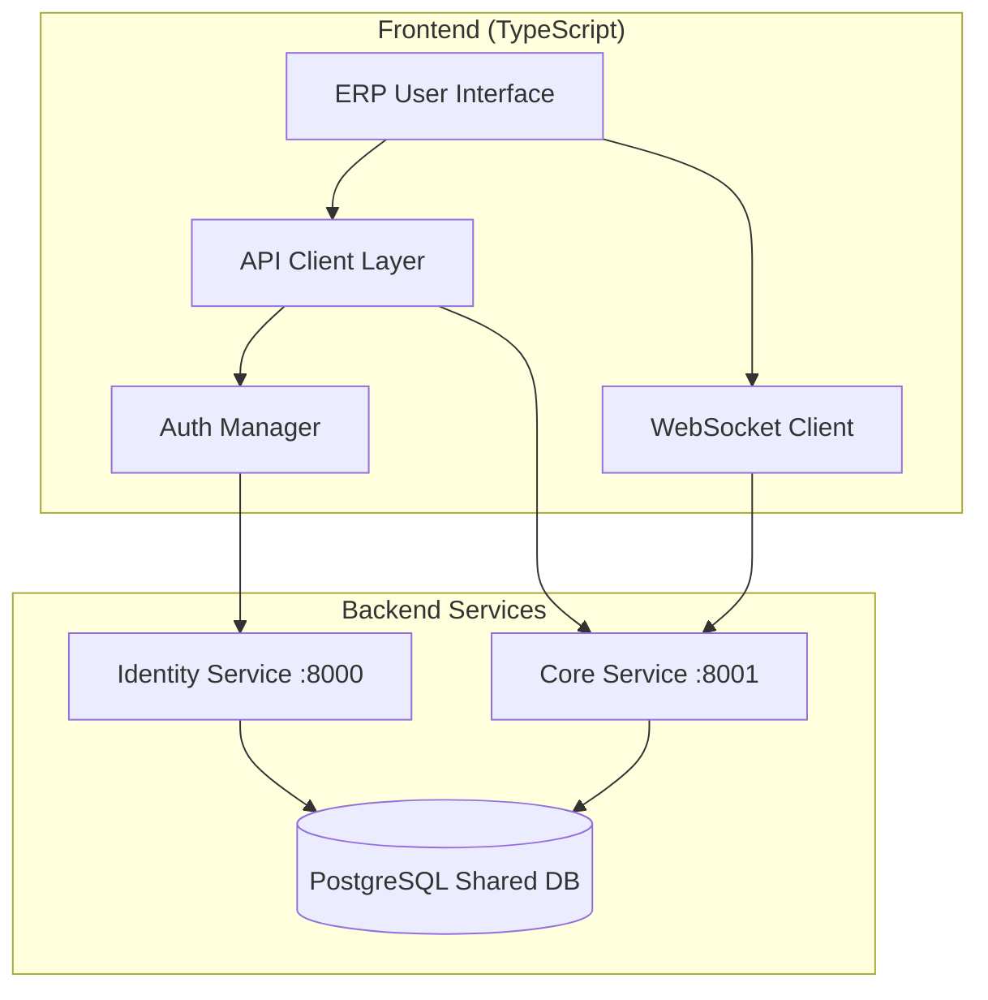

# Backend Integration Analysis: ERP User Journeys

## Overview

This document analyzes the existing backend services (Identity Service and Core Service) and identifies the integration work needed to implement the ERP User Journeys specification. The backend infrastructure is already comprehensive, with most ERP modules implemented as APIs.

## Existing Backend Services

### Identity Service (Port 8000)

**Status: ✅ Complete and Production Ready**

**Base URL:** `http://localhost:8000/api/v1/identity`

**Available Endpoints:**

- `POST /register` - User registration
- `POST /login` - User authentication
- `POST /refresh` - Token refresh
- `POST /logout` - User logout
- `GET /users` - List users (paginated)
- Organization, Role, and Permission management

**Features:**

- JWT-based authentication (access + refresh tokens)
- Role-Based Access Control (RBAC)
- Multi-tenancy with organizations
- Account locking after failed attempts
- PostgreSQL database with shared access

### Core Service (Port 8001)

**Status: ✅ Comprehensive API Implementation**

**Base URL:** `http://localhost:8001/api/v1`

**Available Modules:**

- **Items Management:** `/items`, `/item-groups`, `/item-prices`
- **Customer Management:** `/customers`
- **Supplier Management:** `/suppliers`
- **Warehouse Management:** `/warehouses`
- **Stock Management:** `/stock-entries`, `/stock-levels`, `/stock-movements`, `/stock-reconciliations`
- **Batch Management:** `/batches`, `/serial-numbers`
- **Delivery Management:** `/delivery-notes`, `/pick-lists`
- **Invoice Management:** `/invoices`, `/payments`, `/journal-entries`
- **Purchase Management:** `/purchase-receipts`
- **Quality Management:** `/quality-inspections`
- **Financial Management:** `/chart-of-accounts`, `/landed-cost`
- **Warehouse Operations:** `/put-away-rules`, `/stock-settings`

**Authentication:** All endpoints require JWT tokens from Identity Service

## ERP User Journey Requirements Mapping

### ✅ Fully Supported by Backend

| Requirement              | Backend Support | API Endpoints                                         |
| ------------------------ | --------------- | ----------------------------------------------------- |
| **Item Management**      | Complete        | `/items`, `/item-groups`, `/item-prices`              |
| **Customer Management**  | Complete        | `/customers`                                          |
| **Warehouse Management** | Complete        | `/warehouses`                                         |
| **Supplier Management**  | Complete        | `/suppliers`                                          |
| **Batch Management**     | Complete        | `/batches`, `/serial-numbers`                         |
| **Delivery Management**  | Complete        | `/delivery-notes`, `/pick-lists`                      |
| **Invoice Management**   | Complete        | `/invoices`, `/payments`                              |
| **Stock Management**     | Complete        | `/stock-entries`, `/stock-levels`, `/stock-movements` |

### 🔄 Needs Integration Enhancement

| Requirement             | Gap                 | Integration Needed                         |
| ----------------------- | ------------------- | ------------------------------------------ |
| **Universal Search**    | Cross-module search | Frontend aggregation of multiple API calls |
| **Real-time Updates**   | WebSocket support   | Add WebSocket layer for live updates       |
| **Bulk Operations**     | Limited bulk APIs   | Add bulk endpoints or frontend batching    |
| **Advanced Analytics**  | Basic reporting     | Enhanced dashboard APIs                    |
| **Workflow Automation** | Manual processes    | Add automated triggers                     |

## Integration Architecture



## Required Integration Tasks

### Phase 1: API Client Foundation

- [ ] Create TypeScript API client for Identity Service
- [ ] Create TypeScript API client for Core Service
- [ ] Implement JWT token management and refresh logic
- [ ] Add API error handling and retry mechanisms
- [ ] Create TypeScript types matching backend schemas

### Phase 2: Authentication Integration

- [ ] Implement login/logout flows using Identity Service
- [ ] Add role-based UI component rendering
- [ ] Create protected route guards
- [ ] Add organization context management
- [ ] Implement token persistence and refresh

### Phase 3: Core Module Integration

- [ ] Connect Item Management UI to `/items` APIs
- [ ] Connect Customer Management UI to `/customers` APIs
- [ ] Connect Warehouse Management UI to `/warehouses` APIs
- [ ] Connect Stock Management UI to stock APIs
- [ ] Connect all other modules to respective APIs

### Phase 4: Enhanced Features

- [ ] Implement cross-module search aggregation
- [ ] Add real-time stock level updates
- [ ] Create dashboard with KPI calculations
- [ ] Add bulk operation support
- [ ] Implement data export/import features

### Phase 5: Business Logic Integration

- [ ] Add FIFO/LIFO batch rotation in UI
- [ ] Implement credit limit warnings
- [ ] Add reorder point alerts
- [ ] Create automated workflow triggers
- [ ] Add advanced reporting features

## API Integration Examples

### Authentication Flow

```typescript
// Login using Identity Service
const loginResponse = await identityApi.post("/login", {
  email: "user@example.com",
  password: "password",
});

// Use token for Core Service requests
const itemsResponse = await coreApi.get("/items", {
  headers: {
    Authorization: `Bearer ${loginResponse.data.access_token}`,
  },
});
```

### Item Management Integration

```typescript
// Create item using existing Core Service API
const createItem = async (itemData: ItemCreate) => {
  return await coreApi.post("/items", itemData);
};

// List items with filters
const listItems = async (filters: ItemFilters) => {
  return await coreApi.get("/items", { params: filters });
};
```

### Stock Management Integration

```typescript
// Get real-time stock levels
const getStockLevels = async (itemId: string) => {
  return await coreApi.get(`/stock-levels?item_id=${itemId}`);
};

// Create stock movement
const createStockMovement = async (movement: StockMovementCreate) => {
  return await coreApi.post("/stock-movements", movement);
};
```

## Backend Enhancement Recommendations

### Immediate Enhancements Needed

1. **Cross-Module Search Endpoint**

   ```python
   @router.get("/search")
   async def unified_search(query: str, modules: List[str] = None):
       # Search across items, customers, suppliers, etc.
   ```

2. **WebSocket Support for Real-time Updates**

   ```python
   @app.websocket("/ws/stock-updates")
   async def stock_updates_websocket(websocket: WebSocket):
       # Send real-time stock level changes
   ```

3. **Bulk Operations Endpoints**

   ```python
   @router.post("/items/bulk")
   async def bulk_create_items(items: List[ItemCreate]):
       # Create multiple items in one request
   ```

4. **Dashboard Analytics Endpoint**
   ```python
   @router.get("/dashboard/kpis")
   async def get_dashboard_kpis():
       # Return calculated KPIs for dashboard
   ```

### Optional Enhancements

1. **Advanced Reporting APIs**
2. **Data Import/Export Endpoints**
3. **Workflow Automation Triggers**
4. **Performance Optimization**
5. **Caching Layer**

## Testing Strategy

### API Integration Testing

- [ ] Test authentication flow with Identity Service
- [ ] Test all Core Service endpoints with proper authentication
- [ ] Test error handling and token refresh
- [ ] Test concurrent user scenarios
- [ ] Test data consistency across services

### End-to-End Testing

- [ ] Test complete user journeys (login → create item → manage stock)
- [ ] Test cross-module workflows (item → stock → delivery → invoice)
- [ ] Test real-time updates and notifications
- [ ] Test bulk operations and data import/export

## Deployment Considerations

### Development Environment

- Identity Service: `http://localhost:8000`
- Core Service: `http://localhost:8001`
- Frontend: `http://localhost:3000`

### Production Environment

- Use environment variables for API URLs
- Implement proper CORS configuration
- Add API rate limiting and monitoring
- Use HTTPS for all communications
- Implement proper error logging

## Conclusion

The existing backend services provide a solid foundation for the ERP User Journeys. The main work involves:

1. **Frontend Development** (80% of effort) - Building the user interface that consumes existing APIs
2. **API Integration** (15% of effort) - Creating the client layer and authentication
3. **Backend Enhancements** (5% of effort) - Adding specific features for better user experience

The backend is already production-ready and comprehensive. The focus should be on creating an excellent frontend user experience that leverages these existing services effectively.
