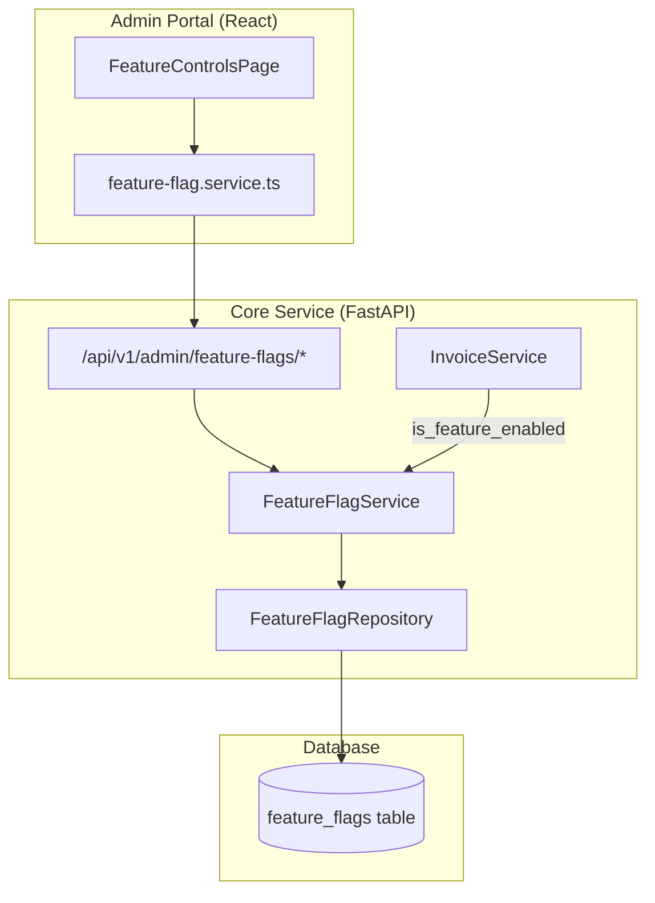

# Design Document: Feature Flag System

## Overview

The Feature Flag System provides runtime feature toggling for Horizon Sync ERP without redeployment. The MVP supports GLOBAL-scoped flags only, with a simple enabled/disabled evaluation model. The schema is designed for future extensibility (tenant, user, rollout percentage) but MVP evaluation logic only considers GLOBAL flags.

The system follows the existing codebase architecture:
- Backend: FastAPI + SQLAlchemy (repository → service → endpoint)
- Frontend: React/TypeScript admin portal page
- Database: PostgreSQL via Alembic migration

Key design decisions:
1. No caching — direct DB lookup on every evaluation (acceptable for MVP demo load)
2. No pagination — all flags returned in a single list (expected <100 flags for MVP)
3. No permission gating — admin-only access via `require_admin` dependency (RBAC deferred)
4. Safe defaults — any evaluation failure returns `false` (disabled)

## Architecture



### Request Flow

1. Admin UI calls `/api/v1/admin/feature-flags` endpoints for CRUD
2. Any backend service calls `is_feature_enabled(name, db)` for evaluation
3. Frontend can call `GET /api/v1/admin/feature-flags/evaluate/{feature_name}` for client-side gating
4. All evaluation failures default to `false` (disabled)

## Components and Interfaces

### 1. Alembic Migration (`040_add_feature_flags_table.py`)

Creates the `feature_flags` table with:
- UUID primary key
- Unique constraint on `(name, scope, tenant_id, user_id)`
- Index on `name` for fast evaluation lookups
- Default scope = `'GLOBAL'`, tenant_id/user_id nullable (reserved for future)

### 2. SQLAlchemy Model (`app/models/feature_flag.py`)

```python
class FeatureFlag(Base):
    __tablename__ = "feature_flags"

    id: UUID (PK, default uuid4)
    name: str (unique within scope combo, max 255)
    description: str | None
    enabled: bool (default False)
    scope: str (default "GLOBAL")  # GLOBAL | TENANT | USER
    tenant_id: UUID | None
    user_id: UUID | None
    rollout_percentage: int | None (0-100)
    created_at: datetime
    updated_at: datetime
```

### 3. Pydantic Schemas (`app/schemas/feature_flag.py`)

| Schema | Purpose |
|--------|---------|
| `FeatureFlagCreate` | Create request: `name`, `description?`, `enabled?` |
| `FeatureFlagUpdate` | Partial update: `name?`, `description?`, `enabled?` |
| `FeatureFlagResponse` | Full flag response with all fields |
| `FeatureFlagListResponse` | List wrapper: `flags: list[FeatureFlagResponse]` |
| `FeatureFlagEvaluation` | Evaluation result: `feature_name`, `enabled` |

### 4. Repository (`app/repositories/feature_flag_repository.py`)

| Method | Signature | Description |
|--------|-----------|-------------|
| `create` | `(data: dict) -> FeatureFlag` | Insert new flag |
| `get_by_id` | `(flag_id: UUID) -> FeatureFlag \| None` | Lookup by PK |
| `get_by_name` | `(name: str, scope: str = "GLOBAL") -> FeatureFlag \| None` | Lookup by name+scope |
| `list_all` | `() -> list[FeatureFlag]` | Return all flags |
| `update` | `(flag: FeatureFlag, data: dict) -> FeatureFlag` | Partial update |
| `delete` | `(flag: FeatureFlag) -> None` | Hard delete |
| `name_exists` | `(name: str, exclude_id: UUID \| None) -> bool` | Duplicate check |

### 5. Service (`app/services/feature_flag_service.py`)

| Method | Signature | Description |
|--------|-----------|-------------|
| `create_flag` | `(data: FeatureFlagCreate) -> FeatureFlagResponse` | Create GLOBAL flag, 409 on duplicate |
| `get_flag` | `(flag_id: UUID) -> FeatureFlagResponse` | Get by ID, 404 if missing |
| `list_flags` | `() -> FeatureFlagListResponse` | List all flags |
| `update_flag` | `(flag_id: UUID, data: FeatureFlagUpdate) -> FeatureFlagResponse` | Update, 404 if missing |
| `delete_flag` | `(flag_id: UUID) -> None` | Delete, 404 if missing |
| `evaluate` | `(feature_name: str) -> FeatureFlagEvaluation` | Evaluate GLOBAL flag |

**Standalone helper** (module-level function):

```python
def is_feature_enabled(feature_name: str, db: Session) -> bool:
    """Check if a GLOBAL feature flag is enabled. Returns False on any error."""
```

### 6. API Endpoints (`app/api/v1/endpoints/admin/feature_flags.py`)

All endpoints require `require_admin` dependency (system_admin user_type).

| Method | Path | Description | Status |
|--------|------|-------------|--------|
| `POST` | `/admin/feature-flags` | Create flag | 201 |
| `GET` | `/admin/feature-flags` | List all flags | 200 |
| `GET` | `/admin/feature-flags/{flag_id}` | Get by ID | 200 |
| `PATCH` | `/admin/feature-flags/{flag_id}` | Update flag | 200 |
| `DELETE` | `/admin/feature-flags/{flag_id}` | Delete flag | 204 |
| `GET` | `/admin/feature-flags/evaluate/{feature_name}` | Evaluate flag | 200 |

### 7. Admin Router Registration (`app/api/v1/endpoints/admin/__init__.py`)

Add to the admin `__init__.py`:
```python
from app.api.v1.endpoints.admin.feature_flags import router as feature_flags_router
router.include_router(feature_flags_router, prefix="/feature-flags", tags=["Admin - Feature Flags"])
```

### 8. Frontend Components

| Component | Location | Description |
|-----------|----------|-------------|
| `FeatureControlsPage` | `apps/admin/src/app/pages/FeatureControlsPage.tsx` | Main page with flag table + create form |
| `feature-flag.service.ts` | `apps/admin/src/app/services/feature-flag.service.ts` | API service class |

The page is added as a new route at `/feature-controls` and a new sidebar nav item "Feature Controls" is placed in the `bottomNavItems` array after "Admin Users" (which maps to the Roles/Permissions section).

### 9. Invoice Flow Integration

In `InvoiceService.update()`, wrap the auto-journal-posting logic:

```python
from app.services.feature_flag_service import is_feature_enabled

if requires_journal_entry:
    if is_feature_enabled("invoice_auto_journal_posting", self.db):
        # existing journal posting logic
    else:
        logger.info("Skipping auto journal posting — feature flag disabled")
```

## Data Models

### feature_flags Table

```sql
CREATE TABLE feature_flags (
    id UUID PRIMARY KEY DEFAULT gen_random_uuid(),
    name VARCHAR(255) NOT NULL,
    description TEXT,
    enabled BOOLEAN NOT NULL DEFAULT FALSE,
    scope VARCHAR(20) NOT NULL DEFAULT 'GLOBAL',
    tenant_id UUID,
    user_id UUID,
    rollout_percentage INTEGER CHECK (rollout_percentage >= 0 AND rollout_percentage <= 100),
    created_at TIMESTAMPTZ NOT NULL DEFAULT NOW(),
    updated_at TIMESTAMPTZ NOT NULL DEFAULT NOW(),
    CONSTRAINT uq_feature_flag_scope UNIQUE (name, scope, tenant_id, user_id)
);

CREATE INDEX ix_feature_flags_name ON feature_flags (name);
CREATE INDEX ix_feature_flags_scope ON feature_flags (scope);
```

### Pydantic Models

```python
class FeatureFlagCreate(BaseModel):
    name: str = Field(..., min_length=1, max_length=255, pattern=r"^[a-z0-9_]+$")
    description: str | None = Field(None, max_length=1000)
    enabled: bool = Field(default=False)

class FeatureFlagUpdate(BaseModel):
    name: str | None = Field(None, min_length=1, max_length=255, pattern=r"^[a-z0-9_]+$")
    description: str | None = None
    enabled: bool | None = None

class FeatureFlagResponse(BaseModel):
    id: UUID
    name: str
    description: str | None
    enabled: bool
    scope: str
    tenant_id: UUID | None
    user_id: UUID | None
    rollout_percentage: int | None
    created_at: datetime
    updated_at: datetime

class FeatureFlagListResponse(BaseModel):
    flags: list[FeatureFlagResponse]

class FeatureFlagEvaluation(BaseModel):
    feature_name: str
    enabled: bool
```


## Correctness Properties

*A property is a characteristic or behavior that should hold true across all valid executions of a system — essentially, a formal statement about what the system should do. Properties serve as the bridge between human-readable specifications and machine-verifiable correctness guarantees.*

### Property 1: Create–Read Round Trip

*For any* valid feature flag create payload (name, description, enabled), creating the flag and then retrieving it by ID should return a flag whose name, description, and enabled fields match the input, and whose scope is `"GLOBAL"`, tenant_id is `None`, and user_id is `None`.

**Validates: Requirements 1.3, 2.1, 2.7**

### Property 2: Duplicate Name Rejection

*For any* feature flag name that already exists as a GLOBAL flag, attempting to create another flag with the same name should be rejected (conflict), and the total number of flags should remain unchanged.

**Validates: Requirements 1.2, 2.2**

### Property 3: Update Preserves Changes

*For any* existing feature flag and any valid partial update payload, after updating, the flag's fields should reflect the updated values for provided fields and retain original values for omitted fields.

**Validates: Requirements 2.3**

### Property 4: Delete Removes Flag

*For any* existing feature flag, after deletion, retrieving that flag by ID should return not found, and the flag should not appear in the list of all flags.

**Validates: Requirements 2.4**

### Property 5: List Completeness

*For any* set of N created feature flags, listing all flags should return exactly N flags, and every created flag's name should appear in the list.

**Validates: Requirements 2.6**

### Property 6: Evaluation Returns Enabled Value

*For any* existing GLOBAL feature flag, evaluating that flag by name should return the flag's current `enabled` value (true or false).

**Validates: Requirements 3.1, 3.3, 4.1, 5.1, 5.2, 9.1**

### Property 7: Missing Flag Evaluates to Disabled

*For any* feature name that does not correspond to an existing GLOBAL flag, evaluation should return `false` (disabled).

**Validates: Requirements 3.2, 4.2, 9.2**

## Error Handling

| Scenario | Behavior | HTTP Status |
|----------|----------|-------------|
| Create with duplicate name | Return error with descriptive message | 409 Conflict |
| Get/Update/Delete non-existent flag | Return "not found" error | 404 Not Found |
| Evaluate non-existent flag | Return `{ feature_name, enabled: false }` | 200 OK |
| DB error during evaluation | Return `false`, log at ERROR level | 200 OK (via helper) |
| DB error during CRUD | Let FastAPI exception handler return 500 | 500 Internal Server Error |
| Invalid create payload (empty name, bad pattern) | Pydantic validation error | 422 Unprocessable Entity |
| Non-admin user accesses endpoints | `require_admin` dependency rejects | 403 Forbidden |

The `is_feature_enabled` helper wraps all exceptions in a try/except and returns `False` as the safe default, logging the error at ERROR level. This ensures that a feature flag system failure never breaks the gated feature — it simply disables it.

## Testing Strategy

### Unit Tests (Example-Based)

Located at `horizon-sync-erp-be/core-service/tests/test_feature_flag_service.py`:

1. **Create flag** — verify returned data matches input, scope defaults
2. **Duplicate name** — verify 409 on second create with same name
3. **Update flag** — verify partial update works correctly
4. **Delete flag** — verify flag is removed
5. **Evaluate existing flag** — verify returns correct enabled value
6. **Evaluate missing flag** — verify returns false
7. **Evaluate on DB error** — mock DB exception, verify returns false and logs error
8. **Invoice integration** — mock `is_feature_enabled`, verify journal posting is gated

### Property-Based Tests

Library: **Hypothesis** (Python property-based testing)

Located at `horizon-sync-erp-be/core-service/tests/test_feature_flag_properties.py`:

Each property test runs a minimum of 100 iterations and is tagged with the corresponding design property.

| Test | Property | Tag |
|------|----------|-----|
| `test_create_read_round_trip` | Property 1 | `Feature: feature-flag-system, Property 1: Create–Read Round Trip` |
| `test_duplicate_name_rejection` | Property 2 | `Feature: feature-flag-system, Property 2: Duplicate Name Rejection` |
| `test_update_preserves_changes` | Property 3 | `Feature: feature-flag-system, Property 3: Update Preserves Changes` |
| `test_delete_removes_flag` | Property 4 | `Feature: feature-flag-system, Property 4: Delete Removes Flag` |
| `test_list_completeness` | Property 5 | `Feature: feature-flag-system, Property 5: List Completeness` |
| `test_evaluation_returns_enabled` | Property 6 | `Feature: feature-flag-system, Property 6: Evaluation Returns Enabled Value` |
| `test_missing_flag_evaluates_disabled` | Property 7 | `Feature: feature-flag-system, Property 7: Missing Flag Evaluates to Disabled` |

**Generators:**
- Flag names: `st.from_regex(r"[a-z][a-z0-9_]{0,49}", fullmatch=True)` — lowercase snake_case strings
- Descriptions: `st.text(max_size=200) | st.none()`
- Enabled: `st.booleans()`
- Update payloads: `st.fixed_dictionaries()` with optional fields

### Frontend Tests

Located at `horizon-sync/apps/admin/src/app/pages/FeatureControlsPage.test.tsx`:

1. Renders flag table with correct columns
2. Toggle calls API and updates UI
3. Create form submits correctly
4. API error displays toast notification
