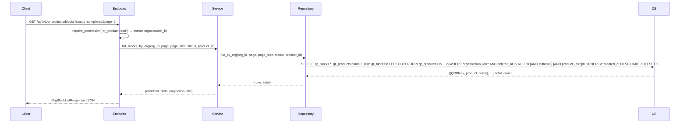

# Design Document: org-level-qr-blocks

## Overview

This feature adds `GET /api/v1/qr-products/blocks` to `core-service` — an org-scoped endpoint that returns all QR blocks across every product belonging to the authenticated user's organization. It supports optional filtering by `status` and `product_id`, standard pagination, and enriches each block with its parent product's `name` field via a SQL JOIN.

The endpoint is a read-only query extension. No new database tables or migrations are required. The implementation follows the existing repository/service/schema/endpoint layering used throughout `core-service`.

### Route Ordering Constraint

FastAPI matches routes in registration order. The new `/blocks` literal path **must** be registered before `/{product_id}/blocks` in the router, otherwise the string `"blocks"` is captured as a UUID `product_id` and the request fails with HTTP 422.

---

## Architecture

The feature follows the existing four-layer architecture:

```
HTTP Request
    │
    ▼
Endpoint (qr_products.py)
    │  validates query params, extracts org from JWT
    ▼
Service (QRProductService.list_blocks_by_org)
    │  builds pagination dict, assembles enriched dicts
    ▼
Repository (QRBlockRepository.list_by_org)
    │  SQL: JOIN qr_products, filter, paginate
    ▼
Database (qr_blocks + qr_products tables)
```

No new files are created. All changes are additive to existing files.



---

## Components and Interfaces

### 1. Repository — `QRBlockRepository.list_by_org`

**File**: `core-service/app/repositories/qr_product_repository.py`

New method on the existing `QRBlockRepository` class:

```python
def list_by_org(
    self,
    organization_id: UUID,
    page: int,
    page_size: int,
    status: str | None,
    product_id: UUID | None,
) -> tuple[list[tuple[QRBlock, str | None]], int]:
```

- Performs a `LEFT OUTER JOIN` on `QRProduct` to retrieve `QRProduct.name` alongside each `QRBlock`.
- Mandatory filters: `QRBlock.organization_id == organization_id` and `QRBlock.deleted_at.is_(None)`.
- Optional filters: `QRBlock.status == status` (when provided), `QRBlock.product_id == product_id` (when provided).
- Ordering: `QRBlock.created_at DESC`.
- Returns a list of `(QRBlock, product_name_or_None)` tuples and the total filtered count.

The `outerjoin` (not inner join) is used so that blocks whose parent product has been soft-deleted still appear in results — the block itself is not deleted, and `product_name` will be `None` in that edge case.

### 2. Service — `QRProductService.list_blocks_by_org`

**File**: `core-service/app/services/qr_product_service.py`

New method on the existing `QRProductService` class:

```python
def list_blocks_by_org(
    self,
    organization_id: UUID,
    page: int,
    page_size: int,
    status: str | None,
    product_id: UUID | None,
) -> tuple[list[dict], dict]:
```

- Calls `self.block_repo.list_by_org(...)`.
- Builds the standard pagination dict: `{ page, page_size, total_items, total_pages, has_next, has_prev }`.
- Converts each `(QRBlock, product_name)` tuple into a flat dict by merging the block's `__dict__` with `product_name`.
- Returns `(enriched_block_dicts, pagination)`.

### 3. Schemas — `OrgBlockListItem` and `OrgBlockListResponse`

**File**: `core-service/app/schemas/qr_product.py`

```python
class OrgBlockListItem(BaseModel):
    id: UUID
    organization_id: UUID
    product_id: UUID
    product_name: str | None
    batch: str
    quantity: int
    serial_prefix: str | None
    sr_number_type: str | None
    status: str | None
    task_status: str | None
    task_id: str | None
    qr_image: bool
    manufacture_date: date | None
    expiry_date: date | None
    gcs_url: str | None
    download_url: str | None
    completed_at: datetime | None
    created_at: datetime

    model_config = {"from_attributes": True}


class OrgBlockListResponse(BaseModel):
    blocks: list[OrgBlockListItem]
    pagination: dict[str, Any]
```

`OrgBlockListItem` extends the fields of `QRBlockResponse` with `status`, `task_id`, `download_url`, `completed_at`, and the new `product_name` field.

### 4. Endpoint — `list_org_qr_blocks`

**File**: `core-service/app/api/v1/endpoints/qr_products.py`

```python
@router.get(
    "/blocks",
    response_model=OrgBlockListResponse,
    summary="List all QR blocks for the organization",
)
async def list_org_qr_blocks(
    page: int = Query(1, ge=1),
    page_size: int = Query(20, ge=1, le=100),
    status: Literal["pending", "in_progress", "completed", "failed"] | None = Query(None),
    product_id: UUID | None = Query(None),
    current_user: CurrentUser = Depends(require_permission("qr_product.read")),
    db: Session = Depends(get_db),
):
```

- Registered **before** `/{product_id}/blocks` in the router file.
- `status` uses `Literal[...]` so FastAPI/Pydantic automatically returns HTTP 422 for unrecognized values.
- `organization_id` is always taken from `current_user.organization_id` — never from query params.

---

## Data Models

No new database tables or Alembic migrations are needed. The feature queries two existing tables:

### `qr_blocks`

| Column           | Type                  | Notes                                      |
| ---------------- | --------------------- | ------------------------------------------ |
| id               | UUID PK               |                                            |
| organization_id  | UUID NOT NULL         | Tenant isolation key                       |
| product_id       | UUID FK → qr_products | Optional filter target                     |
| batch            | VARCHAR(50)           |                                            |
| quantity         | INTEGER               |                                            |
| serial_prefix    | VARCHAR(20)           |                                            |
| sr_number_type   | VARCHAR(256)          |                                            |
| status           | VARCHAR(20)           | pending / in_progress / completed / failed |
| task_status      | VARCHAR(20)           |                                            |
| task_id          | VARCHAR(255)          |                                            |
| qr_image         | BOOLEAN               |                                            |
| manufacture_date | DATE                  |                                            |
| expiry_date      | DATE                  |                                            |
| gcs_url          | TEXT                  |                                            |
| download_url     | TEXT                  | Populated on completion                    |
| completed_at     | TIMESTAMPTZ           |                                            |
| created_at       | TIMESTAMPTZ           | Used for ordering                          |
| deleted_at       | TIMESTAMPTZ           | NULL = active; non-NULL = soft-deleted     |

### `qr_products` (joined, read-only)

| Column | Type         | Notes                      |
| ------ | ------------ | -------------------------- |
| id     | UUID PK      | JOIN key                   |
| name   | VARCHAR(100) | Returned as `product_name` |

### JOIN Strategy

```sql
SELECT qr_blocks.*, qr_products.name AS product_name
FROM qr_blocks
LEFT OUTER JOIN qr_products ON qr_blocks.product_id = qr_products.id
WHERE qr_blocks.organization_id = :org_id
  AND qr_blocks.deleted_at IS NULL
  [AND qr_blocks.status = :status]
  [AND qr_blocks.product_id = :product_id]
ORDER BY qr_blocks.created_at DESC
LIMIT :page_size OFFSET :offset
```

`LEFT OUTER JOIN` is used (not `INNER JOIN`) so that blocks whose parent product has been soft-deleted are still returned — the block itself is not deleted. In that case `product_name` will be `None`.

Note: the `product_id` filter combined with `organization_id` on `qr_blocks` is sufficient for org isolation — a product from another org cannot match because `qr_blocks.organization_id` is always checked independently.

---

## Correctness Properties

_A property is a characteristic or behavior that should hold true across all valid executions of a system — essentially, a formal statement about what the system should do. Properties serve as the bridge between human-readable specifications and machine-verifiable correctness guarantees._

### Property 1: Org Isolation

_For any_ two distinct organizations A and B, and any valid request authenticated as organization A, all blocks in the response must have `organization_id` equal to A's `organization_id` — no block belonging to organization B is ever returned, even when a `product_id` filter is also applied.

**Validates: Requirements 1.3, 5.1, 5.2, 5.3**

---

### Property 2: Status Filter Correctness

_For any_ valid `status` value (`pending`, `in_progress`, `completed`, `failed`) and any organization, when the `status` query parameter is supplied, every block in the response must have a `status` field equal to the supplied value.

**Validates: Requirements 2.2**

---

### Property 3: Product Filter Correctness

_For any_ `product_id` UUID and any organization, when the `product_id` query parameter is supplied, every block in the response must have a `product_id` field equal to the supplied value.

**Validates: Requirements 3.2**

---

### Property 4: Pagination Accuracy

_For any_ organization, page number, page size, and combination of filters, `pagination.total_items` must equal the actual count of non-deleted blocks matching those filters, `total_pages` must equal `max(1, ceil(total_items / page_size))`, `has_next` must be `true` if and only if `page < total_pages`, and `has_prev` must be `true` if and only if `page > 1`.

**Validates: Requirements 4.2, 4.3, 4.4, 4.5**

---

### Property 5: Soft-Delete Exclusion

_For any_ organization and any mix of deleted and non-deleted blocks in the database, no block with a non-null `deleted_at` value is ever present in the response, regardless of filters or pagination parameters.

**Validates: Requirements 1.6, 6.1, 6.2**

---

### Property 6: Product Name Enrichment

_For any_ block returned in the response, the `product_name` field must equal the `name` column of the associated `QRProduct` record. When the associated product has been soft-deleted (its own `deleted_at` is non-null), `product_name` must still be populated from the product record rather than being omitted.

**Validates: Requirements 1.7, 7.2, 7.3**

---

### Property 7: Result Ordering

_For any_ organization and any combination of filters, the returned `blocks` array must be ordered by `created_at` descending — each block's `created_at` must be greater than or equal to the `created_at` of the block that follows it.

**Validates: Requirements 1.5**

---

### Property 8: Response Schema Completeness

_For any_ block returned in the response, the serialized object must contain all required fields: `id`, `organization_id`, `product_id`, `product_name`, `batch`, `quantity`, `sr_number_type`, `status`, `task_status`, `task_id`, `qr_image`, `manufacture_date`, `expiry_date`, `gcs_url`, `download_url`, `completed_at`, and `created_at`.

**Validates: Requirements 7.1**

---

## Error Handling

| Scenario                                     | HTTP Status | Detail                                        |
| -------------------------------------------- | ----------- | --------------------------------------------- |
| Missing or invalid JWT                       | 401         | Handled by auth middleware                    |
| JWT lacks `qr_product.read` permission       | 403         | `require_permission` dependency               |
| `status` query param has unrecognized value  | 422         | FastAPI/Pydantic `Literal` validation         |
| `product_id` query param is not a valid UUID | 422         | FastAPI UUID parsing                          |
| `page` < 1 or `page_size` outside 1–100      | 422         | FastAPI `Query(ge=1)` / `Query(le=100)`       |
| `product_id` belongs to a different org      | 200         | Empty `blocks` array (org isolation, not 404) |
| `page` exceeds `total_pages`                 | 200         | Empty `blocks` array with accurate pagination |

No new exception classes are needed. All error cases are handled by existing FastAPI validation or the `require_permission` dependency.

---

## Testing Strategy

### Unit Tests

Unit tests cover specific examples and edge cases:

- `QRBlockRepository.list_by_org` returns only blocks for the given `organization_id`.
- `QRBlockRepository.list_by_org` excludes blocks where `deleted_at IS NOT NULL`.
- `QRBlockRepository.list_by_org` with `status="completed"` returns only completed blocks.
- `QRBlockRepository.list_by_org` with a `product_id` from a different org returns empty list.
- `QRProductService.list_blocks_by_org` builds correct pagination dict (especially `total_pages=1` when `total_items=0`).
- `OrgBlockListItem` schema correctly serializes `product_name=None` when product is soft-deleted.
- Endpoint returns HTTP 422 for `status="invalid_value"`.
- Endpoint returns HTTP 403 when permission is missing.

### Property-Based Tests

Property tests use [Hypothesis](https://hypothesis.readthedocs.io/) to verify universal properties across randomly generated inputs. Each test runs a minimum of 100 iterations.

**Library**: `hypothesis` with `hypothesis.strategies`

**Tag format**: `# Feature: org-level-qr-blocks, Property {N}: {property_text}`

#### Property 1 — Org Isolation

```
# Feature: org-level-qr-blocks, Property 1: org isolation
# For any two orgs, blocks returned for org A never contain org B's blocks.
@given(
    org_a_id=st.uuids(),
    org_b_id=st.uuids().filter(lambda x: x != org_a_id),
    blocks=st.lists(st.builds(...), min_size=0, max_size=20),
)
def test_org_isolation(org_a_id, org_b_id, blocks): ...
```

#### Property 2 — Status Filter Correctness

```
# Feature: org-level-qr-blocks, Property 2: status filter correctness
# For any status value and org, all returned blocks match that status.
@given(
    status=st.sampled_from(["pending", "in_progress", "completed", "failed"]),
    blocks=st.lists(st.builds(...), min_size=0, max_size=20),
)
def test_status_filter_correctness(status, blocks): ...
```

#### Property 3 — Product Filter Correctness

```
# Feature: org-level-qr-blocks, Property 3: product filter correctness
# For any product_id, all returned blocks have that product_id.
@given(
    product_id=st.uuids(),
    blocks=st.lists(st.builds(...), min_size=0, max_size=20),
)
def test_product_filter_correctness(product_id, blocks): ...
```

#### Property 4 — Pagination Accuracy

```
# Feature: org-level-qr-blocks, Property 4: pagination accuracy
# For any page/page_size, total_items equals filtered count and has_next/has_prev are consistent.
@given(
    total=st.integers(min_value=0, max_value=500),
    page=st.integers(min_value=1, max_value=50),
    page_size=st.integers(min_value=1, max_value=100),
)
def test_pagination_accuracy(total, page, page_size): ...
```

#### Property 5 — Soft-Delete Exclusion

```
# Feature: org-level-qr-blocks, Property 5: soft-delete exclusion
# For any org and any mix of deleted/non-deleted blocks, no deleted block appears in results.
@given(
    blocks=st.lists(st.builds(...), min_size=0, max_size=20),
)
def test_soft_delete_exclusion(blocks): ...
```

#### Property 6 — Product Name Enrichment

```
# Feature: org-level-qr-blocks, Property 6: product name enrichment
# For any block, product_name in the response equals the associated QRProduct.name.
@given(
    blocks_with_products=st.lists(st.tuples(st.builds(...), st.text()), min_size=0, max_size=20),
)
def test_product_name_enrichment(blocks_with_products): ...
```

#### Property 7 — Result Ordering

```
# Feature: org-level-qr-blocks, Property 7: result ordering
# For any org and filters, returned blocks are ordered by created_at DESC.
@given(
    blocks=st.lists(st.builds(...), min_size=0, max_size=20),
)
def test_result_ordering(blocks): ...
```

#### Property 8 — Response Schema Completeness

```
# Feature: org-level-qr-blocks, Property 8: response schema completeness
# For any block, the serialized response contains all required fields.
@given(
    block=st.builds(...),
    product_name=st.one_of(st.none(), st.text()),
)
def test_response_schema_completeness(block, product_name): ...
```

### Integration Tests

- Full round-trip: create blocks via `generate_block`, call `GET /api/v1/qr-products/blocks`, verify blocks appear.
- Route ordering: confirm `GET /api/v1/qr-products/blocks` does not conflict with `GET /api/v1/qr-products/{product_id}/blocks`.
- Cross-org: two users from different orgs each see only their own blocks.
