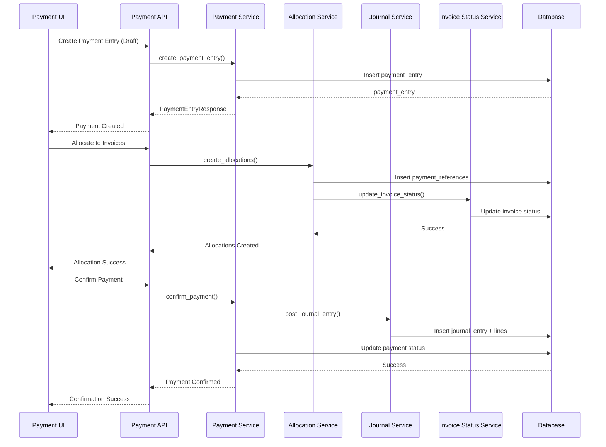

# Design Document: Payment Flow System

## Overview

The Payment Flow system implements a comprehensive payment management solution for an ERP application that treats money movements as separate entities from invoices. The system follows a two-phase approach where Phase 1 focuses on manual payment capture (Cash, Check, Bank Transfer), while Phase 2 will integrate third-party payment gateways (Stripe, Razorpay).

### Core Philosophy

The system separates "What is Owed" (Invoices) from "Money Received" (Payment Entries), linked through reconciliation. This separation provides:

- Clear audit trail of actual cash movements
- Flexible payment allocation across multiple invoices
- Support for partial payments and overpayments
- Foundation for gateway integration without architectural changes

### Key Features

- Manual payment entry with multiple payment modes (Cash, Check, Bank Transfer)
- Payment allocation to invoices with validation
- Automatic journal entry posting to general ledger
- Invoice status updates based on payment allocation
- Multi-currency support with exchange rate handling
- Comprehensive audit trail
- Payment receipt generation
- Batch payment processing
- Reconciliation reporting

### Integration Points

- Chart of Accounts: Uses default accounts for payment posting
- Journal Entries: Creates double-entry bookkeeping records
- Multi-tenancy: Organization-level isolation
- Audit Logging: Tracks all payment changes
- Currency Service: Handles exchange rate conversions
- Invoice System: Updates invoice payment status

## Architecture

### High-Level Architecture

```
┌─────────────────────────────────────────────────────────────────┐
│                         Frontend Layer                           │
│  ┌──────────────┐  ┌──────────────┐  ┌──────────────┐          │
│  │  Payment     │  │  Invoice     │  │  Receipt     │          │
│  │  Management  │  │  Linker      │  │  Viewer      │          │
│  └──────────────┘  └──────────────┘  └──────────────┘          │
└─────────────────────────────────────────────────────────────────┘
                              │
                              ▼
┌─────────────────────────────────────────────────────────────────┐
│                          API Layer                               │
│  ┌──────────────────────────────────────────────────────────┐  │
│  │  Payment API Endpoints (/api/v1/payments)                │  │
│  │  - CRUD operations                                        │  │
│  │  - Status transitions (confirm, cancel)                  │  │
│  │  - Allocation management                                 │  │
│  │  - Receipt generation                                    │  │
│  └──────────────────────────────────────────────────────────┘  │
└─────────────────────────────────────────────────────────────────┘
                              │
                              ▼
┌─────────────────────────────────────────────────────────────────┐
│                        Service Layer                             │
│  ┌──────────────┐  ┌──────────────┐  ┌──────────────┐          │
│  │  Payment     │  │  Allocation  │  │  Receipt     │          │
│  │  Service     │  │  Service     │  │  Service     │          │
│  └──────────────┘  └──────────────┘  └──────────────┘          │
│  ┌──────────────┐  ┌──────────────┐  ┌──────────────┐          │
│  │  Journal     │  │  Invoice     │  │  Batch       │          │
│  │  Posting     │  │  Status      │  │  Processor   │          │
│  │  Service     │  │  Service     │  │  Service     │          │
│  └──────────────┘  └──────────────┘  └──────────────┘          │
└─────────────────────────────────────────────────────────────────┘
                              │
                              ▼
┌─────────────────────────────────────────────────────────────────┐
│                      Repository Layer                            │
│  ┌──────────────┐  ┌──────────────┐  ┌──────────────┐          │
│  │  Payment     │  │  Payment     │  │  Invoice     │          │
│  │  Repository  │  │  Reference   │  │  Repository  │          │
│  │              │  │  Repository  │  │              │          │
│  └──────────────┘  └──────────────┘  └──────────────┘          │
└─────────────────────────────────────────────────────────────────┘
                              │
                              ▼
┌─────────────────────────────────────────────────────────────────┐
│                        Database Layer                            │
│  ┌──────────────┐  ┌──────────────┐  ┌──────────────┐          │
│  │  payment_    │  │  payment_    │  │  payment_    │          │
│  │  entries     │  │  references  │  │  audit_log   │          │
│  └──────────────┘  └──────────────┘  └──────────────┘          │
└─────────────────────────────────────────────────────────────────┘
```

### Component Interaction Flow



## Components and Interfaces

### Backend Components

#### 1. Payment Entry Model (`payment_entries` table)

**Purpose**: Core entity representing actual money received or paid

**Fields**:
- `id` (UUID): Primary key
- `organization_id` (UUID): Multi-tenancy isolation
- `payment_type` (Enum): "Customer_Payment" | "Supplier_Payment"
- `party_id` (UUID): Customer or Supplier ID
- `amount` (Decimal): Payment amount
- `currency_code` (String): ISO 4217 currency code
- `payment_date` (DateTime): Date of payment
- `payment_mode` (Enum): "Cash" | "Check" | "Bank_Transfer"
- `reference_no` (String): Check number or bank UTR
- `status` (Enum): "Draft" | "Confirmed" | "Cancelled"
- `source` (Enum): "Manual" | "Stripe" | "Razorpay"
- `gateway_transaction_id` (String): For gateway payments
- `receipt_number` (String): Generated on confirmation
- `unallocated_amount` (Decimal): Computed field
- `cancellation_reason` (Text): Reason for cancellation
- `cancelled_by` (UUID): User who cancelled
- `cancelled_at` (DateTime): Cancellation timestamp
- `created_by` (UUID): User who created
- `updated_by` (UUID): User who last updated
- `created_at` (DateTime): Creation timestamp
- `updated_at` (DateTime): Last update timestamp

**Indexes**:
- `organization_id, payment_date`
- `organization_id, party_id`
- `organization_id, status`
- `reference_no`
- `receipt_number`

**Constraints**:
- `amount > 0` (or `amount < 0` for refunds)
- `reference_no` required when `payment_mode` in ("Check", "Bank_Transfer")
- `gateway_transaction_id` required when `source` in ("Stripe", "Razorpay")


#### 2. Payment Reference Model (`payment_references` table)

**Purpose**: Links payments to invoices showing allocation amounts

**Fields**:
- `id` (UUID): Primary key
- `organization_id` (UUID): Multi-tenancy isolation
- `payment_id` (UUID): Foreign key to payment_entries
- `invoice_id` (UUID): Foreign key to invoices
- `allocated_amount` (Decimal): Amount allocated to this invoice
- `exchange_rate` (Decimal): Exchange rate if currencies differ
- `allocated_amount_invoice_currency` (Decimal): Amount in invoice currency
- `created_by` (UUID): User who created
- `created_at` (DateTime): Creation timestamp

**Indexes**:
- `payment_id`
- `invoice_id`
- `organization_id`

**Constraints**:
- `allocated_amount > 0`
- Unique constraint on `(payment_id, invoice_id)`

#### 3. Payment Audit Log Model (`payment_audit_log` table)

**Purpose**: Immutable audit trail of all payment changes

**Fields**:
- `id` (UUID): Primary key
- `organization_id` (UUID): Multi-tenancy isolation
- `payment_id` (UUID): Foreign key to payment_entries
- `action` (Enum): "CREATE" | "UPDATE" | "CONFIRM" | "CANCEL" | "ALLOCATE" | "DEALLOCATE"
- `user_id` (UUID): User who performed action
- `old_values` (JSONB): Previous values
- `new_values` (JSONB): New values
- `timestamp` (DateTime): When action occurred

**Indexes**:
- `payment_id, timestamp`
- `organization_id, timestamp`

#### 4. Payment Entry Service

**Purpose**: Business logic for payment entry operations

**Key Methods**:

```python
class PaymentEntryService:
    def create_payment_entry(
        self,
        data: PaymentEntryCreate,
        organization_id: UUID,
        user_id: UUID
    ) -> PaymentEntry:
        """Create a new payment entry in Draft status"""
        
    def update_payment_entry(
        self,
        payment_id: UUID,
        data: PaymentEntryUpdate,
        organization_id: UUID,
        user_id: UUID
    ) -> PaymentEntry:
        """Update a draft payment entry"""
        
    def confirm_payment(
        self,
        payment_id: UUID,
        organization_id: UUID,
        user_id: UUID
    ) -> PaymentEntry:
        """Confirm payment and post to journal"""
        
    def cancel_payment(
        self,
        payment_id: UUID,
        cancellation_reason: str,
        organization_id: UUID,
        user_id: UUID
    ) -> PaymentEntry:
        """Cancel payment and reverse journal entries"""
        
    def get_payment_entry(
        self,
        payment_id: UUID,
        organization_id: UUID
    ) -> PaymentEntry:
        """Retrieve payment entry by ID"""
        
    def list_payment_entries(
        self,
        organization_id: UUID,
        filters: PaymentFilters,
        page: int,
        page_size: int
    ) -> tuple[list[PaymentEntry], PaginationMeta]:
        """List payment entries with filtering and pagination"""
```

**Validation Rules**:
- Amount must be greater than zero (or less than zero for refunds)
- Payment date cannot be more than 30 days in the future
- Amount must have at most 2 decimal places
- Currency code must be valid ISO 4217
- Party (customer/supplier) must belong to same organization
- Reference number required for Check and Bank_Transfer modes
- Cash payments must not exceed configurable cash limit
- At least one allocation required before confirmation
- Required default accounts must be configured

#### 5. Allocation Service

**Purpose**: Manages payment allocation to invoices

**Key Methods**:

```python
class AllocationService:
    def create_allocation(
        self,
        payment_id: UUID,
        invoice_id: UUID,
        allocated_amount: Decimal,
        organization_id: UUID,
        user_id: UUID
    ) -> PaymentReference:
        """Allocate payment amount to an invoice"""
        
    def create_bulk_allocations(
        self,
        payment_id: UUID,
        allocations: list[AllocationCreate],
        organization_id: UUID,
        user_id: UUID
    ) -> list[PaymentReference]:
        """Allocate payment to multiple invoices"""
        
    def remove_allocation(
        self,
        allocation_id: UUID,
        organization_id: UUID,
        user_id: UUID
    ) -> None:
        """Remove a payment allocation"""
        
    def get_payment_allocations(
        self,
        payment_id: UUID,
        organization_id: UUID
    ) -> list[PaymentReference]:
        """Get all allocations for a payment"""
        
    def get_invoice_allocations(
        self,
        invoice_id: UUID,
        organization_id: UUID
    ) -> list[PaymentReference]:
        """Get all allocations for an invoice"""
```

**Validation Rules**:
- Total allocated amount cannot exceed payment amount
- Allocated amount for each invoice cannot exceed outstanding balance
- All invoices must belong to same party as payment
- All invoices must belong to same organization
- Payment must be in Draft status for allocation changes


#### 6. Journal Posting Service

**Purpose**: Creates journal entries for confirmed payments

**Key Methods**:

```python
class JournalPostingService:
    def post_payment_journal_entry(
        self,
        payment: PaymentEntry,
        organization_id: UUID,
        user_id: UUID
    ) -> JournalEntry:
        """Create journal entry for payment"""
        
    def reverse_payment_journal_entry(
        self,
        payment: PaymentEntry,
        organization_id: UUID,
        user_id: UUID
    ) -> JournalEntry:
        """Create reversing journal entry for cancelled payment"""
```

**Journal Entry Logic**:

For Customer Payments:
```
Debit:  Bank/Cash/Checks_Received (based on payment_mode)
Credit: Accounts_Receivable
```

For Supplier Payments:
```
Debit:  Accounts_Payable
Credit: Bank/Cash (based on payment_mode)
```

**Account Determination**:
- Uses Default_Account configuration to determine accounts
- Validates all required accounts are configured
- Posts in organization base currency
- Uses Exchange_Rate_Service for currency conversion

#### 7. Invoice Status Service

**Purpose**: Updates invoice payment status based on allocations

**Key Methods**:

```python
class InvoiceStatusService:
    def update_invoice_status(
        self,
        invoice_id: UUID,
        organization_id: UUID
    ) -> Invoice:
        """Recalculate and update invoice payment status"""
        
    def calculate_outstanding_balance(
        self,
        invoice_id: UUID,
        organization_id: UUID
    ) -> Decimal:
        """Calculate invoice outstanding balance"""
```

**Status Calculation Logic**:
- `Unpaid`: Total allocated = 0
- `Partially_Paid`: 0 < Total allocated < Invoice amount
- `Paid`: Total allocated = Invoice amount
- `Overpaid`: Total allocated > Invoice amount

#### 8. Receipt Service

**Purpose**: Generates payment receipts

**Key Methods**:

```python
class ReceiptService:
    def generate_receipt_number(
        self,
        payment: PaymentEntry,
        organization_id: UUID
    ) -> str:
        """Generate unique receipt number: RCP-{year}-{sequence}"""
        
    def generate_receipt_pdf(
        self,
        payment_id: UUID,
        organization_id: UUID
    ) -> bytes:
        """Generate PDF receipt"""
        
    def generate_receipt_qr_code(
        self,
        receipt_number: str,
        organization_id: UUID
    ) -> bytes:
        """Generate QR code for receipt verification"""
```

**Receipt Contents**:
- Organization details (name, address, logo)
- Customer/Supplier details
- Payment date, amount, mode
- Receipt number
- List of allocated invoices with amounts
- Unallocated amount (if any)
- QR code for verification

#### 9. Batch Payment Processor

**Purpose**: Processes multiple payments in a single transaction

**Key Methods**:

```python
class BatchPaymentProcessor:
    def process_batch(
        self,
        payments: list[PaymentEntryCreate],
        organization_id: UUID,
        user_id: UUID
    ) -> BatchProcessResult:
        """Process multiple payments atomically"""
        
    def import_from_csv(
        self,
        csv_file: UploadFile,
        organization_id: UUID,
        user_id: UUID
    ) -> BatchProcessResult:
        """Import and process payments from CSV"""
```

**Processing Logic**:
- Validate all entries before processing any
- Return all validation errors if any entry fails
- Create all payments within single database transaction
- Return summary of created payments and errors

### Frontend Components

#### 1. Payment Management Component

**Location**: `horizon-sync/apps/inventory/src/app/components/payments/PaymentManagement.tsx`

**Purpose**: Main container for payment management

**Features**:
- Payment list with filtering and search
- Create/Edit payment dialog
- Payment detail view
- Status actions (Confirm, Cancel)

**State Management**:
- Uses `usePayments` hook for data fetching
- Uses `usePaymentActions` hook for mutations

#### 2. Payment Form Component

**Location**: `horizon-sync/apps/inventory/src/app/components/payments/PaymentForm.tsx`

**Purpose**: Form for creating/editing payments

**Fields**:
- Payment Type (Customer/Supplier)
- Party Selector (Customer/Supplier)
- Amount
- Currency
- Payment Date
- Payment Mode
- Reference Number (conditional)

**Validation**:
- Amount > 0
- Payment date not in future
- Reference number required for Check/Bank Transfer
- Currency code validation

#### 3. Invoice Linker Component

**Location**: `horizon-sync/apps/inventory/src/app/components/payments/InvoiceLinker.tsx`

**Purpose**: Allocate payment to invoices

**Features**:
- Display unpaid/partially paid invoices
- Allocate amounts to invoices
- Show remaining unallocated amount
- Validation of allocation amounts

**UI Elements**:
- Invoice selection table
- Amount input per invoice
- Real-time calculation of remaining amount
- Validation messages

#### 4. Payment Table Component

**Location**: `horizon-sync/apps/inventory/src/app/components/payments/PaymentTable.tsx`

**Purpose**: Display list of payments with actions

**Columns**:
- Receipt Number
- Payment Date
- Party Name
- Amount
- Payment Mode
- Status
- Actions

**Features**:
- Sorting by date, amount, party
- Filtering by status, mode, date range
- Search by reference number
- Row actions (View, Edit, Confirm, Cancel)

#### 5. Payment Detail Dialog

**Location**: `horizon-sync/apps/inventory/src/app/components/payments/PaymentDetailDialog.tsx`

**Purpose**: Show complete payment details

**Sections**:
- Payment Information
- Allocated Invoices
- Journal Entry Reference
- Audit Trail
- Receipt Download

#### 6. Receipt Viewer Component

**Location**: `horizon-sync/apps/inventory/src/app/components/payments/ReceiptViewer.tsx`

**Purpose**: Display and download payment receipt

**Features**:
- Receipt preview
- PDF download
- Print functionality
- QR code display


### Reusable Hooks

#### 1. usePayments Hook

**Location**: `horizon-sync/apps/inventory/src/app/hooks/usePayments.ts`

**Purpose**: Fetch and manage payment data

```typescript
export function usePayments(filters?: PaymentFilters) {
  const { data, isLoading, error, refetch } = useQuery({
    queryKey: ['payments', filters],
    queryFn: () => fetchPayments(filters),
  });

  return {
    payments: data?.payments || [],
    pagination: data?.pagination,
    isLoading,
    error,
    refetch,
  };
}
```

#### 2. usePaymentActions Hook

**Location**: `horizon-sync/apps/inventory/src/app/hooks/usePaymentActions.ts`

**Purpose**: Handle payment mutations

```typescript
export function usePaymentActions() {
  const queryClient = useQueryClient();

  const createPayment = useMutation({
    mutationFn: (data: CreatePaymentPayload) => createPaymentEntry(data),
    onSuccess: () => queryClient.invalidateQueries(['payments']),
  });

  const confirmPayment = useMutation({
    mutationFn: (paymentId: string) => confirmPaymentEntry(paymentId),
    onSuccess: () => queryClient.invalidateQueries(['payments']),
  });

  const cancelPayment = useMutation({
    mutationFn: ({ paymentId, reason }: CancelPaymentPayload) => 
      cancelPaymentEntry(paymentId, reason),
    onSuccess: () => queryClient.invalidateQueries(['payments']),
  });

  return {
    createPayment,
    confirmPayment,
    cancelPayment,
  };
}
```

#### 3. useInvoiceAllocations Hook

**Location**: `horizon-sync/apps/inventory/src/app/hooks/useInvoiceAllocations.ts`

**Purpose**: Manage payment allocations

```typescript
export function useInvoiceAllocations(paymentId: string) {
  const queryClient = useQueryClient();

  const allocations = useQuery({
    queryKey: ['allocations', paymentId],
    queryFn: () => fetchAllocations(paymentId),
  });

  const createAllocation = useMutation({
    mutationFn: (data: AllocationCreate) => createAllocation(paymentId, data),
    onSuccess: () => {
      queryClient.invalidateQueries(['allocations', paymentId]);
      queryClient.invalidateQueries(['payments']);
    },
  });

  const removeAllocation = useMutation({
    mutationFn: (allocationId: string) => deleteAllocation(allocationId),
    onSuccess: () => {
      queryClient.invalidateQueries(['allocations', paymentId]);
      queryClient.invalidateQueries(['payments']);
    },
  });

  return {
    allocations: allocations.data || [],
    isLoading: allocations.isLoading,
    createAllocation,
    removeAllocation,
  };
}
```

### API Utilities

**Location**: `horizon-sync/apps/inventory/src/app/utility/api/payments.ts`

```typescript
export async function fetchPayments(filters?: PaymentFilters): Promise<PaymentsResponse> {
  const params = new URLSearchParams();
  if (filters?.status) params.append('status', filters.status);
  if (filters?.payment_mode) params.append('payment_mode', filters.payment_mode);
  if (filters?.party_id) params.append('party_id', filters.party_id);
  if (filters?.date_from) params.append('date_from', filters.date_from);
  if (filters?.date_to) params.append('date_to', filters.date_to);
  if (filters?.search) params.append('search', filters.search);
  
  const response = await api.get(`/api/v1/payments?${params}`);
  return response.data;
}

export async function createPaymentEntry(data: CreatePaymentPayload): Promise<PaymentEntry> {
  const response = await api.post('/api/v1/payments', data);
  return response.data;
}

export async function confirmPaymentEntry(paymentId: string): Promise<PaymentEntry> {
  const response = await api.post(`/api/v1/payments/${paymentId}/confirm`);
  return response.data;
}

export async function cancelPaymentEntry(
  paymentId: string,
  reason: string
): Promise<PaymentEntry> {
  const response = await api.post(`/api/v1/payments/${paymentId}/cancel`, { reason });
  return response.data;
}

export async function createAllocation(
  paymentId: string,
  data: AllocationCreate
): Promise<PaymentReference> {
  const response = await api.post(`/api/v1/payments/${paymentId}/allocations`, data);
  return response.data;
}

export async function deleteAllocation(allocationId: string): Promise<void> {
  await api.delete(`/api/v1/payments/allocations/${allocationId}`);
}

export async function downloadReceipt(paymentId: string): Promise<Blob> {
  const response = await api.get(`/api/v1/payments/${paymentId}/receipt`, {
    responseType: 'blob',
  });
  return response.data;
}
```

## Data Models

### Database Schema

```sql
-- Payment Entries Table
CREATE TABLE IF NOT EXISTS payment_entries (
    id UUID PRIMARY KEY DEFAULT gen_random_uuid(),
    organization_id UUID NOT NULL,
    payment_type VARCHAR(20) NOT NULL CHECK (payment_type IN ('Customer_Payment', 'Supplier_Payment')),
    party_id UUID NOT NULL,
    amount NUMERIC(15, 2) NOT NULL CHECK (amount != 0),
    currency_code VARCHAR(3) NOT NULL DEFAULT 'USD',
    payment_date TIMESTAMP WITH TIME ZONE NOT NULL,
    payment_mode VARCHAR(20) NOT NULL CHECK (payment_mode IN ('Cash', 'Check', 'Bank_Transfer')),
    reference_no VARCHAR(100),
    status VARCHAR(20) NOT NULL DEFAULT 'Draft' CHECK (status IN ('Draft', 'Confirmed', 'Cancelled')),
    source VARCHAR(20) NOT NULL DEFAULT 'Manual' CHECK (source IN ('Manual', 'Stripe', 'Razorpay')),
    gateway_transaction_id VARCHAR(200),
    receipt_number VARCHAR(50) UNIQUE,
    cancellation_reason TEXT,
    cancelled_by UUID,
    cancelled_at TIMESTAMP WITH TIME ZONE,
    created_by UUID NOT NULL,
    updated_by UUID NOT NULL,
    created_at TIMESTAMP WITH TIME ZONE NOT NULL DEFAULT NOW(),
    updated_at TIMESTAMP WITH TIME ZONE NOT NULL DEFAULT NOW(),
    
    CONSTRAINT fk_organization FOREIGN KEY (organization_id) REFERENCES organizations(id),
    CONSTRAINT fk_created_by FOREIGN KEY (created_by) REFERENCES users(id),
    CONSTRAINT fk_updated_by FOREIGN KEY (updated_by) REFERENCES users(id),
    CONSTRAINT check_reference_no CHECK (
        (payment_mode IN ('Check', 'Bank_Transfer') AND reference_no IS NOT NULL) OR
        (payment_mode = 'Cash')
    ),
    CONSTRAINT check_gateway_transaction CHECK (
        (source IN ('Stripe', 'Razorpay') AND gateway_transaction_id IS NOT NULL) OR
        (source = 'Manual')
    )
);

CREATE INDEX IF NOT EXISTS idx_payment_entries_org_date ON payment_entries(organization_id, payment_date);
CREATE INDEX IF NOT EXISTS idx_payment_entries_org_party ON payment_entries(organization_id, party_id);
CREATE INDEX IF NOT EXISTS idx_payment_entries_org_status ON payment_entries(organization_id, status);
CREATE INDEX IF NOT EXISTS idx_payment_entries_reference ON payment_entries(reference_no);
CREATE INDEX IF NOT EXISTS idx_payment_entries_receipt ON payment_entries(receipt_number);

-- Payment References Table
CREATE TABLE IF NOT EXISTS payment_references (
    id UUID PRIMARY KEY DEFAULT gen_random_uuid(),
    organization_id UUID NOT NULL,
    payment_id UUID NOT NULL,
    invoice_id UUID NOT NULL,
    allocated_amount NUMERIC(15, 2) NOT NULL CHECK (allocated_amount > 0),
    exchange_rate NUMERIC(15, 6) DEFAULT 1.0,
    allocated_amount_invoice_currency NUMERIC(15, 2),
    created_by UUID NOT NULL,
    created_at TIMESTAMP WITH TIME ZONE NOT NULL DEFAULT NOW(),
    
    CONSTRAINT fk_organization FOREIGN KEY (organization_id) REFERENCES organizations(id),
    CONSTRAINT fk_payment FOREIGN KEY (payment_id) REFERENCES payment_entries(id) ON DELETE CASCADE,
    CONSTRAINT fk_invoice FOREIGN KEY (invoice_id) REFERENCES invoices(id) ON DELETE CASCADE,
    CONSTRAINT fk_created_by FOREIGN KEY (created_by) REFERENCES users(id),
    CONSTRAINT unique_payment_invoice UNIQUE (payment_id, invoice_id)
);

CREATE INDEX IF NOT EXISTS idx_payment_references_payment ON payment_references(payment_id);
CREATE INDEX IF NOT EXISTS idx_payment_references_invoice ON payment_references(invoice_id);
CREATE INDEX IF NOT EXISTS idx_payment_references_org ON payment_references(organization_id);

-- Payment Audit Log Table
CREATE TABLE IF NOT EXISTS payment_audit_log (
    id UUID PRIMARY KEY DEFAULT gen_random_uuid(),
    organization_id UUID NOT NULL,
    payment_id UUID NOT NULL,
    action VARCHAR(20) NOT NULL CHECK (action IN ('CREATE', 'UPDATE', 'CONFIRM', 'CANCEL', 'ALLOCATE', 'DEALLOCATE')),
    user_id UUID NOT NULL,
    old_values JSONB,
    new_values JSONB,
    timestamp TIMESTAMP WITH TIME ZONE NOT NULL DEFAULT NOW(),
    
    CONSTRAINT fk_organization FOREIGN KEY (organization_id) REFERENCES organizations(id),
    CONSTRAINT fk_payment FOREIGN KEY (payment_id) REFERENCES payment_entries(id) ON DELETE CASCADE,
    CONSTRAINT fk_user FOREIGN KEY (user_id) REFERENCES users(id)
);

CREATE INDEX IF NOT EXISTS idx_payment_audit_payment_time ON payment_audit_log(payment_id, timestamp);
CREATE INDEX IF NOT EXISTS idx_payment_audit_org_time ON payment_audit_log(organization_id, timestamp);
```


### TypeScript Type Definitions

**Location**: `horizon-sync/apps/inventory/src/app/types/payment.types.ts`

```typescript
export type PaymentType = 'Customer_Payment' | 'Supplier_Payment';
export type PaymentMode = 'Cash' | 'Check' | 'Bank_Transfer';
export type PaymentStatus = 'Draft' | 'Confirmed' | 'Cancelled';
export type PaymentSource = 'Manual' | 'Stripe' | 'Razorpay';

export interface PaymentEntry {
  id: string;
  organization_id: string;
  payment_type: PaymentType;
  party_id: string;
  party_name?: string;
  amount: number;
  currency_code: string;
  payment_date: string;
  payment_mode: PaymentMode;
  reference_no?: string;
  status: PaymentStatus;
  source: PaymentSource;
  gateway_transaction_id?: string;
  receipt_number?: string;
  unallocated_amount: number;
  cancellation_reason?: string;
  cancelled_by?: string;
  cancelled_at?: string;
  created_by: string;
  updated_by: string;
  created_at: string;
  updated_at: string;
  allocations?: PaymentReference[];
}

export interface PaymentReference {
  id: string;
  organization_id: string;
  payment_id: string;
  invoice_id: string;
  invoice_number?: string;
  allocated_amount: number;
  exchange_rate: number;
  allocated_amount_invoice_currency: number;
  created_by: string;
  created_at: string;
}

export interface CreatePaymentPayload {
  payment_type: PaymentType;
  party_id: string;
  amount: number;
  currency_code?: string;
  payment_date: string;
  payment_mode: PaymentMode;
  reference_no?: string;
}

export interface UpdatePaymentPayload {
  amount?: number;
  payment_date?: string;
  payment_mode?: PaymentMode;
  reference_no?: string;
}

export interface AllocationCreate {
  invoice_id: string;
  allocated_amount: number;
}

export interface PaymentFilters {
  page?: number;
  page_size?: number;
  status?: PaymentStatus;
  payment_mode?: PaymentMode;
  payment_type?: PaymentType;
  party_id?: string;
  date_from?: string;
  date_to?: string;
  search?: string;
  has_unallocated?: boolean;
  sort_by?: string;
  sort_order?: 'asc' | 'desc';
}

export interface PaymentsResponse {
  payments: PaymentEntry[];
  pagination: {
    page: number;
    page_size: number;
    total_count: number;
    total_pages: number;
    has_next: boolean;
    has_prev: boolean;
  };
}

export interface CancelPaymentPayload {
  paymentId: string;
  reason: string;
}

export interface BatchProcessResult {
  success_count: number;
  error_count: number;
  created_payments: PaymentEntry[];
  errors: Array<{
    row: number;
    message: string;
  }>;
}
```

### Pydantic Schemas

**Location**: `horizon-sync-erp-be/core-service/app/schemas/payment_entry.py`

```python
from datetime import datetime
from decimal import Decimal
from uuid import UUID
from pydantic import BaseModel, Field, field_validator
from app.schemas.common import PaginationMeta

class PaymentEntryBase(BaseModel):
    payment_type: str = Field(..., pattern="^(Customer_Payment|Supplier_Payment)$")
    party_id: UUID
    amount: Decimal = Field(..., gt=0, decimal_places=2)
    currency_code: str = Field(default="USD", max_length=3)
    payment_date: datetime
    payment_mode: str = Field(..., pattern="^(Cash|Check|Bank_Transfer)$")
    reference_no: str | None = Field(None, max_length=100)

    @field_validator('currency_code')
    @classmethod
    def validate_currency(cls, v: str) -> str:
        if len(v) != 3 or not v.isupper() or not v.isalpha():
            raise ValueError('Invalid currency code')
        return v

class PaymentEntryCreate(PaymentEntryBase):
    pass

class PaymentEntryUpdate(BaseModel):
    amount: Decimal | None = Field(None, gt=0, decimal_places=2)
    payment_date: datetime | None = None
    payment_mode: str | None = Field(None, pattern="^(Cash|Check|Bank_Transfer)$")
    reference_no: str | None = Field(None, max_length=100)

class PaymentReferenceBase(BaseModel):
    invoice_id: UUID
    allocated_amount: Decimal = Field(..., gt=0, decimal_places=2)

class PaymentReferenceCreate(PaymentReferenceBase):
    pass

class PaymentReferenceResponse(BaseModel):
    id: UUID
    organization_id: UUID
    payment_id: UUID
    invoice_id: UUID
    invoice_number: str | None = None
    allocated_amount: Decimal
    exchange_rate: Decimal
    allocated_amount_invoice_currency: Decimal
    created_by: UUID
    created_at: datetime

    model_config = ConfigDict(from_attributes=True)

class PaymentEntryResponse(BaseModel):
    id: UUID
    organization_id: UUID
    payment_type: str
    party_id: UUID
    party_name: str | None = None
    amount: Decimal
    currency_code: str
    payment_date: datetime
    payment_mode: str
    reference_no: str | None = None
    status: str
    source: str
    gateway_transaction_id: str | None = None
    receipt_number: str | None = None
    unallocated_amount: Decimal
    cancellation_reason: str | None = None
    cancelled_by: UUID | None = None
    cancelled_at: datetime | None = None
    created_by: UUID
    updated_by: UUID
    created_at: datetime
    updated_at: datetime
    allocations: list[PaymentReferenceResponse] = []

    model_config = ConfigDict(from_attributes=True)

class PaymentEntryListItem(BaseModel):
    id: UUID
    organization_id: UUID
    payment_type: str
    party_id: UUID
    party_name: str | None = None
    amount: Decimal
    currency_code: str
    payment_date: datetime
    payment_mode: str
    status: str
    receipt_number: str | None = None
    unallocated_amount: Decimal
    created_at: datetime

    model_config = ConfigDict(from_attributes=True)

class PaymentEntryListResponse(BaseModel):
    payments: list[PaymentEntryListItem]
    pagination: PaginationMeta

class CancelPaymentRequest(BaseModel):
    reason: str = Field(..., min_length=1, max_length=500)

class BatchPaymentCreate(BaseModel):
    payments: list[PaymentEntryCreate]

class BatchProcessResult(BaseModel):
    success_count: int
    error_count: int
    created_payments: list[PaymentEntryResponse]
    errors: list[dict]
```

## Correctness Properties

*A property is a characteristic or behavior that should hold true across all valid executions of a system—essentially, a formal statement about what the system should do. Properties serve as the bridge between human-readable specifications and machine-verifiable correctness guarantees.*

After analyzing the acceptance criteria, I've identified the following properties that eliminate redundancy and provide comprehensive validation:

### Property 1: Payment Entry Validation

*For any* payment entry creation request, the system should validate that amount is greater than zero, payment_date is not more than 30 days in the future, amount has at most 2 decimal places, currency_code is valid ISO 4217, and party_id belongs to the same organization.

**Validates: Requirements 1.7, 1.8, 1.9, 13.1, 13.2, 13.3, 13.6**

### Property 2: Conditional Reference Number Requirement

*For any* payment entry where payment_mode is Check or Bank_Transfer, the reference_no field must be present and non-empty.

**Validates: Requirements 1.2, 1.3**

### Property 3: Payment Entry Defaults

*For any* newly created manual payment entry, the status should default to Draft and source should default to Manual.

**Validates: Requirements 1.5, 1.6**

### Property 4: Multi-Tenancy Isolation

*For any* payment entry, payment reference, journal entry, or audit log record, the organization_id field must be present and consistent across related entities.

**Validates: Requirements 1.4, 3.7, 7.5**

### Property 5: Allocation Amount Constraints

*For any* payment entry, the sum of all allocated amounts must not exceed the payment amount, and each individual allocation must not exceed the invoice outstanding balance.

**Validates: Requirements 2.3, 2.4**

### Property 6: Unallocated Amount Calculation

*For any* payment entry, the unallocated_amount should equal the payment amount minus the sum of all allocated amounts.

**Validates: Requirements 2.8, 9.1**

### Property 7: Invoice Filtering for Allocation

*For any* payment entry in Draft status, the invoice linker should display only invoices with status Unpaid or Partially_Paid that belong to the same party.

**Validates: Requirements 2.1**

### Property 8: Journal Entry Balance

*For any* journal entry created by the payment system, the sum of debit amounts must equal the sum of credit amounts.

**Validates: Requirements 3.9**

### Property 9: Customer Payment Journal Entry Structure

*For any* confirmed customer payment, the journal entry should debit the appropriate Bank/Cash/Checks_Received account (based on payment_mode) and credit the Accounts_Receivable account.

**Validates: Requirements 3.2, 3.3, 3.6**

### Property 10: Supplier Payment Journal Entry Structure

*For any* confirmed supplier payment, the journal entry should debit the Accounts_Payable account and credit the appropriate Bank/Cash account (based on payment_mode).

**Validates: Requirements 3.4, 3.5, 3.6**

### Property 11: Journal Entry Reference Tracking

*For any* journal entry created for a payment, the reference_type should be "PaymentEntry" and reference_id should be the payment_entry_id.

**Validates: Requirements 3.8**

### Property 12: Invoice Status Calculation

*For any* invoice, when total allocated payments equal invoice amount, status should be Paid; when less than amount and greater than zero, status should be Partially_Paid; when greater than amount, status should be Overpaid; when zero, status should be Unpaid.

**Validates: Requirements 4.2, 4.3, 4.4, 4.5**

### Property 13: Outstanding Balance Calculation

*For any* invoice, the outstanding balance should equal the invoice amount minus the sum of all allocated payment amounts.

**Validates: Requirements 4.7**

### Property 14: Draft Payment Mutability

*For any* payment entry with status Draft, all fields should be modifiable and the entry should be deletable.

**Validates: Requirements 5.2, 5.3**

### Property 15: Confirmed Payment Immutability

*For any* payment entry with status Confirmed, no fields should be modifiable and the entry should not be deletable.

**Validates: Requirements 5.4, 5.5**

### Property 16: Confirmation Requires Allocations

*For any* payment entry, status transition from Draft to Confirmed should only be allowed when at least one payment reference exists.

**Validates: Requirements 5.8, 5.9**

### Property 17: Cancellation Reversal

*For any* payment entry that transitions to Cancelled status, a reversing journal entry should be created with opposite debit and credit entries from the original, and all payment references should be removed.

**Validates: Requirements 5.6, 12.2, 12.3, 12.4**

### Property 18: Invoice Status Recalculation on Changes

*For any* payment reference creation or deletion, the associated invoice status should be recalculated based on total allocated amounts.

**Validates: Requirements 4.1, 5.7, 12.5**

### Property 19: Default Account Configuration Validation

*For any* payment confirmation attempt, the system should validate that all required default accounts (Cash, Bank, Checks_Received, Accounts_Receivable, Accounts_Payable) are configured for the organization.

**Validates: Requirements 6.7, 6.8**

### Property 20: Audit Trail Completeness

*For any* payment entry creation, modification, status change, or allocation change, a corresponding audit log entry should be created with user_id, timestamp, and before/after values.

**Validates: Requirements 7.1, 7.2, 7.3, 7.4, 7.7**

### Property 21: Audit Trail Immutability

*For any* audit log entry, once created, it should not be modifiable or deletable.

**Validates: Requirements 7.6**

### Property 22: Payment List Filtering

*For any* payment list request with filters (customer_id, payment_date range, payment_mode, status, organization_id, reference_no search), only payments matching all specified filters should be returned.

**Validates: Requirements 8.1, 8.2, 8.3, 8.4, 8.5, 8.6**

### Property 23: Payment List Display Fields

*For any* payment in the list view, the display should include payment amount, payment date, party name, payment mode, and status.

**Validates: Requirements 8.7**

### Property 24: Payment List Sorting

*For any* payment list request with sort parameters, the results should be ordered by the specified field (payment_date, amount, party_name) in the specified direction (asc/desc).

**Validates: Requirements 8.8**

### Property 25: Unallocated Payment Filtering

*For any* payment list request with has_unallocated filter set to true, only payments with unallocated_amount greater than zero should be returned.

**Validates: Requirements 9.3, 9.6**

### Property 26: Additional Allocation for Unallocated Payments

*For any* payment entry with unallocated_amount greater than zero and status Draft, the system should allow creating additional payment references.

**Validates: Requirements 9.4**

### Property 27: Confirmation with Unallocated Amount

*For any* payment entry with at least one allocation, status transition to Confirmed should be allowed even when unallocated_amount is greater than zero.

**Validates: Requirements 9.5**

### Property 28: Multi-Currency Exchange Rate Recording

*For any* payment reference where payment currency differs from invoice currency, the exchange_rate and allocated_amount_invoice_currency fields should be populated.

**Validates: Requirements 10.3, 10.4**

### Property 29: Base Currency Journal Posting

*For any* journal entry created for a payment, all amounts should be in the organization base currency, using exchange rate conversion when payment currency differs.

**Validates: Requirements 10.5, 10.6**

### Property 30: Gateway Payment Metadata

*For any* payment entry where source is Stripe or Razorpay, the gateway_transaction_id field must be present.

**Validates: Requirements 11.3**

### Property 31: Source-Agnostic Allocation Behavior

*For any* payment entry regardless of source (Manual, Stripe, Razorpay), the allocation logic, invoice status updates, and journal posting should operate identically.

**Validates: Requirements 11.5, 11.6**

### Property 32: Non-Manual Payment Immutability

*For any* payment entry where source is not Manual, the payment entry fields should not be editable through the UI.

**Validates: Requirements 11.7**

### Property 33: Cancellation Metadata Recording

*For any* payment entry that transitions to Cancelled status, the cancellation_reason, cancelled_by, and cancelled_at fields should be populated.

**Validates: Requirements 12.6, 12.7**

### Property 34: Cancellation Audit Logging

*For any* payment cancellation, an audit log entry with action CANCEL should be created including the cancellation reason.

**Validates: Requirements 12.8**

### Property 35: Cash Payment Limit Validation

*For any* payment entry where payment_mode is Cash, the amount should not exceed the configured cash_limit for the organization.

**Validates: Requirements 13.5**

### Property 36: Same-Party Invoice Allocation

*For any* payment entry, all allocated invoices must belong to the same party (customer or supplier) as the payment.

**Validates: Requirements 13.7**

### Property 37: Same-Organization Invoice Allocation

*For any* payment entry, all allocated invoices must belong to the same organization as the payment.

**Validates: Requirements 13.8**

### Property 38: Receipt Number Generation

*For any* payment entry that transitions to Confirmed status, a unique receipt_number should be generated in the format "RCP-{year}-{sequence}".

**Validates: Requirements 14.1, 14.2**

### Property 39: Receipt Content Completeness

*For any* payment receipt, it should include organization details, party details, payment date, amount, payment mode, list of allocated invoices with amounts, and unallocated amount if greater than zero.

**Validates: Requirements 14.3, 14.4, 14.5**

### Property 40: Receipt QR Code Content

*For any* payment receipt QR code, it should contain the receipt_number and verification URL.

**Validates: Requirements 14.7**

### Property 41: Supplier Payment Validation

*For any* payment entry where payment_type is Supplier_Payment, the party_id must reference a valid supplier belonging to the same organization.

**Validates: Requirements 15.6**

### Property 42: Supplier Payment Invoice Filtering

*For any* payment entry where payment_type is Supplier_Payment, the invoice linker should display only supplier purchase invoices.

**Validates: Requirements 15.3**

### Property 43: Supplier Payment Journal Entry Structure

*For any* confirmed supplier payment, the journal entry should debit Accounts_Payable and credit Bank/Cash account.

**Validates: Requirements 15.4, 15.5**

### Property 44: Overpayment Allocation

*For any* payment entry, the system should allow allocating amounts to invoices even when the total allocated exceeds individual invoice amounts, resulting in Overpaid status.

**Validates: Requirements 16.3**

### Property 45: Customer Overpayment Balance Calculation

*For any* customer, the total overpayment balance should equal the sum of all overpayment amounts across all their invoices.

**Validates: Requirements 16.4**

### Property 46: Refund Payment Reversal

*For any* refund payment entry (negative amount), the journal entry should have reversed debit and credit accounts compared to a regular payment.

**Validates: Requirements 16.5, 16.6**

### Property 47: Batch Payment Validation

*For any* batch payment processing request, if any single payment entry fails validation, no payments should be created and all validation errors should be returned.

**Validates: Requirements 17.2, 17.3**

### Property 48: Reconciliation Report Date Filtering

*For any* reconciliation report request with a date range, only payment entries with payment_date within that range should be included.

**Validates: Requirements 18.1**

### Property 49: Reconciliation Report Calculations

*For any* reconciliation report, the total_payments_received should equal the sum of all payment amounts, and total_allocated should equal the sum of all allocation amounts.

**Validates: Requirements 18.4**

### Property 50: API Organization Isolation

*For any* API endpoint in the payment system, only payment entries belonging to the authenticated user's organization should be accessible.

**Validates: Requirements 20.11**


## Error Handling

### Validation Errors

**HTTP Status**: 400 Bad Request

**Error Response Format**:
```json
{
  "error": "ValidationError",
  "message": "Validation failed",
  "details": [
    {
      "field": "amount",
      "message": "Amount must be greater than zero"
    },
    {
      "field": "reference_no",
      "message": "Reference number is required for Check payments"
    }
  ]
}
```

**Common Validation Errors**:
- Amount validation (must be > 0, max 2 decimal places)
- Date validation (not more than 30 days in future)
- Currency code validation (ISO 4217 format)
- Reference number missing for Check/Bank Transfer
- Party does not belong to organization
- Allocation exceeds payment amount
- Allocation exceeds invoice outstanding balance
- Required default accounts not configured
- Cash payment exceeds limit

### Not Found Errors

**HTTP Status**: 404 Not Found

**Error Response Format**:
```json
{
  "error": "NotFoundError",
  "message": "Payment entry with ID {id} not found"
}
```

**Scenarios**:
- Payment entry not found
- Invoice not found
- Party (customer/supplier) not found
- Allocation not found

### State Transition Errors

**HTTP Status**: 409 Conflict

**Error Response Format**:
```json
{
  "error": "StateTransitionError",
  "message": "Cannot modify payment in Confirmed status"
}
```

**Scenarios**:
- Attempting to modify confirmed payment
- Attempting to delete confirmed payment
- Attempting to confirm payment without allocations
- Attempting to allocate to confirmed payment
- Attempting to cancel draft payment

### Journal Posting Errors

**HTTP Status**: 500 Internal Server Error

**Error Response Format**:
```json
{
  "error": "JournalPostingError",
  "message": "Failed to post journal entry: Debits do not equal credits"
}
```

**Scenarios**:
- Debit/credit imbalance
- Default account not configured
- Account not found
- Currency conversion failure

**Recovery Strategy**:
- Payment remains in Draft status
- User can correct data and retry
- Audit log records the failure

### Multi-Tenancy Isolation Errors

**HTTP Status**: 403 Forbidden

**Error Response Format**:
```json
{
  "error": "ForbiddenError",
  "message": "Access denied to resource in different organization"
}
```

**Scenarios**:
- Attempting to access payment from different organization
- Attempting to allocate to invoice from different organization
- Attempting to use party from different organization

### Batch Processing Errors

**HTTP Status**: 207 Multi-Status

**Error Response Format**:
```json
{
  "success_count": 5,
  "error_count": 2,
  "created_payments": [...],
  "errors": [
    {
      "row": 3,
      "message": "Invalid currency code: XYZ"
    },
    {
      "row": 7,
      "message": "Customer not found: {id}"
    }
  ]
}
```

**Processing Strategy**:
- Validate all entries before processing
- If any validation fails, return all errors without creating any payments
- Use database transaction to ensure atomicity

### Frontend Error Handling

**Toast Notifications**:
- Success: Green toast with success message
- Validation Error: Yellow toast with field-specific messages
- Server Error: Red toast with error message

**Form Validation**:
- Real-time validation on field blur
- Display error messages below fields
- Disable submit button when validation fails

**Error Boundaries**:
- Catch React component errors
- Display user-friendly error page
- Log errors to monitoring service

## Testing Strategy

### Unit Testing

**Backend Unit Tests**:

Location: All tests in `horizon-sync-erp-be/core-service/tests/` directory

Test Files:
- `tests/test_payment_entry_service.py`
- `tests/test_allocation_service.py`
- `tests/test_journal_posting_service.py`
- `tests/test_invoice_status_service.py`
- `tests/test_payment_repository.py`
- `tests/test_payment_properties.py` (property-based tests)

Focus Areas:
- Payment entry creation validation
- Status transition logic
- Allocation validation
- Journal entry generation
- Invoice status calculation
- Receipt number generation
- Audit logging

Example Tests:
```python
def test_create_payment_entry_validates_amount():
    """Test that payment creation rejects zero or negative amounts"""
    
def test_create_payment_entry_requires_reference_for_check():
    """Test that check payments require reference number"""
    
def test_confirm_payment_requires_allocations():
    """Test that payment cannot be confirmed without allocations"""
    
def test_cancel_payment_reverses_journal_entry():
    """Test that cancellation creates reversing journal entry"""
    
def test_allocation_cannot_exceed_payment_amount():
    """Test that total allocations cannot exceed payment amount"""
```

**Frontend Unit Tests**:

Location: All component tests co-located with components

Test Files:
- `horizon-sync/apps/inventory/src/app/components/payments/PaymentForm.test.tsx`
- `horizon-sync/apps/inventory/src/app/components/payments/PaymentTable.test.tsx`
- `horizon-sync/apps/inventory/src/app/components/payments/InvoiceLinker.test.tsx`
- `horizon-sync/apps/inventory/src/app/components/payments/PaymentDetailDialog.test.tsx`

Focus Areas:
- Component rendering
- Form validation
- User interactions
- State management
- API integration

Example Tests:
```typescript
describe('PaymentForm', () => {
  it('should require reference number for check payments', () => {});
  it('should validate amount is greater than zero', () => {});
  it('should disable submit when validation fails', () => {});
  it('should call createPayment API on submit', () => {});
});

describe('InvoiceLinker', () => {
  it('should display only unpaid invoices', () => {});
  it('should calculate remaining unallocated amount', () => {});
  it('should prevent allocation exceeding payment amount', () => {});
});
```

### Property-Based Testing

**Configuration**: Minimum 100 iterations per property test

**Library**: pytest-hypothesis (Python), fast-check (TypeScript)

**Property Tests**:

Location: `horizon-sync-erp-be/core-service/tests/test_payment_properties.py`

```python
from hypothesis import given, strategies as st
from decimal import Decimal

@given(
    amount=st.decimals(min_value=Decimal('0.01'), max_value=Decimal('999999.99'), places=2),
    allocations=st.lists(st.decimals(min_value=Decimal('0.01'), places=2), min_size=1, max_size=10)
)
def test_property_unallocated_amount_calculation(amount, allocations):
    """
    Feature: payment-flow, Property 6: Unallocated Amount Calculation
    For any payment entry, the unallocated_amount should equal 
    the payment amount minus the sum of all allocated amounts.
    """
    total_allocated = sum(allocations)
    if total_allocated <= amount:
        payment = create_payment_with_allocations(amount, allocations)
        expected_unallocated = amount - total_allocated
        assert payment.unallocated_amount == expected_unallocated

@given(
    debit_amounts=st.lists(st.decimals(min_value=Decimal('0.01'), places=2), min_size=1, max_size=5),
    credit_amounts=st.lists(st.decimals(min_value=Decimal('0.01'), places=2), min_size=1, max_size=5)
)
def test_property_journal_entry_balance(debit_amounts, credit_amounts):
    """
    Feature: payment-flow, Property 8: Journal Entry Balance
    For any journal entry created by the payment system, 
    the sum of debit amounts must equal the sum of credit amounts.
    """
    if sum(debit_amounts) == sum(credit_amounts):
        journal_entry = create_journal_entry(debit_amounts, credit_amounts)
        assert journal_entry.total_debit == journal_entry.total_credit

@given(
    invoice_amount=st.decimals(min_value=Decimal('100'), max_value=Decimal('10000'), places=2),
    allocated_amount=st.decimals(min_value=Decimal('0'), max_value=Decimal('15000'), places=2)
)
def test_property_invoice_status_calculation(invoice_amount, allocated_amount):
    """
    Feature: payment-flow, Property 12: Invoice Status Calculation
    For any invoice, status should be calculated based on total allocated payments.
    """
    invoice = create_invoice_with_allocation(invoice_amount, allocated_amount)
    
    if allocated_amount == 0:
        assert invoice.status == 'Unpaid'
    elif allocated_amount < invoice_amount:
        assert invoice.status == 'Partially_Paid'
    elif allocated_amount == invoice_amount:
        assert invoice.status == 'Paid'
    else:
        assert invoice.status == 'Overpaid'

@given(
    payment_mode=st.sampled_from(['Cash', 'Check', 'Bank_Transfer']),
    reference_no=st.one_of(st.none(), st.text(min_size=1, max_size=100))
)
def test_property_conditional_reference_requirement(payment_mode, reference_no):
    """
    Feature: payment-flow, Property 2: Conditional Reference Number Requirement
    For any payment entry where payment_mode is Check or Bank_Transfer, 
    the reference_no field must be present and non-empty.
    """
    if payment_mode in ['Check', 'Bank_Transfer']:
        if reference_no is None or reference_no.strip() == '':
            with pytest.raises(ValidationError):
                create_payment(payment_mode=payment_mode, reference_no=reference_no)
        else:
            payment = create_payment(payment_mode=payment_mode, reference_no=reference_no)
            assert payment.reference_no == reference_no
    else:
        # Cash payments don't require reference_no
        payment = create_payment(payment_mode=payment_mode, reference_no=reference_no)
        assert payment.payment_mode == 'Cash'
```

**Tag Format**: Each property test must include a comment with:
```python
"""
Feature: payment-flow, Property {number}: {property_title}
{property_description}
"""
```

### Integration Testing

**API Integration Tests**:

Location: `horizon-sync-erp-be/core-service/tests/test_payment_api_integration.py`

Focus Areas:
- End-to-end payment flow
- Multi-tenancy isolation
- Journal entry integration
- Invoice status updates
- Audit trail creation

Example Tests:
```python
def test_complete_payment_flow():
    """Test creating, allocating, and confirming a payment"""
    # Create payment
    payment = create_payment_entry(...)
    assert payment.status == 'Draft'
    
    # Allocate to invoices
    allocations = create_allocations(payment.id, [...])
    assert len(allocations) > 0
    
    # Confirm payment
    confirmed = confirm_payment(payment.id)
    assert confirmed.status == 'Confirmed'
    assert confirmed.receipt_number is not None
    
    # Verify journal entry created
    journal_entry = get_journal_entry_for_payment(payment.id)
    assert journal_entry is not None
    assert journal_entry.total_debit == journal_entry.total_credit
    
    # Verify invoice status updated
    for allocation in allocations:
        invoice = get_invoice(allocation.invoice_id)
        assert invoice.status in ['Partially_Paid', 'Paid', 'Overpaid']

def test_multi_tenancy_isolation():
    """Test that payments are isolated by organization"""
    org1_payment = create_payment_entry(organization_id=org1_id, ...)
    org2_payment = create_payment_entry(organization_id=org2_id, ...)
    
    # Org1 user cannot access org2 payment
    with pytest.raises(ForbiddenError):
        get_payment_entry(org2_payment.id, organization_id=org1_id)
    
    # Org1 user cannot allocate to org2 invoice
    with pytest.raises(ForbiddenError):
        create_allocation(org1_payment.id, org2_invoice_id, ...)
```

### Frontend Integration Tests

**E2E Tests with Playwright**:

Location: `horizon-sync/apps/inventory/e2e/payments.spec.ts`

Focus Areas:
- Complete user workflows
- Form interactions
- Navigation
- Error handling

Example Tests:
```typescript
test('should create and confirm payment', async ({ page }) => {
  await page.goto('/payments');
  await page.click('button:has-text("New Payment")');
  
  // Fill form
  await page.selectOption('[name="payment_type"]', 'Customer_Payment');
  await page.fill('[name="amount"]', '1000.00');
  await page.fill('[name="payment_date"]', '2024-01-15');
  await page.selectOption('[name="payment_mode"]', 'Bank_Transfer');
  await page.fill('[name="reference_no"]', 'UTR123456');
  
  await page.click('button:has-text("Save")');
  
  // Allocate to invoices
  await page.click('button:has-text("Allocate")');
  await page.fill('[data-invoice-id="inv-1"] input[name="amount"]', '500.00');
  await page.fill('[data-invoice-id="inv-2"] input[name="amount"]', '500.00');
  await page.click('button:has-text("Save Allocations")');
  
  // Confirm payment
  await page.click('button:has-text("Confirm")');
  await page.click('button:has-text("Yes, Confirm")');
  
  // Verify success
  await expect(page.locator('.toast')).toContainText('Payment confirmed');
  await expect(page.locator('[data-status]')).toHaveText('Confirmed');
});
```

### Performance Testing

**Load Tests**:

Location: `horizon-sync-erp-be/core-service/tests/test_payment_performance.py`

Focus Areas:
- Payment creation time (< 500ms)
- Invoice loading time (< 300ms for 1000 invoices)
- Journal posting time (< 1s)
- List loading time (< 400ms for 50 entries)
- Report generation time (< 5s for 10000 payments)

Example Tests:
```python
def test_payment_creation_performance():
    """Test that payment creation completes within 500ms"""
    start = time.time()
    payment = create_payment_entry(...)
    duration = time.time() - start
    assert duration < 0.5, f"Payment creation took {duration}s"

def test_invoice_loading_performance():
    """Test that invoice loading completes within 300ms for 1000 invoices"""
    # Setup: Create 1000 invoices for a customer
    customer_id = create_customer_with_invoices(count=1000)
    
    start = time.time()
    invoices = get_unpaid_invoices(customer_id)
    duration = time.time() - start
    
    assert duration < 0.3, f"Invoice loading took {duration}s"
    assert len(invoices) == 1000
```

## Implementation Phases

### Phase 1: Database and Models (Week 1)

**Tasks**:
1. Create Alembic migration for payment_entries table
2. Create Alembic migration for payment_references table
3. Create Alembic migration for payment_audit_log table
4. Implement PaymentEntry SQLAlchemy model
5. Implement PaymentReference SQLAlchemy model
6. Implement PaymentAuditLog SQLAlchemy model
7. Create Pydantic schemas for all models
8. Add database indexes
9. Seed test data for development

**Deliverables**:
- Migration files
- Model files
- Schema files
- Seed script

**Testing**:
- Model creation tests
- Constraint validation tests
- Index performance tests

### Phase 2: Repository Layer (Week 1-2)

**Tasks**:
1. Implement PaymentEntryRepository
2. Implement PaymentReferenceRepository
3. Implement PaymentAuditLogRepository
4. Add filtering and pagination methods
5. Add search functionality
6. Optimize queries with eager loading

**Deliverables**:
- Repository files
- Unit tests for repositories

**Testing**:
- CRUD operation tests
- Filter and search tests
- Multi-tenancy isolation tests

### Phase 3: Service Layer - Core (Week 2)

**Tasks**:
1. Implement PaymentEntryService
2. Implement AllocationService
3. Implement validation logic
4. Implement status transition logic
5. Add audit logging integration

**Deliverables**:
- Service files
- Unit tests for services
- Property-based tests

**Testing**:
- Validation tests
- State transition tests
- Business logic tests

### Phase 4: Service Layer - Integration (Week 3)

**Tasks**:
1. Implement JournalPostingService
2. Implement InvoiceStatusService
3. Implement ReceiptService
4. Integrate with Default Account configuration
5. Integrate with Currency Service
6. Integrate with Audit Logger

**Deliverables**:
- Integration service files
- Integration tests

**Testing**:
- Journal posting tests
- Invoice status update tests
- Receipt generation tests
- Integration tests

### Phase 5: API Endpoints (Week 3-4)

**Tasks**:
1. Implement POST /api/v1/payments
2. Implement GET /api/v1/payments
3. Implement GET /api/v1/payments/{id}
4. Implement PUT /api/v1/payments/{id}
5. Implement POST /api/v1/payments/{id}/confirm
6. Implement POST /api/v1/payments/{id}/cancel
7. Implement POST /api/v1/payments/{id}/allocations
8. Implement DELETE /api/v1/payments/{id}/allocations/{allocation_id}
9. Implement GET /api/v1/payments/{id}/receipt
10. Add API documentation

**Deliverables**:
- API endpoint files
- API tests
- OpenAPI documentation

**Testing**:
- API endpoint tests
- Authentication tests
- Authorization tests
- Error handling tests

### Phase 6: Frontend Types and API (Week 4)

**Tasks**:
1. Create TypeScript type definitions
2. Implement API utility functions
3. Create custom hooks (usePayments, usePaymentActions, useInvoiceAllocations)
4. Add error handling utilities

**Deliverables**:
- Type definition files
- API utility files
- Hook files
- Unit tests

**Testing**:
- Type validation tests
- API utility tests
- Hook tests

### Phase 7: Frontend Components - Core (Week 5)

**Tasks**:
1. Implement PaymentManagement component
2. Implement PaymentTable component
3. Implement PaymentForm component
4. Implement PaymentFilters component
5. Add form validation
6. Add loading states

**Deliverables**:
- Component files
- Component tests
- Storybook stories

**Testing**:
- Component rendering tests
- User interaction tests
- Validation tests

### Phase 8: Frontend Components - Advanced (Week 5-6)

**Tasks**:
1. Implement InvoiceLinker component
2. Implement PaymentDetailDialog component
3. Implement ReceiptViewer component
4. Add real-time calculation logic
5. Add error handling

**Deliverables**:
- Component files
- Component tests

**Testing**:
- Component rendering tests
- Calculation tests
- Error handling tests

### Phase 9: Batch Processing (Week 6)

**Tasks**:
1. Implement BatchPaymentProcessor service
2. Add CSV import functionality
3. Implement batch validation
4. Add transaction management
5. Create batch processing UI

**Deliverables**:
- Batch processor service
- CSV import endpoint
- Batch processing UI
- Tests

**Testing**:
- Batch validation tests
- Transaction rollback tests
- CSV parsing tests

### Phase 10: Reporting (Week 7)

**Tasks**:
1. Implement ReconciliationReportService
2. Add report filtering and calculations
3. Implement PDF export
4. Implement Excel export
5. Create report UI

**Deliverables**:
- Report service
- Export functionality
- Report UI
- Tests

**Testing**:
- Report calculation tests
- Export format tests
- Performance tests

### Phase 11: Integration Testing (Week 7-8)

**Tasks**:
1. Write end-to-end API tests
2. Write E2E UI tests with Playwright
3. Test multi-tenancy isolation
4. Test journal entry integration
5. Test invoice status updates
6. Performance testing

**Deliverables**:
- Integration test suite
- E2E test suite
- Performance test results

**Testing**:
- Complete workflow tests
- Cross-component integration tests
- Performance benchmarks

### Phase 12: Documentation and Deployment (Week 8)

**Tasks**:
1. Write API documentation
2. Write user guide
3. Create video tutorials
4. Deploy to staging
5. User acceptance testing
6. Deploy to production

**Deliverables**:
- API documentation
- User guide
- Deployment scripts
- UAT results

**Testing**:
- UAT scenarios
- Production smoke tests

## Data Seeding Strategy

### Seed Data Requirements

**Organizations**:
- 2-3 test organizations with different configurations

**Customers and Suppliers**:
- 10 customers per organization
- 10 suppliers per organization

**Invoices**:
- 50 customer invoices (various statuses: Unpaid, Partially_Paid, Paid)
- 30 supplier invoices

**Chart of Accounts**:
- Complete chart of accounts with required accounts
- Default account configuration for each organization

**Payment Entries**:
- 20 draft payments
- 30 confirmed payments
- 5 cancelled payments
- Mix of payment modes and types

**Payment References**:
- Various allocation scenarios (full, partial, multiple invoices)

### Seed Script

**Location**: `horizon-sync-erp-be/core-service/seed_payments.py`

```python
def seed_payment_data():
    """Seed payment test data"""
    
    # Seed organizations
    orgs = seed_organizations()
    
    # Seed chart of accounts and default accounts
    for org in orgs:
        seed_chart_of_accounts(org.id)
        seed_default_accounts(org.id)
    
    # Seed customers and suppliers
    for org in orgs:
        customers = seed_customers(org.id, count=10)
        suppliers = seed_suppliers(org.id, count=10)
        
        # Seed invoices
        for customer in customers:
            seed_customer_invoices(org.id, customer.id, count=5)
        
        for supplier in suppliers:
            seed_supplier_invoices(org.id, supplier.id, count=3)
    
    # Seed payments
    for org in orgs:
        seed_draft_payments(org.id, count=20)
        seed_confirmed_payments(org.id, count=30)
        seed_cancelled_payments(org.id, count=5)
```

### Seed Data Scenarios

1. **Fully Allocated Payment**: Payment with allocations totaling payment amount
2. **Partially Allocated Payment**: Payment with allocations less than payment amount
3. **Unallocated Payment**: Payment with no allocations
4. **Multi-Invoice Allocation**: Payment allocated to 3+ invoices
5. **Overpayment Scenario**: Payment allocation exceeding invoice amount
6. **Multi-Currency Payment**: Payment in different currency than invoice
7. **Cancelled Payment**: Confirmed payment that was later cancelled
8. **Refund Payment**: Negative amount payment

## Conclusion

This design document provides a comprehensive blueprint for implementing the Payment Flow system. The architecture follows established patterns from the existing ERP system (Chart of Accounts, Journal Entries) while introducing new capabilities for payment management.

Key design decisions:
- Separation of payment entries from invoices for flexibility
- State machine for payment status (Draft → Confirmed → Cancelled)
- Automatic journal entry posting on confirmation
- Comprehensive audit trail for compliance
- Multi-currency support with exchange rate tracking
- Foundation for future gateway integration

The phased implementation approach allows for incremental delivery and testing, with each phase building on the previous one. The extensive property-based testing ensures correctness across all input scenarios, while integration tests validate the complete workflow.
