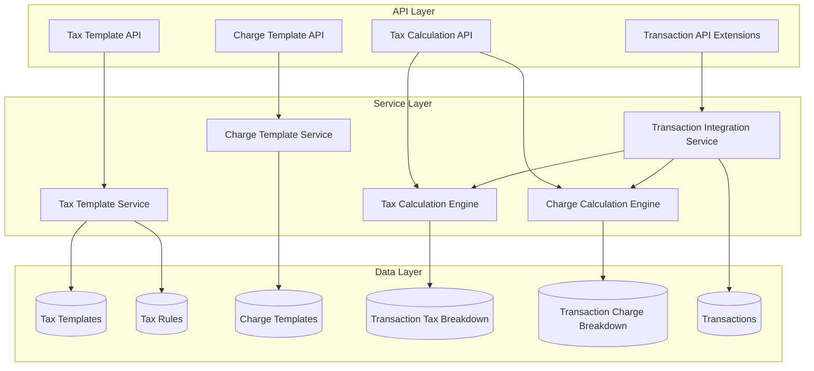

# Design Document: Tax and Extra Charges API

## Overview

The Tax and Extra Charges API provides a comprehensive system for managing tax configurations and additional charges across all transaction documents in the ERP system. The design supports multi-level tax inheritance (organization → item group → item), complex tax structures including compound taxes, flexible extra charges with rule-based applicability, and detailed breakdowns for audit and reporting purposes.

The system integrates seamlessly with existing transaction documents (Quotations, Sales Orders, Purchase Orders, Invoices, Delivery Notes, Purchase Receipts) and maintains complete audit trails for compliance.

## Architecture

### High-Level Architecture



### Component Architecture

The system consists of five main components:

1. **Tax Template Management**: CRUD operations for tax templates and rules
2. **Charge Template Management**: CRUD operations for extra charge templates
3. **Tax Calculation Engine**: Core logic for determining applicable taxes and calculating amounts
4. **Charge Calculation Engine**: Core logic for determining applicable charges and calculating amounts
5. **Transaction Integration**: Hooks into existing transaction documents to apply taxes and charges

### Design Patterns

- **Strategy Pattern**: Different calculation strategies for fixed vs percentage-based charges
- **Template Method Pattern**: Common calculation flow with customizable steps for different tax types
- **Repository Pattern**: Data access abstraction for templates and breakdowns
- **Service Layer Pattern**: Business logic separated from API controllers
- **Decorator Pattern**: Applying taxes and charges as decorators on base transaction amounts

## Components and Interfaces

### 1. Tax Template Service

**Responsibilities:**
- Create, read, update, delete tax templates
- Manage tax rules within templates
- Determine applicable tax template for a given context (item, transaction type, location)
- Handle default template assignment at organization level

**Key Methods:**
```python
class TaxTemplateService:
    def create_template(self, template_data: TaxTemplateCreate, user_id: UUID) -> TaxTemplate
    def get_template(self, template_id: UUID, organization_id: UUID) -> TaxTemplate
    def update_template(self, template_id: UUID, template_data: TaxTemplateUpdate, user_id: UUID) -> TaxTemplate
    def delete_template(self, template_id: UUID, organization_id: UUID, user_id: UUID) -> bool
    def list_templates(self, organization_id: UUID, filters: TaxTemplateFilters) -> List[TaxTemplate]
    def get_applicable_template(self, context: TaxContext) -> Optional[TaxTemplate]
    def set_as_default(self, template_id: UUID, organization_id: UUID, tax_category: str) -> bool
```

**Tax Context Structure:**
```python
@dataclass
class TaxContext:
    organization_id: UUID
    transaction_type: str  # "Sales" or "Purchase"
    item_id: Optional[UUID]
    item_group_id: Optional[UUID]
    customer_id: Optional[UUID]
    supplier_id: Optional[UUID]
    shipping_address: Optional[Address]
    transaction_date: datetime
```

### 2. Charge Template Service

**Responsibilities:**
- Create, read, update, delete extra charge templates
- Determine applicable charges for a given transaction context
- Validate applicability rules

**Key Methods:**
```python
class ChargeTemplateService:
    def create_template(self, template_data: ChargeTemplateCreate, user_id: UUID) -> ChargeTemplate
    def get_template(self, template_id: UUID, organization_id: UUID) -> ChargeTemplate
    def update_template(self, template_id: UUID, template_data: ChargeTemplateUpdate, user_id: UUID) -> ChargeTemplate
    def delete_template(self, template_id: UUID, organization_id: UUID, user_id: UUID) -> bool
    def list_templates(self, organization_id: UUID, filters: ChargeTemplateFilters) -> List[ChargeTemplate]
    def get_applicable_charges(self, context: ChargeContext) -> List[ChargeTemplate]
```

**Charge Context Structure:**
```python
@dataclass
class ChargeContext:
    organization_id: UUID
    transaction_type: str
    net_total: Decimal
    total_weight: Optional[Decimal]
    customer_id: Optional[UUID]
    shipping_address: Optional[Address]
    line_items: List[LineItem]
```

### 3. Tax Calculation Engine

**Responsibilities:**
- Calculate taxes for transaction line items
- Handle compound tax calculations
- Generate detailed tax breakdown
- Apply tax exemptions

**Key Methods:**
```python
class TaxCalculationEngine:
    def calculate_taxes(
        self, 
        line_items: List[LineItem], 
        context: TaxContext
    ) -> TaxCalculationResult
    
    def calculate_line_item_taxes(
        self, 
        line_item: LineItem, 
        tax_template: TaxTemplate
    ) -> List[TaxBreakdownEntry]
    
    def apply_compound_taxes(
        self, 
        base_amount: Decimal, 
        non_compound_taxes: List[TaxBreakdownEntry],
        compound_tax_rules: List[TaxRule]
    ) -> List[TaxBreakdownEntry]
```

**Tax Calculation Result:**
```python
@dataclass
class TaxCalculationResult:
    net_total: Decimal
    tax_breakdown: List[TaxBreakdownEntry]
    total_tax: Decimal
    taxes_by_type: Dict[str, Decimal]  # Grouped by tax_type
```

**Tax Breakdown Entry:**
```python
@dataclass
class TaxBreakdownEntry:
    tax_template_id: UUID
    tax_rule_id: UUID
    tax_type: str
    tax_rate: Decimal
    taxable_amount: Decimal
    tax_amount: Decimal
    is_compound: bool
    sequence: int
    account_head_id: UUID
```

### 4. Charge Calculation Engine

**Responsibilities:**
- Calculate applicable extra charges
- Handle fixed and percentage-based calculations
- Generate detailed charge breakdown

**Key Methods:**
```python
class ChargeCalculationEngine:
    def calculate_charges(
        self, 
        context: ChargeContext, 
        net_total: Decimal,
        total_tax: Decimal
    ) -> ChargeCalculationResult
    
    def calculate_single_charge(
        self, 
        charge_template: ChargeTemplate, 
        base_amount: Decimal
    ) -> ChargeBreakdownEntry
```

**Charge Calculation Result:**
```python
@dataclass
class ChargeCalculationResult:
    charge_breakdown: List[ChargeBreakdownEntry]
    total_charges: Decimal
```

**Charge Breakdown Entry:**
```python
@dataclass
class ChargeBreakdownEntry:
    charge_template_id: Optional[UUID]
    charge_type: str
    description: str
    calculation_method: str  # "FIXED" or "PERCENTAGE"
    charge_amount: Decimal
    account_head_id: UUID
    is_auto_calculated: bool
```

### 5. Transaction Integration Service

**Responsibilities:**
- Integrate tax and charge calculations into transaction workflows
- Persist tax and charge breakdowns
- Recalculate totals when transactions are modified
- Handle document conversions with tax/charge copying

**Key Methods:**
```python
class TransactionIntegrationService:
    def apply_taxes_and_charges(
        self, 
        transaction: Transaction, 
        user_id: UUID
    ) -> Transaction
    
    def recalculate_totals(
        self, 
        transaction: Transaction
    ) -> Transaction
    
    def copy_taxes_and_charges(
        self, 
        source_transaction: Transaction,
        target_transaction: Transaction
    ) -> None
    
    def persist_tax_breakdown(
        self, 
        transaction_id: UUID,
        transaction_type: str,
        tax_breakdown: List[TaxBreakdownEntry],
        organization_id: UUID
    ) -> None
    
    def persist_charge_breakdown(
        self, 
        transaction_id: UUID,
        transaction_type: str,
        charge_breakdown: List[ChargeBreakdownEntry],
        organization_id: UUID
    ) -> None
```

## Data Models

### Tax Template

```python
class TaxTemplate(BaseModel):
    id: UUID
    organization_id: UUID
    template_code: str  # Unique within organization
    template_name: str
    description: Optional[str]
    tax_category: str  # "Input" or "Output"
    is_default: bool
    is_active: bool
    applicability_rules: Dict[str, Any]  # JSONB
    extra_data: Dict[str, Any]  # JSONB
    created_by: UUID
    updated_by: UUID
    created_at: datetime
    updated_at: datetime
    deleted_at: Optional[datetime]
    
    # Relationships
    tax_rules: List[TaxRule]
```

**Applicability Rules Schema:**
```json
{
  "customer_location": {
    "country": "US",
    "state": "CA"
  },
  "supplier_location": {
    "country": "IN"
  },
  "item_type": "Product",
  "item_group_ids": ["uuid1", "uuid2"],
  "transaction_type": "Sales"
}
```

### Tax Rule

```python
class TaxRule(BaseModel):
    id: UUID
    tax_template_id: UUID
    rule_name: str
    tax_type: str  # "GST", "VAT", "CGST", "SGST", "IGST", "Sales Tax", etc.
    description: Optional[str]
    tax_rate: Decimal  # Percentage (e.g., 9.00 for 9%)
    account_head_id: UUID  # Reference to chart_of_accounts
    is_compound: bool
    sequence: int  # Order of calculation
    applicability_conditions: Dict[str, Any]  # JSONB
    created_at: datetime
    updated_at: datetime
```

### Extra Charge Template

```python
class ChargeTemplate(BaseModel):
    id: UUID
    organization_id: UUID
    template_code: str  # Unique within organization
    template_name: str
    charge_type: str  # "Shipping", "Handling", "Packaging", "Insurance", "Custom"
    description: Optional[str]
    calculation_method: str  # "FIXED" or "PERCENTAGE"
    fixed_amount: Optional[Decimal]
    percentage_rate: Optional[Decimal]
    base_on: Optional[str]  # "Net_Total" or "Grand_Total" (for percentage)
    account_head_id: UUID
    is_active: bool
    applicability_rules: Dict[str, Any]  # JSONB
    extra_data: Dict[str, Any]  # JSONB
    created_by: UUID
    updated_by: UUID
    created_at: datetime
    updated_at: datetime
    deleted_at: Optional[datetime]
```

**Applicability Rules Schema:**
```json
{
  "min_order_value": 0,
  "max_order_value": 1000,
  "customer_location": {
    "country": "US",
    "state": "CA"
  },
  "min_weight": 0,
  "max_weight": 100,
  "shipping_zone": "Zone_A"
}
```

### Transaction Tax Breakdown

```python
class TransactionTaxBreakdown(BaseModel):
    id: UUID
    organization_id: UUID
    transaction_type: str  # "Quotation", "Sales_Order", "Purchase_Order", "Invoice", etc.
    transaction_id: UUID
    tax_template_id: UUID
    tax_rule_id: UUID
    tax_type: str
    tax_rate: Decimal
    taxable_amount: Decimal
    tax_amount: Decimal
    is_compound: bool
    sequence: int
    account_head_id: UUID
    created_at: datetime
```

### Transaction Charge Breakdown

```python
class TransactionChargeBreakdown(BaseModel):
    id: UUID
    organization_id: UUID
    transaction_type: str
    transaction_id: UUID
    charge_template_id: Optional[UUID]  # Null for manual charges
    charge_type: str
    description: str
    calculation_method: str
    charge_amount: Decimal
    account_head_id: UUID
    is_auto_calculated: bool
    created_at: datetime
```

### Database Schema Extensions

**Items Table - Add Columns:**
```sql
ALTER TABLE items 
ADD COLUMN sales_tax_template_id UUID REFERENCES tax_templates(id),
ADD COLUMN purchase_tax_template_id UUID REFERENCES tax_templates(id);
```

**Item Groups Table - Add Columns:**
```sql
ALTER TABLE item_groups 
ADD COLUMN sales_tax_template_id UUID REFERENCES tax_templates(id),
ADD COLUMN purchase_tax_template_id UUID REFERENCES tax_templates(id);
```

**Organization Settings Table - Add Columns:**
```sql
ALTER TABLE organization_settings 
ADD COLUMN default_sales_tax_template_id UUID REFERENCES tax_templates(id),
ADD COLUMN default_purchase_tax_template_id UUID REFERENCES tax_templates(id);
```

**Customers Table - Add Columns:**
```sql
ALTER TABLE customers 
ADD COLUMN is_tax_exempt BOOLEAN DEFAULT FALSE,
ADD COLUMN tax_exemption_certificate_no VARCHAR(100);
```

**Transaction Tables - Add Columns:**
```sql
-- Apply to: quotations, sales_orders, purchase_orders, invoices, delivery_notes, purchase_receipts
ALTER TABLE quotations 
ADD COLUMN net_total NUMERIC(15,2) DEFAULT 0,
ADD COLUMN total_tax NUMERIC(15,2) DEFAULT 0,
ADD COLUMN total_charges NUMERIC(15,2) DEFAULT 0;
-- Modify grand_total calculation to include taxes and charges
```

### Database Indexes

```sql
-- Tax Templates
CREATE INDEX idx_tax_templates_org_category ON tax_templates(organization_id, tax_category) WHERE deleted_at IS NULL;
CREATE INDEX idx_tax_templates_default ON tax_templates(organization_id, is_default, tax_category) WHERE is_default = TRUE;

-- Tax Rules
CREATE INDEX idx_tax_rules_template ON tax_rules(tax_template_id, sequence);

-- Charge Templates
CREATE INDEX idx_charge_templates_org_type ON charge_templates(organization_id, charge_type) WHERE deleted_at IS NULL;

-- Transaction Tax Breakdown
CREATE INDEX idx_trans_tax_breakdown_trans ON transaction_tax_breakdown(transaction_type, transaction_id);
CREATE INDEX idx_trans_tax_breakdown_org_date ON transaction_tax_breakdown(organization_id, created_at);
CREATE INDEX idx_trans_tax_breakdown_tax_type ON transaction_tax_breakdown(organization_id, tax_type, created_at);

-- Transaction Charge Breakdown
CREATE INDEX idx_trans_charge_breakdown_trans ON transaction_charge_breakdown(transaction_type, transaction_id);
CREATE INDEX idx_trans_charge_breakdown_org_date ON transaction_charge_breakdown(organization_id, created_at);
```

## Correctness Properties

*A property is a characteristic or behavior that should hold true across all valid executions of a system—essentially, a formal statement about what the system should do. Properties serve as the bridge between human-readable specifications and machine-verifiable correctness guarantees.*


### Property 1: Tax Template Required Fields Validation
*For any* tax template creation request, if it lacks template_name, organization_id, or is_active status, the system should reject the request with a validation error.
**Validates: Requirements 1.1**

### Property 2: Tax Template Structure Completeness
*For any* successfully created tax template, the template should contain all required fields: template_code, description, tax_category, is_default flag, and timestamps.
**Validates: Requirements 1.2**

### Property 3: Default Template Uniqueness
*For any* organization and tax_category combination, at most one tax template should have is_default set to true. When a template is marked as default, any previously default template for the same organization and tax_category should be unmarked.
**Validates: Requirements 1.4**

### Property 4: Tax Template Referential Integrity
*For any* tax template that is referenced by items, item_groups, or active transactions, deletion attempts should fail with an appropriate error.
**Validates: Requirements 1.8**

### Property 5: Tax Calculation Correctness
*For any* transaction with line items and applicable tax rules:
- Non-compound tax amount should equal (net_total × tax_rate / 100)
- Compound tax amount should equal ((net_total + sum_of_non_compound_taxes) × tax_rate / 100)
- Total tax should equal the sum of all individual tax amounts
**Validates: Requirements 2.4, 2.5, 8.4, 8.5, 8.6**

### Property 6: Tax Calculation Sequence Ordering
*For any* tax breakdown with both compound and non-compound taxes, all non-compound taxes should have sequence numbers lower than all compound taxes.
**Validates: Requirements 2.7**

### Property 7: Applicability Rules AND Logic
*For any* tax or charge template with multiple applicability conditions, the template should only be applied when ALL conditions are satisfied (AND logic, not OR).
**Validates: Requirements 3.7**

### Property 8: Tax Template Inheritance Hierarchy
*For any* item in a transaction:
- If the item has a tax template assigned, that template should be used
- If the item has no template but its item_group has one, the item_group template should be used
- If neither item nor item_group has a template, the organization default should be used
- The effective template should always follow this precedence: item > item_group > organization default
**Validates: Requirements 4.3, 4.4, 4.5**

### Property 9: Charge Template Validation
*For any* charge template:
- If calculation_method is FIXED, fixed_amount must be present and non-null
- If calculation_method is PERCENTAGE, both percentage_rate and base_on must be present and non-null
- Creation should fail if these constraints are violated
**Validates: Requirements 6.4, 6.5**

### Property 10: Charge Calculation Correctness
*For any* transaction with applicable charges:
- If calculation_method is FIXED, charge_amount should equal fixed_amount
- If calculation_method is PERCENTAGE and base_on is Net_Total, charge_amount should equal (net_total × percentage_rate / 100)
- If calculation_method is PERCENTAGE and base_on is Grand_Total, charge_amount should equal ((net_total + total_tax) × percentage_rate / 100)
**Validates: Requirements 9.3, 9.4, 9.5**

### Property 11: Transaction Totals Calculation
*For any* transaction with line items, taxes, and charges:
- net_total should equal the sum of all line item amounts
- total_tax should equal the sum of all tax amounts
- total_charges should equal the sum of all charge amounts
- grand_total should equal (net_total + total_tax + total_charges)
- The difference between grand_total and the sum of its components should be within rounding tolerance (0.01)
**Validates: Requirements 8.3, 10.1, 10.6**

### Property 12: Tax Exemption Application
*For any* transaction where the customer is marked as tax-exempt (is_tax_exempt = true), no sales taxes should be applied, and total_tax should be zero.
**Validates: Requirements 13.2**

### Property 13: Line Item Tax Exemption
*For any* transaction with line items marked as tax-exempt, those line items should be excluded from taxable_amount calculations, and the sum of taxable_amounts should equal the sum of non-exempt line item amounts.
**Validates: Requirements 13.4**

### Property 14: Document Conversion Data Preservation
*For any* document conversion (quotation → sales_order, sales_order → invoice, purchase_order → purchase_receipt):
- All tax breakdown entries from the source document should be copied to the target document
- All charge breakdown entries from the source document should be copied to the target document
- The net_total, total_tax, total_charges, and grand_total should be preserved
**Validates: Requirements 17.3, 17.4**

## Error Handling

### Validation Errors

**Tax Template Validation:**
- Missing required fields (template_name, organization_id)
- Invalid tax_category (not "Input" or "Output")
- Duplicate template_code within organization
- Invalid account_head_id reference
- Tax rules with invalid tax_rate (negative or > 100)

**Charge Template Validation:**
- Missing required fields based on calculation_method
- Invalid charge_type
- Negative fixed_amount or percentage_rate
- Invalid base_on value (not "Net_Total" or "Grand_Total")

**Tax Calculation Errors:**
- No applicable tax template found when required
- Circular dependency in compound tax calculations
- Tax rate exceeds maximum allowed (e.g., > 100%)

**Charge Calculation Errors:**
- Applicability rule evaluation failures
- Invalid base amount for percentage calculations

### Business Logic Errors

**Template Deletion:**
- Error code: `TAX_TEMPLATE_IN_USE`
- Message: "Cannot delete tax template that is referenced by items, item groups, or active transactions"
- HTTP Status: 409 Conflict

**Default Template Conflict:**
- Error code: `DEFAULT_TEMPLATE_EXISTS`
- Message: "A default template already exists for this organization and tax category"
- HTTP Status: 409 Conflict

**Tax Exemption Override:**
- Error code: `INSUFFICIENT_PERMISSIONS`
- Message: "User does not have permission to override tax exemption"
- HTTP Status: 403 Forbidden

### Error Response Format

```json
{
  "error": {
    "code": "TAX_TEMPLATE_IN_USE",
    "message": "Cannot delete tax template that is referenced by items",
    "details": {
      "template_id": "uuid",
      "referenced_by": {
        "items": ["item_id_1", "item_id_2"],
        "item_groups": [],
        "transactions": []
      }
    }
  }
}
```

## Testing Strategy

### Dual Testing Approach

The testing strategy employs both unit tests and property-based tests to ensure comprehensive coverage:

**Unit Tests** focus on:
- Specific examples of tax calculations with known inputs and outputs
- Edge cases (zero amounts, maximum tax rates, empty line items)
- Error conditions (invalid templates, missing required fields)
- Integration points between services
- API endpoint request/response validation

**Property-Based Tests** focus on:
- Universal properties that hold for all valid inputs
- Tax calculation correctness across randomized transactions
- Invariants (default template uniqueness, totals calculation)
- Template inheritance hierarchy across various configurations
- Document conversion data preservation

### Property-Based Testing Configuration

- **Framework**: Use `hypothesis` for Python (pytest integration)
- **Iterations**: Minimum 100 iterations per property test
- **Test Tagging**: Each property test must reference its design document property
- **Tag Format**: `# Feature: tax-and-charges-api, Property {number}: {property_text}`

### Example Property Test Structure

```python
from hypothesis import given, strategies as st
from decimal import Decimal

@given(
    net_total=st.decimals(min_value=Decimal("0.01"), max_value=Decimal("100000"), places=2),
    tax_rate=st.decimals(min_value=Decimal("0"), max_value=Decimal("100"), places=2)
)
def test_non_compound_tax_calculation(net_total, tax_rate):
    """
    Feature: tax-and-charges-api, Property 5: Tax Calculation Correctness
    For any transaction, non-compound tax amount should equal (net_total × tax_rate / 100)
    """
    expected_tax = (net_total * tax_rate / 100).quantize(Decimal("0.01"))
    actual_tax = calculate_non_compound_tax(net_total, tax_rate)
    assert actual_tax == expected_tax
```

### Unit Test Coverage Areas

1. **Tax Template CRUD Operations**
   - Create template with valid data
   - Create template with missing required fields (should fail)
   - Update template
   - Delete template without references
   - Delete template with references (should fail)
   - Set template as default (should unmark previous default)

2. **Tax Calculation Scenarios**
   - Single non-compound tax
   - Multiple non-compound taxes
   - Single compound tax
   - Mixed non-compound and compound taxes
   - Tax exemption scenarios
   - Zero tax rate
   - Maximum tax rate (100%)

3. **Charge Calculation Scenarios**
   - Fixed amount charge
   - Percentage on net total
   - Percentage on grand total
   - Multiple charges
   - Charges with applicability rules

4. **Template Inheritance**
   - Item-level template takes precedence
   - Item group fallback
   - Organization default fallback
   - No template available scenario

5. **Document Conversion**
   - Quotation to sales order with taxes
   - Sales order to invoice with taxes and charges
   - Verify breakdown preservation

### Integration Tests

1. **End-to-End Transaction Flow**
   - Create quotation with line items
   - Verify taxes auto-calculated
   - Add extra charges
   - Verify grand total
   - Convert to sales order
   - Verify taxes and charges copied

2. **Multi-Tenancy Isolation**
   - Verify organization A cannot access organization B's templates
   - Verify tax calculations use correct organization context

3. **Permission Checks**
   - Verify RBAC enforcement on template operations
   - Verify tax override permissions

## API Endpoints

### Tax Template Endpoints

**Create Tax Template**
```
POST /api/v1/tax-templates
Authorization: Bearer {token}
Content-Type: application/json

Request Body:
{
  "template_code": "GST_18",
  "template_name": "GST 18%",
  "description": "Standard GST rate for most goods",
  "tax_category": "Output",
  "is_default": false,
  "is_active": true,
  "applicability_rules": {
    "transaction_type": "Sales",
    "customer_location": {
      "country": "IN"
    }
  },
  "tax_rules": [
    {
      "rule_name": "CGST",
      "tax_type": "CGST",
      "tax_rate": 9.00,
      "account_head_id": "uuid",
      "is_compound": false,
      "sequence": 1
    },
    {
      "rule_name": "SGST",
      "tax_type": "SGST",
      "tax_rate": 9.00,
      "account_head_id": "uuid",
      "is_compound": false,
      "sequence": 2
    }
  ]
}

Response: 201 Created
{
  "id": "uuid",
  "template_code": "GST_18",
  "template_name": "GST 18%",
  "organization_id": "uuid",
  "tax_category": "Output",
  "is_default": false,
  "is_active": true,
  "tax_rules": [...],
  "created_at": "2024-01-15T10:00:00Z",
  "created_by": "uuid"
}
```

**List Tax Templates**
```
GET /api/v1/tax-templates?tax_category=Output&is_active=true&page=1&limit=20
Authorization: Bearer {token}

Response: 200 OK
{
  "data": [
    {
      "id": "uuid",
      "template_code": "GST_18",
      "template_name": "GST 18%",
      "tax_category": "Output",
      "is_default": false,
      "is_active": true,
      "tax_rules_count": 2
    }
  ],
  "pagination": {
    "page": 1,
    "limit": 20,
    "total": 5,
    "pages": 1
  }
}
```

**Get Tax Template**
```
GET /api/v1/tax-templates/{id}
Authorization: Bearer {token}

Response: 200 OK
{
  "id": "uuid",
  "template_code": "GST_18",
  "template_name": "GST 18%",
  "organization_id": "uuid",
  "tax_category": "Output",
  "is_default": false,
  "is_active": true,
  "applicability_rules": {...},
  "tax_rules": [
    {
      "id": "uuid",
      "rule_name": "CGST",
      "tax_type": "CGST",
      "tax_rate": 9.00,
      "account_head_id": "uuid",
      "is_compound": false,
      "sequence": 1
    }
  ],
  "created_at": "2024-01-15T10:00:00Z",
  "updated_at": "2024-01-15T10:00:00Z"
}
```

**Update Tax Template**
```
PUT /api/v1/tax-templates/{id}
Authorization: Bearer {token}
Content-Type: application/json

Request Body:
{
  "template_name": "GST 18% Updated",
  "is_active": true,
  "tax_rules": [...]
}

Response: 200 OK
{
  "id": "uuid",
  "template_name": "GST 18% Updated",
  ...
}
```

**Delete Tax Template**
```
DELETE /api/v1/tax-templates/{id}
Authorization: Bearer {token}

Response: 204 No Content
```

**Get Applicable Tax Template**
```
GET /api/v1/tax-templates/applicable?item_id={uuid}&transaction_type=Sales&customer_id={uuid}
Authorization: Bearer {token}

Response: 200 OK
{
  "template": {
    "id": "uuid",
    "template_code": "GST_18",
    "template_name": "GST 18%",
    "tax_rules": [...]
  },
  "source": "item"  // or "item_group" or "organization_default"
}
```

### Charge Template Endpoints

**Create Charge Template**
```
POST /api/v1/charge-templates
Authorization: Bearer {token}
Content-Type: application/json

Request Body:
{
  "template_code": "SHIP_STANDARD",
  "template_name": "Standard Shipping",
  "charge_type": "Shipping",
  "description": "Standard shipping charges",
  "calculation_method": "PERCENTAGE",
  "percentage_rate": 5.00,
  "base_on": "Net_Total",
  "account_head_id": "uuid",
  "is_active": true,
  "applicability_rules": {
    "min_order_value": 0,
    "max_order_value": 1000
  }
}

Response: 201 Created
{
  "id": "uuid",
  "template_code": "SHIP_STANDARD",
  "template_name": "Standard Shipping",
  "organization_id": "uuid",
  "charge_type": "Shipping",
  "calculation_method": "PERCENTAGE",
  "percentage_rate": 5.00,
  "base_on": "Net_Total",
  "is_active": true,
  "created_at": "2024-01-15T10:00:00Z"
}
```

**List Charge Templates**
```
GET /api/v1/charge-templates?charge_type=Shipping&is_active=true
Authorization: Bearer {token}

Response: 200 OK
{
  "data": [
    {
      "id": "uuid",
      "template_code": "SHIP_STANDARD",
      "template_name": "Standard Shipping",
      "charge_type": "Shipping",
      "calculation_method": "PERCENTAGE",
      "is_active": true
    }
  ]
}
```

**Get Applicable Charges**
```
POST /api/v1/charge-templates/applicable
Authorization: Bearer {token}
Content-Type: application/json

Request Body:
{
  "transaction_type": "Sales_Order",
  "net_total": 5000.00,
  "customer_id": "uuid",
  "shipping_address": {
    "country": "US",
    "state": "CA"
  },
  "total_weight": 50.5
}

Response: 200 OK
{
  "applicable_charges": [
    {
      "template_id": "uuid",
      "template_code": "SHIP_STANDARD",
      "charge_type": "Shipping",
      "calculated_amount": 250.00
    }
  ]
}
```

### Tax Calculation Endpoints

**Calculate Taxes**
```
POST /api/v1/calculate-taxes
Authorization: Bearer {token}
Content-Type: application/json

Request Body:
{
  "transaction_type": "Sales_Order",
  "customer_id": "uuid",
  "line_items": [
    {
      "item_id": "uuid",
      "qty": 10,
      "rate": 100.00,
      "amount": 1000.00
    }
  ],
  "shipping_address": {
    "country": "IN",
    "state": "MH"
  }
}

Response: 200 OK
{
  "net_total": 1000.00,
  "tax_breakdown": [
    {
      "tax_type": "CGST",
      "tax_rate": 9.00,
      "taxable_amount": 1000.00,
      "tax_amount": 90.00,
      "is_compound": false
    },
    {
      "tax_type": "SGST",
      "tax_rate": 9.00,
      "taxable_amount": 1000.00,
      "tax_amount": 90.00,
      "is_compound": false
    }
  ],
  "total_tax": 180.00,
  "taxes_by_type": {
    "CGST": 90.00,
    "SGST": 90.00
  }
}
```

**Calculate Complete Totals**
```
POST /api/v1/calculate-totals
Authorization: Bearer {token}
Content-Type: application/json

Request Body:
{
  "transaction_type": "Sales_Order",
  "customer_id": "uuid",
  "line_items": [...],
  "shipping_address": {...}
}

Response: 200 OK
{
  "net_total": 1000.00,
  "tax_breakdown": [...],
  "total_tax": 180.00,
  "charge_breakdown": [
    {
      "charge_type": "Shipping",
      "description": "Standard Shipping",
      "charge_amount": 50.00
    }
  ],
  "total_charges": 50.00,
  "grand_total": 1230.00
}
```

### Tax Reporting Endpoints

**Tax Summary Report**
```
GET /api/v1/reports/tax-summary?start_date=2024-01-01&end_date=2024-01-31&tax_type=CGST
Authorization: Bearer {token}

Response: 200 OK
{
  "period": {
    "start_date": "2024-01-01",
    "end_date": "2024-01-31"
  },
  "summary": [
    {
      "tax_type": "CGST",
      "total_taxable_amount": 100000.00,
      "total_tax_amount": 9000.00,
      "transaction_count": 50
    },
    {
      "tax_type": "SGST",
      "total_taxable_amount": 100000.00,
      "total_tax_amount": 9000.00,
      "transaction_count": 50
    }
  ],
  "input_tax_total": 5000.00,
  "output_tax_total": 13000.00,
  "net_tax_liability": 8000.00
}
```

**Tax by Customer Report**
```
GET /api/v1/reports/tax-by-customer?start_date=2024-01-01&end_date=2024-01-31
Authorization: Bearer {token}

Response: 200 OK
{
  "data": [
    {
      "customer_id": "uuid",
      "customer_name": "ABC Corp",
      "total_taxable_amount": 50000.00,
      "total_tax_amount": 9000.00,
      "transaction_count": 25
    }
  ]
}
```

## Security Considerations

### Authentication and Authorization

1. **JWT-based Authentication**: All endpoints require valid JWT token
2. **Organization Isolation**: All queries filtered by organization_id from authenticated user
3. **Permission-based Access Control**:
   - `tax_template.create`: Create tax templates
   - `tax_template.read`: View tax templates
   - `tax_template.update`: Modify tax templates
   - `tax_template.delete`: Delete tax templates
   - `charge_template.create`: Create charge templates
   - `charge_template.read`: View charge templates
   - `charge_template.update`: Modify charge templates
   - `charge_template.delete`: Delete charge templates
   - `transaction.override_tax`: Manually override calculated taxes
   - `reports.tax.read`: Access tax reports

### Data Validation

1. **Input Sanitization**: All user inputs sanitized to prevent SQL injection
2. **Schema Validation**: Request bodies validated against JSON schemas
3. **Business Rule Validation**: Tax rates, amounts, and calculations validated
4. **Reference Validation**: All foreign key references validated for existence and organization ownership

### Audit Logging

All operations logged to `audit_logs` table:
- Template creation, modification, deletion
- Manual tax overrides
- Default template changes
- Failed permission checks

## Performance Considerations

### Caching Strategy

1. **Tax Template Cache**: Cache active templates per organization (TTL: 1 hour)
2. **Charge Template Cache**: Cache active charge templates per organization (TTL: 1 hour)
3. **Organization Defaults Cache**: Cache default templates per organization (TTL: 1 hour)
4. **Cache Invalidation**: Invalidate on template updates/deletions

### Database Optimization

1. **Indexes**: Proper indexes on organization_id, tax_type, charge_type, transaction_id
2. **Query Optimization**: Use JOINs efficiently, avoid N+1 queries
3. **Batch Operations**: Support bulk tax calculation for multiple transactions
4. **Partitioning**: Consider partitioning breakdown tables by date for large datasets

### Calculation Optimization

1. **Lazy Evaluation**: Calculate taxes only when needed (not on every line item change)
2. **Memoization**: Cache calculation results within a request context
3. **Parallel Processing**: Calculate taxes for multiple line items in parallel
4. **Rounding Strategy**: Consistent rounding to 2 decimal places

## Migration Strategy

### Phase 1: Schema Creation
1. Create tax_templates, tax_rules tables
2. Create charge_templates table
3. Create transaction_tax_breakdown, transaction_charge_breakdown tables
4. Add columns to items, item_groups, organization_settings, customers
5. Add columns to transaction tables (quotations, sales_orders, etc.)

### Phase 2: Data Migration
1. Migrate existing tax configurations (if any) to new template structure
2. Set organization defaults based on existing settings
3. Backfill net_total, total_tax, total_charges for existing transactions

### Phase 3: API Deployment
1. Deploy tax template management endpoints
2. Deploy charge template management endpoints
3. Deploy calculation endpoints
4. Deploy reporting endpoints

### Phase 4: Integration
1. Integrate tax calculations into quotation workflow
2. Integrate into sales order workflow
3. Integrate into purchase order workflow
4. Integrate into invoice workflow
5. Update document conversion logic

### Phase 5: Testing and Rollout
1. Run comprehensive test suite
2. Perform load testing
3. Gradual rollout to organizations
4. Monitor and fix issues

## Future Enhancements

1. **Tax Jurisdiction Management**: Dedicated table for tax jurisdictions with geographic boundaries
2. **Tax Holiday Support**: Temporary tax exemptions for specific periods
3. **Reverse Charge Mechanism**: Support for reverse charge scenarios in B2B transactions
4. **Tax Withholding**: TDS/TCS support for Indian tax regulations
5. **Multi-Currency Tax**: Handle taxes in different currencies with exchange rates
6. **Tax Reconciliation**: Automated reconciliation with government tax portals
7. **Advanced Reporting**: Detailed tax analytics and forecasting
8. **Tax Compliance Checks**: Automated validation against tax regulations
9. **Charge Tiers**: Support for tiered charges based on quantity/value ranges
10. **Dynamic Tax Rates**: Support for tax rates that change based on date/time
