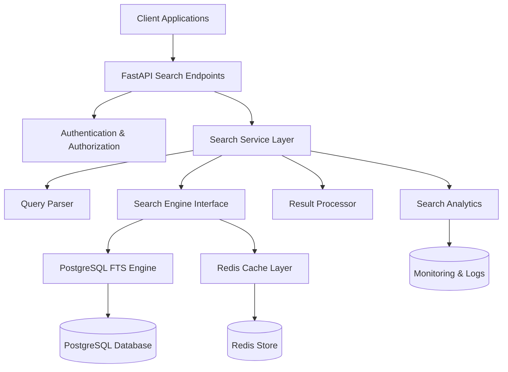

# Design Document: Unified Search API

## Overview

The Unified Search API provides a scalable, high-performance search solution for ERP systems, supporting both global search across all entities and local search within specific modules. The design leverages PostgreSQL's built-in full-text search capabilities for the initial implementation while providing a foundation for future scaling to dedicated search engines like Elasticsearch.

The architecture follows a layered approach with clear separation of concerns: API layer for request handling, service layer for business logic, search engine abstraction for query processing, and data layer for persistence and indexing.

## Architecture

### High-Level Architecture



### Layered Architecture

**API Layer (FastAPI)**

- RESTful endpoints for global and local search
- Request validation and parameter parsing
- Response formatting and error handling
- Rate limiting and request throttling

**Service Layer**

- Business logic orchestration
- Authorization and permission filtering
- Result ranking and relevance scoring
- Caching strategy implementation

**Search Engine Layer**

- Abstracted search interface for future extensibility
- PostgreSQL full-text search implementation
- Query optimization and execution
- Index management and maintenance

**Data Layer**

- Entity data persistence
- Search index storage and updates
- Cache management
- Analytics data collection

## Components and Interfaces

### Search Service Interface

```python
from abc import ABC, abstractmethod
from typing import List, Dict, Any, Optional
from dataclasses import dataclass

@dataclass
class SearchQuery:
    query_text: str
    entity_types: Optional[List[str]] = None
    filters: Optional[Dict[str, Any]] = None
    page: int = 1
    page_size: int = 20
    sort_by: Optional[str] = None

@dataclass
class SearchResult:
    entity_id: str
    entity_type: str
    title: str
    snippet: str
    relevance_score: float
    metadata: Dict[str, Any]

@dataclass
class SearchResponse:
    results: List[SearchResult]
    total_count: int
    page: int
    page_size: int
    query_time_ms: int
    suggestions: Optional[List[str]] = None

class SearchEngineInterface(ABC):
    @abstractmethod
    async def global_search(self, query: SearchQuery, user_context: UserContext) -> SearchResponse:
        pass

    @abstractmethod
    async def local_search(self, entity_type: str, query: SearchQuery, user_context: UserContext) -> SearchResponse:
        pass

    @abstractmethod
    async def suggest_terms(self, partial_query: str, entity_type: Optional[str] = None) -> List[str]:
        pass
```

### PostgreSQL Full-Text Search Engine

```python
class PostgreSQLSearchEngine(SearchEngineInterface):
    def __init__(self, db_session: AsyncSession, cache: CacheInterface):
        self.db = db_session
        self.cache = cache
        self.query_parser = QueryParser()
        self.result_processor = ResultProcessor()

    async def global_search(self, query: SearchQuery, user_context: UserContext) -> SearchResponse:
        # Parse and validate query
        parsed_query = self.query_parser.parse(query.query_text)

        # Check cache first
        cache_key = self._generate_cache_key(query, user_context)
        cached_result = await self.cache.get(cache_key)
        if cached_result:
            return cached_result

        # Execute search across all entity types
        results = await self._execute_global_search(parsed_query, query, user_context)

        # Process and rank results
        processed_results = self.result_processor.process_and_rank(results, parsed_query)

        # Cache results
        await self.cache.set(cache_key, processed_results, ttl=300)

        return processed_results
```

### Query Parser Component

```python
class QueryParser:
    def __init__(self):
        self.stop_words = self._load_stop_words()
        self.stemmer = PorterStemmer()

    def parse(self, query_text: str) -> ParsedQuery:
        # Normalize query (lowercase, remove accents)
        normalized = self._normalize_text(query_text)

        # Handle quoted phrases
        phrases = self._extract_phrases(normalized)

        # Parse boolean operators
        boolean_terms = self._parse_boolean_operators(normalized)

        # Generate PostgreSQL tsquery
        ts_query = self._build_tsquery(phrases, boolean_terms)

        return ParsedQuery(
            original=query_text,
            normalized=normalized,
            ts_query=ts_query,
            phrases=phrases,
            terms=boolean_terms
        )
```

### Authorization Filter

```python
class AuthorizationFilter:
    def __init__(self, permission_service: PermissionService):
        self.permission_service = permission_service

    async def filter_results(self, results: List[SearchResult], user_context: UserContext) -> List[SearchResult]:
        filtered_results = []

        for result in results:
            # Check entity-level permissions
            if await self.permission_service.can_view_entity(
                user_context.user_id,
                result.entity_type,
                result.entity_id
            ):
                # Filter sensitive fields based on user role
                filtered_result = await self._filter_sensitive_fields(result, user_context)
                filtered_results.append(filtered_result)

        return filtered_results
```

## Data Models

### Search Index Schema

```sql
-- Enhanced entity tables with full-text search support
CREATE TABLE search_documents (
    id UUID PRIMARY KEY DEFAULT gen_random_uuid(),
    entity_id VARCHAR NOT NULL,
    entity_type VARCHAR NOT NULL,
    title TEXT NOT NULL,
    content TEXT NOT NULL,
    metadata JSONB,
    search_vector tsvector GENERATED ALWAYS AS (
        setweight(to_tsvector('english', coalesce(title, '')), 'A') ||
        setweight(to_tsvector('english', coalesce(content, '')), 'B') ||
        setweight(to_tsvector('english', coalesce(metadata->>'tags', '')), 'C')
    ) STORED,
    created_at TIMESTAMP WITH TIME ZONE DEFAULT NOW(),
    updated_at TIMESTAMP WITH TIME ZONE DEFAULT NOW(),
    UNIQUE(entity_id, entity_type)
);

-- Optimized indexes for search performance
CREATE INDEX idx_search_documents_vector ON search_documents USING GIN(search_vector);
CREATE INDEX idx_search_documents_entity_type ON search_documents(entity_type);
CREATE INDEX idx_search_documents_updated_at ON search_documents(updated_at);

-- Entity-specific search configurations
CREATE TABLE search_configurations (
    entity_type VARCHAR PRIMARY KEY,
    searchable_fields JSONB NOT NULL,
    boost_factors JSONB,
    filters JSONB,
    created_at TIMESTAMP WITH TIME ZONE DEFAULT NOW()
);
```

### Cache Data Models

```python
@dataclass
class CachedSearchResult:
    results: List[SearchResult]
    total_count: int
    cached_at: datetime
    ttl_seconds: int
    query_hash: str

@dataclass
class SearchAnalytics:
    query_text: str
    entity_types: List[str]
    user_id: str
    result_count: int
    query_time_ms: int
    timestamp: datetime
    cache_hit: bool
```

## Correctness Properties

_A property is a characteristic or behavior that should hold true across all valid executions of a system—essentially, a formal statement about what the system should do. Properties serve as the bridge between human-readable specifications and machine-verifiable correctness guarantees._

Before defining the correctness properties, I need to analyze the acceptance criteria from the requirements to determine which ones are testable as properties.

<function_calls>
<invoke name="prework">
<parameter name="featureName">unified-search-api

Based on the prework analysis, the following properties have been identified from the testable acceptance criteria. After reviewing for redundancy, several properties have been consolidated to eliminate overlap:

**Property Reflection:**

- Properties 1.1 and 1.2 can be combined into a comprehensive global search property
- Properties 2.1 and 2.3 can be combined into a comprehensive local search property
- Properties 4.1, 4.2, and 4.5 can be combined into a comprehensive query parsing property
- Properties 6.1 and 6.2 can be combined into a comprehensive authorization property
- Properties 8.1 and 10.1 can be combined into a comprehensive index synchronization property

### Property 1: Global Search Completeness

_For any_ global search query, the search engine should query all configured entity types and include entity type information with each result
**Validates: Requirements 1.1, 1.2**

### Property 2: Local Search Entity Filtering

_For any_ local search query with a specified entity type, all returned results should belong only to that entity type and include all relevant entity fields
**Validates: Requirements 2.1, 2.3**

### Property 3: Result Relevance Ordering

_For any_ search results with different relevance scores, the results should be ordered from highest to lowest relevance score
**Validates: Requirements 1.3, 5.1**

### Property 4: Empty Query Rejection

_For any_ search query that is empty or contains only whitespace characters, the query parser should reject the query and return an appropriate error
**Validates: Requirements 1.4**

### Property 5: Partial Text Matching

_For any_ entity with text in searchable fields, partial text queries should successfully match and return that entity
**Validates: Requirements 1.5**

### Property 6: Field-Specific Search

_For any_ local search with field-specific filters, all returned results should match the specified field criteria
**Validates: Requirements 2.2**

### Property 7: Invalid Entity Type Handling

_For any_ local search query with an invalid entity type, the query parser should return a descriptive error message
**Validates: Requirements 2.4**

### Property 8: Advanced Filtering

_For any_ search query with entity-specific filters applied, all returned results should satisfy the filter conditions
**Validates: Requirements 2.5**

### Property 9: Query Parsing Completeness

_For any_ search query with quoted phrases, boolean operators, or mixed case/accents, the query parser should correctly parse and normalize the query for consistent matching
**Validates: Requirements 4.1, 4.2, 4.5**

### Property 10: Fuzzy Matching Support

_For any_ partial or misspelled search terms, the search engine should return relevant results using wildcard and fuzzy matching
**Validates: Requirements 4.3**

### Property 11: Input Sanitization

_For any_ search query containing special characters or potentially malicious input, the query parser should handle them safely without causing errors or security vulnerabilities
**Validates: Requirements 4.4, 6.4**

### Property 12: Pagination Consistency

_For any_ search result set larger than the page size, pagination should return non-overlapping subsets that together contain all results
**Validates: Requirements 5.2**

### Property 13: Result Highlighting

_For any_ search results returned, matching terms should be highlighted in the result snippets
**Validates: Requirements 5.3**

### Property 14: Search Suggestions

_For any_ search query that returns no results, the search engine should provide alternative search term suggestions
**Validates: Requirements 5.4**

### Property 15: Result Limiting

_For any_ search query, the number of returned results should never exceed 1000 items
**Validates: Requirements 5.5**

### Property 16: Authorization Filtering

_For any_ user performing a search, only entities the user has permission to view should be returned, with sensitive fields masked or excluded based on user role
**Validates: Requirements 6.1, 6.2**

### Property 17: Security Logging

_For any_ unauthorized access attempt, the system should log the attempt and return appropriate error messages
**Validates: Requirements 6.3**

### Property 18: Session Validation

_For any_ search request with an expired session, the search engine should reject the request and require re-authentication
**Validates: Requirements 6.5**

### Property 19: API Response Structure

_For any_ valid API request, the search engine should return a properly structured JSON response with appropriate HTTP status codes
**Validates: Requirements 7.3, 7.4**

### Property 20: Index Synchronization

_For any_ entity creation, update, or deletion, the search index should reflect the changes incrementally and maintain consistency with the primary database
**Validates: Requirements 8.1, 10.1, 10.2**

### Property 21: Batch Update Efficiency

_For any_ bulk data operation, the search index should support batch updates without requiring individual index operations for each entity
**Validates: Requirements 8.2**

### Property 22: Search Analytics Logging

_For any_ search query execution, the system should log query patterns, response times, result counts, and track success rates
**Validates: Requirements 9.1, 9.4**

### Property 23: Data Consistency Verification

_For any_ search index verification request, the system should be able to compare index data with primary data sources and report accuracy
**Validates: Requirements 10.4**

### Property 24: Conflict Resolution Priority

_For any_ data synchronization conflict, the search engine should prioritize primary database data as the source of truth
**Validates: Requirements 10.5**

## Error Handling

### Error Classification

**Client Errors (4xx)**

- Invalid query syntax or parameters
- Unauthorized access attempts
- Malformed request bodies
- Unsupported entity types

**Server Errors (5xx)**

- Database connection failures
- Search index corruption
- Cache service unavailability
- Internal processing errors

### Error Response Format

```python
@dataclass
class ErrorResponse:
    error_code: str
    message: str
    details: Optional[Dict[str, Any]] = None
    timestamp: datetime
    request_id: str

# Example error responses
INVALID_QUERY_ERROR = ErrorResponse(
    error_code="INVALID_QUERY",
    message="Query contains invalid syntax or characters",
    details={"query": "original_query", "position": 15}
)

UNAUTHORIZED_ERROR = ErrorResponse(
    error_code="UNAUTHORIZED",
    message="User does not have permission to access this resource"
)
```

### Resilience Patterns

**Circuit Breaker Pattern**

- Protect against cascading failures from database or cache services
- Implement fallback mechanisms for degraded search functionality
- Automatic recovery detection and service restoration

**Retry Logic**

- Exponential backoff for transient failures
- Maximum retry limits to prevent infinite loops
- Different retry strategies for different error types

**Graceful Degradation**

- Fall back to basic text search if full-text search fails
- Serve cached results when database is unavailable
- Reduce search scope during high load conditions

## Testing Strategy

### Dual Testing Approach

The testing strategy employs both unit testing and property-based testing to ensure comprehensive coverage:

**Unit Tests**

- Specific examples and edge cases
- Integration points between components
- Error conditions and boundary cases
- API endpoint validation
- Authentication and authorization flows

**Property-Based Tests**

- Universal properties across all inputs
- Comprehensive input coverage through randomization
- Minimum 100 iterations per property test
- Each test references its corresponding design property

### Property-Based Testing Configuration

**Library Selection**: Hypothesis (Python)

- Mature property-based testing library
- Excellent integration with pytest
- Rich set of data generators
- Shrinking capabilities for minimal failing examples

**Test Configuration**

```python
from hypothesis import given, strategies as st, settings

@settings(max_examples=100, deadline=5000)
@given(
    query_text=st.text(min_size=1, max_size=100),
    entity_types=st.lists(st.sampled_from(['items', 'customers', 'suppliers']))
)
def test_global_search_completeness(query_text, entity_types):
    """
    Feature: unified-search-api, Property 1: Global Search Completeness
    For any global search query, the search engine should query all configured
    entity types and include entity type information with each result
    """
    # Test implementation here
    pass
```

**Test Tagging Format**
Each property test must include a comment with:

- **Feature**: unified-search-api
- **Property {number}**: {property description}

### Testing Layers

**Unit Testing Focus**

- Query parser validation with specific examples
- Authorization filter edge cases
- Cache invalidation scenarios
- Database connection error handling
- API request/response validation

**Property Testing Focus**

- Search result consistency across all entity types
- Query normalization behavior
- Pagination correctness
- Authorization filtering completeness
- Index synchronization accuracy

**Integration Testing**

- End-to-end search workflows
- Performance under load
- Cache coherency
- Database transaction consistency
- Multi-user concurrent access

### Performance Testing

**Load Testing Requirements**

- 500ms response time for datasets up to 100,000 records
- Concurrent user simulation (up to 1000 simultaneous searches)
- Memory usage monitoring during peak load
- Cache hit ratio optimization

**Scalability Testing**

- Horizontal scaling validation
- Database connection pooling efficiency
- Search index size impact on performance
- Network latency impact assessment
