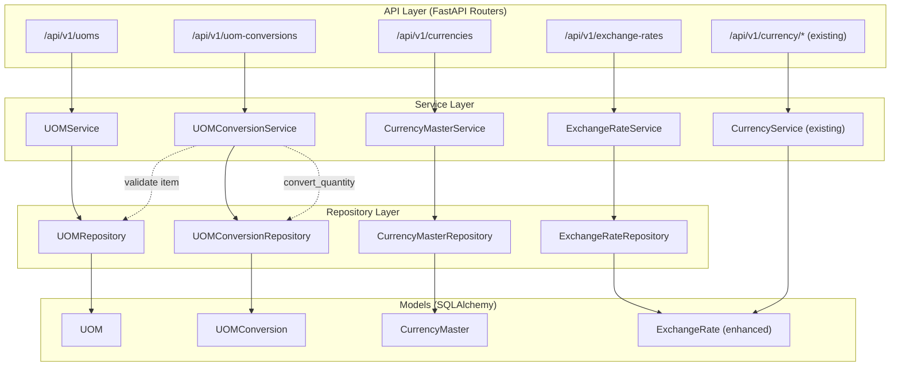
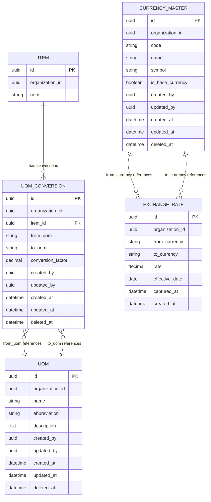

# Design Document: UOM & Currency Master

## Overview

This feature adds four master-data entities (UOM, UOM Conversion, Currency, Currency Exchange Rate) to the core-service, following the existing repository → service → endpoint layered architecture. It also enhances the existing `ExchangeRate` model with multi-tenancy (`organization_id`) and audit (`captured_at`) support, and introduces a reusable `convert_quantity` utility in the service layer.

The design preserves backward compatibility with the existing `/api/v1/currency/*` endpoints while introducing new organization-scoped endpoints under `/api/v1/uoms`, `/api/v1/uom-conversions`, `/api/v1/currencies`, and `/api/v1/exchange-rates`.

Key design decisions:

- **Soft-delete** for UOM, UOM Conversion, and Currency (consistent with Item, Warehouse, etc.)
- **Hard-delete** for Exchange Rate (consistent with existing behavior and requirement 4.6)
- **Unique constraints exclude soft-deleted rows** via partial indexes (PostgreSQL `WHERE deleted_at IS NULL`)
- **Reverse-lookup fallback** in `convert_quantity` to minimize data entry burden
- **Single base currency enforcement** at the service layer via a toggle pattern (set all others to false, then set the target to true)

## Architecture



### Layer Responsibilities

- **Endpoints**: Request parsing, authentication via `get_current_active_user`, permission checks via `require_permission`, HTTP status codes, response serialization.
- **Services**: Business rules (uniqueness, base-currency toggle, reverse-lookup), orchestration of repository calls, raising domain exceptions.
- **Repositories**: Pure data access — CRUD, filtering, pagination, soft-delete. No business logic.
- **Models**: SQLAlchemy ORM definitions, constraints, indexes.

## Components and Interfaces

### New Files

| Layer      | File                                             | Purpose                                                                |
| ---------- | ------------------------------------------------ | ---------------------------------------------------------------------- |
| Model      | `app/models/uom.py`                              | UOM SQLAlchemy model                                                   |
| Model      | `app/models/uom_conversion.py`                   | UOMConversion SQLAlchemy model                                         |
| Model      | `app/models/currency_master.py`                  | CurrencyMaster SQLAlchemy model                                        |
| Schema     | `app/schemas/uom.py`                             | UOM Pydantic schemas (Base, Create, Update, Response, List)            |
| Schema     | `app/schemas/uom_conversion.py`                  | UOMConversion Pydantic schemas                                         |
| Schema     | `app/schemas/currency_master.py`                 | CurrencyMaster Pydantic schemas                                        |
| Schema     | `app/schemas/exchange_rate.py`                   | ExchangeRate Pydantic schemas (extracted from inline endpoint schemas) |
| Repository | `app/repositories/uom_repository.py`             | UOM data access                                                        |
| Repository | `app/repositories/uom_conversion_repository.py`  | UOMConversion data access                                              |
| Repository | `app/repositories/currency_master_repository.py` | CurrencyMaster data access                                             |
| Repository | `app/repositories/exchange_rate_repository.py`   | ExchangeRate data access                                               |
| Service    | `app/services/uom_service.py`                    | UOM business logic                                                     |
| Service    | `app/services/uom_conversion_service.py`         | UOMConversion business logic + `convert_quantity`                      |
| Service    | `app/services/currency_master_service.py`        | CurrencyMaster business logic                                          |
| Service    | `app/services/exchange_rate_service.py`          | ExchangeRate business logic (org-scoped)                               |
| Endpoint   | `app/api/v1/endpoints/uoms.py`                   | UOM REST endpoints                                                     |
| Endpoint   | `app/api/v1/endpoints/uom_conversions.py`        | UOMConversion REST endpoints                                           |
| Endpoint   | `app/api/v1/endpoints/currencies.py`             | CurrencyMaster REST endpoints                                          |
| Endpoint   | `app/api/v1/endpoints/exchange_rates.py`         | ExchangeRate REST endpoints (org-scoped)                               |

### Modified Files

| File                          | Change                                                                 |
| ----------------------------- | ---------------------------------------------------------------------- |
| `app/models/exchange_rate.py` | Add `organization_id`, `captured_at` columns; update unique constraint |
| `app/api/v1/router.py`        | Register 4 new routers                                                 |
| `app/models/base.py`          | No changes needed (no new enums required)                              |

### API Contracts

#### UOM Endpoints (`/api/v1/uoms`)

| Method | Path         | Request Body                       | Response          | Status |
| ------ | ------------ | ---------------------------------- | ----------------- | ------ |
| POST   | `/uoms`      | `UOMCreate`                        | `UOMResponse`     | 201    |
| GET    | `/uoms`      | — (query: page, page_size, search) | `UOMListResponse` | 200    |
| GET    | `/uoms/{id}` | —                                  | `UOMResponse`     | 200    |
| PATCH  | `/uoms/{id}` | `UOMUpdate`                        | `UOMResponse`     | 200    |
| DELETE | `/uoms/{id}` | —                                  | —                 | 204    |

#### UOM Conversion Endpoints (`/api/v1/uom-conversions`)

| Method | Path                    | Request Body                        | Response                    | Status |
| ------ | ----------------------- | ----------------------------------- | --------------------------- | ------ |
| POST   | `/uom-conversions`      | `UOMConversionCreate`               | `UOMConversionResponse`     | 201    |
| GET    | `/uom-conversions`      | — (query: item_id, page, page_size) | `UOMConversionListResponse` | 200    |
| GET    | `/uom-conversions/{id}` | —                                   | `UOMConversionResponse`     | 200    |
| PATCH  | `/uom-conversions/{id}` | `UOMConversionUpdate`               | `UOMConversionResponse`     | 200    |
| DELETE | `/uom-conversions/{id}` | —                                   | —                           | 204    |

#### Currency Endpoints (`/api/v1/currencies`)

| Method | Path               | Request Body                       | Response                     | Status |
| ------ | ------------------ | ---------------------------------- | ---------------------------- | ------ |
| POST   | `/currencies`      | `CurrencyMasterCreate`             | `CurrencyMasterResponse`     | 201    |
| GET    | `/currencies`      | — (query: page, page_size, search) | `CurrencyMasterListResponse` | 200    |
| GET    | `/currencies/{id}` | —                                  | `CurrencyMasterResponse`     | 200    |
| PATCH  | `/currencies/{id}` | `CurrencyMasterUpdate`             | `CurrencyMasterResponse`     | 200    |
| DELETE | `/currencies/{id}` | —                                  | —                            | 204    |

#### Exchange Rate Endpoints (`/api/v1/exchange-rates`)

| Method | Path                   | Request Body                                                                 | Response                   | Status |
| ------ | ---------------------- | ---------------------------------------------------------------------------- | -------------------------- | ------ |
| POST   | `/exchange-rates`      | `ExchangeRateCreate`                                                         | `ExchangeRateResponse`     | 201    |
| GET    | `/exchange-rates`      | — (query: from_currency, to_currency, start_date, end_date, page, page_size) | `ExchangeRateListResponse` | 200    |
| GET    | `/exchange-rates/{id}` | —                                                                            | `ExchangeRateResponse`     | 200    |
| PUT    | `/exchange-rates/{id}` | `ExchangeRateUpdate`                                                         | `ExchangeRateResponse`     | 200    |
| DELETE | `/exchange-rates/{id}` | —                                                                            | —                          | 204    |

</text>
</invoke>

## Data Models

### UOM Model (`app/models/uom.py`)

```python
class UOM(Base):
    __tablename__ = "uoms"

    id = Column(UUID(as_uuid=True), primary_key=True, default=uuid.uuid4)
    organization_id = Column(UUID(as_uuid=True), nullable=False, index=True)
    name = Column(String(50), nullable=False)
    abbreviation = Column(String(10), nullable=False)
    description = Column(Text, nullable=True)

    # Audit fields
    created_by = Column(UUID(as_uuid=True), nullable=True)
    updated_by = Column(UUID(as_uuid=True), nullable=True)
    created_at = Column(DateTime(timezone=True), default=lambda: datetime.now(UTC))
    updated_at = Column(DateTime(timezone=True), default=lambda: datetime.now(UTC), onupdate=lambda: datetime.now(UTC))
    deleted_at = Column(DateTime(timezone=True), nullable=True)

    __table_args__ = (
        UniqueConstraint('organization_id', 'name', name='uq_uom_org_name',
                         postgresql_where=text("deleted_at IS NULL")),
        UniqueConstraint('organization_id', 'abbreviation', name='uq_uom_org_abbr',
                         postgresql_where=text("deleted_at IS NULL")),
        Index('ix_uoms_org_id', 'organization_id'),
    )
```

### UOM Conversion Model (`app/models/uom_conversion.py`)

```python
class UOMConversion(Base):
    __tablename__ = "uom_conversions"

    id = Column(UUID(as_uuid=True), primary_key=True, default=uuid.uuid4)
    organization_id = Column(UUID(as_uuid=True), nullable=False, index=True)
    item_id = Column(UUID(as_uuid=True), ForeignKey("items.id"), nullable=False, index=True)
    from_uom = Column(String(50), nullable=False)
    to_uom = Column(String(50), nullable=False)
    conversion_factor = Column(Numeric(19, 6), nullable=False)

    # Audit fields
    created_by = Column(UUID(as_uuid=True), nullable=True)
    updated_by = Column(UUID(as_uuid=True), nullable=True)
    created_at = Column(DateTime(timezone=True), default=lambda: datetime.now(UTC))
    updated_at = Column(DateTime(timezone=True), default=lambda: datetime.now(UTC), onupdate=lambda: datetime.now(UTC))
    deleted_at = Column(DateTime(timezone=True), nullable=True)

    __table_args__ = (
        UniqueConstraint('organization_id', 'item_id', 'from_uom', 'to_uom',
                         name='uq_uom_conv_org_item_pair',
                         postgresql_where=text("deleted_at IS NULL")),
        CheckConstraint('conversion_factor > 0', name='ck_uom_conv_positive_factor'),
        Index('ix_uom_conversions_item', 'item_id'),
    )
```

### Currency Master Model (`app/models/currency_master.py`)

```python
class CurrencyMaster(Base):
    __tablename__ = "currency_masters"

    id = Column(UUID(as_uuid=True), primary_key=True, default=uuid.uuid4)
    organization_id = Column(UUID(as_uuid=True), nullable=False, index=True)
    code = Column(String(3), nullable=False)
    name = Column(String(100), nullable=False)
    symbol = Column(String(5), nullable=True)
    is_base_currency = Column(Boolean, default=False, nullable=False)

    # Audit fields
    created_by = Column(UUID(as_uuid=True), nullable=True)
    updated_by = Column(UUID(as_uuid=True), nullable=True)
    created_at = Column(DateTime(timezone=True), default=lambda: datetime.now(UTC))
    updated_at = Column(DateTime(timezone=True), default=lambda: datetime.now(UTC), onupdate=lambda: datetime.now(UTC))
    deleted_at = Column(DateTime(timezone=True), nullable=True)

    __table_args__ = (
        UniqueConstraint('organization_id', 'code', name='uq_currency_org_code',
                         postgresql_where=text("deleted_at IS NULL")),
        Index('ix_currency_masters_org_id', 'organization_id'),
    )
```

### Enhanced Exchange Rate Model (`app/models/exchange_rate.py`)

Changes to the existing model (additive, backward-compatible):

```python
class ExchangeRate(Base):
    __tablename__ = "exchange_rates"

    id = Column(UUID(as_uuid=True), primary_key=True, default=uuid.uuid4)
    organization_id = Column(UUID(as_uuid=True), nullable=True, index=True)  # nullable for backward compat
    from_currency = Column(String(3), nullable=False)
    to_currency = Column(String(3), nullable=False)
    rate = Column(Numeric(19, 6), nullable=False)
    effective_date = Column(Date, nullable=False)
    captured_at = Column(DateTime(timezone=True), nullable=True, default=lambda: datetime.now(UTC))
    created_at = Column(DateTime(timezone=True), nullable=False, default=lambda: datetime.now(UTC))

    __table_args__ = (
        UniqueConstraint('from_currency', 'to_currency', 'effective_date',
                         name='uq_exchange_rate_currency_date'),
        CheckConstraint('rate > 0', name='ck_exchange_rate_positive'),
        Index('ix_exchange_rates_currencies', 'from_currency', 'to_currency'),
        Index('ix_exchange_rates_effective_date', 'effective_date'),
        Index('ix_exchange_rates_org_id', 'organization_id'),
    )
```

Design decision: `organization_id` is nullable on ExchangeRate to maintain backward compatibility with existing rows that lack it. The new `/api/v1/exchange-rates` endpoints always set it; the legacy `/api/v1/currency/*` endpoints continue to work without it.

### ER Diagram



### Pydantic Schemas

#### UOM Schemas (`app/schemas/uom.py`)

```python
class UOMBase(BaseModel):
    name: str = Field(..., min_length=1, max_length=50)
    abbreviation: str = Field(..., min_length=1, max_length=10)
    description: str | None = None

class UOMCreate(UOMBase):
    pass

class UOMUpdate(BaseModel):
    name: str | None = Field(None, min_length=1, max_length=50)
    abbreviation: str | None = Field(None, min_length=1, max_length=10)
    description: str | None = None

class UOMResponse(BaseModel):
    id: UUID
    organization_id: UUID
    name: str
    abbreviation: str
    description: str | None = None
    created_by: UUID | None = None
    updated_by: UUID | None = None
    created_at: datetime | None = None
    updated_at: datetime | None = None
    model_config = ConfigDict(from_attributes=True)

class UOMListResponse(BaseModel):
    uoms: list[UOMResponse]
    pagination: PaginationMeta
```

#### UOM Conversion Schemas (`app/schemas/uom_conversion.py`)

```python
class UOMConversionBase(BaseModel):
    item_id: UUID
    from_uom: str = Field(..., min_length=1, max_length=50)
    to_uom: str = Field(..., min_length=1, max_length=50)
    conversion_factor: Decimal = Field(..., gt=0)

class UOMConversionCreate(UOMConversionBase):
    pass

class UOMConversionUpdate(BaseModel):
    from_uom: str | None = Field(None, min_length=1, max_length=50)
    to_uom: str | None = Field(None, min_length=1, max_length=50)
    conversion_factor: Decimal | None = Field(None, gt=0)

class UOMConversionResponse(BaseModel):
    id: UUID
    organization_id: UUID
    item_id: UUID
    from_uom: str
    to_uom: str
    conversion_factor: Decimal
    created_by: UUID | None = None
    updated_by: UUID | None = None
    created_at: datetime | None = None
    updated_at: datetime | None = None
    model_config = ConfigDict(from_attributes=True)

class UOMConversionListResponse(BaseModel):
    uom_conversions: list[UOMConversionResponse]
    pagination: PaginationMeta
```

#### Currency Master Schemas (`app/schemas/currency_master.py`)

```python
class CurrencyMasterBase(BaseModel):
    code: str = Field(..., min_length=3, max_length=3, pattern=r'^[A-Z]{3}$')
    name: str = Field(..., min_length=1, max_length=100)
    symbol: str | None = Field(None, max_length=5)
    is_base_currency: bool = False

class CurrencyMasterCreate(CurrencyMasterBase):
    pass

class CurrencyMasterUpdate(BaseModel):
    name: str | None = Field(None, min_length=1, max_length=100)
    symbol: str | None = Field(None, max_length=5)
    is_base_currency: bool | None = None

class CurrencyMasterResponse(BaseModel):
    id: UUID
    organization_id: UUID
    code: str
    name: str
    symbol: str | None = None
    is_base_currency: bool
    created_by: UUID | None = None
    updated_by: UUID | None = None
    created_at: datetime | None = None
    updated_at: datetime | None = None
    model_config = ConfigDict(from_attributes=True)

class CurrencyMasterListResponse(BaseModel):
    currencies: list[CurrencyMasterResponse]
    pagination: PaginationMeta
```

#### Exchange Rate Schemas (`app/schemas/exchange_rate.py`)

```python
class ExchangeRateCreate(BaseModel):
    from_currency: str = Field(..., min_length=3, max_length=3, pattern=r'^[A-Z]{3}$')
    to_currency: str = Field(..., min_length=3, max_length=3, pattern=r'^[A-Z]{3}$')
    rate: Decimal = Field(..., gt=0)
    effective_date: date | None = None  # defaults to today

class ExchangeRateUpdate(BaseModel):
    rate: Decimal = Field(..., gt=0)
    effective_date: date | None = None

class ExchangeRateResponse(BaseModel):
    id: UUID
    organization_id: UUID | None = None
    from_currency: str
    to_currency: str
    rate: Decimal
    effective_date: date
    captured_at: datetime | None = None
    created_at: datetime | None = None
    model_config = ConfigDict(from_attributes=True)

class ExchangeRateListResponse(BaseModel):
    exchange_rates: list[ExchangeRateResponse]
    pagination: PaginationMeta
```

### Service Layer: `convert_quantity` Method

Located in `UOMConversionService`:

```python
def convert_quantity(
    self,
    item_id: UUID,
    from_uom: str,
    to_uom: str,
    quantity: Decimal,
    organization_id: UUID,
) -> Decimal:
    """
    Convert quantity from one UOM to another for a given item.

    1. If from_uom == to_uom, return quantity as-is.
    2. Look up forward conversion (from_uom → to_uom).
    3. If not found, look up reverse (to_uom → from_uom) and divide.
    4. If neither found, raise ValidationError.
    """
    if from_uom == to_uom:
        return quantity

    # Forward lookup
    forward = self.repo.get_by_item_and_pair(item_id, from_uom, to_uom, organization_id)
    if forward:
        return quantity * forward.conversion_factor

    # Reverse lookup
    reverse = self.repo.get_by_item_and_pair(item_id, to_uom, from_uom, organization_id)
    if reverse:
        return quantity / reverse.conversion_factor

    raise ValidationError(
        f"No UOM conversion found for item {item_id} from '{from_uom}' to '{to_uom}'"
    )
```

## Correctness Properties

_A property is a characteristic or behavior that should hold true across all valid executions of a system — essentially, a formal statement about what the system should do. Properties serve as the bridge between human-readable specifications and machine-verifiable correctness guarantees._

### Property 1: UOM create-then-read round trip

_For any_ valid UOM data (name, abbreviation, description), creating a UOM via POST and then retrieving it via GET by ID should return a record with identical `name`, `abbreviation`, and `description` fields.

**Validates: Requirements 1.1, 1.3**

### Property 2: UOM soft-delete excludes from list

_For any_ UOM that has been soft-deleted, it should not appear in the paginated list returned by GET `/uoms`, and GET by ID should return 404.

**Validates: Requirements 1.2, 1.5**

### Property 3: UOM update reflects changes

_For any_ existing UOM and any valid update payload (subset of name, abbreviation, description), after PATCH the subsequent GET should return the updated values for changed fields and preserve unchanged fields.

**Validates: Requirements 1.4**

### Property 4: UOM duplicate detection within organization

_For any_ organization, creating two UOMs with the same `name` or the same `abbreviation` should fail with HTTP 409 on the second attempt. However, after soft-deleting the first, creating a new one with the same name/abbreviation should succeed.

**Validates: Requirements 1.6, 1.8**

### Property 5: Organization isolation on reads

_For any_ record (UOM, Currency, or UOM Conversion) created in organization A, a request scoped to organization B should receive HTTP 404 when attempting to read it by ID.

**Validates: Requirements 1.7, 3.9**

### Property 6: UOM Conversion create-then-read round trip

_For any_ valid UOM Conversion data (item_id, from_uom, to_uom, conversion_factor), creating it via POST and retrieving via GET by ID should return a record with identical field values.

**Validates: Requirements 2.1, 2.3**

### Property 7: UOM Conversion list filters by item_id

_For any_ set of UOM Conversions across multiple items, filtering the list by a specific `item_id` should return only conversions belonging to that item, and the count should equal the number of non-deleted conversions for that item.

**Validates: Requirements 2.2**

### Property 8: UOM Conversion update reflects changes

_For any_ existing UOM Conversion and any valid update payload, after PATCH the subsequent GET should return the updated values.

**Validates: Requirements 2.4**

### Property 9: UOM Conversion duplicate detection respects soft-delete

_For any_ organization and item, creating two conversions with the same (item_id, from_uom, to_uom) should fail with HTTP 409. After soft-deleting the first, creating a new one with the same triple should succeed.

**Validates: Requirements 2.6, 2.10**

### Property 10: Positive value validation

_For any_ non-positive decimal value (zero or negative), creating or updating a UOM Conversion's `conversion_factor` or an Exchange Rate's `rate` should return HTTP 422.

**Validates: Requirements 2.7, 4.8**

### Property 11: Currency create-then-read round trip

_For any_ valid Currency data (code matching `^[A-Z]{3}$`, name, symbol, is_base_currency), creating via POST and retrieving via GET by ID should return a record with identical field values.

**Validates: Requirements 3.1, 3.3**

### Property 12: Currency soft-delete excludes from list

_For any_ Currency that has been soft-deleted, it should not appear in the paginated list and GET by ID should return 404.

**Validates: Requirements 3.2, 3.5**

### Property 13: Single base currency invariant

_For any_ organization, after any sequence of currency creates and updates, at most one currency should have `is_base_currency = true`. Specifically, setting `is_base_currency = true` on currency X should set it to `false` on all other currencies in the same organization.

**Validates: Requirements 3.6**

### Property 14: Currency code format validation

_For any_ string that does not match the pattern `^[A-Z]{3}$` (e.g., lowercase, wrong length, contains digits), creating a Currency should return HTTP 422.

**Validates: Requirements 3.8**

### Property 15: Currency duplicate code detection

_For any_ organization, creating two currencies with the same `code` should fail with HTTP 409 on the second attempt.

**Validates: Requirements 3.7**

### Property 16: Exchange Rate create-then-read round trip

_For any_ valid Exchange Rate data (from_currency, to_currency, rate, effective_date), creating via POST and retrieving via GET by ID should return a record with identical field values and a non-null `captured_at`.

**Validates: Requirements 4.2, 4.4**

### Property 17: Exchange Rate upsert idempotence

_For any_ Exchange Rate, creating another with the same (organization_id, from_currency, to_currency, effective_date) should update the existing record's rate rather than creating a duplicate. The total count of exchange rates for that key should remain 1.

**Validates: Requirements 4.7**

### Property 18: Exchange Rate same-currency rejection

_For any_ currency code C, creating an Exchange Rate where `from_currency = C` and `to_currency = C` should return HTTP 422.

**Validates: Requirements 4.9**

### Property 19: Exchange Rate hard delete

_For any_ Exchange Rate, after DELETE the record should be completely removed — GET by ID should return 404 and it should not appear in list results.

**Validates: Requirements 4.6**

### Property 20: convert_quantity forward computation

_For any_ item with a UOM conversion (from_uom → to_uom, factor F) and any positive quantity Q, `convert_quantity(item_id, from_uom, to_uom, Q)` should return `Q × F`.

**Validates: Requirements 5.1**

### Property 21: convert_quantity reverse-lookup round trip

_For any_ item with a UOM conversion (A → B, factor F) and any positive quantity Q, converting Q from A to B and then converting the result back from B to A should return a value equal to Q (within decimal precision).

**Validates: Requirements 5.2**

### Property 22: convert_quantity identity for same UOM

_For any_ UOM string U and any quantity Q, `convert_quantity(item_id, U, U, Q)` should return Q without performing a database lookup.

**Validates: Requirements 5.4**

### Property 23: convert_quantity raises on missing conversion

_For any_ item and UOM pair where no conversion record exists (neither forward nor reverse), `convert_quantity` should raise a `ValidationError`.

**Validates: Requirements 5.3**

## Error Handling

### Exception Mapping

| Exception             | HTTP Status | When                                                                                       |
| --------------------- | ----------- | ------------------------------------------------------------------------------------------ |
| `ValidationError`     | 400/422     | Invalid input (negative factor, bad currency code, same-currency rate, missing conversion) |
| `NotFoundError` / 404 | 404         | Record not found or belongs to different org                                               |
| `StateError` / 409    | 409         | Duplicate name/abbreviation/code/triple within org                                         |

### Error Response Format

All errors follow the existing pattern:

```json
{
  "detail": "Descriptive error message"
}
```

### Specific Error Scenarios

| Scenario                               | Status | Message Pattern                                                                |
| -------------------------------------- | ------ | ------------------------------------------------------------------------------ |
| Duplicate UOM name                     | 409    | `"UOM with name '{name}' already exists in this organization"`                 |
| Duplicate UOM abbreviation             | 409    | `"UOM with abbreviation '{abbr}' already exists in this organization"`         |
| Duplicate UOM conversion triple        | 409    | `"UOM conversion for item '{item_id}' from '{from}' to '{to}' already exists"` |
| Duplicate currency code                | 409    | `"Currency with code '{code}' already exists in this organization"`            |
| Non-positive conversion_factor         | 422    | `"conversion_factor must be greater than 0"`                                   |
| Non-positive exchange rate             | 422    | `"rate must be greater than 0"`                                                |
| Invalid currency code format           | 422    | `"code must be exactly 3 uppercase letters"`                                   |
| Same-currency exchange rate            | 422    | `"from_currency and to_currency must be different"`                            |
| Item not found for conversion          | 404    | `"Item '{item_id}' not found in this organization"`                            |
| Record not found                       | 404    | `"{entity} not found"`                                                         |
| No UOM conversion for convert_quantity | 400    | `"No UOM conversion found for item {id} from '{from}' to '{to}'"`              |

## Testing Strategy

### Dual Testing Approach

This feature requires both unit tests and property-based tests:

- **Unit tests**: Verify specific examples, edge cases (empty strings, boundary lengths, null fields), integration between layers (service → repository), and error conditions.
- **Property-based tests**: Verify universal properties across randomly generated inputs using the correctness properties defined above.

### Property-Based Testing Configuration

- **Library**: `hypothesis` (Python's standard PBT library, already available in the ecosystem)
- **Minimum iterations**: 100 per property test
- **Tag format**: Each test tagged with a comment: `# Feature: uom-currency-master, Property {N}: {title}`
- **Each correctness property maps to exactly one property-based test**

### Test Organization

```
core-service/tests/
├── unit/
│   ├── test_uom_service.py           # UOM service unit tests
│   ├── test_uom_conversion_service.py # UOM conversion + convert_quantity unit tests
│   ├── test_currency_master_service.py # Currency master service unit tests
│   └── test_exchange_rate_service.py  # Exchange rate service unit tests
├── property/
│   ├── test_uom_properties.py         # Properties 1-5
│   ├── test_uom_conversion_properties.py # Properties 6-10
│   ├── test_currency_properties.py    # Properties 11-15
│   ├── test_exchange_rate_properties.py # Properties 16-19
│   └── test_convert_quantity_properties.py # Properties 20-23
└── integration/
    ├── test_uom_endpoints.py          # UOM API integration tests
    ├── test_uom_conversion_endpoints.py
    ├── test_currency_endpoints.py
    ├── test_exchange_rate_endpoints.py
    └── test_backward_compat.py        # Existing /currency/* endpoints still work (Req 4.10)
```

### Unit Test Focus Areas

- Specific examples: create a UOM with known values, verify response
- Edge cases: max-length name (50 chars), max-length abbreviation (10 chars), empty description
- Error conditions: duplicate detection, not-found, invalid input
- Service-level: `convert_quantity` with known factor values, reverse lookup, identity case
- Integration: backward compatibility of existing `/api/v1/currency/*` endpoints (Req 4.10)

### Property Test Focus Areas

- Round-trip properties (create → read) for all four entities
- Soft-delete exclusion invariants
- Single base currency invariant under random sequences of creates/updates
- Upsert idempotence for exchange rates
- `convert_quantity` forward/reverse/identity properties
- Organization isolation across all entity types
- Positive-value validation across conversion factors and exchange rates
