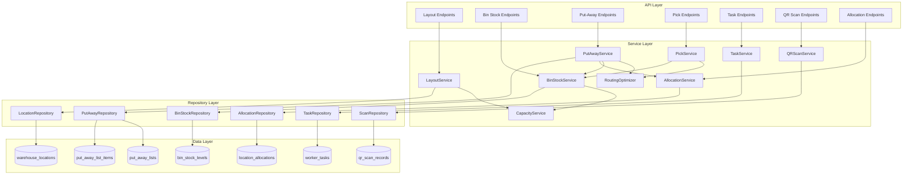

# Design Document: Warehouse Bin Management

## Overview

This feature extends the existing warehouse management system to support granular bin-level storage tracking. The current system uses a flat `warehouses_extended` table with parent-child relationships for basic hierarchy. This design introduces a dedicated `warehouse_locations` table to model the physical layout (Zone → Aisle → Bay → Level → Bin), bin-level stock tracking, optimized put-away/pick routing, worker task assignment with QR-based time tracking, and location allocation for item groups.

### Key Design Decisions

1. **Separate `warehouse_locations` table** rather than reusing `warehouses_extended` — the location hierarchy has different semantics (physical positions, capacity rollup, QR codes) and would bloat the existing warehouse model.
2. **Nearest-neighbor routing heuristic** — provides good-enough optimization without the computational cost of solving TSP exactly. Configurable origin point per warehouse.
3. **Optimistic locking via `version` column** on `bin_stock_levels` — handles concurrent stock updates without pessimistic locks that could bottleneck high-throughput warehouses.
4. **Capacity rollup as a computed aggregate** — `available_capacity` is recalculated on stock changes rather than stored redundantly, avoiding stale data. `total_capacity` is stored and rolled up on structural changes only.
5. **Put-away list as a first-class entity** — separate from pick lists, with its own status lifecycle and item tracking.

## Architecture



### Integration with Existing Systems

- **Stock Levels**: `BinStockService` keeps `stock_levels` (warehouse-level) in sync when bin stock changes.
- **Pick Lists**: `PickService` enhances existing `pick_list_items` with `bin_location_id` and optimized `sort_order`.
- **Put-Away Rules**: `PutAwayService` reads existing `put_away_rules` to determine bin preferences.
- **Stock Movements**: All bin stock changes create `stock_movements` records for audit trail.

## Components and Interfaces

### LayoutService

Manages the warehouse location hierarchy.

```python
class LayoutService:
    def create_location(self, data: LocationCreate, warehouse_id: UUID, org_id: UUID) -> WarehouseLocation
    def get_location_tree(self, warehouse_id: UUID, org_id: UUID) -> list[LocationTreeNode]
    def list_locations(self, warehouse_id: UUID, filters: LocationFilters, org_id: UUID) -> PaginatedLocations
    def get_location_summary(self, location_id: UUID, org_id: UUID) -> LocationSummary
    def deactivate_location(self, location_id: UUID, org_id: UUID) -> WarehouseLocation
    def generate_location_code(self, location: WarehouseLocation) -> str
```

**Hierarchy Validation Rules:**

- `zone` parent must be a warehouse (via `warehouse_id`, no `parent_location_id`)
- `aisle` parent must be a `zone`
- `bay` parent must be an `aisle`
- `level` parent must be a `bay`
- `bin` parent must be a `level`

### CapacityService

Handles capacity rollup calculations.

```python
class CapacityService:
    def rollup_capacity(self, location_id: UUID) -> None
    def compute_available_capacity(self, location_id: UUID) -> int
    def recalculate_ancestors(self, bin_location_id: UUID) -> None
```

**Rollup Algorithm:**

1. On bin capacity change: walk up the tree, summing children's `total_capacity` at each level.
2. On stock change: recompute `available_capacity` = `total_capacity` - sum of stock in subtree.

### BinStockService

Manages bin-level stock quantities.

```python
class BinStockService:
    def add_stock(self, bin_id: UUID, item_id: UUID, quantity: int, org_id: UUID) -> BinStockLevel
    def remove_stock(self, bin_id: UUID, item_id: UUID, quantity: int, org_id: UUID) -> BinStockLevel
    def get_bins_for_item(self, item_id: UUID, warehouse_id: UUID, org_id: UUID) -> list[BinStockInfo]
    def get_bin_stock(self, bin_id: UUID, org_id: UUID) -> list[BinStockLevel]
```

**Concurrency Handling:**

- Uses `version` column with optimistic locking.
- On conflict: retry up to 3 times with the latest version.
- Stock changes are wrapped in a transaction that also updates `stock_levels`.

### PutAwayService

Generates optimized put-away lists.

```python
class PutAwayService:
    def generate_put_away_list(self, receipt_items: list[ReceiptItem], warehouse_id: UUID, org_id: UUID) -> PutAwayList
    def complete_item(self, put_away_list_id: UUID, item_id: UUID, org_id: UUID) -> PutAwayListItem
    def skip_item(self, put_away_list_id: UUID, item_id: UUID, org_id: UUID) -> PutAwayListItem
```

**Bin Assignment Algorithm:**

1. For each item, check `location_allocations` for exclusive/preferred bins.
2. Check `put_away_rules` for item-specific or group-specific preferences.
3. Filter bins by: active, sufficient capacity, matching allocation.
4. Sort candidate bins by priority (from rules), then available capacity descending.
5. Split quantity across bins if single bin insufficient.
6. Pass assigned bins to `RoutingOptimizer` for sort order.

### PickService (Enhancement to existing)

Resolves pick list items to specific bin locations.

```python
class PickService:
    def resolve_bin_locations(self, pick_list_id: UUID, org_id: UUID) -> PickList
    def complete_pick_item(self, pick_list_id: UUID, item_id: UUID, bin_id: UUID, qty: int, org_id: UUID) -> PickListItem
```

**Bin Resolution Strategy:**

1. For each pick item, query `bin_stock_levels` for bins containing the item.
2. Sort by quantity descending (prefer bins with most stock to minimize visits).
3. Allocate from largest bins first; split across bins if needed.
4. Pass resolved bins to `RoutingOptimizer` for optimal traversal order.

### RoutingOptimizer

Calculates optimal traversal order for bin locations.

```python
class RoutingOptimizer:
    def optimize_route(self, locations: list[BinPosition], origin: tuple[int, int] = (0, 0)) -> list[BinPosition]
```

**Algorithm: Nearest-Neighbor with Aisle Grouping**

1. Group locations by aisle (from location code or `parent_location_id`).
2. Within each aisle, sort by position (level, then bin position).
3. Order aisles by nearest-neighbor from origin.
4. Assign sequential `sort_order` integers.

```python
def optimize_route(self, locations: list[BinPosition], origin: tuple[int, int] = (0, 0)) -> list[BinPosition]:
    if not locations:
        return []

    # Group by aisle
    aisle_groups = defaultdict(list)
    for loc in locations:
        aisle_groups[loc.aisle_id].append(loc)

    # Sort within each aisle by position
    for aisle_id in aisle_groups:
        aisle_groups[aisle_id].sort(key=lambda l: (l.position_y, l.position_x))

    # Order aisles by nearest-neighbor from origin
    ordered_aisles = []
    current_pos = origin
    remaining_aisles = list(aisle_groups.keys())

    while remaining_aisles:
        nearest = min(remaining_aisles, key=lambda a: self._aisle_distance(current_pos, aisle_groups[a]))
        ordered_aisles.append(nearest)
        current_pos = self._aisle_exit_position(aisle_groups[nearest])
        remaining_aisles.remove(nearest)

    # Flatten and assign sort_order
    result = []
    for aisle_id in ordered_aisles:
        result.extend(aisle_groups[aisle_id])

    for i, loc in enumerate(result):
        loc.sort_order = i + 1

    return result
```

### TaskService

Manages worker task assignment and lifecycle.

```python
class TaskService:
    def create_task(self, task_type: str, worker_id: UUID, reference_id: UUID, org_id: UUID) -> WorkerTask
    def start_task(self, task_id: UUID, org_id: UUID) -> WorkerTask
    def complete_task(self, task_id: UUID, org_id: UUID) -> WorkerTask
    def cancel_task(self, task_id: UUID, org_id: UUID) -> WorkerTask
    def list_worker_tasks(self, worker_id: UUID, filters: TaskFilters, org_id: UUID) -> list[WorkerTask]
```

### QRScanService

Records QR scan events for time tracking.

```python
class QRScanService:
    def record_scan(self, scan_data: ScanCreate, org_id: UUID) -> QRScanRecord
    def get_time_summary(self, filters: TimeSummaryFilters, org_id: UUID) -> TimeSummary
```

**Validation:**

- `finish` scan requires a preceding `start` scan for the same `task_item_id`.
- `elapsed_seconds` = `finish.scanned_at` - `start.scanned_at`.

### AllocationService

Manages location-to-item-group allocations.

```python
class AllocationService:
    def create_allocation(self, data: AllocationCreate, org_id: UUID) -> LocationAllocation
    def list_allocations(self, warehouse_id: UUID, filters: AllocationFilters, org_id: UUID) -> list[LocationAllocation]
    def deactivate_allocation(self, allocation_id: UUID, org_id: UUID) -> LocationAllocation
    def check_exclusive_conflict(self, location_id: UUID, item_group_id: UUID) -> bool
```

## Data Models

### New Tables

#### `warehouse_locations`

```sql
CREATE TABLE warehouse_locations (
    id                  UUID PRIMARY KEY DEFAULT gen_random_uuid(),
    organization_id     UUID NOT NULL,
    warehouse_id        UUID NOT NULL REFERENCES warehouses_extended(id) ON DELETE CASCADE,
    parent_location_id  UUID REFERENCES warehouse_locations(id) ON DELETE CASCADE,
    location_type       VARCHAR(10) NOT NULL,  -- zone, aisle, bay, level, bin
    code                VARCHAR(50) NOT NULL,   -- short code for this node (e.g., Z01, A03)
    full_code           VARCHAR(255) NOT NULL,  -- concatenated path (e.g., Z01-A03-B02-L04-B01)
    name                VARCHAR(255) NOT NULL,
    total_capacity      INTEGER DEFAULT 0,
    capacity_uom        VARCHAR(50),
    position_x          INTEGER DEFAULT 0,
    position_y          INTEGER DEFAULT 0,
    is_active           BOOLEAN DEFAULT TRUE,
    version             INTEGER DEFAULT 1,
    created_at          TIMESTAMPTZ DEFAULT now(),
    updated_at          TIMESTAMPTZ DEFAULT now(),
    created_by          UUID,
    updated_by          UUID,

    CONSTRAINT chk_location_type CHECK (location_type IN ('zone', 'aisle', 'bay', 'level', 'bin')),
    CONSTRAINT uq_location_code_warehouse UNIQUE (warehouse_id, full_code)
);

CREATE INDEX idx_wl_org ON warehouse_locations(organization_id);
CREATE INDEX idx_wl_warehouse ON warehouse_locations(warehouse_id);
CREATE INDEX idx_wl_parent ON warehouse_locations(parent_location_id);
CREATE INDEX idx_wl_type ON warehouse_locations(location_type);
CREATE INDEX idx_wl_active ON warehouse_locations(is_active);
```

#### `bin_stock_levels`

```sql
CREATE TABLE bin_stock_levels (
    id                  UUID PRIMARY KEY DEFAULT gen_random_uuid(),
    organization_id     UUID NOT NULL,
    bin_location_id     UUID NOT NULL REFERENCES warehouse_locations(id) ON DELETE CASCADE,
    item_id             UUID NOT NULL REFERENCES items(id) ON DELETE CASCADE,
    quantity_on_hand    INTEGER NOT NULL DEFAULT 0,
    quantity_reserved   INTEGER NOT NULL DEFAULT 0,
    version             INTEGER DEFAULT 1,
    created_at          TIMESTAMPTZ DEFAULT now(),
    updated_at          TIMESTAMPTZ DEFAULT now(),

    CONSTRAINT uq_bin_stock UNIQUE (bin_location_id, item_id),
    CONSTRAINT chk_qty_positive CHECK (quantity_on_hand >= 0)
);

CREATE INDEX idx_bsl_org ON bin_stock_levels(organization_id);
CREATE INDEX idx_bsl_bin ON bin_stock_levels(bin_location_id);
CREATE INDEX idx_bsl_item ON bin_stock_levels(item_id);
```

#### `put_away_lists`

```sql
CREATE TABLE put_away_lists (
    id                  UUID PRIMARY KEY DEFAULT gen_random_uuid(),
    organization_id     UUID NOT NULL,
    warehouse_id        UUID NOT NULL REFERENCES warehouses_extended(id) ON DELETE CASCADE,
    put_away_list_no    VARCHAR(100) NOT NULL,
    status              VARCHAR(20) NOT NULL DEFAULT 'pending',
    reference_type      VARCHAR(50),
    reference_id        UUID,
    assigned_to         UUID,
    remarks             TEXT,
    created_by          UUID,
    updated_by          UUID,
    created_at          TIMESTAMPTZ DEFAULT now(),
    updated_at          TIMESTAMPTZ DEFAULT now(),
    completed_at        TIMESTAMPTZ,

    CONSTRAINT chk_pa_status CHECK (status IN ('pending', 'in_progress', 'completed', 'cancelled'))
);

CREATE INDEX idx_pal_org ON put_away_lists(organization_id);
CREATE INDEX idx_pal_warehouse ON put_away_lists(warehouse_id);
CREATE INDEX idx_pal_status ON put_away_lists(status);
```

#### `put_away_list_items`

```sql
CREATE TABLE put_away_list_items (
    id                  UUID PRIMARY KEY DEFAULT gen_random_uuid(),
    organization_id     UUID NOT NULL,
    put_away_list_id    UUID NOT NULL REFERENCES put_away_lists(id) ON DELETE CASCADE,
    item_id             UUID NOT NULL REFERENCES items(id) ON DELETE CASCADE,
    bin_location_id     UUID NOT NULL REFERENCES warehouse_locations(id),
    qty                 NUMERIC(15, 3) NOT NULL,
    completed_qty       NUMERIC(15, 3) DEFAULT 0,
    uom                 VARCHAR(50) NOT NULL,
    sort_order          INTEGER DEFAULT 0,
    status              VARCHAR(20) NOT NULL DEFAULT 'pending',
    created_at          TIMESTAMPTZ DEFAULT now(),
    updated_at          TIMESTAMPTZ DEFAULT now(),

    CONSTRAINT chk_pai_status CHECK (status IN ('pending', 'completed', 'skipped'))
);

CREATE INDEX idx_pali_list ON put_away_list_items(put_away_list_id);
CREATE INDEX idx_pali_bin ON put_away_list_items(bin_location_id);
```

#### `worker_tasks`

```sql
CREATE TABLE worker_tasks (
    id                  UUID PRIMARY KEY DEFAULT gen_random_uuid(),
    organization_id     UUID NOT NULL,
    task_type           VARCHAR(20) NOT NULL,  -- put_away, pick
    worker_id           UUID NOT NULL,
    reference_id        UUID NOT NULL,         -- put_away_list_id or pick_list_id
    reference_type      VARCHAR(50) NOT NULL,  -- put_away_list, pick_list
    status              VARCHAR(20) NOT NULL DEFAULT 'assigned',
    assigned_at         TIMESTAMPTZ DEFAULT now(),
    started_at          TIMESTAMPTZ,
    completed_at        TIMESTAMPTZ,
    created_at          TIMESTAMPTZ DEFAULT now(),
    updated_at          TIMESTAMPTZ DEFAULT now(),

    CONSTRAINT chk_wt_type CHECK (task_type IN ('put_away', 'pick')),
    CONSTRAINT chk_wt_status CHECK (status IN ('assigned', 'in_progress', 'completed', 'cancelled'))
);

CREATE INDEX idx_wt_org ON worker_tasks(organization_id);
CREATE INDEX idx_wt_worker ON worker_tasks(worker_id);
CREATE INDEX idx_wt_status ON worker_tasks(status);
CREATE INDEX idx_wt_reference ON worker_tasks(reference_id);
```

#### `qr_scan_records`

```sql
CREATE TABLE qr_scan_records (
    id                  UUID PRIMARY KEY DEFAULT gen_random_uuid(),
    organization_id     UUID NOT NULL,
    worker_task_id      UUID NOT NULL REFERENCES worker_tasks(id) ON DELETE CASCADE,
    task_item_id        UUID NOT NULL,         -- put_away_list_item_id or pick_list_item_id
    location_code       VARCHAR(255) NOT NULL,
    scan_type           VARCHAR(10) NOT NULL,  -- start, finish
    scanned_at          TIMESTAMPTZ NOT NULL,
    elapsed_seconds     INTEGER,               -- computed on finish scan
    created_at          TIMESTAMPTZ DEFAULT now(),

    CONSTRAINT chk_scan_type CHECK (scan_type IN ('start', 'finish'))
);

CREATE INDEX idx_qsr_org ON qr_scan_records(organization_id);
CREATE INDEX idx_qsr_task ON qr_scan_records(worker_task_id);
CREATE INDEX idx_qsr_item ON qr_scan_records(task_item_id);
```

#### `location_allocations`

```sql
CREATE TABLE location_allocations (
    id                  UUID PRIMARY KEY DEFAULT gen_random_uuid(),
    organization_id     UUID NOT NULL,
    location_id         UUID NOT NULL REFERENCES warehouse_locations(id) ON DELETE CASCADE,
    item_group_id       UUID NOT NULL REFERENCES item_groups(id) ON DELETE CASCADE,
    allocation_type     VARCHAR(20) NOT NULL DEFAULT 'preferred',
    priority            INTEGER DEFAULT 0,
    is_active           BOOLEAN DEFAULT TRUE,
    created_at          TIMESTAMPTZ DEFAULT now(),
    updated_at          TIMESTAMPTZ DEFAULT now(),
    created_by          UUID,
    updated_by          UUID,

    CONSTRAINT chk_alloc_type CHECK (allocation_type IN ('exclusive', 'preferred')),
    CONSTRAINT uq_exclusive_alloc UNIQUE (location_id, allocation_type)
        -- partial unique: only one exclusive allocation per location
);

CREATE INDEX idx_la_org ON location_allocations(organization_id);
CREATE INDEX idx_la_location ON location_allocations(location_id);
CREATE INDEX idx_la_item_group ON location_allocations(item_group_id);
```

### Modifications to Existing Tables

#### `pick_list_items` — Add bin location reference

```sql
ALTER TABLE pick_list_items ADD COLUMN bin_location_id UUID REFERENCES warehouse_locations(id);
```

#### `warehouses_extended` — No schema changes

The existing `total_capacity` field on `warehouses_extended` will be updated by `CapacityService` when the warehouse has child locations (zones). No new columns needed.

### SQLAlchemy Models

```python
# app/models/warehouse_location.py

class LocationType(str, enum.Enum):
    ZONE = "zone"
    AISLE = "aisle"
    BAY = "bay"
    LEVEL = "level"
    BIN = "bin"

class WarehouseLocation(Base):
    __tablename__ = "warehouse_locations"

    id = Column(UUID(as_uuid=True), primary_key=True, default=uuid.uuid4)
    organization_id = Column(UUID(as_uuid=True), nullable=False, index=True)
    warehouse_id = Column(UUID(as_uuid=True), ForeignKey("warehouses_extended.id", ondelete="CASCADE"), nullable=False)
    parent_location_id = Column(UUID(as_uuid=True), ForeignKey("warehouse_locations.id", ondelete="CASCADE"), nullable=True)
    location_type = Column(Enum(LocationType), nullable=False)
    code = Column(String(50), nullable=False)
    full_code = Column(String(255), nullable=False)
    name = Column(String(255), nullable=False)
    total_capacity = Column(Integer, default=0)
    capacity_uom = Column(String(50), nullable=True)
    position_x = Column(Integer, default=0)
    position_y = Column(Integer, default=0)
    is_active = Column(Boolean, default=True)
    version = Column(Integer, default=1)
    created_at = Column(DateTime(timezone=True), default=lambda: datetime.now(UTC))
    updated_at = Column(DateTime(timezone=True), default=lambda: datetime.now(UTC), onupdate=lambda: datetime.now(UTC))
    created_by = Column(UUID(as_uuid=True), nullable=True)
    updated_by = Column(UUID(as_uuid=True), nullable=True)

    parent = relationship("WarehouseLocation", remote_side=[id], backref="children")
    warehouse = relationship("Warehouse", backref="locations")
```

## Correctness Properties

_A property is a characteristic or behavior that should hold true across all valid executions of a system — essentially, a formal statement about what the system should do. Properties serve as the bridge between human-readable specifications and machine-verifiable correctness guarantees._

### Property 1: Hierarchy Validation

_For any_ location type and parent type pair, the LayoutService SHALL accept the creation only when the parent type is the immediate predecessor in the chain (warehouse→zone→aisle→bay→level→bin), and SHALL reject all other combinations with a validation error.

**Validates: Requirements 1.2, 1.3**

### Property 2: Full Code Concatenation

_For any_ valid location hierarchy, the `full_code` of a location node SHALL equal the hyphen-joined concatenation of all ancestor `code` values from root to leaf (e.g., if ancestors have codes ["Z01", "A03", "B02"] and the node's code is "L04", then full_code = "Z01-A03-B02-L04").

**Validates: Requirements 1.4**

### Property 3: Deactivated Location Blocks Stock

_For any_ deactivated location and any of its descendant locations, attempting to add stock SHALL be rejected, regardless of available capacity.

**Validates: Requirements 1.6**

### Property 4: Capacity Rollup Invariant

_For any_ location that has children, its `total_capacity` SHALL equal the sum of all direct children's `total_capacity` values. This invariant SHALL hold after any structural change (bin added, removed, capacity updated, or deactivated).

**Validates: Requirements 2.1, 2.2, 2.3, 2.4, 2.6**

### Property 5: Available Capacity Formula

_For any_ location in the hierarchy, `available_capacity` SHALL equal `total_capacity` minus the sum of all `quantity_on_hand` values in `bin_stock_levels` within that location's subtree.

**Validates: Requirements 2.5**

### Property 6: Stock Add/Remove Round-Trip

_For any_ bin, item, and positive quantity Q, adding Q units and then removing Q units SHALL return the bin's `quantity_on_hand` to its original value.

**Validates: Requirements 3.2, 3.3**

### Property 7: Bin-to-Warehouse Stock Consistency

_For any_ item in a warehouse, the warehouse-level `stock_levels.quantity_on_hand` SHALL equal the sum of all `bin_stock_levels.quantity_on_hand` for that item across all bins in that warehouse, after any sequence of stock operations.

**Validates: Requirements 3.4**

### Property 8: Capacity Overflow Rejection

_For any_ bin with `total_capacity` C and current total stock S (sum of all items' quantity_on_hand), attempting to add a quantity that would make the total exceed C SHALL be rejected, and the bin's stock SHALL remain unchanged.

**Validates: Requirements 3.5**

### Property 9: Put-Away Completeness and Capacity Respect

_For any_ stock receipt processed by the PutAwayService: (a) the sum of assigned quantities across all bins for each item SHALL equal the received quantity for that item, and (b) no individual bin assignment SHALL exceed that bin's available capacity at the time of assignment.

**Validates: Requirements 4.1, 4.3, 4.4**

### Property 10: Routing Optimizer Correctness

_For any_ list of bin locations passed to the RoutingOptimizer: (a) the output SHALL be a permutation of the input (no locations added or lost), (b) `sort_order` SHALL be assigned as sequential integers 1..N, and (c) all bins belonging to the same aisle SHALL be contiguous in the output sequence.

**Validates: Requirements 4.5, 5.4, 6.1, 6.3, 6.4**

### Property 11: Pick Resolution Correctness

_For any_ pick list resolved by the PickService: (a) the total resolved quantity for each item SHALL equal the requested quantity, (b) every resolved bin SHALL contain the requested item with quantity_on_hand >= the allocated amount, and (c) bins SHALL be selected in descending order of available quantity.

**Validates: Requirements 5.1, 5.2, 5.3**

### Property 12: Elapsed Seconds Calculation

_For any_ pair of start and finish scan timestamps where finish > start, the computed `elapsed_seconds` SHALL equal the difference between finish and start timestamps in whole seconds.

**Validates: Requirements 8.3**

### Property 13: Finish Without Start Rejection

_For any_ finish scan event where no preceding start scan exists for the same `task_item_id`, the QRScanService SHALL reject the scan with a validation error.

**Validates: Requirements 8.4**

### Property 14: Status Transition on Item Completion

_For any_ put-away list or pick list with N items: (a) when the first item is completed and the list was in PENDING status, the list SHALL transition to IN_PROGRESS, (b) when all N items are completed, the list SHALL transition to COMPLETED.

**Validates: Requirements 10.2, 10.3, 10.6**

### Property 15: Skipped Items Don't Affect Stock

_For any_ put-away list item that is marked as SKIPPED, the bin stock levels for that item and bin SHALL remain unchanged compared to before the skip operation.

**Validates: Requirements 10.5**

### Property 16: Location Filtering Correctness

_For any_ combination of filters (location_type, parent_location_id, is_active, has_stock, search term) applied to the location list endpoint, every returned location SHALL satisfy ALL applied filter criteria simultaneously.

**Validates: Requirements 11.1, 11.3, 11.4**

### Property 17: Location Summary Accuracy

_For any_ location, the summary values (total_bins, occupied_bins, total_capacity, used_capacity, available_capacity) SHALL match the actual computed values derived from traversing the location's subtree and aggregating bin stock data.

**Validates: Requirements 11.5**

### Property 18: Exclusive Allocation Enforcement

_For any_ location with an exclusive allocation for item_group G, the PutAwayService SHALL never assign items from a different item group to that location or any of its descendants, regardless of available capacity.

**Validates: Requirements 12.3, 12.5, 12.6**

### Property 19: No Overlapping Exclusive Allocations

_For any_ location that already has an active exclusive allocation for item_group G, attempting to create another exclusive allocation for a different item_group H on the same location SHALL be rejected.

**Validates: Requirements 12.8**

## Error Handling

### Validation Errors (422)

| Scenario                               | Error Message                                                                       |
| -------------------------------------- | ----------------------------------------------------------------------------------- |
| Invalid parent type for location       | `"Invalid parent: {child_type} must have a {expected_parent_type} parent"`          |
| Duplicate location code in warehouse   | `"Location with code '{full_code}' already exists in this warehouse"`               |
| Stock addition exceeds bin capacity    | `"Insufficient capacity in bin {code}: available={available}, requested={qty}"`     |
| Stock removal exceeds quantity on hand | `"Insufficient stock in bin {code}: available={on_hand}, requested={qty}"`          |
| Stock addition to inactive location    | `"Cannot add stock to inactive location {code} or its descendants"`                 |
| Overlapping exclusive allocation       | `"Location {code} already has an exclusive allocation for item group {group}"`      |
| Finish scan without start              | `"No start scan found for task item {task_item_id}"`                                |
| Put-away insufficient bin capacity     | `"Cannot assign {qty} units of item {item_code}: no bins with sufficient capacity"` |

### Not Found Errors (404)

| Scenario                | Error Message                            |
| ----------------------- | ---------------------------------------- |
| Location not found      | `"Location with ID {id} not found"`      |
| Warehouse not found     | `"Warehouse with ID {id} not found"`     |
| Put-away list not found | `"Put-away list with ID {id} not found"` |
| Worker task not found   | `"Worker task with ID {id} not found"`   |

### Conflict Errors (409)

| Scenario                  | Error Message                                                  |
| ------------------------- | -------------------------------------------------------------- |
| Optimistic lock conflict  | `"Concurrent modification detected. Please retry."`            |
| Invalid status transition | `"Cannot transition from {current_status} to {target_status}"` |

### Concurrency Strategy

- **Optimistic locking** on `bin_stock_levels` and `warehouse_locations` via `version` column.
- On version mismatch: retry up to 3 times with exponential backoff (50ms, 100ms, 200ms).
- If all retries fail: return 409 Conflict to the client.
- All stock operations (bin + warehouse level) wrapped in a single database transaction.

## Testing Strategy

### Property-Based Testing

**Library:** [Hypothesis](https://hypothesis.readthedocs.io/) (Python)

**Configuration:** Minimum 100 iterations per property test.

**Tag format:** `Feature: warehouse-bin-management, Property {number}: {property_text}`

Each of the 19 correctness properties above will be implemented as a single property-based test using Hypothesis strategies to generate:

- Random location hierarchies (trees of varying depth and breadth)
- Random bin capacities and stock quantities
- Random item/bin/warehouse combinations
- Random put-away receipts and pick requests
- Random position coordinates for routing tests
- Random timestamp pairs for elapsed time tests
- Random filter combinations for query tests

### Unit Tests (Example-Based)

Unit tests cover specific examples, edge cases, and integration points:

- **Layout creation**: Create one location of each type, verify fields stored correctly
- **Tree endpoint**: Build a 3-level hierarchy, verify tree structure returned
- **Default origin**: Call routing optimizer without origin, verify (0,0) behavior
- **Task creation**: Assign a list to a worker, verify all fields populated
- **QR scan recording**: Submit start/finish scans, verify records created
- **Allocation CRUD**: Create/list/deactivate allocations
- **Pagination**: Create 50 locations, verify page_size=20 returns correct pages
- **Status enum values**: Verify all required status values exist

### Integration Tests

- **Full put-away flow**: Receipt → generate list → assign worker → scan start → complete items → scan finish → verify stock updated
- **Full pick flow**: Create pick list → resolve bins → assign worker → complete picks → verify stock decremented
- **Concurrent stock updates**: Simulate two workers completing items on the same bin simultaneously
- **Capacity rollup cascade**: Add bins at various levels, verify warehouse total_capacity updates
- **Cross-system consistency**: After bin operations, verify `stock_levels` and `stock_movements` are in sync

### Test Organization

```
tests/
├── unit/
│   ├── test_layout_service.py
│   ├── test_capacity_service.py
│   ├── test_bin_stock_service.py
│   ├── test_put_away_service.py
│   ├── test_pick_service.py
│   ├── test_routing_optimizer.py
│   ├── test_task_service.py
│   ├── test_qr_scan_service.py
│   └── test_allocation_service.py
├── property/
│   ├── test_hierarchy_properties.py      # Properties 1-3
│   ├── test_capacity_properties.py       # Properties 4-5
│   ├── test_stock_properties.py          # Properties 6-8
│   ├── test_put_away_properties.py       # Properties 9, 18-19
│   ├── test_routing_properties.py        # Property 10
│   ├── test_pick_properties.py           # Property 11
│   ├── test_scan_properties.py           # Properties 12-13
│   ├── test_status_properties.py         # Properties 14-15
│   └── test_query_properties.py          # Properties 16-17
└── integration/
    ├── test_put_away_flow.py
    ├── test_pick_flow.py
    ├── test_concurrent_stock.py
    └── test_capacity_cascade.py
```

## API Endpoints

### Location Management

| Method | Path                                                                   | Description                 |
| ------ | ---------------------------------------------------------------------- | --------------------------- |
| POST   | `/api/v1/warehouses/{warehouse_id}/locations`                          | Create a location node      |
| GET    | `/api/v1/warehouses/{warehouse_id}/locations/tree`                     | Get full hierarchy tree     |
| GET    | `/api/v1/warehouses/{warehouse_id}/locations`                          | List locations with filters |
| GET    | `/api/v1/warehouses/{warehouse_id}/locations/{location_id}`            | Get location detail         |
| GET    | `/api/v1/warehouses/{warehouse_id}/locations/{location_id}/summary`    | Get subtree summary         |
| PATCH  | `/api/v1/warehouses/{warehouse_id}/locations/{location_id}`            | Update location             |
| POST   | `/api/v1/warehouses/{warehouse_id}/locations/{location_id}/deactivate` | Deactivate location         |

### Bin Stock Management

| Method | Path                                         | Description              |
| ------ | -------------------------------------------- | ------------------------ |
| POST   | `/api/v1/bin-stock/add`                      | Add stock to a bin       |
| POST   | `/api/v1/bin-stock/remove`                   | Remove stock from a bin  |
| GET    | `/api/v1/bin-stock/by-item/{item_id}`        | Get all bins for an item |
| GET    | `/api/v1/bin-stock/by-bin/{bin_location_id}` | Get all stock in a bin   |

### Put-Away Management

| Method | Path                                                   | Description                         |
| ------ | ------------------------------------------------------ | ----------------------------------- |
| POST   | `/api/v1/put-away-lists/generate`                      | Generate put-away list from receipt |
| GET    | `/api/v1/put-away-lists`                               | List put-away lists                 |
| GET    | `/api/v1/put-away-lists/{id}`                          | Get put-away list detail            |
| POST   | `/api/v1/put-away-lists/{id}/items/{item_id}/complete` | Complete a put-away item            |
| POST   | `/api/v1/put-away-lists/{id}/items/{item_id}/skip`     | Skip a put-away item                |

### Pick List Enhancement

| Method | Path                                               | Description                         |
| ------ | -------------------------------------------------- | ----------------------------------- |
| POST   | `/api/v1/pick-lists/{id}/resolve-bins`             | Resolve pick items to bin locations |
| POST   | `/api/v1/pick-lists/{id}/items/{item_id}/complete` | Complete a pick item from bin       |

### Worker Tasks

| Method | Path                                 | Description                                 |
| ------ | ------------------------------------ | ------------------------------------------- |
| POST   | `/api/v1/worker-tasks`               | Create/assign a worker task                 |
| GET    | `/api/v1/worker-tasks`               | List tasks (filter by worker, status, date) |
| GET    | `/api/v1/worker-tasks/{id}`          | Get task detail                             |
| POST   | `/api/v1/worker-tasks/{id}/start`    | Start a task                                |
| POST   | `/api/v1/worker-tasks/{id}/complete` | Complete a task                             |
| POST   | `/api/v1/worker-tasks/{id}/cancel`   | Cancel a task                               |

### QR Scan & Time Tracking

| Method | Path                       | Description               |
| ------ | -------------------------- | ------------------------- |
| POST   | `/api/v1/qr-scans`         | Record a QR scan event    |
| GET    | `/api/v1/qr-scans/summary` | Get time tracking summary |

### Location Allocations

| Method | Path                                           | Description                                         |
| ------ | ---------------------------------------------- | --------------------------------------------------- |
| POST   | `/api/v1/location-allocations`                 | Create an allocation                                |
| GET    | `/api/v1/location-allocations`                 | List allocations (filter by warehouse, group, type) |
| GET    | `/api/v1/location-allocations/{id}`            | Get allocation detail                               |
| POST   | `/api/v1/location-allocations/{id}/deactivate` | Deactivate an allocation                            |
