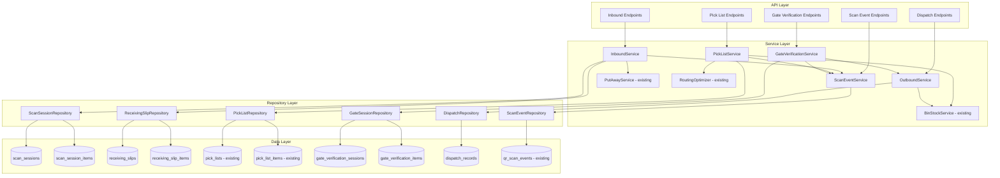

# Design Document: Warehouse QR-Based Inbound/Outbound Workflow

## Overview

This feature implements a QR code-driven warehouse inbound and outbound workflow on top of the existing warehouse bin management system. Workers scan self-contained QR codes (embedded SKU, quantity, batch) during receiving to create receiving slips and trigger put-away, and during dispatch to fulfill pick lists triggered by SAP sales invoices. A gate verification step ensures all items are accounted for before vehicle departure.

### Key Design Decisions

1. **Self-contained QR payloads** — QR codes embed SKU, quantity, and batch directly. No server lookup needed to decode, enabling offline scanning.
2. **Scan sessions as first-class entities** — Group scans into sessions (inbound or gate) for atomic operations and duplicate detection.
3. **Receiving is standalone** — No purchase order matching required. The receiving slip is generated purely from scanned data.
4. **SAP invoice triggers pick lists** — Outbound flow starts when a sales invoice webhook arrives from SAP, creating a pick list automatically.
5. **Gate verification as a separate step** — Security personnel verify dispatched items independently from the picking process, creating a dispatch audit trail.
6. **Receiving slip review workflow** — Slips go through PENDING_REVIEW → PENDING_PUTAWAY to allow managers to approve before put-away begins.
7. **Reuse existing infrastructure** — Leverages existing `qr_scan_events`, `pick_lists`, `pick_list_items`, `warehouse_locations`, `bin_stock_levels`, and `put_away_lists` tables.

## High-Level Flow

```
┌─────────────────────────────────────────────────────────────────────────────┐
│                           INBOUND FLOW                                       │
├─────────────────────────────────────────────────────────────────────────────┤
│                                                                              │
│  Dock Worker          System                    Warehouse Manager            │
│  ───────────          ──────                    ─────────────────            │
│  Start Session ──────► Create Scan Session                                   │
│  Scan Box QR ────────► Decode Payload                                        │
│  Scan Box QR ────────► Aggregate by SKU/Batch                                │
│  ...                   (reject duplicates)                                   │
│  End Session ────────► Close Session                                         │
│                        Generate Receiving Slip ──► Review Slip               │
│                        (status: PENDING_REVIEW)    Approve / Reject          │
│                                                    │                         │
│                        ◄───────────────────────────┘                         │
│                        Generate Put-Away List                                │
│                        (grouped by zone/aisle)                               │
│  Scan at Bin ────────► Update Bin Stock                                      │
│                        Mark Item COMPLETED                                   │
│                        (all done → PUTAWAY_COMPLETE)                         │
│                                                                              │
└─────────────────────────────────────────────────────────────────────────────┘

┌─────────────────────────────────────────────────────────────────────────────┐
│                           OUTBOUND FLOW                                      │
├─────────────────────────────────────────────────────────────────────────────┤
│                                                                              │
│  SAP System           System                    Picker / Gate Security       │
│  ──────────           ──────                    ─────────────────────        │
│  Sales Invoice ──────► Create Pick List (OPEN)                               │
│                        Resolve Bin Locations (FIFO)                           │
│                        Optimize Route                                         │
│                                                  Scan Box QR (pick)          │
│                        ◄─────────────────────────Match to Pick List          │
│                        Increment picked_qty                                  │
│                        (first scan → IN_PROGRESS)                            │
│                        (all picked → allow COMPLETE)                         │
│                                                                              │
│                                                  Gate: Start Session          │
│                                                  Scan Box QR (gate)          │
│                        ◄─────────────────────────Validate vs Pick List       │
│                        (all verified → VERIFIED)                             │
│                        Create Dispatch Record                                │
│                        Decrement Warehouse Stock                             │
│                                                                              │
└─────────────────────────────────────────────────────────────────────────────┘
```

## User Journeys

### Journey 1: Dock Worker — Inbound Receiving

1. Worker arrives at dock, opens mobile app
2. Taps "Start Inbound Session" — selects warehouse and dock location
3. System creates session (status: OPEN)
4. Worker scans each box QR code as it's unloaded from the truck
5. App shows running count: boxes scanned, quantities per SKU
6. If a box is scanned twice, app shows warning "Already scanned"
7. Worker taps "End Session" when unloading is complete
8. System generates receiving slip (status: PENDING_REVIEW)
9. Worker sees summary: total boxes, items by SKU/batch

### Journey 2: Warehouse Manager — Review & Approve

1. Manager sees new receiving slip in dashboard
2. Opens slip — reviews item breakdown (SKU, qty, batch)
3. If discrepancy found: flags line items as SHORT or DAMAGED, adds notes
4. Approves slip → status transitions to PENDING_PUTAWAY
5. System automatically generates put-away list (grouped by zone/aisle)
6. Put-away list assigned to available worker

### Journey 3: Worker — Put-Away

1. Worker receives put-away task on mobile app
2. App shows ordered list of bins to visit (optimized route)
3. Worker picks up items, walks to first bin
4. Scans QR at bin location → system confirms correct bin
5. Places items, marks item as completed
6. Repeats for each item in the list
7. When all items placed, receiving slip → PUTAWAY_COMPLETE

### Journey 4: System — SAP Invoice Triggers Pick List

1. SAP sends sales invoice via webhook
2. System creates pick list (status: OPEN) linked to invoice
3. System resolves each line item to bin locations (FIFO)
4. System optimizes route for picker
5. Pick list ready for assignment

### Journey 5: Picker — Outbound Picking

1. Picker receives pick task on mobile app
2. App shows ordered list of bins to visit
3. Picker walks to bin, picks items
4. Scans box QR → system matches to pick list item
5. If wrong item: app shows error "Not on pick list"
6. If over-picking: app shows error "Exceeds required quantity"
7. First scan transitions pick list to IN_PROGRESS
8. When all items picked, picker marks list as COMPLETED

### Journey 6: Gate Security — Verification & Dispatch

1. Security person starts gate verification session
2. Enters vehicle number, driver details, selects completed pick list
3. Scans each box being loaded onto vehicle
4. System validates each scan against the pick list
5. If unauthorized item: system flags and alerts
6. App shows progress: X of Y items verified
7. When all items scanned: session → VERIFIED
8. System creates dispatch record, decrements warehouse stock

## Architecture



### Integration with Existing Systems

- **Warehouse Locations & Bin Stock**: Reuses `warehouse_locations`, `bin_stock_levels` from warehouse-bin-management for put-away bin assignment and pick resolution.
- **Put-Away Service**: Reuses existing `PutAwayService` and `put_away_lists`/`put_away_list_items` tables for generating optimized put-away assignments.
- **Pick Lists**: Extends existing `pick_lists`/`pick_list_items` with SAP invoice triggering and QR-based fulfillment.
- **QR Scan Events**: Stores all scan audit data in existing `qr_scan_events` table with context in `extra_data`.
- **Routing Optimizer**: Reuses existing nearest-neighbor routing for both put-away and pick list ordering.
- **Stock Movements**: All stock changes create `stock_movements` records via existing infrastructure.

## Components and Interfaces

### InboundService

Manages the inbound receiving workflow: scan sessions, receiving slips, and review.

```python
class InboundService:
    def start_session(self, data: StartSessionRequest, worker_id: UUID, org_id: UUID) -> ScanSession
    def record_scan(self, session_id: UUID, qr_payload: str, worker_id: UUID, org_id: UUID) -> ScanResult
    def end_session(self, session_id: UUID, worker_id: UUID, org_id: UUID) -> ReceivingSlip
    def get_session_summary(self, session_id: UUID, org_id: UUID) -> SessionSummary
    def approve_slip(self, slip_id: UUID, org_id: UUID) -> ReceivingSlip
    def reject_slip(self, slip_id: UUID, reason: str, org_id: UUID) -> ReceivingSlip
    def flag_line_item(self, slip_id: UUID, item_id: UUID, flag: str, notes: str, org_id: UUID) -> ReceivingSlipItem
    def decode_qr_payload(self, qr_data: str) -> QRPayload
```

**QR Payload Decoding:**

```python
@dataclass
class QRPayload:
    sku: str
    quantity: int
    batch_number: str
    qr_identifier: str  # unique ID for duplicate detection

def decode_qr_payload(self, qr_data: str) -> QRPayload:
    """
    Decodes self-contained QR payload.
    Expected format: JSON with fields: sku, quantity, batch, id
    Validates:
      - sku is present and non-empty
      - quantity is a positive integer
      - batch_number is present
    Raises ValidationError on invalid payload.
    """
```

**Duplicate Detection:**

- Each QR code has a unique `qr_identifier` embedded in the payload.
- On scan, check `scan_session_items` for existing record with same `qr_identifier` in the current session.
- If found, reject with warning.

### PickListService

Manages SAP-triggered pick list creation and QR-based fulfillment.

```python
class PickListService:
    def create_from_invoice(self, invoice_data: SAPInvoicePayload, org_id: UUID) -> PickList
    def resolve_bin_locations(self, pick_list_id: UUID, org_id: UUID) -> PickList
    def record_pick_scan(self, pick_list_id: UUID, qr_payload: str, worker_id: UUID, org_id: UUID) -> PickScanResult
    def complete_pick_list(self, pick_list_id: UUID, org_id: UUID) -> PickList
    def cancel_pick_list(self, pick_list_id: UUID, org_id: UUID) -> PickList
    def get_pick_list_progress(self, pick_list_id: UUID, org_id: UUID) -> PickListProgress
    def list_pick_lists(self, filters: PickListFilters, org_id: UUID) -> PaginatedPickLists
```

**FIFO Bin Resolution:**

```python
def resolve_bin_locations(self, pick_list_id: UUID, org_id: UUID) -> PickList:
    """
    For each pick list item:
    1. Query bin_stock_levels for bins containing the item
    2. Order by created_at ASC (FIFO - oldest stock first)
    3. Allocate from oldest bins first
    4. Split across bins if single bin insufficient
    5. Pass resolved locations to RoutingOptimizer
    """
```

**Pick Scan Matching:**

```python
def record_pick_scan(self, pick_list_id: UUID, qr_payload: str, worker_id: UUID, org_id: UUID) -> PickScanResult:
    """
    1. Decode QR payload to get SKU and quantity
    2. Find matching pick list item (same SKU, picked_qty < required_qty)
    3. Verify scanned qty won't exceed required qty
    4. Increment picked_qty
    5. If first scan on OPEN list → transition to IN_PROGRESS
    6. Record scan event for audit
    """
```

### GateVerificationService

Manages gate verification sessions and dispatch authorization.

```python
class GateVerificationService:
    def start_session(self, data: GateSessionRequest, worker_id: UUID, org_id: UUID) -> GateVerificationSession
    def record_gate_scan(self, session_id: UUID, qr_payload: str, worker_id: UUID, org_id: UUID) -> GateScanResult
    def get_session_progress(self, session_id: UUID, org_id: UUID) -> GateSessionProgress
    def verify_session(self, session_id: UUID, org_id: UUID) -> GateVerificationSession
```

**Gate Scan Validation:**

```python
def record_gate_scan(self, session_id: UUID, qr_payload: str, worker_id: UUID, org_id: UUID) -> GateScanResult:
    """
    1. Decode QR payload
    2. Get associated pick list from session
    3. Check if scanned item (SKU + qty) matches a pick list item
    4. If match: mark as verified, increment verified count
    5. If no match: flag as UNAUTHORIZED, return alert
    6. Record scan event for audit
    """
```

### OutboundService

Manages dispatch records and stock deduction.

```python
class OutboundService:
    def create_dispatch(self, gate_session_id: UUID, org_id: UUID) -> DispatchRecord
    def list_dispatches(self, filters: DispatchFilters, org_id: UUID) -> PaginatedDispatches
    def get_dispatch(self, dispatch_id: UUID, org_id: UUID) -> DispatchRecord
```

**Dispatch Creation:**

```python
def create_dispatch(self, gate_session_id: UUID, org_id: UUID) -> DispatchRecord:
    """
    Called when gate session is VERIFIED:
    1. Create dispatch record with pick_list_id, vehicle, driver, timestamp
    2. Generate unique dispatch number (DP-YYYY-NNNN)
    3. Decrement warehouse stock_levels for all dispatched items
    4. Create stock_movements records (type=OUT)
    5. Update pick list with dispatch reference
    """
```

### ScanEventService

Unified scan event recording across all contexts.

```python
class ScanEventService:
    def record_event(self, data: ScanEventCreate, org_id: UUID) -> ScanEvent
    def query_events(self, filters: ScanEventFilters, org_id: UUID) -> PaginatedScanEvents
```

## Data Models

### New Tables

#### `scan_sessions`

```sql
CREATE TABLE scan_sessions (
    id                  UUID PRIMARY KEY DEFAULT gen_random_uuid(),
    organization_id     UUID NOT NULL,
    session_type        VARCHAR(20) NOT NULL,  -- inbound, gate
    worker_id           UUID NOT NULL,
    warehouse_id        UUID NOT NULL REFERENCES warehouses_extended(id),
    dock_location       VARCHAR(255),
    status              VARCHAR(20) NOT NULL DEFAULT 'open',
    total_boxes_scanned INTEGER DEFAULT 0,
    started_at          TIMESTAMPTZ DEFAULT now(),
    ended_at            TIMESTAMPTZ,
    created_at          TIMESTAMPTZ DEFAULT now(),
    updated_at          TIMESTAMPTZ DEFAULT now(),

    CONSTRAINT chk_session_type CHECK (session_type IN ('inbound', 'gate')),
    CONSTRAINT chk_session_status CHECK (status IN ('open', 'closed'))
);

CREATE INDEX idx_ss_org ON scan_sessions(organization_id);
CREATE INDEX idx_ss_worker ON scan_sessions(worker_id);
CREATE INDEX idx_ss_status ON scan_sessions(status);
CREATE INDEX idx_ss_warehouse ON scan_sessions(warehouse_id);
```

#### `scan_session_items`

```sql
CREATE TABLE scan_session_items (
    id                  UUID PRIMARY KEY DEFAULT gen_random_uuid(),
    organization_id     UUID NOT NULL,
    session_id          UUID NOT NULL REFERENCES scan_sessions(id) ON DELETE CASCADE,
    qr_identifier       VARCHAR(255) NOT NULL,  -- unique QR code ID for duplicate detection
    sku                 VARCHAR(100) NOT NULL,
    quantity            INTEGER NOT NULL,
    batch_number        VARCHAR(100) NOT NULL,
    raw_qr_data         TEXT NOT NULL,           -- full QR payload for audit
    scanned_at          TIMESTAMPTZ DEFAULT now(),

    CONSTRAINT uq_session_qr UNIQUE (session_id, qr_identifier)
);

CREATE INDEX idx_ssi_session ON scan_session_items(session_id);
CREATE INDEX idx_ssi_sku ON scan_session_items(sku);
```

#### `receiving_slips`

```sql
CREATE TABLE receiving_slips (
    id                  UUID PRIMARY KEY DEFAULT gen_random_uuid(),
    organization_id     UUID NOT NULL,
    slip_number         VARCHAR(100) NOT NULL,
    session_id          UUID NOT NULL REFERENCES scan_sessions(id),
    warehouse_id        UUID NOT NULL REFERENCES warehouses_extended(id),
    status              VARCHAR(30) NOT NULL DEFAULT 'pending_review',
    total_box_count     INTEGER NOT NULL DEFAULT 0,
    total_item_count    INTEGER NOT NULL DEFAULT 0,
    purchase_receipt_id UUID,                    -- link to existing purchase_receipts
    put_away_list_id    UUID,                    -- link to generated put_away_list
    rejection_reason    TEXT,
    notes               TEXT,
    reviewed_by         UUID,
    reviewed_at         TIMESTAMPTZ,
    created_by          UUID,
    created_at          TIMESTAMPTZ DEFAULT now(),
    updated_at          TIMESTAMPTZ DEFAULT now(),

    CONSTRAINT chk_rs_status CHECK (status IN ('pending_review', 'pending_putaway', 'putaway_complete', 'rejected'))
);

CREATE INDEX idx_rs_org ON receiving_slips(organization_id);
CREATE INDEX idx_rs_status ON receiving_slips(status);
CREATE INDEX idx_rs_warehouse ON receiving_slips(warehouse_id);
CREATE INDEX idx_rs_session ON receiving_slips(session_id);
```

#### `receiving_slip_items`

```sql
CREATE TABLE receiving_slip_items (
    id                  UUID PRIMARY KEY DEFAULT gen_random_uuid(),
    organization_id     UUID NOT NULL,
    receiving_slip_id   UUID NOT NULL REFERENCES receiving_slips(id) ON DELETE CASCADE,
    sku                 VARCHAR(100) NOT NULL,
    item_id             UUID REFERENCES items(id),
    batch_number        VARCHAR(100) NOT NULL,
    quantity            INTEGER NOT NULL,
    flag                VARCHAR(20),             -- null, SHORT, DAMAGED
    notes               TEXT,
    created_at          TIMESTAMPTZ DEFAULT now(),
    updated_at          TIMESTAMPTZ DEFAULT now(),

    CONSTRAINT chk_rsi_flag CHECK (flag IS NULL OR flag IN ('SHORT', 'DAMAGED'))
);

CREATE INDEX idx_rsi_slip ON receiving_slip_items(receiving_slip_id);
CREATE INDEX idx_rsi_sku ON receiving_slip_items(sku);
```

#### `gate_verification_sessions`

```sql
CREATE TABLE gate_verification_sessions (
    id                  UUID PRIMARY KEY DEFAULT gen_random_uuid(),
    organization_id     UUID NOT NULL,
    pick_list_id        UUID NOT NULL REFERENCES pick_lists(id),
    vehicle_number      VARCHAR(100) NOT NULL,
    driver_name         VARCHAR(255),
    driver_contact      VARCHAR(50),
    status              VARCHAR(20) NOT NULL DEFAULT 'open',
    total_expected      INTEGER NOT NULL DEFAULT 0,
    total_verified      INTEGER NOT NULL DEFAULT 0,
    worker_id           UUID NOT NULL,
    started_at          TIMESTAMPTZ DEFAULT now(),
    verified_at         TIMESTAMPTZ,
    created_at          TIMESTAMPTZ DEFAULT now(),
    updated_at          TIMESTAMPTZ DEFAULT now(),

    CONSTRAINT chk_gvs_status CHECK (status IN ('open', 'verified', 'cancelled'))
);

CREATE INDEX idx_gvs_org ON gate_verification_sessions(organization_id);
CREATE INDEX idx_gvs_pick_list ON gate_verification_sessions(pick_list_id);
CREATE INDEX idx_gvs_status ON gate_verification_sessions(status);
```

#### `gate_verification_items`

```sql
CREATE TABLE gate_verification_items (
    id                  UUID PRIMARY KEY DEFAULT gen_random_uuid(),
    organization_id     UUID NOT NULL,
    gate_session_id     UUID NOT NULL REFERENCES gate_verification_sessions(id) ON DELETE CASCADE,
    qr_identifier       VARCHAR(255) NOT NULL,
    sku                 VARCHAR(100) NOT NULL,
    quantity            INTEGER NOT NULL,
    batch_number        VARCHAR(100),
    pick_list_item_id   UUID REFERENCES pick_list_items(id),
    status              VARCHAR(20) NOT NULL DEFAULT 'verified',
    scanned_at          TIMESTAMPTZ DEFAULT now(),

    CONSTRAINT chk_gvi_status CHECK (status IN ('verified', 'unauthorized')),
    CONSTRAINT uq_gate_qr UNIQUE (gate_session_id, qr_identifier)
);

CREATE INDEX idx_gvi_session ON gate_verification_items(gate_session_id);
CREATE INDEX idx_gvi_status ON gate_verification_items(status);
```

#### `dispatch_records`

```sql
CREATE TABLE dispatch_records (
    id                  UUID PRIMARY KEY DEFAULT gen_random_uuid(),
    organization_id     UUID NOT NULL,
    dispatch_number     VARCHAR(100) NOT NULL,
    pick_list_id        UUID NOT NULL REFERENCES pick_lists(id),
    gate_session_id     UUID NOT NULL REFERENCES gate_verification_sessions(id),
    invoice_reference   VARCHAR(255),
    vehicle_number      VARCHAR(100) NOT NULL,
    driver_name         VARCHAR(255),
    driver_contact      VARCHAR(50),
    dispatched_at       TIMESTAMPTZ DEFAULT now(),
    created_by          UUID,
    created_at          TIMESTAMPTZ DEFAULT now(),
    updated_at          TIMESTAMPTZ DEFAULT now()
);

CREATE INDEX idx_dr_org ON dispatch_records(organization_id);
CREATE INDEX idx_dr_pick_list ON dispatch_records(pick_list_id);
CREATE INDEX idx_dr_vehicle ON dispatch_records(vehicle_number);
CREATE INDEX idx_dr_dispatched ON dispatch_records(dispatched_at);
```

### Modifications to Existing Tables

#### `pick_lists` — Add invoice reference and dispatch link

```sql
ALTER TABLE pick_lists ADD COLUMN invoice_reference VARCHAR(255);
ALTER TABLE pick_lists ADD COLUMN invoice_data JSONB;
ALTER TABLE pick_lists ADD COLUMN dispatch_record_id UUID REFERENCES dispatch_records(id);
```

#### `pick_list_items` — Add picked quantity tracking

```sql
ALTER TABLE pick_list_items ADD COLUMN picked_qty NUMERIC(15, 3) DEFAULT 0;
```

#### `qr_scan_events` — Used as-is

The existing `qr_scan_events` table stores all scan audit data. The `extra_data` JSONB field holds context-specific information:

```json
{
  "scan_context": "inbound|pick|gate",
  "session_id": "uuid",
  "pick_list_id": "uuid",
  "decoded_payload": { "sku": "...", "quantity": 10, "batch": "..." },
  "device_type": "android",
  "os": "Android 14"
}
```

### SQLAlchemy Models

```python
# app/models/scan_session.py

class SessionType(str, enum.Enum):
    INBOUND = "inbound"
    GATE = "gate"

class SessionStatus(str, enum.Enum):
    OPEN = "open"
    CLOSED = "closed"

class ScanSession(Base):
    __tablename__ = "scan_sessions"

    id = Column(UUID(as_uuid=True), primary_key=True, default=uuid.uuid4)
    organization_id = Column(UUID(as_uuid=True), nullable=False, index=True)
    session_type = Column(Enum(SessionType), nullable=False)
    worker_id = Column(UUID(as_uuid=True), nullable=False)
    warehouse_id = Column(UUID(as_uuid=True), ForeignKey("warehouses_extended.id"), nullable=False)
    dock_location = Column(String(255), nullable=True)
    status = Column(Enum(SessionStatus), nullable=False, default=SessionStatus.OPEN)
    total_boxes_scanned = Column(Integer, default=0)
    started_at = Column(DateTime(timezone=True), default=lambda: datetime.now(UTC))
    ended_at = Column(DateTime(timezone=True), nullable=True)
    created_at = Column(DateTime(timezone=True), default=lambda: datetime.now(UTC))
    updated_at = Column(DateTime(timezone=True), default=lambda: datetime.now(UTC), onupdate=lambda: datetime.now(UTC))

    items = relationship("ScanSessionItem", back_populates="session", cascade="all, delete-orphan")


class ScanSessionItem(Base):
    __tablename__ = "scan_session_items"

    id = Column(UUID(as_uuid=True), primary_key=True, default=uuid.uuid4)
    organization_id = Column(UUID(as_uuid=True), nullable=False)
    session_id = Column(UUID(as_uuid=True), ForeignKey("scan_sessions.id", ondelete="CASCADE"), nullable=False)
    qr_identifier = Column(String(255), nullable=False)
    sku = Column(String(100), nullable=False)
    quantity = Column(Integer, nullable=False)
    batch_number = Column(String(100), nullable=False)
    raw_qr_data = Column(Text, nullable=False)
    scanned_at = Column(DateTime(timezone=True), default=lambda: datetime.now(UTC))

    session = relationship("ScanSession", back_populates="items")
```

```python
# app/models/receiving_slip.py

class ReceivingSlipStatus(str, enum.Enum):
    PENDING_REVIEW = "pending_review"
    PENDING_PUTAWAY = "pending_putaway"
    PUTAWAY_COMPLETE = "putaway_complete"
    REJECTED = "rejected"

class LineItemFlag(str, enum.Enum):
    SHORT = "SHORT"
    DAMAGED = "DAMAGED"

class ReceivingSlip(Base):
    __tablename__ = "receiving_slips"

    id = Column(UUID(as_uuid=True), primary_key=True, default=uuid.uuid4)
    organization_id = Column(UUID(as_uuid=True), nullable=False, index=True)
    slip_number = Column(String(100), nullable=False)
    session_id = Column(UUID(as_uuid=True), ForeignKey("scan_sessions.id"), nullable=False)
    warehouse_id = Column(UUID(as_uuid=True), ForeignKey("warehouses_extended.id"), nullable=False)
    status = Column(Enum(ReceivingSlipStatus), nullable=False, default=ReceivingSlipStatus.PENDING_REVIEW)
    total_box_count = Column(Integer, nullable=False, default=0)
    total_item_count = Column(Integer, nullable=False, default=0)
    purchase_receipt_id = Column(UUID(as_uuid=True), nullable=True)
    put_away_list_id = Column(UUID(as_uuid=True), nullable=True)
    rejection_reason = Column(Text, nullable=True)
    notes = Column(Text, nullable=True)
    reviewed_by = Column(UUID(as_uuid=True), nullable=True)
    reviewed_at = Column(DateTime(timezone=True), nullable=True)
    created_by = Column(UUID(as_uuid=True), nullable=True)
    created_at = Column(DateTime(timezone=True), default=lambda: datetime.now(UTC))
    updated_at = Column(DateTime(timezone=True), default=lambda: datetime.now(UTC), onupdate=lambda: datetime.now(UTC))

    items = relationship("ReceivingSlipItem", back_populates="slip", cascade="all, delete-orphan")


class ReceivingSlipItem(Base):
    __tablename__ = "receiving_slip_items"

    id = Column(UUID(as_uuid=True), primary_key=True, default=uuid.uuid4)
    organization_id = Column(UUID(as_uuid=True), nullable=False)
    receiving_slip_id = Column(UUID(as_uuid=True), ForeignKey("receiving_slips.id", ondelete="CASCADE"), nullable=False)
    sku = Column(String(100), nullable=False)
    item_id = Column(UUID(as_uuid=True), ForeignKey("items.id"), nullable=True)
    batch_number = Column(String(100), nullable=False)
    quantity = Column(Integer, nullable=False)
    flag = Column(Enum(LineItemFlag), nullable=True)
    notes = Column(Text, nullable=True)
    created_at = Column(DateTime(timezone=True), default=lambda: datetime.now(UTC))
    updated_at = Column(DateTime(timezone=True), default=lambda: datetime.now(UTC), onupdate=lambda: datetime.now(UTC))

    slip = relationship("ReceivingSlip", back_populates="items")
```

```python
# app/models/gate_verification.py

class GateSessionStatus(str, enum.Enum):
    OPEN = "open"
    VERIFIED = "verified"
    CANCELLED = "cancelled"

class GateItemStatus(str, enum.Enum):
    VERIFIED = "verified"
    UNAUTHORIZED = "unauthorized"

class GateVerificationSession(Base):
    __tablename__ = "gate_verification_sessions"

    id = Column(UUID(as_uuid=True), primary_key=True, default=uuid.uuid4)
    organization_id = Column(UUID(as_uuid=True), nullable=False, index=True)
    pick_list_id = Column(UUID(as_uuid=True), ForeignKey("pick_lists.id"), nullable=False)
    vehicle_number = Column(String(100), nullable=False)
    driver_name = Column(String(255), nullable=True)
    driver_contact = Column(String(50), nullable=True)
    status = Column(Enum(GateSessionStatus), nullable=False, default=GateSessionStatus.OPEN)
    total_expected = Column(Integer, nullable=False, default=0)
    total_verified = Column(Integer, nullable=False, default=0)
    worker_id = Column(UUID(as_uuid=True), nullable=False)
    started_at = Column(DateTime(timezone=True), default=lambda: datetime.now(UTC))
    verified_at = Column(DateTime(timezone=True), nullable=True)
    created_at = Column(DateTime(timezone=True), default=lambda: datetime.now(UTC))
    updated_at = Column(DateTime(timezone=True), default=lambda: datetime.now(UTC), onupdate=lambda: datetime.now(UTC))

    items = relationship("GateVerificationItem", back_populates="session", cascade="all, delete-orphan")


class GateVerificationItem(Base):
    __tablename__ = "gate_verification_items"

    id = Column(UUID(as_uuid=True), primary_key=True, default=uuid.uuid4)
    organization_id = Column(UUID(as_uuid=True), nullable=False)
    gate_session_id = Column(UUID(as_uuid=True), ForeignKey("gate_verification_sessions.id", ondelete="CASCADE"), nullable=False)
    qr_identifier = Column(String(255), nullable=False)
    sku = Column(String(100), nullable=False)
    quantity = Column(Integer, nullable=False)
    batch_number = Column(String(100), nullable=True)
    pick_list_item_id = Column(UUID(as_uuid=True), ForeignKey("pick_list_items.id"), nullable=True)
    status = Column(Enum(GateItemStatus), nullable=False, default=GateItemStatus.VERIFIED)
    scanned_at = Column(DateTime(timezone=True), default=lambda: datetime.now(UTC))

    session = relationship("GateVerificationSession", back_populates="items")
```

```python
# app/models/dispatch_record.py

class DispatchRecord(Base):
    __tablename__ = "dispatch_records"

    id = Column(UUID(as_uuid=True), primary_key=True, default=uuid.uuid4)
    organization_id = Column(UUID(as_uuid=True), nullable=False, index=True)
    dispatch_number = Column(String(100), nullable=False)
    pick_list_id = Column(UUID(as_uuid=True), ForeignKey("pick_lists.id"), nullable=False)
    gate_session_id = Column(UUID(as_uuid=True), ForeignKey("gate_verification_sessions.id"), nullable=False)
    invoice_reference = Column(String(255), nullable=True)
    vehicle_number = Column(String(100), nullable=False)
    driver_name = Column(String(255), nullable=True)
    driver_contact = Column(String(50), nullable=True)
    dispatched_at = Column(DateTime(timezone=True), default=lambda: datetime.now(UTC))
    created_by = Column(UUID(as_uuid=True), nullable=True)
    created_at = Column(DateTime(timezone=True), default=lambda: datetime.now(UTC))
    updated_at = Column(DateTime(timezone=True), default=lambda: datetime.now(UTC), onupdate=lambda: datetime.now(UTC))
```

## API Endpoints

### Inbound Endpoints

| Method | Path                                                   | Description                             |
| ------ | ------------------------------------------------------ | --------------------------------------- |
| POST   | `/api/v1/inbound/sessions`                             | Start a new inbound scan session        |
| POST   | `/api/v1/inbound/sessions/{id}/scan`                   | Record a QR scan within a session       |
| POST   | `/api/v1/inbound/sessions/{id}/end`                    | End session and generate receiving slip |
| GET    | `/api/v1/inbound/sessions/{id}`                        | Get session details with summary        |
| GET    | `/api/v1/inbound/receiving-slips`                      | List receiving slips (filtered)         |
| GET    | `/api/v1/inbound/receiving-slips/{id}`                 | Get receiving slip detail               |
| POST   | `/api/v1/inbound/receiving-slips/{id}/approve`         | Approve slip → trigger put-away         |
| POST   | `/api/v1/inbound/receiving-slips/{id}/reject`          | Reject slip with reason                 |
| PATCH  | `/api/v1/inbound/receiving-slips/{id}/items/{item_id}` | Flag line item (SHORT/DAMAGED)          |

### Pick List Endpoints (Outbound)

| Method | Path                                        | Description                       |
| ------ | ------------------------------------------- | --------------------------------- |
| POST   | `/api/v1/outbound/pick-lists/from-invoice`  | Create pick list from SAP invoice |
| GET    | `/api/v1/outbound/pick-lists`               | List pick lists (filtered)        |
| GET    | `/api/v1/outbound/pick-lists/{id}`          | Get pick list with progress       |
| POST   | `/api/v1/outbound/pick-lists/{id}/scan`     | Record a pick scan                |
| POST   | `/api/v1/outbound/pick-lists/{id}/complete` | Mark pick list as completed       |
| POST   | `/api/v1/outbound/pick-lists/{id}/cancel`   | Cancel pick list                  |

### Gate Verification Endpoints

| Method | Path                                         | Description                     |
| ------ | -------------------------------------------- | ------------------------------- |
| POST   | `/api/v1/outbound/gate-sessions`             | Start gate verification session |
| POST   | `/api/v1/outbound/gate-sessions/{id}/scan`   | Record a gate scan              |
| GET    | `/api/v1/outbound/gate-sessions/{id}`        | Get session with progress       |
| POST   | `/api/v1/outbound/gate-sessions/{id}/verify` | Mark session as verified        |

### Dispatch Endpoints

| Method | Path                               | Description                      |
| ------ | ---------------------------------- | -------------------------------- |
| GET    | `/api/v1/outbound/dispatches`      | List dispatch records (filtered) |
| GET    | `/api/v1/outbound/dispatches/{id}` | Get dispatch record detail       |

### Scan Event Endpoints

| Method | Path                  | Description                  |
| ------ | --------------------- | ---------------------------- |
| GET    | `/api/v1/scan-events` | Query scan events (filtered) |

## Error Handling

### Validation Errors (422)

| Scenario                        | Error Message                                                                            |
| ------------------------------- | ---------------------------------------------------------------------------------------- |
| QR payload missing SKU          | `"Invalid QR payload: missing SKU identifier"`                                           |
| QR payload invalid quantity     | `"Invalid QR payload: quantity must be a positive integer"`                              |
| QR payload missing batch        | `"Invalid QR payload: missing batch number"`                                             |
| Duplicate QR scan in session    | `"QR code already scanned in this session (ID: {qr_identifier})"`                        |
| Scan on closed session          | `"Cannot scan: session is closed"`                                                       |
| Pick scan item not on list      | `"Scanned item (SKU: {sku}) is not on this pick list"`                                   |
| Pick scan over-picking          | `"Over-pick: scanned qty ({qty}) would exceed required qty ({required}) for item {sku}"` |
| Pick list not fully picked      | `"Cannot complete: {remaining} items still pending"`                                     |
| Gate scan unauthorized item     | `"Unauthorized item: SKU {sku} is not on the associated pick list"`                      |
| Invoice missing required fields | `"SAP invoice missing required field: {field}"`                                          |
| Slip approval without review    | `"Cannot approve: slip has items flagged for review"`                                    |

### Not Found Errors (404)

| Scenario                  | Error Message                                        |
| ------------------------- | ---------------------------------------------------- |
| Session not found         | `"Scan session with ID {id} not found"`              |
| Receiving slip not found  | `"Receiving slip with ID {id} not found"`            |
| Pick list not found       | `"Pick list with ID {id} not found"`                 |
| Gate session not found    | `"Gate verification session with ID {id} not found"` |
| Dispatch record not found | `"Dispatch record with ID {id} not found"`           |

### Conflict Errors (409)

| Scenario                            | Error Message                                                                 |
| ----------------------------------- | ----------------------------------------------------------------------------- |
| Session already closed              | `"Session is already closed"`                                                 |
| Pick list wrong status for scan     | `"Pick list must be OPEN or IN_PROGRESS to accept scans (current: {status})"` |
| Pick list wrong status for complete | `"Pick list must be IN_PROGRESS to be completed (current: {status})"`         |
| Gate session already verified       | `"Gate session is already verified"`                                          |
| Slip already approved/rejected      | `"Receiving slip has already been {status}"`                                  |

### Status Transition Rules

**Receiving Slip:**

```
pending_review → pending_putaway  (on approve)
pending_review → rejected         (on reject)
pending_putaway → putaway_complete (when all put-away items done)
```

**Pick List:**

```
open → in_progress  (on first scan)
open → cancelled    (on cancel)
in_progress → completed  (when all items picked, user confirms)
in_progress → cancelled  (on cancel)
```

**Gate Verification Session:**

```
open → verified   (when all items scanned)
open → cancelled  (on cancel)
```

## Testing Strategy

### Property-Based Testing

**Library:** [Hypothesis](https://hypothesis.readthedocs.io/) (Python)

**Configuration:** Minimum 100 iterations per property test.

**Tag format:** `Feature: warehouse-qr-inbound-outbound, Property {number}: {property_text}`

Hypothesis strategies will generate:

- Random QR payloads (valid and invalid SKUs, quantities, batches)
- Random scan sequences within sessions (with duplicates)
- Random pick list items with varying quantities
- Random gate scan sequences (matching and non-matching items)
- Random SAP invoice payloads

### Unit Tests (Example-Based)

- Session lifecycle: create → scan → end → slip generated
- Receiving slip review: approve/reject flows
- Pick list from invoice: verify item mapping
- Gate verification: full happy path
- Dispatch creation: verify stock deduction
- Edge cases: empty sessions, single-item pick lists

## Correctness Properties

_A property is a characteristic or behavior that should hold true across all valid executions of a system — essentially, a formal statement about what the system should do. Properties serve as the bridge between human-readable specifications and machine-verifiable correctness guarantees._

### Property 1: QR Payload Round-Trip

_For any_ valid QR payload containing a SKU, positive integer quantity, and batch number, encoding the payload and then decoding it SHALL produce the original SKU, quantity, and batch values unchanged.

**Validates: Requirements 1.1**

### Property 2: Invalid Quantity Rejection

_For any_ QR payload where the quantity field is not a positive integer (zero, negative, float, null, or non-numeric), the InboundService SHALL reject the scan and return a validation error.

**Validates: Requirements 1.3**

### Property 3: Duplicate Scan Rejection

_For any_ QR code with a unique identifier scanned within a session, scanning the same QR code (same identifier) a second time within the same session SHALL be rejected, and the session's item count SHALL remain unchanged.

**Validates: Requirements 2.4**

### Property 4: Session Aggregation Correctness

_For any_ sequence of valid QR scans within a session, the session summary's per-SKU-and-batch quantity totals SHALL equal the sum of individual scan quantities grouped by (SKU, batch_number), and the total box count SHALL equal the number of unique QR codes scanned.

**Validates: Requirements 2.3, 2.6**

### Property 5: Receiving Slip Generation Correctness

_For any_ closed scan session with N unique scans, the generated receiving slip SHALL contain items grouped by (SKU, batch_number) where each group's quantity equals the sum of scan quantities for that group, the total_box_count equals N, and the total_item_count equals the sum of all quantities.

**Validates: Requirements 3.1, 3.4**

### Property 6: Receiving Slip to Purchase Receipt Consistency

_For any_ receiving slip, the corresponding purchase receipt SHALL have line items where each line's SKU and quantity matches a receiving slip item, and the total number of line items matches.

**Validates: Requirements 3.3**

### Property 7: Put-Away Assignment Completeness

_For any_ receiving slip transitioned to PENDING_PUTAWAY, the generated put-away list SHALL assign every slip item to one or more bin locations such that the sum of assigned quantities per item equals the slip item quantity, and no bin assignment exceeds the bin's available capacity.

**Validates: Requirements 4.1, 4.2**

### Property 8: Put-Away Routing Grouping

_For any_ put-away list with items targeting multiple zones/aisles, items assigned to bins in the same aisle SHALL be contiguous in the sort order, and items within each aisle group SHALL be ordered by bin position coordinates.

**Validates: Requirements 4.3, 4.4**

### Property 9: Put-Away Completion Updates Stock

_For any_ put-away list item marked as COMPLETED with quantity Q assigned to bin B for item I, the bin_stock_levels record for (B, I) SHALL have its quantity_on_hand increased by Q. When all items in a put-away list are COMPLETED, the receiving slip status SHALL transition to PUTAWAY_COMPLETE.

**Validates: Requirements 4.5, 4.6**

### Property 10: Pick List Creation from Invoice

_For any_ SAP invoice with N line items, the created pick list SHALL have status OPEN, contain exactly N pick list items with SKUs and quantities matching the invoice lines, and have the invoice_reference field set.

**Validates: Requirements 5.1, 5.2**

### Property 11: FIFO Bin Resolution

_For any_ pick list item resolved to bin locations, the bins SHALL be selected in order of stock creation date (oldest first), and the total resolved quantity across all bins SHALL equal the required quantity.

**Validates: Requirements 5.3**

### Property 12: Pick Scanning Correctness

_For any_ valid QR scan against a pick list where the SKU matches a pending item and the scanned quantity would not exceed the required quantity, the picked_qty for that item SHALL increase by the scanned quantity. If the scanned quantity would exceed the required quantity, the scan SHALL be rejected and picked_qty SHALL remain unchanged.

**Validates: Requirements 6.2, 6.3, 6.5**

### Property 13: Pick List Status Transitions

_For any_ pick list in OPEN status, the first successful pick scan SHALL transition the status to IN_PROGRESS. A pick list SHALL only be completable when all items have picked_qty equal to required_qty.

**Validates: Requirements 6.6, 10.2**

### Property 14: Gate Verification Against Pick List

_For any_ gate verification session linked to a completed pick list, scanning a QR code whose SKU matches a pick list item SHALL be marked as VERIFIED, and scanning a QR code whose SKU does not match any pick list item SHALL be flagged as UNAUTHORIZED. When all pick list items have been verified, the session SHALL transition to VERIFIED status.

**Validates: Requirements 7.3, 7.4, 7.5**

### Property 15: Dispatch Record Completeness and Stock Deduction

_For any_ verified gate session, the created dispatch record SHALL contain the pick_list_id, vehicle_number, gate_session_id, and dispatch timestamp. The warehouse stock_levels for each dispatched item SHALL be decremented by the dispatched quantity.

**Validates: Requirements 7.6, 11.1, 11.4**

### Property 16: Scan Event Audit Completeness

_For any_ QR scan performed in any context (inbound, pick, or gate), a scan event record SHALL be created in qr_scan_events containing the worker_id, scan timestamp, scan context, session_id, and decoded payload data.

**Validates: Requirements 8.1**

### Property 17: Approval Triggers Put-Away Generation

_For any_ receiving slip in PENDING_REVIEW status that is approved, the status SHALL transition to PENDING_PUTAWAY and a put-away list SHALL be generated with items covering all slip items.

**Validates: Requirements 9.3**

### Property 18: Stock Release on Pick List Cancellation

_For any_ pick list with reserved stock that is cancelled, the warehouse stock_levels quantity_reserved SHALL be decremented and quantity_available SHALL be incremented by the previously reserved amounts for each item.

**Validates: Requirements 10.5**
