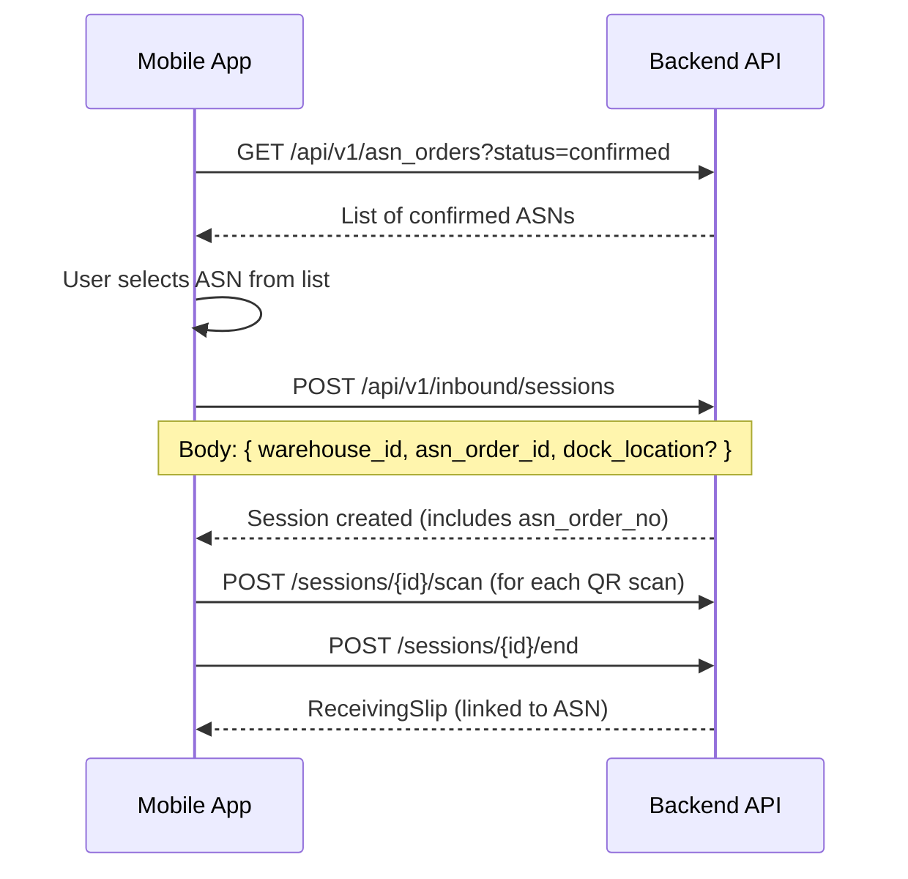

# ASN-Receiving Slip Integration Guide

> **For Mobile App & Web App Teams**
> Date: 2026-08-08
> Backend Version: After migration `066_link_asn_to_scan_sessions_and_receiving_slips`

---

## Table of Contents

1. [Overview](#overview)
2. [New/Modified API Endpoints](#newmodified-api-endpoints)
3. [Workflow: Receiving with ASN](#workflow-receiving-with-asn)
4. [Workflow: Item Rejection (Floating Mode)](#workflow-item-rejection-floating-mode)
5. [Workflow: ASN Mismatch View](#workflow-asn-mismatch-view)
6. [Workflow: Floating Items Resolution](#workflow-floating-items-resolution)
7. [Response Schema Changes](#response-schema-changes)
8. [UI Integration Notes](#ui-integration-notes)

---

## Overview

Three major features have been added:

| #   | Feature            | Description                                                               |
| --- | ------------------ | ------------------------------------------------------------------------- |
| 1   | **ASN Linking**    | Every scan session and receiving slip can optionally link to an ASN order |
| 2   | **Item Rejection** | Individual items on a receiving slip can be rejected (floating mode)      |
| 3   | **Mismatch View**  | Compare ASN expected vs actual receipts across all linked receiving slips |

---

## New/Modified API Endpoints

### ASN Orders (`/api/v1/asn_orders`)

| Method | Path                                | Change  | Purpose                                          |
| ------ | ----------------------------------- | ------- | ------------------------------------------------ |
| `GET`  | `/{asn_order_id}/receiving-summary` | **NEW** | Mismatch view: ASN vs all linked receiving slips |

### Inbound (`/api/v1/inbound`)

| Method | Path                                                | Change       | Purpose                              |
| ------ | --------------------------------------------------- | ------------ | ------------------------------------ |
| `POST` | `/sessions`                                         | **MODIFIED** | Now accepts optional `asn_order_id`  |
| `POST` | `/sessions/{session_id}/link-asn`                   | **NEW**      | Link an existing session to an ASN   |
| `POST` | `/receiving-slips/{slip_id}/items/{item_id}/reject` | **NEW**      | Reject individual slip item          |
| `GET`  | `/floating-items`                                   | **NEW**      | List all rejected items across slips |
| `POST` | `/floating-items/{item_id}/resolve`                 | **NEW**      | Resolve a floating item              |

### Response Changes

- `SessionResponse` now includes: `asn_order_id`, `asn_order_no`
- `ReceivingSlipResponse` now includes: `asn_order_id`, `asn_order_no`

---

## Workflow: Receiving with ASN

### Option A: Start Session with ASN (Recommended)



**API Call: Start Session with ASN**

```http
POST /api/v1/inbound/sessions
Content-Type: application/json
Authorization: Bearer <token>

{
  "warehouse_id": "550e8400-e29b-41d4-a716-446655440000",
  "asn_order_id": "660e8400-e29b-41d4-a716-446655440001",
  "dock_location": "Dock-A"
}
```

**Response:**

```json
{
  "id": "770e8400-...",
  "session_type": "inbound",
  "status": "open",
  "asn_order_id": "660e8400-...",
  "asn_order_no": "ASN-2026-001",
  "warehouse_id": "550e8400-...",
  "total_boxes_scanned": 0,
  ...
}
```

### Option B: Link ASN Later

If the session was started without an ASN, link it later:

```http
POST /api/v1/inbound/sessions/{session_id}/link-asn
Content-Type: application/json

{
  "asn_order_id": "660e8400-e29b-41d4-a716-446655440001"
}
```

### Mobile App UI Flow

1. **ASN Selection Screen**: When starting a new receiving session, show a dropdown/search to select an ASN (filtered to `status=confirmed` or `partially_delivered`)
2. **Scan Screen**: Show the linked ASN number at the top (e.g., "Receiving against ASN-2026-001")
3. **Session Summary**: Show ASN reference if linked

---

## Workflow: Item Rejection (Floating Mode)

### When to Reject

- Item is damaged
- Wrong item delivered
- Excess quantity (more than ASN expected)
- Quality inspection failure
- Any other reason

### API Call: Reject an Item

```http
POST /api/v1/inbound/receiving-slips/{slip_id}/items/{item_id}/reject
Content-Type: application/json

{
  "reason": "Damaged packaging - box crushed during transit",
  "notes": "3 out of 5 inner packs are intact"
}
```

**Response:**

```json
{
  "id": "880e8400-...",
  "slip_id": "990e8400-...",
  "sku": "SKU-12345",
  "batch_number": "BATCH-001",
  "quantity": 50,
  "box_count": 5,
  "flag": "rejected",
  "rejection_reason": "Damaged packaging - box crushed during transit",
  "notes": "3 out of 5 inner packs are intact",
  "rejected_at": "2026-08-08T10:30:00Z"
}
```

### What "Floating Mode" Means

Rejected items:

- ✅ Appear on the receiving slip (with `flag: "rejected"`)
- ❌ Do NOT update stock levels
- ❌ Do NOT generate put-away tasks
- ❌ Do NOT count toward ASN `delivered_qty`
- ⏳ Need to be resolved later (accept / return / dispose)

### Mobile App UI Flow

1. **Review Screen** (after session ends, before approving slip):

   - Show all scanned items grouped by SKU+batch
   - Each item row has: SKU, batch, quantity, action buttons
   - **"Reject" button** on each item row → opens reason popup
   - Visual indicator: rejected items show in red/orange with strikethrough

2. **Approval Screen**:
   - Show summary: "X items accepted, Y items rejected"
   - Only accepted items proceed to put-away
   - Rejected items are visible but excluded from totals

---

## Workflow: ASN Mismatch View

### API Call

```http
GET /api/v1/asn_orders/{asn_order_id}/receiving-summary
Authorization: Bearer <token>
```

### Response

```json
{
  "asn_order_id": "660e8400-...",
  "asn_order_no": "ASN-2026-001",
  "asn_status": "partially_delivered",
  "expected_total_qty": 500,
  "accepted_total_qty": 380,
  "rejected_total_qty": 20,
  "pending_total_qty": 100,
  "over_total_qty": 0,
  "total_line_items": 5,
  "matched_items": 2,
  "partial_items": 2,
  "not_received_items": 1,
  "over_items": 0,
  "linked_slips": [
    {
      "slip_id": "aaa-...",
      "slip_number": "RS-2026-042",
      "status": "putaway_complete",
      "created_at": "2026-08-07T14:00:00Z",
      "total_accepted_qty": 250,
      "total_rejected_qty": 10,
      "total_items": 5
    },
    {
      "slip_id": "bbb-...",
      "slip_number": "RS-2026-045",
      "status": "pending_putaway",
      "created_at": "2026-08-08T09:00:00Z",
      "total_accepted_qty": 130,
      "total_rejected_qty": 10,
      "total_items": 3
    }
  ],
  "line_items": [
    {
      "asn_item_id": "ccc-...",
      "item_id": "ddd-...",
      "sku": "SKU-001",
      "item_name": "Widget A",
      "expected_qty": 100,
      "accepted_qty": 100,
      "rejected_qty": 0,
      "pending_qty": 0,
      "over_qty": 0,
      "status": "matched"
    },
    {
      "asn_item_id": "eee-...",
      "item_id": "fff-...",
      "sku": "SKU-002",
      "item_name": "Widget B",
      "expected_qty": 200,
      "accepted_qty": 150,
      "rejected_qty": 20,
      "pending_qty": 30,
      "over_qty": 0,
      "status": "partial"
    },
    {
      "asn_item_id": "ggg-...",
      "item_id": "hhh-...",
      "sku": "SKU-003",
      "item_name": "Widget C",
      "expected_qty": 200,
      "accepted_qty": 130,
      "rejected_qty": 0,
      "pending_qty": 70,
      "over_qty": 0,
      "status": "partial"
    },
    {
      "asn_item_id": "iii-...",
      "item_id": "jjj-...",
      "sku": "SKU-005",
      "item_name": "Widget E",
      "expected_qty": 0,
      "accepted_qty": 0,
      "rejected_qty": 0,
      "pending_qty": 0,
      "over_qty": 0,
      "status": "not_received"
    }
  ]
}
```

### Line Item Status Values

| Status         | Meaning                                      | Color     |
| -------------- | -------------------------------------------- | --------- |
| `matched`      | Accepted = Expected, no rejections           | 🟢 Green  |
| `partial`      | Accepted+Rejected < Expected (still pending) | 🟡 Yellow |
| `not_received` | Nothing received yet for this line           | 🔴 Red    |
| `over`         | Accepted+Rejected > Expected (over-delivery) | 🟠 Orange |

### Web App UI Suggestions

**ASN Detail Page → "Receiving" Tab:**

```
┌─────────────────────────────────────────────────────────┐
│  ASN-2026-001  │  Status: Partially Delivered           │
│─────────────────────────────────────────────────────────│
│  Overview:                                              │
│  ┌──────────┬──────────┬──────────┬──────────┐         │
│  │ Expected │ Accepted │ Rejected │ Pending  │         │
│  │   500    │   380    │    20    │   100    │         │
│  └──────────┴──────────┴──────────┴──────────┘         │
│                                                         │
│  Linked Receiving Slips:                                │
│  ┌─────────────────────────────────────────────────┐    │
│  │ RS-2026-042 │ putaway_complete │ 250 acc / 10 rej│    │
│  │ RS-2026-045 │ pending_putaway  │ 130 acc / 10 rej│    │
│  └─────────────────────────────────────────────────┘    │
│                                                         │
│  Line Items:                                            │
│  ┌──────────┬──────┬────────┬────────┬────────┬──────┐ │
│  │ SKU      │ Exp  │ Acc    │ Rej    │ Pend   │ Stat │ │
│  ├──────────┼──────┼────────┼────────┼────────┼──────┤ │
│  │ SKU-001  │ 100  │ 100    │ 0      │ 0      │ 🟢   │ │
│  │ SKU-002  │ 200  │ 150    │ 20     │ 30     │ 🟡   │ │
│  │ SKU-003  │ 200  │ 130    │ 0      │ 70     │ 🟡   │ │
│  │ SKU-005  │ 200  │ 0      │ 0      │ 200    │ 🔴   │ │
│  └──────────┴──────┴────────┴────────┴────────┴──────┘ │
└─────────────────────────────────────────────────────────┘
```

---

## Workflow: Floating Items Resolution

### API Call: List Floating Items

```http
GET /api/v1/inbound/floating-items?warehouse_id=<uuid>&page=1&page_size=20
```

**Response:**

```json
{
  "floating_items": [
    {
      "slip_item_id": "880e8400-...",
      "slip_id": "990e8400-...",
      "slip_number": "RS-2026-042",
      "sku": "SKU-12345",
      "batch_number": "BATCH-001",
      "quantity": 50,
      "rejection_reason": "Damaged packaging",
      "rejected_at": "2026-08-08T10:30:00Z",
      "warehouse_id": "550e8400-...",
      "asn_order_no": "ASN-2026-001"
    }
  ],
  "total": 1,
  "page": 1,
  "page_size": 20
}
```

### API Call: Resolve Floating Item

```http
POST /api/v1/inbound/floating-items/{item_id}/resolve
Content-Type: application/json

{
  "action": "return_to_sender",
  "notes": "Returning to supplier, RMA #45678"
}
```

### Resolution Actions

| Action             | Description                         | Effect                              |
| ------------------ | ----------------------------------- | ----------------------------------- |
| `accept`           | Accept item after inspection        | `flag` → `"ok"`, ready for put-away |
| `return_to_sender` | Return to source warehouse/supplier | `put_away_status` → `"returned"`    |
| `dispose`          | Dispose/discard the item            | `put_away_status` → `"disposed"`    |

### Web App UI Suggestions

**Floating Items Dashboard:**

```
┌────────────────────────────────────────────────────────────────┐
│  Floating Items (Needs Resolution)                              │
│────────────────────────────────────────────────────────────────│
│  ┌──────────────┬──────────┬──────┬──────────┬───────────────┐ │
│  │ Slip         │ SKU      │ Qty  │ Reason   │ Action        │ │
│  ├──────────────┼──────────┼──────┼──────────┼───────────────┤ │
│  │ RS-2026-042  │ SKU-1234 │ 50   │ Damaged  │ [Accept]      │ │
│  │              │          │      │          │ [Return]      │ │
│  │              │          │      │          │ [Dispose]     │ │
│  ├──────────────┼──────────┼──────┼──────────┼───────────────┤ │
│  │ RS-2026-045  │ SKU-5678 │ 10   │ Excess   │ [Accept]      │ │
│  │              │          │      │          │ [Return]      │ │
│  │              │          │      │          │ [Dispose]     │ │
│  └──────────────┴──────────┴──────┴──────────┴───────────────┘ │
└────────────────────────────────────────────────────────────────┘
```

---

## Response Schema Changes

### `ReceivingSlipResponse` — New Fields

```json
{
  "asn_order_id": "660e8400-..." | null,
  "asn_order_no": "ASN-2026-001" | null,
  ...existing fields...
}
```

### `SessionResponse` — New Fields

```json
{
  "asn_order_id": "660e8400-..." | null,
  "asn_order_no": "ASN-2026-001" | null,
  ...existing fields...
}
```

---

## UI Integration Notes

### Mobile App Checklist

- [ ] **Start Session Screen**: Add ASN dropdown/search field (optional)
- [ ] **Scan Screen**: Display linked ASN number if present
- [ ] **Review Screen**: Add "Reject" button per line item with reason input
- [ ] **Review Screen**: Color-code rejected items (red/orange)
- [ ] **Approval Summary**: Show accepted vs rejected counts
- [ ] **Session List**: Show ASN reference column

### Web App Checklist

- [ ] **ASN Detail Page**: Add "Receiving" tab with mismatch summary
- [ ] **Receiving Slip List**: Add ASN reference column
- [ ] **Receiving Slip Detail**: Show ASN link, item rejection status
- [ ] **Floating Items Dashboard**: New page for resolving rejected items
- [ ] **ASN List**: Add status filter for `partially_delivered` to find active ASNs

### Key Rules

1. **ASN is always optional** — blind receipts work exactly as before
2. **One ASN can have multiple receiving slips** — the mismatch view aggregates across all
3. **Rejected items don't touch stock** — they stay in floating mode until resolved
4. **ASN status auto-updates** — when a slip is approved, `delivered_qty` is recalculated and status transitions (`confirmed` → `partially_delivered` → `delivered`)
5. **Backward compatible** — all existing endpoints and flows continue to work unchanged
