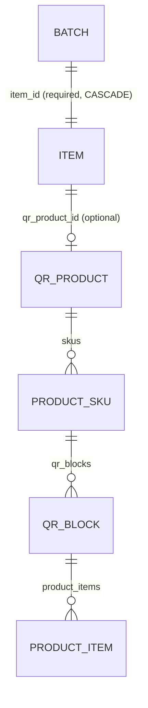

# Batch API — Frontend Integration Guide

This document covers the **inventory batch/lot tracking** API (`/api/v1/batches`)
exposed by the Core Service. Use it to build the batch CRUD screens (list, create,
edit, view, delete) in the frontend.

> ⚠️ Do not confuse this with QR print batches. The QR print batch API lives at
> `/api/v1/qr-products/blocks` (`qr_blocks` table). This document is about the
> `batches` table — manufacturing/production lots tied to an **Item**.

---

## 1. Base URLs & Authentication

| Service | Base URL |
| --- | --- |
| Identity Service (login) | `http://localhost:8000/api/v1` |
| Core Service (batches) | `http://localhost:8001/api/v1` |

All batch endpoints require a JWT access token.

**Login** (Identity Service):

```http
POST /api/v1/identity/login
Content-Type: application/json

{
  "email": "user@example.com",
  "password": "password"
}
```

Response contains `access_token`. Pass it on every Core Service request:

```http
Authorization: Bearer <access_token>
```

The batch endpoints use `get_current_active_user` — any authenticated user is
allowed (no specific permission code required).

---

## 2. Endpoints

| Method | Path | Description | Success |
| --- | --- | --- | --- |
| POST | `/api/v1/batches` | Create a batch | `201 Created` |
| GET | `/api/v1/batches` | List batches (paginated) | `200 OK` |
| GET | `/api/v1/batches/{batch_id}` | Get one batch | `200 OK` |
| PUT | `/api/v1/batches/{batch_id}` | Update a batch | `200 OK` |
| DELETE | `/api/v1/batches/{batch_id}` | Hard delete | `204 No Content` |

---

## 3. Create a Batch

### Request

```http
POST /api/v1/batches
Authorization: Bearer <token>
Content-Type: application/json
```

```json
{
  "batch_no": "LOT-2026-00042",
  "item_id": "3f6c9a2e-...-uuid",
  "manufacturing_date": "2026-08-01T00:00:00Z",
  "expiry_date": "2027-08-01T00:00:00Z",
  "supplier_id": "uuid-or-null",
  "supplier_batch_no": "VENDOR-LOT-123",
  "status": "active",
  "reference_type": "stock_entry",
  "reference_id": "uuid-or-null",
  "description": "First production run",
  "extra_data": {}
}
```

| Field | Type | Required | Notes |
| --- | --- | --- | --- |
| `batch_no` | string | ✅ | 1–100 chars. **Unique per item** within the org. |
| `item_id` | UUID | ✅ | The Item this lot belongs to. |
| `manufacturing_date` | datetime \| null | — | ISO 8601. |
| `expiry_date` | datetime \| null | — | ISO 8601. |
| `supplier_id` | UUID \| null | — | Reference only (no FK enforced in this table). |
| `supplier_batch_no` | string \| null | — | ≤ 100 chars. |
| `status` | string | — | `active` \| `expired` \| `consumed`. Default `active`. |
| `reference_type` | string \| null | — | e.g. `stock_entry`, `purchase_receipt`. |
| `reference_id` | UUID \| null | — | Polymorphic reference to the source document. |
| `description` | string \| null | — | |
| `extra_data` | object \| null | — | Arbitrary JSON. |

### Response (`201`)

```json
{
  "id": "uuid",
  "organization_id": "uuid",
  "batch_no": "LOT-2026-00042",
  "item_id": "uuid",
  "manufacturing_date": "2026-08-01T00:00:00Z",
  "expiry_date": "2027-08-01T00:00:00Z",
  "supplier_id": null,
  "supplier_batch_no": "VENDOR-LOT-123",
  "status": "active",
  "reference_type": "stock_entry",
  "reference_id": null,
  "description": "First production run",
  "extra_data": {},
  "created_at": "2026-08-22T10:00:00Z",
  "updated_at": "2026-08-22T10:00:00Z"
}
```

### Duplicate batch number (`409`)

Returned when `(batch_no, item_id)` already exists in the organization.

```json
{
  "detail": {
    "message": "Batch 'LOT-2026-00042' already exists for this item",
    "status_code": 409,
    "code": "DUPLICATE_BATCH_NO"
  }
}
```

---

## 4. List Batches

```http
GET /api/v1/batches?page=1&page_size=20&item_id=<uuid>&status=active&search=LOT&sort_by=created_at&sort_order=desc
```

| Query param | Type | Default | Notes |
| --- | --- | --- | --- |
| `page` | int | `1` | ≥ 1 |
| `page_size` | int | `20` | 1–100 |
| `item_id` | UUID | — | Filter to a single item. |
| `status` | string | — | `active` \| `expired` \| `consumed`. |
| `search` | string | — | Case-insensitive substring on `batch_no`, `supplier_batch_no`, `description`. |
| `sort_by` | string | `created_at` | Any batch column, e.g. `batch_no`, `expiry_date`. |
| `sort_order` | string | `desc` | `asc` \| `desc`. |

### Response (`200`)

```json
{
  "batches": [
    {
      "id": "uuid",
      "batch_no": "LOT-2026-00042",
      "item_id": "uuid",
      "expiry_date": "2027-08-01T00:00:00Z",
      "status": "active",
      "created_at": "2026-08-22T10:00:00Z"
    }
  ],
  "pagination": {
    "page": 1,
    "page_size": 20,
    "total_items": 42,
    "total_pages": 3,
    "has_next": true,
    "has_prev": false
  }
}
```

---

## 5. Get / Update / Delete

### Get one — `GET /api/v1/batches/{batch_id}`

Returns the full `Batch` object (same shape as the create response).

### Update — `PUT /api/v1/batches/{batch_id}`

All fields optional; only provided fields are updated.

```json
{
  "expiry_date": "2028-01-01T00:00:00Z",
  "status": "consumed",
  "description": "Updated"
}
```

> `batch_no` and `item_id` are **not** updatable via this endpoint.

### Delete — `DELETE /api/v1/batches/{batch_id}`

Hard delete, returns `204 No Content`.

### Not found (`404`)

```json
{
  "detail": {
    "message": "Batch with ID <uuid> not found",
    "status_code": 404,
    "code": "BATCH_NOT_FOUND"
  }
}
```

---

## 6. Validation errors (`422`)

FastAPI validation errors have a different shape — an array of field errors:

```json
{
  "detail": [
    {
      "field": "batch_no",
      "message": "field required"
    }
  ]
}
```

---

## 7. TypeScript Types

```ts
export type BatchStatus = "active" | "expired" | "consumed";

export interface BatchCreatePayload {
  batch_no: string;
  item_id: string; // UUID
  manufacturing_date?: string | null;
  expiry_date?: string | null;
  supplier_id?: string | null;
  supplier_batch_no?: string | null;
  status?: string; // defaults to "active"
  reference_type?: string | null;
  reference_id?: string | null;
  description?: string | null;
  extra_data?: Record<string, unknown> | null;
}

export interface Batch {
  id: string;
  organization_id: string;
  batch_no: string;
  item_id: string;
  manufacturing_date: string | null;
  expiry_date: string | null;
  supplier_id: string | null;
  supplier_batch_no: string | null;
  status: BatchStatus | null;
  reference_type: string | null;
  reference_id: string | null;
  description: string | null;
  extra_data: Record<string, unknown> | null;
  created_at: string;
  updated_at: string;
}

export interface BatchListItem {
  id: string;
  batch_no: string;
  item_id: string;
  expiry_date: string | null;
  status: BatchStatus | null;
  created_at: string;
}

export interface PaginationMeta {
  page: number;
  page_size: number;
  total_items: number;
  total_pages: number;
  has_next: boolean;
  has_prev: boolean;
}

export interface BatchListResponse {
  batches: BatchListItem[];
  pagination: PaginationMeta;
}

export interface ApiError {
  detail: {
    message: string;
    status_code: number;
    code: string;
  };
}
```

---

## 8. Example (React + axios)

```ts
const core = axios.create({
  baseURL: "http://localhost:8001/api/v1",
});

// attach the token from login
core.interceptors.request.use((config) => {
  config.headers.Authorization = `Bearer ${token}`;
  return config;
});

// List
const { data } = await core.get<BatchListResponse>("/batches", {
  params: { page: 1, page_size: 20, item_id, status, search, sort_by, sort_order },
});

// Create
const created = await core.post<Batch>("/batches", {
  batch_no: "LOT-2026-00042",
  item_id: "3f6c...",
  expiry_date: "2027-08-01T00:00:00Z",
  status: "active",
});

// Update
await core.put<Batch>(`/batches/${created.data.id}`, {
  status: "consumed",
});

// Delete
await core.delete(`/batches/${created.data.id}`);
```

---

## 9. How batches relate to Items & QR products



- **Batch → Item**: direct, required FK `batches.item_id → items.id`. Each lot belongs
  to exactly one Item. Deleting an Item cascades to its batches.
- **Batch → QR product**: no direct link. The connection is indirect through the
  Item: `items.qr_product_id → qr_products.id` (nullable). An Item *may* be linked
  to a QR product for unit-level QR tracking.
- **QR print batches** (`qr_blocks`) are a separate concept: `QRProduct → ProductSKU
  → QRBlock → ProductItem`. Those are managed via `/api/v1/qr-products/blocks`,
  not `/api/v1/batches`.

**Practical implication for the UI:** in the batch form, the user first picks an
Item. If that Item has a `qr_product_id`, the batch is indirectly associated with
that QR product — but you should not present `qr_product_id` as a batch field.

---

## 10. UI checklist

- [ ] Item picker (required) — filter batches by `item_id`.
- [ ] `batch_no` input with client-side max length (100).
- [ ] Date pickers for `manufacturing_date` / `expiry_date`.
- [ ] Status dropdown (`active` / `expired` / `consumed`).
- [ ] Supplier fields (optional).
- [ ] Handle `409 DUPLICATE_BATCH_NO` with a friendly "this batch number already exists for this item" message.
- [ ] Handle `404 BATCH_NOT_FOUND` (stale links / already-deleted).
- [ ] Pagination controls driven by `pagination.has_next` / `has_prev`.
- [ ] Show empty-state when `total_items === 0`.
