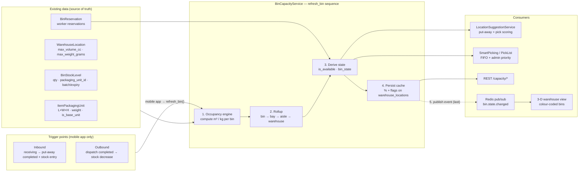

# Bin Volume Capacity Service — Requirements & Design

> Status: **Design for review** (implementation to follow)
> Date: 2026-08-14
> Scope: `core-service` (FastAPI + SQLAlchemy + PostgreSQL) in `horizon-sync-erp-be`
> Companion to: `WAREHOUSE_CAPACITY_PLANNING_DESIGN.md` (this is the **focused, simpler** version)

---

## High-Level Design

A small read-mostly service that sits **between existing master data and the existing bin-assignment/suggestion consumers**. It turns raw bin stock into a normalized **"occupied m³ / kg + availability"** picture, caches it on the bin row, and rolls it up the location tree.



Numbered boxes = the `refresh_bin()` execution sequence. Solid arrows = data/compute flow; the dashed arrow is the **real-time event**, published **after** everything is persisted (step 5), not before.

### Diagram clarifications (FAQ)

**Q: How does the 3-D view know which colour to show?**

The frontend **doesn't compute anything** — it maps a server-provided `bin_state` string to a colour.

- **Server side:** `BinCapacityService` derives `bin_state` (`empty` / `available` / `almost_full` / `full`) from `binding_pct` against the two thresholds (§5.1).
- **Initial load:** `GET /capacity/warehouses/{id}/bin-states` returns each bin's `{position_x/y/z, bin_state, binding_pct, is_available}`.
- **Real-time update:** a `bin.state.changed` Redis event carries `{bin_id, bin_state, binding_pct}`; the view recolours just that bin.
- **Colour lookup (fixed, in the view):** `empty → #9E9E9E`, `available → #4CAF50`, `almost_full → #FFC107`, `full → #F44336`. Overlays (`reserved` / `blocked`) are flags in the same payload.

So the colour decision is made **once, in the backend**; the 3-D view is a "dumb renderer" that paints whatever `bin_state` it's told.

**Q: Is "Occupancy engine" a service or business logic?**

It's **business logic** — one step inside the single `BinCapacityService` (file `app/services/bin_capacity_service.py`). The middle subgraph boxes are **conceptual pipeline stages, not microservices**:

```
BinCapacityService                        ← the one service class
  ├─ _compute_bin_occupancy(bin_id)       ← "Occupancy engine" (shared vol/wt SQL)
  ├─ recalculate_ancestors(...)           ← "Rollup"
  ├─ _derive_bin_state(...)               ← availability + colour state
  └─ refresh_bin(...)                     ← orchestrates the above + caches + publishes event
```

The only extracted piece is the **shared volume/weight SQL** helper (a function/module, also not a service), so `VolumetricAssignmentService` and `BinCapacityService` use the same math.

### Occupancy engine — in detail

The "Occupancy engine" is `BinCapacityService._compute_bin_occupancy(bin_id)` — a private method that turns a bin's raw stock rows into **two numbers: occupied volume (m³) and occupied weight (kg)**.

**Inputs (all read-only):**

| Input | From | Used for |
|---|---|---|
| bin stock rows | `bin_stock_levels` (qty, `packaging_unit_id`) | what's actually in the bin |
| pack dimensions | `item_packaging_units` (L×W×H mm, `weight_grams`) | size/weight of each pack level |
| bin limits | `warehouse_locations` (`max_volume_cc`, `max_weight_grams`) | needed later for % (not for occupancy itself) |
| config | `use_volume`, `use_weight` (§4.4) | which dimensions to compute |

**Steps:**

1. For each bin-stock row, resolve the packaging unit: use `packaging_unit_id`; if null, fall back to the item's **base unit** (`is_base_unit = true`).
2. Per row:
   $$V_{row} = qty \times \frac{L_{mm} \times W_{mm} \times H_{mm}}{10^9},\qquad W_{row} = qty \times \frac{weight\_grams}{1000}$$
3. Sum across rows → `occupied_m3`, `occupied_kg`.

**Single SQL (the shared helper):**

```sql
SELECT
  COALESCE(SUM(bsl.quantity_on_hand
        * ipu.length_mm * ipu.width_mm * ipu.height_mm / 1e9), 0) AS occupied_m3,
  COALESCE(SUM(bsl.quantity_on_hand * ipu.weight_grams / 1000.0), 0) AS occupied_kg
FROM bin_stock_levels bsl
LEFT JOIN item_packaging_units ipu ON ipu.id = bsl.packaging_unit_id
WHERE bsl.bin_location_id = :bin_id
  AND bsl.quantity_on_hand > 0
```

**Outputs:** `occupied_m3`, `occupied_kg`.

**Edge cases:**

- No packaging unit / null dimensions → that row contributes **0** (flagged "unmeasured" for coverage reporting).
- `use_volume = false` → skip the volume sum, compute weight only (and vice-versa).
- Both off → no physical output; fall back to unit-count (`CapacityService`).
- `LEFT JOIN` + `COALESCE` guarantees an empty bin returns **0**, not `NULL`.

**Where it runs:** `refresh_bin` (after any stock change), `get_bin_capacity`, and — via the shared SQL — `VolumetricAssignmentService`'s put-away fit check. The engine itself is side-effect-free; `refresh_bin` is what persists its output and publishes the Redis event.

### Components & responsibilities

| Component | Type | Responsibility |
|---|---|---|
| Shared volume/weight SQL | **NEW (extracted)** | single source of truth for a bin's occupied m³/kg (reuses `VolumetricAssignmentService`'s join) |
| `BinCapacityService` | **NEW** | occupancy, rollup, availability, refresh |
| `warehouse_locations` +4 columns | **EXTENDED** | cached `%` + `is_available` + `full_threshold_pct` |
| `VolumetricAssignmentService` | existing | put-away-list bin assignment (keeps using shared SQL) |
| `LocationSuggestionService` | existing (wired) | worker-facing suggestions — swaps unit→volume capacity |
| `SmartPickingService` / `PickList` | existing (wired) | pick bin via FIFO + admin priority + availability |
| REST `/capacity/*` | **NEW** | query endpoints |
| Redis pub/sub | existing | event-driven invalidation (scaling path) |

### Three data flows

1. **Compute** — stock change → `refresh_bin(bin_id)` → shared SQL computes occupied m³/kg → update cached `%` + `is_available` → `recalculate_ancestors` rolls up the tree.
2. **Availability** — `get_available_bins(task_type, item, qty)` → filter cached `is_available` + reservations + allocation rules → ranked candidates.
3. **Suggestion** — put-away: allocation + proximity + consolidation (with volume capacity); pick: FIFO + admin priority + availability.

### Request flows

- **Put-away suggestion:** worker → `LocationSuggestionService.suggest('put_away')` → `BinCapacityService.available_bins(...)` → ranked bins.
- **Pick suggestion:** pick list → `BinCapacityService.suggest_pick_bin(...)` → FIFO + priority + availability → top-N bins.
- **Capacity query:** `GET /capacity/warehouses/{id}/tree` → full rollup (bin → bay → aisle → warehouse).

### Explained in plain words

**The one-line idea.** `BinCapacityService` is a thin middle layer sitting between two things:

- **Below it** — data that already exists in the DB (packaging dimensions, bin limits, bin stock).
- **Above it** — services that already need the answer (put-away suggestions, pick-list bin selection, and now a capacity API).

It doesn't own the stock data — it just **turns raw stock into "how full, in m³ and kg"** and **"is this bin usable"**, then hands that to whoever asks.

**The diagram, left to right:**

1. **Data sources (left box)** — nothing new, all reuse.
   - `ItemPackagingUnit` → size (L×W×H) and weight of each item's pack levels.
   - `WarehouseLocation` → each bin's volume/weight limits + a "how full is too full" threshold.
   - `BinStockLevel` → what's actually sitting in each bin (qty, pack level, batch/expiry).
   - `BinReservation` → bins temporarily locked by a worker.
   - These are the **source of truth** — the service never invents numbers, it only reads these.

2. **The core service (middle box)** — a four-step pipeline:
   1. **Occupancy engine** — per bin, compute occupied m³ and kg (dimensions × quantity).
   2. **Rollup** — sum bin numbers up the tree: bin → bay → aisle → warehouse.
   3. **Availability** — apply the rule "is there still free space + weight, and is nobody using this bin right now?" → `is_available`.
   4. **Cache** — write the computed % and flag back onto the bin row so the next ask is fast.

3. **Consumers (right box)** — who uses the answer:
   - `LocationSuggestionService` — tells a worker *"put this item in that bin"* and *"pick it from that bin"*.
   - `SmartPickingService` / `PickList` — picks the bin respecting FIFO + admin-set priority.
   - REST `/capacity/*` — the new API (bin / warehouse / tree queries).
   - Redis pub/sub — an event channel so stock changes can trigger recompute instead of polling (scaling path, not needed for v1).

**The three flows:**

1. **Compute** — stock changes → `refresh_bin()` → recompute occupied m³/kg → update cached % and flag → roll up to ancestors.
2. **Availability** — `get_available_bins(task_type, item, qty)` → filter by cached flag + reservations + allocation rules → ranked candidates.
3. **Suggestion** — put-away = allocation + proximity + consolidation (now with *volume* capacity); pick = FIFO + admin priority + availability.

**How a user/worker triggers it:**

- **Put-away:** worker asks `LocationSuggestionService` → it asks the capacity service for available bins → ranked list.
- **Pick:** the pick list asks `suggest_pick_bin()` → FIFO + priority + availability → top-N bins.
- **Query:** `GET /capacity/warehouses/{id}/tree` → full rollup from warehouse down to bins.

**The design philosophy in one sentence:** read the stock once, compute once, cache once, and let the existing suggestion/pick services keep their own logic — the capacity service only **replaces their input** (unit counts → real m³/kg); it doesn't take over their decision-making.

---

## 1. Purpose

A single, simple service that answers one question at every level of the warehouse:

> **How full is this bin / row / aisle / warehouse — by volume (m³) and weight (kg), as a percentage — and is this bin available to use?**

It then hands the result to two existing consumers:

- the **bin suggestion service** (put-away: which bin should this item go into), and
- the **pick list service** (picking: which bin should we pick this item from, respecting FIFO and admin-set priority).

---

## 2. The 7 Inputs → What We Build

| # | Your requirement | What exists already | What we add |
|---|---|---|---|
| 1 | Item information: volume & weight | `Item.weight_per_unit`, `ItemPackagingUnit` (L×W×H, weight) | nothing — reuse |
| 2 | Master packing information: volume & weight | `ItemPackagingUnit` (each / carton / pallet levels, `is_base_unit`) | nothing — reuse |
| 3 | Bin information: volume & weight limits | `WarehouseLocation.max_volume_cc`, `max_weight_grams` | a `full_threshold_pct` per bin |
| 4 | Capacity **by volume (m³) and %** for bin → row → aisle → warehouse | `CapacityService` (units only), `VolumetricAssignmentService` (bin-only at put-away) | **new volume/weight rollup service** |
| 5 | Availability flag + 3-D colour state on each bin | `WarehouseLocation.is_active` (static), `BinReservation` (temporary) | **new computed `is_available` flag + `bin_state` colour code** |
| 6 | Preferred bin for the suggestion service | `LocationSuggestionService` (scoring exists) | wire the new availability into it |
| 7 | Pick bin suggestion with FIFO + admin priority | `LocationSuggestionService._score_pick` (FIFO/FEFO), `PutAwayRule.priority`, `LocationAllocation.priority` | combine all three + availability |

> **Terminology note:** your "row" maps to the `bay` level in the existing hierarchy (`zone → aisle → bay → level → bin`). "Aisle" = `aisle`. The document uses the existing code terms.

---

## 3. Data Sources (already in the DB)

### 3.1 Item & master packing (requirements 1 & 2)

`item_packaging_units` — one row per packaging level of an item:

| Column | Meaning |
|---|---|
| `item_id` | the item |
| `unit_name` | e.g. "Each", "Carton of 12", "Pallet" |
| `conversion_factor` | how many base units in this pack |
| `length_mm`, `width_mm`, `height_mm` | physical size of this pack |
| `weight_grams` | weight of this pack |
| `is_base_unit` | the "Each" unit |

`items.weight_per_unit` + `weight_uom` is the legacy single-weight field — we prefer `item_packaging_units` because it has full dimensions and multiple pack levels.

### 3.2 Bin limits (requirement 3)

`warehouse_locations` (rows where `location_type = 'bin'`):

| Column | Meaning |
|---|---|
| `max_volume_cc` | bin volume limit (cubic centimetres, **nullable = no volume limit**) |
| `max_weight_grams` | bin weight limit (grams, **nullable = no weight limit**) |
| `capacity` / `total_capacity` / `available_capacity` | legacy **unit/count** capacity |
| `is_active` | static on/off |
| `parent_location_id` | parent (level → bay → aisle → zone) |

### 3.3 What's actually in each bin

`bin_stock_levels`:

| Column | Meaning |
|---|---|
| `bin_location_id`, `item_id` | which bin, which item |
| `quantity_on_hand` | how many units |
| `packaging_unit_id` | which pack level is stored here (master pack) |
| `batch_number`, `expiry_date` | for FIFO / FEFO |

---

## 4. Calculation Rules

### 4.1 Unit conversions (the core math)

Dimensions are stored in **mm**, bin limits in **cc (cm³)**, weights in **grams**. We report in **m³** and **kg**:

| Convert | Formula |
|---|---|
| Pack volume (mm³ → m³) | $V_{pack} = \frac{L \times W \times H}{10^9}$ |
| Pack weight (g → kg) | $W_{pack} = \frac{weight\_grams}{1000}$ |
| Bin volume limit (cc → m³) | $V_{bin} = \frac{max\_volume\_cc}{10^6}$ |
| Bin weight limit (g → kg) | $W_{bin} = \frac{max\_weight\_grams}{1000}$ |

### 4.2 Occupied volume/weight of one bin

Using the **packaging unit actually stored in the bin** (fall back to the item's base unit):

$$V_{occupied}(bin) = \sum_{stock \in bin} qty \times V_{pack}(stock.packaging\_unit)$$

$$W_{occupied}(bin) = \sum_{stock \in bin} qty \times W_{pack}(stock.packaging\_unit)$$

Items with **no dimensions** (null L/W/H or no packaging unit) contribute **0** and are flagged "unmeasured" so operators can see data-coverage gaps.

### 4.3 Utilization % of one bin

$$\text{vol\_pct}(bin) = \frac{V_{occupied}}{V_{bin}} \times 100,\qquad
\text{wt\_pct}(bin) = \frac{W_{occupied}}{W_{bin}} \times 100$$

- If a limit is null → that dimension is **not constrained** (matches the existing `VolumetricAssignmentService` rule).
- The bin's reported utilization is the **binding** one: $\max(\text{vol\_pct}, \text{wt\_pct})$.

### 4.4 Configurable dimensions (weight / volume inclusion)

Capacity estimation may ignore one dimension or the other. Two toggles make this configurable:

| Setting | Default | Effect when off |
|---|---|---|
| `use_volume` | `true` | volume is skipped — no `vol_pct`, `V_occupied` not computed |
| `use_weight` | `false` | weight is skipped — no `wt_pct`, `W_occupied` not computed |

- The **binding** % only considers enabled dimensions: `binding = max(enabled pcts)`. If both are off, fall back to the legacy **unit-count** capacity (`CapacityService`) as the only measure.
- The same toggles gate the availability rule (§5) and the `bin_state` colour code (§5.1), so the 3-D view and put-away checks stay consistent with what is actually being measured.
- Natural per-bin override already exists: a `NULL` `max_volume_cc` / `max_weight_grams` means that bin has no limit in that dimension.

### 4.5 Rollup: bin → level → bay(row) → aisle → zone → warehouse

For any parent node, **sum down the tree**:

$$V_{cap}(node) = \sum_{child} V_{cap}(child),\qquad
V_{occupied}(node) = \sum_{child} V_{occupied}(child)$$

$$\text{vol\_pct}(node) = \frac{V_{occupied}(node)}{V_{cap}(node)} \times 100$$

Same for weight. Reuse the existing BFS walk pattern from `CapacityService._get_descendant_bin_ids()` — but aggregate **volume/weight**, not unit counts.

### 4.6 Result shape (what the service returns)

```jsonc
{
  "node": "WH-01",
  "level": "warehouse",
  "volume":  { "occupied_m3": 320.5, "capacity_m3": 500.0, "pct": 64.1 },
  "weight":  { "occupied_kg": 21000, "capacity_kg": 25000, "pct": 84.0 },
  "binding_pct": 84.0,
  "children": [ /* aisle → bay → bin, same shape, recursive */ ]
}
```

> Leaf bins also carry `state` (empty / available / almost_full / full) and omit any dimension disabled by `use_volume` / `use_weight` (§4.4).

---

## 5. Bin Availability Flag (requirement 5)

A bin is **available** only when **all** of these hold:

1. `is_active = true` (existing static flag),
2. **volume fits**: $V_{occupied} + V_{incoming} \le V_{bin} \times full\_threshold\_pct$,
3. **weight fits**: $W_{occupied} + W_{incoming} \le W_{bin} \times full\_threshold\_pct$,
4. **no active reservation** by another worker (`BinReservation` unexpired / unreleased),
5. (for put-away) **allocation rules allow** the item into this bin (`LocationAllocation`).

> If `use_volume` / `use_weight` is off (§4.4), the corresponding fit check is skipped.

Thresholds are configurable at warehouse level with optional per-bin override. Resolution order: **bin → zone → warehouse default**.

| Column | Default | Meaning |
|---|---|---|
| `full_threshold_pct` | inherits warehouse `0.90` | treat the bin as "full" above this % (red band) |
| `almost_full_threshold_pct` | inherits warehouse `0.70` | treat the bin as "almost full" above this % (amber band) |

Stored result (denormalized, recomputed by the service):

| Column | Meaning |
|---|---|
| `capacity_volume_pct` | cached volume % |
| `capacity_weight_pct` | cached weight % |
| `bin_state` | cached state: `empty` / `available` / `almost_full` / `full` |
| `is_available` | cached availability flag (0/1) |

> Why cache on the row? The suggestion and pick services query candidate bins on every task. Recomputing volume across all `bin_stock_levels` on each call is wasteful. Cache the flag and percentages, and refresh them on stock changes (§10).

### 5.1 Bin status & 3-D colour code

Each bin gets a 4-state colour indicator, derived from `binding_pct` against two thresholds.

**State derivation** (capacity colour):

| State | Rule (`binding_pct`) | Colour (suggested) |
|---|---|---|
| `empty` | `== 0` (no stock) | grey `#9E9E9E` |
| `available` | `0 < binding < almost_full_threshold_pct` | green `#4CAF50` |
| `almost_full` | `almost_full_threshold_pct ≤ binding < full_threshold_pct` | amber `#FFC107` |
| `full` | `binding ≥ full_threshold_pct` | red `#F44336` |

**Overlays (drawn on top, not a colour band):**

| Overlay | When | Visual |
|---|---|---|
| `reserved` | active `BinReservation` by a worker | keep capacity colour + outline/pulse |
| `blocked` | `is_active = false` or admin override | hatched / dark grey |

**How it reaches the 3-D view (trigger → colour):**

```
stock change (mobile app: inbound put-away/stock entry, or outbound dispatch)
   → BinCapacityService.refresh_bin(bin_id)
   → recompute binding_pct  →  derive bin_state
   → persist cached columns
   → publish bin.state.changed on the 3-D Redis channel (existing redis_pubsub)
   → 3-D view recolours that bin in real time
```

The 3-D view needs the existing `position_x / position_y / position_z` + `qr_code` (already on `warehouse_locations`) plus the new `bin_state` and `binding_pct`. Initial load = `get_bin_states(warehouse_id)`; subsequent updates arrive as Redis events (§9).

---

## 6. Preferred Bin for the Suggestion Service (requirement 6)

`LocationSuggestionService` already ranks bins (allocation match → capacity → proximity → consolidation). We integrate as:

- **Hard filter first:** only bins where `is_available = true` (and not worker-reserved) are candidates — provided by the new service as `get_available_bins(...)`.
- **Score boost:** replace the current unit-based `_available_capacity()` with volume-based remaining space, so "tightest fit" means volume, not count.

```
LocationSuggestionService.suggest(task_type="put_away", ...)
   → BinCapacityService.available_bins(warehouse_id, item_id, quantity)   // new
   → existing scoring (allocation, proximity, consolidation)               // existing
   → returns ranked preferred bins
```

This keeps the existing scoring engine intact and simply swaps its capacity input from "units" to "m³ / kg".

---

## 7. Pick Bin Suggestion — FIFO + Admin Priority (requirement 7)

`LocationSuggestionService._score_pick` already does FEFO/FIFO + quantity-match + route distance. We add two things:

**Priority order for a pick bin (highest first):**

1. **Availability** — bin has stock and is not reserved (`BinStockLevel.quantity_on_hand > 0`, not in `reserved_bin_ids`).
2. **FIFO / FEFO** — expiry first (FEFO) then oldest receipt (FIFO) — *already implemented*.
3. **Admin pre-selected priority** — from `PutAwayRule.priority` and `LocationAllocation.priority` (item/group → bin). Higher priority wins; ties broken by route distance.
4. **Quantity match** — prefer a bin that satisfies the full pick in one stop — *already implemented*.

```
suggest_pick_bin(warehouse_id, item_id, qty, batch?, worker_position?)
   → candidates = BinCapacityService.available_bins(..., task_type="pick")
   → score = FIFO/FEFO (existing) + admin_priority (new wiring) + one-stop + route
   → return top-N ranked bins
```

No new tables needed for admin priority — `put_away_rules.priority` and `location_allocations.priority` already exist and just need to be included in the score.

---

## 8. Data Model Changes (minimal)

**On `warehouses_extended`** — two dimension toggles + two threshold defaults:

| Column | Type | Purpose |
|---|---|---|
| `use_volume` | `Boolean default true` | include volume in capacity estimation (§4.4) |
| `use_weight` | `Boolean default false` | include weight in capacity estimation (§4.4) |
| `full_threshold_pct` | `Numeric(5,3) default 0.90` | warehouse default "full" boundary (red) |
| `almost_full_threshold_pct` | `Numeric(5,3) default 0.70` | warehouse default "almost full" boundary (amber) |

**On `warehouse_locations`** — two thresholds + four cached columns:

| Column | Type | Purpose |
|---|---|---|
| `full_threshold_pct` | `Numeric(5,3) nullable` | per-bin override of the warehouse "full" boundary (red) |
| `almost_full_threshold_pct` | `Numeric(5,3) nullable` | per-bin override of the warehouse "almost full" boundary (amber) |
| `capacity_volume_pct` | `Numeric(6,2) nullable` | cached volume % |
| `capacity_weight_pct` | `Numeric(6,2) nullable` | cached weight % |
| `bin_state` | `String(20) nullable` | cached `empty`/`available`/`almost_full`/`full` |
| `is_available` | `Boolean default true` | cached availability |

No new tables. No changes to `items` or `item_packaging_units`. Per-bin dimension override stays implicit via nullable `max_volume_cc` / `max_weight_grams`.

---

## 9. Service & Endpoint Design

### 9.1 New service: `BinCapacityService`

File: `app/services/bin_capacity_service.py`

| Method | Purpose |
|---|---|
| `get_bin_capacity(bin_id)` | volume/weight usage of one bin |
| `get_capacity_tree(warehouse_id)` | full recursive rollup (bin→bay→aisle→warehouse) |
| `get_available_bins(warehouse_id, item_id, qty, task_type, batch?)` | availability-filtered candidates |
| `suggest_pick_bin(...)` | FIFO + admin priority + availability ranking |
| `get_bin_states(warehouse_id)` | bin_id → {position, `bin_state`, `binding_pct`, `is_available`} for the 3-D view |
| `refresh_bin(bin_id)` / `refresh_warehouse(warehouse_id)` | recompute cached % + `bin_state` + flags, then publish a `bin.state.changed` Redis event |
| `recalculate_ancestors(location_id)` | propagate rollup up the tree (mirrors `CapacityService`) |

### 9.2 New endpoints (prefix `/capacity`)

| Method | Path | Purpose |
|---|---|---|
| GET | `/capacity/bins/{bin_id}` | one bin: volume/weight/%, `is_available` |
| GET | `/capacity/warehouses/{id}/tree` | full rollup tree (requirement 4) |
| GET | `/capacity/bins/available` | list available bins (filters: warehouse, item, qty, task_type) |
| GET | `/capacity/warehouses/{id}/bin-states` | all bins with position + colour state for the 3-D view |
| POST | `/capacity/bins/{bin_id}/refresh` | force recompute of a bin |

### 9.3 Wiring (consumers)

- `LocationSuggestionService.suggest()` → uses `BinCapacityService.get_available_bins()` + volume-based capacity score.
- Pick list creation → uses `BinCapacityService.suggest_pick_bin()` for each line.

---

## 10. Trigger Points (when to refresh cached capacity)

Only **two** trigger points, both raised by the **mobile app** (the only place these operations happen):

| # | Trigger | Direction | Raised from |
|---|---|---|---|
| 1 | **Inbound** — receiving → put-away completion, and stock entry added (independent processes) | bin stock increases | mobile app |
| 2 | **Outbound** — dispatch completed → stock decrease | bin stock decreases | mobile app |

Both call `BinCapacityService.refresh_bin(bin_id)` — which recomputes cached `%`, derives `bin_state`, persists it, and publishes a `bin.state.changed` event for the 3-D view. `recalculate_ancestors(...)` propagates the rollup up the tree (reusing the optimistic-locking pattern already in `CapacityService`). No other caller is expected.

---

## 11. Implementation Phases (small)

| Phase | Deliverable |
|---|---|
| **P1** | New columns (`use_volume`/`use_weight`, thresholds, cached % + `bin_state` + `is_available`), migration, `BinCapacityService` (bin-level compute + rollup), `/capacity/bins/{id}` + `/capacity/warehouses/{id}/tree` |
| **P2** | Availability + `bin_state` logic, `get_available_bins`, `get_bin_states` (3-D), `/capacity/bins/available` + `/capacity/warehouses/{id}/bin-states`, refresh triggers + Redis events |
| **P3** | Wire into `LocationSuggestionService` (put-away) and pick bin suggestion (FIFO + admin priority) |

---

## 12. Open Questions

1. Should `is_available` be purely volume/weight-driven, or should admin be able to **force** a bin unavailable (e.g. damaged rack)? (Recommend: add an `admin_override` boolean.)
2. When an item has no dimensions, should the bin still accept it (relying on unit count), or block it? (Recommend: allow, but show low data-coverage.)
3. Default `full_threshold_pct` per zone type — 0.90 everywhere, or lower (0.80) in fast-pick areas?
4. Pick bin suggestion: is FEFO (expiry) already required, or is FIFO + admin priority enough for v1?
5. Default colour band boundaries — `almost_full` at 70% and `full` at 90%, or different numbers?
6. Should `use_volume` / `use_weight` be warehouse-level toggles only, or also overridable per bin (in addition to the implicit `NULL` limit)?

---

## 13. Leveraging GDSN CIN Data (feeds the packaging-unit master)

The Sam's Club file `cin.*.json` is a **GDSN Catalog Item Notification (CIN)** — a supplier-to-retailer product data feed. It is a natural, already-automated source for exactly the two numbers our capacity service needs per item: **physical dimensions and weight**.

### 13.1 Field → `ItemPackagingUnit` mapping

| GDSN field (this doc) | Value | Convert | `ItemPackagingUnit` column |
|---|---|---|---|
| `depth` / `width` / `height` | 1.7 / 1.7 / 7.7 `INH` (inches) | × 25.4 | `length_mm` / `width_mm` / `height_mm` = 43.18 / 43.18 / 195.58 |
| `volume` | 22.253 `INQ` (cubic inches) | × 16.387 | cross-check → 364.65 cm³ (0.000365 m³) |
| `grossWeight` | 0.55 `LBR` (pounds) | × 453.592 | `weight_grams` ≈ 249.5 |
| `isBaseUnit` | `TRUE` | — | `is_base_unit = true` |
| `isDispatchUnit` / `isOrderableUnit` | `TRUE` | — | decides storage/dispatch level |
| `netContent` | 1.0 `EA` | — | `unit_name` = "Each", `conversion_factor` |
| `globalClassificationCategory` | "Fragrances" (10000365) | — | category fallback dims (§15) |
| `ti` / `hi` / `numberOfItemsPerPallet` / `totalUnitsPerCase` / `innerPack` | `null` here | — | present only on Case/Pallet CINs |

### 13.2 Key insight: one CIN = one hierarchy level

GDSN publishes a **hierarchy** — Each → Inner Pack (Case) → Pallet — as **separate CIN documents**, linked by `parentItemOrParentItemItemIdentifier` (null here = this is the base/Each level). So:

- **This doc** → the "Each" packaging unit (base unit dims/weight).
- **Case CIN** → `innerPack`, `quantityOfNextLevelWithinInnerPack`, case dims/weight → a second `ItemPackagingUnit` with `conversion_factor` = units-per-case.
- **Pallet CIN** → `ti` (cases per layer) + `hi` (layers) → `numberOfItemsPerPallet` → pallet-position capacity.

### 13.3 Recommended: GDSN → `ItemPackagingUnit` mapper (keeps v1 service simple)

A thin mapper (similar in spirit to the existing `SamsGDSNConsumer`) that:

1. On each CIN, **upsert** a packaging unit from `depth/width/height/grossWeight/isBaseUnit`.
2. **Normalize units once** (INH→mm, INQ→cm³, LBR→g) in a single conversion helper.
3. When dims are **missing/null**, skip the physical columns and flag the item as "unmeasured" (feeds the coverage metric in §4.2).
4. On Case/Pallet CINs, fill `conversion_factor` and TI/HI.

This turns a manual data-entry problem into an automated feed, and removes the biggest accuracy risk (zero-cube items silently understating occupancy).

---

## 14. Scaling Design — how we address the compute & modeling bottlenecks

> **Decision:** the data-source (GDSN) bottlenecks from the earlier draft are **excluded** from requirements and design consideration. The capacity math assumes item/packaging dimensions are already present and correct; syncing/validating them is a separate concern handled upstream by the GDSN mapper (§13).

### B. Compute/architecture — design decisions

**B1 — Per-event recompute + ancestor walk (write amplification)**
→ **Event-driven, delta-based rollup instead of full re-sum.**
- Stock changes publish a `bin.changed` event on the existing Redis channel (`redis_pubsub.py`).
- A `CapacityAggregator` applies **deltas**: when a bin's occupied volume changes by Δ, add Δ to every ancestor's cached occupied value in one pass — O(1) per level instead of re-summing all children per level.
- Mark the subtree **dirty**; a debounced/batched worker reconciles snapshots (e.g. every N seconds) so a burst of stock movements collapses into one recompute.

**B2 — Cached columns drift under concurrency**
→ **Cache ≠ source of truth; accept eventual consistency.**
- Source of truth remains `bin_stock_levels` (always recomputable via the shared SQL helper).
- `capacity_volume_pct` / `capacity_weight_pct` / `is_available` are **derived caches** refreshed by the aggregator, each carrying a `capacity_refreshed_at` timestamp.
- Reads tolerate staleness up to a configurable TTL; writes keep the existing optimistic-locking (`version`) + retry pattern.

**B3 — Hot bins / read contention**
→ **Materialize a per-warehouse availability set.**
- `get_available_bins()` reads a precomputed, warehouse-scoped result (Redis cache or a `bin_availability` summary table) instead of scanning `bin_stock_levels` on every request.
- Actual assignment keeps `FOR UPDATE SKIP LOCKED` (already in `VolumetricAssignmentService`) for correctness under concurrency.

**B4 — One `is_available` conflates put-away vs pick**
→ **Task-type-specific availability.**
- Replace the single flag with a state set: `available_for_putaway` (has free space) and `available_for_pick` (has stock), plus `blocked` / `reserved` states.
- `get_available_bins(task_type=...)` filters accordingly; the existing `BinReservation` supplies the `reserved` state.

### C. Modeling/semantic — design decisions

**C1 — Each-dimensions vs cartonized storage**
→ **Compute from the stored packaging unit, not the base unit.**
- Occupancy per bin uses `bin_stock_levels.packaging_unit_id` (already exists); falls back to the base unit only when null.
- Optional item-level `default_storage_packaging_unit` lets admin declare "store by case."

**C2 — No time dimension**
→ **Keep this service "current state only"; time is a separate concern.**
- This service answers "how full **now**?". The daily calendar (`capacity_snapshots` + ASN/pick-list projections in `WAREHOUSE_CAPACITY_PLANNING_DESIGN.md`) consumes `BinCapacityService` output as its "occupied now" input — a clean seam, no rework.

**C3 — No zone awareness**
→ **Rollup keyed by zone (zones are already location nodes).**
- `get_capacity_tree` returns per-zone subtrees (`location_type='zone'`). Per-zone `full_threshold_pct` overrides the warehouse default.

**C4 — Static threshold**
→ **Thresholds are configuration, not constants.**
- v1: per-bin and per-zone static `full_threshold_pct`.
- Hook for later: a `capacity_rule` table (zone, season, effective dates) returning the effective threshold.

**C5 — No pallet-position dimension**
→ **Keep the service dimension-agnostic.**
- v1 computes volume + weight; a third optional `pallet_positions` dimension slots in later (once TI/HI is available) through the same rollup pipeline.

**C6 — Single-warehouse scope**
→ **Warehouse-scoped service; network is a separate orchestrator.**
- Every method already takes `warehouse_id` — keep it that way.
- Network-level "which warehouse absorbs this inbound" becomes a future orchestrator that calls this service per warehouse and picks the winner; no change to this service.

---

## 15. Expansion Opportunities (future roadmap, in order of leverage)

1. **Auto-seed packaging units from GDSN** (§13.3) — biggest near-term win; removes manual dimension entry.
2. **Category fallback dims** — use `globalClassificationCategory` averages when an item lacks dims, flagged for review.
3. **Event-driven recompute** — publish "bin changed" on the existing Redis channel → async aggregator updates caches/snapshots; decouples stock writes from capacity math.
4. **Time-series snapshots** — store daily occupancy → trend, seasonality, and the bridge to delivery-estimation.
5. **Zone-aware capacity** — per-zone thresholds (cold/dry/bulk/pick-face) instead of one warehouse number.
6. **Pallet-position capacity** — once Case/Pallet CINs (TI/HI) are consumed.
7. **Dynamic thresholds** — seasonal/rule-driven `full_threshold_pct`.
8. **Network-level capacity** — route inbound to the warehouse with the most free capacity across the organization.
