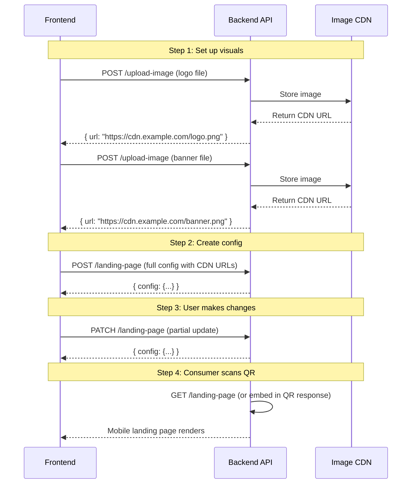

# Landing Page API Contract

> **Status:** ✅ Implemented — deployed to production
> **Base URL:** `/api/v1/products/:productId/landing-page` > **Public Base URL:** `/api/v1/public/products/:productId/landing-page` > **Auth:** Bearer token required on admin endpoints; public GET is no-auth
> **Content-Type:** `application/json` (except image upload: `multipart/form-data`)

---

## Table of Contents

1. [Endpoints Overview](#endpoints-overview)
2. [Data Model](#data-model)
3. [API Reference](#api-reference)
4. [Example Flow](#example-flow)
5. [Validation Rules](#validation-rules)
6. [Image Upload](#image-upload)

---

## Endpoints Overview

| Method   | Endpoint                                                | Auth   | Description                     |
| -------- | ------------------------------------------------------- | ------ | ------------------------------- |
| `GET`    | `/api/v1/public/products/:productId/landing-page`       | None   | Fetch config (consumer QR page) |
| `GET`    | `/api/v1/products/:productId/landing-page`              | Bearer | Fetch landing page config       |
| `POST`   | `/api/v1/products/:productId/landing-page`              | Bearer | Create landing page config      |
| `PATCH`  | `/api/v1/products/:productId/landing-page`              | Bearer | Update landing page config      |
| `DELETE` | `/api/v1/products/:productId/landing-page`              | Bearer | Delete landing page config      |
| `POST`   | `/api/v1/products/:productId/landing-page/upload-image` | Bearer | Upload logo or banner image     |

---

## Data Model

### `LandingPageConfig`

```typescript
interface LandingPageConfig {
  product_id: string; // Required — linked QR product ID
  organization_id?: string; // Auto-set from auth context

  // Visuals
  logo_url: string | null;
  banner_image_url: string | null;

  // Branding
  primary_color: string; // Hex, default "#1a56db"
  accent_color: string; // Hex, default "#f59e0b"

  // Sections
  product_details: ProductDetailsConfig;
  social_links: SocialLink[];
  feedback: FeedbackConfig;
  warranty: WarrantyConfig;
  custom_cta: CustomCTAConfig;
  footer: FooterConfig;

  // Meta
  created_at: string; // ISO 8601
  updated_at: string; // ISO 8601
}
```

### `ProductDetailsConfig`

```typescript
interface ProductDetailsConfig {
  show_gtin: boolean; // default: true
  show_batch: boolean; // default: true
  show_mfg_date: boolean; // default: true
  show_expiry_date: boolean; // default: true
  show_serial_number: boolean; // default: false
  custom_fields: CustomField[];
}

interface CustomField {
  id?: string;
  label: string; // e.g. "Net Weight"
  value: string; // e.g. "500mg"
  sort_order?: number;
}
```

### `SocialLink`

```typescript
type SocialPlatform =
  | "facebook"
  | "twitter"
  | "instagram"
  | "linkedin"
  | "youtube"
  | "whatsapp"
  | "telegram"
  | "website"
  | "other";

interface SocialLink {
  id?: string;
  platform: SocialPlatform;
  url: string; // Full URL, max 2048 chars
  label?: string; // Custom label (optional, max 100 chars)
  enabled: boolean;
  sort_order?: number;
}
```

### `FeedbackConfig`

```typescript
type FeedbackType = "feedback" | "survey" | "none";

interface FeedbackConfig {
  enabled: boolean; // default: false
  type: FeedbackType; // default: 'none'
  title: string; // max 200 chars
  description: string; // max 500 chars
  survey_url?: string; // Required when type='survey', max 2048 chars
  thank_you_message?: string; // max 500 chars
}
```

### `WarrantyConfig`

```typescript
interface WarrantyConfig {
  enabled: boolean; // default: false
  title: string; // max 200 chars
  description: string; // max 1000 chars
  cta_text: string; // Button text, max 50 chars
  cta_url: string; // Full URL, max 2048 chars
}
```

### `CustomCTAConfig`

```typescript
type CTAButtonStyle = "primary" | "secondary" | "outline";

interface CustomCTAConfig {
  enabled: boolean; // default: false
  button_text: string; // max 50 chars
  button_url: string; // Full URL, max 2048 chars
  button_style: CTAButtonStyle; // default: 'primary'
}
```

### `FooterConfig`

```typescript
interface FooterConfig {
  text: string; // Copyright text, max 500 chars
  show_powered_by: boolean; // default: true
  custom_links: FooterLink[];
}

interface FooterLink {
  label: string; // max 100 chars
  url: string; // max 2048 chars
  sort_order?: number;
}
```

---

## API Reference

### 1. Fetch Landing Page Config

```
GET /api/v1/products/:productId/landing-page
```

**Response `200 OK`:**

```json
{
  "config": {
    "product_id": "prod_abc123",
    "organization_id": "org_xyz789",
    "logo_url": "https://cdn.example.com/logos/prod_abc123.png",
    "banner_image_url": null,
    "primary_color": "#1a56db",
    "accent_color": "#f59e0b",
    "product_details": {
      "show_gtin": true,
      "show_batch": true,
      "show_mfg_date": true,
      "show_expiry_date": true,
      "show_serial_number": false,
      "custom_fields": []
    },
    "social_links": [],
    "feedback": {
      "enabled": false,
      "type": "none",
      "title": "",
      "description": ""
    },
    "warranty": {
      "enabled": false,
      "title": "",
      "description": "",
      "cta_text": "",
      "cta_url": ""
    },
    "custom_cta": {
      "enabled": false,
      "button_text": "",
      "button_url": "",
      "button_style": "primary"
    },
    "footer": {
      "text": "",
      "show_powered_by": true,
      "custom_links": []
    },
    "created_at": "2026-07-26T10:00:00Z",
    "updated_at": "2026-07-26T10:00:00Z"
  }
}
```

**Error Responses:**
| Status | Meaning |
|--------|---------|
| `404` | No config exists for this product (not created yet) |
| `403` | Product does not belong to the authenticated organization |

---

### 2. Create Landing Page Config

```
POST /api/v1/products/:productId/landing-page
```

**Request Body (minimal):**

```json
{
  "logo_url": "https://cdn.example.com/logo.png"
}
```

**Request Body (full):**

```json
{
  "logo_url": "https://cdn.example.com/logo.png",
  "banner_image_url": "https://cdn.example.com/banner.png",
  "primary_color": "#1a56db",
  "accent_color": "#f59e0b",
  "product_details": {
    "show_gtin": true,
    "show_batch": true,
    "show_mfg_date": true,
    "show_expiry_date": true,
    "show_serial_number": false,
    "custom_fields": [
      { "label": "Net Weight", "value": "500mg", "sort_order": 0 },
      { "label": "Ingredients", "value": "Paracetamol 500mg", "sort_order": 1 }
    ]
  },
  "social_links": [
    {
      "platform": "facebook",
      "url": "https://facebook.com/mybrand",
      "enabled": true,
      "sort_order": 0
    },
    {
      "platform": "instagram",
      "url": "https://instagram.com/mybrand",
      "enabled": true,
      "sort_order": 1
    },
    {
      "platform": "website",
      "url": "https://mybrand.com",
      "enabled": true,
      "sort_order": 2
    }
  ],
  "feedback": {
    "enabled": true,
    "type": "survey",
    "title": "Share Your Feedback",
    "description": "Help us improve our products and services.",
    "survey_url": "https://forms.google.com/survey-123",
    "thank_you_message": "Thank you for your valuable feedback!"
  },
  "warranty": {
    "enabled": true,
    "title": "2-Year Warranty",
    "description": "This product is covered under our comprehensive 2-year warranty program. Register now to activate your coverage.",
    "cta_text": "Register Warranty",
    "cta_url": "https://mybrand.com/warranty/register"
  },
  "custom_cta": {
    "enabled": true,
    "button_text": "Buy Again",
    "button_url": "https://shop.mybrand.com/reorder",
    "button_style": "primary"
  },
  "footer": {
    "text": "© 2026 MyBrand Inc. All rights reserved.",
    "show_powered_by": true,
    "custom_links": [
      { "label": "Privacy Policy", "url": "/privacy", "sort_order": 0 },
      { "label": "Terms of Service", "url": "/terms", "sort_order": 1 },
      { "label": "Contact Us", "url": "/contact", "sort_order": 2 }
    ]
  }
}
```

**Response `201 Created`:**

```json
{
  "config": {
    /* Full LandingPageConfig as above */
  }
}
```

**Error Responses:**
| Status | Meaning |
|--------|---------|
| `409` | Config already exists for this product (use PATCH) |
| `400` | Validation error (see validation rules) |

---

### 3. Update Landing Page Config

```
PATCH /api/v1/products/:productId/landing-page
```

Partial update — send only the fields you want to change. Nested objects are merged (not replaced).

**Request Body (partial update example):**

```json
{
  "primary_color": "#059669",
  "feedback": {
    "enabled": true,
    "type": "feedback",
    "title": "We'd Love Your Input",
    "description": "Tell us what you think about this product."
  },
  "custom_cta": {
    "enabled": false
  }
}
```

**Response `200 OK`:**

```json
{
  "config": {
    /* Full updated LandingPageConfig */
  }
}
```

**Note on array fields:** For `social_links`, `custom_fields`, and `footer.custom_links`, the entire array is replaced. To modify a single item, send the full array with changes.

---

### 4. Delete Landing Page Config

```
DELETE /api/v1/products/:productId/landing-page
```

**Response `200 OK`:**

```json
{
  "success": true
}
```

**Error Responses:**
| Status | Meaning |
|--------|---------|
| `404` | No config exists for this product |

---

### 5. Upload Image

```
POST /api/v1/products/:productId/landing-page/upload-image
Content-Type: multipart/form-data
```

**Form Fields:**

| Field  | Type   | Required | Description            |
| ------ | ------ | -------- | ---------------------- |
| `file` | File   | Yes      | PNG or JPEG, max 5MB   |
| `type` | String | Yes      | `"logo"` or `"banner"` |

**Response `200 OK`:**

```json
{
  "url": "https://cdn.example.com/products/prod_abc123/logo_20260726.png"
}
```

**Error Responses:**
| Status | Meaning |
|--------|---------|
| `400` | Invalid file type or size |
| `413` | File too large (>5MB) |

**Recommended dimensions:**

- Logo: 300×300px (square, displayed at 80×80px in preview)
- Banner: 1200×400px (3:1 aspect ratio)

---

## Example Flow



---

## Validation Rules

| Field                         | Rule                                           |
| ----------------------------- | ---------------------------------------------- |
| `primary_color`               | Valid hex color (`#RRGGBB`), default `#1a56db` |
| `accent_color`                | Valid hex color (`#RRGGBB`), default `#f59e0b` |
| `social_links[].url`          | Valid URL, max 2048 chars                      |
| `social_links[].platform`     | Must be one of the 9 allowed values            |
| `social_links[].label`        | Optional, max 100 chars                        |
| `feedback.survey_url`         | Required when `type='survey'`, valid URL       |
| `feedback.title`              | Max 200 chars                                  |
| `feedback.description`        | Max 500 chars                                  |
| `warranty.cta_text`           | Max 50 chars                                   |
| `warranty.cta_url`            | Valid URL when provided                        |
| `custom_cta.button_text`      | Max 50 chars                                   |
| `custom_cta.button_url`       | Valid URL when provided                        |
| `custom_cta.button_style`     | One of: `primary`, `secondary`, `outline`      |
| `footer.text`                 | Max 500 chars                                  |
| `footer.custom_links[].url`   | Valid URL, max 2048 chars                      |
| `footer.custom_links[].label` | Max 100 chars                                  |

---

## Notes for Backend Implementation

1. **One config per product:** There should be at most one `LandingPageConfig` per `product_id`. Use a unique constraint on `product_id`.

2. **Images:** Store uploaded images in cloud storage (S3/GCS) and return CDN URLs. Consider auto-resizing logos to 300×300 and banners to 1200×400 on upload.

3. **Public access:** The landing page config will be fetched by end-users scanning QR codes (no auth). Consider a separate public endpoint or caching layer for this read path.

4. **Default values:** All optional fields should use the defaults specified in the data model when creating a new config. The frontend sends explicit values, but the backend should apply defaults for missing fields.

5. **Array merging on PATCH:** For array fields (`social_links`, `custom_fields`, `footer.custom_links`), the entire array is sent. The backend should replace, not merge, these arrays.
