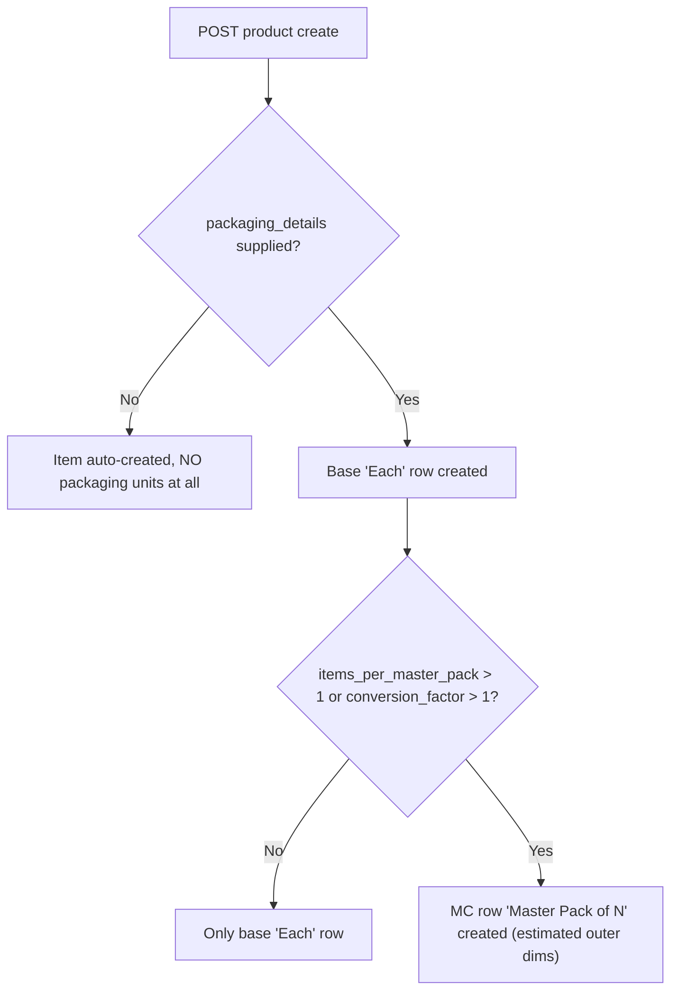

# Master Packaging at Item Auto-Creation (Product → Item flow)

> Status: **Reference / clarification**
> Scope: `core-service` (FastAPI + SQLAlchemy + PostgreSQL)
> Related: `MC_PACKAGING_CAPACITY_DESIGN.md`, `ITEMS_PER_MASTER_PACK_VS_CONVERSION_FACTOR.md`

Answers the question: *"When a product is created and its item is auto-created,
is the Master Packaging (MC) configuration considered at that time?"*

**Short answer:** Only partially — master packaging is considered **iff** the
create request carries `packaging_details` with a pack size > 1. If the payload
is omitted, the auto-created item gets **no packaging units at all**.

---

## 1. The product → item auto-creation flow

`QRProductService.create_product`:

1. `packaging_details` is popped from the request and stashed into `extra_data`
   (with `Decimal` values serialized to JSON-safe floats).
2. `_create_linked_item` auto-creates the inventory `Item`
   (name/sku/gtin/brand from the product).
3. **Only if `packaging_details` was supplied** does it build an
   `ItemPackagingDetails` and call `_upsert_base_packaging_unit`, which in turn
   calls `_upsert_master_pack_unit` and creates the MC row.



---

## 2. Behaviour per case

| Case | Result |
|---|---|
| Product created **without** `packaging_details` | Item auto-created with **zero** `item_packaging_units` rows — no base "Each", no MC. Master packaging silently skipped. |
| Product created with `packaging_details` but `items_per_master_pack` NULL and `conversion_factor=1` | Only the base "Each" row is created. No MC row. |
| Product created with `packaging_details.items_per_master_pack = 4` (or `conversion_factor > 1`) | Base "Each" row + MC row "Master Pack of 4" (`conversion_factor=4`) created. ✅ Master packaging considered. |

The direct item-creation path behaves identically: `ItemService.create_item`
only calls `_upsert_base_packaging_unit` when `item_data.packaging_details is
not None`; otherwise no packaging units are created.

---

## 3. Caveat — outer dims are always *estimated* on this path

`QRProductPackagingDetails` (the product-side schema) only has:

```
unit_name, conversion_factor, items_per_master_pack,
length_mm, width_mm, height_mm, weight_grams
```

It does **not** have the `master_pack_*` fields (`master_pack_length/width/
height_mm`, `master_pack_weight_grams`, fill factor, wall thickness, void
fill). `_create_linked_item` only forwards those base fields when constructing
`ItemPackagingDetails`:

```python
details = ItemPackagingDetails(
    unit_name=packaging_details.get("unit_name") or "Each",
    conversion_factor=packaging_details.get("conversion_factor") or Decimal("1"),
    items_per_master_pack=packaging_details.get("items_per_master_pack"),
    length_mm=packaging_details.get("length_mm"),
    width_mm=packaging_details.get("width_mm"),
    height_mm=packaging_details.get("height_mm"),
    weight_grams=packaging_details.get("weight_grams"),
)
```

Consequently, even when master packaging **is** triggered from product
creation, the MC row is created with **estimated** outer dims (the fill-factor
formula in `_upsert_master_pack_unit`), never with explicit carton dims. To set
real MC outer dimensions, the item must be updated afterwards through the item
form (`ItemPackagingDetails.master_pack_*`).

---

## 4. Code references

| Step | Location |
|---|---|
| Product create pops `packaging_details` | `qr_product_service.py` → `create_product` |
| Item auto-create + conditional packaging upsert | `qr_product_service.py` → `_create_linked_item` |
| Base "Each" row upsert | `item_service.py` → `_upsert_base_packaging_unit` |
| MC row creation (estimated dims) | `item_service.py` → `_upsert_master_pack_unit` |
| Product-side packaging schema (no `master_pack_*`) | `schemas/qr_product.py` → `QRProductPackagingDetails` |
| Item-side packaging schema (has `master_pack_*`) | `schemas/item.py` → `ItemPackagingDetails` |
| Direct item create (conditional packaging) | `item_service.py` → `create_item` |

---

## 5. Bottom line

- **Is master packaging considered at auto-creation?** Yes, **iff**
  `packaging_details` (with `items_per_master_pack > 1` or
  `conversion_factor > 1`) is included in the create payload.
- **If omitted**, the auto-created item has no packaging units and the MC
  configuration is **not** created — a silent gap.
- **Even when triggered**, the MC outer dims are estimates only — the
  `master_pack_*` overrides are **not** forwarded on the product path.

## 6. Known gaps

1. `QRProductPackagingDetails` does not carry `master_pack_*` fields, so the
   product path can never set explicit MC outer dims/weight.
2. Omitting `packaging_details` on product creation silently leaves the linked
   item with no base packaging unit, which later degrades capacity math to
   "unmeasured" volume.
