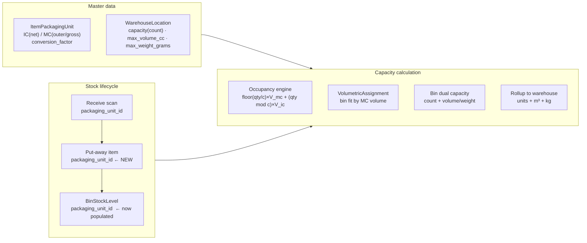

# MC (Master Carton) Packaging-Aware Bin & Warehouse Capacity — Design

> Status: **Design for review**
> Scope: `core-service` (FastAPI + SQLAlchemy + PostgreSQL)
> Related: `BIN_VOLUME_CAPACITY_SERVICE_DESIGN.md`, `.kiro/specs/wms-multi-uom-packaging-units/`

---

## 1. Purpose / Problem being solved

The WMS already has two capacity systems, but they are **disconnected**, so MC-level
(master carton) volume never reaches the capacity engine:

1. **Count capacity** (`CapacityService` + `warehouse_locations.capacity/total_capacity/available_capacity`) — counts "units".
2. **Volume/weight capacity** (`BinCapacityService` + `capacity_math.py`) — computes m³/kg from `item_packaging_units` dimensions.

Problems this design fixes:

| # | Problem | Root cause |
|---|---|---|
| P1 | MC outer dimensions are defined in master data but never used in capacity | `packaging_unit_id` is not carried from receiving → put-away → bin stock (the "wiring gap") |
| P2 | Volume over-count when a stock row is packaged in an MC | formula uses `qty(eaches) × MC_volume` instead of dividing by `conversion_factor` |
| P3 | No MC break / de-aggregation — partial picking cannot switch MC outer volume → loose IC volume | no re-cubing logic |
| P4 | Bin capacity is enforced on **count only** in `add_stock` | `bin_stock_service.add_stock` checks `bin.capacity` but not `max_volume_cc/max_weight_grams` |
| P5 | Bin/warehouse reporting shows either count **or** volume, not both | `BinCapacityService` reports volume/weight; `CapacityService` reports count |

**Goal:** make the MC packaging unit the source of truth for outer volume, carry it
end-to-end, compute volume correctly, enforce **both count and volume** at the bin
level, and roll up both to the warehouse.

---

## 1b. Key concepts — `conversion_factor` vs `item_packaging_units`

`conversion_factor` and `item_packaging_units` are not alternatives; one is a
**table**, the other is a **column on that table**.

| Term | What it is |
|---|---|
| `item_packaging_units` | The table holding the packaging hierarchy — one row per packaging level of an item (Each/IC, Carton/MC, optionally Pallet). |
| `conversion_factor` | A column on each row: how many base units (Eaches/IC) are inside **one** of that level. |

```
item_packaging_units
├─ row A: unit_name="Each",        conversion_factor=1   (base / IC)
├─ row B: unit_name="Carton of 12", conversion_factor=12 (MC → 12 Eaches)
└─ row C: unit_name="Pallet of 48", conversion_factor=48 (optional)
```

**The parent→child mapping is implicit.** It is encoded by `conversion_factor` on
the non-base row, always relative to the base unit. There is no
`parent_packaging_unit_id` column — each level simply declares "I contain N Eaches".
This is sufficient because the design sticks to **MC as the only non-base level**
(no pallet tier requiring chain math). If a pallet tier is added later, it becomes
base → MC → pallet and each row still converts down to base.

### What is carried through put-away (and what is not)

Only a **pointer** is carried, never a mapping tree:

```
scan (QR → packaging_unit_id) → put_away_item.packaging_unit_id → bin_stock_levels.packaging_unit_id
```

`packaging_unit_id` is a UUID referencing the MC row. The full parent→child
relationship is **always re-derived from master data at calculation time**:

```
packaging_unit_id → item_packaging_units.conversion_factor → base unit row
```

So nothing breaks if master data is edited or stock moves — the mapping is resolved
fresh each time, never frozen into the stock record.

### Does the mapping "break" during picking?

No. The parent→child relationship is **not stored as a mutable container**; it is
**recomputed from `quantity_on_hand` at every capacity calculation** (§4 formula):

| Bin state | qty (eaches) | Calculation | Result |
|---|---|---|---|
| Intact carton received | 12 | ⌊12/12⌋=1, 12%12=0 | `1 × V_mc` |
| Pick 2 eaches | 10 | ⌊10/12⌋=0, 10%12=10 | `10 × V_ic` ← re-cubed, nothing broke |
| Pick 4 more | 6 | ⌊6/12⌋=0 | `6 × V_ic` |
| Two cartons + 3 loose | 27 | ⌊27/12⌋=2, 27%12=3 | `2 × V_mc + 3 × V_ic` |

The "break" is the desired **dynamic re-cubing** from the document ("when a case is
partially picked, switch from full-case outer cubing to loose item cubing"). It
happens automatically as quantity decreases — no record is mutated, no link
destroyed. This is why Option A (formula-based) is preferred over an explicit break
operation.

### Two independent "parent→child" concepts — do not merge them

| Concept | Where stored | Purpose |
|---|---|---|
| **Volumetric conversion** | `item_packaging_units.conversion_factor` (MC → N Eaches) | volume/weight capacity math |
| **Serialized grouping** | `put_away_list_items.serial_nos` + `items_per_master_pack` | which specific serialized units are inside *this* carton |

`conversion_factor` answers "how much space/weight does one carton occupy";
`serial_nos` answers "which physical units are in this carton". Picking affects both —
quantity drops (re-cubes volume) and the serial list is consumed — but neither
destroys the MC→IC conversion rule in master data.

---

## 1c. `conversion_factor` vs `items_per_master_pack`

Both are columns on `item_packaging_units`, often equal in value but different in
purpose — they must not be collapsed into one field.

| Field | Type | Meaning | Consumed by |
|---|---|---|---|
| `conversion_factor` | `Numeric(15,6)` | how many base Eaches are inside **one unit** of this pack level (quantity/volume bridge) | receiving approval (`raw_qty × factor`), capacity math §4, volumetric assignment |
| `items_per_master_pack` | `Integer` | how many **serialized** Eaches are grouped into one master pack (serial grouping count) | `put_away_service._items_per_master_pack` → `_build_put_away_specs` chunks slip serials into cartons |

- `conversion_factor` is about **quantity/space**: "1 carton = 12 eaches".
- `items_per_master_pack` is about **identity grouping**: "these 12 specific serials travel together in one carton".

They may both equal 12, but they drive different flows: the first feeds volume math,
the second feeds `serial_nos` grouping on the put-away item.

### Configuration rules (this deployment: `conversion_factor` == `items_per_master_pack`)

Warehouse ASN movement only deals with whole **master cartons** — there is no
Each/IC-level movement. Consequently `conversion_factor` ("items per master pack")
is the **single source of truth**, and `items_per_master_pack` is an optional
explicit override of the same number.

- `conversion_factor` is **mandatory** (`NOT NULL`, schema `gt=0`) on every
  `item_packaging_units` row — including the base "Each" row auto-created at item
  creation (`item_service`). Receiving approval
  (`eaches = int(raw_qty × conversion_factor)`), capacity math (§4), and put-away
  master-pack grouping all read `conversion_factor`.
- `items_per_master_pack` is **optional** (`NULL` default). `_items_per_master_pack`
  prefers it when set, then falls back to the MC `conversion_factor` — so a single
  configured value drives both volume conversion and serial/master-pack grouping.
- Outbound case-split (`outbound_order_service`) already prefers
  `items_per_master_pack`, then falls back to `conversion_factor`.

**Recommendation:** maintain `conversion_factor` only (the items-per-master-pack
count). Set `items_per_master_pack` only if a specific pack size differs from
`conversion_factor`.

### Inter-warehouse transfer — does the mapping survive?

No breakage, because the mapping is **never transported as data** — it is re-derived
at the destination.

Flow (mother warehouse → child warehouse, same org):

1. Source outbound picks the MC — quantity decremented in Eaches; serials carried on the pick/packing documents.
2. Dispatch ships **SKU + Eaches quantity + serials**.
3. Destination inbound scans the MC QR — `packaging_unit_qr_id` resolves `packaging_unit_id` against the same org's master data.
4. Destination put-away re-groups serials with `items_per_master_pack` and re-applies `conversion_factor` for volume.

What must survive the transfer (and already does): **SKU identity, Eaches quantity, serials**.
What is *not* transported (correctly): the `packaging_unit_id` pointer — it is
re-resolved from the destination scan, never carried as state.

**Caveat — cross-org transfers:** `item_packaging_units` is org-scoped
(`organization_id`). If mother and child are different **organizations**, the
destination org must have its own packaging-unit master defined; otherwise the
destination scan resolves nothing and the stock falls back to base-unit (IC) volume.
Same-org mother/child warehouses share master data, so this is a non-issue there.

**Note:** `bin_stock_service.transfer_stock` is bin-to-bin **within the same
warehouse only** (it raises otherwise). Cross-warehouse movement goes through
outbound → inbound (dispatch + ASN/receiving), not `transfer_stock`.

---

## 2. Where MC packing volume is SET (master data)

MC outer volume belongs to the **MC packaging-unit row**, not the item header and
not the base unit.

`item_packaging_units` — one row per pack level:

| Field | IC row (base unit) | MC row (master carton) |
|---|---|---|
| `unit_name` | "Each" | "Carton of 12" |
| `conversion_factor` | `1` | `12` (eaches per MC) |
| `length_mm × width_mm × height_mm` | **net** item dimensions | **outer** carton dimensions (incl. cardboard thickness) |
| `weight_grams` | **net** weight | **gross** weight |
| `is_base_unit` | `true` | `false` |
| `packaging_type_id` | optional | optional — reuse a shared `packaging_types` row (standard outer dims) |

- The base-unit row (IC) is the fallback for loose/Eaches volume.
- The MC row (IC conversion > 1) is what the capacity engine must use for **intact master cartons**.
- `conversion_factor` is the bridge between the two (Eaches ↔ MC count).

> Today the table stores a single L/W/H/weight per level. The IC/net vs MC/gross
> distinction is therefore **by convention on the row level** (base unit = net,
> MC = outer/gross). An optional hardening (phase 6) adds explicit `gross_*` columns
> if operators need to store both net and gross on the same row.

### Factors for MC outer dimensions

MC outer dims are **never** derived as `count × base dims`. They are a separate
physical measurement that must account for:

1. **Unit count per carton** — `items_per_master_pack` / `conversion_factor`.
2. **Arrangement & orientation** — units per layer, number of layers, stacking/nesting pattern.
3. **Packing efficiency (fill factor)** — air gaps, void space between units and carton walls.
4. **Carton wall thickness** — corrugated board (single/double wall), added on each side.
5. **Void fill allowance** — a padding buffer (default 10%) for bubble wrap / dunnage.
6. **Internal dunnage / partitions / dividers / liners** — extra volume they consume.
7. **Gross weight** = Σ(net unit weights) + carton tare + dunnage.

Three of these are configurable in the item form:
`master_pack_fill_factor` (default `0.75`), `master_pack_void_fill_pct`
(default `0.10`), and `master_pack_wall_thickness_mm` (default `3`). The rest
must be captured by entering real outer dims.

> Note: when **static** MC dims are provided (Option 1 with explicit
> `master_pack_length/width/height_mm`), none of these estimation knobs apply —
> the real carton outer dims already include the dunnage/wall space.

### Auto-creation of the master-carton row

`item_service._upsert_base_packaging_unit` now also calls
`_upsert_master_pack_unit`, which creates/updates the MC packaging-unit row when
`items_per_master_pack > 1` (or `conversion_factor > 1`).

New fields on `ItemPackagingDetails` (the Item & UOM "Packaging Details" form):

| Field | Type | Default | Purpose |
|---|---|---|---|
| `master_pack_unit_name` | `str` | `"Master Pack of {N}"` | MC row's `unit_name` |
| `master_pack_length_mm` | `Decimal` | `None` | explicit MC outer length |
| `master_pack_width_mm` | `Decimal` | `None` | explicit MC outer width |
| `master_pack_height_mm` | `Decimal` | `None` | explicit MC outer height |
| `master_pack_weight_grams` | `Decimal` | `None` | explicit MC gross weight |
| `master_pack_fill_factor` | `Decimal` | `0.75` | packing efficiency for the estimate |
| `master_pack_void_fill_pct` | `Decimal` | `0.10` | dunnage/bubble-wrap buffer for the estimate |
| `master_pack_wall_thickness_mm` | `Decimal` | `3` | carton wall per side for the estimate |

The MC row is written with:
- `conversion_factor` = `items_per_master_pack` = `N`, `is_base_unit = false`.
- Outer dims = explicit `master_pack_*_mm` when provided; otherwise **estimated**:
  $$\text{scale} = \left(\frac{N \times (1 + \text{void\_fill\_pct})}{\text{fill factor}}\right)^{1/3},\qquad
  \text{outer} = \text{base\_dim} \times \text{scale} + 2 \times \text{wall thickness}$$
- Weight = explicit `master_pack_weight_grams`, else `N × base net weight`.

**Update behaviour:** on update, only the count and explicitly-provided overrides
are applied — existing operator-entered outer dims are **never** overwritten by a
re-estimate. New rows are estimated on creation only.

The estimate is a starting point — operators should overwrite it with the real
carton outer dimensions, since arrangement and dunnage cannot be inferred from
the base-unit dims alone.

---

## 3. Where MC volume PLAYS A ROLE (consumers)



MC volume is consumed at five points:

1. **Put-away bin assignment** — `VolumetricAssignmentService._find_best_bin` needs the
   MC's required volume/weight to pick a bin with enough free `max_volume_cc`/`max_weight_grams`.
2. **Bin occupancy** — `capacity_math.py` must use MC outer volume for intact cartons.
3. **Bin capacity enforcement** — `bin_stock_service.add_stock` must reject when either
   count **or** volume/weight would be exceeded.
4. **Warehouse rollup / 3-D view / availability** — `BinCapacityService` rolls up both
   units and m³/kg; `bin_state`/`is_available` derive from the binding constraint.
5. **(Optional) MC break** — a worker action that changes a stock row from MC to IC and
   re-cubes (see §6).

---

## 4. Corrected capacity math

Stock is stored in **Eaches** (`bin_stock_levels.quantity_on_hand`), but the packaging
unit of that stock row tells us how those Eaches are physically held.

For one stock row with packaging unit `pu` (conversion factor `c`, outer volume `V_pu`
from `length×width×height`, gross weight `W_pu`) and item base unit (`V_ic`, `W_ic`):

$$
n_{full} = \left\lfloor \frac{qty}{c} \right\rfloor,\qquad
n_{loose} = qty \bmod c
$$

$$
V_{row} =
\begin{cases}
n_{full} \times V_{pu} + n_{loose} \times V_{ic} & \text{if } c > 1 \text{ (MC / outer)} \\[2pt]
qty \times V_{ic} & \text{if } c = 1 \text{ (base / IC)}
\end{cases}
$$

$$
W_{row} =
\begin{cases}
n_{full} \times W_{pu} + n_{loose} \times W_{ic} & \text{if } c > 1 \\[2pt]
qty \times W_{ic} & \text{otherwise}
\end{cases}
$$

**Why this formula:**
- 12 Eaches held as 1 intact "Carton of 12" → `1 × V_mc + 0 × V_ic` (correct: one carton, not twelve).
- 14 Eaches → `1 × V_mc + 2 × V_ic` (one carton + two loose).
- 10 Eaches (carton opened, 2 picked) → `0 × V_mc + 10 × V_ic` (self re-cubes on partial pick).
- Fallback when `packaging_unit_id` is null: treat `c = 1`, `V_pu = V_ic` (today's behavior).

This **replaces** the current `qty × V_pu` formula in:
- `capacity_math.py` `_BIN_OCCUPANCY_SQL` / `_WAREHOUSE_OCCUPANCY_SQL`
- `volumetric_assignment_service.py` `_calc_volume` / `_calc_weight`

Bin occupancy then aggregates rows as today: `V_occupied = Σ V_row`, `W_occupied = Σ W_row`.

Utilization / binding pct stay as in `BIN_VOLUME_CAPACITY_SERVICE_DESIGN.md §4.3`:
`binding_pct = max(vol_pct, wt_pct)`.

---

## 5. Bin level: keep BOTH units and volume

A bin must be reported and enforced on **three metrics simultaneously**:

| Metric | Source | Constraint |
|---|---|---|
| Unit count | `Σ quantity_on_hand` (Eaches) | `warehouse_locations.capacity` (+ `capacity_uom`) |
| Master carton count | `Σ floor(qty/c)` per stock row | optional `max_master_packs` (phase 5, optional) |
| Volume | `Σ V_row` (m³) | `warehouse_locations.max_volume_cc` |
| Weight | `Σ W_row` (kg) | `warehouse_locations.max_weight_grams` |

Rules:
- **Null = unconstrained** for volume/weight (unchanged). `capacity = 0` = unlimited count (unchanged).
- A bin is **full/over-limit when ANY set constraint is binding** — `is_available` becomes
  `count_within_limit AND volume_within_limit AND weight_within_limit AND not reserved`.
- `bin_state` keeps using `binding_pct = max(vol_pct, wt_pct)` against thresholds, but the
  availability gate adds the count check (count has no threshold; it's a hard 0/1 limit).

Changes:
- `bin_stock_service.add_stock` / `remove_stock`: after computing the new totals, also check
  `max_volume_cc` / `max_weight_grams` (not just `capacity`), and reject with a clear error
  naming the binding dimension.
- `BinCapacityService` responses (`BinCapacityResponse`, `CapacityTreeNode`,
  `AvailableBinResponse`) add `unit_count`, `master_pack_count`, `count_capacity`,
  `count_pct` alongside the existing `volume`/`weight` blocks.
- Warehouse rollup (`get_capacity_tree`) aggregates **both** units and m³/kg up the tree.

---

## 6. MC break / de-aggregation (re-cubing)

Two options; **Option A is recommended for v1** because it needs no new workflow.

**Option A — formula-based self re-cubing (recommended):**
The §4 formula already re-cubes automatically as `quantity_on_hand` decreases on pick.
No separate "break" event is required for correct accounting. An optional
`loose_fill_factor` (default `1.0`) can be multiplied onto `n_loose × V_ic` to allow for
opened-carton dunnage ("picking-face fill factor allowance").

**Option B — explicit break operation (only if deterministic carton shell accounting is needed):**
- New endpoint `POST /bin-stock/{id}/break-pack` that:
  - reads the row's `packaging_unit_id` (MC),
  - sets it to the item's base unit (IC) or splits into one IC row,
  - calls `BinCapacityService.refresh_bin`.
- Until broken, an opened but un-broken carton is still accounted as one full MC.

> Recommendation: ship Option A first; add Option B only if operations reports that
> opened-carton shells materially distort utilization.

---

## 7. Implementation plan

| Phase | Change | Files |
|---|---|---|
| 1 | Migration: add `put_away_list_items.packaging_unit_id` (UUID, FK `item_packaging_units`, `SET NULL`) | new Alembic revision |
| 2 | Model + schema: `PutAwayListItem.packaging_unit_id` | `app/models/put_away_list.py`, `app/schemas/put_away_list.py` |
| 3 | Carry the packaging unit end-to-end: `_build_put_away_specs` → `_create_list_from_specs` → `complete_item` sets `BinStockLevel.packaging_unit_id` | `app/services/put_away_service.py`, `app/services/inbound_service.py` |
| 4 | Fix volume/weight math (divide by `conversion_factor`, full-MC + remainder) | `app/services/capacity_math.py`, `app/services/volumetric_assignment_service.py` |
| 5 | Bin dual capacity: enforce count + volume/weight in `add_stock`; add unit/master-pack metrics to capacity responses + rollup | `app/services/bin_stock_service.py`, `app/services/bin_capacity_service.py`, `app/schemas/capacity.py` |
| 6 | (Optional) gross/net column split on `item_packaging_units`; `loose_fill_factor`; MC-break endpoint | models + migration + endpoint |
| 7 | Tests: occupancy math, wiring, dual-capacity enforcement, rollup | `tests/` |

Phases 1–5 are the correctness-critical path and match the two issues I flagged earlier
(the `packaging_unit_id` wiring gap and the Eaches×MC-volume over-count).

---

## 8. Acceptance criteria

1. Creating an item with an MC packaging unit (e.g. "Carton of 12", outer dims) and
   receiving one MC shows bin occupancy of `1 × V_mc`, not `12 × V_mc`.
2. Put-away assigns the MC to a bin whose free `max_volume_cc` ≥ MC outer volume.
3. `add_stock` rejects stock that would exceed either count **or** volume/weight.
4. `GET /capacity/warehouses/{id}/tree` returns `unit_count`, `master_pack_count`,
   `occupied_m3`, and `capacity_m3` at every level.
5. Picking 2 Eaches from a 12-pack reduces occupied volume from `1 × V_mc` to `10 × V_ic`
   (self re-cubing) — or, if Option B is chosen, only after an explicit break.
