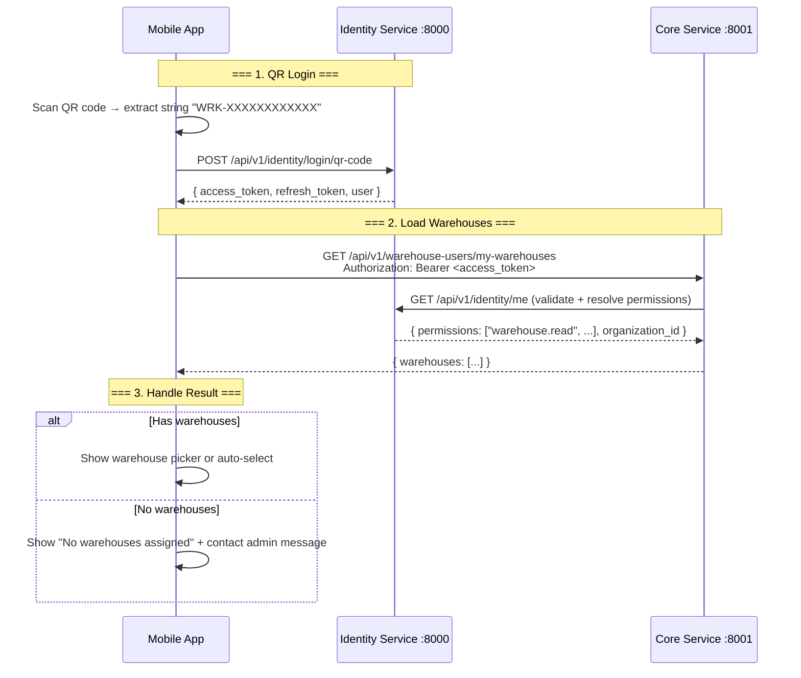

# Horizon Sync — Mobile App: Loading Warehouses for Workers

> **Version**: 1.0
> **Date**: 2026-07-13
> **Applies to**: Mobile App (React Native / Flutter)
> **Base URLs**:
>
> - Identity Service (Auth): `http://<host>:8000/api/v1`
> - Core Service (WMS): `http://<host>:8001/api/v1`

---

## Table of Contents

1. [Overview](#1-overview)
2. [End-to-End Flow](#2-end-to-end-flow)
3. [Step 1: QR Code Login](#3-step-1-qr-code-login)
4. [Step 2: Load Assigned Warehouses](#4-step-2-load-assigned-warehouses)
5. [Step 3: Handle Empty Warehouse List](#5-step-3-handle-empty-warehouse-list)
6. [Step 4: Warehouse Selection & Persistence](#6-step-4-warehouse-selection--persistence)
7. [Implementation Guide (Pseudocode)](#7-implementation-guide-pseudocode)
8. [Error Reference](#8-error-reference)
9. [FAQ](#9-faq)

---

## 1. Overview

After a warehouse worker logs in by scanning their QR code, the app must load the list of warehouses they have access to. A worker may be assigned to **one or more warehouses** (or, in edge cases, **none**). The app must handle all of these scenarios gracefully.

### Key Points

| Point                  | Detail                                                                 |
| ---------------------- | ---------------------------------------------------------------------- |
| **Login endpoint**     | `POST /identity/login/qr-code` (Identity Service, public)              |
| **Warehouse endpoint** | `GET /warehouse-users/my-warehouses` (Core Service, auth required)     |
| **Auth required**      | `warehouse.read` permission (included in `warehouse_work_user` role)   |
| **Token TTL**          | 20 hours (for QR login tokens)                                         |
| **Warehouse lookup**   | Based on `warehouse_users` table — assignments created at worker setup |

---

## 2. End-to-End Flow



---

## 3. Step 1: QR Code Login

```
POST /api/v1/identity/login/qr-code
Content-Type: application/json
```

### Request

```json
{
  "qr_code": "WRK-G22GRILS9WA7"
}
```

| Field     | Type   | Required | Description                            |
| --------- | ------ | -------- | -------------------------------------- |
| `qr_code` | string | Yes      | QR code string extracted from the scan |

### Success Response `200`

```json
{
  "access_token": "eyJhbGciOiJIUzI1NiIs...",
  "refresh_token": "eyJhbGciOiJIUzI1NiIs...",
  "token_type": "bearer",
  "expires_in": 72000,
  "user": {
    "id": "876e2a23-c40f-4901-8e7f-ae5cb5553bef",
    "email": "mohan@gmail.com",
    "first_name": "Mohan",
    "last_name": "Singh",
    "display_name": "Mohan Singh",
    "user_type": "warehouse_worker",
    "organization_id": "b5863590-fb53-4d22-a956-956aafc1c13e",
    "is_active": true
  }
}
```

| Field                  | Type   | Description                                    |
| ---------------------- | ------ | ---------------------------------------------- |
| `access_token`         | string | JWT — use as `Authorization: Bearer <token>`   |
| `refresh_token`        | string | JWT — use for silent token refresh             |
| `expires_in`           | int    | Seconds until token expires (72000 = 20 hours) |
| `user.id`              | UUID   | Worker's unique ID                             |
| `user.organization_id` | UUID   | Organization the worker belongs to             |

### What to Do After Login

```
1. Store access_token + refresh_token in secure storage
2. Store user.id + user.organization_id for later use
3. Immediately call the warehouse loading endpoint
```

---

## 4. Step 2: Load Assigned Warehouses

```
GET /api/v1/warehouse-users/my-warehouses
Authorization: Bearer <access_token>
```

### Success Response `200` — Worker Has Assignments

```json
{
  "warehouses": [
    {
      "id": "8c242462-120e-46bc-83f4-a536bd8f7ea3",
      "name": "Main Warehouse",
      "code": "WH-MAIN",
      "city": "Mumbai",
      "type": "warehouse",
      "is_default": true,
      "assignment_role": "operator",
      "assignment_id": "a1b2c3d4-..."
    },
    {
      "id": "9d353573-231f-57cd-94f5-b647ce9f8fb4",
      "name": "East Distribution Center",
      "code": "WH-EAST",
      "city": "Delhi",
      "type": "warehouse",
      "is_default": false,
      "assignment_role": "operator",
      "assignment_id": "b2c3d4e5-..."
    }
  ]
}
```

### Response Fields

| Field             | Type    | Description                                                      |
| ----------------- | ------- | ---------------------------------------------------------------- |
| `id`              | UUID    | Warehouse unique ID                                              |
| `name`            | string  | Display name                                                     |
| `code`            | string  | Short code (e.g., `WH-MAIN`)                                     |
| `city`            | string  | City where warehouse is located                                  |
| `type`            | string  | `warehouse`, `store`, `virtual`, or `transit`                    |
| `is_default`      | boolean | Whether this is the org's default warehouse                      |
| `assignment_role` | string  | Worker's role in this warehouse (`operator`, `supervisor`, etc.) |
| `assignment_id`   | UUID    | ID of the warehouse-user assignment record                       |

### Success Response `200` — Worker Has NO Assignments

```json
{
  "warehouses": []
}
```

This is a **valid response**. See [Step 3](#5-step-3-handle-empty-warehouse-list) for how to handle it.

### Possible Error Responses

| Status | Code                | Meaning                                                     |
| ------ | ------------------- | ----------------------------------------------------------- |
| `401`  | Invalid token       | Token expired or malformed — redirect to login              |
| `403`  | Permission denied   | Worker lacks `warehouse.read` — contact admin               |
| `503`  | Service unavailable | Identity service unreachable from core — retry with backoff |

---

## 5. Step 3: Handle Empty Warehouse List

When the worker has **no warehouses assigned**, the response is `{ "warehouses": [] }`. This is not an error — it means:

- The admin created the worker but the warehouse assignment failed (silent failure in backend)
- OR the worker was created without specifying any warehouse IDs

### What the App Should Do

```
┌──────────────────────────────────────────────────────┐
│  EMPTY WAREHOUSE LIST                                │
│                                                      │
│  1. Show a user-friendly message:                     │
│     "You are not assigned to any warehouse.          │
│      Please contact your administrator."              │
│                                                      │
│  2. Provide a "Logout" button                         │
│                                                      │
│  3. Do NOT show an infinite spinner or crash          │
│                                                      │
│  4. Optionally: a "Retry" button that re-calls        │
│     GET /warehouse-users/my-warehouses                │
└──────────────────────────────────────────────────────┘
```

### UI States Summary

| State        | Warehouses | Action                                                |
| ------------ | ---------- | ----------------------------------------------------- |
| **Multiple** | 2+         | Show warehouse picker (list or dropdown)              |
| **Single**   | 1          | Auto-select this warehouse, skip the picker           |
| **Empty**    | 0          | Show "No warehouses assigned" message + logout button |
| **Loading**  | —          | Show skeleton/spinner while API call is in flight     |
| **Error**    | —          | Show error message + retry button                     |

---

## 6. Step 4: Warehouse Selection & Persistence

### When Worker Has Multiple Warehouses

```
┌──────────────────────────────────────────┐
│  SELECT WAREHOUSE                         │
│                                           │
│  ○ Main Warehouse         (WH-MAIN)       │
│  ○ East Distribution Ctr  (WH-EAST)       │
│                                           │
│        [ Continue ]                       │
└──────────────────────────────────────────┘
```

### Persist the Selected Warehouse

Once the worker picks a warehouse:

```
1. Store selected warehouse { id, name, code } in local storage
2. Use this warehouse_id for all subsequent API calls:
   - GET  /api/v1/warehouses/<id>
   - POST /api/v1/inbound/sessions  (warehouse_id in body)
   - GET  /api/v1/pick-lists?warehouse_id=<id>
3. On next app launch, auto-select the persisted warehouse
4. Allow the worker to switch warehouses via a picker in the header
```

---

## 7. Implementation Guide (Pseudocode)

### 7.1 React Native (TypeScript)

```typescript
// types.ts
interface Warehouse {
  id: string;
  name: string;
  code: string;
  city: string;
  type: "warehouse" | "store" | "virtual" | "transit";
  is_default: boolean;
  assignment_role?: string;
  assignment_id?: string;
}

interface QRLoginResponse {
  access_token: string;
  refresh_token: string;
  token_type: string;
  expires_in: number;
  user: {
    id: string;
    email: string;
    first_name: string;
    last_name: string;
    user_type: string;
    organization_id: string;
    is_active: boolean;
  };
}

interface WarehouseListResponse {
  warehouses: Warehouse[];
}

// api.ts
const IDENTITY_BASE = "http://<host>:8000/api/v1";
const CORE_BASE = "http://<host>:8001/api/v1";

async function qrCodeLogin(qrCode: string): Promise<QRLoginResponse> {
  const response = await fetch(`${IDENTITY_BASE}/identity/login/qr-code`, {
    method: "POST",
    headers: { "Content-Type": "application/json" },
    body: JSON.stringify({ qr_code: qrCode }),
  });

  if (!response.ok) {
    const error = await response.json();
    throw new Error(error.detail || "Login failed");
  }

  return response.json();
}

async function loadMyWarehouses(token: string): Promise<Warehouse[]> {
  const response = await fetch(`${CORE_BASE}/warehouse-users/my-warehouses`, {
    method: "GET",
    headers: {
      Authorization: `Bearer ${token}`,
      "Content-Type": "application/json",
    },
  });

  if (response.status === 401) {
    throw new Error("TOKEN_EXPIRED");
  }
  if (response.status === 403) {
    throw new Error("PERMISSION_DENIED");
  }
  if (!response.ok) {
    throw new Error("Failed to load warehouses");
  }

  const data: WarehouseListResponse = await response.json();
  return data.warehouses;
}

// LoginFlow.tsx — the complete login + warehouse loading flow
async function handleQRScan(qrCode: string) {
  // 1. Login
  setState({ status: "LOGGING_IN" });

  let loginResult: QRLoginResponse;
  try {
    loginResult = await qrCodeLogin(qrCode);
  } catch (err) {
    setState({ status: "LOGIN_FAILED", error: err.message });
    return;
  }

  // 2. Store tokens
  await SecureStore.setItemAsync("access_token", loginResult.access_token);
  await SecureStore.setItemAsync("refresh_token", loginResult.refresh_token);
  await SecureStore.setItemAsync("user_id", loginResult.user.id);
  await SecureStore.setItemAsync("org_id", loginResult.user.organization_id);

  // 3. Load warehouses
  setState({ status: "LOADING_WAREHOUSES" });

  let warehouses: Warehouse[];
  try {
    warehouses = await loadMyWarehouses(loginResult.access_token);
  } catch (err) {
    if (err.message === "TOKEN_EXPIRED") {
      setState({ status: "LOGIN_FAILED", error: "Session expired" });
    } else {
      setState({ status: "WAREHOUSE_LOAD_FAILED", error: err.message });
    }
    return;
  }

  // 4. Handle warehouse list
  if (warehouses.length === 0) {
    setState({
      status: "NO_WAREHOUSES",
      message: "You are not assigned to any warehouse. Contact your admin.",
    });
    return;
  }

  if (warehouses.length === 1) {
    // Auto-select
    setState({ status: "READY", selectedWarehouse: warehouses[0] });
    navigateToHome(warehouses[0]);
  } else {
    // Show picker
    setState({ status: "SELECT_WAREHOUSE", warehouses });
  }
}
```

### 7.2 Flutter (Dart)

```dart
// models.dart
class Warehouse {
  final String id;
  final String name;
  final String code;
  final String? city;
  final String? type;
  final bool isDefault;
  final String? assignmentRole;
  final String? assignmentId;

  Warehouse({required this.id, required this.name, required this.code,
    this.city, this.type, this.isDefault = false,
    this.assignmentRole, this.assignmentId});

  factory Warehouse.fromJson(Map<String, dynamic> json) => Warehouse(
    id: json['id'],
    name: json['name'],
    code: json['code'],
    city: json['city'],
    type: json['type'],
    isDefault: json['is_default'] ?? false,
    assignmentRole: json['assignment_role'],
    assignmentId: json['assignment_id'],
  );
}

// auth_service.dart
class AuthService {
  static const _identityBase = 'http://<host>:8000/api/v1';
  static const _coreBase = 'http://<host>:8001/api/v1';

  Future<Map<String, dynamic>> qrCodeLogin(String qrCode) async {
    final response = await http.post(
      Uri.parse('$_identityBase/identity/login/qr-code'),
      headers: {'Content-Type': 'application/json'},
      body: jsonEncode({'qr_code': qrCode}),
    );

    if (response.statusCode != 200) {
      final error = jsonDecode(response.body);
      throw Exception(error['detail'] ?? 'Login failed');
    }

    return jsonDecode(response.body);
  }

  Future<List<Warehouse>> loadMyWarehouses(String token) async {
    final response = await http.get(
      Uri.parse('$_coreBase/warehouse-users/my-warehouses'),
      headers: {
        'Authorization': 'Bearer $token',
        'Content-Type': 'application/json',
      },
    );

    if (response.statusCode == 401) throw Exception('TOKEN_EXPIRED');
    if (response.statusCode == 403) throw Exception('PERMISSION_DENIED');
    if (response.statusCode != 200) throw Exception('Failed to load warehouses');

    final data = jsonDecode(response.body);
    return (data['warehouses'] as List)
        .map((w) => Warehouse.fromJson(w))
        .toList();
  }
}

// login_screen.dart
Future<void> _handleQRScan(String qrCode) async {
  setState(() => _status = 'Logging in...');

  try {
    // 1. QR Login
    final loginData = await AuthService().qrCodeLogin(qrCode);
    final token = loginData['access_token'];

    // 2. Store credentials
    final prefs = await SharedPreferences.getInstance();
    await prefs.setString('access_token', token);
    await prefs.setString('refresh_token', loginData['refresh_token']);

    // 3. Load warehouses
    setState(() => _status = 'Loading warehouses...');
    final warehouses = await AuthService().loadMyWarehouses(token);

    // 4. Handle result
    if (warehouses.isEmpty) {
      setState(() => _status = 'no_warehouses');
      return;
    }

    if (warehouses.length == 1) {
      _navigateToHome(warehouses.first);
    } else {
      setState(() {
        _status = 'select_warehouse';
        _warehouses = warehouses;
      });
    }
  } on Exception catch (e) {
    setState(() {
      _status = 'error';
      _error = e.toString();
    });
  }
}
```

---

## 8. Error Reference

All errors the warehouse loading step can produce, and what the app should do:

| Status | Detail                                        | App Behavior                                                              |
| ------ | --------------------------------------------- | ------------------------------------------------------------------------- |
| `401`  | `Invalid authentication credentials`          | Token expired or malformed. Clear stored tokens, redirect to QR scanner.  |
| `401`  | `Unable to determine user organization`       | Worker has no organization. Contact admin.                                |
| `403`  | `Permission denied. Required: warehouse.read` | Worker role lacks permission. Contact admin.                              |
| `503`  | `Identity service unavailable`                | Core can't reach identity to validate token. Retry in 5s, max 3 attempts. |

### Retry Strategy (Pseudocode)

```typescript
async function loadWarehousesWithRetry(
  token: string,
  maxRetries = 3,
  delayMs = 5000,
): Promise<Warehouse[]> {
  for (let i = 0; i < maxRetries; i++) {
    try {
      return await loadMyWarehouses(token);
    } catch (err) {
      if (
        err.message === "TOKEN_EXPIRED" ||
        err.message === "PERMISSION_DENIED"
      ) {
        throw err; // Don't retry auth errors
      }
      if (i === maxRetries - 1) throw err; // Last attempt failed
      await new Promise((r) => setTimeout(r, delayMs)); // Wait, then retry
    }
  }
  throw new Error("Max retries exceeded");
}
```

---

## 9. FAQ

### Q: Why do I get an empty warehouse list even though the worker was created with warehouse IDs?

**A:** This happens when the backend's internal call to create the warehouse-user assignment fails silently. The worker exists in the identity database, but the assignment record in the `warehouse_users` table was never created. The admin needs to recreate the worker or manually assign them to a warehouse.

### Q: Which endpoint should I use — `/warehouse-users/my-warehouses` or `/warehouses?scope=assigned`?

**A:** Use `/warehouse-users/my-warehouses` for the initial load after login. It's simpler, returns all assigned warehouses at once without pagination, and includes the `assignment_role` field. Use `/warehouses?scope=assigned` when you need pagination, filtering, or sorting.

### Q: Can the worker switch warehouses after selecting one?

**A:** Yes. Store the list of warehouses from the initial load, and provide a warehouse switcher in the app header or settings. When the worker switches, update the persisted `selected_warehouse_id` and reload any warehouse-scoped data.

### Q: Do I need to call `/my-warehouses` on every app launch?

**A:** It's recommended to call it at least once per session (after login/token refresh) to pick up any assignment changes. You can cache the list in local storage and refresh it in the background.

### Q: What happens if the worker's assignment is removed while they're logged in?

**A:** The next time the app calls `/my-warehouses` (or any warehouse-scoped endpoint that checks assignments), the worker will see the updated list. The app should handle the case where the persisted warehouse ID is no longer in the list — fall back to the first available warehouse or show the "no warehouses" screen.
