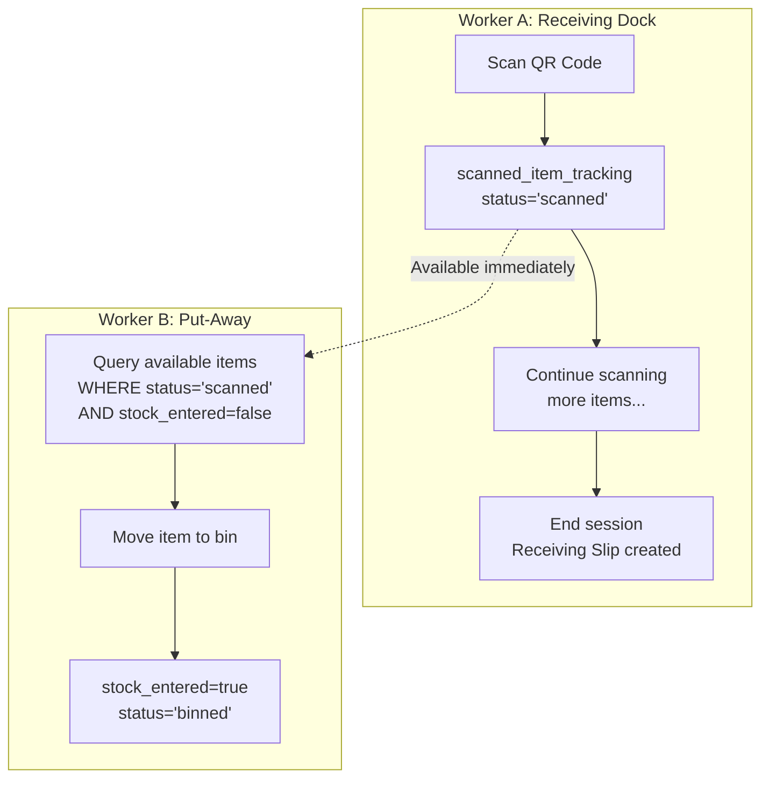

# Parallel Receiving & Put-Away Design

## Problem Statement

In a space-constrained warehouse, workers cannot store received items on the dock floor waiting for the entire receiving session to complete. Workers must be able to **receive and put-away simultaneously** — Worker A scans items at the dock while Worker B moves already-scanned items directly to bins.

### Current Flow (Sequential)

```
Worker A scans all items → Session ends → Slip created → Slip approved → Put-away starts
                                                                    ↑
                                                    Worker B waits for A to finish entirely
```

### Target Flow (Parallel)

```
Worker A scans Item#1 ──▶ tracking created ──▶ Worker B can put-away Item#1 IMMEDIATELY
Worker A scans Item#2 ──▶ tracking created ──▶ Worker B can put-away Item#1 + Item#2
Worker A scans Item#3 ──▶ tracking created ──▶ Worker B can put-away all 3 items
                         Scan session still in progress
                         Receiving slip NOT yet created
                         Worker A is STILL scanning
```

---

## Architecture

### Core Concept: `scanned_item_tracking` as Real-Time Dock Inventory

The tracking table is the **handoff layer** between receiving and put-away. It records every scan as it happens, making items immediately visible to put-away workers without waiting for session completion or slip approval.



---

## Database Design

### `scanned_item_tracking` Table

```sql
CREATE TABLE scanned_item_tracking (
    id                   UUID PRIMARY KEY DEFAULT gen_random_uuid(),
    organization_id      UUID NOT NULL,
    warehouse_id         UUID NOT NULL REFERENCES warehouses_extended(id),

    -- Session & Scan context
    scan_session_id      UUID NOT NULL REFERENCES scan_sessions(id),
    scan_session_item_id UUID NOT NULL REFERENCES scan_session_items(id),
    qr_identifier        VARCHAR(255) NOT NULL,

    -- Item details
    item_id              UUID NOT NULL REFERENCES items(id),
    sku                  VARCHAR(100) NOT NULL,
    batch_number         VARCHAR(100),
    lot_number           VARCHAR(100),
    serial_number        VARCHAR(255),
    quantity             INTEGER NOT NULL DEFAULT 1,
    packaging_unit_id    UUID REFERENCES item_packaging_units(id),

    -- Receiving context (populated when slip is created)
    receiving_slip_id     UUID REFERENCES receiving_slips(id),
    receiving_slip_item_id UUID REFERENCES receiving_slip_items(id),

    -- Put-away context (populated when binned)
    put_away_list_id     UUID REFERENCES put_away_lists(id),
    put_away_item_id     UUID REFERENCES put_away_list_items(id),
    bin_location_id      UUID REFERENCES warehouse_locations(id),

    -- Lifecycle
    status               VARCHAR(30) NOT NULL DEFAULT 'scanned',
    -- Valid transitions: scanned → received → binned
    --                   scanned → rejected
    --                   scanned → binned (direct, skip received)

    stock_entered        BOOLEAN NOT NULL DEFAULT FALSE,
    stock_entered_at     TIMESTAMPTZ,
    received_at          TIMESTAMPTZ,
    binned_at            TIMESTAMPTZ,
    rejected_at          TIMESTAMPTZ,
    rejected_reason      TEXT,

    -- Metadata
    scanned_by           UUID,
    received_by          UUID,
    binned_by            UUID,
    extra_data           JSONB DEFAULT '{}',

    created_at           TIMESTAMPTZ NOT NULL DEFAULT NOW(),
    updated_at           TIMESTAMPTZ NOT NULL DEFAULT NOW(),

    -- Constraints
    CONSTRAINT uq_scan_item UNIQUE (scan_session_item_id),
    CONSTRAINT uq_qr_active UNIQUE (qr_identifier, warehouse_id)
        WHERE status IN ('scanned', 'received')
        -- Prevents same QR from being actively tracked twice in same warehouse
);

CREATE INDEX idx_sit_status        ON scanned_item_tracking(status, warehouse_id);
CREATE INDEX idx_sit_qr            ON scanned_item_tracking(qr_identifier);
CREATE INDEX idx_sit_session       ON scanned_item_tracking(scan_session_id);
CREATE INDEX idx_sit_receiving     ON scanned_item_tracking(receiving_slip_id);
CREATE INDEX idx_sit_item_wh       ON scanned_item_tracking(item_id, warehouse_id);
CREATE INDEX idx_sit_available     ON scanned_item_tracking(warehouse_id, status)
    WHERE status IN ('scanned', 'received') AND stock_entered = FALSE;
```

### Status Lifecycle

```
                    ┌──────────────┐
                    │   scanned    │ ← Created on QR scan (real-time)
                    └──┬───┬───┬──┘
                       │   │   │
              ┌────────┘   │   └────────┐
              ▼            ▼            ▼
        ┌──────────┐ ┌──────────┐ ┌──────────┐
        │ received │ │  binned  │ │ rejected │
        │(slip     │ │(direct   │ │(invalid  │
        │approved) │ │put-away) │ │QR/dup)   │
        └────┬─────┘ └──────────┘ └──────────┘
             │
             ▼
        ┌──────────┐
        │  binned  │ ← Put-away after slip approval
        └──────────┘
```

Key: `scanned → binned` is valid — put-away can happen without slip approval.

---

## API Design

### 1. On QR Scan (real-time tracking creation)

```
POST /api/v1/inbound/sessions/{session_id}/scan
```

**Behavior change**: In addition to creating `ScanSessionItem`, also creates a `scanned_item_tracking` record immediately.

```python
# inbound_service.py — _process_scan()
tracking = ScannedItemTracking(
    scan_session_id=session.id,
    scan_session_item_id=scan_item.id,
    qr_identifier=qr_data.identifier,
    item_id=item.id,
    sku=item.sku,
    batch_number=qr_data.batch,
    quantity=qr_data.quantity or 1,
    status='scanned',
    stock_entered=False,
    scanned_by=current_user.id,
)
db.add(tracking)
```

### 2. List Items Available for Put-Away (NEW endpoint)

```
GET /api/v1/put-away/available?warehouse_id={id}&session_id={id}
```

```python
# Returns items scanned but not yet binned
trackings = db.query(ScannedItemTracking).filter(
    ScannedItemTracking.warehouse_id == warehouse_id,
    ScannedItemTracking.status.in_(['scanned', 'received']),
    ScannedItemTracking.stock_entered == False,
).order_by(ScannedItemTracking.created_at).all()
```

### 3. Complete Put-Away Item (modified)

```
POST /api/v1/put-away/{list_id}/items/{item_id}/complete
```

```python
# put_away_service.py — modified

def complete_item(putaway_item, bin_location_id):
    # Find the tracking record by QR
    tracking = db.query(ScannedItemTracking).filter(
        ScannedItemTracking.qr_identifier == putaway_item.qr_identifier,
        ScannedItemTracking.warehouse_id == putaway_item.warehouse_id,
        ScannedItemTracking.status.in_(['scanned', 'received']),
        ScannedItemTracking.stock_entered == False,
    ).with_for_update().first()  # ← row lock to prevent race

    if not tracking:
        raise NotFoundError("Item not available for put-away")

    # Enter stock
    BinStockService.add_stock(
        bin_location_id=bin_location_id,
        item_id=tracking.item_id,
        quantity=tracking.quantity,
        batch_number=tracking.batch_number,
    )

    # Mark as complete
    tracking.stock_entered = True
    tracking.stock_entered_at = utcnow()
    tracking.bin_location_id = bin_location_id
    tracking.binned_by = current_user.id
    tracking.binned_at = utcnow()
    tracking.put_away_list_id = putaway_item.put_away_list_id
    tracking.put_away_item_id = putaway_item.id
    tracking.status = 'binned'
```

### 4. Approve/Reject Receiving Slip (modified)

```
POST /api/v1/inbound/receiving-slips/{id}/approve
POST /api/v1/inbound/receiving-slips/{id}/reject
```

**Behavior change**: Approve/reject only affects items still in `scanned` status.

```python
def approve_slip(slip_id):
    trackings = db.query(ScannedItemTracking).filter(
        ScannedItemTracking.receiving_slip_id == slip_id,
        ScannedItemTracking.status == 'scanned',
    ).all()

    for t in trackings:
        t.status = 'received'
        t.received_at = utcnow()
        t.received_by = current_user.id

def reject_slip(slip_id, reason):
    trackings = db.query(ScannedItemTracking).filter(
        ScannedItemTracking.receiving_slip_id == slip_id,
        ScannedItemTracking.status == 'scanned',
    ).with_for_update().all()

    for t in trackings:
        if t.stock_entered:
            raise ConflictError(
                f"Item {t.qr_identifier} already put away — cannot reject"
            )
        t.status = 'rejected'
        t.rejected_at = utcnow()
        t.rejected_reason = reason
```

---

## Race Conditions & Concurrency

| Scenario | Protection |
|---|---|
| B bins item while A rejects it | `SELECT ... FOR UPDATE` lock; reject checks `stock_entered` first |
| Two workers try to bin same item | Unique `qr_identifier` constraint on active items |
| Same QR scanned twice in one session | `UNIQUE(scan_session_id, qr_identifier)` constraint |
| Slip approval after items already binned | Approval skips `status='binned'` — idempotent |

---

## Receiving Slip Reconciliation View

When worker A ends the session, the slip shows:

```
Receiving Slip #RS-2026-00123
━━━━━━━━━━━━━━━━━━━━━━━━━━━━━━
Scanned:     15 items
Binned:      12 items  ← already put away by Worker B
Rejected:     1 item
Pending:      2 items  ← still on dock, needs action
━━━━━━━━━━━━━━━━━━━━━━━━━━━━━━
```

### GET `/api/v1/inbound/receiving-slips/{id}/summary`

```python
def get_slip_summary(slip_id):
    counts = db.query(
        ScannedItemTracking.status,
        func.count()
    ).filter(
        ScannedItemTracking.receiving_slip_id == slip_id
    ).group_by(ScannedItemTracking.status).all()

    return {
        "scanned": counts.get('scanned', 0),
        "binned": counts.get('binned', 0),
        "received": counts.get('received', 0),
        "rejected": counts.get('rejected', 0),
    }
```

---

## Migration Steps

### Phase 1: Schema (No behavior change)
1. Create `scanned_item_tracking` table
2. Run migration
3. Verify existing flows still work

### Phase 2: Insert tracking on scan
1. Add `ScannedItemTracking.create()` call to `_process_scan()`
2. Items are tracked — but put-away still uses old flow
3. Deploy and verify

### Phase 3: Enable parallel put-away
1. Add `GET /put-away/available` endpoint
2. Modify `complete_item()` to use tracking table
3. Mobile app updated to show available items
4. Deploy and test with two workers

### Phase 4: Slip reconciliation
1. Modify approve/reject to be tracking-aware
2. Add slip summary endpoint
3. Update admin UI to show binned/pending counts

---

## Edge Cases

| Case | Behavior |
|---|---|
| Worker scans, session crashes | Tracking stays `scanned` — orphan cleanup job marks as `abandoned` after N hours |
| All items binned before slip created | Slip shows 100% binned — auto-approve |
| Bin is full during put-away | Worker B scans different bin — tracking updated to new `bin_location_id` |
| Item damaged during transport | Worker B marks tracking as `damaged` instead of `binned` — triggers exception flow |
| ASN has 100 items, only 80 scanned | 20 tracking records never created — slip shows discrepancy |

---

## Summary

| | Before | After |
|---|---|---|
| Put-away wait time | Minutes to hours | **Seconds** |
| Dock space pressure | High | **Low** |
| Receiving → Put-away | Sequential | **Parallel** |
| Stock entry | At put-away only | **At put-away only (same)** |
| Double entry risk | Medium (aggregation) | **None** (unique constraint) |
| Audit trail | Lost at aggregation | **Full per-scan trace** |

---

## Scenario Analysis: Separate-Item Parallel Processing

The most common real-world scenario: Worker A and Worker B process **different items** from the same shipment independently.

```
Worker A scans Item#1 → tracking(status='scanned')     → slip later
Worker B scans Item#2 → tracking(status='binned')      → stock entered immediately
```

Both workers use the same scan session. They never touch the same item. Each complexity evaluated against this scenario:

### Complexity #1: Partial Receiving Slip State

**Problem**: Item#2 was binned via direct put-away before the slip exists. What does the slip look like?

**Resolution**: Slip only includes items in `scanned` status. Binned items are omitted — they were direct put-aways.

```python
def create_slip(session_id):
    # Only items still on the dock
    pending = db.query(ScannedItemTracking).filter(
        ScannedItemTracking.scan_session_id == session_id,
        ScannedItemTracking.status == 'scanned',
    ).all()
    
    # Binned items are already in stock — they don't appear on slip
    slip_items = [t for t in pending]
```

**Severity: Low** — simple status filter.

---

### Complexity #2: Rejection of Already-Binned Item

**Problem**: What if A tries to reject Item#2 after B already binned it?

**Resolution**: Items are independent — A rejects Item#1, B binned Item#2. They never overlap. If A tries to reject Item#2:

```python
def reject_item(tracking_id):
    tracking = db.query(ScannedItemTracking).with_for_update().get(tracking_id)
    if tracking.status == 'binned':
        raise HTTPException(409, "Item already put away — cannot reject")
    if tracking.stock_entered:
        raise HTTPException(409, "Stock already committed — cannot reject")
    tracking.status = 'rejected'
```

**Severity: None** — can never occur in the separate-items scenario.

---

### Complexity #3: Stock Not Yet Counted

**Problem**: Item#1 shows `stock_entered=false` while Item#2 shows `stock_entered=true`. Inconsistent?

**Resolution**: This is correct. Item#1 is on the dock (not in stock). Item#2 is in its bin (in stock). The flag accurately reflects physical reality.

```python
# Pick-list query — only picks up binned items
available = db.query(BinStockLevel).filter(
    BinStockLevel.warehouse_id == wh_id,
    BinStockLevel.quantity_on_hand > 0,
).all()
# Item#2 → appears in results
# Item#1 → does NOT appear → cannot be picked
```

**Severity: Low** — `stock_entered` flag precisely tracks state.

---

### Complexity #4: Duplicate Scan of Same QR

**Problem**: A scans Item#1 twice by mistake. Two tracking records for same QR.

**Resolution**: Database constraint blocks second scan immediately.

```sql
CONSTRAINT uq_scan_item UNIQUE (scan_session_id, scan_session_item_id)
-- Each scan creates a unique scan_session_item → tracking is 1:1
-- Second scan = new scan_session_item (valid) OR rejected by app logic
```

**Severity: Low** — handled at scan time.

---

### Complexity #5: Put-Away Visibility

**Problem**: B's mobile app needs to know what's available to put away.

**Resolution**: In the separate-items scenario, B does **direct put-away** — they scan their own items, not pick from A's scans. The visibility endpoint is only needed if B wants to put away items A scanned.

```python
# Direct put-away (B scans own items) — no visibility needed
POST /api/v1/put-away/direct-scan
{
    "qr_identifier": "RB7FJE",
    "bin_location_id": "BIN-A-01",
    "session_id": "session-123"
}

# Assisted put-away (B puts away A's scans) — needs visibility
GET /api/v1/put-away/available?session_id=session-123
→ [{ qr: "Item#1", status: "scanned", scanned_by: "A" }]
```

**Severity: Low** — only needed for assisted mode.

---

### Complexity #6: Receiving Slip Reconciliation

**Problem**: When the slip is created, it must accurately show what happened across both workers.

**Resolution**: This is the only complexity with real weight.

```python
def get_slip_summary(session_id):
    stats = db.query(
        ScannedItemTracking.status,
        func.count(),
        func.sum(ScannedItemTracking.quantity),
    ).filter(
        ScannedItemTracking.scan_session_id == session_id,
    ).group_by(ScannedItemTracking.status).all()

    return {
        "total_scanned": sum(c for _, c, _ in stats),
        "binned": counts.get('binned', 0),      # Direct put-away by B
        "scanned": counts.get('scanned', 0),     # Still on dock by A
        "rejected": counts.get('rejected', 0),   # Invalid QR
        "slip_items": counts.get('scanned', 0),  # What goes on the slip
    }
```

**Slip reconciliation view:**

```
Session #S-2026-00123
━━━━━━━━━━━━━━━━━━━━━━━━━━━━━━━━━━━━
Worker A (Receiving):   5 items scanned, 1 rejected
Worker B (Put-Away):    3 items direct-binned
━━━━━━━━━━━━━━━━━━━━━━━━━━━━━━━━━━━━
Receiving Slip:         4 items (1 pending from A + 3 ... wait)
━━━━━━━━━━━━━━━━━━━━━━━━━━━━━━━━━━━━
```

The key insight: binned items don't appear on the slip. The slip is for dock-level reconciliation only.

**Severity: Medium** — requires aggregation logic and clear UI presentation.

---

### Complexity #7: Race Conditions

**Problem**: A rejects an item at the exact moment B completes put-away for it.

**Resolution**: In the separate-items scenario, A and B don't touch the same item. No race condition exists. For the theoretical case where they do collide:

```python
# Both operations use SELECT ... FOR UPDATE
def reject_item(tracking_id):
    tracking = db.query(ScannedItemTracking).with_for_update().get(tracking_id)
    # Lock held — B's operation waits or fails
    if tracking.stock_entered:
        raise ConflictError("Item already committed")
    tracking.status = 'rejected'

def bin_item(tracking_id, bin_id):
    tracking = db.query(ScannedItemTracking).with_for_update().get(tracking_id)
    # Lock held — A's operation waits or fails
    if tracking.status == 'rejected':
        raise ConflictError("Item was rejected")
    tracking.status = 'binned'
    tracking.stock_entered = True
```

PostgreSQL row-level locking ensures exactly one operation wins.

**Severity: None** — separate items don't collide; locks protect the edge case.

---

### Final Complexity Assessment

| # | Complexity | Separate-Item Scenario | Severity | Mitigation |
|---|---|---|---|---|
| 1 | Partial slip state | ✅ Applies | Low | Filter by status |
| 2 | Rejection of binned item | ❌ N/A | None | Different items |
| 3 | Stock not yet counted | ✅ Applies | Low | `stock_entered` flag |
| 4 | Duplicate QR scan | ✅ Applies | Low | DB constraint |
| 5 | Put-away visibility | ✅ Applies (optional) | Low | Direct scan OR available endpoint |
| 6 | Slip reconciliation | ✅ Applies | **Medium** | Aggregation query + clear UI |
| 7 | Race conditions | ❌ N/A | None | `FOR UPDATE` locks as safety net |

**Conclusion**: For the separate-items scenario, only slip reconciliation (#6) has meaningful complexity. The design handles this with a single aggregation query grouping by `status` — well within reasonable scope for implementation.

---

## Scenario Analysis: Pick-From-Unapproved (Approval Gate)

### Problem

```
B scans Item#2 → puts in bin → stock enters → C picks it → Admin approves slip later
                         ↑                            ↑
                    Stock is live                  But was it ever
                    before approval                approved? QC done?
```

Direct put-away bypasses the receiving slip approval process. Items become pickable before quality inspection, accounting, or admin review.

### Risks

| Risk | Impact |
|---|---|
| Quality inspection skipped | Damaged/defective items reach customers |
| Financial inventory recorded before approval | Accounting discrepancy if item later rejected |
| Pick-then-reject impossible to rollback | Stock already shipped to customer |
| ASN quantity mismatch undetected | Shipper sent 10, B binned 12 by mistake |

### Design Options

#### Option A: Strict Gate — Block Picking Until Approved ❌

```python
# tracking gets an extra status: 'binned_pending'
def direct_putaway(qr, bin_id):
    tracking.status = 'binned_pending'
    tracking.stock_entered = True

# Pick-list excludes items pending approval
def resolve_bins():
    available = db.query(BinStockLevel).join(ScannedItemTracking).filter(
        ScannedItemTracking.status == 'binned',      # NOT 'binned_pending'
    )
```

```
Pro: 100% safe
Con: Re-introduces sequential dependency — defeats the purpose
```

#### Option B: Soft Warning — Allow Pick, Flag as Unapproved ⚠️

```python
def direct_putaway(qr, bin_id):
    tracking.status = 'binned'
    tracking.approved = False
    tracking.stock_entered = True

# Pick-list works but shows warning
def pick_item(tracking):
    if not tracking.approved:
        logger.warning(f"Picking unapproved item: {tracking.qr_identifier}")
        # UI confirmation dialog shown to picker
```

```
Pro: Maintains parallelism
Con: Relies on humans to notice warnings
```

#### Option C: Two-Phase with Grace Period — **Recommended** ✅

```python
def direct_putaway(qr, bin_id):
    tracking.status = 'binned_unapproved'
    tracking.stock_entered = True
    tracking.needs_approval_by = utcnow() + timedelta(hours=4)

def resolve_bins():
    available = db.query(BinStockLevel).join(ScannedItemTracking).filter(
        or_(
            ScannedItemTracking.status == 'binned',                    # Approved
            and_(
                ScannedItemTracking.status == 'binned_unapproved',     # Unapproved but...
                ScannedItemTracking.needs_approval_by > utcnow(),      # ...within grace period
            ),
        )
    )
```

**Timeline:**
```
t+0     B bins → 'binned_unapproved' → ✅ PICKABLE (immediately)
t+2h    Admin busy → still pickable (grace period active)
t+4h    Grace expired → ❌ UNPICKABLE until admin approves
t+5h    Admin approves slip → 'binned' → ✅ PICKABLE (permanently)
```

**Benefits:**
- Warehouse keeps flowing when admin is available soon
- Safety net if admin forgets — stock auto-locks after 4 hours
- Clear status: `binned_unapproved` vs `binned` tells everyone what's happening
- Grace period configurable per warehouse/org

### Updated Status Lifecycle

```
                    ┌──────────────┐
                    │   scanned    │ ← A scans at dock
                    └──┬───┬───┬──┘
                       │   │   │
              ┌────────┘   │   └────────┐
              ▼            ▼            ▼
        ┌──────────┐ ┌──────────────┐ ┌──────────┐
        │ received │ │binned_unappr │ │ rejected │ ← B direct put-away
        │(slip     │ │(grace period)│ │(invalid) │
        │approved) │ └──────┬───────┘ └──────────┘
        └────┬─────┘        │
             │         ┌────┴────┐
             ▼         ▼         ▼
        ┌──────────┐ ┌──────┐ ┌──────────┐
        │  binned  │←│admin │ │ expired  │ ← grace period ended
        │(approved)│ │approv│ │(locked)  │
        └──────────┘ └──────┘ └──────────┘
```

### Admin Approval Workflow

```python
# When admin approves the slip
def approve_slip(slip_id):
    # Approve scanned items (normal flow)
    db.query(ScannedItemTracking).filter(
        ScannedItemTracking.receiving_slip_id == slip_id,
        ScannedItemTracking.status == 'scanned',
    ).update({'status': 'received', 'received_at': utcnow()})

    # Approve already-binned items (direct put-away flow)
    db.query(ScannedItemTracking).filter(
        ScannedItemTracking.receiving_slip_id == slip_id,
        ScannedItemTracking.status == 'binned_unapproved',
    ).update({'status': 'binned'})

    # Handle expired items
    expired = db.query(ScannedItemTracking).filter(
        ScannedItemTracking.receiving_slip_id == slip_id,
        ScannedItemTracking.status == 'binned_unapproved',
        ScannedItemTracking.needs_approval_by <= utcnow(),
    ).all()
    # These were unpickable — admin must explicitly re-approve

# Background job: lock expired items
async def lock_expired_unapproved():
    db.query(ScannedItemTracking).filter(
        ScannedItemTracking.status == 'binned_unapproved',
        ScannedItemTracking.needs_approval_by <= utcnow(),
        ScannedItemTracking.stock_entered == True,
    ).update({'status': 'expired', 'updated_at': utcnow()})
    db.commit()
```

### Pick-List Integration

```python
# pick_list_service.py
def resolve_bin_locations(item_id, warehouse_id):
    bins = db.query(
        BinStockLevel,
        ScannedItemTracking.status,
        ScannedItemTracking.needs_approval_by,
    ).join(
        ScannedItemTracking,
        ScannedItemTracking.bin_location_id == BinStockLevel.bin_location_id,
    ).filter(
        BinStockLevel.item_id == item_id,
        BinStockLevel.warehouse_id == warehouse_id,
        BinStockLevel.quantity_on_hand > 0,
        or_(
            ScannedItemTracking.status == 'binned',
            and_(
                ScannedItemTracking.status == 'binned_unapproved',
                ScannedItemTracking.needs_approval_by > utcnow(),
            ),
        ),
    ).order_by(
        # Prefer approved bins first
        case(
            (ScannedItemTracking.status == 'binned', 0),
            else_=1,
        )
    ).all()

    # Warn if any selected bins are unapproved
    for bin, status, expiry in bins:
        if status == 'binned_unapproved':
            bin.warning = f"Item pending approval (auto-locks at {expiry})"
```

### Configuration

```python
# core-service/app/config.py
class Settings:
    # Default: 4 hours grace period
    direct_putaway_approval_grace_hours: int = 4

    # Per-org override via feature_flags table
    # INSERT INTO feature_flags VALUES ('direct_putaway_grace_hours', '2', org_id)
```

### Summary: Pick-From-Unapproved

| | Option A (Strict) | Option B (Warning) | Option C (Grace) |
|---|---|---|---|
| Parallelism | ❌ Lost | ✅ Full | ✅ Full |
| Safety | ✅ 100% | ⚠️ Human-dependent | ✅ Auto-lock after grace |
| Admin dependency | High | Low | Low |
| Implementation complexity | Low | Low | **Medium** |
| Recommended | No | Maybe | **Yes** |

**Conclusion**: Option C balances operational speed with compliance. The 4-hour grace period keeps the warehouse flowing while ensuring items don't sit unapproved indefinitely.
