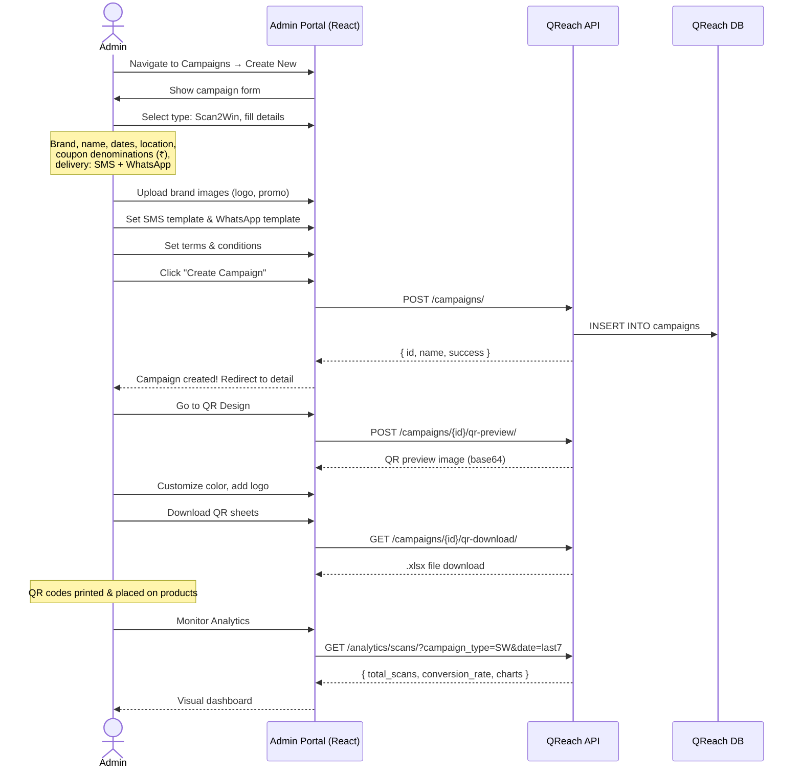
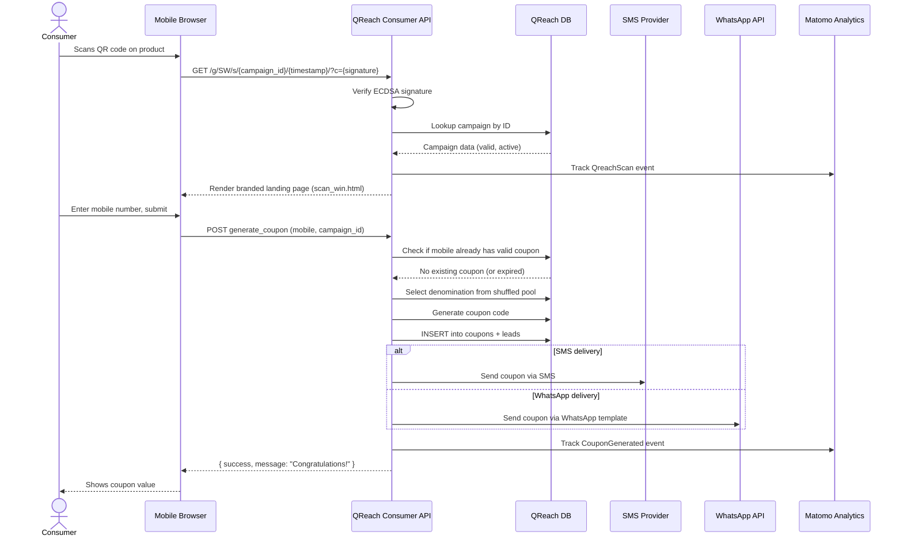
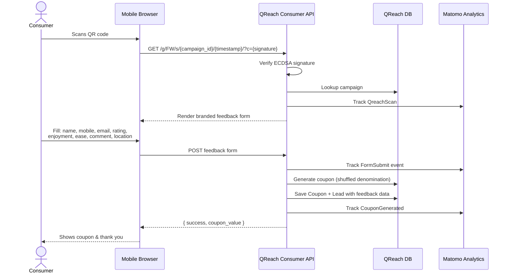
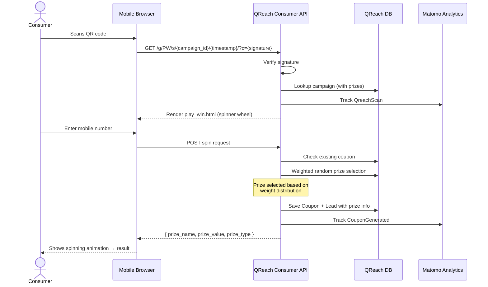
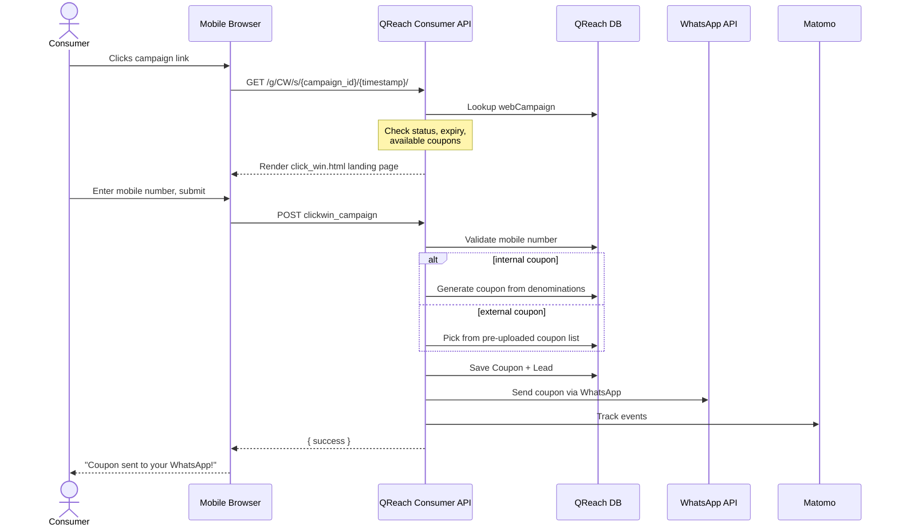
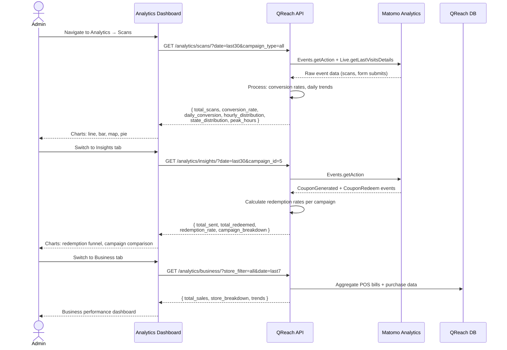

# QReach Microservice Migration — Full Documentation

> **Date:** 2026-07-15
> **Approach:** Separate DB, JWT + API Key Auth, Separate React Repository

---

## Table of Contents

1. [QReach Overview](#1-qreach-overview)
2. [Feature Inventory](#2-feature-inventory)
3. [API Endpoint Blueprint](#3-api-endpoint-blueprint)
4. [Database Schema](#4-database-schema)
5. [User Journeys](#5-user-journeys)
6. [Architecture & Feedback](#6-architecture--feedback)

---

## 1. QReach Overview

QReach is a **QR-based consumer engagement platform** that allows brands to run promotional campaigns where end-consumers scan QR codes on products to win coupons, provide feedback, or play games. It has two major surfaces:

| Surface                    | Users                           | Current Tech                          |
| -------------------------- | ------------------------------- | ------------------------------------- |
| **Admin Portal**           | Brand managers, tenant admins   | Django Templates + Material Design    |
| **Consumer Landing Pages** | End consumers scanning QR codes | Django Templates (branded per tenant) |

### Campaign Types

| Code    | Name          | Description                                                                          |
| ------- | ------------- | ------------------------------------------------------------------------------------ |
| **SW**  | Scan2Win      | Consumer scans QR → directly receives a coupon via SMS/WhatsApp                      |
| **FW**  | Feedback2Win  | Consumer scans QR → fills feedback form → receives coupon                            |
| **PW**  | Play2Win      | Consumer scans QR → plays a spin-the-wheel game → wins prizes (cash/coupon/physical) |
| **CW**  | Click2Win     | Web-based campaign — consumer clicks link → enters mobile → gets coupon via WhatsApp |
| **MLQ** | Multi-link QR | Single QR redirects to multiple destinations (Basic, Subscribe, Campaign variants)   |

---

## 2. Feature Inventory

### 2.1 Admin Portal Features

#### A. Campaign Management (CRUD)

- **Create Campaign** — configure type, name, brand, dates, budget, location, coupon denominations, delivery method (SMS/WhatsApp/both), media assets (logo, promotional image, video, congrats image), terms & conditions
- **Update Campaign** — modify any campaign parameter
- **Delete Campaign** — soft/hard delete
- **Clone Campaign** — duplicate an existing campaign
- **List Campaigns** — paginated, filterable by type, status, location, name, scan count
- **Campaign Detail** — full read-only view of campaign configuration
- **Campaign Status Management** — Active / Pause / End (auto-expire based on `to_date`)
- **QR Design Preview** — customize QR code color, embed logo, preview branded QR
- **QR Download (Firebase)** — download generated QR code sheets (`.xlsx`)

#### B. Play2Win Prize Configuration

- Define up to 6 prize slots with: name, value, type (cash/coupon/none/physical), weight, slot color, max quantity
- Probability auto-calculated from weights

#### C. Coupon Management

- **Denomination Shuffle Logic** — coupons distributed in shuffled batches to ensure fair distribution
- **Coupon Reissue Time** — cooldown before same mobile number can get another coupon
- **Coupon Validity Configuration** — set expiry duration per campaign
- **Budget Cap** — maximum spend limit per campaign

#### D. Lead Management

- **Lead List** — all consumers who scanned/participated, with filters
- **Lead Detail** — consumer info (name, mobile, email, location, coupon value, status)
- **Lead Create** — manually add leads
- **Lead Update** — edit lead details
- **Lead Delete** — remove leads
- **Lead Archive/Unarchive** — soft-delete workflow
- **Tags** — create, assign, unassign, optimize, clear tags on leads
- **Comments/Notes** — add, update, delete notes on leads
- **SMS to Lead** — send individual SMS from admin panel
- **Email Share** — share lead info via email
- **Blocklist Numbers** — blocklist phone numbers
- **External Lead Import** — ingest leads from external sources

#### E. SMS Campaign Tools

- **SMS Template CRUD** — create, list, detail, update templates
- **SMS Credit Management** — add/view SMS credits
- **Bulk SMS Send** — send SMS to filtered leads
- **Scheduled SMS** — send SMS at a scheduled future time
- **SMS Summary Dashboard** — campaign-level SMS analytics
- **SMS Reports** — detailed SMS delivery reports, downloadable

#### F. WhatsApp Campaign Tools

- **WhatsApp Template CRUD** — create with plain text/rich media/interactive types
- **WhatsApp Credit Management** — add/view WhatsApp credits
- **Media Upload** — upload media files for WhatsApp templates
- **Bulk WhatsApp Send** — send WhatsApp messages to leads
- **Scheduled WhatsApp** — schedule WhatsApp sends
- **WhatsApp Summary Dashboard** — campaign-level WhatsApp analytics
- **WhatsApp Reports** — detailed reports, downloadable
- **Template Download** — export WhatsApp template data
- **Test WhatsApp** — send test messages
- **Suspend Campaign** — suspend a running WhatsApp campaign

#### G. RCS Campaign Tools

- **RCS Template CRUD** — create, list, detail, update RCS templates
- **RCS Credit Management** — add/view RCS credits
- **Bulk RCS Send** — send RCS messages
- **RCS Test** — test RCS message delivery
- **RCS Summary & Reports** — analytics and downloadable reports

#### H. Facebook/Meta Campaign Tools

- **Customer Segments** — create, list, detail segments for targeting
- **Meta Credential Settings** — manage Meta API credentials
- **Custom Audience Creation** — create Meta custom audiences
- **Ad Set Creation** — configure Meta ad sets
- **Ad Submission** — submit ads to Meta
- **Ad Preview** — preview ad creatives
- **Country/Market Search** — search targeting options

#### I. Analytics & Dashboards (QReach Analytics)

**Scans Dashboard (`/analytics/`)**

- Total scan count with date range filtering
- Conversion rate (scans → form submissions)
- Daily scans over time chart
- Daily form submissions over time chart
- Hourly scan distribution (peak hours analysis)
- Weekly/day-of-week distribution
- Campaign-wise scan distribution
- Geographic distribution — state level
- Geographic distribution — city level
- ISP distribution
- Device/OS distribution
- Filter by: campaign type, specific campaign, date range

**Insights Dashboard (`/analytics/insight/`)**

- Total coupons sent vs redeemed
- Redemption rate (overall)
- Per-campaign redemption rates
- Daily coupons sent over time
- Daily coupons redeemed over time
- Conversion over time (redeemed/sent by day)
- Campaign-wise breakdown
- Filter by: campaign type, specific campaign, date range

**Business Dashboard (`/analytics/business-dashboard/`)**

- Store/POS level sales metrics
- Purchase data from POS integration
- Filter by store location and date range

**Product Scan Analytics**

- Product-level scan tracking
- Real-time scan monitoring (SSE/polling)

#### J. Developer Portal

- **QReach API** — developer documentation page (currently "coming soon")
- **QSeal API Key Management** — tenant-level API key CRUD for QSeal
- **QReach API Key Management** — (planned, not yet built)

#### K. Product & QR Management

- **Product CRUD** — products with GTIN, serial formats, activation methods
- **Order/Batch Management** — create QR code batches, manage quantities, cert types
- **SKU QR Management** — create/detail/update SKU-level QR codes
- **Serial Number Formats** — configure serial number prefixes and generation patterns
- **Warranty Periods** — configure warranty durations
- **Destination Markets** — country & currency configuration
- **Channel/Distributor Management** — distribution channels
- **QR Activation Parameters** — pre/post activation configuration
- **Store Management** — POS store locations with archive/unarchive

#### L. Other

- **Brand Management** — CRUD for brands (name, short code, public/private keys)
- **Website Lead Forms** — registration, contact us, schedule demo, request call, career, newsletter, DPP campaign
- **Trial Management** — trial-expired page, trial-aware feature gating
- **Tenant Photo Upload** — tenant branding/customization

---

### 2.2 Consumer-Facing Features (QR Scan Flow)

| Feature                    | Description                                                                          |
| -------------------------- | ------------------------------------------------------------------------------------ |
| **Dynamic QR Routing**     | URL pattern `g/<gtin>/s/<srnumber>/<timestamp>/` routes to correct campaign type     |
| **Signature Verification** | ECDSA-based signature validation on QR scan requests                                 |
| **Branded Landing Pages**  | Per-brand, per-campaign-type branded HTML templates                                  |
| **Scan2Win Flow**          | Scan → show branded page → mobile number input → instant coupon via SMS/WhatsApp     |
| **Feedback2Win Flow**      | Scan → show branded page → feedback form (rating, enjoyment, ease, comment) → coupon |
| **Play2Win Flow**          | Scan → show branded page → interactive spin-the-wheel game → prize distribution      |
| **Click2Win Flow**         | Web link → branded landing → mobile input → coupon via WhatsApp                      |
| **Multi-link QR**          | Scan → landing page with multiple branded links (Basic/Subscribe/Campaign variants)  |
| **OTP Verification**       | Mobile number verification via OTP                                                   |
| **Coupon Generation**      | Server-side coupon code generation with denomination shuffle algorithm               |
| **Coupon Delivery**        | SMS (via provider), WhatsApp (via WhatsApp Business API)                             |
| **Coupon Expiry**          | 30-day default expiry from generation                                                |
| **Duplicate Prevention**   | Same mobile number cannot get new coupon while existing is still valid               |
| **Matomo Event Tracking**  | All scans tracked as `QreachScan` events, form submissions as `FormSubmit`           |
| **Geo-location**           | Client IP-based location capture                                                     |
| **Product Scan**           | Non-campaign product QR scan → product info landing page                             |
| **Warranty Registration**  | Product warranty registration via QR scan                                            |
| **Certificate Download**   | Digital certificate generation and download                                          |
| **Multi-language**         | Some templates support language selection                                            |

---

## 3. API Endpoint Blueprint

### 3.1 REST API Structure (Proposed)

Base URL: `https://api.qreach.ciphercode.ai/v1/`

All endpoints prefixed with tenant context: `/{tenant_slug}/`

### 3.2 Authentication

| Endpoint         | Method | Description                  |
| ---------------- | ------ | ---------------------------- |
| `/auth/login/`   | POST   | JWT login (email + password) |
| `/auth/refresh/` | POST   | Refresh JWT token            |
| `/auth/logout/`  | POST   | Invalidate refresh token     |
| `/auth/me/`      | GET    | Current user profile         |

### 3.3 Campaigns

```
GET    /campaigns/                          # List campaigns (paginated, filterable)
POST   /campaigns/                          # Create campaign
GET    /campaigns/{id}/                     # Campaign detail
PUT    /campaigns/{id}/                     # Update campaign
PATCH  /campaigns/{id}/                     # Partial update
DELETE /campaigns/{id}/                     # Delete campaign
POST   /campaigns/{id}/clone/              # Clone campaign
PATCH  /campaigns/{id}/status/             # Change status (activate/pause/end)
POST   /campaigns/{id}/qr-preview/         # Generate QR preview (color, logo)
GET    /campaigns/{id}/qr-download/        # Download QR sheets
```

### 3.4 Play2Win Prizes

```
GET    /campaigns/{id}/prizes/             # List prizes for campaign
POST   /campaigns/{id}/prizes/             # Add prize
PUT    /campaigns/{id}/prizes/{prize_id}/  # Update prize
DELETE /campaigns/{id}/prizes/{prize_id}/  # Delete prize
```

### 3.5 Leads

```
GET    /leads/                              # List leads (paginated, filterable)
POST   /leads/                              # Create lead manually
GET    /leads/{id}/                         # Lead detail
PUT    /leads/{id}/                         # Update lead
DELETE /leads/{id}/                         # Delete lead
POST   /leads/bulk-delete/                  # Bulk delete
POST   /leads/{id}/archive/                 # Archive lead
POST   /leads/{id}/unarchive/               # Unarchive lead
POST   /leads/{id}/notes/                   # Add note
PUT    /leads/{id}/notes/{note_id}/         # Update note
DELETE /leads/{id}/notes/{note_id}/         # Delete note
POST   /leads/{id}/send-sms/               # Send SMS to lead
POST   /leads/{id}/send-email/             # Email share
POST   /leads/import/                       # Import leads from file
GET    /leads/export/                       # Export leads to XLS/CSV
```

### 3.6 Tags

```
GET    /tags/                               # List tags
POST   /tags/                               # Create tag
PUT    /tags/{id}/                          # Update tag
DELETE /tags/{id}/                          # Delete tag
POST   /tags/assign/                        # Assign tag(s) to leads
POST   /tags/unassign/                      # Unassign tag(s) from leads
POST   /tags/optimize/                      # Optimize/merge tags
POST   /tags/{id}/clear/                    # Clear tag from all leads
```

### 3.7 SMS

```
GET    /sms/templates/                      # List SMS templates
POST   /sms/templates/                      # Create SMS template
GET    /sms/templates/{id}/                 # Template detail
PUT    /sms/templates/{id}/                 # Update template
DELETE /sms/templates/{id}/                 # Delete template
GET    /sms/credits/                        # View SMS credits
POST   /sms/credits/                        # Add SMS credits
POST   /sms/send/                           # Send bulk SMS
POST   /sms/schedule/                       # Schedule SMS
GET    /sms/summary/                        # SMS campaign summary
GET    /sms/reports/                        # SMS delivery reports
GET    /sms/reports/{id}/                   # Report detail
GET    /sms/reports/download/               # Download reports
```

### 3.8 WhatsApp

```
GET    /whatsapp/templates/                 # List WhatsApp templates
POST   /whatsapp/templates/                 # Create template
GET    /whatsapp/templates/{id}/            # Template detail
PUT    /whatsapp/templates/{id}/            # Update template
DELETE /whatsapp/templates/{id}/            # Delete template
POST   /whatsapp/media/upload/              # Upload media file
GET    /whatsapp/credits/                   # View WhatsApp credits
POST   /whatsapp/credits/                   # Add credits
POST   /whatsapp/send/                      # Send bulk WhatsApp
POST   /whatsapp/schedule/                  # Schedule WhatsApp
GET    /whatsapp/summary/                   # Summary dashboard
GET    /whatsapp/reports/                   # Reports
POST   /whatsapp/test/                      # Send test message
POST   /whatsapp/templates/download/        # Download template data
```

### 3.9 RCS

### 3.10 Analytics

```
GET    /analytics/scans/                    # Scan analytics (with filters)
GET    /analytics/insights/                 # Insight analytics (coupons sent/redeemed)
GET    /analytics/business/                 # Business/POS dashboard data
GET    /analytics/product-scans/            # Product-level scan analytics
GET    /analytics/real-time/                # Real-time scan feed (WebSocket/SSE)
GET    /analytics/campaigns-by-type/        # Get campaigns filtered by type
GET    /analytics/geo/                      # Geographic distribution
GET    /analytics/time-trends/              # Hourly/weekly trends
```

### 3.11 Brands & Products

### 3.12 Settings

```
GET    /settings/serial-formats/            # Serial number formats
GET    /settings/warranty-periods/           # Warranty duration options
GET    /settings/destination-markets/        # Country/currency config
GET    /settings/channels/                   # Distribution channels
GET    /settings/coupon-validity/            # Coupon validity periods
GET    /settings/meta-credentials/           # Meta/Facebook credentials
GET    /settings/rcs-credentials/            # RCS credentials
GET    /settings/schedule-reports/           # Scheduled report config
```

### 3.13 Consumer API (Public)

```
POST   /consumer/scan/                      # Record a QR scan event
POST   /consumer/verify-otp/                # Verify OTP
POST   /consumer/generate-coupon/           # Generate coupon for consumer
GET    /consumer/campaign/{id}/             # Get campaign landing page data
GET    /consumer/coupon/{code}/             # Verify coupon
POST   /consumer/coupon/redeem/             # Redeem a coupon
POST   /consumer/feedback/                  # Submit feedback (FW campaigns)
POST   /consumer/play2win/spin/             # Spin the wheel (PW campaigns)
```

### 3.14 API Keys (Developer Portal)

```
GET    /developer/api-keys/                 # List API keys
POST   /developer/api-keys/                 # Generate new API key
DELETE /developer/api-keys/{id}/            # Revoke API key
```

---

## 4. Database Schema

### 4.1 Core Entities

```
┌──────────────────────────────────────────────────────────────────┐
│                        DATABASE SCHEMA                           │
│                     (QReach Microservice)                        │
└──────────────────────────────────────────────────────────────────┘

┌──────────────┐       ┌──────────────────┐       ┌──────────────────┐
│    Tenant    │       │      Brand       │       │    Industry      │
│──────────────│       │──────────────────│       │──────────────────│
│ id (PK)      │──┐    │ id (PK)          │       │ id (PK)          │
│ schema_name  │  │    │ name             │       │ name             │
│ name         │  │    │ short_code       │       │ slug             │
│ on_trial     │  │    │ public_key       │       └──────────────────┘
│ created_at   │  │    │ private_key      │
└──────────────┘  │    │ tenant_id (FK)   │
                  │    └──────┬───────────┘
                  │           │
                  │           ├──────────────────────────────────────┐
                  │           │                                      │
                  │    ┌──────┴───────────┐              ┌───────────┴──────┐
                  │    │    Campaign      │              │   webCampaign    │
                  │    │──────────────────│              │──────────────────│
                  │    │ id (PK)          │              │ id (PK)          │
                  │    │ brand_id (FK)    │              │ brand_id (FK)    │
                  │    │ campaign_type    │              │ campaign_type    │
                  │    │   SW|FW|PW|MLQ   │              │   (CW only)      │
                  │    │ multilink_type   │              │ name             │
                  │    │   MLB|MLS|MLC    │              │ location         │
                  │    │ name             │              │ denominations    │
                  │    │ brand_image      │              │ coupon_deliver   │
                  │    │ promotional_img  │              │ coupon_source    │
                  │    │ promotional_vid  │              │   internal|ext   │
                  │    │ congrats_image   │              │ coupon_file      │
                  │    │ campaign_message │              │ external_coupon  │
                  │    │ location         │              │ (JSON)           │
                  │    │ coupon_deliver   │              │ whatsapp_*       │
                  │    │   Nothing|sms|ws │              │ from_date        │
                  │    │ denominations_val│              │ to_date          │
                  │    │ denominations    │              │ terms_conditions │
                  │    │ denominations_lst│              │ shuffle          │
                  │    │ (JSON)           │              │ scans            │
                  │    │ used_message     │              │ campaign_status  │
                  │    │ sms_senderid     │              │ firebase_url     │
                  │    │ sms_template     │              │ created_at       │
                  │    │ sms_variable     │              └──────┬───────────┘
                  │    │ (JSON)           │                     │
                  │    │ whatsapp_*       │                     │
                  │    │ media_link       │                     │
                  │    │ multi_link_*     │                     │
                  │    │ game_field[1-6]  │                     │
                  │    │ game_value[1-6]  │                     │
                  │    │ game_unit[1-6]   │                     │
                  │    │ coupon_reissue   │                     │
                  │    │ from_date        │                     │
                  │    │ to_date          │                     │
                  │    │ terms_conditions │                     │
                  │    │ shuffle          │                     │
                  │    │ scans            │                     │
                  │    │ bypass_url       │                     │
                  │    │ client_url       │                     │
                  │    │ redirect_url_type│                     │
                  │    │ budget_cap       │                     │
                  │    │ campaign_status  │                     │
                  │    │   A|P|E          │                     │
                  │    │ firebase_url     │                     │
                  │    │ created_at       │                     │
                  │    │ updated_at       │                     │
                  │    └──────┬───────────┘                     │
                  │           │                                 │
                  │           ├──────────────────────┐          │
                  │           │                      │          │
                  │    ┌──────┴───────────┐  ┌──────┴──────────┴───┐
                  │    │ Play2WinPrize    │  │      Coupon          │
                  │    │──────────────────│  │──────────────────────│
                  │    │ id (PK)          │  │ id (PK)              │
                  │    │ campaign_id (FK) │  │ campaign_id (FK)     │
                  │    │ name             │  │ webcampaign_id (FK)  │
                  │    │ prize_type       │  │ coupon (unique code) │
                  │    │   cash|coupon    │  │ name                 │
                  │    │   |none|physical │  │ mobilenumber         │
                  │    │ value            │  │ email                │
                  │    │ weight           │  │ state_name           │
                  │    │ max_quantity     │  │ dob                  │
                  │    │ is_active        │  │ gender               │
                  │    │ slot_color       │  │ occupation           │
                  │    │ created_at       │  │ units                │
                  │    └──────────────────┘  │ value                │
                  │                          │ used (bool)          │
                  │                          │ min_bill_value       │
┌─────────────────┐                          │ custom_question(JSON)│
│     Lead        │                          │ custom_answer (JSON) │
│─────────────────│                          │ acception_id         │
│ id (PK)         │                          │ expiry               │
│ campaign_id(FK) │                          │ timestamp            │
│ tag (M2M→Tags)  │                          │ used_timestamp       │
│ coupon          │                          │ location             │
│ name            │                          │ enjoy|easy|fav_prod  │
│ mobilenumber    │                          │ rating|product_rating│
│ email           │                          │ color_rating         │
│ address         │                          │ price_rating         │
│ location        │                          │ comment              │
│ pincode         │                          │ is_unlocked          │
│ dob             │                          │ unlock_count         │
│ occupation      │                          │ final_billed_amount  │
│ gstnumber       │                          │ redeem_mode          │
│ gender          │                          │   none|online|offline│
│ state_name      │                          │   |Brandwise         │
│ country         │                          │                      │
│ marital_status  │                          │                      │
│ expiry          │                          └──────────────────────┘
│ timestamp       │
│ used_timestamp  │                    ┌──────────────────────┐
│ enjoy|easy      │                    │  CouponUnlockLog     │
│ value           │                    │──────────────────────│
│ used            │                    │ id (PK)              │
│ rating|comment  │                    │ coupon_id (FK)       │
│ lead_owner (FK) │                    │ action               │
│ status          │                    │  REDEEM_ATTEMPT      │
│ external_lead   │                    │  REDEEM_SUCCESS      │
│ redeem_mode     │                    │  UNLOCK_REQUEST      │
│ created_at      │                    │  UNLOCK_SUCCESS      │
│ updated_at      │                    │ timestamp            │
└─────────────────┘                    │ notes                │
                                       │ location             │
┌─────────────────┐                    │ user_reference       │
│      Tags       │                    └──────────────────────┘
│─────────────────│
│ id (PK)         │
│ name            │
│ color           │
│ tenant_id (FK)  │
│ created_at      │
└─────────────────┘
```

### 4.2 Supporting Entities

```
┌──────────────────┐    ┌──────────────────┐    ┌──────────────────┐
│ Message_template │    │  SmsCredit       │    │  WhatsappCredit  │
│──────────────────│    │──────────────────│    │──────────────────│
│ id (PK)          │    │ id (PK)          │    │ id (PK)          │
│ template_name    │    │ tenant_id (FK)   │    │ tenant_id (FK)   │
│ messsage_type    │    │ credits          │    │ credits          │
│  WS|SMS|EMAIL    │    │ created_at       │    │ created_at       │
│ ws_template_type │    └──────────────────┘    └──────────────────┘
│  PT|RM|IN        │
│ ws_media_type    │    ┌──────────────────┐    ┌──────────────────┐
│ ws_interactive   │    │  RcsCredit       │    │  ProductCredit   │
│  CTA|QR          │    │──────────────────│    │──────────────────│
│ message_body     │    │ id (PK)          │    │ id (PK)          │
│ status           │    │ tenant_id (FK)   │    │ tenant_id (FK)   │
│  Approved|Pending│    │ credits          │    │ credits          │
│ created_at       │    │ created_at       │    │ created_at       │
└──────────────────┘    └──────────────────┘    └──────────────────┘

┌──────────────────┐    ┌──────────────────┐    ┌──────────────────┐
│     Store        │    │   Warranty        │    │    Channel       │
│──────────────────│    │───────────────────│    │──────────────────│
│ id (PK)          │    │ id (PK)           │    │ id (PK)          │
│ tenant_id (FK)   │    │ name              │    │ name             │
│ name             │    │ mobilenumber      │    │ description      │
│ location         │    │ email             │    │ is_active        │
│ status           │    │ serial_number     │    │ is_default       │
│  Active|Inactive │    │ location          │    │ email            │
│ created_at       │    │ ip                │    │ distributor_id   │
└──────────────────┘    │ warranty_valid_till│   │ created_at       │
                        │ created_on         │    └──────────────────┘
┌──────────────────┐    └───────────────────┘
│  DestinationMarket│
│──────────────────│    ┌──────────────────┐    ┌──────────────────┐
│ id (PK)          │    │ SerialNumFormat  │    │ WarrantyPeriod   │
│ name             │    │──────────────────│    │──────────────────│
│ currency         │    │ id (PK)          │    │ id (PK)          │
│ is_active        │    │ serial_prefix    │    │ number_of_years  │
│ created_at       │    │ is_active        │    │ is_active        │
└──────────────────┘    │ is_default       │    │ is_default       │
                        │ created_at       │    │ created_at       │
┌──────────────────┐    └──────────────────┘    └──────────────────┘
│  ScheduleReport  │
│──────────────────│    ┌──────────────────────┐
│ id (PK)          │    │    APIKey            │
│ tenant_id (FK)   │    │──────────────────────│
│ brand_id (FK)    │    │ id (PK)              │
│ email            │    │ prefix               │
│ schedule_type    │    │ name                 │
│  Daily|Weekly    │    │ hashed_key           │
│  |Monthly        │    │ tenant_id (FK)       │
│ campaign_type    │    │ created_at           │
│  SW|FW|CW        │    │ revoked             │
│ is_active        │    │ expiry_date          │
└──────────────────┘    └──────────────────────┘

┌───────────────────────────┐
│   LandingCustom           │
│───────────────────────────│
│ id (PK)                   │
│ campaign_id (FK)          │
│ form_config (JSON)        │
│  → custom questions/fields│
│ created_at                │
└───────────────────────────┘
```

### 4.3 Key Relationships

```
Tenant (1) ──────< (N) Brand
Brand   (1) ──────< (N) Campaign
Brand   (1) ──────< (N) webCampaign
Campaign (1) ─────< (N) Play2WinPrize
Campaign (1) ─────< (N) Coupon
Campaign (1) ─────< (N) Lead
webCampaign (1) ──< (N) Coupon
Lead    (N) ──────> (N) Tags
Coupon  (1) ──────< (N) CouponUnlockLog
Campaign (1) ─────< (N) LeadAction (notes)
Tenant  (1) ──────< (N) SmsCredit / WhatsappCredit / RcsCredit / ProductCredit
Tenant  (1) ──────< (N) Store
Tenant  (1) ──────< (N) APIKey
```

---

## 5. User Journeys

### 5.1 Admin User — Create & Run a Scan2Win Campaign



### 5.2 Consumer — Scan2Win Flow



### 5.3 Consumer — Feedback2Win Flow



### 5.4 Consumer — Play2Win Flow



### 5.5 Consumer — Click2Win Flow



### 5.6 Admin — Analytics & Reporting Journey



---

## 6. Architecture & Feedback

### 6.1 Recommended Microservice Architecture

```
┌─────────────────────────────────────────────────────────┐
│                    API Gateway (Kong/Nginx)               │
│              Rate Limiting, Auth, Tenant Routing          │
└────┬──────────────┬──────────────┬──────────────────────┘
     │              │              │
     ▼              ▼              ▼
┌──────────┐  ┌──────────┐  ┌──────────────┐
│ QReach   │  │ Consumer │  │  Analytics   │
│ Admin    │  │ API      │  │  Service     │
│ Service  │  │ Service  │  │              │
│──────────│  │──────────│  │──────────────│
│ Campaigns│  │ QR Scan  │  │ Matomo       │
│ Leads    │  │ Coupons  │  │ Integration  │
│ SMS/WA   │  │ OTP      │  │ Aggregation  │
│ Products │  │ Feedback │  │              │
└────┬─────┘  └────┬─────┘  └──────┬───────┘
     │              │               │
     ▼              ▼               ▼
┌─────────────────────────────────────────────────────────┐
│                   PostgreSQL (QReach DB)                  │
│         Separate from monolith — fresh start             │
└─────────────────────────────────────────────────────────┘
     │
     ▼
┌─────────────────────────────────────────────────────────┐
│              Redis (Cache + Task Queue)                   │
│     Session cache, real-time scan counters, Celery       │
└─────────────────────────────────────────────────────────┘
     │
     ▼
┌─────────────────────────────────────────────────────────┐
│              Celery Workers (Async Tasks)                 │
│    SMS delivery, WhatsApp API calls, Matomo events,      │
│    Report generation, CSV/XLS exports                    │
└─────────────────────────────────────────────────────────┘

┌─────────────────────┐
│   React Frontend    │  (Separate Repository)
│    (Vite + TS)      │
│─────────────────────│
│ - Admin Dashboard   │
│ - Campaign Manager  │
│ - Lead Manager      │
│ - Analytics Viewer  │
│ - Settings          │
└─────────────────────┘
```

### 6.2 Tech Stack Recommendation

| Layer                 | Recommended                                            | Notes                                            |
| --------------------- | ------------------------------------------------------ | ------------------------------------------------ |
| **Backend Framework** | Django + DRF                                           | You already know it; excellent for rapid API dev |
| **Alternative**       | FastAPI                                                | Better async perf for consumer scan API          |
| **Auth**              | `djangorestframework-simplejwt` + custom API key model | JWT for portal, API keys for integrations        |
| **DB**                | PostgreSQL (fresh instance)                            | Your existing stack                              |
| **Cache**             | Redis                                                  | For real-time scan counters, rate limiting       |
| **Task Queue**        | Celery + Redis                                         | Async SMS/WhatsApp/email delivery                |
| **Frontend**          | React + Vite + TypeScript                              | Modern, fast dev experience                      |
| **UI Library**        | Ant Design or Mantine                                  | Feature-rich, matches admin portal needs         |
| **Charts**            | Recharts or Nivo                                       | React-native charting                            |
| **Maps**              | Leaflet + react-leaflet                                | Geographic analytics                             |
| **API Docs**          | drf-spectacular (OpenAPI 3)                            | Auto-generated Swagger                           |

### 6.3 Key Feedback & Considerations

1. **Matomo Dependency**: QReach Analytics is heavily dependent on Matomo for event data. You'll need to either:

   - Keep using Matomo and pull data via its API
   - Or migrate to tracking events directly in your own DB (recommended for independence)

2. **Firebase Storage**: QR sheets are currently stored in Firebase Cloud Storage. Migrate to **AWS S3** or keep using GCS directly via the `google-cloud-storage` SDK.

3. **Coupon Generation Logic**: The denomination shuffle algorithm is complex — document it well. It ensures fair distribution by re-shuffling only after all denominations have been used once.

4. **Consumer-facing pages**: These are currently Django templates. Since you're building a React admin portal, you'll need to decide:

   - Consumer pages stay as server-rendered (Django templates) for fast load on mobile
   - Or build a lightweight React consumer app (separate from admin)

5. **Tenant Isolation**: Currently uses `django-tenants`. In the microservice, implement tenant-level data isolation via `tenant_id` FK on all tables.

6. **Migration Strategy**:

   - Phase 1: Build API + DB schema (greenfield)
   - Phase 2: Build React Admin Portal against new API
   - Phase 3: Migrate consumer endpoints
   - Phase 4: Cut over traffic, deprecate monolith endpoints
   - Keep existing monolith running during all phases

7. **SMS/WhatsApp providers**: Abstract these behind a **Notification Service** interface so you can swap providers without changing business logic.

---

> **Next Steps:** I can help you scaffold the Django REST API project, design the React component tree, or write the database migration scripts. Which would you like to start with?
