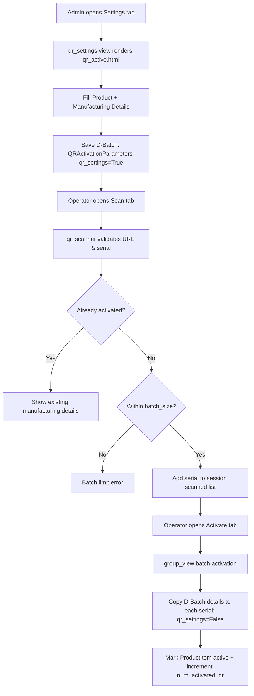
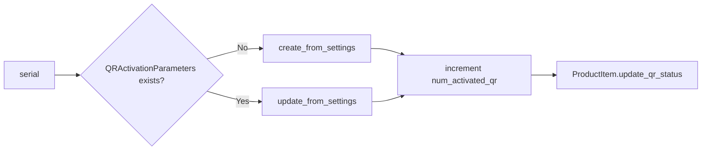

# QR Activation & Manufacturing Details Attachment — Technical Documentation

This document explains how QR activation works in the Admin Portal and, specifically, how **Manufacturing Details** are attached to individual QR blocks. It is based on the current code in `app/integration/`.

---

## 1. High-Level Overview

The QR activation system has a two-stage design:

1. **D-Batch configuration (Settings)** — an admin defines the shared *manufacturing details* for a **dispatch batch** (a "D-Batch"). This produces a `QRActivationParameters` record with `qr_settings=True`.
2. **Unit activation** — individual QR codes (serial numbers, backed by `ProductItem`) are scanned and then activated. During activation, the D-Batch's manufacturing details are **copied onto each serial number** as `QRActivationParameters` records with `qr_settings=False`.

In short: **manufacturing details are first stored at the batch level, then cloned down to each QR block at activation time.**

---

## 2. Key Actors / Roles

Role base access, create permission for this module

The `group` flag is computed as `request.user.groups.filter(name='admin').exists()`.

---

## 3. Core Data Model

### 3.1 `QRActivationParameters` (`app/integration/models.py`)

This is the central table. It holds **both** D-Batch settings *and* per-unit activation records, distinguished by `qr_settings`.

| Field | Type | Purpose |
|-------|------|---------|
| `product` | FK → `Product` | The product being activated |
| `order` | FK → `Order` | Linked order (unit activation only) |
| `manufacturing_date` | `DateField` | **Manufacturing detail** |
| `dispatch_batch` | `CharField` | **Dispatch batch (D-Batch) name** |
| `manufacturing_unit` | `CharField` | **Manufacturing detail** — production facility |
| `expiry_date` | `DateField` | **Manufacturing detail** — auto-computed shelf life |
| `mrp` | `DecimalField` | **Manufacturing detail** — max retail price |
| `serial_number` | `CharField` | Which QR block this record belongs to (unit activation only) |
| `destination_market` | `CharField` | **Manufacturing detail** — target market |
| `currency` | `CharField` | Currency (auto-derived from destination market) |
| `batch_size` | `IntegerField` | Max units allowed in this D-Batch |
| `qr_settings` | `BooleanField` | `True` = D-Batch config, `False` = per-unit activation |
| `history` | `BooleanField` | Marks superseded D-Batch configs |
| `created_on` | `DateTimeField` | Used to scope active batch items |

**Two important classmethods** define how details are attached to units:

- `QRActivationParameters.create_from_settings(serial, product_item, qr_settings, destination_market)` — creates a **new** per-unit record by copying `manufacturing_date`, `expiry_date`, `manufacturing_unit`, `destination_market`, `currency`, `dispatch_batch`, `mrp` from the D-Batch settings.
- `QRActivationParameters.update_from_settings(qr_instance, qr_settings, destination_market)` — updates an **existing** per-unit record with the same fields (but not `mrp`).

### 3.2 `ProductItem` (`app/integration/models.py`)

Represents an individual QR block / serial number.

| Field | Purpose |
|-------|---------|
| `serial_number` | The unique serial on the QR label |
| `product` | FK → `Product` |
| `order` | FK → `Order` |
| `qr_deactive` | `True` = inactive (batch level) |
| `qr_deactive_unit` | `True` = inactive (unit level) |

`ProductItem.update_qr_status()` sets both `qr_deactive=False` and `qr_deactive_unit=False` (marks the block as activated).

### 3.3 Supporting Models

| Model | Purpose |
|-------|---------|
| `Product` | Has `activation_method` (`pre`/`post`), `num_activated_qr`, `serialnumformat`, `warrantyperiod` |
| `Order` | Generated batch of QR codes; has `batch`, `quantity` |
| `DestinationMarket` | Target market; has `name` and `currency` |
| `SerialNumFormat` | `serial_prefix` used as the QR serial prefix |
| `WarrantyPeriod` | `number_of_years` (actually months) used to compute expiry |

---

## 4. URL Endpoints

All defined in `app/integration/urls.py`.

| Name | Path | View | Purpose |
|------|------|------|---------|
| `brandwise_scanner` | `scanner/` | `qr_scanner` | Scan page + AJAX scan endpoint |
| `qr_session` | `scanner/session/` | `session_qr` | Batch activation page (list of scanned codes) |
| `qr_settings` | `scanner/qr_settings/` | `qr_settings` | Create/edit D-Batch manufacturing settings |
| `activation_batch` | `scanner/qr_settings/<int:id>` | `activation_batch_view` | Clone/edit an existing D-Batch |
| `qr_active` | `qr_activation/<int:id>/` | `qr_activation` | Single-unit activation form + AJAX submit |
| `qr_group` | `group/` | `group_view` | Batch (multi-unit) activation AJAX |
| `get_currency` | `currency/` | `get_currency` | Returns currency for a destination market |
| `get_expiry` | `expiry/` | `product_expiry` | Returns prefix / expiry / existing config |
| `qr_deactive` | `qr_deactivation/` | `qr_deactivation` | Deactivate a batch or single unit |
| `batch_mrp` | `mrp/<int:id>` | `dispatch_batch` | Batch MRP detail page |
| `change_mrp` | `changemrp/` | `change_mrp` | Update MRP for a batch |
| `end_session` | `end/` | `end_session` | Clear the scan session |
| `dispatchd` | `dispatch/` | `QRActivationParameterViewSet` | Dispatch batch list/detail CRUD |

---

## 5. Overall Flow Diagram



---

## 6. Step 1 — D-Batch Configuration (Settings)

View: `qr_settings` in `app/integration/brandwise_scan_views.py`
Template: `app/integration/templates/integration/qrscanner/qr_active.html` (Settings branch, `qr_settings=True`)

### 6.1 GET

- Computes `group = user in admin group`.
- Renders the settings form (`ActivationParametersForm`) with placeholder initial data.
- The form has sections: Product Information, Manufacturing Details, Market & Pricing, Validity Period.

### 6.2 POST (AJAX)

Reads these fields from the request:

| Request field | Purpose |
|---------------|---------|
| `product` | Product id |
| `dispatch_batch` | D-Batch name |
| `batch_size` | Max units in the batch |
| `manufacturing_date` | Manufacturing date |
| `manufacturing_unit` | Facility |
| `destination_market` | Market id → name |
| `currency1` / `currency2` | Currency (hidden fields) |
| `expiry_date1` / `expiry_date2` | Expiry (hidden fields, may need parsing from display format) |
| `mrp` | Price |
| `append_to_existing` | Whether to append to an existing batch |

Business rules enforced:

1. **Duplicate batch check** — if `dispatch_batch` + `product` already exists and `append_to_existing` is false, returns `{batch_exists: True}` and the frontend prompts "Do you want to save D-Batch changes?".
2. **Batch size limit** — `batch_size` must not exceed the number of inactive `ProductItem`s for that product (`qr_deactive_unit=True OR qr_deactive=True`).
3. **Append** — when appending, the old config is marked `history=True` and a new config row is created.
4. **First config** — if no `qr_settings=True` record exists for the product, a new one is created.
5. **Re-configuration** — otherwise the current config is marked `history=True` and a new `qr_settings=True` record is created.

The `history` flag keeps old configs for auditing while `order_by('-id').first()` / `.order_by('-created_on').first()` always picks the latest active one.

---

## 7. Step 2 — Scanning QR Codes

View: `qr_scanner`
Template: `app/integration/templates/integration/qrscanner/brandwise_scanner.html`

The scanner posts the scanned short URL to `qr_scanner` via AJAX.

Validation chain:

1. URL must be valid (`validators.url`).
2. Follow redirects and resolve to the tenant's long URL; extract `sr_number` from the path.
3. Session de-duplication — if the serial is already in `scanned_qr_codes`, reject.
4. `ProductItem` must exist for the serial.
5. The scanned product must match the **previously scanned product** in this session.
6. `num_activated_qr` must not exceed total generated QR quantity for the product.
7. A latest active D-Batch (`qr_settings=True`, `history=False`) must exist; otherwise reject with "configure settings first".
8. Count currently-active units in the batch (`d_size`). If `d_size >= batch_size`, reject with "D-Batch limit exceeded".
9. If the serial already has a `QRActivationParameters` record and the `ProductItem` is still active → return `{active: True, ...details}` so the UI can show "already activated".

On success, the serial is appended to the session's `scanned_qr_codes` list.

---

## 8. Step 3 — Batch Activation

View: `group_view`
Template: `app/integration/templates/integration/qrscanner/scan_qr.html`

The "Activate" tab lists all scanned serial numbers. Submitting posts `selected_serial_numbers[]` to `group_view`.

For each selected serial:



After processing all serials, the session scan list is cleared.

---

## 9. Step 4 — Single-Unit Activation (alternate flow)

View: `qr_activation` (URL name `qr_active`)
Template: `qr_active.html` (Activation branch, `qr_settings=False`)

Used when activating one specific unit (via `qr_activation/<id>`).

- **GET**: finds the active D-Batch and pre-fills `ActivationParametersForm`. If no D-Batch exists, shows an empty form. `isfirstactivation` is `True` when `num_activated_qr` is `None` (forces a confirmation checkbox).
- **POST (AJAX)**: if a `QRActivationParameters` record already exists for the serial, it **updates** `manufacturing_date`, `manufacturing_unit`, `expiry_date`, `mrp`, `destination_market`, `currency`, `dispatch_batch`. Otherwise it creates a new record. Then it marks the `ProductItem` active and increments `num_activated_qr`.

---

## 10. Manufacturing Details Attachment — Detailed Process

This is the core mechanism: **how Manufacturing Details get attached to a QR block.**

### 10.1 What counts as "Manufacturing Details"

The manufacturing details that travel from batch → unit are:

- `manufacturing_date`
- `manufacturing_unit`
- `expiry_date`
- `mrp`
- `destination_market`
- `currency`
- `dispatch_batch`

### 10.2 Where they are defined

Manufacturing details are defined once at the **D-Batch level** via the Settings form (`qr_settings` view). They are stored in `QRActivationParameters` with `qr_settings=True`.

### 10.3 How they are computed/derived

| Field | Source / Derivation |
|-------|---------------------|
| `manufacturing_date` | Manual entry in Settings form |
| `expiry_date` | `manufacturing_date + WarrantyPeriod.number_of_years` **months** (via `dateutil.relativedelta`) — computed in `product_expiry` and confirmed in Settings |
| `currency` | Auto-fetched from `DestinationMarket.currency` via `get_currency` AJAX endpoint |
| `manufacturing_unit` | Manual entry |
| `mrp` | Manual entry |
| `destination_market` | Selected from `DestinationMarket` dropdown |
| `dispatch_batch` | Manual entry (batch identifier) |
| `batch_size` | Manual entry (capacity of the D-Batch) |

The `get_expiry` (`product_expiry`) endpoint is used by the frontend `qr_active.html` to:
- Fetch the serial **prefix** from `Product.serialnumformat`.
- Compute **expiry** from manufacturing date + warranty period.
- Detect whether settings already exist (`activate: True`) to offer a "clone" dialog.

### 10.4 How they are attached to each QR block

Attachment happens at **activation time**, in one of three code paths:

1. **Batch activation** — `group_view`:
   - `create_from_settings(...)` for new serials.
   - `update_from_settings(...)` for existing serials.
2. **Single-unit activation** — `qr_activation`:
   - Direct `.update(...)` or `form.save(commit=False)` with `serial_number` set.

In all cases the per-unit `QRActivationParameters` record:
- sets `qr_settings=False`,
- sets `serial_number` to the QR block's serial,
- copies the batch-level manufacturing details.

Then `ProductItem.update_qr_status()` flips the block to active (`qr_deactive=False`, `qr_deactive_unit=False`) and `Product.num_activated_qr` is incremented.

### 10.5 Sequence Diagram

```mermaid
sequenceDiagram
    participant Admin
    participant Settings as qr_settings view
    participant DB
    participant Operator
    participant Scan as qr_scanner view
    participant Activate as group_view

    Admin->>Settings: POST manufacturing details + batch_size
    Settings->>DB: Save QRActivationParameters (qr_settings=True)

    Operator->>Scan: Scan QR (short URL)
    Scan->>DB: Validate serial + batch capacity
    Scan->>Scan: Add serial to session

    Operator->>Activate: Activate selected serials
    Activate->>DB: create/update QRActivationParameters (qr_settings=False) per serial
    Activate->>DB: ProductItem.update_qr_status() + num_activated_qr++
```

---

## 11. Deactivation

View: `qr_deactivation`

- **Batch deactivation**: posts `value` (batch id) → all `ProductItem`s in that order are marked `qr_deactive=True` and `num_activated_qr` is decremented by the batch count.
- **Unit deactivation**: posts `srnumber` → that single `ProductItem` is marked `qr_deactive_unit=True` and `num_activated_qr` decremented by 1.

---

## 12. Form Classes

In `app/integration/forms.py`:

- `ActivationParametersForm` — used for both settings and single activation.
  - `Meta.fields = ['product', 'dispatch_batch', 'batch_size', 'manufacturing_date', 'manufacturing_unit', 'expiry_date', 'currency', 'mrp', 'destination_market']`
  - Layout: `product / dispatch_batch / batch_size`, `manufacturing_date / expiry_date / manufacturing_unit`, `destination_market / currency / mrp`.
  - For non-admins, `destination_market` is a plain `CharField`; for admins it is a `ModelChoiceField` filtered to active markets.
- `ActivationParameterUpdateForm` — used by `activation_batch_view` (clone/edit), prefills destination market id.

---

## 13. Key Business Rules Summary

| Rule | Enforced In |
|------|-------------|
| Must configure D-Batch settings before scanning | `qr_scanner` |
| Duplicate batch name requires append confirmation | `qr_settings` |
| `batch_size` cannot exceed available inactive blocks | `qr_settings` |
| Batch limit (`d_size >= batch_size`) blocks further activations | `qr_scanner` |
| Already-activated serial returns its stored manufacturing details | `qr_scanner` |
| Scanned products in one session must be the same product | `qr_scanner` |
| Activated count cannot exceed total generated QR quantity | `qr_scanner` |
| Old D-Batch configs are retained with `history=True` | `qr_settings` |

---

## 14. File Reference

| File | Role |
|------|------|
| `app/integration/brandwise_scan_views.py` | All QR activation/scanner views |
| `app/integration/models.py` | `QRActivationParameters`, `ProductItem`, `Product`, `Order` |
| `app/integration/forms.py` | `ActivationParametersForm`, `ActivationParameterUpdateForm` |
| `app/integration/urls.py` | URL routing |
| `app/integration/filters.py` | `QRActivationFilter` for dispatch batch list |
| `app/integration/templates/integration/qrscanner/brandwise_scanner.html` | Scan page |
| `app/integration/templates/integration/qrscanner/scan_qr.html` | Batch activation page |
| `app/integration/templates/integration/qrscanner/qr_active.html` | Settings + single activation forms |
| `app/integration/templates/integration/qrscanner/dispatch_batch_list.html` | Dispatch batch list |
| `app/integration/templates/integration/qrscanner/dispatch_batch_detail.html` | Dispatch batch detail |
