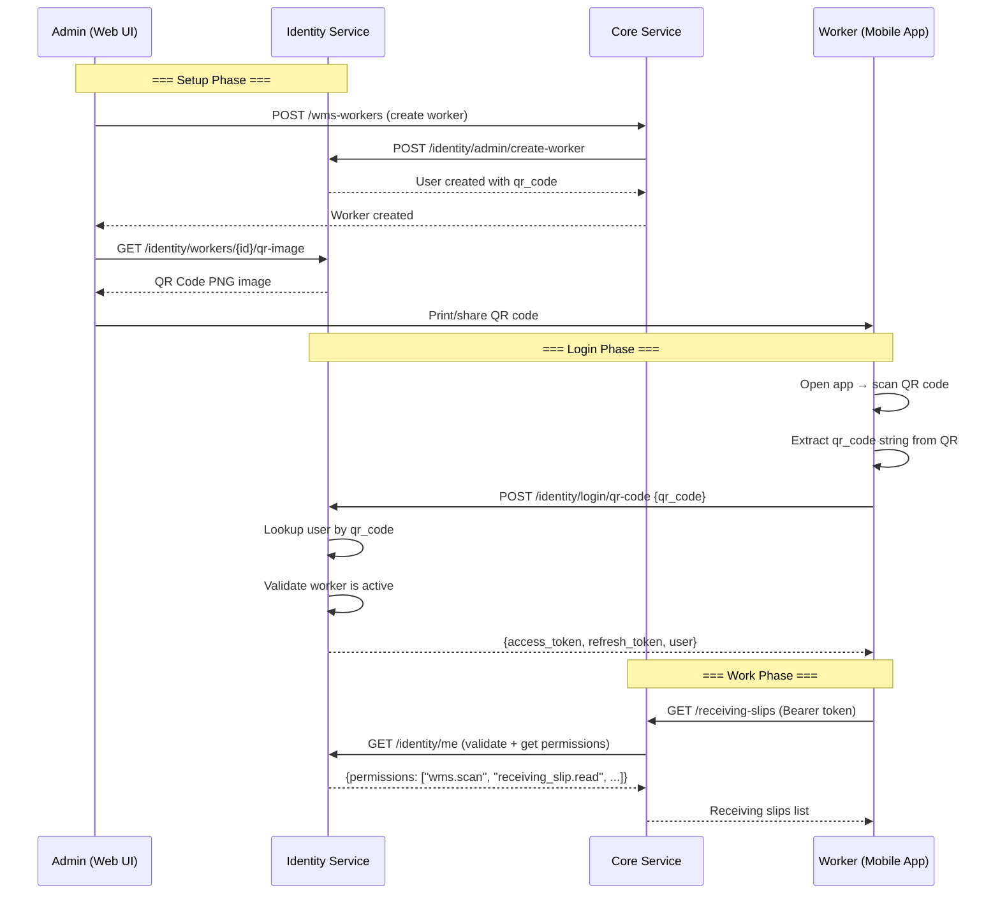

# Horizon Sync — QR Code Login for Warehouse Workers

> **Version**: 1.0
> **Date**: 2026-06-19
> **Applies to**: Mobile App (React Native / Flutter)
> **Base URL**: `https://<host>/api/v1`

---

## Table of Contents

1. [Overview](#1-overview)
2. [How It Works (End-to-End)](#2-how-it-works-end-to-end)
3. [Admin Side — Creating Workers & QR Codes](#3-admin-side--creating-workers--qr-codes)
4. [Mobile App — QR Code Login Flow](#4-mobile-app--qr-code-login-flow)
5. [API Reference](#5-api-reference)
6. [Token Management](#6-token-management)
7. [Permission Model](#7-permission-model)
8. [Pseudocode / Implementation Guide](#8-pseudocode--implementation-guide)
9. [Error Handling](#9-error-handling)
10. [Edge Cases & FAQ](#10-edge-cases--faq)

---

## 1. Overview

Warehouse workers log in by **scanning a QR code** — no email/password needed. Each worker gets a unique QR code generated by an admin. Scanning it returns standard JWT tokens (`access_token` + `refresh_token`) that work across all services.

### Key design decisions

| Decision | Detail |
|----------|--------|
| **QR encodes** | The worker's unique `qr_code` string (e.g., `WRK-A1B2C3D4E5F6`) |
| **Login endpoint** | `POST /identity/login/qr-code` (Identity Service, **public**) |
| **Token type** | Standard identity JWT (`type: "access"`) — works with existing middleware |
| **Token TTL** | 20 hours (configurable: `WORKER_TOKEN_EXPIRE_HOURS` env var) |
| **Refresh token** | Provided (40h TTL) — enables seamless session extension |
| **Role** | `warehouse_work_user` — limited WMS permissions only |

---

## 2. How It Works (End-to-End)



---

## 3. Admin Side — Creating Workers & QR Codes

### 3.1 Create a Worker

Admins use the existing **WMS Workers** UI in the web portal. When a worker is created:

1. The system auto-generates a unique `qr_code` string (stored on both `WMSWorker.barcode` and `User.qr_code`)
2. An Identity Service `User` record is automatically created with `user_type=warehouse_worker`
3. The `warehouse_work_user` role is assigned (limited WMS permissions)

### 3.2 Download the QR Code Image

```
GET /identity/workers/{user_id}/qr-image
Authorization: Bearer <admin_token>
```

Returns a **PNG image** (not JSON). The image encodes the worker's `qr_code` string.

**Example**: Opening this in a browser or `` tag renders a scannable QR code.

### 3.3 What the QR Code Looks Like When Scanned

The QR encodes a plain string like:

```
WRK-A1B2C3D4E5F6
```

The mobile app reads this string and sends it to the login endpoint. **It is NOT a URL** — the app handles the API call.

---

## 4. Mobile App — QR Code Login Flow

### Step-by-step

```
┌──────────────────────────────────────────────────────┐
│  1. App launches → Shows QR Scanner Screen           │
│  2. Worker points camera at printed QR code          │
│  3. Scanner extracts string: "WRK-A1B2C3D4E5F6"      │
│  4. App calls POST /identity/login/qr-code           │
│  5. On success: store tokens → navigate to Home      │
│  6. On failure: show error → allow retry             │
└──────────────────────────────────────────────────────┘
```

### QR Scanner Integration

| Platform | Library |
|----------|---------|
| React Native (Expo) | `expo-camera` / `expo-barcode-scanner` |
| React Native (bare) | `react-native-vision-camera` + `vision-camera-code-scanner` |
| Flutter | `mobile_scanner` or `qr_code_scanner` |

**Important**: Configure the scanner to read **QR codes only** (disable other barcode formats for speed).

---

## 5. API Reference

### 5.1 QR Code Login

```
POST /identity/login/qr-code
Content-Type: application/json
```

**Request Body**:

```json
{
  "qr_code": "WRK-A1B2C3D4E5F6"
}
```

| Field | Type | Required | Description |
|-------|------|----------|-------------|
| `qr_code` | string | Yes | The QR code string extracted from the scan |

**Success Response** `200`:

```json
{
  "access_token": "eyJhbGciOiJIUzI1NiIsInR5cCI6IkpXVCJ9...",
  "refresh_token": "eyJhbGciOiJIUzI1NiIsInR5cCI6IkpXVCJ9...",
  "token_type": "bearer",
  "expires_in": 72000,
  "user": {
    "id": "550e8400-e29b-41d4-a716-446655440000",
    "email": "rajesh.kumar@warehouse.com",
    "first_name": "Rajesh",
    "last_name": "Kumar",
    "display_name": "Rajesh Kumar",
    "phone": "+91-9876543210",
    "avatar_url": null,
    "user_type": "warehouse_worker",
    "status": "active",
    "is_active": true,
    "email_verified": true,
    "email_verified_at": "2026-06-19T10:00:00Z",
    "last_login_at": "2026-06-19T14:30:00Z",
    "last_login_ip": "192.168.1.100",
    "preferences": {},
    "timezone": "Asia/Kolkata",
    "language": "en",
    "extra_data": {},
    "organization_id": "660e8400-e29b-41d4-a716-446655440001"
  }
}
```

| Field | Type | Description |
|-------|------|-------------|
| `access_token` | string | JWT for `Authorization: Bearer` header |
| `refresh_token` | string | JWT for silent token refresh |
| `expires_in` | int | Seconds until access token expires (default: 72000 = 20h) |
| `user.id` | UUID | Worker's unique ID |
| `user.user_type` | string | Always `warehouse_worker` |
| `user.organization_id` | UUID | The org the worker belongs to |

**Error Responses**:

| Status | Body | Meaning |
|--------|------|---------|
| `401` | `{"detail": "Invalid QR code"}` | QR code doesn't match any active worker |
| `403` | `{"detail": "QR code login is only available for warehouse workers"}` | User exists but is not a warehouse worker |
| `422` | `{"detail": [{"loc": ["body","qr_code"], ...}]}` | Missing or invalid `qr_code` field |

### 5.2 Validate Token / Get Current User

Use the standard Identity Service endpoint (same as email/password login):

```
GET /identity/me
Authorization: Bearer <access_token>
```

**Response** `200`:

```json
{
  "id": "550e8400-e29b-41d4-a716-446655440000",
  "email": "rajesh.kumar@warehouse.com",
  "first_name": "Rajesh",
  "last_name": "Kumar",
  "display_name": "Rajesh Kumar",
  "user_type": "warehouse_worker",
  "status": "active",
  "organization_id": "660e8400-e29b-41d4-a716-446655440001",
  "permissions": [
    "wms.scan",
    "receiving_slip.create",
    "receiving_slip.read",
    "receiving_slip.update",
    "pick_list.read",
    "pick_list.update"
  ]
}
```

### 5.3 Refresh Token

```
POST /identity/refresh
Content-Type: application/json

{
  "refresh_token": "eyJhbGciOiJIUzI1NiIs..."
}
```

**Response** `200`:

```json
{
  "access_token": "eyJhbGciOiJIUzI1NiIs...",
  "token_type": "bearer",
  "expires_in": 72000
}
```

### 5.4 Logout

```
POST /identity/logout
Content-Type: application/json

{
  "refresh_token": "eyJhbGciOiJIUzI1NiIs..."
}
```

**Response** `200`:

```json
{
  "message": "Successfully logged out"
}
```

---

## 6. Token Management

### Storage

| Token | Storage | Reason |
|-------|---------|--------|
| `access_token` | Secure storage (Keychain/Keystore) | Short-lived, used for every API call |
| `refresh_token` | Secure storage (Keychain/Keystore) | Long-lived, used for silent refresh |
| `user` object | Local state / AsyncStorage | Display name, org_id for UI |

### Token Refresh Strategy

```
┌─────────────────────────────────────────┐
│  API Call returns 401                   │
│      ↓                                  │
│  Try POST /identity/refresh             │
│      ↓                                  │
│  Success → store new access_token       │
│         → retry original API call       │
│      ↓                                  │
│  Failure → clear tokens                 │
│         → navigate to QR Scanner screen │
└─────────────────────────────────────────┘
```

### Token TTL

| Token | Duration | Configurable via |
|-------|----------|------------------|
| Access Token | 20 hours | `WORKER_TOKEN_EXPIRE_HOURS` env var |
| Refresh Token | 40 hours | 2 × `WORKER_TOKEN_EXPIRE_HOURS` |

---

## 7. Permission Model

Workers with the `warehouse_work_user` role have these permissions:

| Permission | What It Allows |
|------------|---------------|
| `wms.scan` | QR/barcode scanning for inbound/outbound operations |
| `receiving_slip.create` | Create inbound receiving slips |
| `receiving_slip.read` | View receiving slips |
| `receiving_slip.update` | Update receiving slip details |
| `pick_list.read` | View outbound pick lists |
| `pick_list.update` | Update pick list status (start/finish picking) |

**Workers CANNOT**:
- Create pick lists
- Manage other workers or devices
- Access billing, reporting, or admin functions
- Access items, stock entries, or other inventory data beyond receiving/picking

---

## 8. Pseudocode / Implementation Guide

### 8.1 QR Scanner Screen

```typescript
// QRScannerScreen.tsx (React Native / Expo)
import { CameraView, useCameraPermissions } from 'expo-camera';
import { useState } from 'react';

export function QRScannerScreen() {
  const [permission, requestPermission] = useCameraPermissions();
  const [scanning, setScanning] = useState(true);

  const handleQRScanned = async (qrCodeString: string) => {
    if (!scanning) return;
    setScanning(false); // Prevent double-scans

    try {
      const result = await loginWithQRCode(qrCodeString);
      await storeTokens(result.access_token, result.refresh_token);
      await storeUser(result.user);
      navigation.replace('Home');
    } catch (error) {
      showError(error.message);
      setScanning(true); // Allow retry
    }
  };

  if (!permission?.granted) {
    return <PermissionRequest onGrant={requestPermission} />;
  }

  return (
    <CameraView
      style={{ flex: 1 }}
      barcodeScannerSettings={{ barcodeTypes: ['qr'] }}
      onBarcodeScanned={({ data }) => handleQRScanned(data)}
    />
  );
}
```

### 8.2 Login API Call

```typescript
// auth-service.ts
const BASE_URL = 'https://your-server.com/api/v1';

interface QRLoginResponse {
  access_token: string;
  refresh_token: string;
  token_type: string;
  expires_in: number;
  user: {
    id: string;
    email: string;
    first_name: string;
    last_name: string;
    display_name: string | null;
    user_type: string;
    status: string;
    is_active: boolean;
    organization_id: string;
  };
}

async function loginWithQRCode(qrCode: string): Promise<QRLoginResponse> {
  const response = await fetch(`${BASE_URL}/identity/login/qr-code`, {
    method: 'POST',
    headers: { 'Content-Type': 'application/json' },
    body: JSON.stringify({ qr_code: qrCode }),
  });

  if (!response.ok) {
    const error = await response.json();
    throw new Error(error.detail || 'QR login failed');
  }

  return response.json();
}
```

### 8.3 Token Storage (Secure)

```typescript
// token-store.ts
import * as SecureStore from 'expo-secure-store';

const ACCESS_TOKEN_KEY = 'access_token';
const REFRESH_TOKEN_KEY = 'refresh_token';

export async function storeTokens(access: string, refresh: string) {
  await SecureStore.setItemAsync(ACCESS_TOKEN_KEY, access);
  await SecureStore.setItemAsync(REFRESH_TOKEN_KEY, refresh);
}

export async function getAccessToken(): Promise<string | null> {
  return SecureStore.getItemAsync(ACCESS_TOKEN_KEY);
}

export async function getRefreshToken(): Promise<string | null> {
  return SecureStore.getItemAsync(REFRESH_TOKEN_KEY);
}

export async function clearTokens() {
  await SecureStore.deleteItemAsync(ACCESS_TOKEN_KEY);
  await SecureStore.deleteItemAsync(REFRESH_TOKEN_KEY);
}
```

### 8.4 API Client with Auto-Refresh

```typescript
// api-client.ts
import { getAccessToken, getRefreshToken, storeTokens, clearTokens } from './token-store';

const BASE_URL = 'https://your-server.com/api/v1';

async function apiClient<T>(
  path: string,
  options: RequestInit = {}
): Promise<T> {
  const token = await getAccessToken();
  const headers: Record<string, string> = {
    'Content-Type': 'application/json',
    ...(options.headers as Record<string, string>),
  };
  if (token) {
    headers['Authorization'] = `Bearer ${token}`;
  }

  let response = await fetch(`${BASE_URL}${path}`, {
    ...options,
    headers,
  });

  // Auto-refresh on 401
  if (response.status === 401) {
    const refreshToken = await getRefreshToken();
    if (refreshToken) {
      const refreshResp = await fetch(`${BASE_URL}/identity/refresh`, {
        method: 'POST',
        headers: { 'Content-Type': 'application/json' },
        body: JSON.stringify({ refresh_token: refreshToken }),
      });

      if (refreshResp.ok) {
        const { access_token } = await refreshResp.json();
        await storeTokens(access_token, refreshToken);

        // Retry original request
        headers['Authorization'] = `Bearer ${access_token}`;
        response = await fetch(`${BASE_URL}${path}`, {
          ...options,
          headers,
        });
      }
    }
  }

  // If still 401, force re-login
  if (response.status === 401) {
    await clearTokens();
    // Navigate to QR scanner screen
    throw new Error('Session expired. Please scan QR code again.');
  }

  if (!response.ok) {
    const error = await response.json().catch(() => ({}));
    throw new Error(error.detail || `Request failed: ${response.status}`);
  }

  // Handle 204 No Content
  if (response.status === 204) return undefined as T;

  return response.json();
}

// Convenience methods
export const api = {
  get: <T>(path: string) => apiClient<T>(path),
  post: <T>(path: string, body: unknown) =>
    apiClient<T>(path, { method: 'POST', body: JSON.stringify(body) }),
  put: <T>(path: string, body: unknown) =>
    apiClient<T>(path, { method: 'PUT', body: JSON.stringify(body) }),
  patch: <T>(path: string, body: unknown) =>
    apiClient<T>(path, { method: 'PATCH', body: JSON.stringify(body) }),
  delete: <T>(path: string) => apiClient<T>(path, { method: 'DELETE' }),
};
```

### 8.5 App Startup — Check Existing Session

```typescript
// app-startup.ts
async function checkExistingSession(): Promise<boolean> {
  const token = await getAccessToken();
  if (!token) return false;

  try {
    // Validate token by calling /identity/me
    const user = await api.get('/identity/me');
    return user.user_type === 'warehouse_worker' && user.is_active;
  } catch {
    // Token invalid/expired — try refresh
    const refreshToken = await getRefreshToken();
    if (!refreshToken) return false;

    try {
      const { access_token } = await api.post('/identity/refresh', {
        refresh_token: refreshToken,
      });
      await storeTokens(access_token, refreshToken);
      return true;
    } catch {
      await clearTokens();
      return false;
    }
  }
}

// On app launch:
// if (await checkExistingSession()) → navigate to Home
// else → navigate to QRScannerScreen
```

---

## 9. Error Handling

### Error Codes Summary

| HTTP Status | Meaning | Mobile App Action |
|-------------|---------|-------------------|
| `200` | Success | Store tokens, navigate to Home |
| `401` | Invalid QR code | Show "Invalid QR code. Please try again." → re-enable scanner |
| `401` | Token expired (API calls) | Try refresh → if fails, go to scanner |
| `403` | Not a warehouse worker | Show "This QR code is not for a warehouse worker." |
| `422` | Validation error | Check request format (shouldn't happen in normal flow) |
| `503` | Server unavailable | Show "Service unavailable. Try again later." → retry button |

### UX Recommendations

1. **Scanner feedback**: Show a green checkmark animation on successful scan
2. **Loading state**: Show "Logging you in..." spinner while API call is in progress
3. **Error toast**: Show error message at the bottom, re-enable scanner after 2 seconds
4. **Offline**: If the device is offline, show "No internet connection" before even attempting the API call
5. **Rate limiting**: If the server returns `429`, wait 5 seconds before retrying

---

## 10. Edge Cases & FAQ

### Q: What if the same worker scans the QR code on two phones?

Both phones will receive valid tokens. The last login timestamp updates each time. This is allowed — workers might switch devices.

### Q: What if the admin regenerates the worker's QR code?

The old QR code becomes invalid. The worker needs the new printed QR code. The app will show "Invalid QR code."

### Q: Can a worker also log in with email/password?

Workers created via the WMS worker flow have a random auto-generated password (they don't know it). If you want password login as a fallback, admins must set a known password.

### Q: What if the worker's account is deactivated?

The QR code login returns `401` with "Worker account is inactive or suspended." The app should show an appropriate message.

### Q: Does the QR code expire?

The QR code string itself never expires, but the worker's account can be deactivated by an admin. Tokens expire after 20 hours and must be refreshed.

### Q: Can the QR code be shown on the phone screen (for testing)?

Yes. The QR code is a standard PNG image from `GET /identity/workers/{id}/qr-image`. You can open it in a browser and scan it with another phone.

---

## Quick Reference — All Relevant Endpoints

| Method | Path | Auth | Purpose |
|--------|------|------|---------|
| `POST` | `/identity/login/qr-code` | None | **Worker login via QR scan** |
| `GET` | `/identity/me` | Bearer | Get current user + permissions |
| `POST` | `/identity/refresh` | None* | Refresh access token |
| `POST` | `/identity/logout` | None* | Revoke refresh token |
| `GET` | `/identity/workers/{id}/qr-image` | Admin | Generate QR PNG (admin only) |
| `POST` | `/identity/admin/create-worker` | Admin | Create worker user (admin only) |

> \* Sends refresh_token in body, not Bearer header.
