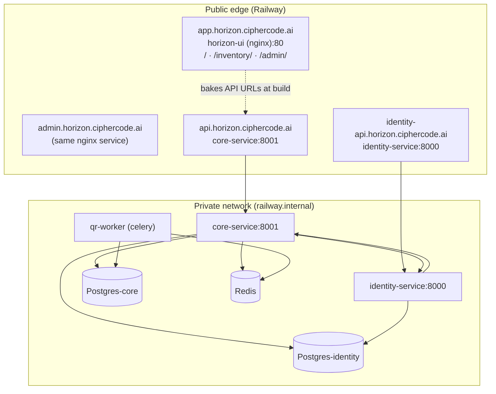

# BW-staging — Horizon Sync Staging Environment (Wipe & Rebuild)

> Step-by-step, testable plan to rebuild the **BW-staging** Railway project as a full
> Horizon Sync staging stack: 2 isolated databases, Redis, 2 backend services,
> 1 Celery worker, and 1 nginx service hosting all 3 UIs.

| Item          | Value                                                                 |
| ------------- | --------------------------------------------------------------------- |
| Project name  | `BW-staging`                                                          |
| Project id    | `fd8e8c06-a0a1-4592-9d6e-9a63c6cfb090`                                |
| Target env    | `staging` (`42a3b024-6059-47e2-a977-0e4377ef6e13`)                    |
| Unused env    | `production` (`5fd250b5-ddf5-429c-9b2b-3274c3d5a2d7`)                 |
| Backend repo  | `horizon-sync-be` (remote `bworigin` = `devciphercode/brandwise-2.0`) |
| Frontend repo | `horizon-sync` (remote `bworigin` = `devciphercode/brandwise-2-fe`)   |
| Root domain   | `ciphercode.ai` ✅ **confirmed 2026-09-28**                           |
| Deploy branch | `stage` (both repos) — auto-deploy on merge                           |
| BE repo       | `github.com/ciphercodeai/brandwise-2.0` (remote `bworigin`)           |
| FE repo       | `github.com/ciphercodeai/brandwise-2-fe` (remote `bworigin`)          |

---

## 0. Locked decisions

| Decision          | Choice                                                                                       |
| ----------------- | -------------------------------------------------------------------------------------------- |
| Existing services | **Wipe & rebuild clean** (delete the 4 existing staging services)                            |
| Database split    | **Two Postgres services** — `Postgres-core`, `Postgres-identity`                             |
| UI topology       | **One nginx service** serving platform `/`, inventory `/inventory/`, admin `/admin/`         |
| Subdomains        | `app.` (UIs), `admin.` (admin UI), `api.` (core-service), `identity-api.` (identity-service) |

### 0.5 Domain — RESOLVED

**`ciphercode.ai` is the base domain** (confirmed 2026-09-28; the earlier "cipercode"
was a typo). Final hostnames:

| Host                         | Serves                                   |
| ---------------------------- | ---------------------------------------- |
| `app.ciphercode.ai`          | platform UI (+ `/inventory/`, `/admin/`) |
| `admin.ciphercode.ai`        | admin UI                                 |
| `api.ciphercode.ai`          | core-service                             |
| `identity-api.ciphercode.ai` | identity-service                         |

### 0.6 Service naming caveat (CLI 5.26.1)

`railway add --database postgres --service <name>` **silently ignores the name** and
creates a template-named service (e.g. `Postgres-_Fua`). Names must be fixed in the
Railway **dashboard** (Rename), or by upgrading the CLI. The reference variables in
[§4.2](#42-reference-variables-how-services-point-at-each-other) assume the intended names.

---

## 1. Target topology



**Final service list in the `staging` environment (7 services):**

| #   | Service             | Kind     | Builder               | Port | Public domain                                               |
| --- | ------------------- | -------- | --------------------- | ---- | ----------------------------------------------------------- |
| 1   | `Postgres-identity` | Database | Railway Postgres      | 5432 | none (private only)                                         |
| 2   | `Postgres-core`     | Database | Railway Postgres      | 5432 | none (private only)                                         |
| 3   | `Redis`             | Database | Railway Redis         | 6379 | none (private only)                                         |
| 4   | `identity-service`  | App      | `Dockerfile.identity` | 8000 | `identity-api.horizon.ciphercode.ai`                        |
| 5   | `core-service`      | App      | `Dockerfile.core`     | 8001 | `api.horizon.ciphercode.ai`                                 |
| 6   | `qr-worker`         | Worker   | `Dockerfile.worker`   | —    | none                                                        |
| 7   | `horizon-ui`        | Static   | new FE `Dockerfile`   | 80   | `app.horizon.ciphercode.ai` + `admin.horizon.ciphercode.ai` |

---

## 2. Pre-flight checks

### 2.1 CLI + auth

```bash
railway --version          # expect >= 5.x
railway whoami             # expect: info@ciphercode.ai
```

✅ **Checkpoint:** you are logged in as `info@ciphercode.ai`. If not, run `railway login`.

### 2.2 Branch decision

The BW-staging project was previously wired to the `stage` branch; your working tree is on
`dev`. **Decide one:**

- **Option A (recommended):** push `dev` → `stage`, deploy from `stage`.
- **Option B:** deploy your local `dev` working tree via `railway up` (no branch needed).

> ⚠️ Railway gates _Git-triggered_ deploys when the commit author isn't a project member
> (`devnegikec` vs owner `info@ciphercode.ai`) → builds sit in `NEEDS_APPROVAL` forever.
> **`railway up` is not gated** (uploaded source has no commit author). This plan uses
> `railway up` throughout, and adds a GitHub Action later only if you want auto-deploy.

### 2.3 Capture what you want to keep (BEFORE deleting anything)

```bash
mkdir -p /tmp/bw-staging-backup && cd /tmp/bw-staging-backup
for S in brandwise-2.0 identity-service; do
  railway variable list -p fd8e8c06-a0a1-4592-9d6e-9a63c6cfb090 -e staging -s "$S" --json \
    > "$S.vars.json" 2>/dev/null
done
```

This preserves the Gmail SMTP credentials + `SECRET_KEY` so you can reuse them.
**Do not commit these files.**

✅ **Checkpoint:** two JSON files exist and contain `SMTP_*` keys.

---

## 3. Phase A — Wipe the existing staging services

> 🛑 **Destructive.** This deletes the current staging Postgres data.
>
> **Dump first** (verified working 2026-09-28 — the local `pg_dump` 14.19 is too old for the
> PG 18.6 server, so run the dump inside a matching container):
>
> ```bash
> mkdir -p ~/.bw-staging-backup && cd ~/.bw-staging-backup
> railway variable list -p "$PROJ" -e staging -s Postgres --json > Postgres.vars.json
> python3 - <<'PY'
> import json
> d = json.load(open('Postgres.vars.json'))
> with open('pgconn.docker.env','w') as f:
>     f.write(f"PGHOST={d['RAILWAY_TCP_PROXY_DOMAIN']}\nPGPORT={d['RAILWAY_TCP_PROXY_PORT']}\n")
>     f.write(f"PGUSER={d['PGUSER']}\nPGPASSWORD={d['PGPASSWORD']}\nPGDATABASE={d['PGDATABASE']}\n")
>     f.write("PGSSLMODE=prefer\n")
> PY
> docker run --rm --env-file pgconn.docker.env postgres:18-alpine \
>   pg_dump --no-owner --no-privileges > staging-postgres.sql
> rm pgconn.docker.env   # contains credentials
> chmod 700 ~/.bw-staging-backup && chmod 600 ~/.bw-staging-backup/*
> ```
>
> Result on 2026-09-28: 468 KB, 190 tables. Also save the app service variables
> (`railway variable list … --json`) — they hold `SECRET_KEY` and the SMTP credentials.

```bash
PROJ=fd8e8c06-a0a1-4592-9d6e-9a63c6cfb090
ENV=staging

for S in brandwise-2.0 identity-service Redis Postgres; do
  echo "--- deleting $S ---"
  railway service delete "$S" -p "$PROJ" -e "$ENV" -y
done
```

> `railway service delete` deletes the service from **the environment**. The services above
> also exist in the unused `production` env of this project — deleting them there too is
> harmless but optional.

✅ **Checkpoint:**

```bash
railway status -p "$PROJ" -e "$ENV" --json | python3 -c \
  "import sys,json; d=json.load(sys.stdin); print([e['node']['name'] for e in d['services']['edges']])"
```

Expected: `[]` (no services).

---

## 4. Phase B — Data layer (2 Postgres + 1 Redis)

`railway add` **does not accept `--project`** — it uses the linked directory. So link a
throwaway dir once and run every `add` from there.

```bash
mkdir -p /tmp/bw-staging-link && cd /tmp/bw-staging-link
railway link -p fd8e8c06-a0a1-4592-9d6e-9a63c6cfb090 -e staging

railway add -d postgres -s Postgres-core
railway add -d postgres -s Postgres-identity
railway add -d redis    -s Redis
```

✅ **Checkpoint:** `railway status -p $PROJ -e staging --json` lists all three, and each
Postgres exposes `DATABASE_URL`:

```bash
railway variable list -p "$PROJ" -e staging -s Postgres-core --json \
  | python3 -c "import sys,json;print(sorted(json.load(sys.stdin).keys()))"
# expect: ['DATABASE_PUBLIC_URL','DATABASE_URL','PGDATABASE',...,'RAILWAY_...']
```

### 4.1 Enable `uuid-ossp` on BOTH Postgres services

Core migration `060` calls `uuid_generate_v4()`. A **fresh** Railway Postgres does not have
`uuid-ossp` enabled → migrations die.

**Do NOT** put this in a `startCommand` (shell `$VAR` expansion is unreliable there).
Use `railway connect` piping SQL via stdin:

```bash
printf 'CREATE EXTENSION IF NOT EXISTS "uuid-ossp";\nSELECT extname FROM pg_extension;\n' \
  | railway connect Postgres-core -p "$PROJ" -e staging
printf 'CREATE EXTENSION IF NOT EXISTS "uuid-ossp";\nSELECT extname FROM pg_extension;\n' \
  | railway connect Postgres-identity -p "$PROJ" -e staging
```

> ⚠️ **`DATABASE_PUBLIC_URL` no longer exists on Railway Postgres.** The variables are
> `RAILWAY_TCP_PROXY_DOMAIN` + `RAILWAY_TCP_PROXY_PORT` + `PGUSER`/`PGPASSWORD`/`PGDATABASE`.
> Any local `psql`/`pg_dump` must use those (and must be **PG 18 client** — the server is
> 18.6; the plan's earlier `DATABASE_PUBLIC_URL` snippet is obsolete).

✅ **Checkpoint:** both outputs list `uuid-ossp`.

### 4.2 Reference variables (how services point at each other)

Railway reference syntax `${{ServiceName.VAR}}`:

| Service            | Variable                | Value                                 |
| ------------------ | ----------------------- | ------------------------------------- |
| `core-service`     | `DATABASE_URL`          | `${{Postgres-core.DATABASE_URL}}`     |
| `core-service`     | `IDENTITY_DATABASE_URL` | `${{Postgres-identity.DATABASE_URL}}` |
| `identity-service` | `DATABASE_URL`          | `${{Postgres-identity.DATABASE_URL}}` |
| `core-service`     | `REDIS_URL`             | `${{Redis.REDIS_URL}}/0`              |
| `core-service`     | `REDIS_WAREHOUSE_URL`   | `${{Redis.REDIS_URL}}/1`              |
| `qr-worker`        | `CELERY_BROKER_URL`     | `${{Redis.REDIS_URL}}/0`              |

---

## 5. Phase C — Backend services

Run all `railway up` commands **from the repo root** (`horizon-sync-be/`), so the build
context contains both `Dockerfile.*` and the service directories.

### 5.1 `SECRET_KEY` — generate once, share with both services

```bash
SECRET_KEY=$(python3 -c "import secrets;print(secrets.token_urlsafe(64))")
echo "$SECRET_KEY" > /tmp/bw-staging-backup/secret_key.txt   # keep private
```

### 5.2 Create `core-service`

```bash
PROJ=fd8e8c06-a0a1-4592-9d6e-9a63c6cfb090
ENV=staging
cd /tmp/bw-staging-link
railway add -s core-service
cd /Users/devnegi/Documents/www/erpproject/horizon-sync-be
```

Set variables (secrets via `--stdin`, everything else inline). `--skip-deploys` so the
first `railway up` is the single deploy:

```bash
railway variable set \
  DATABASE_URL='${{Postgres-core.DATABASE_URL}}' \
  IDENTITY_DATABASE_URL='${{Postgres-identity.DATABASE_URL}}' \
  REDIS_URL='${{Redis.REDIS_URL}}/0' \
  REDIS_WAREHOUSE_URL='${{Redis.REDIS_URL}}/1' \
  REDIS_STREAM_NAME=search:events \
  CELERY_BROKER_URL='${{Redis.REDIS_URL}}/0' \
  CELERY_QR_QUEUE_NAME=qr-generation \
  IDENTITY_SERVICE_URL='http://identity-service.railway.internal:8000' \
  ENVIRONMENT=staging \
  DEBUG=false \
  LOG_LEVEL=INFO \
  SKIP_MASTER_ORG_SETUP=true \
  CORS_ORIGINS='https://app.horizon.ciphercode.ai,https://admin.horizon.ciphercode.ai' \
  COOKIE_SECURE=true \
  COOKIE_DOMAIN='.horizon.ciphercode.ai' \
  QR_DOMAIN=horizon.ciphercode.ai \
  QR_BASE_URL='https://app.horizon.ciphercode.ai' \
  EMAIL_ENABLED=false \
  -p "$PROJ" -e "$ENV" -s core-service --skip-deploys

printf '%s' "$(cat /tmp/bw-staging-backup/secret_key.txt)" \
  | railway variable set SECRET_KEY --stdin -p "$PROJ" -e "$ENV" -s core-service --skip-deploys
```

**Why `SKIP_MASTER_ORG_SETUP=true`:** `core-service/app/main.py:139` runs
`ensure_single_master_organization()` at startup unless this is `true`. It is the prime
suspect for the previous staging **502 / "Completed"** failure (logs stopped before the
uvicorn banner). Set it `true` for the first boot; flip to unset later only once the app is
verified healthy. `EMAIL_ENABLED=false` for now (SMTP can be added after the stack is up).

Start command (plural `heads` — singular `head` fails on this repo's multi-head history):

```bash
railway environment edit --service-config core-service \
  deploy.startCommand "bash -c 'python -m alembic upgrade heads && uvicorn app.main:app --host 0.0.0.0 --port 8001'" \
  -p "$PROJ" -e "$ENV"

railway up -p "$PROJ" -e "$ENV" -s core-service -m "staging: core-service initial deploy" -d
```

✅ **Checkpoint C1** (allow 2–4 min):

```bash
railway logs -p "$PROJ" -e "$ENV" -s core-service -d -n 200 | tail -40
```

Look for: alembic upgrade lines → `Application startup complete` → `Uvicorn running on
http://0.0.0.0:8001`. **If you only see 3 lines and then nothing, `SKIP_MASTER_ORG_SETUP`
is still the culprit — re-check the variable actually landed.**

Then verify the DB actually migrated:

```bash
printf "SELECT version_num FROM core_alembic_version;\n" \
  | railway connect Postgres-core -p "$PROJ" -e staging
```

Expected: one or more rows ending in `129_...` / the repo's current heads.

### 5.3 Create `identity-service`

```bash
cd /tmp/bw-staging-link && railway add -s identity-service
cd /Users/devnegi/Documents/www/erpproject/horizon-sync-be

railway variable set \
  DATABASE_URL='${{Postgres-identity.DATABASE_URL}}' \
  CORE_SERVICE_URL='http://core-service.railway.internal:8001' \
  ENVIRONMENT=staging \
  DEBUG=false \
  LOG_LEVEL=INFO \
  CORS_ORIGINS='https://app.horizon.ciphercode.ai,https://admin.horizon.ciphercode.ai' \
  COOKIE_SECURE=true \
  COOKIE_DOMAIN='.horizon.ciphercode.ai' \
  COOKIE_SAMESITE=lax \
  ACCESS_TOKEN_EXPIRE_MINUTES=4320 \
  REFRESH_TOKEN_EXPIRE_DAYS=7 \
  INVITATION_URL='https://app.horizon.ciphercode.ai/accept-invitation' \
  PASSWORD_RESET_URL='https://app.horizon.ciphercode.ai/reset-password' \
  EMAIL_ENABLED=false \
  -p "$PROJ" -e "$ENV" -s identity-service --skip-deploys

printf '%s' "$(cat /tmp/bw-staging-backup/secret_key.txt)" \
  | railway variable set SECRET_KEY --stdin -p "$PROJ" -e "$ENV" -s identity-service --skip-deploys
```

> `INVITATION_URL` / `PASSWORD_RESET_URL` are the two vars that silently break invitation
> and reset emails when unset (they fall back to `http://localhost:4200/...`). They must be
> set **before** you test invites.

Start command — identity needs a **two-phase** migration on a fresh DB (migration `020`
does `ALTER TYPE resourcetype` on an AUTOCOMMIT connection, invisible until 001–019 commit):

```bash
railway environment edit --service-config identity-service \
  deploy.startCommand "bash -c 'python -m alembic upgrade 019; python -m alembic upgrade head && uvicorn app.main:app --host 0.0.0.0 --port 8000'" \
  -p "$PROJ" -e "$ENV"

railway up -p "$PROJ" -e "$ENV" -s identity-service -m "staging: identity-service initial deploy" -d
```

✅ **Checkpoint C2:**

```bash
railway logs -p "$PROJ" -e "$ENV" -s identity-service -d -n 200 | tail -40
printf "SELECT version_num FROM alembic_version_identity;\n" \
  | railway connect Postgres-identity -p "$PROJ" -e staging
```

Expected: `Uvicorn running on http://0.0.0.0:8000`, version row at `022`.

### 5.4 Create `qr-worker`

```bash
cd /tmp/bw-staging-link && railway add -s qr-worker
cd /Users/devnegi/Documents/www/erpproject/horizon-sync-be

railway variable set \
  DATABASE_URL='${{Postgres-core.DATABASE_URL}}' \
  REDIS_URL='${{Redis.REDIS_URL}}/0' \
  CELERY_BROKER_URL='${{Redis.REDIS_URL}}/0' \
  CELERY_QR_QUEUE_NAME=qr-generation \
  ENVIRONMENT=staging \
  -p "$PROJ" -e "$ENV" -s qr-worker --skip-deploys

printf '%s' "$(cat /tmp/bw-staging-backup/secret_key.txt)" \
  | railway variable set SECRET_KEY --stdin -p "$PROJ" -e "$ENV" -s qr-worker --skip-deploys

railway environment edit --service-config qr-worker \
  build.dockerfilePath Dockerfile.worker \
  -p "$PROJ" -e "$ENV"

railway up -p "$PROJ" -e "$ENV" -s qr-worker -m "staging: qr-worker initial deploy" -d
```

> `Dockerfile.worker` has **no web server** → do **not** set a healthcheck / domain for it.
> If a healthcheck is inherited it will flap `unhealthy` and Railway will keep restarting it.

✅ **Checkpoint C3:** logs show `celery@... ready.` and `[queues] qr-generation`.

### 5.5 Wire CORS + internal URLs

| From               | To                     | Value                                           |
| ------------------ | ---------------------- | ----------------------------------------------- |
| `core-service`     | `IDENTITY_SERVICE_URL` | `http://identity-service.railway.internal:8000` |
| `identity-service` | `CORE_SERVICE_URL`     | `http://core-service.railway.internal:8001`     |

✅ **Checkpoint C4** (private DNS resolves inside the project):

```bash
railway ssh -p "$PROJ" -e "$ENV" -s core-service -- \
  curl -sS -o /dev/null -w '%{http_code}\n' http://identity-service.railway.internal:8000/health
# expect: 200
```

---

## 6. Phase D — Frontend (one nginx service, three UIs)

### 6.1 How the UIs are wired (verified in code)

- `apps/platform` is the **module-federation host**; `apps/*/webpack.config.prod.ts` pins the
  remote to a **relative** URL: `['inventory', '/inventory/remoteEntry.js']`.
  → inventory **must be served on the same origin** at `/inventory/`. This is exactly why a
  single nginx service is the right call.
- `apps/admin` is a **standalone** SPA (no federation).
- All three set `output.publicPath = 'auto'`, so they resolve their own assets relative to
  their `<script>` URL → **serving admin at `/admin/` and inventory at `/inventory/` works
  without changing `baseHref`.**
- API base URLs are **baked at build time** via `DefinePlugin` reading
  `process.env.NX_API_BASE_URL` / `NX_API_CORE_URL` / `NX_API_IDENTITY_URL`
  (see `apps/*/src/environments/environment.prod.ts`).
  ⚠️ **These are build-time, not runtime** → they must be present as **build variables** and
  the UI must be **rebuilt** whenever a domain changes.

### 6.2 New file — `horizon-sync/Dockerfile.railway`

> ⚠️ **Do not replace the existing root `Dockerfile`.** It is used by the ECS pipeline
> (`.deploy/deploy-frontend.sh`, which builds `dist/` locally and then `docker build .`
> with a Dockerfile that merely COPYs that prebuilt `dist/`) and by `.github/workflows/deploy-main.yml`.
> Railway therefore gets its **own** Dockerfile, selected via `railway.toml`
> (`build.dockerfilePath = "Dockerfile.railway"`).
> For the same reason `.dockerignore` must **not** exclude `dist/`.

Existing root `Dockerfile` (leave as-is) is just:

```dockerfile
FROM nginx:alpine
RUN rm -rf /usr/share/nginx/html/*
COPY dist/apps/platform /usr/share/nginx/html
COPY dist/apps/inventory /usr/share/nginx/html/inventory
COPY nginx.conf /etc/nginx/conf.d/default.conf
```

The new Railway-only Dockerfile builds from source:

```dockerfile
# ---------- build ----------
FROM node:20-alpine AS build
WORKDIR /app
ENV CI=true NX_DAEMON=false NX_SKIP_NX_CACHE=true

# Baked-in at build time by DefinePlugin (see apps/*/src/environments/environment.prod.ts)
ARG NX_API_BASE_URL
ARG NX_API_CORE_URL
ARG NX_API_IDENTITY_URL
ARG NX_SEARCH_API_BASE_URL
ENV NX_API_BASE_URL=${NX_API_BASE_URL} \
    NX_API_CORE_URL=${NX_API_CORE_URL} \
    NX_API_IDENTITY_URL=${NX_API_IDENTITY_URL} \
    NX_SEARCH_API_BASE_URL=${NX_SEARCH_API_BASE_URL}

COPY package.json package-lock.json nx.json tsconfig.base.json ./
COPY apps ./apps
COPY libs ./libs
RUN npm ci --no-audit --no-fund

RUN npx nx build platform  --configuration=production \
 && npx nx build inventory --configuration=production \
 && npx nx build admin     --configuration=production \
 && cp -r dist/apps/inventory dist/apps/platform/inventory \
 && cp -r dist/apps/admin     dist/apps/platform/admin

# ---------- serve ----------
FROM nginx:alpine
COPY --from=build /app/dist/apps/platform /usr/share/nginx/html
# nginx's entrypoint envsubst's /etc/nginx/templates/*.template (only real env vars,
# so $uri / $host below are left intact) → lets us honour Railway's $PORT.
COPY nginx.railway.conf /etc/nginx/templates/default.conf.template
ENV PORT=80
```

### 6.3 New file — `horizon-sync/nginx.railway.conf`

```nginx
server {
    listen ${PORT};
    server_name _;

    root /usr/share/nginx/html;
    index index.html;
    client_max_body_size 25m;

    # SPA entry points must never be cached
    location ~* (?:remoteEntry\.js|\.html)$ {
        add_header Cache-Control "no-cache, no-store, must-revalidate";
    }

    location = /healthz { access_log off; return 200 "ok\n"; }

    # inventory remote — MUST stay on this origin (host references /inventory/remoteEntry.js)
    location ^~ /inventory/ {
        try_files $uri $uri/ /inventory/index.html;
    }

    # admin SPA
    location ^~ /admin/ {
        try_files $uri $uri/ /admin/index.html;
    }

    # platform host
    location / {
        try_files $uri $uri/ /index.html;
    }

    location ~* \.(?:js|css|png|jpg|jpeg|gif|svg|woff|woff2)$ {
        expires 1y;
        add_header Cache-Control "public, immutable";
    }
}
```

### 6.4 New file — `horizon-sync/.dockerignore`

```
node_modules
**/node_modules
dist
coverage
test-results
.vercel
.git
.nx
```

### 6.5 New file — `horizon-sync/railway.toml`

```toml
[build]
builder = "dockerfile"
dockerfilePath = "Dockerfile.railway"

[deploy]
healthcheckPath = "/healthz"
restartPolicyType = "ON_FAILURE"
restartPolicyMaxRetries = 3
```

### 6.6 Create + deploy the UI service

```bash
cd /tmp/bw-staging-link
railway add -s horizon-ui
cd /Users/devnegi/Documents/www/erpproject/horizon-sync

railway variable set \
  NX_API_BASE_URL='https://identity-api.horizon.ciphercode.ai' \
  NX_API_IDENTITY_URL='https://identity-api.horizon.ciphercode.ai' \
  NX_API_CORE_URL='https://api.horizon.ciphercode.ai' \
  NX_SEARCH_API_BASE_URL='https://api.horizon.ciphercode.ai' \
  NX_NODE_ENV=production \
  -p "$PROJ" -e "$ENV" -s horizon-ui --skip-deploys

railway up -p "$PROJ" -e "$ENV" -s horizon-ui -m "staging: horizon-ui initial deploy" -d
```

> ⚠️ Railway must expose these as **build** variables for the Dockerfile `ARG`s to resolve.
> If the `--skip-deploys` set doesn't reach the build, the ARGs arrive empty and the UI
> falls back to `http://localhost:8000`.

✅ **Checkpoint D1 — were the API URLs actually baked in?**

```bash
railway logs -p "$PROJ" -e "$ENV" -s horizon-ui -b -n 200 | grep -i "NX_API\|error" | head
```

and then, after the domain exists (Step E), prove it from the built bundle:

```bash
curl -s https://app.horizon.ciphercode.ai/main.js | grep -o 'https://api\.horizon\.ciphercode\.ai' | head -1
# expect: one match. If empty → the build args did NOT land; re-set vars and redeploy.
```

✅ **Checkpoint D2 — all three entry points load:**

```bash
curl -s -o /dev/null -w 'platform  %{http_code}\n' https://app.horizon.ciphercode.ai/
curl -s -o /dev/null -w 'inventory %{http_code}\n' https://app.horizon.ciphercode.ai/inventory/remoteEntry.js
curl -s -o /dev/null -w 'admin     %{http_code}\n' https://app.horizon.ciphercode.ai/admin/
curl -s -o /dev/null -w 'healthz   %{http_code}\n' https://app.horizon.ciphercode.ai/healthz
```

All must be `200`. `/inventory/remoteEntry.js` returning 404 is the classic module-federation
failure (platform shell renders but inventory routes are blank).

---

## 7. Phase E — Domains + DNS

### 7.1 Generate Railway domains first (test before touching DNS)

```bash
railway domain -p "$PROJ" -e "$ENV" -s core-service     --port 8001
railway domain -p "$PROJ" -e "$ENV" -s identity-service --port 8000
railway domain -p "$PROJ" -e "$ENV" -s horizon-ui       --port 80
```

✅ **Checkpoint E1:** each `*.up.railway.app` URL returns 200 on `/health` (or `/healthz`).
Re-run the §6.2 checkpoints against the Railway-generated UI URL now — this decouples
"app works" from "DNS is right".

### 7.2 Add custom domains

```bash
railway domain app.horizon.ciphercode.ai     -p "$PROJ" -e "$ENV" -s horizon-ui --port 80
railway domain admin.horizon.ciphercode.ai   -p "$PROJ" -e "$ENV" -s horizon-ui --port 80
railway domain api.horizon.ciphercode.ai     -p "$PROJ" -e "$ENV" -s core-service     --port 8001
railway domain identity-api.horizon.ciphercode.ai -p "$PROJ" -e "$ENV" -s identity-service --port 8000
```

Each command prints the **exact DNS records** to create. In practice Railway issues a
**CNAME** target per service — copy them verbatim:

| Host           | Type  | Value                                 |
| -------------- | ----- | ------------------------------------- |
| `app`          | CNAME | (horizon-ui target from output)       |
| `admin`        | CNAME | (horizon-ui target from output)       |
| `api`          | CNAME | (core-service target from output)     |
| `identity-api` | CNAME | (identity-service target from output) |

Add these in your `ciphercode.ai` DNS provider. Then wait for TLS:

```bash
railway domain status app.horizon.ciphercode.ai -p "$PROJ" -e "$ENV" -s horizon-ui
```

✅ **Checkpoint E2:** certificate state is **VALID** for all four hosts (usually 1–10 min
after the CNAME propagates; `dig +short app.horizon.ciphercode.ai` should return the Railway
target).

### 7.3 Admin on its own subdomain

`admin.` points at the **same** nginx service, so out of the box it serves the platform
shell at `/` and admin at `/admin/`. Two options:

- **Simplest:** leave it, and link users to `https://app.horizon.ciphercode.ai/admin/`.
- **Clean URLs:** add a second `server` block to `nginx.railway.conf` that matches
  `admin.horizon.ciphercode.ai` and serves the admin SPA at `/`:
  ```nginx
  server {
      listen ${PORT};
      server_name admin.horizon.ciphercode.ai;
      root /usr/share/nginx/html/admin;
      index index.html;
      location / { try_files $uri $uri/ /index.html; }
  }
  ```
  …and move the existing block to `server_name app.horizon.ciphercode.ai _;`.
  Then rebuild/redploy `horizon-ui`.

✅ **Checkpoint E3:** `admin.horizon.ciphercode.ai` renders the admin login (not the platform shell).

### 7.4 Re-bake the UI with the final domains

Because API URLs are **baked at build time**, if you first built with the `*.up.railway.app`
URLs you must rebuild after Step 7.2:

```bash
railway up -p "$PROJ" -e "$ENV" -s horizon-ui -m "staging: rebuild with custom domains" -d
```

---

## 8. Phase F — End-to-end validation

| #   | Test                                                         | Expected                                                                              |
| --- | ------------------------------------------------------------ | ------------------------------------------------------------------------------------- |
| F1  | `https://api.horizon.ciphercode.ai/health`                   | `200` `{"status":"healthy"...}`                                                       |
| F2  | `https://identity-api.horizon.ciphercode.ai/health`          | `200`                                                                                 |
| F3  | `https://app.horizon.ciphercode.ai/`                         | platform shell loads                                                                  |
| F4  | `https://app.horizon.ciphercode.ai/inventory/remoteEntry.js` | `200`, a JS bundle (not HTML)                                                         |
| F5  | `https://app.horizon.ciphercode.ai/admin/`                   | admin SPA loads                                                                       |
| F6  | Browser devtools → Network on app load                       | all XHRs go to `api.` / `identity-api.` — **zero** requests to `localhost:8000/8001`  |
| F7  | Login with a seeded user                                     | `200` + token; identity logs show the request                                         |
| F8  | CORS preflight                                               | no `blocked by CORS` in console; `access-control-allow-origin` echoes the app origin  |
| F9  | `core_alembic_version` / `alembic_version_identity`          | rows present in **their own** Postgres (proves the DB split)                          |
| F10 | QR block generation                                          | block goes `pending` → `completed`; `qr-worker` logs show the task                    |
| F11 | Invitation email (only once SMTP is on)                      | `INVITATION_URL` in the mail is `https://app.horizon.ciphercode.ai/accept-invitation` |
| F12 | `railway status -p $PROJ -e staging`                         | every app service `● Online` (not `● Completed`)                                      |

### 8.1 Seed data (staging DB starts empty)

Migrations create the schema, not the data. You will need at minimum: an org, an admin
user + role/permissions (`identity-service/scripts/seed_*`), and master data.
Plan a seeding step after F1–F3 pass — do not debug "empty UI" as a bug before seeding.

---

## 9. Known gotchas (carried over from previous staging work)

| Gotcha                        | Detail                                                                                                                                   |
| ----------------------------- | ---------------------------------------------------------------------------------------------------------------------------------------- |
| `alembic upgrade heads`       | Must be **plural**. The repo has multiple migration heads; singular `head` fails.                                                        |
| Never blank the source branch | Setting `source.branch ""` makes the next deploy build the **default branch** → alembic dies on an unknown revision.                     |
| `NEEDS_APPROVAL` builds       | Git-triggered deploys by a non-member commit author are gated. Use `railway up`.                                                         |
| `uuid-ossp`                   | Not present on a fresh Railway Postgres → migration `060` fails. Enable per §4.1.                                                        |
| Shell `$VAR` in startCommand  | Unreliable — a `psql "$DATABASE_URL"` in `startCommand` receives an empty URL. Hardcode ports; use Python/psql directly for checks.      |
| `railway variables --json`    | Prints **raw secrets** — never paste into logs/chat. Filter key names only.                                                              |
| `railway logs`                | Streams by default (hangs). Always pass `-n <LINES>`. `-b` = build, `-d` = deploy.                                                       |
| `railway.toml` `[services.*]` | The backend root `railway.toml` declares search-service/nginx-gateway which are **not** deployed here — harmless, but don't expect them. |
| Volume sharing                | A Railway volume attaches to **one** service. `qr-worker` cannot share core's volume.                                                    |
| `railway add`                 | Ignores `--project`; requires a linked dir.                                                                                              |

---

## 10. Rollback

| Failure point       | Rollback                                                                                                                         |
| ------------------- | -------------------------------------------------------------------------------------------------------------------------------- |
| Service won't boot  | `railway variable list` vs §5.2/5.3 matrix; `railway logs … -n 200`; delete + recreate that one service (Phases are independent) |
| Bad migration       | `railway ssh … -- python -m alembic downgrade -1`, then redeploy the previous image                                              |
| Frontend regression | `railway deployment list` → `railway redeploy <previous-deployment-id> -s horizon-ui`                                            |
| DNS/cert issue      | `railway domain delete <host> -p $PROJ -e $ENV -s <svc>`                                                                         |
| Full reset          | Re-run Phases A → F (idempotent). Nothing in this plan depends on prior state.                                                   |

---

## 11. CI/CD — auto-deploy on merge to `stage`

### 11.1 Why GitHub Actions and not Railway's native Git trigger

Railway **gates** Git-triggered deploys whose commit author is not a member of the Railway
project (`NEEDS_APPROVAL`). Merges are authored by `devnegikec` while the project owner is
`info@ciphercode.ai`, so native auto-deploy silently never builds.

An **authenticated `railway up`** uploads source without a commit author → **not gated**.
Therefore: GitHub Actions + a BW-staging **project token**.

> Alternative: invite the merging GitHub user to the Railway project and use the native
> trigger instead. Then no token secret is needed. Pick one, not both (or you'll deploy twice).

### 11.2 Required secret

| Repo                          | Secret                | Value                                    |
| ----------------------------- | --------------------- | ---------------------------------------- |
| `ciphercodeai/brandwise-2.0`  | `RAILWAY_TOKEN_STAGE` | BW-staging **project token**             |
| `ciphercodeai/brandwise-2-fe` | `RAILWAY_TOKEN_STAGE` | (same token works — it's project-scoped) |

> ⚠️ Do **not** name it `RAILWAY_TOKEN`. The BE repo already has a `RAILWAY_TOKEN` secret
> pointing at the **dev** project (`horizon-sync-test`); reusing the name would break the
> existing `deploy-dev.yml`.
>
> Create the token: Railway dashboard → **BW-staging** → Settings → Tokens → _Project Token_.
> Add it with `gh secret set RAILWAY_TOKEN_STAGE -R ciphercodeai/brandwise-2.0` (you type the
> value into the prompt — it never passes through the assistant).

### 11.3 Deploy rules

| Repo | Workflow                             | Triggers on                                                                                                              | Deploys                                                                                            |
| ---- | ------------------------------------ | ------------------------------------------------------------------------------------------------------------------------ | -------------------------------------------------------------------------------------------------- |
| BE   | `.github/workflows/deploy-stage.yml` | push to `stage` touching `core-service/**`, `identity-service/**`, `Dockerfile.*`, `railway.toml`; + `workflow_dispatch` | `identity-service` → `core-service` → `qr-worker`, then verifies each deployment reached `SUCCESS` |
| FE   | `.github/workflows/deploy-stage.yml` | push to `stage` touching `apps/**`, `libs/**`, `Dockerfile`, `nginx.railway.conf`, lockfiles; + `workflow_dispatch`      | `horizon-ui` (the whole 3-UI nginx image), then verifies `SUCCESS`                                 |

Both use `concurrency` groups so overlapping merges queue instead of racing.

### 11.4 Where do migrations run?

**In the container, on every deploy** — the start commands are:

- core: `python -m alembic upgrade heads && uvicorn …` (plural `heads`; `&&` so a failed
  migration **blocks startup and fails the deploy**)
- identity: `python -m alembic upgrade 019; python -m alembic upgrade head && uvicorn …`

So "run the DB migration if required" is already satisfied: alembic is a no-op when there is
nothing to apply, and a hard failure when there is a problem. The workflow's verification
step checks the deployment reached `SUCCESS`, which covers migration failure.

**Optional stricter gate** — run migrations in CI _before_ the deploy so a bad migration never
reaches a running container. Add this job and repo secret:

```yaml
migrate:
  runs-on: ubuntu-latest
  steps:
    - uses: actions/checkout@v4
    - uses: actions/setup-python@v5
      with: { python-version: "3.11" }
    - name: Apply core migrations
      working-directory: core-service
      env:
        DATABASE_URL: ${{ secrets.STAGE_CORE_DATABASE_URL }}
        SECRET_KEY: ci-placeholder
      run: |
        pip install -r requirements.txt
        python -m alembic upgrade heads
```

Requires `STAGE_CORE_DATABASE_URL` / `STAGE_IDENTITY_DATABASE_URL` secrets (built from
`RAILWAY_TCP_PROXY_DOMAIN` + `RAILWAY_TCP_PROXY_PORT` + `PGUSER`/`PGPASSWORD`/`PGDATABASE`).
Trade-off: more moving parts and live DB credentials in GitHub, versus earlier failure
detection. The default plan relies on the start command instead.

### 11.5 Post-merge validation

```bash
GH_PAGER=cat gh run list -R ciphercodeai/brandwise-2.0 -w "Deploy to Railway (Stage)" -L 3
GH_PAGER=cat gh run list -R ciphercodeai/brandwise-2-fe -w "Deploy UI to Railway (Stage)" -L 3
```

---

## 12. Optional follow-ups (not required to validate)

1. **SMTP on** — mirror the saved `SMTP_*` vars into both services, set
   `EMAIL_ENABLED=true`, re-test F11.
2. **Persistent uploads** — attach a Railway volume to `core-service` for `UPLOAD_DIR`
   (QR artifacts, product images).
3. **Search service** — not in this plan; `search-service/` exists and can be added later
   on port 8002 if search is needed in staging.
4. **Orphaned volumes** — deleting a service does not always delete its volume. After the
   Phase A wipe, 4 unattached volumes remained (`postgres-volume`, `postgres-volume-KQg6`,
   `postgres-volume-qnBr`, `redis-volume`). Delete them in the dashboard — they bill. There
   is no CLI command for volume deletion in 5.26.1.
