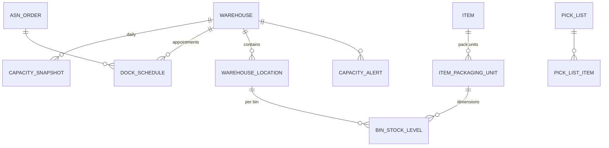

# Warehouse Capacity Tracking & Delivery Estimation — Requirements & Design

> Status: **Design for review** (implementation to follow)
> Date: 2026-08-13
> Scope: `core-service` (FastAPI + SQLAlchemy + PostgreSQL) in `horizon-sync-erp-be`

---

## 1. Purpose

Track warehouse capacity so that **inbound delivery dates and outbound promise dates can be estimated realistically**, instead of assuming a warehouse can always accept more stock.

The system must answer three questions:

1. **How full is the warehouse right now?** (per dimension: volume, weight, pallet positions)
2. **Can we receive a specific inbound delivery on date D?** (dock + storage + flow check)
3. **When will goods be available to pick after receipt?** (lead-time chain → promise date)

---

## 2. Business Requirements

### Functional requirements

| ID | Requirement | Priority |
|---|---|---|
| FR-1 | Compute occupied **volume (m³), weight (kg), and pallet positions** per warehouse from live bin stock | P0 |
| FR-2 | Roll capacity up the existing location hierarchy (Bin → Level → Bay → Aisle → Zone → Warehouse) | P0 |
| FR-3 | Configure warehouse-level physical capacity: usable volume, max weight, pallet positions, utilization factor, thresholds | P0 |
| FR-4 | Track utilization per dimension and report the **binding** dimension | P0 |
| FR-5 | Snapshot daily utilization (volume/weight/pallet + %) for history/trending | P1 |
| FR-6 | Build a **time-phased capacity calendar** for inbound (ASN/PO expected arrivals) and outbound (pick lists/dispatch) | P0 |
| FR-7 | Check **receivable-on-date** for an inbound delivery (dock slot + free cube + flow) | P0 |
| FR-8 | Estimate **available-to-pick date** after receipt using the receiving→QC→putaway lead time | P1 |
| FR-9 | Raise **alerts** when utilization crosses configured thresholds (e.g. 80% / 90%) or a day's inbound exceeds dock capacity | P1 |
| FR-10 | Recommend next open date / split shipment / cross-dock when a delivery does not fit | P2 |
| FR-11 | Expose capacity + calendar via REST endpoints and (optionally) Redis real-time events | P0/P2 |
| FR-12 | All computations tenant-scoped by `organization_id` | P0 |

### Non-functional requirements

- **Correctness**: never double-count reserved stock (reserved is still on-hand, it occupies space); never treat in-transit stock as occupying space today.
- **Consistency**: reuse the exact join `bin_stock_levels ⨝ item_packaging_units` already used by `VolumetricAssignmentService`, so putaway and capacity agree on the same cube/weight math.
- **Performance**: occupancy rollups must not scan the full bin stock on every request → precompute daily snapshots; compute on-demand only for small subtrees.
- **Concurrency**: reuse optimistic-locking (version column) and `FOR UPDATE SKIP LOCKED` patterns already present in `CapacityService` / `VolumetricAssignmentService`.
- **Backward compatibility**: do not break existing unit-based `CapacityService` behavior.

---

## 3. Current-State Analysis (what already exists)

The codebase already contains a large part of the machinery. This design **reuses it rather than replacing it**.

| Concern | Existing asset | Status |
|---|---|---|
| Location hierarchy | `WarehouseLocation` (`zone→aisle→bay→level→bin`), `WarehouseFloorPlan` | ✅ implemented |
| Bin physical limits | `WarehouseLocation.max_volume_cc`, `max_weight_grams` (nullable = unconstrained) | ✅ implemented |
| SKU dimensions | `ItemPackagingUnit` (`length_mm`, `width_mm`, `height_mm`, `weight_grams`, `conversion_factor`, `is_base_unit`) | ✅ implemented |
| Volumetric bin assignment | `VolumetricAssignmentService` (putaway-time volume/weight check via SQL CTE) | ✅ implemented |
| Capacity rollup | `CapacityService` (ancestor `total_capacity` / `available_capacity` + optimistic locking) | ⚠️ unit-based only |
| Per-bin occupancy | `BinStockLevel` (`quantity_on_hand`, batch, expiry) | ✅ implemented |
| Item/warehouse stock | `StockLevel` (`on_hand`, `reserved`, `available`) | ✅ implemented |
| Reservation semantics | `SmartPickingService` (`reserved += qty`, `available -= qty`; dispatch decrements both) | ✅ implemented |
| Inbound signal | `AsnOrder` (`warehouse_id_to`, `delivery_date`, status) + `AsnOrderItem` (`qty`, `delivered_qty`) | ✅ data exists, unused for capacity |
| Outbound signal | `PickList` (`pick_date`) + `PickListItem` (`qty`, `picked_qty`), `DispatchRecord` (`dispatched_at`) | ✅ data exists, unused for capacity |
| Scheduled tasks | `app/tasks/billing_automation.py` (standalone function + cron pattern) | ✅ pattern exists |
| Real-time events | `app/core/redis_pubsub.py` (3D warehouse events) | ✅ pattern exists |
| Warehouse master | `Warehouse` (`total_capacity` Integer, `capacity_uom` String) | ❌ no cube/weight/pallet/dock |

### Identified gaps

1. **`CapacityService` computes "used" as units** (`sum(quantity_on_hand)`), not volume/weight. `total_capacity`/`available_capacity` are therefore slot counts, not physical capacity.
2. **No warehouse-level physical capacity** — only `total_capacity` (int) + free-text `capacity_uom`.
3. **No time-phased inbound/outbound capacity** — `delivery_date` / `pick_date` exist but are never rolled into a daily load calendar.
4. **No dock/throughput model** — no dock doors, receiving rate, staging dwell time.
5. **No utilization snapshots / alerts / promise-date logic.**

---

## 4. Design Principles (industry best practice, corrected)

These encode the corrections agreed during review:

1. **Capacity is multi-dimensional.** Track volume, weight, and pallet positions independently; report the *binding* one:
   $$\text{utilization} = \max(\text{util}_{volume},\ \text{util}_{weight},\ \text{util}_{pallet})$$

2. **Three stock states are not the same.**
   - **On-hand** → occupies space now.
   - **Reserved** → still on-hand (a subset), occupies space now — *never add again*.
   - **In-transit** → not in the warehouse → goes into the *future* inbound calendar, not current occupancy.

3. **Storage vs flow are separate.** Storage = cube/weight/pallet. Flow = dock, receiving, putaway, staging throughput. Staging is modeled as *slots × turnover*, not a volume bucket:
   $$\text{staging throughput} = \frac{\text{staging slots}}{\text{avg dwell time (days)}}$$

4. **Capacity for scheduling is time-phased.** A single "available" number is insufficient; use a daily calendar:
   $$V_{free}(D) = V_{usable} - V_{onhand} + V_{outbound}(D) - V_{inbound}(D)$$
   and a dock/flow gate:
   $$V_{inbound}(D) \le V_{dock}(D)$$

5. **Practical thresholds are per-zone, not one global number** — pick-face ~80–85%, bulk reserve ~90%, staging governed by dwell time (not %).

6. **Occupancy uses a fill-efficiency factor** (honeycombing, non-stackable, irregular shapes):
   $$\text{bin fill} = \frac{\sum(V_{sku}\times qty)}{V_{bin} \times \eta_{bin}}, \quad \eta_{bin} \approx 0.6\text{–}0.8$$

---

## 5. Proposed Data Model

### 5.1 New columns on existing tables

**`warehouses_extended`** (model `Warehouse`) — add operational capacity fields:

| Column | Type | Notes |
|---|---|---|
| `total_volume_m3` | `Numeric(18,3)` nullable | gross storage cube of the building |
| `usable_volume_m3` | `Numeric(18,3)` nullable | = `total_volume_m3 × cube_utilization_factor` |
| `cube_utilization_factor` | `Numeric(5,3)` default 0.40 | fraction of building usable for storage |
| `max_weight_kg` | `Numeric(18,3)` nullable | rack/floor structural limit |
| `total_pallet_positions` | `Integer` nullable | pallet-slot count |
| `utilization_threshold_warn` | `Numeric(5,3)` default 0.80 | amber |
| `utilization_threshold_critical` | `Numeric(5,3)` default 0.90 | red |
| `dock_doors` | `Integer` nullable | inbound/outbound doors |
| `dock_slots_per_door_per_day` | `Integer` nullable | truck slots/day/door |
| `receiving_capacity_m3_per_day` | `Numeric(18,3)` nullable | flow limit |
| `staging_slots` | `Integer` nullable | outbound staging positions |
| `staging_avg_dwell_hours` | `Numeric(8,2)` nullable | turnover time |

> `total_capacity` + `capacity_uom` stay as-is (legacy generic "slot/unit" capacity) to avoid breaking existing UI.

### 5.2 New tables

**`capacity_snapshots`** — daily, precomputed utilization per warehouse.

```
id UUID PK
organization_id UUID index
warehouse_id UUID FK warehouses_extended
snapshot_date Date
occupied_volume_m3 Numeric(18,3)
occupied_weight_kg Numeric(18,3)
occupied_pallet_positions Integer
available_volume_m3 Numeric(18,3)
available_weight_kg Numeric(18,3)
available_pallet_positions Integer
utilization_volume_pct Numeric(6,2)
utilization_weight_pct Numeric(6,2)
utilization_pallet_pct Numeric(6,2)
utilization_binding_pct Numeric(6,2)      -- max of the three
status varchar(20)                        -- normal | warn | critical
inbound_volume_m3 Numeric(18,3)           -- projected for snapshot_date (from ASNs)
outbound_volume_m3 Numeric(18,3)          -- projected for snapshot_date (from pick lists)
created_at / updated_at
UNIQUE(warehouse_id, snapshot_date)
```

**`dock_schedules`** — inbound dock appointments (one per ASN or per PO delivery).

```
id UUID PK
organization_id UUID index
warehouse_id UUID FK
asn_order_id UUID FK asn_orders (nullable)
reference_type / reference_id / reference_no (PO linkage)
scheduled_date Date
time_slot varchar(20)
dock_door varchar(20)
estimated_volume_m3 Numeric(18,3)
estimated_weight_kg Numeric(18,3)
status varchar(20)  -- scheduled | checked_in | receiving | completed | cancelled | missed
created_at / updated_at
```

**`capacity_alerts`** — threshold breach / over-commit events.

```
id UUID PK
organization_id UUID index
warehouse_id UUID FK
alert_type varchar(30)   -- utilization_warn | utilization_critical | dock_overcommit | inbound_overcapacity
severity varchar(10)     -- warn | critical
message text
context jsonb            -- snapshot payload
resolved_at timestamptz nullable
created_at
```

### 5.3 Relationships (ER overview)



---

## 6. Core Computation Logic

### 6.1 Occupied volume/weight from bin stock (the single source of truth)

Same join as `VolumetricAssignmentService._find_best_bin`:

```
occupied_volume(warehouse) =
  Σ over bins of Σ over bin_stock_levels:
      quantity_on_hand × (base_unit_volume_m3)
occupied_weight(warehouse) =
  Σ quantity_on_hand × (base_unit_weight_kg)
```

Where per-SKU base-unit dims come from `ItemPackagingUnit` (`is_base_unit = true`). If an item has **no dimensions**, it contributes **zero cube/weight** and is flagged as "unmeasured" (see §8 gaps) rather than breaking the rollup.

Pallet positions = cube-based estimate:
$$P_{occupied} = \sum_{item}\left\lceil\frac{qty \times V_{base}}{V_{pallet}}\right\rceil$$
or direct from pallet-level packaging unit when available.

### 6.2 Rollup through the hierarchy

Reuse `CapacityService`'s BFS walk (`_get_descendant_bin_ids`), but replace the unit sum with the volume/weight sums above. Keep two rollups separate:

- **Unit rollup** (existing `CapacityService`) — for slot/bin-count UI.
- **Physical rollup** (new `WarehouseCapacityService`) — for capacity planning.

### 6.3 Warehouse utilization

$$
\text{util}_{volume} = \frac{V_{occupied}}{V_{usable}} \times 100\%,\quad
\text{util}_{weight} = \frac{W_{occupied}}{W_{max}} \times 100\%,\quad
\text{util}_{pallet} = \frac{P_{occupied}}{P_{max}} \times 100\%
$$

$$status = \begin{cases} critical & \text{if } util_{binding} \ge threshold_{critical} \\ warn & \text{if } util_{binding} \ge threshold_{warn} \\ normal & otherwise \end{cases}$$

### 6.4 Time-phased free capacity (for promise dates)

$$V_{free}(D) = V_{usable} - V_{occupied} + V_{outbound}(D) - V_{inbound}(D)$$

- $V_{outbound}(D)$ = Σ volume of pick-list lines with `pick_date = D` not yet dispatched.
- $V_{inbound}(D)$ = Σ volume of ASN items with `delivery_date = D` not yet fully received.

Dock gate:
$$V_{inbound}(D) \le \text{dock\_doors} \times \text{slots\_per\_door} \times \text{avg load per slot}$$

### 6.5 Receivable-on-date check (inbound promise)

For an ASN/PO delivery of volume $v$, weight $w$, on candidate date $D$:

1. **Dock**: is there a free appointment slot on $D$? (`dock_schedules` count < slots capacity)
2. **Flow**: $V_{inbound}(D) + v \le receiving\_capacity\_per\_day$
3. **Storage**: $V_{free}(D) - v \ge 0$ and weight within limit

If all pass → **receivable on D**. Otherwise → find the next date where 1–3 hold (scan forward), or recommend split/cross-dock.

### 6.6 Available-to-pick date

```
available_to_pick(D) = D + receiving_lead_hours + qc_lead_hours + putaway_lead_hours
```

Lead times configurable per warehouse (defaults: receiving 1 day, QC optional, putaway same/next day).

---

## 7. System Architecture

### 7.1 New service: `WarehouseCapacityService`

Located at `app/services/warehouse_capacity_service.py`. Responsibilities:

- `get_occupancy(warehouse_id)` → volume/weight/pallet breakdown + binding utilization (live, or from latest snapshot).
- `rollup_physical(location_id)` → physical rollup for any node (mirrors `CapacityService.recalculate_ancestors`).
- `snapshot_all(organization_id)` → compute + persist today's `capacity_snapshots` rows.
- `get_capacity_calendar(warehouse_id, start, end)` → per-day inbound/outbound/free volume.
- `check_receivable(asn_order_id / volume, date)` → dock + flow + storage verdict.
- `estimate_available_to_pick(...)` → promise date.
- `raise_alerts(...)` → write `capacity_alerts` + emit Redis event.

### 7.2 New endpoints (prefix `/capacity`)

| Method | Path | Purpose |
|---|---|---|
| GET | `/warehouses/{id}/capacity` | live occupancy + utilization summary |
| GET | `/warehouses/{id}/capacity/history` | snapshot history |
| GET | `/warehouses/{id}/capacity/calendar?from=&to=` | time-phased inbound/outbound/free |
| POST | `/capacity/check-receivable` | promise check for an inbound delivery |
| POST | `/capacity/dock-appointments` | create/reschedule dock slot |
| GET | `/capacity/alerts` | list alerts |
| POST | `/capacity/refresh` | trigger snapshot recomputation |

Existing routers to extend (read-only enrichments): `/asn-orders`, `/purchase-orders`, `/sales-orders` can return capacity availability flags per line.

### 7.3 Scheduled task

Add `app/tasks/capacity_snapshot.py` mirroring `billing_automation.py`'s pattern:

- `run_daily_capacity_snapshot()` — standalone function invoked by cron / task scheduler.
- For each active warehouse: compute occupancy → persist `capacity_snapshots` → evaluate thresholds → write alerts.

### 7.4 Real-time invalidation

Emit a Redis event (channel e.g. `warehouse:{id}:capacity`) after stock changes that materially move utilization across a threshold, so the 3D/dashboard UI can refresh without polling. Reuse `app/core/redis_pubsub.py`.

### 7.5 Trigger points (where occupancy changes)

- `PutAwayService` / `VolumetricAssignmentService` completion (bin stock increases).
- `OutboundService.create_dispatch` (bin/stock decreases).
- `StockReconciliationService` (adjustments).
- `StockEntryService` (movements).

These call `WarehouseCapacityService.invalidate(warehouse_id)` → marks snapshot stale / emits event. The **daily snapshot task** is the source of truth for history; on-demand reads compute live when requested.

---

## 8. Known Edge Cases & Decisions Needed

1. **Items without dimensions** (no `ItemPackagingUnit` or null L/W/H/weight). Decision: contribute 0 to cube/weight; track a `measured_volume_ratio` (measured cube / total rows) so operators see coverage %. **Recommend**: flag low-coverage warehouses on the dashboard.
2. **Mixed packaging units** — rollups must normalize to base unit via `conversion_factor`.
3. **Zone types (cold/dry/hazardous)** — capacity should be scoped per zone, not only warehouse. **Recommend**: Phase 2 — compute zone-level snapshots for cold storage separately.
4. **Cancelled/rescheduled ASNs** — inbound calendar must exclude `cancelled` and use `delivered_qty` to avoid double-counting already-received lines.
5. **Threshold semantics** — per-zone thresholds override warehouse defaults.

---

## 9. Phased Implementation Plan

| Phase | Scope | Deliverables |
|---|---|---|
| **P1** | SKU→cube rollup + warehouse capacity config | `Warehouse` columns, `WarehouseCapacityService.get_occupancy`, migration, `/warehouses/{id}/capacity` endpoint |
| **P2** | Daily snapshots + history + alerts | `capacity_snapshots`, `capacity_alerts`, `tasks/capacity_snapshot.py`, history + alert endpoints |
| **P3** | Time-phased calendar + inbound promise | `dock_schedules`, `/capacity/calendar`, `check_receivable` (dock + flow + storage) |
| **P4** | Available-to-pick + recommendations | lead-time config, promise dates, split/cross-dock suggestions |
| **P5** | Zone-level capacity + real-time events + frontend | zone snapshots, Redis events, dashboard integration |

---

## 10. Risks & Mitigations

| Risk | Mitigation |
|---|---|
| Live rollup is expensive | Precompute daily snapshots; on-demand only per warehouse subtree; cache short-lived |
| Unit vs physical capacity confusion | Keep `CapacityService` untouched; new physical service is additive and clearly named |
| Inconsistent cube math | Single shared helper reused by `VolumetricAssignmentService` and new service |
| Stale inbound calendar | Recompute on ASN status change; exclude cancelled; net out `delivered_qty` |
| Data quality (missing dims) | Coverage metric + admin prompt to complete `ItemPackagingUnit` |

---

## 11. Open Questions for Stakeholders

1. Default cube utilization factor per warehouse type (cold vs dry)?
2. Are receiving/QC/putaway lead times known per warehouse, or use defaults?
3. Is dock scheduling (appointments) a real requirement now, or is a daily volume rollup enough for v1?
4. Should alerts notify via email (reuse `CommunicationService`) or in-app only?

---

## 12. Layman's Explanation (Plain English)

### The problem in one line
We need to know **how full the warehouse is**, so we can promise realistic delivery dates instead of guessing.

### The everyday analogy
Think of the warehouse like a **fridge plus the kitchen counter** where orders get plated:

- **The shelves (storage)** — how much stuff can physically fit.
- **The door and the counter (flow)** — how fast stuff can come in and go out.

A fridge can be "full" in three different ways, and they're not the same thing.

### What "full" actually means (3 ways of being full)
1. **By space (volume)** — the boxes literally don't fit anymore.
2. **By weight** — the shelves have a load limit; you can't stack heavy bars to the ceiling.
3. **By slots (pallet positions)** — all the marked parking spots for pallets are taken.

Whichever limit is hit **first** is the one that matters. We track all three and report the worst one — because "80% empty by space" doesn't help if the racks are about to collapse from weight.

### The 80–85% rule
A warehouse that is 85% full is *practically* full, because workers need empty room to move around, rearrange things, and receive new deliveries. Beyond that point everything slows down a lot.

### Three types of stock — easy to mix up
- **On-hand** — physically in the warehouse. Takes up space.
- **Reserved** — already promised to a customer, but still sitting on the shelf. It still takes up space, so we never count it twice.
- **In-transit** — on a truck, not here yet. It takes up space *tomorrow*, not today.

This matters because a common mistake is counting all three together and getting a wrong "full" number.

### Staging is a conveyor belt, not a shelf
The outgoing staging area can be "full" every single day and still be healthy — as long as stuff keeps flowing out quickly. So we judge it by **how fast it turns over**, not by how full it looks.

### Why time matters, not just "right now"
"Are we full today?" is not enough. We need to know **"will we have room next Tuesday when that truck arrives?"**

So the system builds a **day-by-day calendar**:

- ➕ Incoming deliveries (purchase orders/ASNs) add load on their arrival date.
- ➖ Outgoing shipments free up space on their date.
- The result is **free space per day**.

### The three questions the system answers
1. **How full are we right now?** (by space, weight, and slots)
2. **Can we take this delivery on Friday?** — checks three things: is there a loading-dock slot, can the team unload it that day, and is there shelf space?
3. **When can we actually sell it?** — arrival date plus the time to unload, quality-check, and put it on the shelf.

### What's already built vs what we're adding
Most of the plumbing already exists in the software — bins with size limits, product dimensions, and a routine that already checks "does this item fit in this bin" during putaway. What's missing is:

- Adding all that bin-level data up into a **whole-warehouse picture** (space, weight, slots),
- Storing the **warehouse's own size limits** (not just each bin's),
- A **daily calendar** of incoming vs outgoing load,
- A **record of history** so we can see trends over time, and
- **Warnings** when we're getting close to full.

### What you'll get at the end
A single clear answer, like:

> *"Warehouse A is 72% full by space, but 91% full by weight — weight is the limit. Friday's delivery fits. The new goods will be sellable by Monday."*

That's the whole point: stop guessing delivery dates, and let the system tell you when stock can realistically arrive and be ready to sell.
