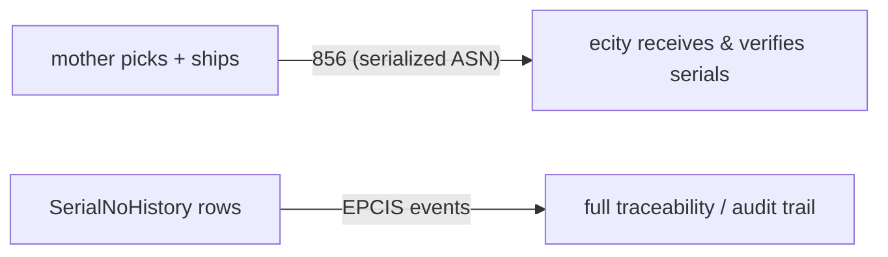

# 856 (Advanced Ship Notice) & EPCIS — What They Are and Why We Use Them

**Scope:** Internal Warehouse Stock Transfer feature (core-service)
**Status:** Implemented (P4)
**Date:** 2026-08-31

---

## 1. TL;DR

| Standard | What it is | Direction | Purpose in our transfer flow |
|---|---|---|---|
| **EDI 856** | Advanced Ship Notice (ASN) | Forward-looking ("what's coming") | Drives inbound receiving/verification |
| **EPCIS** | EPC Information Services (GS1) | Backward-looking ("where it's been") | Serial chain-of-custody / traceability |

> In short: **856 tells the receiver what's on the way; EPCIS records where every unit has been.**

---

## 2. EDI 856 — Advanced Ship Notice (ASN)

### What it is
EDI X12 transaction set **856** (the EDIFACT equivalent is **DESADV**). It is the
electronic "this shipment is on its way" message a **sender** gives a **receiver**
before or at dispatch.

### What it contains
- Who is shipping (`ship_from`) and receiving (`ship_to`)
- Each line's **SKU / GTIN**, **quantity**, **UOM**
- For serialized goods, the **unit-level serial numbers** per line
- Packaging: **SSCC** (Serial Shipping Container Code) per logistics unit
- Dates (ship date, expected delivery date)

### Our export shape
`GET /api/v1/asn-orders/{id}/asn-856` returns:

```json
{
  "transaction_set": "856",
  "asn_number": "ASN-000123",
  "asn_type": "internal_transfer",
  "ship_from": "Mother Warehouse",
  "ship_to": "ECity Warehouse",
  "order_date": "2026-08-31T...",
  "delivery_date": "2026-09-01T...",
  "sscc": "00500000...",
  "items": [
    {
      "sku": "SKU-1001",
      "gtin": "8901234567890",
      "description": "Prestige Royale Plus GT 04",
      "quantity": 8,
      "uom": "PC",
      "serial_numbers": ["SN-001", "SN-002", "..."]
    }
  ]
}
```

### Purpose / use
- The receiving warehouse knows **exactly what to expect** (SKU, qty, and *which
  serials*), enabling **receiving by exception** — scan each unit and verify
  against the ASN instead of manual data entry.
- It is the auditable hand-off between "mother picked" and "ecity received".

---

## 3. EPCIS — EPC Information Services

### What it is
A **GS1 standard** for recording and sharing *visibility events* about physical
objects across a supply chain. Each object is identified by an **EPC**
(Electronic Product Code); for unit-level tracking that is a **SGTIN**
(serialized GTIN), rendered as:

```
urn:epc:id:sgtin:<serial>
```

### EPCIS 2.0 event types

| Event | Meaning |
|---|---|
| `ObjectEvent` | something happened to an object at a time/place (scan, ship) |
| `AggregationEvent` | items packed into/onto a container (SSCC) |
| `TransformationEvent` | inputs transformed into outputs (manufacturing) |
| `TransactionEvent` | a business transaction (transfer of ownership) |

Each event carries context:

| Field | Meaning |
|---|---|
| `bizStep` | business process step (`picking`, `shipping`, `receiving`, `storing`) |
| `disposition` | object state (`in_transit`, `sellable_available`, `inactive`) |
| `action` | `ADD` / `OBSERVE` / `DELETE` |
| `readPoint` | where the object was read/scanned |
| `bizLocation` | where the object is located |
| `eventTime` | when it happened |

### Our mapping (from `SerialNoHistory.transaction_type`)

| transaction_type | bizStep | disposition | action |
|---|---|---|---|
| `pick` | `picking` | `in_progress` | `ADD` |
| `transfer_out` | `shipping` | `in_transit` | `ADD` |
| `transfer_in` | `receiving` | `in_progress` | `ADD` |
| `putaway` | `storing` | `sellable_available` | `ADD` |
| `transfer_cancelled` | `shipping` | `inactive` | `DELETE` |

### Our export shape
`GET /api/v1/asn-orders/{id}/epcis` returns a simplified EPCIS 2.0 JSON stream:

```json
{
  "context": { "schema": "EPCIS 2.0 (simplified JSON)", "asn_number": "ASN-000123" },
  "events": [
    {
      "type": "ObjectEvent",
      "eventTime": "2026-08-31T10:00:00+00:00",
      "eventTimeZoneOffset": "+00:00",
      "epcList": ["urn:epc:id:sgtin:SN-001"],
      "action": "ADD",
      "bizStep": "shipping",
      "disposition": "in_transit",
      "readPoint": { "id": "mother-warehouse-uuid" },
      "bizLocation": { "id": "ecity-warehouse-uuid" },
      "bizTransactionList": [{ "type": "po", "bizTransaction": "asn-uuid" }]
    }
  ]
}
```

### Purpose / use
- **Chain of custody** — for every serial, answer: *where has this unit been,
  when, in what state?*
- Used for **traceability, audits, product recalls, and dispute resolution**
  across warehouses (and potentially external partners).

---

## 4. How they fit the transfer flow



| Step | Document produced | Consumed by |
|---|---|---|
| Confirm transfer | — | source pick list auto-created |
| Dispatch (mother) | `transfer_out` history | serials → ASN (`serial_nos`) |
| Inbound (ecity) | `transfer_in` history | per-serial verification |
| Export | **856** (ASN) + **EPCIS** (events) | WMS / ERP / auditors |

---

## 5. Implementation references

| Concern | File |
|---|---|
| SSCC + GS1 check digit | `core-service/app/services/gs1_service.py` |
| EPCIS event builder | `core-service/app/services/epcis_service.py` |
| 856 + EPCIS assembly | `core-service/app/services/asn_order_service.py` (`serialized_asn_856`, `epcis_events`) |
| Endpoints | `core-service/app/api/v1/endpoints/asn_orders.py` (`/asn-856`, `/epcis`) |
| Serial history model | `core-service/app/models/serial_no.py` (`SerialNoHistory`) |
| Frontend buttons | `apps/inventory/.../AsnOrderDialog.tsx` (Export 856 / Export EPCIS) |
