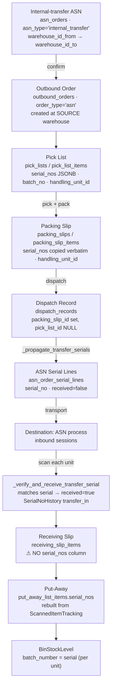

# Dispatch → Inbound Serial/QR Matching — Current State, Gap Analysis & Task Plan

**Status:** Analysis complete — implementation not started
**Date:** 2026-09-22
**Scope:** `core-service` (WMS) + frontend receiving/dispatch screens
**Code base:** branch `dev` @ `37c8d2aa`

Related docs (read these alongside):
`WMS_INTERNAL_STOCK_TRANSFER_DESIGN.md`,
`core-service/docs/WMS_CROSS_WAREHOUSE_SERIAL_TRACKING.md`,
`core-service/docs/WMS_PACKING_SLIP_OUTBOUND_FLOW.md`,
`core-service/docs/WMS_PACKING_SLIP_PARENT_CHILD_INHERITANCE.md`,
`ASN_RECEIVING_INTEGRATION_GUIDE.md`.

---

## 1. The requirement, restated

> When an internal stock transfer happens, the source warehouse dispatches goods
> via a **Dispatch Slip**. The dispatch slip references a **Packing Slip**, which
> references a **Pick List**, which carries the individual-item / master-carton
> detail. When the dispatch arrives at the destination and the **ASN process**
> starts, we must prove that **the item sent from the mother warehouse is the
> same item received at the destination**, by matching **serial number / QR code**.

So the ask is four things:

| # | Capability | Plain-language test |
|---|---|---|
| R1 | Unit-level identity survives the whole chain | "Serial `S8DN0001234` left mother and arrived at ecity" |
| R2 | Destination verifies each unit, not just a quantity | Scanning a unit either proves or disproves it was in this shipment |
| R3 | Both individual **and** master-carton granularity | "Scan the carton, verify its N units" without opening every box |
| R4 | Discrepancies are surfaced and owned | "These 3 serials were dispatched 5 days ago and never arrived" |

---

## 2. Headline conclusion

**Good news: ~70% of R1 and R2 is already built and working for serialized
internal transfers.** The `internal_transfer` ASN lane already carries unit
serials end-to-end and the destination already hard-stops on a wrong serial.

**The remaining 30% is where the risk lives**, and it is concentrated in five
places:

1. The unit identity is a **plain string**, never a database key → no referential
   integrity, silent mismatches possible.
2. Verification **silently downgrades to quantity-only** when serials were not
   captured at pick — and nothing tells the operator this happened.
3. **Master-carton receiving does not exist in the backend** — carton expansion
   is a frontend loop, so it is not atomic, not auditable, and cannot report
   "23 of 24 units in this carton".
4. The **receiving slip — the document of record — does not contain serials**.
   The proof lives in three side tables, so the artifact an auditor reads cannot
   show which units arrived.
5. **Nothing detects "dispatched but never received."** No reason code, no
   scheduled job, no exception view for missing units.

---

## 3. Current state — what exists and works

### 3.1 The real chain (and how it maps to your mental model)

**Mapping your terms to the codebase:**

| Your term | Industry term | Actual implementation |
|---|---|---|
| Internal stock transfer | Stock Transfer Order | `asn_orders` where `asn_type='internal_transfer'` |
| Dispatch Slip | Dispatch / Shipment | `dispatch_records` |
| Packing Slip | Packing list | `packing_slips` + `packing_slip_items` |
| Pick List | Pick task | `pick_lists` + `pick_list_items` |
| Pick list "individual / master carton detail" | SGTIN / SSCC | `serial_nos` (units) + QSeal parent (`qseal_tracks`) — **not** a persisted carton id |
| ASN process | Inbound receiving | `inbound_service`, `scan_sessions`, `receiving_slips` |

> **Important direction note:** the ASN is created **first** (by the destination /
> requesting warehouse) and *generates* the source outbound order
> (`asn_order_service._create_transfer_order`, `asn_order_service.py:592-750`).
> There is **no** path where an ASN is auto-created from a dispatch. If you were
> expecting "dispatch slip arrives → ASN is born", that is not the current model.

### 3.2 What already works (verified)

**a) Pick scan captures the unit serial.**
`PickListService.record_pick_scan` decodes the QR (`decode_qr_payload`), resolves
`ProductItem.serial_number == payload.id`, and appends the serial to
`pick_list_items.serial_nos` (`pick_list_service.py:899-991`). Deduplicated.

**b) Packing slip inherits serials verbatim.**
`packing_slip_items.serial_nos` (JSONB, `packing_slip.py:87`) is copied from the
pick line — never re-randomised. `packing_slip_items` also carries
`batch_no` (`:86`), `bin_location_id` (`:90`) and `handling_unit_id` (`:95`).

**c) Dispatch writes the "expected at destination" list.**
`OutboundService._propagate_transfer_serials` (`outbound_service.py:176-283`)
runs on dispatch from **both** dispatch paths and writes:

| Write | Effect |
|---|---|
| `asn_order_items.serial_nos` | merged picked serials on the ASN line |
| `asn_order_serial_lines` rows | one row per serial, `received = false` |
| `asn_order_items.shipped_qty` | quantity actually dispatched |
| `SerialNo.status = "in_transit"` | unit marked in transit |
| `SerialNoHistory(transfer_out)` | custody record `from_warehouse → to_warehouse` |
| `MATERIAL_TRANSFER` stock entry | accounting traceability (`linked_stock_entry_id`) |

It locks the ASN row (`with_for_update()`) and de-duplicates against existing
serial lines, so repeat dispatches are idempotent.

**d) Destination verifies each serial, with hard stops.**
`InboundService.record_scan` calls `_verify_and_receive_transfer_serial`
(`inbound_service.py:479`, implementation `:847-960`) whenever
`asn_order.asn_type == 'internal_transfer'`. For each scan it:

- matches the scanned serial against `asn_order_serial_lines.serial_no`;
- **unknown serial →** creates an inbound exception and raises `ValidationError`
  (scan hard-stopped, nothing auto-received);
- **already received →** rejects as a duplicate via an atomic
  `UPDATE ... WHERE received = false` (row-count check, so concurrent scans
  cannot both win);
- **match →** sets `received=true/received_at/received_by`, moves
  `SerialNo.warehouse_id` to the destination, sets `status='in_stock'`, and
  writes `SerialNoHistory(transfer_in)`.

This is genuine per-unit proof of receipt — exactly what R2 asks for.

**e) Master-carton hierarchy exists as data.**
At QR generation, `master_pack_enabled` / `master_pack_size` on the QR block
causes one `QSealTrack` parent per N units, with each unit linked via
`QSealParameters.parent_id` (`qr_product_service.py:1393-1470`). So "which carton
is this unit in?" is answerable — via
`QSealParameters.serial_number → parent_id → QSealTrack`
(a string join, not a FK).

**f) Serials survive into stock.**
`PutAwayService.complete_item` writes **one `BinStockLevel` row per serial** with
`batch_number = serial` (`put_away_service.py:1012-1046`), so the physical unit
is still identifiable after put-away.

**g) Useful APIs already exist**

| Method | Path | Gives you |
|---|---|---|
| `POST` | `/api/v1/asn-orders` | create the transfer ASN |
| `POST` | `/api/v1/asn-orders/{id}/confirm` | auto-create the source order/pick list |
| `GET` | `/api/v1/asn-orders/{id}/serials` | per-serial received / in-transit status |
| `GET` | `/api/v1/asn-orders/{id}/receiving-summary` | quantity-level expected vs received |
| `GET` | `/api/v1/asn-orders/{id}/asn-856` | EDI-856 serialized ASN export |
| `GET` | `/api/v1/asn-orders/{id}/epcis` | EPCIS event stream from `SerialNoHistory` |
| `POST` | `/api/v1/inbound/sessions` | start the destination receiving session |
| `POST` | `/api/v1/inbound/sessions/{id}/scan` | **one unit per call** |
| `POST` | `/api/v1/inbound/sessions/{id}/end` | generate the receiving slip |
| `POST` | `/api/v1/inbound/receiving-slips/{id}/approve` | book stock + sync ASN delivered qty |
| `GET` | `/api/v1/inbound/exceptions` | exception queue |

---

## 4. Gap analysis

Severity: 🔴 blocks the requirement · 🟠 degrades trust/auditability · 🟡 hygiene.

### 🔴 G1 — Unit identity is a string, never a database key

`serial_no` is compared as a plain string everywhere. There is **no**
`product_item_id` FK on `pick_list_items`, `packing_slip_items`,
`dispatch_records`, `asn_order_items` or `asn_order_serial_lines`.

Worse, **two independent identity spaces** represent the same physical unit:

| Space | Keyed on | Unique constraint |
|---|---|---|
| `product_items.serial_number` | `qr_products` / SKU — the printed QR | ✅ global unique, soft-delete aware (`product_item.py:86-94`) |
| `serial_nos.serial_no` | `items.id` — the WMS registry | ❌ **no DB constraint at all**; service-level check only (`serial_no_service.py:21-27`) |

*Impact:* no referential integrity; a typo or a re-used serial cannot be caught by
the database; the two registries can disagree; and `SerialNo` duplication is
possible under concurrency.

### 🔴 G2 — Verification silently downgrades to quantity-only

`_verify_and_receive_transfer_serial` returns immediately if
`asn_order_serial_lines` is empty (`inbound_service.py:869-872`). Serial lines are
empty whenever:

- the item was not flagged `has_serial_no` at pick (`pick_list_service.py:983`
  gates serial capture on this flag), **or**
- the pick was completed without scanning units, **or**
- the transfer was non-serialized by design.

In all three cases the destination gets **no signal** that this shipment is
unverifiable — it just quietly verifies by quantity. The existing
`WMS_CROSS_WAREHOUSE_SERIAL_TRACKING.md` already flags `has_serial_no` as
unreliable for QR-serialized items.

*Impact:* the operator believes unit-level verification happened when it did not.
This is the single most dangerous gap, because it is silent.

### 🔴 G3 — Master-carton receiving does not exist in the backend

`POST /inbound/sessions/{id}/scan` accepts a **single** `qr_data` string
(`inbound.py:177-215`). There is no endpoint that accepts one parent carton QR
and receives its N children.

Evidence that expansion is currently a **frontend loop**:
`inbound_service.remove_scan_items` is documented as *"Used when a worker
accidentally scans the wrong parent QR: the parent's child serials are removed"*
and takes `qr_identifiers: list[str]` (`inbound_service.py:1119-1155`) — the
client must be expanding the carton and POSTing the children one by one.
`QSealService.get_parent_with_linked_units` (`qseal_service.py:627`, exposed at
`qseal.py:701`) is a **lookup** endpoint, i.e. a helper the frontend calls.
The design doc confirms: expansion is *"not fully wired into inbound
auto-expansion yet"*.

*Impact:* R3 is only half-met. A carton scan is N independent API calls, so it
cannot be atomic, cannot report *"23 of 24 units matched — 1 missing"*, and
produces N separate audit events rather than one carton-level event. Partial
failure leaves the session in an inconsistent state.

### 🔴 G4 — Nothing detects "dispatched but never received"

- No inbound exception reason code for a missing unit. The seeded codes are
  `SHORT_PHYSICAL, DAMAGED, EXCESS, UNEXPECTED_KNOWN_SKU, UNKNOWN_IDENTITY, HOLD,
  QUARANTINE, QR_UNREADABLE, DUPLICATE_SERIAL` (`inbound_exception.py:24`,
  migrations `078_*` and `122_*`).
- `compute_asn_reconciliation` is **quantity/SKU-only** and does not look at
  serial lines (`asn_reconciliation.py:20`, aggregating via
  `asn_order_repository.py:177` which explicitly comments that it is SKU-keyed).
- Nothing runs on a schedule — the Celery app only registers
  `app.qr_block_tasks` (`celery_app.py:12`). All reconciliation is
  request-synchronous.
- `InboundShortBalanceService.refresh_for_asn` compares
  `asn_order_items.qty` vs `delivered_qty` — quantities, not serials
  (`inbound_short_balance_service.py:47`).

*Impact:* R4 unmet. A transfer that loses 3 units in transit looks identical to a
clean one until someone manually cross-references two screens.

### 🟠 G5 — The receiving slip does not record units

`receiving_slip_items` has `sku`, `batch_number`, `quantity`, `box_count`,
`packaging_unit_id`, `flag` — **no `serial_nos`** (`receiving_slip.py:76-133`).

Serials are re-derived later by querying `ScannedItemTracking` on
`(receiving_slip_id, item_id, batch_number)` (`put_away_service.py:795-809`,
`:1507-1541`) — which is why `put_away_list_items.serial_nos` exists
(`put_away_list.py:77`) even though the slip it came from does not.

*Impact:* the document of record cannot answer "which units arrived". That answer
requires joining `scan_session_items` + `scanned_item_tracking` +
`asn_order_serial_lines`. Audits, disputes and returns all become forensic work.

### 🟠 G6 — Wrong reason code on an unexpected serial

`_verify_and_receive_transfer_serial` records an unexpected serial as
`exception_type="serial_not_in_asn"` with `reason_code="EXCESS"`
(`inbound_service.py:880-893`) — reusing the *excess* code for what is
semantically an *unexpected/wrong* unit. Reporting and disposition rules keyed on
`EXCESS` will mis-bucket these.

### 🟠 G7 — No `WRONG_ITEM` concept inbound

There is no dedicated inbound reason code for "the right quantity, wrong item".
`("wrong_item")` exists only as an **outbound** pick-exception reason
(`core/pick_config.py:30`). The closest inbound coverage is indirect:
`UNEXPECTED_KNOWN_SKU` and `UNKNOWN_IDENTITY`.

### 🟠 G8 — Chain-of-custody history is optional

In `_propagate_transfer_serials`, the `SerialNo.status` update and the
`SerialNoHistory(transfer_out)` row are only written **if a matching `SerialNo`
row already exists** for `(org, item_id, serial_no)`
(`outbound_service.py:246-278`). The `AsnOrderSerialLine` row is written
regardless.

*Impact:* for a unit never registered in the `SerialNo` registry, the ASN still
says "expected", but there is **no custody ledger row** — so EPCIS export
(`epcis_service.py:74`, which reads only `SerialNoHistory`) silently omits it.

### 🟠 G9 — Serial match is not scoped to the ASN item

The lookup is `next((sl for sl in serial_lines if sl.serial_no == serial_no), None)`
(`inbound_service.py:874`) — `serial_no` only, never `and sl.item_id == item.id`.
A serial on the ASN belonging to line X can be claimed while scanning an item
that resolved to line Y.

### 🟠 G10 — Two disjoint dispatch paths

| Path | Sets | Entry point |
|---|---|---|
| Gate session | `pick_list_id`, `gate_session_id`; `packing_slip_id = NULL` | `POST /outbound/gate-sessions/{id}/verify` |
| Packing slip | `packing_slip_id`; `pick_list_id = NULL` | `POST /outbound/packing-slips/{id}/dispatch` |

A dispatch row is **never** linked to both. `_propagate_transfer_serials` does
run in both (`outbound_service.py:134` and `packing_slip_service.py:444`), so
serials are not lost — but the shape of the data differs by entry point, which
complicates any verification query and the frontend.

Related: `dispatch_records` has **no warehouse, destination, customer or
`is_internal` column**. The destination is only reachable by traversing
`dispatch → packing_slip|pick_list → reference → asn_orders.warehouse_id_to`
(2–3 hops). The `DispatchResponse` schema exposes no line items and no serials,
so a dispatch slip cannot be rendered with its contents in one API call.

### 🟠 G11 — Gate verification does not match serials

`GateVerificationService._validate_against_pick_list` compares
`pick_item.item_id == item.id` plus **summed** quantities — no serial or QR
identity match. It is gate-**out** only; there is no gate-in / arrival check.

### 🟠 G12 — Master-carton grouping is not persisted on shipment lines

There is no `packaging_unit_id`, no `carton_id` and no `is_master_carton` on any
outbound line. The parent/child structure is re-resolved at read time from QSeal
(`packing_slip_service.py:535`, `outbound.py:600`) — explicitly documented in
`WMS_PACKING_SLIP_PARENT_CHILD_INHERITANCE.md:77`.

*Impact:* "which carton did serial X ship in" is not queryable; carton-level
reporting is recomputed per request and can drift if QSeal data changes after
dispatch.

### 🟡 G13 — No test coverage for the transfer serial path

Zero tests for `AsnOrderSerialLine`, `transfer_in` / `transfer_out`, or
`InboundShortBalanceService`. Existing coverage is quantity/SKU-level
(`test_asn_reconciliation.py`) and gate-level
(`test_gate_verification_service.py`). The most safety-critical path in this
document is untested.

### 🟡 G14 — Vestigial columns

`asn_order_items.received_qty` (`asn_order.py:132`) is written by nothing in the
receiving flow — only `delivered_qty` is used. `ProductItem.is_unit` is defined
but never written anywhere. Both invite wrong assumptions.

---

## 5. Gap → requirement matrix

| Requirement | Supported today | Blocking gaps |
|---|---|---|
| **R1** Unit identity survives the chain | ✅ serialized transfers, both directions | G1, G8, G12 |
| **R2** Per-unit verify at destination | ✅ with hard stop on unknown / duplicate | **G2 (silent downgrade)**, G6, G9 |
| **R3** Master-carton granularity | 🟠 data exists, receiving is frontend-only | **G3**, G12 |
| **R4** Discrepancy detection & ownership | ❌ quantity-only | **G4**, G5, G7 |

---

## 6. Task list

Sequenced so each phase ships independently and leaves the system consistent.
Effort: S ≤ 1 day · M ≤ 3 days · L ≤ 1 week.

### Phase 0 — Stop the silent failures (do this first)

Nothing here needs a schema change to be useful, and it removes the
highest-severity risk.

| ID | Task | Effort | Files |
|---|---|---|---|
| **T0.1** | **Make downgrade visible.** Add `serialization_mode` (`serialized` \| `quantity_only`) to `asn_orders`, set at dispatch by `_propagate_transfer_serials` based on whether any serial lines were written. Return it on `GET /asn-orders/{id}` and in the receiving session payload so the UI can show a clear *"quantity-only verification"* banner. | S | `models/asn_order.py`, `services/outbound_service.py`, `api/v1/endpoints/asn_orders.py`, migration |
| **T0.2** | **Warn at dispatch when a serialized item ships without serials.** In `_propagate_transfer_serials`, if an item is QR-serialized (resolves via QSeal) but `line.serial_nos` is empty, log + raise a warning (configurable hard-fail). Closes the G2 root cause at the source. | S | `services/outbound_service.py`, `services/pick_list_service.py` |
| **T0.3** | **Fix the reason code.** Introduce `UNEXPECTED_SERIAL` (or reuse `UNEXPECTED_KNOWN_SKU` semantics) instead of `EXCESS` for `serial_not_in_asn`. Seed it as a tenant-configurable `InboundExceptionReason`. | S | `services/inbound_service.py:880-893`, migration, `services/inbound_exception_service.py` |
| **T0.4** | **Scope the serial lookup to the ASN item.** Change the match to `serial_no AND item_id`, and raise a distinct exception when the serial exists on the ASN under a different item (true "wrong item" case). | S | `services/inbound_service.py:874` |
| **T0.5** | **Add the missing DB uniqueness.** Unique index on `serial_nos (organization_id, item_id, serial_no)` (partial, `deleted_at IS NULL` if soft-delete applies). | S | `models/serial_no.py`, migration |
| **T0.6** | **Add a `MISSING_SERIAL` / `WRONG_ITEM` inbound reason code** so G4/G7 have somewhere to land. | S | migration, `services/inbound_exception_service.py` |

**Exit criteria:** an operator can never believe unit-level verification happened
when it did not; unexpected serials are classified correctly.

### Phase 1 — Make the receipt carry unit identity

| ID | Task | Effort | Files |
|---|---|---|---|
| **T1.1** | Persist `serial_nos` (JSONB) on `receiving_slip_items`, populated at slip generation from `ScannedItemTracking`. Keep the existing `(sku, batch_number)` grouping; serials ride along on the line. | M | `models/receiving_slip.py`, `services/inbound_service.py:_generate_receiving_slip` (~`:3020`), `services/put_away_service.py:_build_put_away_specs` (drop the re-derivation) |
| **T1.2** | Expose `serial_nos` + `received_serial_count` on the receiving-slip response schema and in the slip detail/print view. | S | `schemas/receiving_slip.py`, `services/inbound_service.py:_enrich_slip_with_qseal` |
| **T1.3** | Add nullable `product_item_id` FK to `pick_list_items`, `packing_slip_items`, `asn_order_serial_lines`, `scan_session_items`, `scanned_item_tracking`. Backfill by joining `serial_number`. Populate on every write path. | M | 5 models + `pick_list_service`, `packing_slip_service`, `outbound_service`, `inbound_service`, migration |
| **T1.4** | Stop leaving `qr_scan_events.product_item_id` NULL on warehouse scans — all three scanners already resolve the `ProductItem`. | S | `inbound_service.py:561`, `pick_list_service.py:1035`, `gate_verification_service.py:221` |

**Exit criteria:** the receiving slip, the ASN and the stock ledger all reference
the same `ProductItem` by key, not by string.

### Phase 2 — Carton-level verification & the verification surface

| ID | Task | Effort | Files |
|---|---|---|---|
| **T2.1** | **New endpoint** `GET /api/v1/asn-orders/{id}/transfer-verification` returning, per dispatched serial: `serial_no`, `item`, `carton` (QSeal parent), `status` ∈ `in_transit \| received \| missing \| unexpected`, `received_at`, `received_by`, plus rolled-up carton summaries (`expected 24 / received 23 / missing 1`) and a dispatch→receipt header (from/to warehouse, dispatched_at). | M | `api/v1/endpoints/asn_orders.py`, new `services/transfer_verification_service.py` |
| **T2.2** | **Bulk carton receive:** `POST /api/v1/inbound/sessions/{id}/scan-carton` — accepts one parent QR, expands children **server-side** via `QSealService.get_parent_with_linked_units`, and verifies+receives all N in one transaction. All-or-nothing with a per-serial result payload; any unknown serial → exception + no partial commit (or an explicit `allow_partial` flag). | L | `api/v1/endpoints/inbound.py`, `services/inbound_service.py`, `services/qseal_service.py`, `schemas/inbound.py` |
| **T2.3** | Emit **one** audit event per carton scan (a `qr_scan_events` row with `scan_context="inbound"`, `extra_data.expanded_serials=[...]`) instead of N unrelated events. | S | `services/inbound_service.py`, `services/scan_event_service.py` |
| **T2.4** | Carton reconciliation response: *"Carton `MP-xxxx`: 24 expected, 23 matched, 1 missing (`S8DN0009999`)"*, and wire it to the `MISSING_SERIAL` exception from T0.6. | M | `services/inbound_service.py`, `services/inbound_exception_service.py` |
| **T2.5** | Frontend: replace the client-side carton loop with the T2.2 call; show carton summary before the worker commits. | M | frontend receiving screen |

**Exit criteria:** R3 met — one scan verifies a full carton, atomically, with a
definitive match report.

### Phase 3 — Integrity, alerting, tests

| ID | Task | Effort | Files |
|---|---|---|---|
| **T3.1** | **Scheduled reconciliation.** Celery beat task: for ASNs `confirmed`+ with `shipped_qty > 0` and unreceived serials older than N days (configurable), raise a `MISSING_SERIAL` exception and notify. | M | `app/tasks/`, `celery_app.py`, `services/notification_service.py` |
| **T3.2** | Extend `compute_asn_reconciliation` with a **serial-aware** section: `expected_serials / received_serials / missing_serials / unexpected_serials`, keeping the existing quantity output for compatibility. | M | `services/asn_reconciliation.py`, `tests/test_asn_reconciliation.py` |
| **T3.3** | Gate ASN closure: block transition to `closed` while unreceived serial lines exist unless they are explicitly short-closed with approval. | M | `services/asn_order_service.py`, `services/inbound_short_balance_service.py` |
| **T3.4** | **Tests** (currently zero for this path): transfer serial happy path; unknown serial hard stop; duplicate serial rejection; partial carton; missing serial → short balance; quantity-only downgrade path; `UNEXPECTED_SERIAL` classification. | M | `tests/test_inbound_service.py`, `tests/test_outbound_service.py`, new `tests/test_transfer_serial_verification.py` |
| **T3.5** | Typed FKs from `qr_scan_events` to the documents — add nullable `dispatch_record_id`, `asn_order_id`, `scan_session_id` columns instead of `extra_data` strings (keep `extra_data` for back-compat). | M | `models/qr_scan_event.py`, `services/scan_event_service.py`, all three scanners, migration |
| **T3.6** | Consolidate the two dispatch paths behind one verification query shape (or migrate fully to the packing-slip path and deprecate the gate path for transfers). | L | `services/outbound_service.py`, `services/packing_slip_service.py`, `services/gate_verification_service.py` |

**Exit criteria:** R4 met — missing units are detected automatically, owned via
the exception queue, and the path is regression-tested.

### Phase 4 — Optional standards hardening

| ID | Task | Effort |
|---|---|---|
| **T4.1** | Real SSCC on master-carton labels (`gs1_service.generate_sscc` exists at `gs1_service.py:32-72` but is unwired) + a `T2` UOM SSCC column on the carton. | M |
| **T4.2** | EPCIS `AggregationEvent` per carton packing/dispatch, plus `ObjectEvent` completeness for transfers (today only `SerialNoHistory` → `ObjectEvent`). | M |
| **T4.3** | Merge the `SerialNo` and `ProductItem.serial_number` identity spaces, or define a strict one-way sync with a reconciliation report. | L |
| **T4.4** | Extend `serialized_asn_856` with carton/SSCC hierarchy for downstream EDI consumers. | M |

---

## 7. Decisions needed

1. **Should quantity-only transfers be allowed to complete the ASN?** i.e. is
   "no serials captured" a warning (ship anyway, flag it) or a hard block at
   dispatch? This determines whether T0.1 is a flag or a gate.
2. **Carton scan semantics on partial match** — reject the whole carton and
   require supervisor disposition, or receive the matching units and open one
   `MISSING_SERIAL` exception for the rest? (Recommend: receive matches, open one
   exception, keep the carton as a unit of work.)
3. **Carton identity** — do we persist a carton id on shipment lines (T2.1 +
   Phase 1) or keep resolving from QSeal at read time? Persisting is the only way
   to make a carton immutable history.
4. **Which dispatch path is canonical for transfers** — packing-slip (T3.6), or
   keep both and normalise at the query layer?
5. **Missing-serial ageing threshold** for T3.1 (suggest 24h for same-region,
   72h otherwise) and who receives the notification.

---

## 8. Suggested first slice

If you want a single demonstrable increment rather than a phase, do:

**T0.1 + T0.2 + T0.3 + T0.4 + T2.1**

That is: make the silent downgrade visible, fix the reason-code
mis-classification and the unscoped serial match, and ship the
`transfer-verification` endpoint so you can put a screen in front of it showing
*"47 dispatched · 47 received · 0 missing"* or the exact list of units that did
not arrive. All small, all low-risk, no behaviour change for healthy transfers —
and it turns an invisible risk into a visible one.
