# Dispatch Slip → Inbound Serial/QR Match — High-Level Design

**Status:** Design proposal — implementation not started
**Date:** 2026-09-23
**Scope:** `core-service` (WMS) + frontend receiving/dispatch screens
**Code base:** branch `dev` @ `37c8d2aa`

Companion to the gap analysis in `WMS_DISPATCH_RECEIPT_SERIAL_MATCH.md`. This
document is the **design**; the gap analysis is the **evidence**. Task IDs
(`T0.1`…`T4.4`) referenced here come from that analysis.

Related docs:
`WMS_INTERNAL_STOCK_TRANSFER_DESIGN.md`,
`core-service/docs/WMS_CROSS_WAREHOUSE_SERIAL_TRACKING.md`,
`core-service/docs/WMS_PACKING_SLIP_OUTBOUND_FLOW.md`,
`core-service/docs/WMS_PACKING_SLIP_PARENT_CHILD_INHERITANCE.md`,
`ASN_RECEIVING_INTEGRATION_GUIDE.md`.

---

## 1. Design goals

Four requirements, each with a crisp success test:

| # | Requirement | Success test |
|---|---|---|
| R1 | Unit identity survives the whole chain | "Serial `S8DN0001234` left mother, arrived ecity" |
| R2 | Per-unit verification at destination | A scan proves or disproves the unit was in this shipment |
| R3 | Individual **and** master-carton granularity | "Scan the carton, verify its N units" atomically |
| R4 | Discrepancies surfaced and owned | "These 3 serials never arrived — here's the exception" |

~70% of R1/R2 already works for serialized internal transfers. This design
preserves that working chain and hardens the five weak joints the analysis found
(string identity, silent downgrade, frontend-only carton expansion, no serials on
the receipt, no missing-unit detection).

---

## 2. Architecture overview

The chain is already wired end-to-end; the design keeps it and strengthens the
weak links (bold = new/changed behaviour).

```mermaid
flowchart LR
    ASN["Transfer ASN<br/>(source→dest)"] -->|confirm| OO["Outbound Order"]
    OO --> PL["Pick List<br/>serial_nos captured"]
    PL -->|pack| PS["Packing Slip<br/>serials copied"]
    PS -->|dispatch| E["Dispatch<br/>_propagate_transfer_serials"]
    E --> SL["ASN Serial Lines<br/>serial_no · received=false"]
    SL -->|transport| IN["Inbound Session<br/>scan each unit"]
    IN --> RS["Receiving Slip<br/>(serial_nos persisted)"]
    RS --> PA["Put-Away"]
    PA --> BIN["BinStockLevel<br/>batch=serial"]
```



**Mapping user terms → codebase:**

| User term | Industry term | Implementation |
|---|---|---|
| Internal stock transfer | Stock Transfer Order | `asn_orders` where `asn_type='internal_transfer'` |
| Dispatch Slip | Dispatch / Shipment | `dispatch_records` |
| Packing Slip | Packing list | `packing_slips` + `packing_slip_items` |
| Pick List | Pick task | `pick_lists` + `pick_list_items` |
| Individual / master-carton detail | SGTIN / SSCC | `serial_nos` (units) + QSeal parent (`qseal_tracks`) |
| ASN process | Inbound receiving | `inbound_service`, `scan_sessions`, `receiving_slips` |

> Direction note: the ASN is created **first** (by the requesting warehouse) and
> *generates* the source outbound order. There is no "dispatch arrives → ASN is
> born" path. The dispatch **writes the expected-at-destination list**.

---

## 3. Core design decisions

These five drive everything else and must be resolved first. Recommendation shown
for each.

| # | Decision | Recommendation |
|---|---|---|
| D1 | Quantity-only transfer → flag or gate? | **Flag, not gate.** Dispatch succeeds; the ASN carries `serialization_mode = serialized \| quantity_only` (T0.1) and a dispatch warning when a QR-serialized item ships with no serials (T0.2). Hard-block optional via config. |
| D2 | Carton partial-match semantics | **Receive matches, open one exception.** Receive the matching units, open a single `MISSING_SERIAL` exception for the rest, keep the carton as a unit of work (atomicity preserved). |
| D3 | Carton identity — persist or resolve at read? | **Persist.** Add nullable `product_item_id` FK + carton reference on shipment lines (T1.3) so a carton's history is immutable, instead of re-resolving QSeal at read time. |
| D4 | Canonical dispatch path for transfers | **Packing-slip path.** Keep the gate path for outbound gates, but make packing-slip the single verification shape for transfers (T3.6). |
| D5 | Missing-serial ageing threshold + notify target | **24h same-region / 72h otherwise**, notification target configurable (T3.1). |

---

## 4. Key design themes

### A. Make unit identity a real key, not a string

Today `serial_no` is compared as a plain string everywhere, and two independent
identity spaces represent the same physical unit (`product_items.serial_number`
vs `serial_nos.serial_no`). The design:

- Adds a **unique partial index** on `serial_nos (organization_id, item_id, serial_no)`
  (T0.5).
- Adds **nullable `product_item_id` FKs** on `pick_list_items`,
  `packing_slip_items`, `asn_order_serial_lines`, `scan_session_items`,
  `scanned_item_tracking`, backfilled by joining `serial_number` (T1.3).
- Fixes the two identity spaces by converging on a single reference — full merge
  is Phase 4 (T4.3), but the FKs make cross-space joins tractable now.

### B. Never lie about verification

The most dangerous gap is **silent downgrade**: when no serials were captured at
pick, the destination quietly verifies by quantity with no signal to the operator.

- `serialization_mode` on the ASN, returned in the session payload so the UI can
  show a **"quantity-only verification"** banner (T0.1).
- Scope serial matching to **`serial_no AND item_id`** (T0.4) so a serial on ASN
  line X cannot be claimed while scanning an item that resolved to line Y.

### C. Carton receiving becomes an atomic backend operation

Master-carton receiving does not exist server-side; today the frontend expands a
parent QR into N `POST /scan` calls.

- New `POST /inbound/sessions/{id}/scan-carton` expands the parent QR
  **server-side** via `QSealService.get_parent_with_linked_units` and verifies all
  N children in one transaction (T2.2). All-or-nothing (or explicit
  `allow_partial`), with a per-serial result payload.
- One audit event per carton scan (`extra_data.expanded_serials=[...]`) instead of
  N unrelated events (T2.3).

### D. The receiving slip becomes the document of record

`receiving_slip_items` has no `serial_nos` today; serials are re-derived later by
joining three side tables.

- Persist `serial_nos` (JSONB) on `receiving_slip_items` at slip generation
  (T1.1); expose `received_serial_count` (T1.2). This removes the forensic join.

### E. Discrepancy detection is automated and owned

Nothing detects "dispatched but never received."

- New reason codes: `UNEXPECTED_SERIAL` (T0.3), `MISSING_SERIAL` / `WRONG_ITEM`
  (T0.6).
- **Scheduled Celery beat reconciliation**: dispatched-but-unreceived serials
  older than N days raise a `MISSING_SERIAL` exception and notify (T3.1).
- **Serial-aware reconciliation** in `compute_asn_reconciliation`:
  `expected / received / missing / unexpected` serials, keeping the existing
  quantity output (T3.2).
- **Gate ASN closure** while unreceived serial lines exist unless explicitly
  short-closed with approval (T3.3).

---

## 5. Verification surface (the new API)

A single endpoint the frontend can render the whole story from:

```
GET /api/v1/asn-orders/{id}/transfer-verification
```

Returns, per dispatched serial:
`serial_no`, `item`, `carton` (QSeal parent), `status ∈ {in_transit, received,
missing, unexpected}`, `received_at`, `received_by`, plus rolled-up carton
summaries (*"24 expected / 23 received / 1 missing"*) and a dispatch→receipt
header (from/to warehouse, dispatched_at).

This is what turns an invisible risk into a visible screen:
*"47 dispatched · 47 received · 0 missing."*

---

## 6. Implementation phases

Sequenced so each phase ships independently and leaves the system consistent.
Effort: S ≤ 1 day · M ≤ 3 days · L ≤ 1 week. Task IDs map to the gap analysis.

| Phase | Theme | Key tasks | Effort |
|---|---|---|---|
| **0** | Stop silent failures | T0.1 mode flag · T0.2 dispatch warning · T0.3 `UNEXPECTED_SERIAL` · T0.4 scoped match · T0.5 DB uniqueness · T0.6 `MISSING_SERIAL`/`WRONG_ITEM` codes | S each |
| **1** | Receipt carries unit identity | T1.1 serials on slip · T1.2 response schema · T1.3 `product_item_id` FKs · T1.4 no NULL `qr_scan_events.product_item_id` | S–M |
| **2** | Carton verification | T2.1 verification endpoint · T2.2 server-side carton expand · T2.3 single audit event · T2.4 carton reconciliation · T2.5 frontend | M–L |
| **3** | Integrity, alerting, tests | T3.1 scheduled reconciliation · T3.2 serial-aware reconciliation · T3.3 closure gate · T3.4 tests · T3.5 typed FKs · T3.6 path consolidation | M–L |
| **4** | Standards hardening (optional) | T4.1 SSCC · T4.2 EPCIS AggregationEvent · T4.3 identity-space merge · T4.4 EDI-856 carton hierarchy | M–L |

**Phase 0 exit criteria:** an operator can never believe unit-level verification
happened when it did not; unexpected serials are classified correctly.
**Phase 2 exit criteria:** R3 met — one scan verifies a full carton, atomically,
with a definitive match report.
**Phase 3 exit criteria:** R4 met — missing units are detected automatically,
owned via the exception queue, and the path is regression-tested.

---

## 7. Recommended first slice

**T0.1 + T0.2 + T0.3 + T0.4 + T2.1**

Make the downgrade visible, fix the reason-code mis-classification and the
unscoped serial match, and ship the `transfer-verification` endpoint. All small,
all low-risk, no behaviour change for healthy transfers — and it surfaces the
missing-unit problem on day one.

---

## 8. Open questions

1. Confirm D1 — is "no serials captured" a warning (ship anyway, flag it) or a
   hard block at dispatch?
2. Confirm D2 — carton partial match: receive matches + one exception, or reject
   the whole carton?
3. Confirm D3 — persist a carton id on shipment lines, or keep resolving from
   QSeal at read time?
4. Confirm D4 — packing-slip as the canonical transfer dispatch path?
5. Confirm D5 — missing-serial ageing threshold (suggest 24h/72h) and who
   receives the notification.

---

## 9. Detailed task list

Full task breakdown from the gap analysis (`WMS_DISPATCH_RECEIPT_SERIAL_MATCH.md`).
Effort: S ≤ 1 day · M ≤ 3 days · L ≤ 1 week.

### Phase 0 — Stop the silent failures (do this first)

| ID | Task | Effort | Status |
|---|---|---|---|
| **T0.1** | Add `serialization_mode` (`serialized` \| `quantity_only`) to `asn_orders`, set at dispatch, return on `GET /asn-orders/{id}` and in the receiving session payload | S | ✅ |
| **T0.2** | Warn at dispatch when a serialized item ships without captured serials | S | ✅ |
| **T0.3** | `UNEXPECTED_SERIAL` reason code for `serial_not_in_asn` (was `EXCESS`) | S | ✅ |
| **T0.4** | Scope serial lookup to `serial_no AND item_id`; distinct wrong-item branch | S | ✅ |
| **T0.5** | Unique index on `serial_nos (organization_id, item_id, serial_no)` | S | ✅ |
| **T0.6** | `MISSING_SERIAL` / `WRONG_ITEM` inbound reason codes | S | ✅ |

### Phase 1 — Make the receipt carry unit identity

| ID | Task | Effort | Status |
|---|---|---|---|
| **T1.1** | Persist `serial_nos` (JSONB) on `receiving_slip_items` at slip generation | M | ✅ |
| **T1.2** | Expose `serial_nos` + `received_serial_count` on slip response/print | S | ✅ |
| **T1.3** | Nullable `product_item_id` FK on 5 line tables, backfilled | M | ✅ |
| **T1.4** | Stop leaving `qr_scan_events.product_item_id` NULL on warehouse scans | S | ✅ |

### Phase 2 — Carton-level verification

| ID | Task | Effort | Status |
|---|---|---|---|
| **T2.1** | `GET /asn-orders/{id}/transfer-verification` endpoint | M | ✅ |
| **T2.2** | `POST /inbound/sessions/{id}/scan-carton` server-side expansion | L | ✅ |
| **T2.3** | One audit event per carton scan | S | ✅ |
| **T2.4** | Carton reconciliation response wired to `MISSING_SERIAL` | M | ✅ |
| **T2.5** | Frontend: replace client-side carton loop | M | ⬜ (frontend repo) |

### Phase 3 — Integrity, alerting, tests

| ID | Task | Effort | Status |
|---|---|---|---|
| **T3.1** | Scheduled Celery beat reconciliation for missing serials | M | ✅ |
| **T3.2** | Serial-aware `compute_asn_reconciliation` | M | ✅ |
| **T3.3** | Gate ASN closure on unreceived serial lines | M | ✅ |
| **T3.4** | Tests for the transfer serial path | M | ✅ |
| **T3.5** | Typed FKs from `qr_scan_events` to documents | M | ✅ |
| **T3.6** | Consolidate the two dispatch paths | L | ⬜ (deferred) |

### Phase 4 — Optional standards hardening

| ID | Task | Effort | Status |
|---|---|---|---|
| **T4.1** | Real SSCC on master-carton labels | M | ⬜ |
| **T4.2** | EPCIS `AggregationEvent` per carton | M | ⬜ |
| **T4.3** | Merge `SerialNo` / `ProductItem.serial_number` identity spaces | L | ⬜ |
| **T4.4** | EDI-856 carton/SSCC hierarchy | M | ⬜ |

Legend: ✅ done · ⬜ not started
