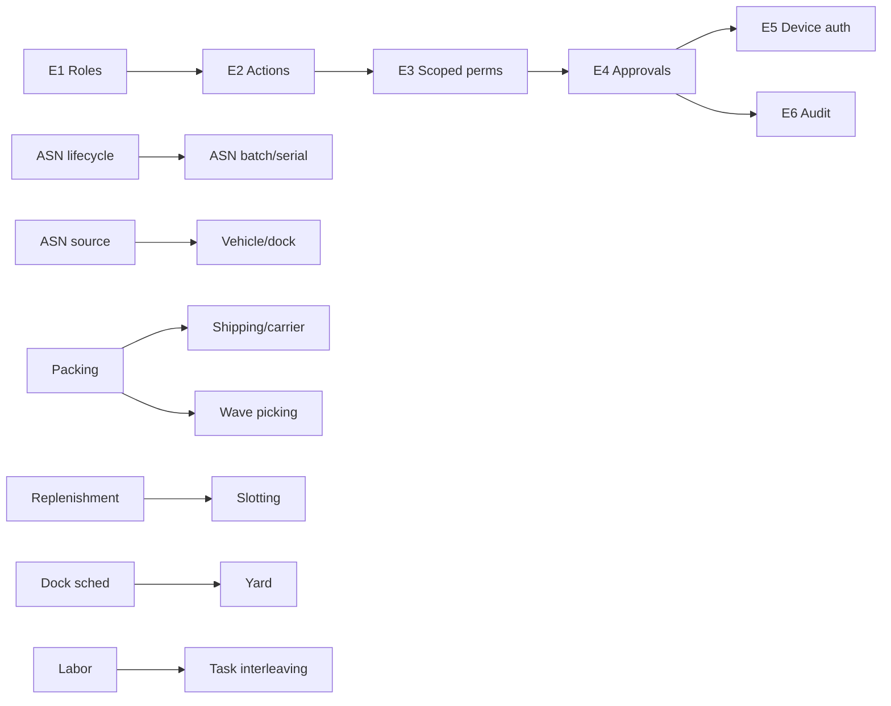

# WMS Gap Analysis & Phase-wise Implementation Roadmap

> **Status:** Analysis / planning document (no code changes yet).
> **Date:** 2026-08-21
> **Scope:** Full Warehouse Management System across `core-service` (backend), `horizon-sync` (web admin/inventory app), and `bwmobile` (React Native scanner app).
> **Related:** This document **consolidates and extends** `WMS_ASN_RBAC_GAP_ANALYSIS.md` (ASN + RBAC only). It adds Inventory, Outbound, Warehouse Operations, and Integration gaps.

---

## 1. Executive Summary

The codebase is a mature WMS/ERP. The **inbound → put-away → pick → gate/dispatch** core loop is implemented end-to-end (web + mobile). The largest gaps versus a standard WMS are on the **outbound/packing/shipping** side, **storage optimization** (slotting, replenishment), **warehouse operations** (dock scheduling, labor management), and **governance** (WMS roles, approvals, warehouse-scoped permissions).

The roadmap below breaks the work into five phases, ordered by business value and risk, so each phase can ship independently.

---

## 2. Methodology & Sources

Findings are derived from:

- Backend routers/endpoints: `core-service/app/api/v1/endpoints/` (inbound, outbound, put_away, pick_lists, smart_picking, asn_orders, stock_*, qseal, wms_workers, wms_devices, worker_tasks, floor_plans, wms_3d, etc.)
- Web WMS UI: `horizon-sync/apps/inventory/src/app/components/wms/`
- Mobile app: `bwmobile/src/screens/`, `bwmobile/src/api/`
- Existing docs: `WMS_ASN_RBAC_GAP_ANALYSIS.md`, `ASN_RECEIVING_INTEGRATION_GUIDE.md`, `MOBILE_APP_API_REFERENCE.md`, `MOBILE_APP_INBOUND_GUIDE.md`, `DUAL_AXIS_RECEIVING_PUTAWAY_DESIGN.md`

---

## 3. Feature Inventory (what exists today)

### 3.1 Web + Backend

| Area | Implemented |
|---|---|
| Warehouse master | Multi-warehouse, zones/aisles/levels/bins, floor plans, 3D view, capacity |
| ASN | CRUD + status lifecycle, auto numbering, receiving-summary (mismatch) view |
| Receiving | Scan sessions, dock field, receiving slips, ASN linking, short/damaged/rejected flags, floating items (reject/resolve), approve, auto put-away |
| Put-away | Put-away lists, put-away rules + location allocation, direct put-away, bin confirm, skip, complete |
| Picking | Pick lists (invoice/order import), FIFO/FEFO bin resolution + route optimization, bin-aware pick scan, complete/cancel, worker assignment |
| Gate & Dispatch | Gate verification sessions, dispatch records, delivery notes |
| Inventory | Items/groups, stock levels, bin stock, stock movements, serials, batches, stock entries, reconciliations (cycle count), UOM/packaging units |
| Quality | Quality inspection templates + readings |
| Aggregation | QSeal parent-child hierarchy, QR codes, cascade |
| Workers/Devices | WMS workers, barcode/QR login, devices, internal warehouse users, worker tasks |
| Analytics | WMS dashboard, scan analytics/events |

### 3.2 Mobile App (`bwmobile`)

| Area | Implemented |
|---|---|
| Login | Username/password + QR/barcode worker login |
| Dashboard | Home overview |
| Receiving | Start session (dock + ASN), scan QSeal parent → linked units, review + reject, end session → slip |
| Receiving slips | List + detail |
| Put-away | Put-away lists, direct put-away (bin scan), bin assignment |
| Picking | Bin-aware pick scanning |
| QSeal | Cascade mapping |

---

## 4. Gap Register

> Priority: **P0** = must have (blocks go-live), **P1** = high value, **P2** = important, **P3** = nice-to-have.
> Effort: **S** (1–3 days), **M** (1–2 weeks), **L** (2–4+ weeks).

### A. Inbound & ASN

| ID | Gap | Current state | Priority | Effort | Phase |
|---|---|---|---|---|---|
| A1 | ASN status lifecycle: Created → In Transit → Arrived → Partially/Fully Received → Closed | Draft/Confirmed/Partially_Delivered/Delivered/Closed/Cancelled | P1 | S | 0 |
| A2 | ASN line batch/serial fields | Only `extra_data` JSON | P1 | S | 1 |
| A3 | ASN source: vendor / plant / warehouse + supplier FK | Only `warehouse_id_from/to` | P1 | M | 1 |
| A4 | Vehicle entity (shared across ASNs) + dock/labor allocation | Vehicle only inside gate session; dock is free text | P2 | M | 1 |
| A5 | ASN inbox / EDI import | Manual creation only | P2 | L | 3 |
| A6 | Receiving discrepancy codes: Excess, Missing, Forwarding | Only OK/Short/Damaged/Rejected | P1 | S | 1 |
| A7 | Auto Goods Receipt on slip approval | PurchaseReceipt exists, not auto-created | P1 | S | 1 |
| A8 | Expected inbound dashboard | Missing | P2 | M | 2 |

### B. Inventory & Storage

| ID | Gap | Current state | Priority | Effort | Phase |
|---|---|---|---|---|---|
| B1 | Slotting optimization (auto bin assignment) | Put-away rules + location allocation only | P2 | L | 2 |
| B2 | Replenishment (min/max + auto replenish tasks) | Missing | P1 | M | 2 |
| B3 | LPN / handling-unit lifecycle | QSeal hierarchy is a partial analog | P2 | L | 2 |
| B4 | Zone/area assignment + warehouse-scoped stock visibility | Warehouse-level scoping only | P2 | M | 2 |

### C. Outbound (Picking → Packing → Shipping)

| ID | Gap | Current state | Priority | Effort | Phase |
|---|---|---|---|---|---|
| C1 | Packing station (box, weight, packing list, pack slips) | Missing | P0 | M | 1 |
| C2 | Shipping labels + carrier integration + manifest | Missing | P0 | L | 1 |
| C3 | Wave / batch / zone picking | Single order pick only | P2 | L | 2 |
| C4 | Returns / reverse logistics (RMA) | Missing | P2 | L | 2 |
| C5 | Cross-docking | Missing | P3 | L | 3 |
| C6 | Kitting / assembly | Missing | P3 | L | 3 |

### D. Warehouse Operations

| ID | Gap | Current state | Priority | Effort | Phase |
|---|---|---|---|---|---|
| D1 | Dock scheduling / appointments | Free-text dock only | P2 | M | 2 |
| D2 | Yard management | Missing | P3 | L | 3 |
| D3 | Labor management / productivity metrics | `worker_tasks` exist, no productivity | P2 | M | 2 |
| D4 | Task interleaving (multi-task worker queues) | Single-task workflows | P3 | M | 3 |

### E. Governance (RBAC, Approvals, Audit)

| ID | Gap | Current state | Priority | Effort | Phase |
|---|---|---|---|---|---|
| E1 | Predefined WMS roles + permission bundles | Only sys_admin/org_admin/user/owner + `warehouse_work_user` | P0 | S | 0 |
| E2 | Permission actions: Approve / Cancel / Reopen / Override | Only create/read/update/delete/manage/execute/invite | P0 | S | 0 |
| E3 | Warehouse/zone-scoped permission enforcement | `has_permission` is global | P1 | M | 1 |
| E4 | Approval / maker-checker + warehouse locks + emergency override | Missing | P1 | L | 1 |
| E5 | Device-based auth/whitelist + configurable session timeout | Device captured, not enforced | P2 | M | 2 |
| E6 | Immutable, complete audit trail | Partial coverage; immutability not enforced | P2 | M | 2 |

### F. Integrations & Platform

| ID | Gap | Current state | Priority | Effort | Phase |
|---|---|---|---|---|---|
| F1 | SSO / external IdP | Missing | P3 | L | 3 |
| F2 | Carrier / 3PL / e-commerce integration | Missing | P3 | L | 3 |
| F3 | EDI/API webhooks (inbound/outbound events) | Partial event hooks | P3 | M | 3 |
| F4 | Real-time messaging bus (Kafka/events) | Event hooks exist, no bus | P3 | L | 3 |

---

## 5. Phase-wise Implementation Plan

### Phase 0 — Governance & ASN quick wins (low risk, seed/config)

**Objective:** Land the highest-value, lowest-risk fixes without schema risk.

| ID | Deliverable | Dependencies |
|---|---|---|
| E1 | Seed 9 predefined WMS roles + permission bundles (Warehouse Admin, Inventory Controller, Inbound Operator, Picker, Packer, Dispatch Supervisor, Gate Security, Auditor, Viewer) | None |
| E2 | Add `APPROVE`, `CANCEL`, `REOPEN`, `OVERRIDE` action types + permission codes | None |
| A1 | Align ASN status lifecycle (add In-Transit, Arrived; keep old values as aliases) | Alembic enum migration |

**Exit criteria:** Roles visible in identity service; new permission codes enforceable; ASN lifecycle accepts new statuses without breaking existing data.

---

### Phase 1 — Core flow completion (inbound + outbound must-haves)

**Objective:** Close the functional gaps that block a full receiving → shipping loop.

| ID | Deliverable | Dependencies |
|---|---|---|
| A2 | ASN line `batch_no` + `serial_nos` columns | A1 |
| A3 | ASN source type + supplier FK | — |
| A6 | Discrepancy codes Excess/Missing/Forwarding + handling in `flag_line_item` | — |
| A7 | Auto Goods Receipt from approved slip | — |
| A4 | Vehicle entity + dock allocation | A3 |
| C1 | Packing station (box, weight, pack slip) | — |
| C2 | Shipping labels + carrier integration + manifest | C1 |
| E3 | Warehouse-scoped permission enforcement | E1, E2 |
| E4 | Approval / maker-checker + warehouse locks + override | E2, E3 |

**Exit criteria:** Receive against ASN → flag discrepancies → approve → auto GR → pick → pack → ship with label/manifest, all permission-scoped per warehouse.

---

### Phase 2 — Storage & operations optimization

**Objective:** Improve inventory accuracy and warehouse efficiency.

| ID | Deliverable | Dependencies |
|---|---|---|
| B2 | Replenishment (min/max + auto tasks) | — |
| B1 | Slotting optimization | B2 |
| B3 | LPN / handling-unit lifecycle | — |
| B4 | Zone/area assignment | E3 |
| C3 | Wave / batch / zone picking | C1 |
| C4 | Returns / RMA | — |
| A8 | Expected inbound dashboard | A1 |
| D1 | Dock scheduling / appointments | A4 |
| D3 | Labor management / productivity metrics | — |
| E5 | Device whitelist + session timeout policy | E4 |
| E6 | Audit hardening (immutable + full coverage) | E4 |

**Exit criteria:** Directed replenishment and slotting, wave picking, returns flow, and dock scheduling available; audit trail immutable.

---

### Phase 3 — Enterprise & integration

**Objective:** Add enterprise-grade integration and advanced flows.

| ID | Deliverable | Dependencies |
|---|---|---|
| C5 | Cross-docking | — |
| C6 | Kitting / assembly | — |
| D2 | Yard management | D1 |
| D4 | Task interleaving | D3 |
| A5 | ASN inbox / EDI import | A3 |
| F1 | SSO / external IdP | — |
| F2 | Carrier / 3PL / e-commerce integration | C2 |
| F3 | EDI/API webhooks | — |
| F4 | Real-time messaging bus | — |

**Exit criteria:** Cross-dock, kitting, yard, SSO, and external integrations available; events streamed to a bus.

---

## 6. Dependency & Effort Matrix

**Effort totals by phase:**

| Phase | Effort (approx.) | Risk |
|---|---|---|
| 0 | ~3–5 dev-days | Low |
| 1 | ~6–10 dev-weeks | Medium |
| 2 | ~6–10 dev-weeks | Medium |
| 3 | ~8–12 dev-weeks | High |

---

## 7. Mobile vs Web split (recommended)

| Capability | Web (supervisor) | Mobile (scanner/worker) |
|---|---|---|
| Receiving / flag / reject | Review, resolve floating items, approve | Scan, flag, reject during session |
| Put-away | Lists, rules, allocation config | Bin scan, direct put-away, assign |
| Picking | Pick list creation, wave planning, dashboards | Bin-aware pick scanning |
| Packing | Pack station, label print, manifest | Pack scan (box → items) |
| Dock / labor | Scheduling, productivity dashboards | Task acceptance, task queues |
| Governance | Roles, approvals, audit viewer | Device login, task execution |

---

## 8. Decision Log & Open Questions

1. **2026-08-21:** This roadmap created; consolidates and extends `WMS_ASN_RBAC_GAP_ANALYSIS.md`. **No code changes pending approval.**
2. **Open — Scope:** Is this a single-warehouse internal WMS or a multi-client/3PL platform? This changes whether Yard (D2), Cross-dock (C5), and 3PL integration (F2) are in or out of scope.
3. **Open — Priority:** Confirm whether Phase 1's outbound must-haves (C1 Packing, C2 Shipping) or the governance items (E3/E4) should ship first.
4. **Open — Carrier:** Which shipping carrier(s) need integration in C2 (e.g., FedEx/UPS/India Post/Shiprocket)?
5. **Open — Mobile parity:** Confirm which web features must also exist on mobile (e.g., packing on mobile vs desktop-only).

---

## 9. Key File References

- Inbound: `core-service/app/api/v1/endpoints/inbound.py`, `app/services/inbound_service.py`
- Outbound: `core-service/app/api/v1/endpoints/outbound.py`, `app/services/pick_list_service.py`
- Put-away: `core-service/app/api/v1/endpoints/put_away.py`, `app/services/put_away_service.py`
- ASN: `core-service/app/api/v1/endpoints/asn_orders.py`, `app/models/asn_order.py`
- RBAC: `identity-service/app/models/role.py`, `core-service/app/dependencies.py`, `core-service/app/core/authorization.py`
- Enums: `core-service/app/models/base.py` (`AsnOrderStatus`, `ActionType`), `core-service/app/models/warehouse_location.py` (`ReceivingSlipItemFlag`)
- Web WMS: `horizon-sync/apps/inventory/src/app/components/wms/`
- Mobile: `bwmobile/src/screens/`, `bwmobile/src/api/`
