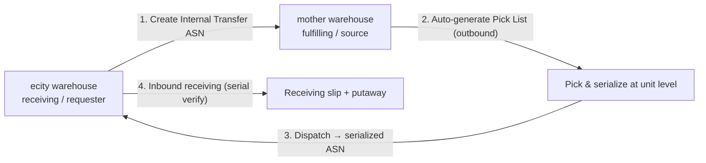
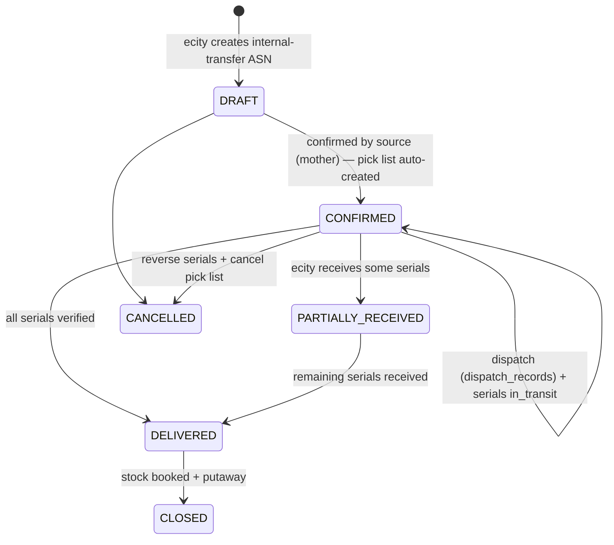
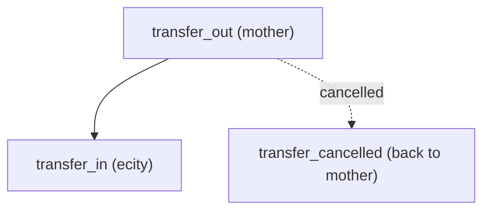

# Internal Warehouse Stock Transfer — Serialized ASN Design

**Status:** Implemented — P0, P1 and P2 are live; P3 (in-transit `stock_level` bucket) is still pending.
**Scope:** `core-service` (WMS) + minimal frontend (`horizon-sync/apps/inventory`)
**Date:** 2026-08-31

---

## 1. Purpose

Enable an **Inter-Warehouse Stock Transfer (IWT)** between two warehouses of the
same organization (e.g. **mother warehouse** → **ecity warehouse**), where:

1. The receiving warehouse creates an **internal transfer ASN**.
2. The source warehouse fulfils it as an **outbound pick list**.
3. Because the goods already passed through the source warehouse's outbound
   process, the ASN carries **SKU + serial number (unit-level)** information.
4. The receiving warehouse performs **inbound receiving against the ASN**,
   verifying serials unit-by-unit.

This serialized ASN becomes the single chain-of-custody record used downstream
(receiving verification, traceability, audits, returns, recall).

---

## 2. Roles and document flow



| Your term | Industry standard | Existing codebase |
|---|---|---|
| Internal stock transfer request | Stock Transfer Order (STO) / Transfer Order | `asn_orders` + `reference_type` |
| Picklist for mother warehouse | Outbound pick task | `pick_lists` / `pick_list_items` |
| Unit-level SKU+serial on ASN | Serialized ASN (GS1 SGTIN / EPCIS) | `serial_nos`, `SerialNoHistory`, `PickListItem.serial_nos` |
| Goods reaching ecity | Inbound receiving against ASN | `inbound_service`, `receiving_slip` |
| Stock move mother → ecity | Transfer-out / In-transit / Transfer-in | `stock_entry` (`MATERIAL_TRANSFER`), `stock_movement` (`transfer`) |

**Direction note:** "created from ecity for mother" means **ecity = receiving /
destination** and **mother = source / fulfilling** warehouse. The design is
symmetric and supports transfers in either direction.

---

## 3. Industry-standard framing

- **Transfer Order (TO/STO)** — internal demand document between two
  warehouses of one legal entity.
- **Pick list** — warehouse task to pick the requested stock.
- **Shipment / Dispatch** — physical goods leave the source warehouse.
- **ASN (Advanced Shipping Notice)** — electronic notification of what is in
  transit; serialized ASNs carry unit-level identifiers. EDI equivalent: **856**
  (X12) / **DESADV** (EDIFACT).
- **Receiving** — destination warehouse verifies and books stock against the ASN.

Serialized traceability standards (for later hardening):

- **GS1 SGTIN** — Serialized Global Trade Item Number (item + serial).
- **GS1 SSCC** — Serial Shipping Container Code (logistics unit / handling unit).
- **EPCIS 2.0 events** — `ObjectEvent`, `AggregationEvent`, `TransformationEvent`,
  `TransactionEvent` for chain of custody.

---

## 4. Current-state inventory (reuse, don't rebuild)

Already present in `core-service`:

- `app/models/asn_order.py` — `AsnOrder` has `warehouse_id_from` →
  `warehouse_id_to`, `reference_type/id/no`, status enum
  `draft/confirmed/partially_delivered/delivered/closed/cancelled`.
- `app/models/pick_list.py` — `PickList` has `reference_type` + `reference_id`
  (can point at the ASN); `PickListItem` has `serial_nos` (JSONB), `batch_no`,
  `bin_location_id`, `handling_unit_id`.
- `app/api/v1/endpoints/outbound.py` — `_resolve_pick_serials()` resolves
  per-unit serials and enriches Mfg/Exp from `QSealParameters`.
- `app/models/serial_no.py` — `SerialNo` is warehouse-scoped; `SerialNoHistory`
  already records `from_warehouse_id` / `to_warehouse_id` + `transaction_type`.
- `app/services/inbound_service.py` — `start_session()` validates the ASN is
  `confirmed | partially_delivered` and links a receiving session to the ASN.
- `app/models/stock_entry.py` — `StockEntryType.MATERIAL_TRANSFER` with
  `from_warehouse_id`/`to_warehouse_id`; items carry `serial_nos` +
  `source_warehouse_id`/`target_warehouse_id`.
- `app/models/stock_movement.py` — `transfer` movement type.

**Core gap:** `AsnOrderItem` has no serial/unit lines, and there is no
orchestrator tying transfer-request → picklist → dispatch → serialized-ASN →
inbound into one lifecycle.

---

## 5. Target data model (deltas)

### 5.1 `asn_orders` — add columns

| Column | Type | Purpose |
|---|---|---|
| `asn_type` | String(20) | `purchase` \| `internal_transfer` (or reuse `reference_type='internal_transfer'` for v1) |
| `linked_stock_entry_id` | UUID FK | The `stock_entries` (MATERIAL_TRANSFER) record for this transfer |

`warehouse_id_from` / `warehouse_id_to` already model source/destination.

### 5.2 `asn_order_items` — add columns

| Column | Type | Purpose |
|---|---|---|
| `serial_nos` | JSONB | Mirrors the picked serials from the source pick list |
| `shipped_qty` | Numeric | Actual quantity dispatched by source |
| `received_qty` | Numeric | Actual quantity received by destination |

`delivered_qty` remains for backwards compatibility.

### 5.3 New table: `asn_order_serial_lines` (recommended)

Prefer a relational table over JSONB for scalability, queryability, and per-serial
status tracking.

```
asn_order_serial_lines
  id                 UUID PK
  organization_id    UUID (indexed)
  asn_order_id       UUID FK → asn_orders.id
  asn_item_id        UUID FK → asn_order_items.id
  item_id            UUID FK → items.id
  serial_no          String(100)        -- or product_item_id for QR-tracked units
  bin_location_id    UUID FK (nullable)
  expected_qty       Integer default 1
  received           Boolean default false
  received_at        DateTime (nullable)
  received_by        UUID (nullable)
```

### 5.4 In-transit stock

Add an in-transit bucket to `stock_level` (or a `StockMovement` row with
`status='in_transit'`) so:

- mother on-hand drops at **dispatch** (transfer-out),
- ecity on-hand rises at **receipt** (transfer-in),
- inventory is visible **in transit** between the two events.

### 5.5 Optional v2: dedicated `stock_transfer_orders` table

For a strict separation between the **request** (STO) and the **notification**
(ASN). For v1, reuse `asn_orders` with `asn_type='internal_transfer'` to move
faster.

---

## 6. End-to-end lifecycle (state machine)

The ASN's own status uses the existing enum:

```
draft → confirmed → partially_delivered → delivered → closed
                              └────────────┘
                                 (cancelled)
```

The intermediate steps are tracked on **separate entities** (not ASN status):



> **Important:** `picking / picked / dispatched / in_transit` are **not** ASN
> statuses. They live on `pick_lists.status`, `dispatch_records`, and
> `serial_nos.status='in_transit'` respectively. The ASN stays `confirmed`
> through the whole outbound phase until inbound receipt starts.

### Serial chain of custody (EPCIS-style)

Implemented history events (written to `SerialNoHistory`):



| Event | Status |
|---|---|
| `transfer_out` (dispatch) | ✅ implemented |
| `transfer_in` (receive) | ✅ implemented |
| `transfer_cancelled` (cancel) | ✅ implemented |
| `pick` (pick-scan) | ✅ implemented (unit serials captured on `PickListItem.serial_nos`) |
| `putaway` (destination) | ⏳ pending |
| `in_transit` observation | ⏳ represented by `transfer_out` disposition, no separate row |

### Serial capture wiring (unit-level, P1)

Unit-level serials are captured at three touch points:

1. **Pick-list creation** — `AsnOrderService._create_transfer_pick_list` copies
   any serials already on the ASN line and then calls
   `PickListService.resolve_bin_locations`, which FIFO-assigns
   `bin_location_id`. For **batch-tracked** items it stores the bin-stock
   batch as the line's serial (`serial_nos = [batch]`); for **serialized**
   items (`item.has_serial_no`) it leaves `serial_nos` empty so batch
   placeholders never pollute the unit-serial chain.
2. **Pick scan** — `PickListService.record_pick_scan` appends each scanned unit
   serial (`payload.id`) to `PickListItem.serial_nos` (deduplicated) for
   serialized items, after `validate_serial` confirms the serial belongs to the
   SKU and is not consumed/blocked.
3. **Dispatch** — `OutboundService._propagate_transfer_serials` copies each
   line's `serial_nos` into `asn_order_items.serial_nos` and
   `asn_order_serial_lines`, sets each serial to `in_transit`, writes
   `SerialNoHistory(transaction_type='transfer_out')`, and creates the
   `MATERIAL_TRANSFER` stock entry.

Each event maps to a `SerialNoHistory.transaction_type` row carrying
`from_warehouse_id` / `to_warehouse_id` / `transaction_id`.

---

## 7. API surface

| Method | Path | Purpose | Status |
|---|---|---|---|
| POST | `/api/v1/asn-orders` | Create ASN (`asn_type=internal_transfer`, from=mother, to=ecity) | ✅ |
| POST | `/api/v1/asn-orders/{id}/confirm` | Approve + auto-create source pick list | ✅ |
| PUT | `/api/v1/asn-orders/{id}/status` | Generic status transition (also triggers confirm/cancel effects) | ✅ |
| PUT | `/api/v1/asn-orders/{id}` | Full update (also triggers confirm/cancel effects) | ✅ |
| GET | `/api/v1/asn-orders/{id}/serials` | Serialized unit lines (received/in-transit) | ✅ |
| GET | `/api/v1/asn-orders/{id}/asn-856` | EDI-856 serialized ASN export | ✅ |
| GET | `/api/v1/asn-orders/{id}/epcis` | EPCIS event stream | ✅ |
| POST | `/api/v1/inbound/.../record_scan` | Verify each serial against the ASN serial line | ✅ |
| GET | `/api/v1/stock/transfers?status=in_transit` | In-transit visibility | ⏳ pending |

---

## 8. Inventory / accounting

- **Dispatch (source):** decrease mother `stock_level` (existing outbound logic),
  write `transfer_out` serial history, and create a **`MATERIAL_TRANSFER`
  `StockEntry` (status=submitted)** linked via `asn_orders.linked_stock_entry_id`. ✅
- **Receipt (destination):** increase ecity `stock_level` (existing inbound flow),
  write `transfer_in` serial history. ⏳ `StockMovement` transfer rows and an
  in-transit `stock_level` bucket are **not yet implemented**.

---

## 9. Phased implementation plan

### P0 — Transfer ASN + picklist linkage (minimal viable)
- Add `asn_type`, `shipped_qty`, `received_qty`, `serial_nos` to ASN items (migration).
- Confirm ASN → auto-create `PickList(reference_type='asn_order', reference_id=asn.id)` in source warehouse.
- Files: `app/models/asn_order.py`, `app/api/v1/endpoints/asn_orders.py`,
  `app/services/asn_order_service.py`, `app/services/pick_list_service.py`, migration.

### P1 — Serial capture & propagation (the core ask) ✅ implemented
- At pick scan, append the scanned unit serial to `PickListItem.serial_nos`
  (`PickListService.record_pick_scan`).
- At outbound dispatch, copy `PickListItem.serial_nos` → `asn_order_items.serial_nos`
  and `asn_order_serial_lines` (`OutboundService._propagate_transfer_serials`).
- Write `SerialNoHistory` rows: `transfer_out` (from mother) at dispatch.
- Files: `app/services/pick_list_service.py`, `app/services/outbound_service.py`,
  `app/api/v1/endpoints/outbound.py`, `app/models/dispatch_record.py`.

### P2 — Inbound serial verification + stock booking
- Extend `InboundService.record_scan` to validate each scanned serial against ASN
  serial lines (over/under/mismatch → `inbound_exception`).
- On full receipt: `transfer_in` history, update `StockEntry` + `StockMovement`,
  flip ASN to `delivered/closed`, generate `receiving_slip`.
- Files: `app/services/inbound_service.py`, `app/api/v1/endpoints/inbound.py`,
  `app/services/stock_entry_service.py`, `app/services/stock_movement_service.py`,
  `app/models/receiving_slip.py`.

### P3 — In-transit visibility + exceptions
- In-transit stock bucket; partial receipts; serial mismatch/exception queue;
  cancel / return-to-source flow.
- Files: `app/services/stock_level_service.py`,
  `app/services/inbound_exception_service.py`,
  `app/services/stock_reconciliation_service.py`.

### P4 — Standards compliance (optional hardening)
- GS1 SSCC labels on dispatch, EDI-856-style serialized ASN export, EPCIS event
  stream for full traceability.
- Files: new `epcis` / `gs1` service module.

---

## 10. Edge cases & acceptance criteria

| Scenario | Expected behavior |
|---|---|
| Partial shipment | ASN → `partially_delivered`; remainder short-closed or back-ordered |
| Serial mismatch at receipt | Block the scan, create `inbound_exception`, do not auto-receive |
| Over-receipt | Block anything above `shipped_qty` |
| Duplicate serial in destination | Reject via `serial_nos` uniqueness guard |
| Cancel mid-transfer | Reverse pick, restore mother stock, no in-transit residue |
| Unit-level vs case-level | Keep `handling_unit_id` on ASN lines for aggregation (SSCC) |

---

## 11. Open questions

1. v1 reuse `asn_orders` with `asn_type`, or introduce a dedicated
   `stock_transfer_orders` table now?
2. Should the transfer be **push** (source initiates) or **pull** (destination
   initiates) by default? Current design is pull (destination creates the ASN).
3. Serial uniqueness scope — organization-wide or per-item?
4. Is in-transit stock required at the `stock_level` (on-hand) level, or only as
   `stock_movement` history for v1?
