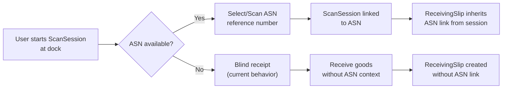
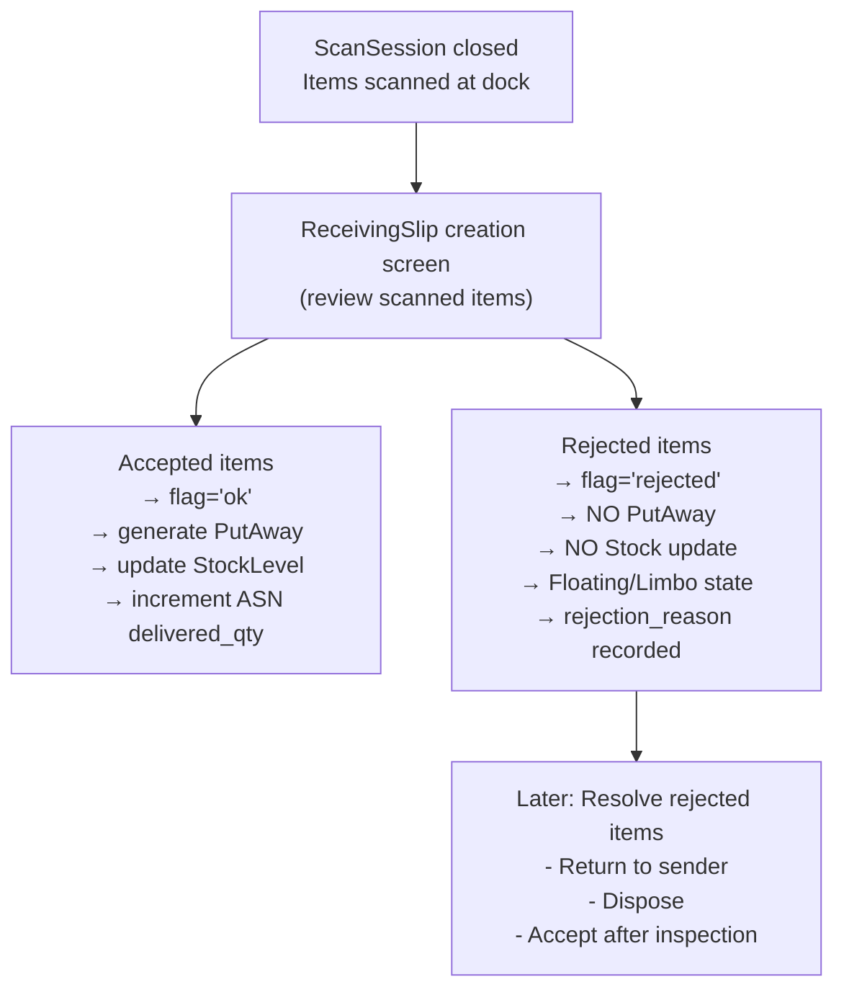

## Current State Summary

Your system currently has these independent entities:

| Entity | Table | Purpose |
|--------|-------|---------|
| `AsnOrder` / `AsnOrderItem` | `asn_orders`, `asn_order_items` | Pre-notification of inter-warehouse transfers. Items already have `delivered_qty`. |
| `ScanSession` / `ScanSessionItem` | `scan_sessions`, `scan_session_items` | QR-based dock scanning sessions |
| `ReceivingSlip` / `ReceivingSlipItem` | `receiving_slips`, `receiving_slip_items` | Generated from closed scan sessions. Items have a `flag` field (default `"ok"`) and `notes`. |

**Key gap**: There is NO foreign key link between `receiving_slips` and `asn_orders`. These are two independent workflows.

---

## Approach for Each Requirement

### 1. Link Receiving Slip to ASN (Optional)

**Schema Change:**
Add a **nullable** `asn_order_id` foreign key on the `receiving_slips` table pointing to `asn_orders.id`. This makes it optional — blind receipts (no ASN) continue to work as they do today.

**Flow Change:**



**Where to Link:**

There are two options for WHEN the ASN gets linked:

- **Option A — Link at ScanSession level**: Add `asn_order_id` to `scan_sessions`. When the dock worker starts scanning, they first scan or select the ASN. The session inherits the ASN context, and the receiving slip automatically gets the link via the session. This is ideal if you want ASN context during scanning (e.g., showing expected items on the mobile scanner).

- **Option B — Link at ReceivingSlip level**: Add `asn_order_id` directly to `receiving_slips`. At slip creation time (when the session is closed), the user picks the ASN. This is simpler but doesn't give real-time ASN context during scanning.

**Recommendation**: **Option A** (link at `scan_sessions`), because it lets the mobile app show expected vs actual during scanning. But you can add the FK on both tables — `scan_sessions` for context during scanning, and cascade it to `receiving_slips` for reporting.

**Key considerations:**
- The ASN status should update when receiving starts — e.g., `confirmed` → `partially_delivered`.
- `AsnOrderItem.delivered_qty` (already exists!) should be incremented as receiving slips are finalized.
- If a scan session is abandoned (no slip created), the ASN link is harmless since it's optional.

---

### 2. Reject Items During Receiving Slip Creation (Floating Mode)

**Concept of "Floating Mode":**
Rejected items are recorded on the receiving slip but:
- Do **NOT** update stock levels (`StockLevel`)
- Do **NOT** generate put-away tasks (`PutAwayList`)
- Do **NOT** count toward `AsnOrderItem.delivered_qty`
- Exist in a "limbo" state tracked for reconciliation, return-to-sender, or disposal workflows

**How it works in the flow:**



**Schema Changes (minimal):**

You already have the right fields on `ReceivingSlipItem`:
- `flag` (String, default `"ok"`) — extend to support `"rejected"`, `"damaged"`, `"excess"`, `"short"`, etc.
- `notes` (Text) — use for rejection reason

You may also want:
- A `rejection_reason` on `receiving_slips` (already exists!) for a summary/header-level rejection note.
- A `rejected_by` and `rejected_at` timestamp if you need audit trail on rejections.

**The Review Step:**

When a `ScanSession` is closed, currently the system likely auto-generates a `ReceivingSlip`. Instead, introduce a **review step**:

1. Scan session closes → scanned items are aggregated by SKU + batch.
2. If an ASN is linked, expected items from the ASN are shown side-by-side with scanned items.
3. The reviewer (supervisor/dock lead) can:
   - **Accept** items (default) — they proceed to put-away
   - **Reject** items with a reason — they enter floating mode
   - **Adjust quantities** — e.g., if 100 were scanned but only 95 are acceptable
4. On submission, the receiving slip is created with accepted and rejected line items.

**Floating Items Lifecycle:**

Rejected items need a resolution workflow:
- A new status or dashboard view showing all "floating" (rejected) items across receiving slips
- Actions: `accept_later` (after inspection), `return_to_sender`, `dispose`, `adjust_to_damage`
- When resolved, the appropriate stock movements are recorded

---

### 3. Mismatch View: ASN vs Receiving Slips

Since **one ASN can have multiple receiving slips**, the mismatch view needs to aggregate across all linked slips.

**The Comparison Logic:**

For each line item in the ASN, compute:

| Metric | Source | Formula |
|--------|--------|---------|
| **Expected Qty** | `AsnOrderItem.qty` | Original ASN quantity |
| **Accepted Qty** | `SUM(ReceivingSlipItem.quantity)` across all linked slips WHERE `flag = 'ok'` | What actually entered stock |
| **Rejected Qty** | `SUM(ReceivingSlipItem.quantity)` across all linked slips WHERE `flag = 'rejected'` | Scanned but rejected |
| **Pending Qty** | Expected - (Accepted + Rejected) | Still to be received (or short) |
| **Over Qty** | (Accepted + Rejected) - Expected | Over-delivery (if positive) |

**Types of Mismatches the system would flag:**

| Mismatch Type | Condition | Meaning |
|---------------|-----------|---------|
| **Shortage** | Accepted + Rejected < Expected | Some items not yet received or missing |
| **Over-delivery** | Accepted + Rejected > Expected | More received than ASN stated |
| **Rejected** | Rejected > 0 | Items received but not accepted into stock |
| **Not Received** | Accepted + Rejected = 0, Expected > 0 | Item on ASN but never appeared in any slip |
| **Matched** | Accepted = Expected, Rejected = 0 | Perfect match |

**How to Present the View:**

A dedicated API endpoint like:

```
GET /api/v1/asn_orders/{asn_id}/receiving-summary
```

This would return:

```json
{
  "asn_order_no": "ASN-2026-001",
  "status": "partially_delivered",
  "total_expected_items": 5,
  "total_matched_items": 3,
  "total_mismatched_items": 2,
  "linked_receiving_slips": [
    { "slip_number": "RS-001", "date": "...", "accepted": 50, "rejected": 5 },
    { "slip_number": "RS-002", "date": "...", "accepted": 30, "rejected": 0 }
  ],
  "line_items": [
    {
      "sku": "ITEM-001",
      "expected_qty": 100,
      "accepted_qty": 80,
      "rejected_qty": 5,
      "pending_qty": 15,
      "status": "partial"
    },
    {
      "sku": "ITEM-002",
      "expected_qty": 50,
      "accepted_qty": 50,
      "rejected_qty": 0,
      "pending_qty": 0,
      "status": "matched"
    }
  ]
}
```

**When to Update ASN Status:**

Based on aggregated receiving data:

| Condition | ASN Status |
|-----------|------------|
| No receiving slips linked | `confirmed` |
| Some items received, some pending | `partially_delivered` |
| All items fully received (accepted + rejected >= expected, no pending) | `delivered` |
| Manually closed | `closed` |

---

## Summary of Database Changes Needed

| Table | New/Modified Column | Purpose |
|-------|---------------------|---------|
| `scan_sessions` | `asn_order_id` (FK, nullable) | Link scan session to ASN |
| `receiving_slips` | `asn_order_id` (FK, nullable) | Direct ASN link on slip |
| `receiving_slip_items` | Extend `flag` enum values | Support `"rejected"`, `"damaged"`, `"excess"` |
| `receiving_slip_items` | `rejection_reason` (Text, nullable) | Reason for rejection |
| `asn_orders` | Existing `status` field | Use existing statuses (partially_delivered, delivered) |

---

## High-Level Implementation Order

1. **Phase 1**: Add `asn_order_id` FK to `scan_sessions` and `receiving_slips` (migration + model update)
2. **Phase 2**: Modify receiving slip creation flow to accept/reject items, using the existing `flag` field
3. **Phase 3**: Implement the aggregated mismatch view endpoint (`/asn_orders/{id}/receiving-summary`)
4. **Phase 4**: Add the floating items resolution workflow (return/dispose/accept-later)

---

Does this approach align with what you had in mind? Would you like me to dive deeper into any specific part — for example, the review screen UX flow, or the exact API contract for the mismatch endpoint?
