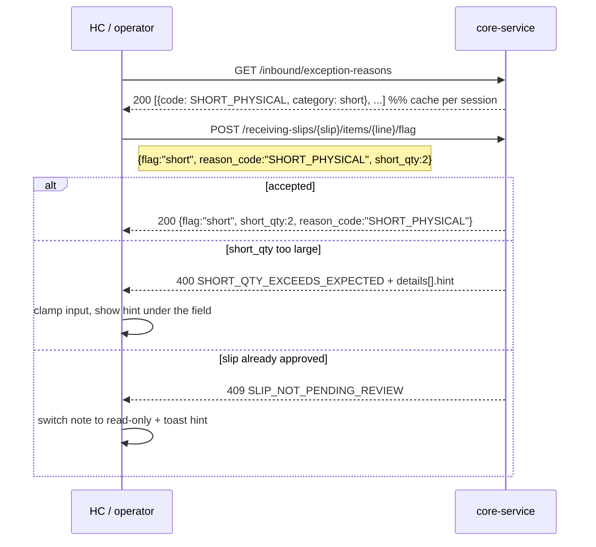
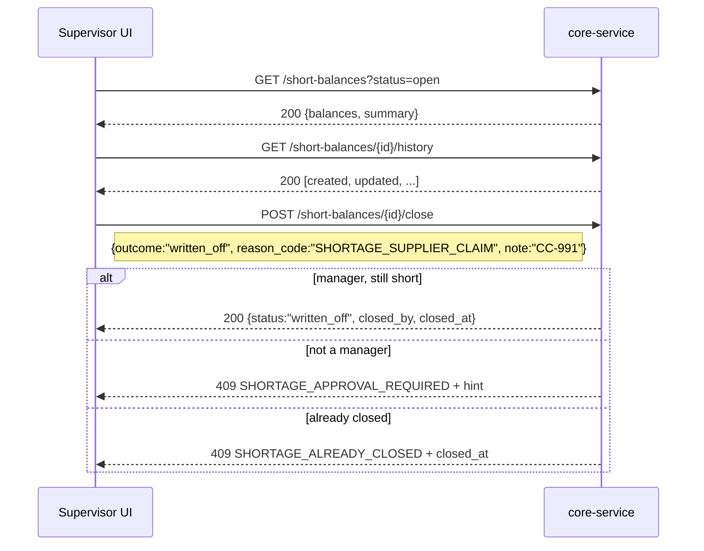

# Short Receipts — Frontend Integration Guide

**Audience:** frontend / mobile (HC) engineers integrating the short-receipt flow
**Scope:** WMS inbound _Short Receipts_ (Blue requirement §1, "Short Receipts" — less received than the ASN expects)
**Backend:** `core-service` · base path `/api/v1/inbound`
**Migration:** `119_add_shortage_tracking` (shortage reason codes, short quantities, balance closure, arrival history)
**Status:** implemented and verified end-to-end against a production restore (2026-09-18)

---

## 1. Mental model (read this first)

> **Physical reality wins. Expected and actual quantities are kept strictly separate.**

| Concept               | Where it lives                                                                  | Who may change it                                |
| --------------------- | ------------------------------------------------------------------------------- | ------------------------------------------------ |
| **Expected** quantity | ASN line (`asn_order_items.qty`)                                                | Never automatically — only a human edits the ASN |
| **Received** quantity | Scan sessions → receiving-slip lines (`receiving_slip_items.quantity`)          | Dock operator by scanning                        |
| **Shortage**          | `receiving_slip_items.short_qty` + `inbound_short_balances.short_qty`           | Dock operator flags it; supervisor closes it     |
| **Shortage decision** | `inbound_short_balances.status` + `close_reason_code`, `closed_by`, `closed_at` | Warehouse manager only                           |

Consequences you can rely on:

1. Accepting a receipt **never** rewrites the ASN expectation.
2. Shorted units are **never** created as stock. Nothing is put away for a shortage.
3. A residual short stays **visible and open** against the ASN until either
   (a) more stock arrives on a later vehicle and the balance resolves itself, or
   (b) a manager **formally closes** it with a reason code.
4. A `written_off` closure is **final** — later receipts refresh the numbers but never reopen the decision.

---

## 2. Lifecycle you are rendering

### 2.1 Receiving slip (Draft Receipt Note)

```
pending_review  ──approve──►  pending_putaway  ──put-away──►  putaway_complete
       │
       └──reject──►  rejected
```

Shortages and damaged/excess lines can only be flagged while the slip is **`pending_review`**.
After approval the API answers `409 SLIP_NOT_PENDING_REVIEW` — the UI must hide/disable the flag controls then (and say why, see §6.4).

### 2.2 Shortage balance

```
open ──later receipt covers the gap──► resolved        (automatic)
  │
  └──manager writes it off────────────► written_off     (final, reason-coded)
```

### 2.3 Line flags (what the operator selects)

| Flag         | Meaning                              | Side effects                                        | Physical segregation      |
| ------------ | ------------------------------------ | --------------------------------------------------- | ------------------------- |
| `short`      | Units missing vs the ASN expectation | Ledger only: `reason_code`, `short_qty` on the line | ❌ none (nothing arrived) |
| `damaged`    | Visible damage                       | Creates an exception, opens supervisor disposition  | ✅ HOLD or QUARANTINE     |
| `excess`     | More/other stock than expected       | Creates an exception                                | ✅ HOLD or QUARANTINE     |
| `hold`       | Operational hold                     | Creates an exception                                | ✅ HOLD or QUARANTINE     |
| `quarantine` | Quality/compliance quarantine        | Creates an exception                                | ✅ HOLD or QUARANTINE     |

`ok` is the default (no discrepancy). The bulk-status endpoint accepts the same values.

---

## 3. Endpoint reference

All requests need `Authorization: Bearer <token>`.

| #   | Method | Path                                                             | Permission                                | Purpose                                                               |
| --- | ------ | ---------------------------------------------------------------- | ----------------------------------------- | --------------------------------------------------------------------- |
| 1   | `GET`  | `/api/v1/inbound/receiving-slips/{slip_id}`                      | `warehouse.read`                          | Draft Receipt Note + lines (render expected vs received)              |
| 2   | `GET`  | `/api/v1/inbound/exception-reasons`                              | `inbound_exception.read`                  | Populate reason-code pickers                                          |
| 3   | `POST` | `/api/v1/inbound/receiving-slips/{slip_id}/items/{item_id}/flag` | `warehouse.update` **or** `wms.scan`      | Flag/classify one line (short / damaged / excess / hold / quarantine) |
| 4   | `POST` | `/api/v1/inbound/receiving-slips/{slip_id}/approve`              | `warehouse.update` **or** `wms.scan`      | Supervisor approves the note (shortages highlighted)                  |
| 5   | `POST` | `/api/v1/inbound/receiving-slips/{slip_id}/reject`               | `warehouse.update` **or** `wms.scan`      | Reject the note with a reason                                         |
| 6   | `GET`  | `/api/v1/inbound/short-balances`                                 | `warehouse.read`                          | Shortage worklist (filters + totals)                                  |
| 7   | `GET`  | `/api/v1/inbound/short-balances/{balance_id}`                    | `warehouse.read`                          | One balance                                                           |
| 8   | `GET`  | `/api/v1/inbound/short-balances/{balance_id}/history`            | `warehouse.read`                          | Arrival-level audit trail                                             |
| 9   | `POST` | `/api/v1/inbound/short-balances/{balance_id}/close`              | `inbound_exception.dispose` **+ manager** | Write off / formally close a residual short                           |
| 10  | `GET`  | `/api/v1/inbound/asn-orders/{asn_order_id}/short-balances`       | `warehouse.read`                          | _(legacy)_ balances of a single ASN                                   |
| 11  | `GET`  | `/api/v1/asn-orders/{asn_order_id}/receiving-summary`            | `asn_order.read`                          | Expected vs received mismatch buckets per ASN                         |

---

### 3.1 `GET /receiving-slips/{slip_id}` — the note you approve

Lines carry the shortage data directly:

```json
{
  "id": "2a27ff43-...",
  "slip_number": "RS-2026-00130",
  "status": "pending_review",
  "asn_order_id": "dc552403-...",
  "asn_order_no": "ASN-2026-00115",
  "total_boxes": 4,
  "total_items": 4,
  "groups": [
    {
      "parent_qseal": {
        "id": "...",
        "serial_number": "QSL129A9FB",
        "name": "MP-…-1",
        "qseal_type": "shipper",
        "capacity": 6
      },
      "product_name": "Prestige …",
      "items": [
        {
          "id": "60f96aee-…", // ← use as {item_id} in the flag endpoint
          "serial_number": "TTK-1T1ZB0",
          "sku": "PTK-TOA-G001",
          "batch_number": "BT-SEP-16-NFA2-1",
          "quantity": 1, // actual accepted
          "box_count": 1,
          "flag": "ok", // ok | short | damaged | excess | held | …
          "condition_code": "GOOD",
          "reason_code": null,
          "short_qty": null,
          "exception_status": null,
          "exception_destination_location_id": null
        }
      ]
    }
  ]
}
```

> `quantity` is what was **scanned/accepted**. The ASN expectation is not part of this payload —
> fetch it from the ASN (`GET /api/v1/asn-orders/{id}` or the receiving-summary) when you want to
> show `expected vs received` on the note.

---

### 3.2 `POST /receiving-slips/{slip_id}/items/{item_id}/flag` — the main new contract

**Request**

```jsonc
{
  "flag": "short", // short | damaged | excess | hold | quarantine
  "reason_code": "SHORT_PHYSICAL", // from GET /exception-reasons (must match the flag's category)
  "short_qty": 2, // REQUIRED for short, MUST be omitted otherwise
  "destination": null, // HOLD|QUARANTINE for segregation flags; MUST be omitted for short
  "notes": "2 cartons missing at dock"
}
```

**Success `200`**

```json
{
  "id": "60f96aee-…",
  "slip_id": "2a27ff43-…",
  "sku": "PTK-TOA-G001",
  "batch_number": "TTK-1T1ZB0",
  "quantity": 1,
  "box_count": 1,
  "flag": "short",
  "reason_code": "SHORT_PHYSICAL",
  "short_qty": 2,
  "condition_code": "GOOD",
  "exception_id": null,
  "exception_status": null,
  "destination": null,
  "destination_location_id": null,
  "notes": "2 cartons missing at dock"
}
```

For `short`, `exception_*` and `destination` stay `null` — **by design**: a shortage is a ledger record, not a physical exception. For segregation flags you get:

```json
{
  "flag": "damaged",
  "reason_code": "DAMAGED",
  "condition_code": "QUARANTINE",
  "exception_id": "2e3e0080-…",
  "exception_status": "pending_approval",
  "destination": "QUARANTINE",
  "destination_location_id": "083e349a-…"
}
```

Re-flagging the same line is allowed while the slip is `pending_review`; the API keeps the line
truthful (a `short` line never keeps a damaged condition, and a `damaged` line never keeps a stale `short_qty`).

**Reason-code categories per flag** (the API enforces the match):

| flag         | accepted `category` values |
| ------------ | -------------------------- |
| `short`      | `short`                    |
| `damaged`    | `damage`                   |
| `excess`     | `excess`, `unexpected_sku` |
| `hold`       | `hold`                     |
| `quarantine` | `quarantine`               |

---

### 3.3 `GET /short-balances` — the supervisor shortage worklist

**Query:** `asn_order_id?`, `status?` (`open` \| `resolved` \| `written_off`), `sku?`, `page=1`, `page_size=20` (max 100)

```json
{
  "balances": [
    {
      "id": "f3041350-…",
      "asn_order_id": "711b0798-…",
      "asn_order_item_id": "a1addd52-…",
      "receiving_slip_id": "b5286b00-…",
      "item_id": "ee0280cf-…",
      "sku": "PTK-DUK-M009",
      "expected_qty": 4.0,
      "received_qty": 0.0,
      "short_qty": 4.0,
      "status": "open",
      "reason_code": "SHORT_PHYSICAL", // captured at the dock (nullable)
      "note": null,
      "close_reason_code": null,
      "close_note": null,
      "closed_by": null,
      "closed_at": null,
      "created_at": "2026-09-16T09:19:40Z",
      "updated_at": "2026-09-16T09:19:40Z"
    }
  ],
  "pagination": {
    "page": 1,
    "page_size": 20,
    "total_items": 154,
    "total_pages": 8,
    "has_next": true,
    "has_prev": false
  },
  "summary": {
    "total": 154,
    "open_count": 12,
    "resolved_count": 141,
    "written_off_count": 1,
    "open_short_qty": 57.0,
    "total_short_qty": 61.0
  }
}
```

Use `summary.open_count` / `open_short_qty` for the badge on the supervisor dashboard — no client-side aggregation needed.

### 3.4 `GET /short-balances/{balance_id}/history` — arrival-level traceability

```json
[
  {
    "id": "…",
    "balance_id": "f3041350-…",
    "receiving_slip_id": "b5286b00-…",
    "event_type": "created", // created | updated | resolved | written_off
    "from_status": null,
    "to_status": "open",
    "expected_qty": 4.0,
    "received_qty": 0.0,
    "short_qty": 4.0,
    "reason_code": "SHORT_PHYSICAL",
    "note": null,
    "actor_id": null,
    "created_at": "2026-09-16T09:19:40Z"
  },
  {
    "id": "…",
    "event_type": "written_off",
    "from_status": "open",
    "to_status": "written_off",
    "short_qty": 4.0,
    "reason_code": "SHORTAGE_SUPPLIER_CLAIM",
    "note": "Claim raised with supplier CC-991",
    "actor_id": "6cada4a6-…",
    "created_at": "2026-09-18T11:56:08Z"
  }
]
```

> ⚠️ Balances created **before** migration 119 have no history rows. Render an empty state
> ("No history recorded before 18 Sep 2026"), not an error.

### 3.5 `POST /short-balances/{balance_id}/close` — write-off (manager only)

```jsonc
{
  "outcome": "written_off",
  "reason_code": "SHORTAGE_SUPPLIER_CLAIM",
  "note": "Claim raised with supplier CC-991"
}
```

`outcome` values:

| outcome               | when to use                                | server behaviour                                                            |
| --------------------- | ------------------------------------------ | --------------------------------------------------------------------------- |
| `written_off`         | the stock will not arrive; accept the loss | `status=written_off`, stores reason/note/approver/timestamp                 |
| `resolved_by_receipt` | the gap arrived on a later vehicle         | allowed **only** when `short_qty == 0`, otherwise `409 SHORTAGE_STILL_OPEN` |

Returns the updated balance (same shape as §3.3). Closure reason codes come from
`GET /exception-reasons` filtered to `category == "short"`:

| code                      | meaning                                             |
| ------------------------- | --------------------------------------------------- |
| `SHORTAGE_WRITE_OFF`      | Shortage written off (approved)                     |
| `SHORTAGE_SUPPLIER_CLAIM` | Shortage claimed from supplier                      |
| `SHORTAGE_FOUND_LATER`    | Shortage received later against the same ASN        |
| `SHORT_PHYSICAL`          | Physical shortage (the code the dock normally uses) |

---

## 4. Error contract

### 4.1 Two envelopes exist — normalise them once

**A. Domain errors (use these for UX messaging)** — `400`, `404`, `409` raised by the short-receipt services:

```json
{
  "error": "SHORT_QTY_EXCEEDS_EXPECTED",
  "message": "Shortage of 7 unit(s) exceeds the outstanding quantity for this ASN line",
  "details": [
    {
      "field": "short_qty",
      "reason": "short_qty (7) is greater than the outstanding quantity (4)",
      "hint": "Enter at most 4 unit(s), or verify the ASN expectation with the supervisor."
    }
  ],
  "hint": "Enter a value between 1 and 4.",
  "current_state": "open", // 409 only
  "required_state": ["resolved"], // 409 only
  "entity_type": "InboundShortBalance",
  "entity_id": "…" // 404 only
}
```

- `error` — stable, machine-readable. **Branch on this.**
- `message` — human sentence safe to display (already user-facing, no stack traces).
- `details[]` — optional field-level problems: `field`, `reason`, optional `hint`.
- `hint` — the single next action for the operator. **Always show it** when present.
- `current_state` / `required_state` — present on `409`s; use for "what do I do now" copy.

**B. Framework/request-shape errors** — returned by FastAPI for malformed payloads
(wrong type, unknown extra field, bad UUID in the path):

```json
{
  "detail": {
    "message": "Invalid input data",
    "status_code": 400,
    "code": "VALIDATION_ERROR",
    "errors": [
      { "field": "short_qty", "message": "Input should be a valid integer" }
    ]
  }
}
```

Not every short-receipt error is a domain error: a _missing_ `reason_code` is deliberately
reported by the service (`REASON_CODE_REQUIRED` with the allowed values) rather than by the schema,
so the operator sees which codes are legal. Malformed values (e.g. `"short_qty": "two"`) still
produce envelope B.

**C. Other shapes you will meet on these endpoints**

| Situation                     | Body                                                                                |
| ----------------------------- | ----------------------------------------------------------------------------------- |
| `401` token invalid/expired   | `{"detail": "Invalid authentication credentials"}`                                  |
| `403` missing permission      | `{"detail": "Permission denied. Required one of: warehouse.update, wms.scan"}`      |
| `503` database/schema problem | `{"code": "SERVICE_UNAVAILABLE", "message": "Service is temporarily unavailable…"}` |

**Normaliser (TypeScript)**

```ts
export interface ApiFieldError {
  field: string;
  reason?: string;
  hint?: string;
  message?: string;
}

export interface NormalizedApiError {
  httpStatus: number;
  code: string; // 'NETWORK' when the request never reached the API
  message: string; // always displayable
  hint?: string; // next action
  fields: ApiFieldError[]; // map to form controls
  currentState?: string;
  requiredState?: string[];
  entityType?: string;
  entityId?: string;
}

export function normalizeApiError(
  status: number,
  body: any,
): NormalizedApiError {
  // A. domain envelope
  if (body && typeof body.error === "string") {
    return {
      httpStatus: status,
      code: body.error,
      message: body.message ?? "Something went wrong",
      hint: body.hint,
      fields: Array.isArray(body.details) ? body.details : [],
      currentState: body.current_state,
      requiredState: body.required_state,
      entityType: body.entity_type,
      entityId: body.entity_id,
    };
  }
  // B. framework envelope
  if (body?.detail && typeof body.detail === "object") {
    return {
      httpStatus: status,
      code: body.detail.code ?? "VALIDATION_ERROR",
      message: body.detail.message ?? "Invalid input data",
      fields: (body.detail.errors ?? []).map((e: any) => ({
        field: e.field,
        message: e.message,
      })),
    };
  }
  // C. plain string detail
  if (typeof body?.detail === "string") {
    return {
      httpStatus: status,
      code: status === 403 ? "FORBIDDEN" : "ERROR",
      message: body.detail,
      fields: [],
    };
  }
  return {
    httpStatus: status,
    code: "UNKNOWN",
    message: "Unexpected error",
    fields: [],
  };
}
```

### 4.2 Complete error catalogue for the short-receipt flow

| HTTP        | `error` code                      | When                                                                              | What the UI should do                                                                |
| ----------- | --------------------------------- | --------------------------------------------------------------------------------- | ------------------------------------------------------------------------------------ |
| 400         | `FLAG_VALUE_INVALID`              | `flag` not one of short/damaged/excess/hold/quarantine                            | Bug or stale UI — show `message` + `hint`                                            |
| 400         | `REASON_CODE_REQUIRED`            | `reason_code` omitted                                                             | Focus the reason-code dropdown; `hint` lists the valid codes                         |
| 400         | `REASON_CODE_INVALID`             | unknown / inactive / wrong category for the flag                                  | Re-fetch `/exception-reasons`, re-open the picker                                    |
| 400         | `SHORT_QTY_REQUIRED`              | `flag=short` without `short_qty`                                                  | Focus the quantity field                                                             |
| 400         | `SHORT_QTY_EXCEEDS_EXPECTED`      | `short_qty` > outstanding ASN quantity                                            | Show `details[0].hint` (max allowed) and clamp the input                             |
| 400         | `SHORT_QTY_NOT_ALLOWED`           | `short_qty` sent for a non-short flag                                             | Clear the field and resend                                                           |
| 400         | `DESTINATION_NOT_ALLOWED`         | `destination` sent with `flag=short`                                              | Remove `destination`; explain "a shortage is not segregated"                         |
| 400         | `DESTINATION_INVALID`             | destination not `HOLD`/`QUARANTINE`                                               | Offer the two valid bins only                                                        |
| 400         | `SHORTAGE_OUTCOME_INVALID`        | close `outcome` not recognised                                                    | Use `written_off` or `resolved_by_receipt`                                           |
| 400         | `SHORTAGE_REASON_REQUIRED`        | close without `reason_code`                                                       | Focus the closure-reason picker                                                      |
| 400         | `SHORTAGE_REASON_INVALID`         | close reason unknown / not `category=short`                                       | Re-fetch codes for closure                                                           |
| 400         | `SHORTAGE_STATUS_INVALID`         | bad `status` query filter                                                         | Only `open` / `resolved` / `written_off`                                             |
| 400         | `VALIDATION_ERROR`                | malformed payload                                                                 | Map `errors[].field` onto inputs                                                     |
| 401         | _(plain detail)_                  | expired token                                                                     | Redirect to login                                                                    |
| 403         | _(plain detail)_                  | missing `warehouse.update`/`wms.scan` (flag), `inbound_exception.dispose` (close) | Hide the action / show "you don't have permission"                                   |
| 404         | `RECEIVING_SLIP_NOT_FOUND`        | slip gone or another org                                                          | Refresh the list; drop the row                                                       |
| 404         | `RECEIPT_LINE_NOT_FOUND`          | line removed (e.g. `remove-scan`)                                                 | Refresh the slip                                                                     |
| 404         | `SHORT_BALANCE_NOT_FOUND`         | balance gone / another org / receipt not approved yet                             | Refresh the worklist                                                                 |
| 409         | `SLIP_NOT_PENDING_REVIEW`         | slip approved or rejected meanwhile                                               | Re-render the note read-only, toast `hint`                                           |
| 409         | `EXCEPTION_ALREADY_ACTIVE`        | line already has an active exception                                              | Offer "open existing exception" (`hint` contains its id)                             |
| 409         | `SHORTAGE_ALREADY_CLOSED`         | second write-off attempt                                                          | Show closure details (`closed_by`/`closed_at`/`close_reason_code`)                   |
| 409         | `SHORTAGE_NOTHING_TO_CLOSE`       | `short_qty` is already 0                                                          | Hide the close action; refresh the row                                               |
| 409         | `SHORTAGE_STILL_OPEN`             | `resolved_by_receipt` while still short                                           | Suggest `written_off` or wait for the next receipt                                   |
| 409         | `SHORTAGE_APPROVAL_REQUIRED`      | caller is not a warehouse manager                                                 | Show "Manager approval required" (needs `inbound_exception.dispose` **and** manager) |
| 500/502/503 | `SERVICE_UNAVAILABLE` / `UNKNOWN` | infrastructure                                                                    | Retry with backoff; never say "invalid data"                                         |

### 4.3 Worked examples

**Short qty beyond the outstanding balance** — input 7, outstanding 4:

```http
POST /api/v1/inbound/receiving-slips/{slip}/items/{line}/flag
{ "flag": "short", "reason_code": "SHORT_PHYSICAL", "short_qty": 7 }

400
{ "error": "SHORT_QTY_EXCEEDS_EXPECTED",
  "message": "Shortage of 7 unit(s) exceeds the outstanding quantity for this ASN line",
  "details": [ { "field": "short_qty", "reason": "short_qty (7) is greater than the outstanding quantity (4)",
                 "hint": "Enter at most 4 unit(s), or verify the ASN expectation with the supervisor." } ],
  "hint": "Enter a value between 1 and 4." }
```

**Approving then flagging**:

```http
400/409 → { "error": "SLIP_NOT_PENDING_REVIEW",
  "message": "Receipt lines can only be flagged while the slip is pending review (current status: 'pending_putaway')",
  "current_state": "pending_putaway", "required_state": ["pending_review"],
  "hint": "Flags must be applied before the Draft Receipt Note is approved. …" }
```

**Second write-off attempt**:

```json
{
  "error": "SHORTAGE_ALREADY_CLOSED",
  "message": "Shortage for SKU 'PTK-DUK-M009' was already closed as written off on 2026-09-18T11:56:08.947974+00:00",
  "current_state": "written_off",
  "required_state": ["open"],
  "hint": "This closure is final. Approve a new receipt for that ASN line if further stock arrives."
}
```

### 4.4 UX rules

1. **Never show a raw status code.** Always render `message` (+ `hint` when present).
2. **400 → fix the form.** High-light `details[].field`; put `details[].hint` under the input.
3. **404 → refresh.** The entity moved on; refetch and toast once.
4. **409 → explain the state.** Prefer a modal: `message` + `hint`, with `current_state`/`required_state`; offer the corrective action (refresh, open existing exception, ask a manager).
5. **403 → hide, don't fail.** If the user lacks the permission, the control should not be offered; if it happens anyway, say "You don't have permission for this action".
6. **Retries:** 5xx and network errors are retryable (idempotent-safe: the flag endpoint is a set-state call, the close endpoint is not). Cap at 3 tries with backoff and show a "Retry" affordance.
7. **Optimistic UI:** safe for the flag call (single line), then reconcile with the response body (the server may normalise fields — e.g. it clears `short_qty` when you switch a line to `damaged`). Do **not** optimistically close a shortage; wait for the response.
8. **On success:** toast with the resulting state ("Line flagged short — 2 units missing against ASN-2026-00115", "Shortage closed as supplier claim").

---

## 5. TypeScript types

```ts
export type LineFlag =
  | "ok"
  | "short"
  | "damaged"
  | "excess"
  | "hold"
  | "quarantine"
  | "rejected";
export type BalanceStatus = "open" | "resolved" | "written_off";
export type CloseOutcome = "written_off" | "resolved_by_receipt";

export interface FlagLineRequest {
  flag: Exclude<LineFlag, "ok" | "rejected">;
  reason_code: string;
  short_qty?: number | null; // required for 'short', forbidden otherwise
  destination?: "HOLD" | "QUARANTINE" | null; // required for segregation flags
  notes?: string | null;
}

export interface FlagLineResponse {
  id: string;
  slip_id: string;
  sku: string;
  batch_number: string | null;
  quantity: number;
  box_count: number;
  flag: LineFlag;
  reason_code: string | null;
  short_qty: number | null;
  condition_code: string | null;
  exception_id: string | null;
  exception_status: string | null;
  destination: "HOLD" | "QUARANTINE" | null;
  destination_location_id: string | null;
  notes: string | null;
}

export interface ShortBalance {
  id: string;
  asn_order_id: string;
  asn_order_item_id: string;
  receiving_slip_id: string | null;
  item_id: string | null;
  sku: string;
  expected_qty: number;
  received_qty: number;
  short_qty: number;
  status: BalanceStatus;
  reason_code: string | null;
  note: string | null;
  close_reason_code: string | null;
  close_note: string | null;
  closed_by: string | null;
  closed_at: string | null;
  created_at: string | null;
  updated_at: string | null;
}

export interface ShortBalanceListResponse {
  balances: ShortBalance[];
  pagination: {
    page: number;
    page_size: number;
    total_items: number;
    total_pages: number;
    has_next: boolean;
    has_prev: boolean;
  };
  summary: {
    total: number;
    open_count: number;
    resolved_count: number;
    written_off_count: number;
    open_short_qty: number;
    total_short_qty: number;
  };
}

export interface ShortBalanceEvent {
  id: string;
  balance_id: string;
  receiving_slip_id: string | null;
  event_type: "created" | "updated" | "resolved" | "written_off";
  from_status: BalanceStatus | null;
  to_status: BalanceStatus;
  expected_qty: number;
  received_qty: number;
  short_qty: number;
  reason_code: string | null;
  note: string | null;
  actor_id: string | null;
  created_at: string | null;
}

export interface CloseShortBalanceRequest {
  outcome: CloseOutcome;
  reason_code?: string | null;
  note?: string | null;
}
```

---

## 6. Reference flows

### 6.1 Dock operator records a shortage



### 6.2 Supervisor approves the note with the shortage highlighted

1. `GET /receiving-slips/{slip}` → render lines, badge `flag != 'ok'`, show `short_qty` and `reason_code`.
2. Sum `short_qty` per SKU for the "short received" banner (compare with the ASN expectation for "expected vs received").
3. `POST /receiving-slips/{slip}/approve` → on success the balance ledger refreshes automatically;
   `GET /short-balances?asn_order_id=…` then shows `open` rows for the residual short.

### 6.3 Supervisor closes a residual shortage



### 6.4 A later vehicle resolves the shortage

No UI action needed: once the follow-up receipt is approved the balance becomes `resolved`
(`short_qty = 0`) and a `resolved` event appears in `/history`. Show `resolved` rows as read-only,
with the receipt that closed the gap (`receiving_slip_id` on the event).

---

## 7. Reason-code pickers

```
GET /api/v1/inbound/exception-reasons
→ [{ "code": "SHORT_PHYSICAL", "name": "Physical shortage", "category": "short",
     "default_destination": null, "requires_approval": false }, …]
```

- Cache per session; it changes rarely.
- Flag picker: filter by the category map in §3.2.
- Closure picker: filter `category === 'short'`.
- `default_destination` pre-fills the destination select for segregation flags; if it is `null`,
  default to `QUARANTINE` (the server does the same).

---

## 8. Frontend test checklist

| #   | Scenario                       | Call                                           | Expect                                                         |
| --- | ------------------------------ | ---------------------------------------------- | -------------------------------------------------------------- |
| 1   | Flag short with reason + qty   | `flag {short, SHORT_PHYSICAL, 2}`              | `200`, line shows flag/short_qty/reason                        |
| 2   | Flag short without reason      | `flag {short, short_qty:1}`                    | `400 REASON_CODE_REQUIRED`, picker focused, `hint` lists codes |
| 3   | Flag short with unknown reason | `flag {short, "NOPE", 1}`                      | `400 REASON_CODE_INVALID`                                      |
| 4   | Flag short without qty         | `flag {short, SHORT_PHYSICAL}`                 | `400 SHORT_QTY_REQUIRED`                                       |
| 5   | Flag short with destination    | `flag {short, SHORT_PHYSICAL, 1, HOLD}`        | `400 DESTINATION_NOT_ALLOWED`                                  |
| 6   | Flag damaged                   | `flag {damaged, DAMAGED}`                      | `200` + `exception_id`, `destination=QUARANTINE`               |
| 7   | Flag after approval            | approve slip, then flag                        | `409 SLIP_NOT_PENDING_REVIEW`                                  |
| 8   | Unknown slip/line              | random UUIDs                                   | `404 RECEIVING_SLIP_NOT_FOUND` / `RECEIPT_LINE_NOT_FOUND`      |
| 9   | Worklist + badges              | `GET /short-balances?status=open`              | `summary.open_count` matches the table                         |
| 10  | History                        | `GET /short-balances/{id}/history`             | chronological events; empty state for pre-migration rows       |
| 11  | Close as manager               | `close {written_off, SHORTAGE_SUPPLIER_CLAIM}` | `200`, `status=written_off`, `closed_at` set                   |
| 12  | Close twice                    | repeat call                                    | `409 SHORTAGE_ALREADY_CLOSED`                                  |
| 13  | Close as non-manager           | same call, non-manager token                   | `403` (missing permission) or `409 SHORTAGE_APPROVAL_REQUIRED` |
| 14  | Close resolved balance         | balance with `short_qty = 0`                   | `409 SHORTAGE_NOTHING_TO_CLOSE`                                |
| 15  | Bad status filter              | `?status=bogus`                                | `400 SHORTAGE_STATUS_INVALID`                                  |

---

## 9. Notes, limits, and things that are intentionally _not_ here

1. **`short_qty` is not re-derived from the ASN in the UI.** The server validates it against the
   outstanding ASN quantity (when the slip is ASN-linked) and returns the maximum in the error hint.
   If you show a "max" in the input, still handle `SHORT_QTY_EXCEEDS_EXPECTED`.
2. **A shortage creates no exception row** (nothing to dispose of). It appears in the shortage ledger
   after the slip is approved, not in the hold/quarantine queue.
3. **`written_off` is terminal.** Granting a later receipt refreshes numbers but keeps the closure —
   show the closure fields and an "already closed" hint instead of a close button.
4. **Bulk status updates** (`POST /receiving-slips/{slip}/items/status`) now accept every line
   status (`rejected`, `ok`, `short`, `damaged`, `excess`, `hold`, `quarantine`) plus
   `reason_code`, `short_qty` and `destination` per item; when omitted, `short_qty` may be absent
   (legacy behaviour) and the reason code defaults to the canonical code for the status
   (`SHORT_PHYSICAL`, `DAMAGED`, `EXCESS`, `HOLD`, `QUARANTINE`). Prefer the
   single-line endpoint for shortage capture.
5. **Permissions to hide in the UI:** flagging needs `warehouse.update` **or** `wms.scan`;
   shortage closure needs `inbound_exception.dispose` **and** warehouse-manager authority;
   reads need `warehouse.read`.
6. **Errors that are _not_ shortages:** `EXCEPTION_ALREADY_ACTIVE` means the line already has an
   open exception (typically damaged stock) — offer to open it rather than retrying.

---

## 10. Backend reference (for the API reviewer)

| File                                            | Change                                                                                                                                          |
| ----------------------------------------------- | ----------------------------------------------------------------------------------------------------------------------------------------------- |
| `app/core/exceptions.py`                        | `ValidationError` / `StateError` / `NotFoundError` accept `code`, `hint`, `details` (backwards compatible)                                      |
| `app/main.py`                                   | The three handlers surface `error` (code), `hint` and `details` when present                                                                    |
| `app/services/inbound_service.py`               | `flag_line_item` rewritten: all five flags, mandatory reason code, destination rules, short-quantity validation against the ASN expectation     |
| `app/services/inbound_short_balance_service.py` | `list_balances`, `summarize`, `get_balance`, `list_events`, `close_balance`; `refresh_for_asn` appends history and never resurrects a write-off |
| `app/services/inbound_exception_service.py`     | Persists `reason_code` on the line; richer codes/hints for classification conflicts                                                             |
| `app/api/v1/endpoints/inbound.py`               | New `/short-balances` endpoints; flag endpoint documented                                                                                       |
| `app/schemas/inbound.py`                        | `FlagLineItemRequest`/`FlaggedItemResponse`, shortage list/detail/event/close schemas                                                           |
| `alembic/versions/119_add_shortage_tracking.py` | `receiving_slip_items.reason_code`/`short_qty`, balance closure columns, `inbound_short_balance_events`, closure reason codes                   |
| `tests/test_receiving_slip_workflow.py`         | Updated + new error-contract tests (`RUN_DATABASE_TESTS=1` + Postgres required)                                                                 |
