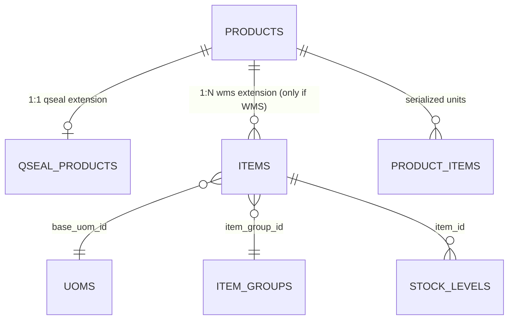
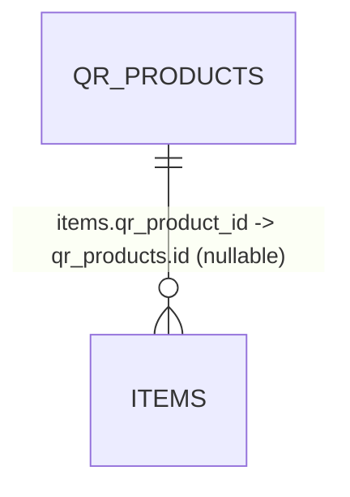
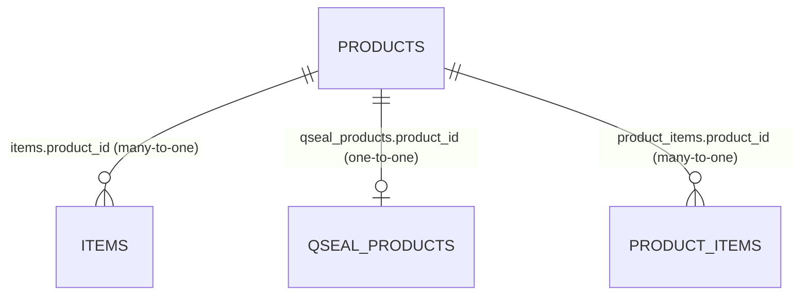
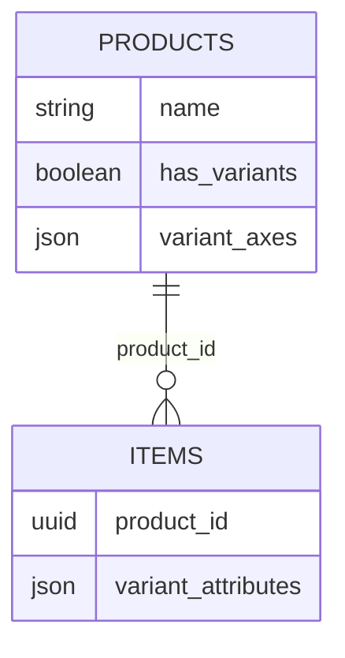
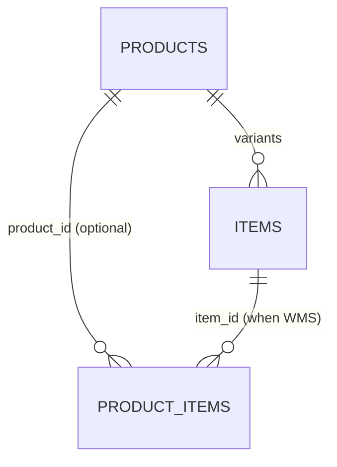

# Product / Item Dual-Mode & Bulk Upload Design

> Status: **Proposal / Design Reference**
> Scope: `core-service` — catalog, WMS, Qseal modules
> Related docs: `PRODUCT_ITEM_UOM_ARCHITECTURE.md`
> Related code: `app/services/product_item_sync_service.py` (to be deprecated), `app/models/feature_flag.py`, `app/models/item.py`, `app/models/qr_product.py`

---

## 1. Purpose

This document defines a **configurable** design that serves two customer types from a **single data model**, plus a **bulk upload** strategy for onboarding.

It replaces the current "Item ↔ Product field-sync" approach with a **shared catalog core + optional module extensions** model, eliminating duplicate state.

---

## 2. The two customer types

| # | Type | Uses WMS | Uses Qseal | Source of truth |
|---|---|---|---|---|
| 1 | Full WMS + Qseal | ✅ | ✅ | Item (product is auto-managed) |
| 2 | Qseal only | ❌ (maybe later) | ✅ | Product |

- **Type 1:** operational inventory users — Items/SKUs, inbound/outbound, stock, and Qseal serialization on top.
- **Type 2:** anti-counterfeit users — Qseal products and serialized units only. They may enable WMS in the future.

The design must let **Type 2 upgrade to Type 1 without data migration**, just by toggling a flag and running a provisioning job.

---

## 3. Current problem: bidirectional field sync

Today `product_item_sync_service.py` copies fields in both directions:

- `ITEM_TO_PRODUCT_FIELDS` — ~40 fields (Item wins).
- `PRODUCT_TO_ITEM_FIELDS` — ~17 fields (Product fills only when Item empty).

This "two records synced" pattern causes drift, identity duplication, and conflict-resolution bugs. It must be removed.

---

## 4. Recommended design: one shared core, two optional extensions

**Principle: a product record exists once. Each module owns its own columns in its own table, joined by FK. Nothing is copied.**



| Concept | Table | Type 1 (WMS+Qseal) | Type 2 (Qseal only) |
|---|---|---|---|
| Catalog identity | `products` | ✅ always | ✅ always |
| WMS/SKU extension | `items` | ✅ | ❌ (empty) |
| Qseal extension | `qseal_products` | ✅ | ✅ |
| Serialized units | `product_items` | ✅ | ✅ |

### 4.1 Table responsibilities

```python
# products — shared catalog core (always exists)
#   id, organization_id, name, sku, gtin, brand_id, category_id,
#   images, tags, is_active, type (wms | qseal | both)

# qseal_products — Qseal-only fields (evolve from qr_products)
#   id, product_id (FK, 1:1), landing_page, warranty_period_months,
#   activation_method, qr_type, sr_number_type, ...

# items — WMS-only fields
#   id, product_id (FK, 1:N), base_uom_id, item_group_id,
#   has_batch_no, has_serial_no, reorder_*, valuation_method, ...
```

This removes the 57-field sync entirely — Qseal and WMS columns live only in their own extension tables.

---

## 5. Configuration via feature flags

Use the existing `FeatureFlag` model with `tenant_id` scope. The flag controls **what is editable and what is auto-created** — never which data model exists (the model is always the same).

| Flag (tenant-scoped) | Type 1 | Type 2 |
|---|---|---|
| `wms_enabled` | `true` | `false` |
| `qseal_enabled` | `true` | `true` |
| `product_editable_manually` | `false` (auto-managed, read-only) | `true` |
| `item_auto_create_product` | `true` | n/a |

### 5.1 Behavior rules

- **Type 1:** user creates/edits **Items**. On item create, a `Product` is auto-created (1:1) if `product_id` is not supplied. The Product row is **read-only in the UI**, but still exists so Qseal can attach.
- **Type 2:** user creates/edits **Products** directly. No items. Qseal attaches to the product.

> Key shift: you do **not** "disable product creation for Type 1" — the product is **auto-created and read-only** for Type 1, and **editable** for Type 2. One data model, different edit paths.

---

## 6. Bulk upload — one engine, three modes

Do not build two upload flows. Build **one import engine** with a `mode` parameter, because every mode ultimately creates the same `products` rows.

| Mode | Creates | Used by |
|---|---|---|
| `product_only` | `products` (+ qseal) | Type 2 |
| `product_with_items` | `products` + `items` | Type 1 (explicit) |
| `item_with_auto_product` | `items` → auto `products` | Type 1 (fast path) |

### 6.1 Rules that keep it scalable and bug-free

1. **Deterministic natural key** for upsert: `(organization_id, sku)` with fallback `(organization_id, gtin)`. Re-upload = update, not duplicate.
2. **Idempotent** — stage → validate → upsert with a `run_id`, so a failed run can be retried safely.
3. **Mode-specific required columns** — one shared template, extra columns optional:
   - Always required: `name`, `sku`.
   - WMS columns (`uom`, `item_group`, `batch/serial`) required only in `product_with_items` / `item_with_auto_product`.
   - Qseal columns (`landing_page`, `activation_method`, `warranty`) required only when `qseal_enabled`.
4. **Row-level error reporting** — line number + field + reason, so a 10,000-row file doesn't fail atomically.

---

## 7. Migration path from the current sync

1. Create `products` as the shared core; add `products.id` FK to both `items` and `qr_products`.
2. Back-fill `products` from existing `qr_products` (they already hold name/sku/gtin/brand).
3. Point `items.product_id` at the matching product (match on `org + sku/gtin`).
4. Move Qseal-only columns off `Item` (the `TODO(DEPRECATION)` block) into `qseal_products`.
5. Delete `product_item_sync_service.py` and remove its call sites (the file itself documents these steps).
6. Add tenant-scoped feature flags and the mode-aware import engine.

---

## 8. Challenges avoided (vs. the previous two-sync approach)

| Previous approach risk | How this design avoids it |
|---|---|
| Field drift (same field in 2 tables) | Each module owns its columns; FK join, no copy |
| Duplicate products on re-upload | Natural key `(org, sku/gtin)` + idempotent upsert |
| Variant parent ↔ product mismatch | Product = variant template; concrete SKUs = Items; drop item self-FK |
| Type 2 → Type 1 upgrade needs reverse sync | Provisioning job: 1 Product → 1 Item on `wms_enabled` |
| Conflict resolution ambiguity | No sync; each entity has one owner |
| Delete/cascade confusion | Explicit FK + soft-delete; serials reference product_id |
| Validation divergence between modes | Mode-specific required columns, one shared validator |

---

## 9. Bottom line

- **Drop the two-record sync.** One `products` record, optional `items` + `qseal_products` extensions joined by FK.
- **Config = feature flags on one data model**, not two models. Type 1 auto-creates a read-only product per item; Type 2 edits products directly; upgrade materializes items when WMS is enabled.
- **One import engine, three modes**, idempotent on `(org, sku)` — this is what makes onboarding scale.

---

## 10. FAQ — Product ↔ Item relationship

> **Naming note:** `qr_products` is the **current** table name in the codebase. The proposed design renames it to **`qseal_products`** (the Qseal extension) to make its role explicit — it is **not** the shared `products` catalog core.
>
> - Q1–Q7 describe the **current** code and use `qr_products` / `QRProduct`.
> - Q8–Q9 describe the **proposed** design and use `qseal_products` / `products`.

### Q1. What is the direct relationship between `qr_products` and `items`?

**Many-to-one.** Many `items` can point to one `qr_products` row. The FK lives on the **many** side:

```python
# app/models/item.py
qr_product_id = Column(UUID, ForeignKey("qr_products.id"), nullable=True, index=True)

# app/models/qr_product.py
items = relationship("Item", back_populates="qr_product")
```



### Q2. Which side holds the FK, and is it nullable?

`items.qr_product_id` holds the FK, and it is **nullable**. An Item can exist with no QR product linked (`qr_product_id = NULL`).

### Q3. What does the link mean semantically?

`QRProduct` = the anti-counterfeit / QR identity (brand, GTIN, landing page, warranty, activation config).
`Item` = the WMS/SKU inventory record (UOM, batch/serial, reorder, stock).

The link means *"this inventory SKU is the QR-tracked variant of that product"* — e.g. one `QRProduct` "Nike Air Max 270" linked to Items for size 8, 9, 10.

### Q4. Can one QRProduct link to many items? Can one Item link to many QRProducts?

- One `QRProduct` → **many** `Items` (✅ supported, this is the variant case).
- One `Item` → **at most one** `QRProduct` (the FK is a single column).

### Q5. Where do `product_items` fit in?

`ProductItem` (individual serialized physical units) references `qr_products.id` via `product_id` — one QR product owns many serialized units. This is the **serial level**, below Item/SKU.

### Q6. Why do both tables contain duplicated fields (name, sku, uom, gtin)?

Because `product_item_sync_service.py` copies ~57 fields between them. This is deliberate today (bidirectional sync) but is the exact drift bug the design docs recommend removing.

### Q7. What happens on delete?

- Deleting an **Item**: the `QRProduct` stays (other items may still reference it).
- Deleting a **QRProduct**: items' `qr_product_id` would dangle unless handled — the recommended design soft-deletes and keeps serials referencing `product_id`.

### Q8. How does this compare to the recommended design?

Same **direction** (one product → many items), but two changes:

- `items.product_id` points to a shared **`products`** table (not `qr_products` directly).
- Qseal-only fields move to a separate **`qseal_products`** extension (1:1), so `items` stops carrying QR fields.

### Q9. What is the cardinality after the recommended change?



- `products` 1:N `items`
- `products` 1:1 `qseal_products`
- `products` 1:N `product_items`

---

## 11. Handling variants (parent ↔ product mapping)

### 11.1 The mismatch

Today, variants are **items linked by a self-FK** (`items.variant_of → items.id`) with `has_variants=true` on the parent. With no separate product concept, introducing `products` is ambiguous: *does the parent item become the product, or does each child?*

### 11.2 Resolution: Product = variant template, Item = concrete SKU

The product becomes the **template**; every concrete combination becomes an **Item**. The `variant_of` self-FK disappears.



- `products` = the template ("Nike Air Max 270") and defines the variant axes (`color`, `size`).
- `items` = each concrete SKU, with `variant_attributes` = `{"color":"Black","size":"8"}`.
- **Stock, batch/serial, reorder all stay at the item level.** The product itself is non-stockable.

### 11.3 Example

| Product | Item (SKU) | variant_attributes |
|---|---|---|
| Nike Air Max 270 | AM270-8-BLK | `{size:8, color:black}` |
| Nike Air Max 270 | AM270-9-BLK | `{size:9, color:black}` |
| Nike Air Max 270 | AM270-8-WHT | `{size:8, color:white}` |

### 11.4 Field ownership after the change

| Field | Lives on |
|---|---|
| `has_variants`, variant axes | `products` |
| `variant_attributes` (concrete combo) | `items` |
| `variant_of` self-FK | dropped (or kept only for nested groups) |

### 11.5 Qseal serialization with variants

Each variant is a distinct physical product, so serialized units reference the **concrete SKU**, not just the template:



- Non-variant product: `product_items.product_id` only.
- Variant product: `product_items.item_id` tells which SKU a serial belongs to.

### 11.6 Migration from the current self-FK

1. Parent items (`has_variants=true, variant_of IS NULL`) → become `products` rows (templates).
2. Child items (`variant_of = parent.id`) → `items` with `product_id = new product.id`, keeping `variant_attributes`, dropping `variant_of`.
3. Non-variant items → 1:1 auto product + item.

### 11.7 Edge cases

- **Nested variants** (color → size): keep `variant_attributes` flat by default; if truly nested, keep `variant_of` **within items only** (grouping key), never on products.
- **Type 2 (Qseal-only)** adding variants later: the product row stays unchanged; items are just added underneath it.

### 11.8 Concrete DB entries — examples

#### Example A — Non-variant product (1 product : 1 item)

```sql
-- products (catalog template)
INSERT INTO products (id, organization_id, name, sku, gtin, has_variants, variant_axes)
VALUES ('p-100', 'org-1', 'USB-C Cable 1m', 'USB-C-1M', '8900000000001', false, NULL);

-- items (the single stockable SKU)
INSERT INTO items (id, organization_id, product_id, item_code, sku, base_uom_id, variant_attributes)
VALUES ('i-500', 'org-1', 'p-100', 'USB-C-1M', 'USB-C-1M', 'uom-ea', NULL);
```

**`products`**

| id | name | sku | has_variants | variant_axes |
|---|---|---|---|---|
| p-100 | USB-C Cable 1m | USB-C-1M | false | NULL |

**`items`**

| id | product_id | item_code | sku | variant_attributes |
|---|---|---|---|---|
| i-500 | p-100 | USB-C-1M | USB-C-1M | NULL |

---

#### Example B — Variant product (1 product : N items)

```sql
-- products (variant template)
INSERT INTO products (id, organization_id, name, sku, has_variants, variant_axes)
VALUES ('p-200', 'org-1', 'Nike Air Max 270', 'AM270', true, '["size","color"]');

-- items (concrete SKUs — one row per combination)
INSERT INTO items (id, organization_id, product_id, item_code, sku, variant_attributes) VALUES
('i-601', 'org-1', 'p-200', 'AM270-8-BLK', 'AM270-8-BLK', '{"size":"8","color":"Black"}'),
('i-602', 'org-1', 'p-200', 'AM270-9-BLK', 'AM270-9-BLK', '{"size":"9","color":"Black"}'),
('i-603', 'org-1', 'p-200', 'AM270-8-WHT', 'AM270-8-WHT', '{"size":"8","color":"White"}');
```

**`products`**

| id | name | sku | has_variants | variant_axes |
|---|---|---|---|---|
| p-200 | Nike Air Max 270 | AM270 | true | `["size","color"]` |

**`items`**

| id | product_id | item_code | sku | variant_attributes |
|---|---|---|---|---|
| i-601 | p-200 | AM270-8-BLK | AM270-8-BLK | `{"size":"8","color":"Black"}` |
| i-602 | p-200 | AM270-9-BLK | AM270-9-BLK | `{"size":"9","color":"Black"}` |
| i-603 | p-200 | AM270-8-WHT | AM270-8-WHT | `{"size":"8","color":"White"}` |

**Fetch all SKUs of a product:**

```sql
SELECT p.name AS product,
       i.sku,
       i.variant_attributes->>'color' AS color,
       i.variant_attributes->>'size'  AS size
FROM   products p
JOIN   items i ON i.product_id = p.id
WHERE  p.id = 'p-200'
ORDER  BY color, size;
```

**What Example B demonstrates:**

- **`products` is the template, not a stockable unit.** `has_variants = true` and `variant_axes = ["size","color"]` declare the dimensions that vary. The template has no stock and no concrete SKU.
- **`items` are the concrete SKUs.** Each row is one real, stockable combination; `variant_attributes` records exactly which combination it is.
- **Cardinality is 1 : N and *sparse*.** The axes allow 2 sizes × 2 colors = 4 combinations, but only 3 SKUs exist (`9-WHT` is intentionally absent — perhaps not sold). You only create the combinations that actually exist; you are **not** forced to materialize the full matrix.
- **`product_id` is the FK** tying each SKU back to its template.
- **`item_code` vs `sku`:** `item_code` is the internal inventory identifier; `sku` is the customer-facing sellable code. They're equal here, but they may differ.
- **`variant_attributes` is queryable JSONB.** PostgreSQL's `->>` extracts a key's text value for filtering, sorting, and reporting.

**Recommended guardrails:**

1. **Uniqueness** — prevent two SKUs for the same combination. Derive a deterministic `variant_key` (e.g. `8-BLK`) from `variant_attributes` at write time and add a unique index on `(product_id, variant_key)`.
2. **Deterministic key over JSON order** — don't rely on JSON key order for equality; use the derived `variant_key`.

---

#### Example C — Qseal + serials with variants

```sql
-- qseal_products (one Qseal record per product template)
INSERT INTO qseal_products (id, organization_id, product_id, landing_page, activation_method)
VALUES ('q-200', 'org-1', 'p-200', 'https://verify.example.com/am270', 'pre');

-- product_items (serials point at the concrete SKU)
INSERT INTO product_items (id, organization_id, product_id, item_id, serial_number) VALUES
('pi-1', 'org-1', 'p-200', 'i-601', 'SN-601-000001'),
('pi-2', 'org-1', 'p-200', 'i-602', 'SN-602-000001'),
('pi-3', 'org-1', 'p-200', 'i-601', 'SN-601-000002');
```

**`product_items`**

| id | product_id | item_id | serial_number |
|---|---|---|---|
| pi-1 | p-200 | i-601 | SN-601-000001 |
| pi-2 | p-200 | i-602 | SN-602-000001 |
| pi-3 | p-200 | i-601 | SN-601-000002 |

Each serial is attributable to an exact SKU (`item_id`) — essential when verifying which variant a scan belongs to.

---

#### Example D — Stock stays item-level

```sql
INSERT INTO stock_levels (id, organization_id, item_id, warehouse_id, quantity_on_hand, quantity_reserved) VALUES
('s-1', 'org-1', 'i-601', 'wh-01', 20, 3),
('s-2', 'org-1', 'i-602', 'wh-01', 15, 1),
('s-3', 'org-1', 'i-603', 'wh-02',  8, 0);
```

**`stock_levels`**

| id | item_id | warehouse_id | quantity_on_hand | quantity_reserved |
|---|---|---|---|---|
| s-1 | i-601 | wh-01 | 20 | 3 |
| s-2 | i-602 | wh-01 | 15 | 1 |
| s-3 | i-603 | wh-02 | 8 | 0 |

> Note: there is **no stock row for `p-200` itself** — the template is non-stockable. Only concrete SKUs (`i-601`, `i-602`, `i-603`) carry inventory.

---

#### Example E — Nested variants (color → size), only if needed

Default to flat `variant_attributes`. If a true two-level grouping is required (e.g. shared photos per color), keep `variant_of` **within `items` only**:

```sql
-- color group (non-stockable)
INSERT INTO items (id, organization_id, product_id, variant_of, variant_attributes)
VALUES ('i-700', 'org-1', 'p-300', NULL, '{"color":"Black"}');

-- size under that color (stockable)
INSERT INTO items (id, organization_id, product_id, variant_of, variant_attributes)
VALUES ('i-701', 'org-1', 'p-300', 'i-700', '{"color":"Black","size":"8"}');
```

Only introduce this when you genuinely need group-level attributes; otherwise keep the flat model from Example B.

---

## 12. Industry-standard item/product creation process

Top WMS/ERP vendors converge on the same principles, even though they name things differently.

### 12.1 How major systems model it

| System | Catalog level | SKU/stockable level | Variant model |
|---|---|---|---|
| Odoo | `product.template` | `product.product` | Template + variants |
| SAP EWM | Material Master (MATNR) | EWM Product (per warehouse) | Configurable material + variants |
| Oracle WMS Cloud | Item Master | Item (per facility) | Item + matrix/attributes |
| NetSuite | Item (parent) | Matrix child items | Parent + children |
| Manhattan Active WM | Item | SKU (per division/facility) | Item attributes |
| Dynamics 365 SCM | Product | Released Product (per legal entity) | Product dimensions |

The shared pattern: **one shared master, then per-organization/per-warehouse "extensions"** — the same `products` (core) → `items` (extension) shape used in this document. Odoo's `product.template` ↔ `product.product` is literally the template + concrete-SKU model from Example B.

### 12.2 The creation process they follow

1. **Centralized master data with approval** — creation is a governed workflow (`draft → pending → active`), not an ad-hoc warehouse screen action.
2. **Template + defaults, not re-typing** — defaults attach to the **category/item-group** (UOM, valuation method, GL accounts, tax), so a new item only needs unique fields (code, name, SKU, dimensions). This maps to `item_groups.default_uom` / `default_valuation_method`.
3. **Extend the master per scope** — SAP creates the Material once at corporate level, then "extends" it to each plant/warehouse (adds storage type, bin/pick strategy). It never duplicates the material. That's why this design uses `items` (per org) referencing `products` (shared), and why a Type-2 → Type-1 upgrade is just "materialize the extension."
4. **Enrich in layers** — basic (identity) → purchasing (supplier cross-refs) → sales (customer SKU, price) → warehouse (dimensions, handling units, pick/putaway) → financial (valuation, GL, tax). Each layer is an optional extension.
5. **Lifecycle status, never hard delete** — `draft → active → phase-out → obsolete`, soft-deleted because transactional history must stay referenceable.

### 12.3 Bulk onboarding (industry pattern)

1. **Import template** (CSV/Excel) — same fields as the UI form.
2. **Staging table** — rows land untouched.
3. **Validation pass** — row-level errors (line + field + reason); bad rows reported, not aborted.
4. **Natural-key dedup** — upsert on `(org + SKU)` or `(org + GTIN)`; re-run updates, never duplicates.
5. **Idempotency** — a `run_id`/batch so a failed import can be retried safely.

This is the "one import engine, three modes, idempotent on `(org, sku)`" design from section 6 — the same approach SAP (LSMW), Oracle (FBDI), and NetSuite (CSV Import) use.

### 12.4 Variant handling — the industry split

SAP ("configurable material" + variants), Odoo (`template` + concrete `product.product`), and NetSuite ("matrix items") all follow the same rule: **the template declares axes, concrete rows are SKUs.** So `variant_axes` on `products` + `variant_attributes` on `items` with sparse combinations is the standard, not an edge case.

### 12.5 Gaps to close vs. industry

| Industry practice | This design |
|---|---|
| Shared master + per-scope extension | `products` core + `items` / `qseal_products` extensions |
| Template + concrete SKUs | `variant_axes` + `variant_attributes` |
| Defaults at group level | `item_groups.default_uom` etc. |
| Soft-delete + lifecycle | `ItemStatus` (extend to full lifecycle) |
| Staging + validation + row-level errors | one import engine, three modes |
| Natural-key idempotent upsert | `(org, sku/gtin)` key |
| **Approval workflow** | see section 13 below |

---

## 13. Approval workflow — lightweight, no MDM module required

A full MDM module is **not** required to have approval. MDM is a discipline, not a product. The essential pieces are a lifecycle status, an approval gate, and an audit trail — all bolted onto existing tables.

### 13.1 What to build (minimal)

You already have `ItemStatus` and a `FeatureFlag` model — extend, don't build new infrastructure.

```python
# Extend the existing enum
class ItemStatus(str, enum.Enum):
    DRAFT = "draft"
    PENDING_APPROVAL = "pending_approval"
    ACTIVE = "active"
    INACTIVE = "inactive"
    DISCONTINUED = "discontinued"

# Add approval columns to products / items
submitted_by     = Column(UUID, nullable=True)
submitted_at     = Column(DateTime(timezone=True), nullable=True)
approved_by      = Column(UUID, nullable=True)
approved_at      = Column(DateTime(timezone=True), nullable=True)
rejection_reason = Column(Text, nullable=True)
```

### 13.2 Endpoints

```
POST /items/{id}/submit       # DRAFT → PENDING_APPROVAL
POST /items/{id}/approve      # PENDING_APPROVAL → ACTIVE (manager/admin role)
POST /items/{id}/reject       # PENDING_APPROVAL → DRAFT, with reason
POST /items/bulk-approve      # approve all staged rows of an import run
```

### 13.3 Configurable via feature flag

Same pattern as `wms_enabled` — per-customer, not forced:

| Flag (tenant-scoped) | Meaning |
|---|---|
| `require_item_approval` | `true` → items must be approved before usable in WMS |
| `auto_approve_single_create` | `true` → trusted roles create directly as ACTIVE |

- **Type 1 (WMS + Qseal):** approval typically ON — a bad item (wrong UOM/GTIN) corrupts inventory.
- **Type 2 (Qseal only):** approval can be OFF — products are marketing-heavy and low-risk.
- **Bulk upload:** rows land as `DRAFT`, a review screen shows them, and a manager bulk-approves or rejects individual rows with reasons.

### 13.4 What to skip (full MDM overkill)

Golden-record merge, cross-source duplicate detection, data-stewardship consoles, and routing workflows are unnecessary at this scale. The existing foundations (soft-delete, tenant scoping, `audit_log`) already cover the audit side.

### 13.5 Bottom line

Implement approval as a **lifecycle + approval gate + feature flag**, not an MDM module. It reuses `ItemStatus`, `FeatureFlag`, and existing audit columns — a small migration plus one endpoint, and it stays per-customer configurable like the rest of the design.