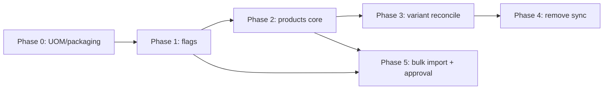
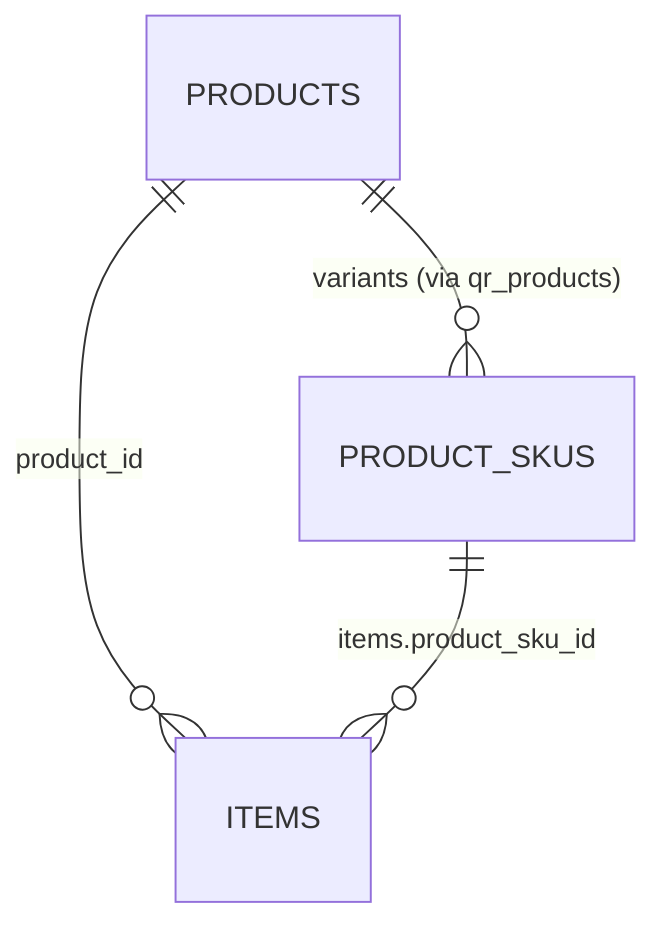

# Product / Item / UOM — Implementation Plan

> Status: **Implementation plan** (pending user decisions on §7)
> Sources: `PRODUCT_ITEM_DUAL_MODE_AND_BULK_UPLOAD_DESIGN.md`, `PRODUCT_ITEM_UOM_ARCHITECTURE.md`
> Scope: `core-service` primarily; `horizon-sync/apps/inventory` (web) and `BWmobile` (mobile) for UI toggles
> Date: 2026-08-23

---

## 1. Executive summary

Goal: move from the current "two records synced" model (`Item` ↔ `QRProduct` via `product_item_sync_service.py`) to a **single catalog core + optional module extensions**, with UOM referentially sound, variants reconciled, and customer-type behaviour driven by feature flags.

The plan is **6 phases, ordered by risk and dependency**:

| Phase | Theme | Risk | Blocks |
|---|---|---|---|
| 0 | UOM + packaging normalization | Low | Everything |
| 1 | Feature-flag dual-mode config | Low | Phases 2–5 |
| 2 | Shared catalog core (`products`) | Medium | 3, 4 |
| 3 | Variant reconciliation (Item ↔ ProductSKU) | High | 4, 5 |
| 4 | Remove sync service + duplicated columns | Medium | — |
| 5 | Bulk import engine + approval workflow | Medium | — |

> Rule: each phase ships independently and is reversible. No phase deletes data without a back-fill.

### 1.1 Locked decisions (2026-08-23)

| # | Decision | Choice |
|---|---|---|
| D1 | Phase 2 — `products` split | **Option A** (thin `products` core + keep `qr_products` as Qseal extension) |
| D2 | Phase 3 — variant reconciliation | **Option A** (link `Item` ↔ `ProductSKU`, keep both) |
| D3 | `auto_approve_single_create` flag | **default `true`** (trusted roles create directly as ACTIVE) |

---

## 2. Current-state reconciliation (important)

The two docs assumed no SKU layer existed on the Qseal side. **That assumption is wrong** — the code already has:

```
QRProduct (master: name, brand, gtin, landing_page, activation…)
   └── ProductSKU  (variant: sku_code, gtin, mrp, sr_number_type, image, warranty)
          └── QRBlock  (print batch)
                 └── ProductItem (serialized unit, sku_id FK)
```

with structured variant attributes (`VariantAttribute`, `VariantAttributeValue`, `ProductSKUAttributeValue`).

Meanwhile the **WMS side** models variants independently:

```
Item (variant_of self-FK, variant_attributes JSONB, has_variants)
   ├── Item.variant_of → parent Item
   └── Item.qr_product_id → qr_products.id
```

So we actually have **three variant representations**:
1. `QRProduct → ProductSKU` (structured attributes) — Qseal side.
2. `Item.variant_of` self-FK + `variant_attributes` JSONB — WMS side.
3. `Item.qr_product_id → qr_products.id` — the sync bridge.

The plan must **reconcile these**, not add a fourth. This is why Phase 3 is the hardest and has a decision point (§7-Q1).

### 2.1 Other verified facts

- Alembic is on **multiple heads** (`075_merge_dev_qseal_heads`, `076_add_full_item_product_sync_columns`). New migrations must branch from both heads and end in a merge, or be written to attach to a single head.
- `items.uom` is a `String` ("Nos"); `uom_conversions.from_uom/to_uom` are `String`; `item_groups.default_uom` is `String`. None are FK.
- `uoms` table exists (name, abbreviation) but lacks `uom_type` and `precision`.
- `item_packaging_units.unit_name` is a free string; no `packaging_types` master exists.
- `stock_levels.product_id` actually references `items.id` (naming landmine).
- `feature_flags` table exists with `tenant_id` scope — ready for dual-mode flags.
- `Item` carries ~30 Qseal-sourced columns marked `TODO(DEPRECATION)`.

---

## 3. Phase 0 — UOM + packaging normalization (low risk, do first) — ✅ IMPLEMENTED 2026-08-23

Independent of the Product/Item split; fixes the most bug-prone part of the model.

> **Implementation note:** legacy string columns (`items.uom`, `uom_conversions.from_uom/to_uom`, `item_groups.default_uom`, `item_packaging_units.unit_name`) are **kept as deprecated caches** alongside the new FK columns, not dropped. Dropping them requires migrating ~30 read call sites and is deferred to Phase 4 (alongside the sync-service removal). `stock_levels.product_id` was renamed to `item_id` at the DB level with the ORM attribute kept as `product_id` for backward compatibility.
>
> **Migrations:** `077_merge_phase0_heads`, `078_uom_fks`, `079_packaging_types`, `080_rename_stock_levels_product_id`. Run `alembic upgrade head`, then `python seed_uoms.py` and `python seed_packaging_types.py`.

### 3.1 Tasks

| # | Task | Files | Migration |
|---|---|---|---|
| P0-1 | Extend `UOM` with `uom_type` (count/weight/volume/length/time) and `precision` | `models/uom.py`, `schemas/uom.py` | `077` |
| P0-2 | FK-ize `Item.uom` → `base_uom_id` (back-fill from `uoms.abbreviation`/`name`, then drop `uom`) | `models/item.py`, `item_service.py`, `schemas/item.py` | `078` |
| P0-3 | FK-ize `UOMConversion.from_uom/to_uom` → `from_uom_id/to_uom_id`; make `item_id` nullable for **global** conversions | `models/uom_conversion.py`, services | `079` |
| P0-4 | FK-ize `ItemGroup.default_uom` → `default_uom_id` | `models/item_group.py` | `080` |
| P0-5 | New `packaging_types` master (code, name, uom_id, dims, weight, is_active); migrate `item_packaging_units.unit_name` → `packaging_type_id` | `models/packaging_types.py` (new), `models/item_packaging_unit.py` | `081` |
| P0-6 | Rename `stock_levels.product_id` → `item_id` | `models/stock_level.py`, queries | `082` |
| P0-7 | Seed UOM types/precision for existing seeded UOMs; back-fill script | `seed_uoms.py` | — |

**Acceptance:** `items.base_uom_id` FK enforced, conversions by FK, packaging by FK, no string UOM codes left in the WMS path.

---

## 4. Phase 1 — Feature flags for dual-mode (low risk)

### 4.1 Tasks

| # | Task | Files |
|---|---|---|
| P1-1 | Seed tenant flags: `wms_enabled`, `qseal_enabled`, `product_editable_manually`, `item_auto_create_product` | `seed_*` script or migration `083` |
| P1-2 | Flag helper (`get_flag(org, name)`) cached per request | `services/feature_flag_service.py` (new or extend) |
| P1-3 | Enforce in `item_service.create_item`: if `item_auto_create_product` → auto-create/link product | `item_service.py` |
| P1-4 | Enforce in product endpoints: if `product_editable_manually=false` → block manual create/edit (read-only product) | product endpoints |

**Acceptance:** a tenant with `wms_enabled=false` sees product-only UI; a tenant with `wms_enabled=true` gets auto-created read-only products per item. No data migration needed.

---

## 5. Phase 2 — Shared catalog core (`products`)

### 5.1 Decision context

`qr_products` already holds both catalog fields (name, sku, gtin, brand) and Qseal fields (landing_page, activation, warranty, qr_type). The docs propose splitting it. Two implementation options:

- **Option A — thin `products` core + keep `qr_products` as Qseal extension (recommended).**
  - New `products` (id, org_id, name, sku, gtin, brand_id, category_id, images, tags, type).
  - `qr_products.product_id` FK (1:1) → Qseal fields stay on `qr_products`.
  - `items.product_id` FK → products.
  - `product_skus.product_id` already exists → re-point or join through `qr_products`.
  - Least disruptive; existing `qr_products` endpoints keep working.
- **Option B — rename `qr_products` → `products`, extract Qseal fields to `qseal_products`.**
  - Cleaner end state, but touches every Qseal endpoint/schema/report.

**Decision D1: Option A** — thin `products` core + keep `qr_products` as the Qseal extension. (Option B rename is a later cosmetic step, out of scope for now.)

### 5.2 Tasks (Option A)

| # | Task | Files | Migration |
|---|---|---|---|
| P2-1 | New `products` model | `models/products.py` (new) | `084` |
| P2-2 | Back-fill `products` from `qr_products` (name/sku/gtin/brand) | back-fill script | — |
| P2-3 | Add `qr_products.product_id` FK (1:1) | `models/qr_product.py` | `085` |
| P2-4 | Add `items.product_id` FK (nullable for Type 2); back-fill via existing `qr_product_id` | `models/item.py` | `086` |
| P2-5 | `products` service + CRUD endpoints (list/create/update) | `services/product_service.py`, `api/.../products.py` | — |

**Acceptance:** every WMS Item and every Qseal product resolves to a `products` row; catalog fields live in one place.

---

## 6. Phase 3 — Variant reconciliation (highest risk, needs decision)

### 6.1 The core decision (see §7-Q1)

Two options:

- **Option A — link, don't unify (recommended, low risk).**
  - Add `Item.product_sku_id` FK (nullable) → `product_skus.id`.
  - For Type 1: a variant Item maps to a `ProductSKU`; the parent Item maps to the `QRProduct`/`products`.
  - `Item.variant_attributes` JSONB is kept as a display cache of `ProductSKU.sku_attribute_values` (or vice-versa). Deprecate `Item.variant_of` gradually.
- **Option B — unify on `ProductSKU` (clean, higher effort).**
  - `ProductSKU` becomes the single SKU layer; `Item` becomes its WMS extension (1:1 `product_sku_id`).
  - Migrate all WMS variant data (`Item.variant_of` tree + `variant_attributes`) into `ProductSKU` + `VariantAttributeValue`.
  - `Item.variant_of` dropped.

**Decision D2: Option A** — link `Item` ↔ `ProductSKU`, keep both. `Item.variant_of` is deprecated gradually, not dropped now.

### 6.2 Tasks (Option A)

| # | Task | Files | Migration |
|---|---|---|---|
| P3-1 | Add `Item.product_sku_id` FK (nullable) | `models/item.py` | `087` |
| P3-2 | Back-fill `Item.product_sku_id` by matching `Item.sku` → `ProductSKU.sku_code` (same org) | back-fill | — |
| P3-3 | On Item create (Type 1, has_variants): create/map `ProductSKU` under the linked product | `item_service.py` | — |
| P3-4 | Keep `variant_attributes` in sync with `sku_attribute_values` one-way (Item ← SKU) | `item_service.py` | — |

**Acceptance:** a WMS variant Item and its Qseal `ProductSKU` are the same logical SKU; no duplicated variant definitions created independently.

---

## 7. Phase 4 — Remove the sync service — ✅ IMPLEMENTED 2026-08-24

- Deleted `product_item_sync_service.py`.
- Removed all 4 call sites (`sync_item_to_product` / `sync_product_to_items`) in
  `item_service.py` and `qr_product_service.py`.
- Dropped 6 Qseal-only mirror columns from `items` (`industry`, `landing_page`,
  `warranty_period_months`, `qr_type`, `activation_method`, `sr_number_type`)
  via migration `083`. `brand_id` and `gtin` kept (WMS-relevant).
- Kept the auto-create-QRProduct blocks (backward compatibility), simplified to
  no longer read the dropped columns.

> **Deferred:** `QRProduct` still carries Item-sourced mirror columns
> (`item_code`, `uom`, rates, weight, etc.). They are no longer auto-synced
> (stale data), but dropping them is a separate, riskier cleanup — they are
> read by `qr_product_service` and friends.

Only after Phases 2–3 are in place (the FK join replaces the copied fields).

| # | Task |
|---|---|
| P4-1 | Delete `product_item_sync_service.py` and remove call sites in `item_service.py` (`create_item`/`update_item`) and `qr_product_service.py` |
| P4-2 | Drop the ~30 Qseal-sourced columns from `Item` (marked `TODO(DEPRECATION)`) |
| P4-3 | Update any schema/report reading those columns to join `products` / `qr_products` |

**Acceptance:** `Item` and `QRProduct` no longer duplicate any field; both reference `products` by FK.

---

## 8. Phase 5 — Bulk import engine + approval workflow — ✅ IMPLEMENTED 2026-08-24

### 8.1 Bulk import (one engine, three modes)

| # | Task | Files |
|---|---|---|
| P5-1 | Import service with `mode ∈ {product_only, product_with_items, item_with_auto_product}` | `services/catalog_import_service.py` (new) |
| P5-2 | Staging → validate → upsert on `(org, sku)` fallback `(org, gtin)`; idempotent | same |
| P5-3 | Row-level error report (line + field + reason) | schemas + response |
| P5-4 | Import endpoints + optional UI upload (web) | `api/.../catalog_import.py` |

### 8.2 Approval workflow (lightweight, no MDM)

| # | Task | Files |
|---|---|---|
| P5-5 | Extend `ItemStatus` with `DRAFT`, `PENDING_APPROVAL`; add approval columns (`submitted_by/at`, `approved_by/at`, `rejection_reason`) | `models/base.py`, `models/item.py` |
| P5-6 | Endpoints `submit / approve / reject / bulk-approve` | item endpoints |
| P5-7 | Feature flags `require_item_approval` (default `false`), `auto_approve_single_create` (default `true` per D3) | flags + service |

**Acceptance:** bulk onboarding idempotent; per-customer approval toggles.

---

## 9. Dependencies & ordering summary



Phases 0, 1, and 5 are **parallelizable** with Phase 2–3 work; only Phase 4 strictly follows Phase 3.

---

## 10. Risks & mitigations

| Risk | Mitigation |
|---|---|
| Multiple alembic heads (075, 076) | Branch new migrations from both, end in a `merge` (pattern already used at 064/070/075) |
| Breaking existing Qseal endpoints during `products` split | Option A keeps `qr_products` intact; add FK, don't rename |
| WMS variant data vs ProductSKU duplication | Phase 3 Option A links by SKU code, never creates parallel variants |
| `stock_levels.product_id` rename breaks queries | Do P0-6 as its own migration + grep all references first |
| Back-fill correctness | Every back-fill runs in a transaction, idempotent, with a pre/post count check |

---

## 11. Questions requiring your decision

1. ✅ **RESOLVED (D2):** Variant reconciliation (Phase 3) → **Option A** (link `Item` ↔ `ProductSKU`, keep both; deprecate `Item.variant_of` gradually).
2. ✅ **RESOLVED (D1):** `products` split (Phase 2) → **Option A** (thin `products` + keep `qr_products`).
3. **`item_code` vs `sku`** — which is the natural key for import upsert? Docs assume `sku` (fallback `gtin`); confirm.
4. **Bulk import scope** — CSV only, or Excel + CSV (PDF packing-slip already separate)?
5. **Approval flags** — is approval required for **both** customer types by default, or only Type 1?
6. **`Item.uom` back-fill** — map by `uoms.abbreviation` or `uoms.name`? Seed uses both ("Nos" default vs "PCS"/"KG" abbreviations).

---

## 12. Bottom line

- **Phase 0 first** (UOM/packaging FK-ization) — independent, low risk, high bug-prevention value.
- **Phase 1 next** (feature flags) — unlocks configurable dual-mode with zero data migration.
- **Phases 2–3 are the architectural core** and need your two decisions (§11-Q1/Q2) before I write code.
- **Phase 4** removes the sync debt; **Phase 5** delivers onboarding + approval.

Recommended first concrete step: I scaffold **Phase 0** (P0-1…P0-7) — the UOM FK migration chain + `packaging_types` master — since it needs no further input and unblocks everything else. Want me to proceed?

---

## 13. Appendix — SKU fields reference (item vs product vs Qseal)

### 13.1 The SKU fields

| Field | Table | Meaning | Level |
|---|---|---|---|
| `item_code` | `items` | internal ERP identifier (e.g. `ITM-001`) | WMS identity |
| `sku` | `items` | warehouse-facing SKU used in scanning / pick / put-away | WMS concrete |
| `sku_code` | `product_skus` | Qseal variant SKU (e.g. `FAN-1200-WHT`) | Qseal concrete |
| `sku` | `qr_products` | legacy Qseal *master* SKU | Qseal template |
| `sku` | `products` | shared catalog-core SKU | catalog template |

### 13.2 "Product SKU" = "Qseal SKU"

`ProductSKU` (the `product_skus` table) **is** the Qseal SKU — one entity. Its
`sku_code` is the concrete sellable variant that Qseal serializes
(`QRBlock` → `ProductItem` hang off it). Do not confuse it with `products.sku`,
which is the **template-level** SKU (one per product, not per variant).

### 13.3 Item SKU vs Qseal SKU — two views of one logical SKU



- **`items.sku`** = how the WMS sees a stockable SKU (what a picker scans).
- **`product_skus.sku_code`** = how Qseal sees the same sellable variant.

They are the **same logical SKU** from two modules, linked by
`items.product_sku_id → product_skus.id`. The values should match — migration
`082` back-fills exactly this (`items.sku = product_skus.sku_code`).

### 13.4 Full relationship chain

```
products (shared catalog core, template: "Nike Air Max 270", sku="AM270")
   ├── qr_products (Qseal master)  ── product_id → products
   │      └── product_skus (Qseal variant SKUs, sku_code="AM270-8-BLK")
   │             ├── qr_blocks → product_items (serialized units)
   │             └── items.product_sku_id ← the WMS link
   └── items (WMS SKUs, sku="AM270-8-BLK")
          ├── item_code = internal ERP id
          ├── product_sku_id → product_skus.id
          └── variant_attributes = cache of ProductSKU's attributes
```

### 13.5 Naming caveat

`product_skus` (concrete variant) and `products.sku` (template) are easy to
confuse. The concrete SKU (`product_skus.sku_code`) and the WMS SKU
(`items.sku`) are **one logical entity**; the `product_sku_id` link keeps them
in sync. `variant_attributes` on the item is a one-way-synced cache of the
SKU's structured attribute values.

---

## 14. Variant flags — behaviour matrix (true / false with examples)

Three tenant-scoped flags control variant handling. Their defaults are
`safe` (no behaviour change for existing orgs):

| Flag | Default | Role |
|---|---|---|
| `variant_structured_enabled` | `true` | master switch: structured axes vs legacy JSONB |
| `auto_create_sku_on_item` | `false` | auto-create/link a `ProductSKU` on item create |
| `auto_create_variant_axes` | `false` | auto-create missing `VariantAttribute` axes |

`auto_create_sku_on_item` and `auto_create_variant_axes` only matter when
`variant_structured_enabled = true`; they are ignored when it is `false`.

### Guards that always apply (regardless of flags)

`_ensure_product_sku()` only runs when the item is a **concrete variant child**
(`variant_of` is set — never the `has_variants=true` template), has a
`qr_product_id`, has non-empty `variant_attributes`, and is not already linked
(`product_sku_id is NULL`). It is **idempotent** (reuses an existing SKU with
the same `sku_code`).

### Combination 1 — `variant_structured_enabled = false` (legacy JSONB mode)

The other two flags are ignored. No `ProductSKU`, no `VariantAttribute`, no
link is created. The item keeps its flat `variant_attributes` JSONB and
`product_sku_id` stays `NULL`.

**Example** — create child item `T-Shirt / Red / M`:

```json
{ "item_name": "T-Shirt", "variant_of": "<parent>",
  "variant_attributes": { "color": "Red", "size": "M" } }
```

**Result:** no `ProductSKU` row, no `variant_attributes` table rows.
`items.product_sku_id = NULL`. The JSONB is the only source of truth.

### Combination 2 — structured = true, `auto_create_sku_on_item = false` (manual linking)

No auto-creation. But if `product_sku_id` is supplied manually (or already set
by migration `082`), `_sync_variant_attributes_from_sku()` derives the item's
`variant_attributes` from the SKU's structured attributes — one-way.

**Example** — SKU `AM270-8-BLK` exists with attributes
`{Size: "8", Color: "Black"}`. Create child item:

```json
{ "item_name": "Air Max 270", "variant_of": "<parent>",
  "product_sku_id": "<AM270-8-BLK-id>",
  "variant_attributes": { "size": "8", "color": "Black" } }
```

**Result:** no new SKU. After sync,
`item.variant_attributes = {"size": "8", "color": "Black"}` — keys lowercased,
values taken from the SKU's `display_value`. The item is linked to the SKU.

### Combination 3 — structured = true, `auto_create_sku_on_item = true`, `auto_create_variant_axes = false`

Auto-create the SKU, but **only map axes that already exist** in the
`variant_attributes` master. Unknown keys are skipped (not created).

**Example** — axes `size` and `color` already exist. Create child item:

```json
{ "item_name": "Air Max 270", "variant_of": "<parent>",
  "qr_product_id": "<qr product>", "sku": "AM270-9-WHT",
  "variant_attributes": { "size": "9", "color": "White", "material": "Mesh" } }
```

**Result:**
- `size=9`, `color=White` resolved (or `VariantAttributeValue` rows created) and linked.
- `material` **skipped** (no such axis, and auto-create-axes is off).
- A `ProductSKU` `AM270-9-WHT` is created under the QR product with only size + color.
- `items.product_sku_id` points at it; `variant_attributes` synced back to `{"size":"9","color":"White"}`.

### Combination 4 — structured = true, `auto_create_sku_on_item = true`, `auto_create_variant_axes = true` (full auto)

Auto-create the SKU **and** auto-create any missing axes from the JSONB keys.

**Example** — only axis `color` exists. Create child item:

```json
{ "item_name": "Air Max 270", "variant_of": "<parent>",
  "qr_product_id": "<qr product>", "sku": "AM270-8-LEATHER",
  "variant_attributes": { "color": "Black", "material": "Leather" } }
```

**Result:**
- `color=Black` linked to the existing axis.
- `material` **auto-created** as a new `VariantAttribute(name="material")` with value `Leather`.
- A `ProductSKU` `AM270-8-LEATHER` is created with both axes.
- The new `material` axis now exists for reuse by other items.

### Decision table

| structured | auto_create_sku | auto_create_axes | Effect |
|---|---|---|---|
| false | any | any | Legacy JSONB; no SKU/axes touched |
| true | false | any | Manual linking only; one-way sync if linked |
| true | true | false | Auto SKU; existing axes only; unknown keys skipped |
| true | true | true | Auto SKU + auto-create missing axes |
