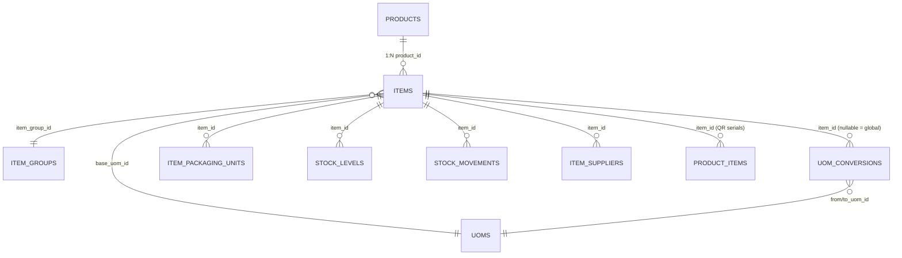

# Product / Item / UOM Architecture

> Status: **Proposal / Design Reference**
> Scope: `core-service` — inventory & WMS domain
> Related models: `items`, `item_groups`, `uoms`, `uom_conversions`, `item_packaging_units`, `stock_levels`, `qr_products`, `product_items`
> See also: `PRODUCT_ITEM_DUAL_MODE_AND_BULK_UPLOAD_DESIGN.md` (two customer types + bulk upload)

---

## 1. Purpose

This document captures the design rationale for separating **Product** (catalog) from **Item/SKU** (stockable unit), and for making **UOM** (Unit of Measure) referentially sound and scalable.

It is written against the **current** `core-service` data model and provides:

1. An honest assessment of what exists today.
2. The target entity model with foreign-key relationships.
3. A UOM redesign that scales to large datasets.
4. A zero-data-loss migration path.
5. A best-practices checklist to prevent bugs as the system matures.

---

## 2. Why Product and Item are different concepts

| Concept | Answers | Owned by | Example |
|---|---|---|---|
| **Product** | "What are we selling/offering?" | Catalog / commercial | Nike Air Max 270 |
| **Item / SKU** | "Which exact stockable variation?" | Inventory / operations | Air Max 270 / Size 8 / Black |
| **Inventory** | "How many do we have, and where?" | Warehouse | WH-01 / A-01-01 / 20 pcs |
| **Lot** | "Which batch/production run?" | Traceability | LOT-A123, expiry 2028-05 |
| **Serial** | "Which exact physical unit?" | Traceability | SN10001 |

They are separated because **catalog attributes** (brand, category, description, marketing) must not be duplicated on every stockable unit, while **inventory attributes** (uom, batch/serial tracking, reorder rules) must be precise down to the exact SKU.

```
Product
   │ 1:N
   ▼
Item / SKU
   │ 1:N
   ▼
Inventory ── Lot / Serial
```

---

## 3. Current state of the codebase

### 3.1 What already exists

| Model | Table | Role today |
|---|---|---|
| `Item` | `items` | **Single entity doing double duty** — both catalog *and* inventory SKU |
| `ItemGroup` | `item_groups` | Operational classification (hierarchy via `parent_id`) |
| `UOM` | `uoms` | UOM master (`name`, `abbreviation`) |
| `UOMConversion` | `uom_conversions` | Per-item conversion factors |
| `ItemPackagingUnit` | `item_packaging_units` | Physical pack hierarchy (each/case/pallet) with dimensions |
| `StockLevel` | `stock_levels` | Inventory per item per warehouse |
| `ItemSupplier` | `item_suppliers` | Supplier ↔ item mapping (correct pattern) |
| `QRProduct` | `qr_products` | QR anti-counterfeit serialization |
| `ProductItem` | `product_items` | Individual QR-tagged unit (serial level) |

### 3.2 Problems in the current model

1. **`Item` is overloaded.** It holds catalog fields (brand, category, marketing) *and* inventory fields (uom, sku, batch/serial, reorder). Variants are handled via a **self-FK** (`variant_of` + `variant_attributes`), which works but does not give a clean catalog entity.

2. **UOM is string-based, not FK-based.**

   | Field | Type | Risk |
   |---|---|---|
   | `items.uom` | `String("Nos")` | Free text, typos, no referential integrity |
   | `uom_conversions.from_uom` / `to_uom` | `String` | `"CASE"` vs `"case"` won't match |
   | `item_groups.default_uom` | `String` | Same problem |

3. **`UOM` master is too thin.** No `uom_type` (count/weight/volume), no `precision`, no `is_active`. This prevents category-aware conversion validation.

4. **`UOMConversion` and `ItemPackagingUnit` overlap.** Both store `conversion_factor`; two sources of truth for the same physical relationship.

5. **`Item ↔ QRProduct` column duplication.** `QRProduct` duplicates ~30 columns from `Item` (marked `TODO(DEPRECATION)` in both models). Duplicated state drifts silently.

6. **Naming landmine.** `stock_levels.product_id` actually references `items.id`. It works today but will confuse future developers.

---

## 4. Target architecture



### 4.1 New `products` table (catalog)

```python
class Product(Base):
    __tablename__ = "products"

    id, organization_id
    name, description
    brand_id          # FK -> brands.id
    category_id       # FK -> product_categories.id (nullable)
    product_type      # e.g. simple | variant_parent
    tax_category
    # ... catalog-only fields (marketing, images, seo) ...
```

### 4.2 `items` gains real foreign keys

```python
class Item(Base):
    __tablename__ = "items"

    product_id = Column(UUID, ForeignKey("products.id"), nullable=True, index=True)
    base_uom_id = Column(UUID, ForeignKey("uoms.id"), nullable=False)  # replaces Item.uom string
```

> **WMS-only note:** there is no `purchase_uom_id` / `sales_uom_id`. Inbound/outbound documents carry `qty + uom_id` per line and convert to base UOM at the edge.

**Decision point:** keep the `variant_of` self-FK only if nested variants (e.g. color → size) are required. Otherwise drop it and use `product_id + variant_attributes`.

### 4.3 Relationship summary

```
product_categories
       │ 1:N
    products
       │ 1:N
    items ──── item_groups
       │
       ├── uoms (base_uom_id)             # WMS-only: no purchase/sales UOM
       ├── uom_conversions (from/to_uom_id)
       ├── item_packaging_units
       ├── item_suppliers
       ├── stock_levels / stock_movements
       └── product_items (QR serials)
```

---

## 5. UOM redesign for scalability

### 5.1 Target UOM master

```python
class UOM(Base):
    __tablename__ = "uoms"

    id, organization_id
    code          # "EA", "KG", "L"
    name          # "Each", "Kilogram", "Liter"
    uom_type      # count | weight | volume | length | time
    precision     # 0 for EA, 3 for KG
    is_active
```

### 5.2 Two-level conversion model

```python
class UOMConversion(Base):
    __tablename__ = "uom_conversions"

    id, organization_id
    item_id       # NULLABLE -> NULL means "global" conversion
    from_uom_id   # FK -> uoms.id
    to_uom_id     # FK -> uoms.id
    factor        # Numeric(19,6); 1 from_uom = factor to_uom
    # unique (organization_id, item_id, from_uom_id, to_uom_id)
```

- **Global conversions** (`item_id IS NULL`): `1 kg = 1000 g`, `1 l = 1000 ml` — defined once per org.
- **Item-specific overrides** (`item_id` set): `1 case = 24 bottles` — only where packaging differs.

**Resolution order:** item-specific → global → same-uom (factor 1).

This avoids creating millions of conversion rows for standard metric relationships, which is the key scalability win.

### 5.3 Split measurement UOM from physical packaging

Current seed data mixes **measurement** UOMs (`KG`, `LTR`, `MTR`) with **physical packaging** units (`BOX`, `CTN`, `PLT`, `BAG`, `DRM`, `BTL`) in one `uoms` table. This is the root cause of the overlap between `uom_conversions` and `item_packaging_units`. Split them:

- **`uoms`** = measurement only (`PCS`/`EA`, `KG`, `L`, `M`) — pure quantity/measure conversion.
- **`packaging_types`** = physical containers (`CASE`, `BOX`, `CARTON`, `PALLET`, `DRUM`, `BAG`) — reusable master.

### 5.4 Packaging: master type + item-level conversion

Yes — maintain a **master-level packaging type**, but only the reusable part belongs at the master level:

| Aspect | Level | Example |
|---|---|---|
| Pack type, standard dimensions, weight, SSCC/barcode config | **Master (reusable)** | "EUR Pallet 1200×800", "Case" |
| How many base units fit in this pack | **Item (specific)** | Coke: 24 bottles/case; Tea: 100 bags/case |

A "pallet" is a pallet, but a pallet of Coke holds a different count than a pallet of shampoo. So the **conversion factor must stay item-level**, while the **type/dimensions can be a shared master**.

```python
class PackagingType(Base):
    __tablename__ = "packaging_types"

    id, organization_id
    code, name                 # "CASE", "PALLET", "EUR-PALLET"
    uom_id                     # FK -> uoms.id (the UOM this pack type maps to)
    length_mm, width_mm, height_mm, weight_grams   # standard/default dimensions
    is_active

class ItemPackagingUnit(Base):
    __tablename__ = "item_packaging_units"

    id, organization_id
    item_id                    # FK -> items.id
    packaging_type_id          # FK -> packaging_types.id  (replaces free-string unit_name)
    conversion_factor          # base units per pack  (item-specific)
    items_per_master_pack      # optional: nested pack count (e.g. cases per pallet)
    length_mm, width_mm, height_mm, weight_grams   # per-item override (nullable)
    is_base_unit
    is_active
```

Rules:
- `uom_conversions` = pure measurement conversion (e.g. `1 KG = 1000 GM`), `item_id` nullable for global.
- `item_packaging_units` = physical pack hierarchy, always item-scoped.
- Do **not** store the same conversion factor in both tables for the same pair.

### 5.5 Store inventory in ONE UOM only

- **Base UOM is the single source of truth.**
- Inbound/outbound documents carry `qty + uom_id` per line and convert to base at the edge (there is **no purchase/sales UOM** in this WMS-only flow).
- `quantity_on_hand` / `quantity_available` are always in base UOM.

```
Receipt: 10 CASE  →  convert to base →  240 EA stored
Pick:    5 CASE   →  convert to base →  120 EA deducted
```

---

## 6. Migration path (zero data loss)

1. **Create `products` table.**
2. **Back-fill products:**
   - For each standalone item (`variant_of IS NULL AND has_variants = false`): create a 1:1 `Product` row and set `items.product_id`.
   - For each variant parent (`has_variants = true`): promote the parent to a `Product`; set children's `product_id` to it (keep `variant_of` if nested variants are retained).
3. **Create the UOM FK migration:**
   - Back-fill `uoms` rows from distinct existing `items.uom` strings.
   - Add `items.base_uom_id` and populate from the mapping; drop `items.uom` after verification.
   - Migrate `uom_conversions.from_uom/to_uom` strings to `from_uom_id/to_uom_id` FKs.
   - Migrate `item_groups.default_uom` string to a nullable FK.
4. **Rename** `stock_levels.product_id` → `item_id` (referencing `items.id`).
5. **Introduce packaging master:** create `packaging_types`, back-fill from distinct `item_packaging_units.unit_name`, add `packaging_type_id` FK, drop `unit_name`.
6. **De-duplicate `Item ↔ QRProduct`:** point QR module at `items.id` and remove the ~30 synced columns.

> Each step is independently deployable and reversible; run them one migration at a time.

---

## 7. Best practices to avoid bugs at scale

1. **Base UOM is the single source of truth.** Persist every transaction line as `qty + uom_id`, convert to base once, store base quantity.
2. **Never use bare floats for quantity.** Use `Numeric` + per-UOM `precision`. For countable items use integer base UOM to avoid `0.9999999` drift.
3. **Immutable masters once referenced.** Do not edit/delete a UOM or conversion that has transactions; use soft-delete + `is_active` instead.
4. **Enforce referential integrity with FKs**, not string codes. This is the single biggest fix in the current UOM design.
5. **Append-only stock movement ledger.** `stock_levels` is a cache; truth lives in `stock_movements`. Wrap movements in a transaction and lock rows (`SELECT ... FOR UPDATE`) to prevent oversell.
6. **Eliminate duplicated state.** The `Item ↔ QRProduct` column sync is a drift bug; replace with a join.
7. **Consistent naming.** `stock_levels.product_id → items.id` should be renamed to `item_id`.
8. **Tenant-scoped composite uniqueness.** Keep `organization_id` in every unique constraint (e.g. `(org_id, item_code)`, `(org_id, sku)`, `(org_id, gtin)`).
9. **Index the hot path.** `item_id`, `organization_id`, `barcode/GTIN` on stock and movement tables.
10. **Round at the boundary, not in the middle.** Apply per-UOM precision only when converting/displaying, never on stored base quantities.

---

## 8. Bottom line

- Introduce `products` (catalog) → `items` (SKU) → `stock_levels` (inventory), with `product_id` FK on items.
- Make UOM fully FK-based (`base_uom_id`, `from/to_uom_id`), add `uom_type` + `precision`, and use the global + per-item conversion pattern.
- Split measurement UOM (`uoms`) from physical packaging (`packaging_types` master + item-level conversion factor).
- Reconcile the two overlapping conversion tables, de-duplicate `Item ↔ QRProduct`, and fix the `product_id → items.id` naming.
