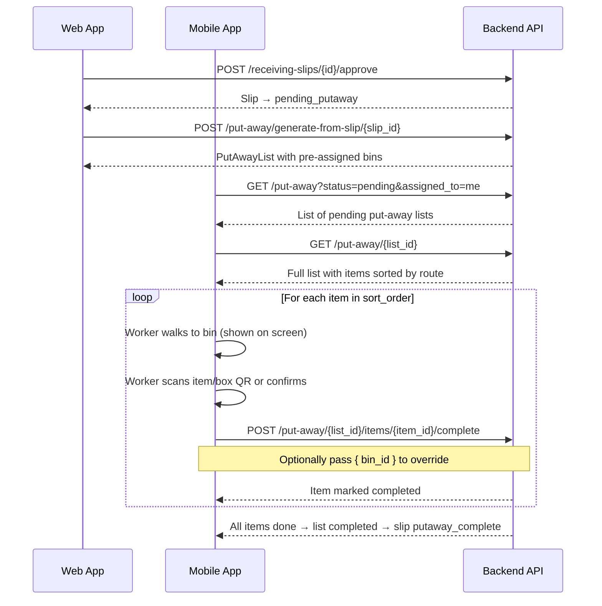
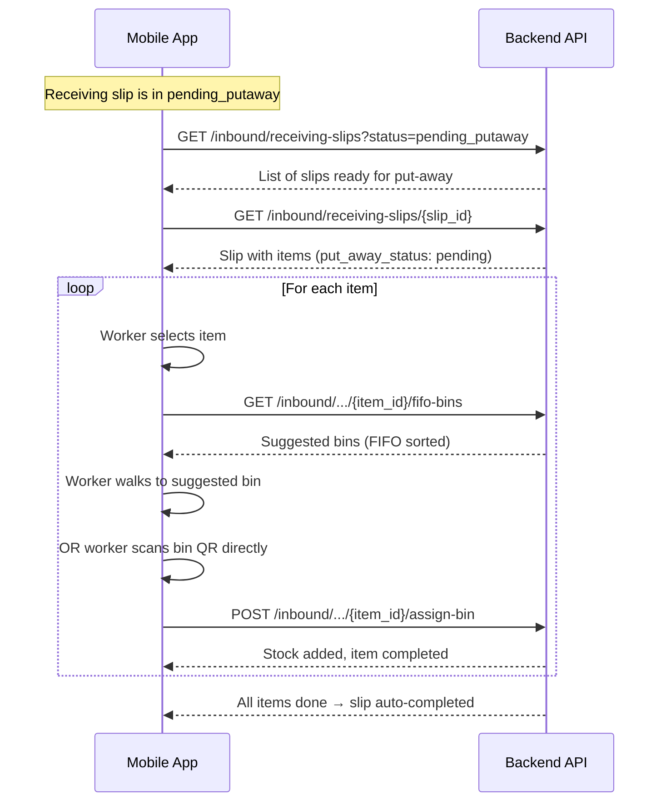

# Mobile App — Put-Away Integration Guide

> **Version**: 1.0
> **Date**: 2026-08-09
> **Base URL**: `https://core-service-production-66e9.up.railway.app/api/v1`

---

## Table of Contents

1. [Overview](#overview)
2. [Put-Away Concepts](#put-away-concepts)
3. [API Reference](#api-reference)
4. [Workflow A: Automated Put-Away List](#workflow-a-automated-put-away-list)
5. [Workflow B: Two-Step Inbound (Manual)](#workflow-b-two-step-inbound-manual)
6. [Bin Suggestions](#bin-suggestions)
7. [Mobile UX Flows](#mobile-ux-flows)
8. [Error Handling](#error-handling)

---

## Overview

Put-away is the process of moving received goods from the dock to their assigned bin locations. The system supports two paths:

| Path | When to Use | How Bins Are Assigned |
|------|-------------|----------------------|
| **A: Automated** | After approving a receiving slip | System pre-assigns bins using allocation rules, volumetric optimization, and routing |
| **B: Two-Step Manual** | Worker scans items one-by-one at the dock | Worker scans bin QR, system suggests bins, worker picks one |

Both paths share the same underlying bin suggestion logic.

---

## Put-Away Concepts

### Hierarchy

```
ReceivingSlip (approved → pending_putaway)
  └── PutAwayList (generated from slip)
        └── PutAwayListItem (one per SKU+batch)
              └── Assigned to a bin location
                    └── Stock added to BinStockLevel
```

### Item States

| State | Meaning |
|-------|---------|
| `pending` | Not yet put away — needs worker action |
| `completed` | Successfully put away into a bin |
| `skipped` | Skipped with a reason (damaged, no space, etc.) |

### Bin Selection Logic (What the System Does Behind the Scenes)

When suggesting bins, the system scores each candidate by:

1. **Allocation Rules** (highest priority): Bins exclusively assigned to the item's group get top score
2. **Consolidation**: Bins already holding the same item get bonus points
3. **Capacity**: Bins with more available space rank higher
4. **Proximity**: Bins closer to the worker's current position rank higher
5. **Reservations**: Bins reserved by other workers are excluded

---

## API Reference

### Base URL
```
https://core-service-production-66e9.up.railway.app/api/v1
```

### Authentication
All endpoints require `Authorization: Bearer <token>` header.

---

### 1. Generate Put-Away List from Approved Slip

```http
POST /put-away/generate-from-slip/{slip_id}
```

**Request Body** (optional):
```json
{
  "worker_id": "uuid-of-worker"  // optional, assigns the list to a worker
}
```

**Response** `201`:
```json
{
  "id": "uuid",
  "organization_id": "uuid",
  "put_away_list_no": "PAL-2026-00001",
  "warehouse_id": "uuid",
  "receiving_slip_id": "uuid",
  "status": "pending",
  "assigned_to": "uuid-or-null",
  "remarks": null,
  "total_items": 5,
  "completed_items": 0,
  "pending_items": 5,
  "items": [
    {
      "id": "uuid",
      "item_id": "uuid",
      "sku": "8901234567008",
      "item_name": "Air Fryer 4.2L",
      "batch_number": "KBY2EJ",
      "quantity": 10,
      "bin_location_id": "uuid",
      "bin_location_code": "A03-B02-L04",
      "bin_full_path": "Z01-A03-B02-L04-B01",
      "sort_order": 1,
      "status": "pending",
      "notes": null,
      "completed_at": null
    }
  ],
  "warnings": [],
  "created_at": "2026-08-09T10:00:00Z",
  "updated_at": "2026-08-09T10:00:00Z"
}
```

**Notes**:
- The receiving slip must be in `pending_putaway` status (approve it first)
- Items flagged as `damaged` or `rejected` are automatically skipped
- `sort_order` is the optimized walking route (1 = first stop, 2 = second, etc.)
- `warnings` may contain messages about items that couldn't be fully assigned

---

### 2. List Put-Away Lists

```http
GET /put-away?warehouse_id=<uuid>&status=pending&page=1&page_size=20
```

**Query Parameters**:

| Param | Type | Description |
|-------|------|-------------|
| `warehouse_id` | UUID | Filter by warehouse |
| `status` | string | `pending`, `in_progress`, `completed` |
| `page` | int | Page number (default 1) |
| `page_size` | int | Items per page (default 20, max 100) |

**Response**:
```json
{
  "put_away_lists": [
    {
      "id": "uuid",
      "put_away_list_no": "PAL-2026-00001",
      "warehouse_id": "uuid",
      "status": "pending",
      "assigned_to": "uuid",
      "total_items": 5,
      "completed_items": 2,
      "pending_items": 3,
      "created_at": "2026-08-09T10:00:00Z"
    }
  ],
  "pagination": {
    "page": 1,
    "page_size": 20,
    "total_items": 1,
    "total_pages": 1,
    "has_next": false,
    "has_prev": false
  }
}
```

---

### 3. Get Put-Away List Detail

```http
GET /put-away/{put_away_list_id}
```

Returns the full put-away list with all items, same shape as the generate response above. Items are sorted by `sort_order` (optimized walking route).

---

### 4. Complete a Put-Away Item

```http
POST /put-away/{put_away_list_id}/items/{item_id}/complete
```

**Request Body** (optional):
```json
{
  "bin_id": "uuid"  // optional: override the pre-assigned bin
}
```

**Response** `200`:
```json
{
  "id": "uuid",
  "item_id": "uuid",
  "sku": "8901234567008",
  "batch_number": "KBY2EJ",
  "quantity": 10,
  "bin_location_id": "uuid",
  "bin_location_code": "A03-B02-L04",
  "status": "completed",
  "completed_at": "2026-08-09T10:05:00Z"
}
```

**What happens**: Stock is added to the bin, bin capacity is recalculated, warehouse stock levels are updated, and the worker's bin reservation is released.

**If all items are completed**: The put-away list transitions to `completed` and the receiving slip transitions to `putaway_complete`.

---

### 5. Skip a Put-Away Item

```http
POST /put-away/{put_away_list_id}/items/{item_id}/skip
```

**Request Body**:
```json
{
  "reason": "Not enough space in bin"
}
```

**Response** `200`:
```json
{
  "id": "uuid",
  "sku": "8901234567008",
  "status": "skipped",
  "notes": "Not enough space in bin"
}
```

**When to skip**: Item is damaged, bin is full, item doesn't fit, or any other issue preventing put-away.

---

### 6. Get Bin Suggestions (FIFO) — For Two-Step Path

```http
GET /inbound/receiving-slips/{slip_id}/items/{item_id}/fifo-bins
```

**Response**:
```json
{
  "sku": "8901234567008",
  "bins": [
    {
      "bin_id": "uuid",
      "bin_path": "Z01-A03-B02-L04-B01",
      "batch_number": "KBY2EJ",
      "quantity_on_hand": 5,
      "stock_age_days": 12
    },
    {
      "bin_id": "uuid",
      "bin_path": "Z01-A05-B01-L02-B03",
      "batch_number": "KBY2EJ",
      "quantity_on_hand": 3,
      "stock_age_days": 45
    }
  ],
  "message": null
}
```

**FIFO Logic**: Bins are sorted by `created_at` ascending (oldest stock first). This helps workers consolidate stock by putting items where the same SKU already exists.

**Use case**: The two-step inbound path — after scanning an item QR, show this list so the worker knows which bins already hold this SKU.

---

### 7. Smart Bin Suggestion (WMS 3D) — For Advanced Use

```http
POST /wms-3d/suggest
```

**Request Body**:
```json
{
  "task_type": "put_away",
  "item_id": "uuid",
  "quantity": 10,
  "warehouse_id": "uuid",
  "worker_id": "uuid",
  "batch_number": "KBY2EJ",
  "exclude_bin_ids": ["uuid-already-full"],
  "worker_position": { "x": 0, "y": 0, "z": 0 },
  "limit": 5
}
```

**Response**:
```json
{
  "suggestions": [
    {
      "rank": 1,
      "bin_id": "uuid",
      "bin_code": "A03-B02-L04",
      "position": { "x": 2.5, "y": 1.0, "z": 0.0 },
      "score": 145.5,
      "reasons": [
        "Exclusive allocation for item group",
        "Same item already in bin (+20)",
        "High available capacity (85%)"
      ],
      "available_capacity": 85,
      "distance_from_worker": 3.2,
      "estimated_time_seconds": 45,
      "batch_number": "KBY2EJ",
      "expiry_date": null
    }
  ],
  "strategy_used": "allocation_plus_proximity",
  "total_candidates_evaluated": 24,
  "excluded_bins": ["uuid-reserved"]
}
```

**Use case**: Advanced mobile apps with 3D warehouse maps. Shows the best bin ranked by allocation, capacity, proximity, and consolidation.

---

### 8. Two-Step Inbound: Assign Bin to Slip Item

```http
POST /inbound/receiving-slips/{slip_id}/items/{item_id}/assign-bin
```

**Request Body**:
```json
{
  "bin_location_id": "uuid",
  "quantity": 10  // optional, defaults to full slip item quantity
}
```

**Response**:
```json
{
  "slip_item_id": "uuid",
  "sku": "8901234567008",
  "batch_number": "KBY2EJ",
  "quantity": 10,
  "bin_location_id": "uuid",
  "bin_full_path": "Z01-A03-B02-L04-B01",
  "put_away_status": "completed",
  "put_away_at": "2026-08-09T10:05:00Z"
}
```

**What happens**: Stock is added to the bin immediately, and the slip item is marked as put-away complete. When all items on the slip are done, the slip auto-transitions to `putaway_complete`.

---

## Workflow A: Automated Put-Away List

### Flow



### Mobile App Screens

**Screen 1: Put-Away List Selection**
```
┌──────────────────────────────────────┐
│  ← Put-Away Lists                    │
│──────────────────────────────────────│
│  Warehouse: Main Warehouse           │
│                                      │
│  ┌──────────────────────────────────┐│
│  │ PAL-2026-00001                   ││
│  │ 5 items · 2 done · 3 pending     ││
│  │ [████████░░░░] 40%               ││
│  │ Assigned to: You                 ││
│  └──────────────────────────────────┘│
│                                      │
│  ┌──────────────────────────────────┐│
│  │ PAL-2026-00002                   ││
│  │ 8 items · 0 done · 8 pending     ││
│  │ [░░░░░░░░░░] 0%                  ││
│  │ Assigned to: John                ││
│  └──────────────────────────────────┘│
└──────────────────────────────────────┘
```

**Screen 2: Item List (Walking Route)**
```
┌──────────────────────────────────────┐
│  ← PAL-2026-00001    📋 5 items      │
│──────────────────────────────────────│
│  Route optimized — follow order      │
│                                      │
│  ✅ #1 Air Fryer 4.2L               │
│     Batch: KBY2EJ · Qty: 10         │
│     Bin: A03-B02-L04                │
│                                      │
│  ▶ #2 Coffee Maker 600ml     ← NOW  │
│     Batch: ZMOYRA · Qty: 5          │
│     Bin: A05-B01-L02                │
│     [Scan Item]  [Skip]             │
│                                      │
│  ⬜ #3 Toaster 800W                  │
│     Batch: 22OXW7 · Qty: 8          │
│     Bin: A05-B01-L03                │
│                                      │
│  ⬜ #4 Hand Blender 300W             │
│     Batch: PHB-300 · Qty: 6         │
│     Bin: A07-B03-L01                │
│                                      │
│  ⬜ #5 Sandwich Maker 750W           │
│     Batch: PSM-750 · Qty: 4         │
│     Bin: A07-B03-L02                │
└──────────────────────────────────────┘
```

**Screen 3: Complete Item (Scan Bin)**
```
┌──────────────────────────────────────┐
│  Put Away — Coffee Maker 600ml       │
│──────────────────────────────────────│
│                                      │
│  Assigned Bin:                       │
│  🏷️ A05-B01-L02                     │
│  📍 Zone 1, Aisle 5, Bay 1, Level 2 │
│                                      │
│  Or scan a different bin:            │
│  ┌──────────────────────────────┐    │
│  │ 📷 Scan Bin QR               │    │
│  └──────────────────────────────┘    │
│                                      │
│  Item Details:                       │
│  SKU: 8901234567009                  │
│  Quantity: 5                         │
│  Batch: ZMOYRA                       │
│                                      │
│  [       Confirm Put-Away       ]    │
│  [       Skip Item              ]    │
└──────────────────────────────────────┘
```

---

## Workflow B: Two-Step Inbound (Manual)

### When to Use
- No put-away list was generated
- Worker wants to put away items immediately after receiving
- Small batches or ad-hoc put-away

### Flow



### Mobile App Screens

**Screen 1: Slip Items for Put-Away**
```
┌──────────────────────────────────────┐
│  ← RS-2026-00004   Put-Away          │
│──────────────────────────────────────│
│  ASN: ASN-2026-001                   │
│                                      │
│  Items to put away:                  │
│                                      │
│  ⬜ Air Fryer 4.2L                   │
│     Batch: KBY2EJ · Qty: 10         │
│     [Put Away →]                     │
│                                      │
│  ⬜ Coffee Maker 600ml               │
│     Batch: ZMOYRA · Qty: 5          │
│     [Put Away →]                     │
│                                      │
│  ✅ Toaster 800W                     │
│     Batch: 22OXW7 · Qty: 8          │
│     Bin: A05-B01-L03                 │
│                                      │
│  ⛔ Hand Blender (Rejected)          │
│     Reason: Damaged packaging        │
│                                      │
│  Progress: 1/4 done                  │
└──────────────────────────────────────┘
```

---

## Bin Suggestions

### Which Endpoint to Use

| Scenario | Endpoint | Returns |
|----------|----------|---------|
| Two-step inbound, need FIFO consolidation | `GET /inbound/.../fifo-bins` | Bins already holding this SKU, oldest first |
| Advanced 3D-aware suggestions | `POST /wms-3d/suggest` | Ranked bins with scores, reasons, distances |
| Automated put-away list | System handles it | Pre-assigned bins in the `PutAwayList` response |

### Suggestion Display (Mobile)

```
┌──────────────────────────────────────┐
│  Suggested Bins — Coffee Maker 600ml │
│──────────────────────────────────────│
│                                      │
│  🥇 A05-B01-L02    ★ Recommended    │
│     Already has this item            │
│     Available: 85% · 3.2m away       │
│     [Select This Bin]                │
│                                      │
│  🥈 A03-B02-L04                      │
│     Exclusive allocation             │
│     Available: 40% · 8.5m away       │
│     [Select This Bin]                │
│                                      │
│  🥉 A07-B03-L01                      │
│     Available: 60% · 12.1m away      │
│     [Select This Bin]                │
│                                      │
│  ── Or scan any bin QR ──            │
│  ┌──────────────────────────────┐    │
│  │ 📷 Scan Bin QR               │    │
│  └──────────────────────────────┘    │
└──────────────────────────────────────┘
```

---

## Mobile UX Flows

### Complete Put-Away Flow (Recommended)

```
START
  │
  ├─► Worker opens app → "Put-Away" tab
  │
  ├─► Shows list of:
  │     - Pending put-away lists (Path A)
  │     - Slips ready for put-away (Path B)
  │
  ├─► Worker selects a list/slip
  │
  ├─► Shows items to put away:
  │     Path A: Sorted by walking route
  │     Path B: Grouped by SKU+batch
  │
  ├─► Worker taps first item
  │     │
  │     ├─► [Scan Item QR] — confirms correct item
  │     │
  │     ├─► System shows assigned/suggested bin
  │     │     OR worker scans bin QR
  │     │
  │     ├─► Worker puts items in bin
  │     │
  │     ├─► [Confirm] → API call to complete
  │     │
  │     └─► Item marked ✅, next item highlighted
  │
  ├─► Repeat until all items done
  │
  └─► Success screen: "Put-away complete!"
        Slip/list auto-completed
```

### QR Scanning Flow

```
Worker scans a QR code:
  │
  ├─► Item QR detected?
  │     └─► Show item details + suggested bins
  │
  ├─► Bin QR detected?
  │     └─► If item is selected: auto-assign bin
  │     └─► If no item selected: show "Scan an item first"
  │
  └─► Unknown QR?
        └─► Show error: "Unrecognized QR code"
```

### Offline Considerations

- Cache the put-away list locally so workers can view it without connectivity
- Queue completion API calls and sync when back online
- Show sync status indicator

---

## Error Handling

| HTTP Status | Meaning | Action |
|-------------|---------|--------|
| `404` | List/item/slip not found | Refresh list, check ID |
| `409` | Conflict — item already completed | Skip to next item |
| `409` | Bin already reserved by another worker | Show next suggested bin |
| `422` | Validation error (e.g., bin not active) | Show error message, let worker retry |
| `422` | Bin capacity exceeded | Show "Bin full — try another" |
| `500` | Server error | Show "Try again" with retry button |

### Common Error Responses

**Bin already completed:**
```json
{
  "detail": "Item already assigned to a bin"
}
```
→ Mark as done locally, move to next item.

**Bin reserved:**
```json
{
  "detail": "Bin is currently reserved by another worker"
}
```
→ Show next suggested bin automatically.

**Bin not found:**
```json
{
  "detail": "Bin not found"
}
```
→ Show "Invalid bin QR — please scan again".

---

## Summary of Required Endpoints for Mobile

| # | Endpoint | When to Call |
|---|----------|--------------|
| 1 | `GET /put-away?status=pending` | Load list of pending put-away lists |
| 2 | `GET /put-away/{id}` | Load a specific put-away list with items |
| 3 | `POST /put-away/{id}/items/{id}/complete` | Worker confirms item is put away |
| 4 | `POST /put-away/{id}/items/{id}/skip` | Worker skips an item |
| 5 | `GET /inbound/receiving-slips?status=pending_putaway` | Load slips ready for manual put-away |
| 6 | `GET /inbound/receiving-slips/{id}` | Load slip detail with items |
| 7 | `GET /inbound/.../items/{id}/fifo-bins` | Show suggested bins for an item |
| 8 | `POST /inbound/.../items/{id}/assign-bin` | Assign bin and add stock (manual path) |
| 9 | `POST /wms-3d/suggest` | Advanced bin suggestions (optional) |
