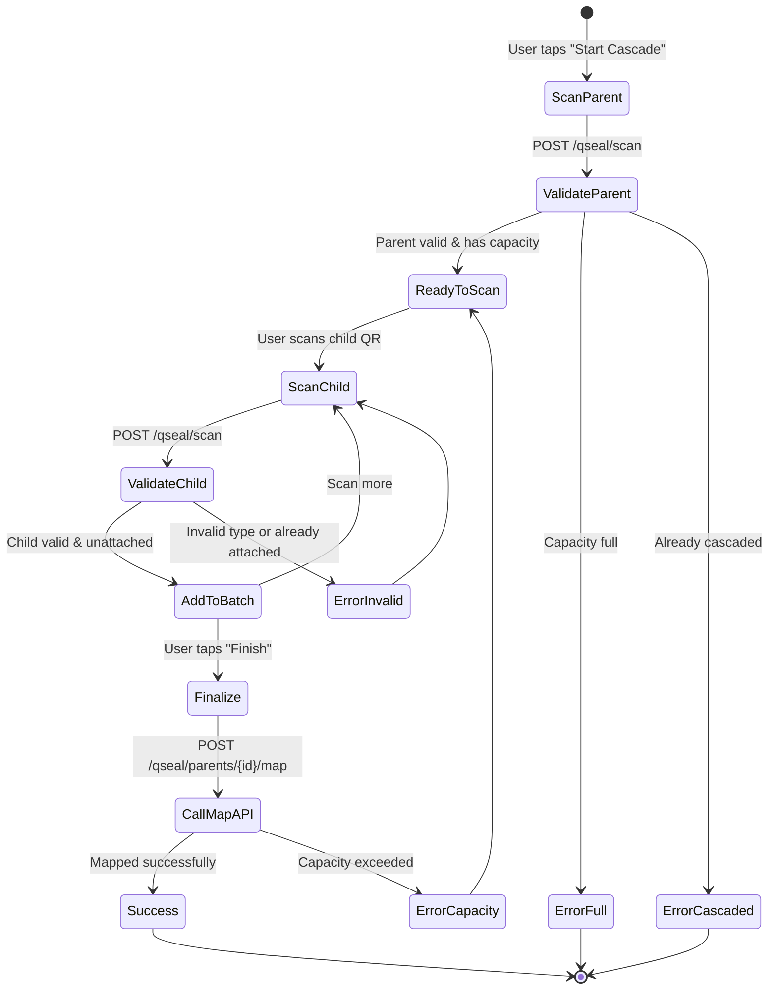

# QSeal — Mobile App Integration Guide

> **Base URL:** `{API_BASE}/qseal` > **Auth:** The `/scan` endpoint is public (no auth). All other endpoints require Bearer token.

---

## 1. Overview

The QSeal module allows mobile app users to **scan QSeal codes** and **cascade (link) child QSeals to parent QSeals** in the field. This guide covers the three core mobile flows.

---

## 2. Three Mobile Flows

### Flow 1: Scan a QSeal Code (Verification)

Scan a QSeal QR → validate it → view its details and hierarchy.

### Flow 2: Cascade (Link) Child to Parent

Scan a parent QSeal → scan child QSeals → link them together.

### Flow 3: View Cascade History

View all QSeal codes that have been cascaded.

---

## 3. API Endpoints Used by Mobile App

| Endpoint                       | Method | Auth      | Purpose                                  |
| ------------------------------ | ------ | --------- | ---------------------------------------- |
| `/qseal/scan`                  | `POST` | ❌ Public | Record a QSeal scan + get node details   |
| `/qseal/parents/{id}/children` | `GET`  | ✅        | List children already linked to a parent |
| `/qseal/parents/{id}/map`      | `POST` | ✅        | Link child QSeals to a parent (cascade)  |
| `/qseal/parents/{id}`          | `GET`  | ✅        | Get details of a specific QSeal node     |
| `/qseal/history`               | `GET`  | ✅        | View cascade history                     |

---

## 4. Flow 1: Scan & Verify a QSeal Code

### Step 1: User scans QR code → Extract serial number

The QR code contains a serial number like `QSL7A3B2C1D` (or a URL like `https://app.example.com/qseal/QSL7A3B2C1D`).

**If QR contains a URL**, extract the last path segment as the serial number.

### Step 2: Call the scan endpoint

```
POST /qseal/scan?organization_id={orgId}
Content-Type: application/json

{
  "serial_number": "QSL7A3B2C1D",
  "device_type": "android",
  "os": "Android 14",
  "browser": "Chrome",
  "ip_address": "192.168.1.1",
  "latitude": 19.0760,
  "longitude": 72.8777,
  "city": "Mumbai",
  "state": "Maharashtra",
  "country": "IN",
  "extra_data": {}
}
```

### Step 3: Handle the response

```json
{
  "node_id": "uuid",
  "serial_number": "QSL7A3B2C1D",
  "qseal_type": "pallet",
  "name": "Pallet-001",
  "parent_id": null,
  "children_count": 12,
  "message": "QSeal scan recorded for pallet 'Pallet-001'."
}
```

### Step 4: Display to user

```
┌──────────────────────────┐
│      ✅ QSeal Verified    │
│                          │
│  Pallet-001              │
│  Type: Pallet            │
│  Serial: QSL7A3B2C1D     │
│  Children: 12            │
│                          │
│  [View Children]         │
│  [Start Cascade]         │
└──────────────────────────┘
```

**Key fields to display:**

- `name` — Human-readable label
- `qseal_type` — Badge (Shipper/Pallet/Container)
- `serial_number` — Unique ID
- `children_count` — How many items are already linked
- `parent_id` — If not null, this is a child of another node

---

## 5. Flow 2: Cascade (Link Children to Parent)

This is the core mobile workflow. A warehouse worker scans a **parent QSeal** (e.g., a Pallet), then scans **child QSeals** (e.g., boxes) to link them.

### Step 1: Scan Parent QSeal

Scan the parent QR → call `POST /qseal/scan` → get parent details.

**Pre-checks before allowing cascade:**

- `parent.capacity` must be available: `children_count < capacity`
- `parent.app_cascade_map` must be `false` (already cascaded parents cannot be re-cascaded)

```
┌──────────────────────────────────┐
│  Parent: Pallet-001              │
│  Capacity: 12/50 slots used      │
│                                  │
│  Ready to cascade.               │
│  Scan child QSeals now.          │
│                                  │
│  [Scan Child QR]                 │
│                                  │
│  Scanned: 0 | Remaining: 38     │
└──────────────────────────────────┘
```

### Step 2: Scan Child QSeals (repeatedly)

For each child QR scanned:

1. Call `POST /qseal/scan` to validate the child serial number
2. Check response:
   - Must have a `qseal_type` compatible with the parent (e.g., shipper → pallet, pallet → container)
   - Must not already have a `parent_id` (i.e., must be unattached)
3. Add to local batch list

**Type validation rules:**
| Parent Type | Valid Child Types |
|-------------|-------------------|
| Container | pallet |
| Pallet | shipper |
| Shipper | box, unit (or individual QSealParameters) |

```
┌──────────────────────────────────┐
│  Scanned Child #3                │
│  Box-003 | QSL99887766           │
│                                  │
│  ✅ Valid — added to batch       │
│                                  │
│  [Scan Next]  [Finish Cascade]   │
│                                  │
│  Batch: 3 | Remaining: 35       │
└──────────────────────────────────┘
```

### Step 3: Finalize — Call Map Endpoint

When the user taps "Finish Cascade":

```
POST /qseal/parents/{parent_id}/map
Content-Type: application/json
Authorization: Bearer {token}

{
  "child_ids": [
    "uuid-child-1",
    "uuid-child-2",
    "uuid-child-3"
  ]
}
```

**Response:**

```json
{
  "parent_id": "uuid-parent",
  "mapped_count": 3,
  "message": "Successfully mapped 3 child QSeal(s) to parent."
}
```

**Success UI:**

```
┌──────────────────────────┐
│   ✅ Cascade Complete     │
│                          │
│   3 QSeals linked to     │
│   Pallet-001             │
│                          │
│   [Done]                 │
└──────────────────────────┘
```

---

## 6. Flow 3: View Cascade History

```
GET /qseal/history?page=1&page_size=20
Authorization: Bearer {token}
```

**Response:**

```json
{
  "events": [
    {
      "id": "uuid",
      "serial_number": "QSL7A3B2C1D",
      "scan_timestamp": "2026-08-05T12:30:00Z",
      "device_type": "android",
      "city": "Mumbai",
      "state": "Maharashtra",
      "country": "IN"
    }
  ],
  "pagination": {
    "page": 1,
    "page_size": 20,
    "total_items": 150,
    "total_pages": 8,
    "has_next": true,
    "has_prev": false
  }
}
```

**Mobile UI:**

```
┌──────────────────────────────────┐
│  Cascade History                 │
├──────────────────────────────────┤
│  🔍 Search by serial...          │
├──────────────────────────────────┤
│  QSL7A3B2C1D  Aug 5, 12:30 PM   │
│  Mumbai, MH, IN  📱 android      │
├──────────────────────────────────┤
│  QSL12345678  Aug 5, 11:15 AM   │
│  Delhi, DL, IN   📱 ios          │
├──────────────────────────────────┤
│  Load More...                    │
└──────────────────────────────────┘
```

---

## 7. Complete Cascade Flow State Machine



---

## 8. Error Handling for Mobile

| Scenario                                 | API Response                    | Mobile Action                                             |
| ---------------------------------------- | ------------------------------- | --------------------------------------------------------- |
| Invalid serial number                    | 404                             | Show "QSeal not found" + retry option                     |
| Parent at full capacity                  | 422                             | Show "Parent is full (50/50)" + disable cascade button    |
| Already cascaded                         | 422 (via app_cascade_map check) | Show "Already cascaded" message                           |
| Child already attached to another parent | Child has `parent_id`           | Show "This QSeal is already linked to another parent"     |
| Wrong child type for parent              | Business logic check            | Show "Box cannot be linked to a Container. Use a Pallet." |
| Map exceeds capacity                     | 422                             | Show "Cannot add X children. Only Y slots remaining."     |
| Network error                            | —                               | Show "Connection error. Retry?" with retry button         |

---

## 9. Offline Support Considerations

For warehouse environments with poor connectivity:

1. **Batch scans locally** — Store scanned serial numbers in local SQLite/AsyncStorage
2. **Validate on scan** — Call `/qseal/scan` for each child to validate before queuing
3. **Queue the map call** — If `/qseal/parents/{id}/map` fails due to network, retry with exponential backoff
4. **Sync status** — Show a sync badge: "3 pending" for un-synced cascades

---

## 10. Required App Permissions

| Permission          | Purpose                              |
| ------------------- | ------------------------------------ |
| Camera              | Scan QSeal QR codes                  |
| Location (optional) | Send lat/lng with scan for analytics |
| Internet            | API calls                            |

---

## 11. Quick Reference: API Calls Summary

```typescript
// 1. Scan a QSeal (public)
POST /qseal/scan?organization_id={orgId}
Body: { serial_number, device_type, os, ip_address, lat, lng, city, state, country }

// 2. Get parent details
GET /qseal/parents/{parentId}
Headers: Authorization: Bearer {token}

// 3. Get existing children under a parent
GET /qseal/parents/{parentId}/children?page=1&page_size=50
Headers: Authorization: Bearer {token}

// 4. Map children to parent (cascade)
POST /qseal/parents/{parentId}/map
Headers: Authorization: Bearer {token}
Body: { child_ids: ["uuid1", "uuid2"] }

// 5. View scan history
GET /qseal/history?serial_number={optional}&page=1&page_size=20
Headers: Authorization: Bearer {token}
```
