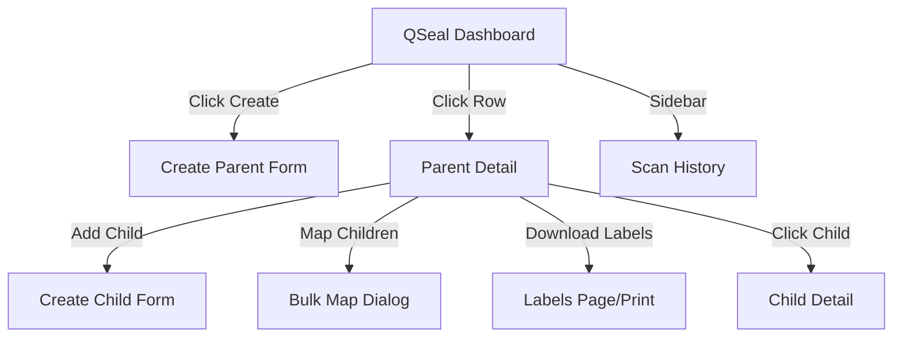

# QSeal — Dashboard/UI Integration Guide

> **Base URL:** `{API_BASE}/qseal`
> **Auth:** All endpoints (except `/scan`) require a valid Bearer token.

---

## 1. Overview

The QSeal module provides a **three-level parent-child hierarchy** for security seals:

```
Container (topmost)
  └── Pallet (middle)
        └── Shipper (bottom)
              └── Individual Units (QSealParameters)
```

This guide covers the **Dashboard UI** flows for managing QSeal nodes.

---

## 2. UI Pages Required

| Page | Purpose | Key API Calls |
|------|---------|---------------|
| **QSeal Dashboard** | Overview of all parent QSeal nodes | `GET /qseal/parents` |
| **Create Parent QSeal** | Form to create a container/pallet/shipper | `POST /qseal/parents` |
| **Parent Detail** | View parent details + children list | `GET /qseal/parents/{id}` + `GET /qseal/parents/{id}/children` |
| **Create Child QSeal** | Form to create a child under a parent | `POST /qseal/parents/{id}/children` |
| **Map Children (Bulk)** | Bulk-attach existing unattached children to a parent | `POST /qseal/parents/{id}/map` |
| **Scan History** | View scan audit trail for QSeal codes | `GET /qseal/history` |
| **Label Download** | Download/print labels for all children | `GET /qseal/parents/{id}/labels` |

---

## 3. Page-by-Page API Integration

### 3.1 QSeal Dashboard (List View)

**Endpoint:** `GET /qseal/parents?page=1&page_size=20&qseal_type=pallet`

**Response:**
```json
{
  "nodes": [
    {
      "id": "uuid",
      "organization_id": "uuid",
      "qseal_type": "pallet",
      "name": "Pallet-001",
      "capacity": 50,
      "serial_number": "QSL7A3B2C1D",
      "qseal_code_link": "/qseal/QSL7A3B2C1D",
      "app_cascade_map": false,
      "parent_id": null,
      "parent_app_id": null,
      "children_count": 12,
      "created_at": "2026-08-05T10:00:00Z"
    }
  ],
  "pagination": {
    "page": 1,
    "page_size": 20,
    "total_items": 45,
    "total_pages": 3,
    "has_next": true,
    "has_prev": false
  }
}
```

**UI Table Columns:**
| Column | Source Field | Notes |
|--------|-------------|-------|
| Serial | `serial_number` | Clickable → navigates to detail |
| Name | `name` | |
| Type | `qseal_type` | Badge: Shipper / Pallet / Container |
| Capacity | `capacity` | Show as `12 / 50` (children_count / capacity) |
| Cascaded | `app_cascade_map` | ✅/❌ badge |
| Created | `created_at` | Formatted date |
| Actions | — | View, Add Child, Labels, Map |

**Filter Controls:**
- Dropdown for `qseal_type`: All / Shipper / Pallet / Container

---

### 3.2 Create Parent QSeal

**Endpoint:** `POST /qseal/parents`

**Request Body:**
```json
{
  "name": "Pallet-001",
  "qseal_type": "pallet",
  "capacity": 50,
  "app_cascade_map": false,
  "extra_data": {}
}
```

**Form Fields:**
| Field | Input Type | Required | Validation |
|-------|-----------|----------|------------|
| Name | Text | ✅ | Max 20 chars |
| Type | Select | ✅ | Options: shipper, pallet, container |
| Capacity | Number | ✅ | Min: 1 |
| Extra Data | JSON Editor | ❌ | Optional metadata |

**On Success:** Redirect to Parent Detail page showing the newly created node with its auto-generated serial number.

---

### 3.3 Parent Detail Page

**Endpoint:** `GET /qseal/parents/{node_id}`

**Response:** Same as list item above plus `children_count`.

**UI Layout:**
```
┌─────────────────────────────────────────────┐
│ ← Back to QSeal Dashboard                    │
├─────────────────────────────────────────────┤
│ Parent: Pallet-001          Type: Pallet     │
│ Serial: QSL7A3B2C1D         Capacity: 12/50  │
│ Cascaded: No                Created: ...     │
├─────────────────────────────────────────────┤
│ [Add Child]  [Map Children]  [Download Labels] │
├─────────────────────────────────────────────┤
│ Children (12)                                │
│ ┌──────┬──────────┬──────┬────────┐         │
│ │Serial│ Name     │ Type │ Actions│         │
│ ├──────┼──────────┼──────┼────────┤         │
│ │QSL.. │ Box-01   │box   │ View   │         │
│ │QSL.. │ Box-02   │box   │ View   │         │
│ └──────┴──────────┴──────┴────────┘         │
│         ← 1 2 3 ... →                       │
└─────────────────────────────────────────────┘
```

**Children List:** `GET /qseal/parents/{node_id}/children?page=1&page_size=50`

---

### 3.4 Create Child QSeal

**Endpoint:** `POST /qseal/parents/{parent_id}/children`

**Request Body:**
```json
{
  "name": "Box-001",
  "qseal_type": "box",
  "capacity": null,
  "extra_data": {}
}
```

**Capacity Validation (Frontend):**
- Before showing the "Add Child" form, check `children_count < capacity`
- If at capacity, disable the button and show: `"Parent is full (50/50)"`
- The API also enforces this and returns 422 if violated

**On Success:** Append the new child to the children table.

---

### 3.5 Map Children (Bulk Attach)

**Endpoint:** `POST /qseal/parents/{parent_id}/map`

**Use Case:** When you have existing unattached QSeal nodes and want to bulk-attach them to a parent.

**Request Body:**
```json
{
  "child_ids": [
    "uuid-1",
    "uuid-2",
    "uuid-3"
  ]
}
```

**UI Flow:**
1. Show a multi-select list of **unattached** nodes (call `GET /qseal/parents` and filter for nodes where `parent_id` is not shown but they aren't root nodes — or provide a dedicated endpoint)
2. User selects checkboxes
3. On submit, send `child_ids` array
4. Show result: `"Successfully mapped 3 child QSeal(s) to parent."`

**Capacity Check:** The UI should calculate `children_count + selected_count <= capacity`. The API also enforces this.

---

### 3.6 Scan History

**Endpoint:** `GET /qseal/history?serial_number=QSL7A3B2C1D&page=1&page_size=50`

**Response:**
```json
{
  "events": [
    {
      "id": "uuid",
      "organization_id": "uuid",
      "serial_number": "QSL7A3B2C1D",
      "product_item_id": null,
      "scan_timestamp": "2026-08-05T12:30:00Z",
      "device_type": "mobile",
      "city": "Mumbai",
      "state": "Maharashtra",
      "country": "IN"
    }
  ],
  "pagination": { "page": 1, "page_size": 50, "total_items": 120, "total_pages": 3, "has_next": true, "has_prev": false }
}
```

**UI Table Columns:**
| Column | Source |
|--------|--------|
| Timestamp | `scan_timestamp` |
| Serial | `serial_number` |
| Device | `device_type` |
| Location | `city`, `state`, `country` |

---

### 3.7 Label Download

**Endpoint:** `GET /qseal/parents/{parent_id}/labels`

**Response:**
```json
{
  "parent_id": "uuid",
  "labels": [
    {
      "id": "uuid",
      "serial_number": "QSL12345678",
      "qseal_type": "box",
      "name": "Box-001",
      "qseal_code_link": "/qseal/QSL12345678",
      "parent_serial": "QSL7A3B2C1D"
    }
  ],
  "total": 12
}
```

**UI Action:**
- "Download Labels" button on the Parent Detail page
- Returns all children (up to 10,000) without pagination
- Frontend can render as a printable label sheet or export to CSV/PDF

---

## 4. Navigation Flow



---

## 5. Error Handling

| HTTP Status | Scenario | UI Action |
|-------------|----------|-----------|
| 404 | Node not found | Show "QSeal node not found" toast |
| 422 | Capacity exceeded | Show inline error: "Parent is at full capacity (50)" |
| 422 | Mapping exceeds capacity | Show: "Cannot map X children. Only Y slots remaining." |

---

## 6. Feature Flag

The QSeal module can be gated behind a feature flag. Check `GET /feature-flags/evaluate?flag=qseal_module_enabled` before rendering the QSeal sidebar menu item and pages.

```typescript
// Example frontend guard
const { data } = await api.get('/feature-flags/evaluate', { params: { flag: 'qseal_module_enabled' } });
if (data.enabled) {
  // Show QSeal in sidebar
}
```
