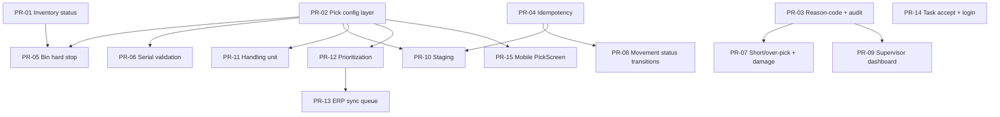

# WMS Picklist Execution — Delivery Plan (one workflow = one PR)

> Status: **Delivery plan**
> Source: `WMS_PICKLIST_EXECUTION_REQUIREMENTS.md`
> Scope: `core-service` (backend) + `BWmobile` (handheld) + `horizon-sync/apps/inventory` (web)
> Date: 2026-08-26

---

## 1. Delivery strategy

- **One workflow = one PR.** Each PR is a complete vertical slice:
  backend (model + migration + service + endpoint) → frontend (API client + UI) → tests (unit + e2e).
- **Foundations ship first** as their own small PRs, then workflows layer on top.
- **Test discipline:** ~4–6 focused backend unit tests per feature (positive + negative only),
  and 1–2 UI e2e specs per workflow. No exhaustive suites — the existing e2e coverage already
  covers the surrounding flows.
- **Configurability is enforced server-side** via a single `pick_settings` table + the existing
  `FeatureFlag` (NFR-007/008).

### Dependency graph

---

## 2. Foundation PRs

### PR-01 — Inventory status on bin stock (T-01)
Covers: **WF-003**, EX-007/010/011/013 (exclusion), config `pick.inventory_statuses_pickable`.
- **Backend:** `inventory_status` enum column (`available/blocked/damaged/hold/quality`) on
  `bin_stock_levels` + Alembic migration; update FEFO/FIFO resolution to filter by pickable statuses.
- **Frontend:** status badge + filter on the bin-stock screen; pass-through of status in API types.
- **Unit (positive):** available stock allocates; default status is `available`.
  **Unit (negative):** blocked/damaged/hold stock excluded from allocation; no-pickable-stock returns empty.
- **E2E:** seed a blocked bin → create pick list → line is not suggested/allocated.

**Open questions**
- **Q1 — Status naming:** `DRAFT` vs `OPEN`/`RELEASED` (applies to all workflow PRs). **Answer:** Yes — rename to `OPEN`/`RELEASED` in the workflow PRs.
- **Q2 — Inventory status set:** confirm exact set `available/blocked/damaged/hold/quality`; is `reserved` a separate field? **Answer:** No separate field — keep `reserved` in the set: `available/blocked/damaged/hold/quality/reserved`.

### PR-02 — Pick configuration layer (T-17)
Covers: **NFR-008** (all `pick.*` keys in §5 of the requirements doc).
- **Backend:** `pick_settings` table + migration; read-once-per-session config resolver;
  server-side enforcement helper; admin GET/PUT endpoints.
- **Frontend:** settings editor screen (tenant-scoped) with defaults from the requirements §5.
- **Unit:** default fallback when unset; override per-organization; enum validation.
  **Negative:** invalid key/type rejected.
- **E2E:** admin toggles `require_bin_scan` → picker UX reflects the flag.

### PR-03 — Reason-code & exception framework + immutable audit (T-02 + T-05)
Covers: all **EX-\* capture**, **WF-023**, **NFR-005**.
- **Backend:** `pick_exceptions` model (pick_list_item, reason_code, severity, reported_by,
  status, resolution, approver) + migration; capture endpoint; immutable audit trail for
  exceptions/approvals/overrides.
- **Frontend:** raise-exception dialog + reason-code master (configurable).
- **Unit (positive):** capture exception with reason code; audit row written.
  **Unit (negative):** duplicate capture rejected; invalid reason code rejected.
- **E2E:** picker reports a discrepancy → exception visible with correct reason + audit entry.

**Open questions**
- **Q10 — EX-001 vs EX-002 overlap:** should "bin empty" and "insufficient quantity" be distinct reason codes? **Answer:** Yes — distinct reason codes. `bin_empty` = zero found in the source bin (EX-001); `insufficient_quantity` = some found but less than required (EX-002). Both ship in the default `pick.reason_codes` master (`DEFAULT_REASON_CODES` in `app/core/pick_config.py`).

### PR-04 — Idempotency keys on scan/complete/cancel (T-04)
Covers: **NFR-003**, EX-017.
- **Backend:** idempotency-key header + server-side dedup table/log; derive a server-side key
  when the caller omits it.
- **Frontend:** client sends `Idempotency-Key` header.
- **Unit (positive):** same key replays → no double decrement.
  **Unit (negative):** different key → new transaction; missing key → derived key works.
- **E2E:** rapid double-tap on confirm → single movement posted.

**Open questions**
- **Q9 — Idempotency key source:** can callers (mobile/web) send an idempotency key, or derive one server-side from task + scan payload? **Answer:** Both. Callers send an `Idempotency-Key` header (the web client derives a deterministic key per action); when the header is omitted the server derives a stable key from the task + scan payload (`PickIdempotencyService.derive_key`), so EX-017 retries stay idempotent even without client support.

---

## 3. Workflow PRs

### PR-05 — Wrong-bin hard stop (T-06)
Covers: **WF-012**, ALT-001, EX-003, flag `pick.require_bin_scan`.
- Backend scan validation rejects non-source bin; frontend scan-first bin input + error modal.
- **Unit (+):** correct bin accepted. **Unit (−):** wrong bin blocked with hard-stop; flag off allows legacy behavior.
- **E2E:** scan wrong bin → hard stop; scan correct bin → proceeds.

### PR-06 — Serial validation (T-07)
Covers: **WF-014**, EX-005/006, ALT-003, flag `pick.require_serial`.
- Backend enforces serial belongs-to-SKU / available / not-consumed / not-blocked against `serial_no`;
  frontend serial capture + status display.
- **Unit (+):** available serial accepted. **Unit (−):** consumed, blocked, or wrong-SKU serial rejected.
- **E2E:** scan consumed serial → error; scan valid serial → accepted.

**Open questions**
- **Q5 — Serial enforcement:** mandatory hard stop for serialized items, or per-item policy (`has_serial_no`)? **Answer:** Per-item policy via `pick.require_serial` enum — `per_item` (default, follow `item.has_serial_no`), `always` (force for every scan), `never` (disable). A valid serial must exist against `serial_nos` for the scanned SKU and must not be `consumed`/`blocked` (`PickListService.validate_serial`).

### PR-07 — Short-pick / over-pick tolerance + damage/hold capture (T-08)
Covers: **WF-015**, EX-002/007/021, ALT-004/005; flags `over_pick_tolerance`, `allow_short_pick`.
- Backend tolerance rules + short-pick → exception (depends on PR-03); damage/hold reason capture at scan.
- **Unit (+):** short-pick within policy records exception and continues.
  **Unit (−):** over tolerance blocked; short-pick without approval blocked.
- **E2E:** scan less qty → short-pick exception flow; scan damaged item → damage reason captured.

**Open questions**
- **Q12 — Damage photo/comment (EX-007):** "optionally photo/comment if configured" — in scope now or later? **Answer:** Later. PR-07 captures the damage/hold reason code + affected quantity at scan (`PickScanRequest.reason_code` / `reason_quantity` → `pick_exceptions`); photo/comment attachment is deferred (can be added via the exception `details`/`evidence` payload later).

### PR-08 — Inventory movement status transitions (T-09)
Covers: **WF-016**.
- Backend `available → picked → in-transit-to-stage` state machine on bin stock + movement ledger,
  idempotent posting (depends on PR-04).
- **Unit (+):** status advances on pick. **Unit (−):** invalid transition rejected; replay doesn't double-move.
- **E2E:** complete a pick → stock shows `picked` status in UI.

### PR-09 — Exception queue + supervisor dashboard (T-03)
Covers: **ALT-004/005/007/008/011/012** (in-app queue).
- Frontend supervisor queue with filters, severity badges, resolve/approve actions;
  backend list/resolve/approve endpoints.
- **Unit (+):** list filters by severity/status; approve updates exception.
  **Unit (−):** non-supervisor cannot resolve.
- **E2E:** supervisor opens queue → resolves exception → status updated.

**Open questions**
- **Q11 — Alerts delivery:** in-app dashboard only, or also email/notification service (`communication.py`)? **Answer:** Both. Alerts are delivered in-app via the supervisor queue and, on resolve/approve, as best-effort in-app `NotificationService` rows to the reporter (`NotificationType.PICK_EXCEPTION`). Email via `CommunicationService.send_email` is the documented extension point (requires recipient-email resolution from identity-service).

### PR-10 — Staging lane + stage validation (T-10)
Covers: **WF-019/020**, EX-019/020, ALT-008, flag `pick.require_stage_scan`.
- Backend staging-lane model + transfer + stage-scan validation; frontend stage scan screen.
- **Unit (+):** transfer to lane updates status. **Unit (−):** wrong lane rejected; staging unavailable → exception.
- **E2E:** scan staging lane → task closes to staged.

**Open questions**
- **Q3 — Staging lanes:** lane-level (dock door/lane) or just a destination location? Full scan-at-staging in scope? **Answer:** A destination location — a `warehouse_locations` row with `location_type = 'staging'` (no new table). `stage-transfer` assigns the lane + moves picked bin stock `picked → in_transit_to_stage`; `stage-scan` validates the scanned lane (wrong-lane hard stop) and stamps `staged_at`.

### PR-11 — Handling unit association (T-11)
Covers: **WF-018**, flag `pick.enable_handling_unit`.
- Backend HU (trolley/carton/pallet) link to pick items; frontend HU select during pick.
- **Unit (+):** HU associates with item. **Unit (−):** duplicate HU rejected; flag off skips.
- **E2E:** assign HU → verify on pick detail.

**Open questions**
- **Q4 — Handling units:** tote/carton/pallet association during pick now, or is `item_packaging_units` enough for this phase? **Answer:** In scope now — a `handling_units` table (trolley/carton/pallet) plus a `pick_list_items.handling_unit_id` link. `item_packaging_units` is item-level packaging *definitions*, not pick-execution association; both are needed.

### PR-12 — Prioritization + task aging (T-12)
Covers: **WF-007**, ALT-011, flags `priority_fields`, `aging_threshold_minutes`.
- Backend priority/cutoff/wave/SLA fields + sort order; aging alert; frontend priority column + aging warning.
- **Unit (+):** higher priority sorts first. **Unit (−):** aging threshold triggers alert.
- **E2E:** set priority → list reorders; aged task shows warning.

**Open questions**
- **Q7 — Prioritization/wave:** orders arrive with dispatch cutoff/wave/route from SAP, or manual priority only? **Answer:** Both. SAP-supplied `dispatch_cutoff`/`wave`/`route` pass through on the pick list (available on `create_from_invoice`/import), and a manual `priority` override is set via `PATCH /outbound/{id}/priority`. The `pick.priority_fields` config list selects which fields drive ordering (cutoff/wave/route); manual `priority` always sorts first (higher = more urgent). Task aging (ALT-011) is computed from `created_at` age vs `pick.aging_threshold_minutes`, overridable per task via `sla_minutes`.

### PR-13 — ERP sync queue + retry + alert (T-13)
Covers: **WF-022**, ALT-009.
- Backend outbound message queue with retry + failure alert (reuse existing messaging/notification infra);
  frontend sync status indicator.
- **Unit (+):** successful sync dequeues. **Unit (−):** failure retries then alerts.
- **E2E:** simulate outage → retry shown → alert raised.

**Open questions**
- **Q8 — ERP integration mode:** real-time sync or async queue? **Answer:** Async queue. A new `erp_sync_messages` outbound queue decouples pick completion/dispatch from ERP delivery (WF-022). Messages are enqueued on pick-list completion (`status_update`) and dispatch creation (`dispatch_created`), delivered by a flush step with exponential-backoff retry (`pick.erp_sync_max_retries` / `pick.erp_sync_retry_backoff_minutes`), and — once retries are exhausted — a failure alert is raised in-app (`NotificationType.ERP_SYNC_FAILED`, ALT-009). The transport is a pluggable callable; the real SAP transport is the documented extension point (default logs + dequeues as a no-op).

**Delivered implementation**

*Why an async queue* — completing a pick list or creating a dispatch must never block on a slow
or failing ERP call. The queue decouples the WMS action from ERP delivery: events are recorded
immediately and delivered out-of-band.

- **Trigger points** (`app/api/v1/endpoints/outbound.py`): enqueue hooks in pick-list
  `complete` → `status_update` and `create_dispatch` → `dispatch_created` (best-effort).
- **Model** (`app/models/erp_sync_message.py`): `ErpSyncMessage` + `ErpSyncStatus`
  (`pending`/`sent`/`failed`). Columns: `entity_type`, `entity_id`, `operation`, `status`,
  `payload`, `attempt_count`, `max_attempts`, `last_error`, `next_attempt_at`, `created_by`,
  plus `pick_list_id`/`dispatch_record_id` as plain UUID references (no FK).
- **Service** (`app/services/erp_sync_service.py`):
  - `enqueue(...)` — queues a message, **deduping** against an existing `pending` message for the
    same `(entity_type, entity_id, operation)` so repeated triggers don't duplicate the queue.
  - `flush_pending(now=None)` — delivers only *due* pending messages; success → `sent`,
    transient failure → `attempt_count++` + exponential backoff (`base * 2^(n-1)`), exhausted
    budget → `failed` + in-app alert (`NotificationType.ERP_SYNC_FAILED`).
  - `_alert(...)` — raises the failure notification via `NotificationService`; never raises.
  - Transport is an injectable callable (`ErpTransport`); the default `_noop_transport` logs and
    dequeues — the real SAP transport is the documented extension point.
- **Config** (`app/core/pick_config.py`): `pick.erp_sync_max_retries` (default 3) +
  `pick.erp_sync_retry_backoff_minutes` (default 5), per-organization via `PickConfigResolver`.
- **Endpoints** (`app/api/v1/endpoints/outbound.py`): `GET /erp-sync` (list, paged) and
  `POST /erp-sync/flush` (deliver due messages) — declared as literal routes **before**
  `/{pick_list_id}`.
- **Frontend** (`apps/inventory/.../PickListView.tsx` → `ErpSyncPanel`): a collapsible footer
  panel below the pick-list table showing **ERP Sync Queue** with a `failed` count badge and two
  actions — **Refresh** (re-fetch) and **Flush retries** (call the flush endpoint, toast shows
  `{sent} sent, {retried} retried, {failed} failed`). Expanded view lists each message's entity,
  operation, status badge (`Pending`/`Sent`/`Failed`), `attempt_count/max_attempts`, and last error.
- **API client / hooks:** `utility/api/wms.ts` (`erpSyncApi`), `hooks/useWMS.ts`
  (`useErpSyncQueue` → `{ data, refetch, flush }`); types in `types/wms.types.ts`.
- **Tests:** `tests/test_erp_sync.py` (5 tests: enqueue dedup, flush success, retry/backoff,
  exhaustion → failed + alert, list).

**Gotchas**
- `enqueue` dedup uses `==` on `status` (not `.in_()`) — fake-session tests only handle `eq`/`ne`.
- `_alert` skips with a warning when `created_by` is `None` (`Notification.user_id` is non-nullable).
- `ErpSyncService.__init__` accepts `max_retries`/`backoff_minutes` overrides so tests are
  deterministic without seeding `PickSetting`.
- Adding config keys requires updating `tests/test_pick_settings.py::test_all_plan_keys_present`
  (asserts the exact catalog key set).
- ⚠️ Transport is a **no-op by default** — "Sent" means "flushed through the queue", not
  "confirmed received by SAP". SAP wire-up is a documented extension point.

### PR-14 — Task accept + login session controls (T-14)
Covers: **WF-009/010**, flags `login_lockout_attempts`, `session_timeout_minutes`.
- Backend accept endpoint with start timestamp; lock-after-failures + session timeout;
  frontend accept button + timeout handling.
- **Unit (+):** accept records start time. **Unit (−):** exceeded attempts locks; expired session rejected.
- **E2E:** accept task → timer starts; idle → session expires.

### PR-15 — Mobile PickScreen (T-15 + T-16) — ⚠️ blocked on Q6
Covers: **WF-008…023** on handheld + **NFR-010**, EX-017.
- Guided flow: task list → accept → nav → bin/SKU/serial/qty → exception → stage → complete/cancel;
  session resume.
- Deferred until mobile is confirmed in scope this round.

**Open questions**
- **Q6 — Mobile scope:** handheld execution in scope this round, or web-first with mobile next phase? **Answer:** _(pending)_

### PR-16 — NFR verification (T-18)
Not a feature PR — a verification PR: load test (≤1s), ERP outage simulation, replay/negative tests,
trace-one-shipment. Produces a report, not code changes.

---

## 4. Recommended sequence

1. PR-01 → PR-02 → PR-03 → PR-04 (foundation)
2. PR-05 → PR-06 → PR-07 → PR-08 → PR-09 → PR-10 → PR-11 → PR-12 → PR-13 → PR-14
   (workflows, each independently shippable)
3. PR-15 (when Q6 resolved)
4. PR-16 (last)

---

## 5. Open questions & answers index

Each PR documents its own open questions with a pending answer placeholder. Resolve the answer
in the PR plan before starting implementation.

| Q# | Topic | Resolved in |
|---|---|---|
| 1 | `DRAFT` vs `OPEN`/`RELEASED` naming | PR-01 (applies to all workflow PRs) |
| 2 | Exact inventory status set | PR-01 |
| 3 | Staging lane-level vs destination | PR-10 |
| 4 | HU association scope | PR-11 |
| 5 | Serial enforcement policy | PR-06 |
| 6 | Mobile scope | PR-15 |
| 7 | Priority source (SAP vs manual) | PR-12 |
| 8 | ERP sync mode | PR-13 |
| 9 | Idempotency key source | PR-04 |
| 10 | EX-001 vs EX-002 reason codes | PR-03 |
| 11 | Alerts delivery channel | PR-09 |
| 12 | Damage photo/comment scope | PR-07 |
